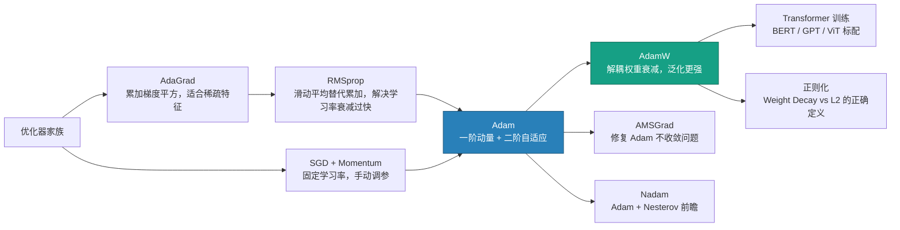
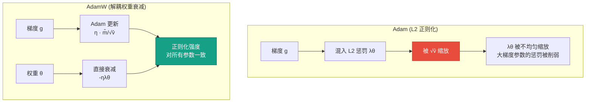

# Adam 与 AdamW 优化器详解

## 知识地图



## 前置知识

- **SGD 与 Momentum**：理解一阶梯度下降和动量法的基本原理
- **指数滑动平均 (EMA)**：知道 $m_t = \beta m_{t-1} + (1-\beta) x_t$ 的递归形式和等效窗口大小
- **学习率**：理解学习率控制更新步长，以及不同参数可能需要不同学习率的直觉
- **L2 正则化与 Weight Decay**：知道两者在 SGD 中等价但在自适应优化器中不等价
- **偏差-方差权衡**：理解正则化在防止过拟合中的作用

## 为什么会出现 (Why)

**SGD + Momentum** 虽然好用，但有一个致命缺陷：所有参数共享同一个全局学习率。而在深度网络中，不同层的参数梯度尺度差异极大——嵌入层的梯度可能比卷积层小几个数量级。固定学习率会导致：给嵌入层的学习率太小（学不动），给卷积层的学习率太大（震荡剧烈）。

**AdaGrad** 提出为每个参数自适应地调整学习率：梯度大的参数给小的学习率，梯度小的参数给大的学习率。但 AdaGrad 把历史所有梯度平方都加在一起，导致学习率单调递减、最终归零，训练早早停滞。

**RMSprop** 用指数滑动平均替代了 AdaGrad 的简单累加，解决了"学习率归零"的问题。但它只利用了梯度的二阶信息（方差）来调整学习率，缺乏一阶信息（方向动量）。

**Adam** 集大成：把 Momentum（一阶，决定方向）和 RMSprop（二阶，决定自适应步长）结合起来，再加上偏差校正修复冷启动问题。Adam 一出现就迅速成为深度学习的默认优化器。

**AdamW** 随后发现：Adam 中 L2 正则化的惩罚项被自适应学习率缩放，导致正则化效果打折扣。AdamW 将 Weight Decay 从梯度更新中解耦出来，直接对权重进行衰减，大幅提升了泛化能力。

## 解决什么问题 (Problem)

| 方法 | 解决的问题 |
|------|-----------|
| **AdaGrad** | 统一学习率无法处理不同参数的梯度尺度差异 → 按历史梯度大小自适应调整 |
| **RMSprop** | AdaGrad 学习率单调递减至零 → 用滑动平均代替累加，保留近期梯度信息 |
| **Adam** | RMSprop 只有步长没有方向惯性 + 冷启动偏差 → 加入一阶动量 + 偏差校正 |
| **AdamW** | Adam 中 L2 正则化被自适应缩放导致泛化差 → 解耦 Weight Decay |

## 核心思想 (Core Idea)

**Adam 像一个有惯性的自适应调速器——每个参数有自己的专属学习率，走得快的被限制，走得慢的被鼓励；AdamW 在这个调速器之外直接对权重进行定期"瘦身"，防止模型臃肿。**

---

## 数学模型/公式

### 1. Adam (Adaptive Moment Estimation)

核心思想：结合了"方向"与"步长"的优势。Adam 并不是凭空出现的，它是两种经典优化器思想的集大成者：

- **Momentum（动量）**：记录梯度的一阶矩（均值）。相当于物理学中的"惯性"，让优化过程在正确的方向上加速，并冲过局部的平缓区域。
- **RMSprop**：记录梯度的二阶矩（未中心化的方差）。它能感知每个参数梯度的剧烈程度。梯度变化剧烈的参数，学习率会被压低；梯度平缓的参数，学习率会被放大。

#### 1.1 一阶矩（梯度的指数滑动平均 —— 决定方向）

$$m_t = \beta_1 m_{t-1} + (1 - \beta_1) g_t$$

> **通俗解释：** $m_t$ 是过去历史梯度的加权平均，就像开车时看的不只是眼前的弯道，而是把前几秒的路况也考虑进去。$\beta_1$（默认 0.9）控制"记忆长度"——$\beta_1$ 越大，越依赖历史方向，越不愿意拐弯。

#### 1.2 二阶矩（梯度平方的指数滑动平均 —— 决定自适应步长）

$$v_t = \beta_2 v_{t-1} + (1 - \beta_2) g_t^2$$

> **通俗解释：** $v_t$ 衡量梯度的"波动幅度"。如果一个参数的历史梯度一直很狂暴（大起大落），$v_t$ 就很大，后续这个参数的学习率就会被压得很小，起到"踩刹车"的作用。反之，如果梯度一直波澜不惊，学习率就会被放大。$\beta_2$（默认 0.999）让二阶矩具有极长的记忆。

#### 1.3 偏差校正（冷启动的"加速器"）

$$\hat{m}_t = \frac{m_t}{1 - \beta_1^t}, \quad \hat{v}_t = \frac{v_t}{1 - \beta_2^t}$$

> **通俗解释：** 训练刚开始时 $m_0 = 0, v_0 = 0$，导致前几步的 $m_t$ 和 $v_t$ 严重偏小（被初始值 0 拖累）。除以 $1 - \beta^t$ 相当于把被"压扁"的值重新拉回正常尺度。随着训练进行，$t$ 变大，$1 - \beta^t \to 1$，校正效果自动消失。这就像给冷车启动时的发动机一个"加浓"喷油，热车后就恢复正常。

#### 1.4 参数更新

$$\theta_t = \theta_{t-1} - \eta \cdot \frac{\hat{m}_t}{\sqrt{\hat{v}_t} + \epsilon}$$

> **通俗解释：** 分子 $\hat{m}_t$ 告诉你该往哪个方向走（惯性方向），分母 $\sqrt{\hat{v}_t}$ 控制每一步的步幅大小（波动大的参数步幅小，波动小的步幅大）。$\epsilon$（默认 1e-8）只是防止分母为 0 的安全垫，对正常训练几乎没有影响。

---

### 2. AdamW：为何成为现代深度学习（特别是 Transformer）的标配？

#### 痛点：Adam 中的 L2 正则化失效了

在传统的 SGD 优化器中，**L2 正则化 (L2 Regularization)** 和**权重衰减 (Weight Decay)** 在数学上是完全等价的：它们都会在更新时让权重按比例缩小一点，防止模型过拟合。

**但是，在 Adam 中它们不再等价！**

如果你在 Adam 中使用 L2 正则化，惩罚项（$\lambda\theta$）会被混入梯度 $g_t$ 中。由于 Adam 的核心机制是用 $\sqrt{\hat{v}_t}$ 去缩放梯度，这就导致：**L2 的惩罚项也被自适应学习率缩放了**。

- 结果就是：那些梯度波动很大（$\hat{v}_t$ 很大）的参数，它们受到的正则化惩罚反而被大大削弱了。这就导致 Adam 无法有效地限制某些权重的膨胀。

#### 解决方案：解耦权重衰减 (Decoupled Weight Decay)

AdamW 的做法非常直接且优雅：**既然放进梯度里会被缩放，那我就把你拿出来！**

AdamW 将 Weight Decay 的步骤与梯度更新的步骤**完全解耦**：

$$\theta_t = \theta_{t-1} - \eta \cdot \left(\frac{\hat{m}_t}{\sqrt{\hat{v}_t} + \epsilon}\right) - \eta \cdot \lambda \theta_{t-1}$$

> **通俗解释：** 第一部分（括号内）是原汁原味的 Adam 自适应梯度更新，第二部分（$-\eta\lambda\theta_{t-1}$）是直接对权重的硬性衰减——每步都把所有权重按比例缩小一点，不管这个参数的梯度是大是小。这就保证了正则化对所有参数一视同仁，泛化能力因此大幅提升。

*(注意：在某些实现中，是直接减去 $\lambda\theta_{t-1}$ 而不乘 $\eta$，具体取决于框架，但核心思想都是将其移出自适应缩放的分式外)*

---

### 3. 其他自适应优化器公式

#### AdaGrad

$$G_t = G_{t-1} + g_t^2, \quad \theta_t = \theta_{t-1} - \frac{\eta}{\sqrt{G_t} + \epsilon} g_t$$

> **通俗解释：** 每个参数的累计梯度平方 $G_t$ 只会增加不会减少，所以学习率 $\eta / \sqrt{G_t}$ 单调递减。这就像一条只能走慢不能走快的单行道——对稀疏特征（某些参数很少被更新，$G_t$ 小，学习率大）很友好，但对频繁更新的参数，最终会"堵死"。

#### RMSprop

$$v_t = \beta_2 v_{t-1} + (1 - \beta_2) g_t^2, \quad \theta_t = \theta_{t-1} - \frac{\eta}{\sqrt{v_t} + \epsilon} g_t$$

> **通俗解释：** RMSprop 用一个"滑动窗口"代替了 AdaGrad 的"无限累加"。老的历史梯度平方会被遗忘，学习率不再单调递减。它只靠二阶矩调整学习率，没有方向惯性。

---

## 可视化展示

### Adam vs AdamW 的权重衰减对比



### 不同自适应优化器收敛曲线对比

```echarts
return {
  title: { top: 5,  text: '自适应优化器损失下降对比 (示意)' },
  xAxis: { type: 'value', name: '迭代步数' },
  yAxis: { type: 'value', name: 'Loss', min: 0 },
  legend: { top: 28,  data: ['AdaGrad', 'RMSprop', 'Adam', 'AdamW'] },
  series: [
    {
      name: 'AdaGrad', type: 'line', smooth: true,
      lineStyle: { color: '#e67e22', width: 2 },
      data: (function() {
        const d = [];
        for (let i = 0; i <= 100; i++) {
          d.push([i, 2.5 * Math.exp(-i * 0.02) + 0.8 * Math.exp(-i * 0.005)]);
        }
        return d;
      })()
    },
    {
      name: 'RMSprop', type: 'line', smooth: true,
      lineStyle: { color: '#9b59b6', width: 2 },
      data: (function() {
        const d = [];
        for (let i = 0; i <= 100; i++) {
          d.push([i, 2.2 * Math.exp(-i * 0.06) + 0.15]);
        }
        return d;
      })()
    },
    {
      name: 'Adam', type: 'line', smooth: true,
      lineStyle: { color: '#2980b9', width: 2 },
      data: (function() {
        const d = [];
        for (let i = 0; i <= 100; i++) {
          d.push([i, 2.0 * Math.exp(-i * 0.08) + 0.1]);
        }
        return d;
      })()
    },
    {
      name: 'AdamW', type: 'line', smooth: true,
      lineStyle: { color: '#16a085', width: 2.5 },
      data: (function() {
        const d = [];
        for (let i = 0; i <= 100; i++) {
          d.push([i, 2.0 * Math.exp(-i * 0.08) + 0.05]);
        }
        return d;
      })()
    }
  ],
  tooltip: { trigger: 'axis' },
  grid: { left: 60, right: 20, top: 55, bottom: 60 }
}
```

---

## 最小可运行代码

### PyTorch 实现

```python
import torch
import torch.nn as nn
import torch.optim as optim

model = nn.Sequential(
    nn.Linear(784, 256),
    nn.ReLU(),
    nn.Linear(256, 10)
)

# Adam
optimizer_adam = optim.Adam(
    model.parameters(),
    lr=1e-3,
    betas=(0.9, 0.999),
    eps=1e-8,
    weight_decay=0  # 注意：Adam 的 weight_decay 是 L2 正则化，不是解耦的！
)

# AdamW（推荐）
optimizer_adamw = optim.AdamW(
    model.parameters(),
    lr=1e-3,
    betas=(0.9, 0.999),
    eps=1e-8,
    weight_decay=0.01  # 解耦的 weight decay，真正起效！
)

# 配合余弦退火
scheduler = optim.lr_scheduler.CosineAnnealingLR(optimizer_adamw, T_max=100)
```

### 手动实现 AdamW 核心逻辑 (NumPy)

```python
import numpy as np

def adamw_update(param, grad, m, v, t, lr=1e-3, betas=(0.9, 0.999),
                 eps=1e-8, weight_decay=0.01):
    """
    param: 参数
    grad: 梯度
    m: 一阶矩缓存
    v: 二阶矩缓存
    t: 当前步数
    """
    beta1, beta2 = betas

    # 更新一阶矩和二阶矩
    m = beta1 * m + (1 - beta1) * grad
    v = beta2 * v + (1 - beta2) * grad**2

    # 偏差校正
    m_hat = m / (1 - beta1**t)
    v_hat = v / (1 - beta2**t)

    # AdamW: 梯度更新 + 解耦的权重衰减
    param = param - lr * m_hat / (np.sqrt(v_hat) + eps)
    param = param - lr * weight_decay * param  # 解耦的 weight decay

    return param, m, v
```

---

## 工业界应用

| 应用场景 | 使用的优化器 | 为什么 | 优点 | 缺点 |
|----------|-------------|--------|------|------|
| **BERT 预训练** | AdamW (lr=1e-4, wd=0.01) | Transformer 各层梯度尺度差异大，自适应学习率必须 | 训练稳定，收敛快 | 内存占用 3x SGD |
| **GPT / LLaMA 训练** | AdamW (lr=1e-4, wd=0.1) | 大模型不能承受训练崩溃 | 数十亿参数稳定训练 | Weight Decay 需要调得较大 |
| **ViT 图像分类** | AdamW (lr=1e-3, wd=0.05-0.1) | Transformer 架构 + 大数据需要自适应优化器 | 训练稳定 | Weight Decay 设低了泛化差 |
| **ResNet 图像分类** | SGD + Momentum (有时也用 AdamW) | SGD 在 CV 上泛化更好（经验结论） | 最终精度可能更高 | 需要精心调参 |
| **GAN 训练** | Adam (β1=0.5, lr=2e-4) | 生成器判别器非平稳博弈 | 快速动态适应 | β1 需要调低以降低惯性 |
| **目标检测 (YOLO)** | SGD + Momentum | 社区调参经验丰富，稳定性好 | 复现性好 | 训练周期长 |
| **强化学习 (PPO)** | Adam (lr=3e-4) | 非平稳数据分布 | 调参少 | 收敛可能不稳定 |

---

## 优缺点对比

| 优化器 | 核心思路 | 优点 | 缺点 | 适用场景 |
|--------|----------|------|------|----------|
| **AdaGrad** | 累加所有历史梯度平方 | 对稀疏特征天然友好 | 学习率单调递减至零，后期停止学习 | NLP 词向量、推荐系统稀疏特征 |
| **RMSprop** | 滑动平均替代累加 | 解决 AdaGrad 学习率衰减过快 | 缺少方向动量，收敛不如 Adam 快 | RNN、梯度不稳定场景 |
| **Adam** | Momentum（一阶） + RMSprop（二阶） + 偏差校正 | 收敛极快，调参门槛低，万金油 | L2 正则化失效，泛化能力有时不如 SGD | 各种深度学习任务的通用首选 |
| **AdamW** | Adam + 解耦的 Weight Decay | 修复 Adam 泛化问题，大模型标配 | 额外超参数 weight_decay 需调节 | Transformer、BERT、GPT、ViT |
| **Nadam** | Adam + Nesterov 前瞻 | 理论收敛更快 | 实践中与 Adam 差异不大 | 对收敛速度有极致要求的场景 |

---

## 对比表格

### Adam vs AdamW 核心区别

| 维度 | Adam | AdamW |
|------|------|-------|
| **Weight Decay 方式** | 混入梯度，被 $\sqrt{\hat{v}}$ 缩放 | 直接对权重衰减，独立于梯度缩放 |
| **正则化效果** | 不均匀：大梯度参数正则化弱 | 均匀：所有参数同等衰减 |
| **泛化能力** | 较弱 | 更强（尤其在大模型上） |
| **超参数调优** | 调 weight_decay 效果不明显 | weight_decay 是独立维度，调节直观 |
| **PyTorch 推荐** | 0.11.0 以前默认 | 0.11.0+ 推荐，Transformer 标配 |
| **典型 weight_decay** | 不敏感，通常设 0 | 敏感：小模型 1e-4~5e-4，Transformer 0.05~0.1 |

### Adam vs SGD 实战选型

| 维度 | Adam/AdamW | SGD + Momentum |
|------|------------|----------------|
| **快速原型** | 首选，默认参数直接跑 | 需要时间调参 |
| **CV 最终精度** | 可用 | 通常更高（精心调参后） |
| **NLP / Transformer** | 必须 | 几乎不可行 |
| **GAN / RL** | 首选 | 不稳定 |
| **调参经验要求** | 低 | 高 |
| **训练速度** | 快 | 慢 |
| **内存占用** | 高（m + v 双缓存） | 低（仅速度缓存） |

---

## 学完后建议继续学习

- [SGD / Momentum / Nesterov](sgd-momentum.md) — 理解一阶优化的基础，以及动量法的物理直觉
- [L1 / L2 正则化](l1-l2-regularization.md) — 深入理解 Weight Decay 与 L2 正则化的数学等价条件
- [MSE / MAE / Huber Loss](mse-mae-huber.md) — 不同损失函数的梯度行为直接影响 Adam 的二阶矩估计
- [Cross-Entropy Loss](cross-entropy.md) — 分类任务中 Softmax + CE 的优雅梯度与 Adam 的配合

---

## 高频面试题

### Q1: Adam 的偏差校正为什么是必要的？推导一下。

**标准回答：** Adam 初始化 $m_0 = 0, v_0 = 0$。在训练初期，由于 $\beta_1$ 和 $\beta_2$ 通常接近 1（如 0.9 和 0.999），前几步的 $m_t$ 和 $v_t$ 严重偏向于 0。例如第 1 步的 $m_1 = 0.1 g_1$（被缩小了 10 倍），第 2 步 $m_2 \approx 0.19 g_1 + 0.1 g_2$（依然偏小）。

偏差校正的核心是：$m_t$ 的期望是 $E[m_t] = E[g_t] \cdot (1 - \beta_1^t)$。因此 $\hat{m}_t = m_t / (1 - \beta_1^t)$ 是无偏估计。对于 $v_t$ 同理。

实际意义：如果没有偏差校正，训练初期学习率实际上被缩小了 10-1000 倍，模型几乎"学不动"。有偏差校正后，初期步长在一开始就能达到正常尺度，模型快速启动。

### Q2: 为什么 AdamW 要将 Weight Decay 解耦？Adam 中的 L2 正则化具体哪里出了问题？

**标准回答：** 在 Adam 中，如果使用 L2 正则化，损失函数为 $L_{total} = L_{data} + \frac{\lambda}{2}\|\theta\|^2$，梯度为 $g_t = \nabla L_{data} + \lambda\theta$。这个梯度进入 Adam 更新公式时会被除以 $\sqrt{\hat{v}_t}$：

$$\theta_t = \theta_{t-1} - \eta \cdot \frac{\hat{m}_t}{\sqrt{\hat{v}_t} + \epsilon}$$

其中 $\hat{m}_t$ 包含了 $\lambda\theta$ 的贡献。结果：对于 $\sqrt{\hat{v}_t}$ 很大的参数（历史梯度波动大），正则化惩罚 $\lambda\theta$ 被大幅削弱；而对于 $\sqrt{\hat{v}_t}$ 很小的参数，正则化惩罚被放大。

AdamW 的解决方式是：
$$\theta_t = \theta_{t-1} - \eta \cdot \frac{\hat{m}_t}{\sqrt{\hat{v}_t} + \epsilon} - \eta\lambda\theta_{t-1}$$

Weight Decay 项完全绕过了自适应缩放，对所有参数一视同仁，正则化效果恢复。实验证明（Loshchilov & Hutter, 2019），这一改动在 ImageNet 上带来约 1-2% 的 Top-1 提升。

### Q3: Adam 在什么情况下可能不收敛？AMSGrad 如何尝试修复？

**标准回答：** Adam 的收敛问题由 Reddi et al. (2018) 提出。核心在于 Adam 用指数滑动平均来估计二阶矩 $v_t = \beta_2 v_{t-1} + (1-\beta_2)g_t^2$。这意味着旧梯度平方的影响随时间指数衰减。在某些目标函数下，Adam 会"遗忘"某些方向上的大梯度历史，导致学习率在某维度上不降反升，从而发散。

AMSGrad 的修复方案简单：将 $v_t$ 改为单调非递减：
$$\hat{v}_t = \max(\hat{v}_{t-1}, v_t)$$

这样保证了学习率 $\eta / \sqrt{\hat{v}_t}$ 只能减小不能增大，从而恢复了收敛保证。但在实践中，AMSGrad 的性能通常与 Adam 相当甚至略差，因为它过于保守。

### Q4: Transformer 训练时 AdamW 的 weight_decay 通常设为 0.05~0.1，而 ResNet 的 SGD weight_decay 通常为 1e-4~5e-4。为什么差别这么大？

**标准回答：** 有三个原因：(1) AdamW 中 weight_decay 是直接对权重衰减，而 SGD 中的 weight_decay 实际上等价于 L2 正则化。两者的"有效强度"不等价——AdamW 中 weight_decay 的作用更直接。(2) Transformer 的参数量远大于 ResNet（数十亿 vs 几千万），过拟合风险更高，需要更强的正则化。(3) Transformer 没有像 CNN 那样的归纳偏置（局部连接、平移不变性），模型更容易记忆噪声，因此需要更强的显式正则化来补偿缺乏的结构先验。

### Q5: 为什么有时候 Adam 的训练 loss 比 SGD 低，但测试精度反而差？

**标准回答：** 这指向泛化差距（generalization gap）问题。Adam 倾向于收敛到**尖锐的极小值 (sharp minima)**——损失曲面上一个非常深但极窄的坑。训练 loss 很低，但参数稍微一扰动，loss 就剧烈上升。SGD 的梯度噪声反而帮助它收敛到**平坦的极小值 (flat minima)**——一个较浅但宽阔的盆地，参数扰动不会显著影响 loss，因此测试集上表现更好。

原因在于 Adam 的自适应机制让每个参数都能精确地走向梯度指示的方向，高效地"钻"进尖锐的坑；SGD 的随机噪声让它容易"跳过"尖锐的坑，只在宽阔的盆地中停下来。这也解释了为什么 AdamW 配合更强的 weight_decay 能够部分缓解这一问题——weight_decay 鼓励更小的权重范数，倾向于更平坦的解。
