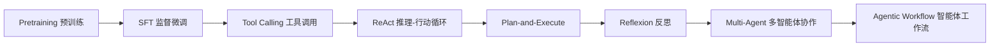
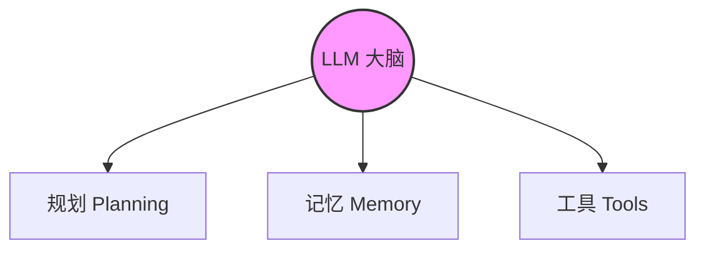
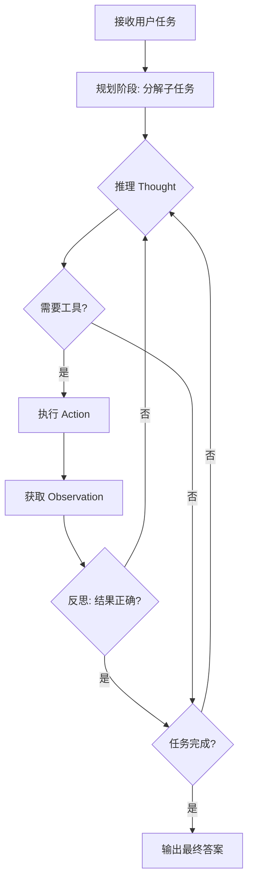
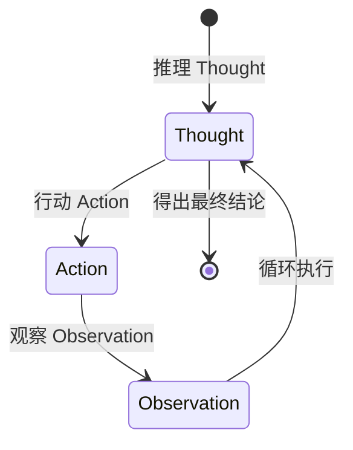
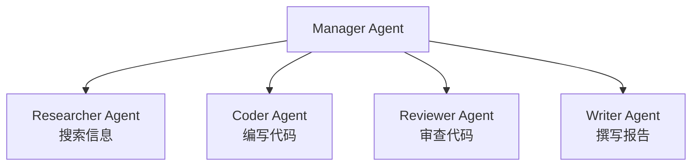

# Agentic Workflows (智能体工作流)

## 知识地图



## 前置知识

- **LLM 基础**：理解语言模型的输入-输出模式
- **Prompt Engineering**：Few-Shot、CoT 等基础提示技术
- **Function Calling**：LLM 调用外部工具的基本机制
- **SFT**：监督微调的基本概念

## 为什么会出现 (Why)

传统 LLM 的使用方式是"输入文本 → 输出文本"，但这种模式有根本局限：
- **无法获取实时信息**：模型知识截止于训练日期
- **无法执行精确计算**：数学运算依赖概率生成，容易出错
- **无法与外部系统交互**：不能查询数据库、调用 API、操作文件
- **无法处理复杂多步任务**：单次前向传播的"思考深度"有限

Agentic Workflow 的出现，让 LLM 从一个"被动回答者"变成了一个能**规划、使用工具、迭代反思**的自主系统。

## 解决什么问题 (Problem)

让 LLM 能够在复杂环境中**自主完成多步任务**：搜索信息、编写代码、调用工具、验证结果、纠错重试。核心是将 LLM 从"静态知识库"升级为"动态执行引擎"。

## 核心思想

Agent 不是简单地"输入 → 输出"，而是可以**规划、使用工具、反思、迭代**的自主系统，能在复杂环境中完成多步任务。

## Agent 的核心组件



$$\text{Agent} = \text{LLM} + \text{Planning} + \text{Memory} + \text{Tools}$$

### 1. 规划 (Planning)

- **任务分解**：将大任务拆分为子任务
- **反思 (Reflection)**：检查中间结果，纠正错误

### 2. 记忆 (Memory)

- **短期记忆**：当前对话的上下文
- **长期记忆**：跨对话持久化的信息（向量数据库）
- **工作记忆**：当前任务的中间结果和状态

### 3. 工具 (Tools)

Agent 可以调用的外部能力：

| 工具类型 | 示例                 |
| -------- | -------------------- |
| 搜索     | 网页搜索、知识库检索 |
| 计算     | 代码执行、数学计算   |
| 数据     | 数据库查询、API 调用 |
| 生成     | 图片生成、音频合成   |
| 系统     | 文件操作、命令执行   |

## 算法流程



## 关键设计模式

### ReAct 模式

循环交替推理 (Thought) 和行动 (Action)。



### Plan-and-Execute

先制定完整计划，再逐步执行。

### Reflexion

执行后评估结果，如果不满意就反思原因并重试。

### Multi-Agent 协作

多个专业 Agent 分工协作：



## 工具使用 (Function Calling)

LLM 通过特殊格式指定要调用的函数：

```json
{
  "tool_calls": [{
    "function": {
      "name": "search_web",
      "arguments": "{\"query\": \"2024年诺贝尔物理学奖获得者\"}"
    }
  }]
}
```

执行后，将结果作为 Observation 返回给 LLM 继续推理。

## 数学模型/公式

### Agent 循环的形式化

一个典型的 Agent 循环可以形式化为：

$$\text{Action}_t = \pi(\text{Thought}_t | \text{History}_{<t})$$

**通俗解释：** 第 t 步的"行动"由"思考"决定，而"思考"依赖于之前的全部历史。这就是 Thought → Action → Observation 循环的数学表达。

### Reflexion 的评估函数

$$\text{Score} = \text{LLM}(x, y, \text{feedback})$$

**通俗解释：** 让 LLM 对自己的输出打分，根据反馈判断是否需要重试。如果分数不达标，就带着反思重新生成。

### Multi-Agent 协作公式

$$\text{Output} = \text{LLM}_1(\text{task}) \rightarrow \text{LLM}_2(\text{LLM}_1\text{.output}) \rightarrow \cdots \rightarrow \text{LLM}_n$$

**通俗解释：** 多个专业 Agent 像流水线一样传递信息，每个 Agent 负责自己擅长的部分，最终合成完整结果。

## 可靠性挑战

| 问题         | 缓解措施                     |
| ------------ | ---------------------------- |
| 工具选择错误 | 提供清晰的工具描述和使用示例 |
| 循环/死锁    | 设置最大步数限制 + 循环检测  |
| 幻觉事实     | 强制引用来源 + RAG           |
| 复合错误     | Reflexion / Self-Correction  |
| 上下文过长   | 摘要压缩 + 滑动窗口          |

## 框架

| 框架                  | 特点                     |
| --------------------- | ------------------------ |
| LangChain / LangGraph | 图状态机，丰富的工具生态 |
| AutoGen               | 多 Agent 对话            |
| CrewAI                | 角色分配的多 Agent       |
| OpenAI Swarm          | 轻量级多 Agent 编排      |
| Anthropic MCP         | 模型-上下文-协议         |

## 最小可运行代码

### 一个 Agent 循环的伪代码

```python
class Agent:
    def run(self, task):
        memory = [{"role": "user", "content": task}]
        for step in range(max_steps):
            response = self.llm(memory, tools=self.tools)
            if response.is_final:
                return response.content
            if response.tool_call:
                result = self.execute(response.tool_call)
                memory.append({"role": "tool", "content": result})
```

### 使用 OpenAI SDK 的 ReAct 循环

```python
import openai
import json

def react_loop(user_query, tools, max_steps=10):
    messages = [{"role": "user", "content": user_query}]

    for step in range(max_steps):
        response = openai.chat.completions.create(
            model="gpt-4",
            messages=messages,
            tools=tools,
        )
        msg = response.choices[0].message

        if msg.content and not msg.tool_calls:
            return msg.content  # 最终答案

        if msg.tool_calls:
            for tool_call in msg.tool_calls:
                func_name = tool_call.function.name
                func_args = json.loads(tool_call.function.arguments)
                result = execute_tool(func_name, func_args)
                messages.append({
                    "role": "tool",
                    "tool_call_id": tool_call.id,
                    "content": str(result)
                })

    return "达到最大步数限制"
```

## 工业界应用

| 产品/系统                | Agentic 模式       | 说明                                   |
| ------------------------ | ------------------ | -------------------------------------- |
| ChatGPT (OpenAI)         | ReAct + 多工具     | 搜索、代码解释器、DALL-E 等工具调用    |
| Claude Code (Anthropic)  | ReAct + Multi-Agent | 读写文件、执行命令、多步骤编程任务     |
| GitHub Copilot           | Plan-and-Execute   | 跨文件编辑、PR 描述生成、测试生成      |
| AutoGPT                  | Plan-and-Execute   | 自主分解目标、谷歌搜索、文件操作       |
| MetaGPT                  | Multi-Agent        | 模拟软件公司的多角色协作（PM/架构/码农）|
| Devin (Cognition)        | Reflexion + ReAct  | AI 软件工程师，可自主修 bug 和部署     |

## 对比表格

|                      | CoT             | ReAct              | Agentic Workflow       |
| -------------------- | --------------- | ------------------ | ---------------------- |
| 与外界交互           | 无              | 有 (工具)          | 有 (多工具 + 记忆)     |
| 推理方式             | 线性链          | 循环               | 复杂工作流 / DAG       |
| 错误恢复             | 差              | 中                 | 好 (Reflexion)         |
| 任务复杂度           | 算术/逻辑       | QA / 事实核查      | 多步复杂任务自动化     |
| 多角色协作           | 无              | 无                 | 有 (Multi-Agent)       |
| 长期记忆             | 无              | 无                 | 有 (向量数据库)        |

## 学完后建议继续学习

- **ReAct**：深入理解推理-行动循环的细节
- **Multi-Agent 系统**：AutoGen、CrewAI 的多 Agent 协作机制
- **RAG (检索增强生成)**：Agent 的知识底座
- **MCP (Model Context Protocol)**：标准化的工具协议
- **RLHF / DPO**：如何让 Agent 的输出更符合人类偏好

## 高频面试题

### Q1: 什么是 Agentic Workflow？它和传统的 LLM 调用有什么区别？

**标准答案：** Agentic Workflow 是将 LLM 作为"大脑"，赋予其规划、使用工具、记忆和反思能力的工作模式。与传统 LLM 调用（一次输入 → 一次输出）的区别在于：(1) 可以多步迭代，Thought → Action → Observation 循环；(2) 可以调用外部工具获取实时信息或执行操作；(3) 具有反思能力，可以根据中间结果调整策略；(4) 可以多 Agent 协作完成复杂任务。

### Q2: ReAct 模式中的 Thought/Action/Observation 循环是如何工作的？

**标准答案：** ReAct 循环是 Agentic Workflow 的核心执行单元。步骤为：(1) **Thought（推理）**：LLM 分析当前状态，决定下一步需要什么信息或操作；(2) **Action（行动）**：LLM 调用工具执行操作（如搜索、计算）；(3) **Observation（观察）**：工具返回结果，作为新的上下文。然后循环回到 Thought，直到 LLM 判断已获得足够信息，给出 Final Answer。这种交织推理和行动的方式，让 LLM 可以在获取外部信息的同时保持推理的连贯性。

### Q3: Agent 系统面临哪些可靠性挑战？如何缓解？

**标准答案：** 主要挑战有五个：(1) **工具选择错误**：通过提供清晰的工具描述和使用示例来缓解；(2) **循环/死锁**：设置最大步数上限并加入循环检测机制；(3) **幻觉事实**：强制 Agent 引用来​​源，结合 RAG 检索；(4) **复合错误**：采用 Reflexion/Self-Correction 机制进行自我纠错；(5) **上下文过长**：使用摘要压缩和滑动窗口管理上下文窗口。

### Q4: Multi-Agent 协作的核心设计思路是什么？

**标准答案：** Multi-Agent 系统将复杂任务分配给多个专业化 Agent 协作完成。通常采用 Manager-Worker 架构：Manager Agent 负责任务分解和调度，Worker Agents（如 Researcher、Coder、Reviewer）各司其职。核心优势是：(1) 每个 Agent 聚焦自己的专业领域，减少幻觉；(2) 天然支持任务并行；(3) 通过角色分工实现交叉验证（如 Coder 写代码、Reviewer 审查）。代表框架有 AutoGen、CrewAI 和 MetaGPT。

### Q5: Function Calling 在 Agent 中扮演什么角色？

**标准答案：** Function Calling 是 Agent 与外部世界交互的"手"。LLM 本身只能生成文本，通过 Function Calling 机制，LLM 可以输出结构化的函数调用请求（函数名 + 参数 JSON），由系统执行后返回结果作为 Observation。这使 Agent 能够搜索网络、查询数据库、执行代码、操作文件等。Function Calling 的关键设计要素包括：清晰的函数描述（让 LLM 知道何时调用）、准确的参数 schema（确保参数格式正确）、以及正确的 Tool Result 反馈格式。
