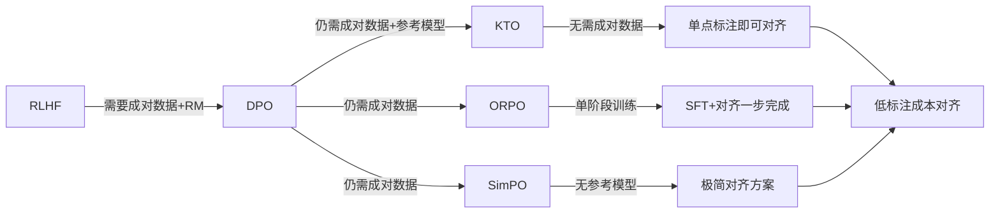
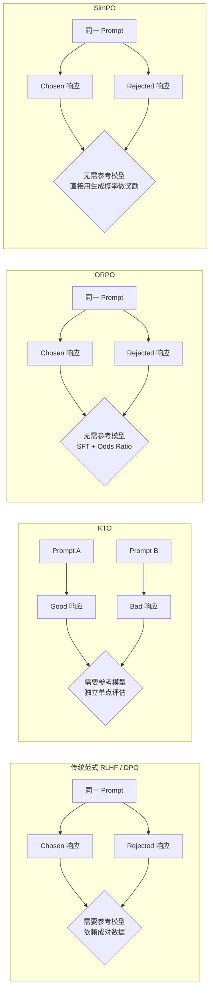
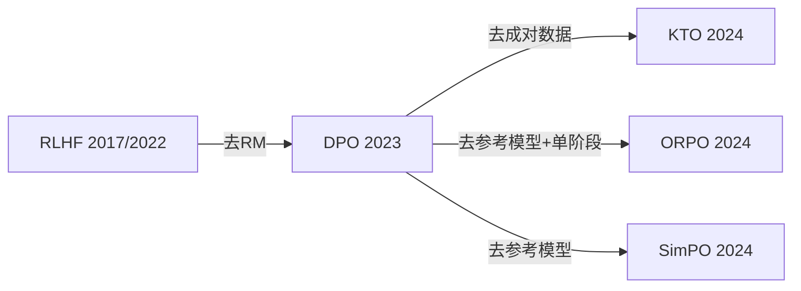

# Alignment Advanced (KTO / ORPO / SimPO)

## 知识地图



## 前置知识

- [RLHF](rlhf.md)：理解 RLHF 三阶段（SFT → RM → PPO）
- [DPO](dpo.md)：理解直接偏好优化的 Bradley-Terry 模型
- [SFT](sft.md)：理解监督微调和交叉熵损失
- [KL 散度](kl-divergence.md)：理解参考模型约束的作用

---

## 为什么会出现 (Why)

**RLHF 太贵，DPO 太挑数据。**

RLHF 需要训练一个独立的奖励模型，运行 PPO 强化学习——四只模型同时驻留 GPU（policy、reference、reward、value），计算和工程开销巨大。DPO 用巧妙的重参数化省去了奖励模型和 PPO，但仍有三个痛点：

1. **必须成对数据**：同一个 prompt 的 chosen + rejected 响应，标注成本约为单点标注的 2-3 倍
2. **需要参考模型**：推理时仍需加载两份权重（policy + reference），内存翻倍
3. **两阶段流程**：SFT 和对齐分离，相当于"先学说话，再学规矩"

2024 年出现的 KTO / ORPO / SimPO 分别从不同角度解决这些问题。

---

## 解决什么问题 (Problem)

| 方法 | 解决的痛点 |
|------|-----------|
| **KTO** | 不需要成对偏好数据——单点"好/坏"标签即可 |
| **ORPO** | 不需要参考模型 + SFT 和对齐单阶段完成 |
| **SimPO** | 不需要参考模型 + 用生成长度归一化概率做奖励 |

---

## 核心思想 (Core Idea)

> **RLHF/DPO 的"重型对齐"正在被轻量化替代——不需要成对数据、不需要参考模型、不需要两阶段训练，也能达到同等甚至更好的对齐效果。**

---

## 范式对比总览



---

## 数学定义与原理解析

### KTO — 前景理论损失

受经济学 Kahneman-Tversky 前景理论启发，KTO 分别处理"好"和"坏"的响应：

对于 **desired** 响应（标签 $y=1$）：

$$\mathcal{L}_{KTO}^+ = -\lambda_D \cdot \sigma\left( \beta \left( \log \frac{\pi_\theta(y|x)}{\pi_{ref}(y|x)} - \mathbb{E}_{y' \sim \pi_{ref}} \left[ \log \frac{\pi_\theta(y'|x)}{\pi_{ref}(y'|x)} \right] \right) \right)$$

**通俗解释：** 对于"好回答"，奖励其 KL 散度高于参考分布平均水平的部分。好回答应该比"随机回答"更受当前策略偏爱。

对于 **undesired** 响应（标签 $y=0$）：

$$\mathcal{L}_{KTO}^- = -\lambda_U \cdot \sigma\left( -\beta \left( \log \frac{\pi_\theta(y|x)}{\pi_{ref}(y|x)} - \mathbb{E}_{y' \sim \pi_{ref}}[\ldots] \right) \right)$$

**通俗解释：** 对于"坏回答"，惩罚其 KL 散度超过平均水平的程度。坏回答应该在当前策略下"不被偏爱"。$\lambda_D$ 和 $\lambda_U$ 的不对称性来自前景理论——人类对损失的敏感度高于收益（loss aversion）。

关键：两种响应**不需要来自同一个 prompt**。$\lambda_D$ 和 $\lambda_U$ 分别控制好/坏样本的权重。

### ORPO — 单阶段对齐

将 SFT 的 CE 损失和偏好对齐的 OR 损失合并：

$$\mathcal{L}_{ORPO} = \mathcal{L}_{SFT} + \lambda \cdot \mathcal{L}_{OR}$$

**通俗解释：** 不需要先 SFT 再 DPO 的两阶段流程——一个损失函数同时做两件事：第一部分（SFT loss）让模型学会正确回答，第二部分（OR loss）让模型区分好回答和坏回答。

其中 OR（Odds Ratio）项为：

$$\mathcal{L}_{OR} = -\log \sigma\left( \log \frac{\text{odds}_\theta(y_w|x)}{\text{odds}_\theta(y_l|x)} \right)$$

$$\text{odds}_\theta(y|x) = \frac{\pi_\theta(y|x)}{1 - \pi_\theta(y|x)}$$

**通俗解释：** Odds（几率）是"好回答的概率"除以"不是好回答的概率"。OR loss 要求 chosen 的 odds 远大于 rejected 的 odds。相较于 DPO 直接比概率，比 odds 对概率的变化更敏感。

### SimPO — 无需参考模型

直接用**生成概率**作为隐式奖励，无需参考模型：

$$\mathcal{L}_{SimPO} = -\log \sigma\left( \frac{\beta}{|y_w|} \sum_i \log \pi_\theta(y_w^{(i)}|x, y_w^{(<i)}) - \frac{\beta}{|y_l|} \sum_i \log \pi_\theta(y_l^{(i)}|x, y_l^{(<i)}) - \gamma \right)$$

**通俗解释：** 奖励信号 = chosen 的平均对数概率 - rejected 的平均对数概率。两个关键设计：(1) 长度归一化——防止模型偏向短回答；(2) $\gamma$ margin——要求 chosen 奖励比 rejected 高出一定阈值。不需要参考模型，因为只比较当前策略对两个回答的相对偏好。

$\gamma$ 是 target reward margin。核心简化：奖励直接来自**长度归一化的平均对数概率**。

---

## 可视化展示

### 各方法资源消耗对比

```echarts
return {
  tooltip: { trigger: "axis", confine: true },
  title: { top: 5,  text: '对齐方法资源消耗对比 (相对值)', left: 'center', textStyle: { fontSize: 12 } },
  xAxis: { type: 'category', data: ['RLHF', 'DPO', 'KTO', 'ORPO', 'SimPO'] },
  yAxis: { type: 'value', name: '相对资源消耗', max: 120 },
  legend: { top: 28,  data: ['GPU 显存', '训练时间', '标注成本'] },
  grid: { left: 60, right: 20, top: 55, bottom: 55 },
  series: [
    { name: 'GPU 显存', type: 'bar', data: [100, 55, 55, 35, 35], itemStyle: { color: '#2980b9' } },
    { name: '训练时间', type: 'bar', data: [100, 40, 40, 30, 30], itemStyle: { color: '#27ae60' } },
    { name: '标注成本', type: 'bar', data: [100, 90, 50, 85, 85], itemStyle: { color: '#e67e22' } }
  ]
}
```

### 对齐方法效果趋势

```echarts
return {
  tooltip: { trigger: "axis", confine: true },
  title: { top: 5,  text: '对齐方法在标准 Benchmark 上的效果趋势', left: 'center', textStyle: { fontSize: 12 } },
  xAxis: { type: 'category', data: ['RLHF', 'DPO', 'KTO', 'ORPO', 'SimPO'] },
  yAxis: { type: 'value', name: 'Win Rate (%)', min: 40, max: 80 },
  series: [{
    type: 'line',
    data: [70, 72, 60, 68, 69],
    smooth: true,
    label: { show: true, formatter: '{c}%' },
    itemStyle: { color: '#2980b9' },
    markLine: { data: [{ type: 'average', name: '平均值' }] }
  }],
  grid: { left: 60, right: 20, top: 55, bottom: 55 }
}
```

---

## 对比表格

### 对齐方法需求对比

| 对齐方法 | 需成对数据 | 需参考模型 | 需奖励模型 (RM) | 单阶段微调 | 训练速度 |
|----------|-----------|-----------|----------------|-----------|---------|
| **RLHF** | Yes | Yes | Yes | No | 最慢 |
| **DPO** | Yes | Yes | No | No | 中等 |
| **KTO** | **No** | Yes | No | No | 中等 |
| **ORPO** | Yes | **No** | No | **Yes** | 快 |
| **SimPO** | Yes | **No** | No | No | 快 |

### KTO vs ORPO vs SimPO 方法论对比

| 特性 | KTO | ORPO | SimPO |
|------|-----|------|-------|
| 核心理念 | 前景理论 (loss aversion) | Odds Ratio + 单阶段 | 生成概率即奖励 |
| 需要成对数据 | No | Yes | Yes |
| 需要参考模型 | Yes | No | No |
| 训练阶段 | 两阶段 (SFT+KTO) | 单阶段 | 两阶段 (SFT+SimPO) |
| 长度归一化 | 无 (依赖 ref) | 无 | Yes (关键设计) |
| 理论简洁度 | 中 (需前景理论) | 中 (需 Odds Ratio) | 高 (最简单的设计) |
| 显存占用 | 高 (policy + ref) | 低 (仅 policy) | 低 (仅 policy) |

---

## 模型演化路线



| 方法 | 年份 | 核心创新 | 解决的问题 |
|------|------|---------|-----------|
| RLHF | 2017/2022 | PPO + 奖励模型 | 首次用人类偏好信号对齐 LLM |
| DPO | 2023 | 重参数化消去 RM | RLHF 的四模型开销 |
| KTO | 2024 | 前景理论 + 单点标注 | 成对偏好数据标注成本高 |
| ORPO | 2024 | SFT + OR 联合损失 | 两阶段训练流程 + 参考模型 |
| SimPO | 2024 | 长度归一化概率做奖励 | 参考模型内存开销 |

---

## 工业界应用

| 应用领域 | 推荐方法 | 为什么 | 优势 | 劣势 |
|---------|---------|-------|------|------|
| 大规模对齐 (有排序数据) | DPO | 效果最好，需成对数据 | 稳定可靠，社区验证充分 | 标注成本高 |
| 从用户反馈学习 (点赞/踩) | KTO | 二元标签天然适合 | 数据获取容易，标注成本低 | 效果弱于 DPO |
| 快速原型验证 | ORPO | 单阶段训练，最快出结果 | 训练快、调参少 | 可能不如两阶段方法 |
| 资源受限部署 | SimPO / ORPO | 不需要参考模型 | 显存减半，消费级 GPU 可跑 | 在某些任务上不如有参考模型的方法 |
| 追求极致性能 | RLHF / Iterative DPO | 工业级在线采样 | SOTA 效果 | 成本极高、工程复杂 |

---

## 最小可运行代码

### PyTorch — KTO Loss

```python
import torch
import torch.nn.functional as F

def kto_loss(policy_logps, ref_logps, labels, beta=0.1,
              lambda_desired=1.0, lambda_undesired=1.0):
    """
    policy_logps: [B] — log π_θ(y|x) / |y|
    ref_logps:    [B] — log π_ref(y|x) / |y|
    labels:       [B] — 1=desired, 0=undesired
    """
    kl = policy_logps - ref_logps  # [B]

    # 参考分布下的平均 KL
    kl_ref_mean = kl.mean()

    # 分开处理 desired 和 undesired
    loss = 0
    for group, lam, sign in [
        (labels == 1, lambda_desired, 1.0),
        (labels == 0, lambda_undesired, -1.0)
    ]:
        if group.any():
            adjusted = kl[group] - kl_ref_mean
            loss += lam * (
                -F.logsigmoid(sign * beta * adjusted)
            ).mean()
    return loss

```

### PyTorch — ORPO Loss

```python
def orpo_loss(policy_logps, policy_logprobs_chosen,
              policy_logprobs_rejected, beta=0.1, lambda_or=1.0):
    """
    policy_logps: [B] — cross-entropy SFT 损失
    policy_logprobs_chosen:   [B] — log π_θ(y_win|x)
    policy_logprobs_rejected: [B] — log π_θ(y_lose|x)
    """
    # SFT 损失
    sft_loss = -policy_logps.mean()

    # Odds ratio 损失
    odds_chosen = policy_logprobs_chosen - torch.log1p(
        -torch.exp(policy_logprobs_chosen).clamp(max=0.999))
    odds_rejected = policy_logprobs_rejected - torch.log1p(
        -torch.exp(policy_logprobs_rejected).clamp(max=0.999))
    log_odds_ratio = odds_chosen - odds_rejected
    or_loss = -F.logsigmoid(beta * log_odds_ratio).mean()

    return sft_loss + lambda_or * or_loss

```

### PyTorch — SimPO Loss

```python
def simpo_loss(policy_model, batch, beta=2.0, gamma=0.5):
    """batch: {prompt, chosen, rejected}"""
    # 计算 chosen 和 rejected 的生成概率（长度归一化）
    chosen_logp = policy_model.log_prob(batch['prompt'], batch['chosen'])
    rejected_logp = policy_model.log_prob(batch['prompt'], batch['rejected'])

    chosen_len = batch['chosen'].ne(tokenizer.pad_token_id).sum(dim=-1)
    rejected_len = batch['rejected'].ne(tokenizer.pad_token_id).sum(dim=-1)

    chosen_avg = chosen_logp.sum(dim=-1) / chosen_len  # [B]
    rejected_avg = rejected_logp.sum(dim=-1) / rejected_len  # [B]

    # 隐式奖励差异
    loss = -F.logsigmoid(beta * (chosen_avg - rejected_avg) - gamma)
    return loss.mean()

```

---

## 学完后建议继续学习

- [DPO](dpo.md) — 理解 DPO 的完整推导和 Bradley-Terry 模型
- [RLHF](rlhf.md) — 回到原点理解完整的 RLHF 流程
- [SFT](sft.md) — 对齐的前提：高质量监督微调
- [LoRA/QLoRA](lora-qlora.md) — 在消费级 GPU 上实验对齐方法

---

## 高频面试题

**Q1: KTO 为什么不需要成对数据？和其他方法的核心区别是什么？**

KTO 基于 Kahneman 的前景理论，将对齐建模为对单个响应的"满意/不满意"判断，而非 chosen vs rejected 的对比。它只需要知道每个回答是"好"还是"坏"（可来自不同 prompt），通过比较该回答的 KL 散度与参考分布的平均 KL 水平来决定奖励还是惩罚。核心区别：成对数据要求同一个 prompt 的两个回答都来自同一分布，KTO 打破了这一限制。

**Q2: SimPO 如何在不使用参考模型的情况下防止策略偏离太远？**

SimPO 不使用 KL 散度约束（传统上用参考模型计算），而是通过：(1) 长度归一化——消除模型偏向短回答的作弊行为；(2) target reward margin $\gamma$——要求 chosen 概率显著高于 rejected 概率，这本身就有正则化效果。实验表明这种隐式约束在实践中足以防止 reward hacking，且性能匹配或超越 DPO。

**Q3: ORPO 的"单阶段"意味着什么？为什么不分开做更好？**

ORPO 在同一个训练循环中联合优化 SFT 损失和 OR 损失。传统 DPO 先 SFT 再 DPO——两阶段可能造成 SFT 阶段学到的能力在 DPO 阶段退化（alignment tax）。ORPO 通过同时优化两个目标，让模型在学习遵循指令的同时就建立了对好/坏回答的偏好，避免了能力退化。

**Q4: DPO / KTO / ORPO / SimPO 应该如何选择？**

- 有成对偏好数据 + 显存充足 → **DPO**（最成熟，验证最充分）
- 只有单点评分/点赞踩数据 → **KTO**（唯一不需要成对数据的选择）
- 从基座模型直接做 Chat 模型 → **ORPO**（省去单独 SFT 步骤）
- 显存受限（无法同时加载 policy + reference） → **SimPO**
- 追求最佳效果 + 预算充足 → **RLHF**（工业界黄金标准）

**Q5: 为什么对齐方法都在朝着"去参考模型"的方向发展？**

参考模型（通常是 SFT 后的冻结模型）在推理和训练过程中占据大量 GPU 显存。对于 7B 模型，两份权重就需要额外的 14GB 显存。去掉参考模型可以将对齐训练的显存需求降低近一半，使得在消费级 GPU（如 RTX 3090/4090）上对齐 7B 模型成为可能。SimPO 和 ORPO 证明去掉参考模型后依然能保持对齐效果。
