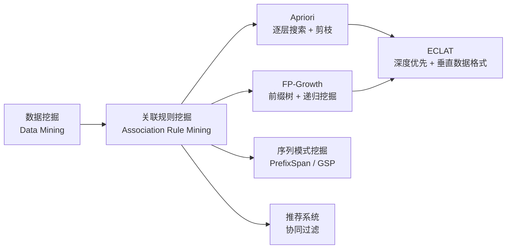
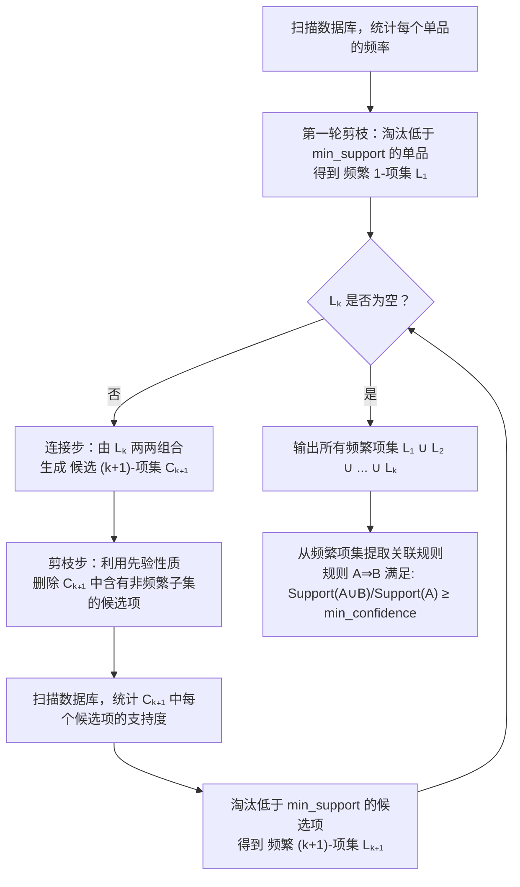
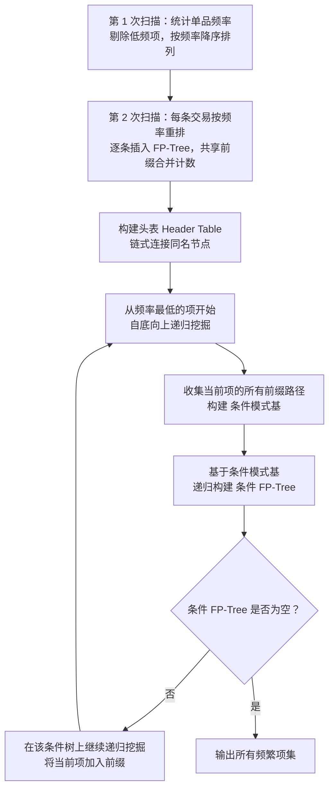
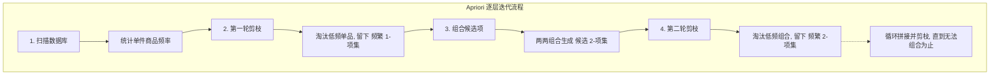
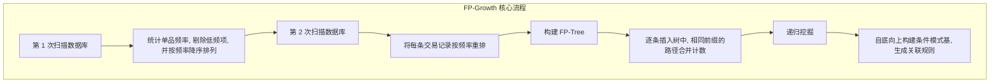

# Apriori / FP-Growth (关联规则挖掘)

## 知识地图



## 前置知识

- **集合论基础**：项集 (Itemset)、子集、超集的概念
- **概率论基础**：条件概率 $P(B \mid A)$、联合概率 $P(A \cup B)$
- **数据结构**：树 (Tree)、哈希表 (Hash Table)——理解 FP-Tree 的前缀共享机制
- **算法复杂度**：理解组合爆炸问题——$n$ 个商品的组合数为 $2^n$

## 为什么会出现 (Why)

关联规则挖掘旨在从海量的交易记录或行为数据中，找出物品之间隐藏的"连带关系"。**经典案例：啤酒与尿布。** 沃尔玛发现，周末傍晚买尿布的年轻父亲，往往会顺手买打啤酒。掌握这种规律，商家就可以进行精准的商品摆放和捆绑促销。

关联规则算法的核心痛点在于**计算量爆炸**：如果超市有 10,000 种商品，它们可能的组合方式是个天文数字（$2^{10000}$）。Apriori 和 FP-Growth 就是为了解决"如何快速找出有价值的组合"而诞生的。

## 解决什么问题 (Problem)

从大规模事务数据库中高效发现频繁项集（经常一起出现的商品组合），并从中提取有意义的关联规则（"如果买了 A，很可能也会买 B"），同时避免对组合空间的穷举搜索。

## 核心思想 (Core Idea)

**Apriori 利用"频繁项集的子集必频繁"的先验性质剪枝搜索空间；FP-Growth 通过构建压缩前缀树（FP-Tree）将数据库压缩到内存中，仅需两次扫描即可完成挖掘。**

---

## 数学模型/公式

### 1. 支持度 (Support) — "这组商品有多常见？"

表示项集 $A$ 和 $B$ 同时出现的概率。太冷门的组合没有商业挖掘价值。

$$\text{Support}(A \cup B) = \frac{\text{count}(A \cup B)}{N}$$

**通俗解释：** 在所有购物小票中，同时包含 A 和 B 的小票占比多少。如果只有 0.01% 的订单同时买了"鱼子酱和猫粮"，这个组合虽然有趣但不值得专门做营销——覆盖面太小。

### 2. 置信度 (Confidence) — "买了 A，有多大概率买 B？"

表示在包含 $A$ 的所有记录中，也包含 $B$ 的比例。体现了规则的可靠性。

$$\text{Confidence}(A \Rightarrow B) = P(B \mid A) = \frac{\text{Support}(A \cup B)}{\text{Support}(A)}$$

**通俗解释：** 拿到一张含有 A 的小票，上面同时有 B 的概率。比如 100 个买了尿布的顾客中，有 80 个也买了啤酒，那置信度就是 80%。这个数字高说明规则可靠。

### 3. 提升度 (Lift) — "A 真的能带动 B 吗？"

如果 B（矿泉水）本来就人人买，那"买尿布导致买矿泉水"就是句废话。Lift 用于评估 $A$ 的出现对 $B$ 出现的提升程度：

$$\text{Lift}(A \Rightarrow B) = \frac{P(B \mid A)}{P(B)} = \frac{\text{Support}(A \cup B)}{\text{Support}(A) \cdot \text{Support}(B)}$$

- **Lift > 1**：正相关（A 真正促进了 B，这是我们想要的）。
- **Lift = 1**：相互独立（买不买 A 和买不买 B 没关系）。
- **Lift < 1**：负相关（买了 A 反而降低了买 B 的概率）。

**通俗解释：** 如果啤酒本来就人人买（80% 的顾客都买），那"买尿布 → 买啤酒"的置信度即使 80%，也只是平均水平，Lift = 1.0，说明尿布对啤酒销量没有额外拉动。Lift 真正衡量的是"A 对 B 的边际促进效果"。

### Apriori 先验性质

> **大白话：如果"啤酒+尿布"都没几个人买，那"啤酒+尿布+瓜子"肯定更没人买。**
> 学术表达：如果一个项集是频繁的，那么它的所有子集也一定是频繁的；反之，如果一个子集不频繁，它的任何超集都不可能频繁。

**通俗解释：** 这是一个单调性约束——项集的支持度随着项数增加而单调下降。这个性质是 Apriori 剪枝的理论基础，让我们可以安全地丢弃所有不频繁项集的超集，大幅缩小搜索范围。

---

## 算法流程图

### Apriori 算法



### FP-Growth 算法



---

## 可视化展示

### Apriori 逐层迭代流程



### FP-Growth 核心流程



---

## 最小可运行代码

```python
from collections import defaultdict
from itertools import combinations


def apriori(transactions, min_support=0.5):
    """
    Apriori 算法实现。
    transactions: list of frozenset，每个 frozenset 是一笔交易的商品集合
    min_support: 最小支持度（比例）
    返回: dict {frozenset: support}
    """
    n = len(transactions)
    min_count = n * min_support

    # 统计单品频率
    item_counts = defaultdict(int)
    for t in transactions:
        for item in t:
            item_counts[item] += 1

    # 频繁 1-项集
    L = [frozenset([item]) for item, cnt in item_counts.items() if cnt >= min_count]
    all_frequent = {itemset: item_counts[list(itemset)[0]] / n for itemset in L}

    k = 1
    while L:
        k += 1
        # 连接步：L_{k-1} 两两拼接生成候选 C_k
        candidates = set()
        for i, a in enumerate(L):
            for b in L[i + 1:]:
                union = a | b
                if len(union) == k:
                    # 剪枝步：检查所有 (k-1) 子集是否都在 L 中
                    if all(frozenset(subset) in set(L) for subset in combinations(union, k - 1)):
                        candidates.add(union)

        # 扫描数据库统计支持度
        candidate_counts = defaultdict(int)
        for t in transactions:
            for c in candidates:
                if c.issubset(t):
                    candidate_counts[c] += 1

        # 筛选频繁项集
        L = [c for c, cnt in candidate_counts.items() if cnt >= min_count]
        for itemset in L:
            all_frequent[itemset] = candidate_counts[itemset] / n

    return all_frequent


def extract_rules(frequent_itemsets, min_confidence=0.7):
    """
    从频繁项集中提取关联规则。
    返回: list of (antecedent, consequent, confidence, lift)
    """
    rules = []
    support_dict = {fs: sup for fs, sup in frequent_itemsets.items()}

    for itemset in frequent_itemsets:
        if len(itemset) < 2:
            continue
        # 枚举非空真子集作为前件
        for i in range(1, len(itemset)):
            for ant in combinations(itemset, i):
                ant = frozenset(ant)
                con = itemset - ant
                sup_union = frequent_itemsets[itemset]
                sup_ant = support_dict.get(ant, 0)
                sup_con = support_dict.get(con, 0)
                if sup_ant == 0:
                    continue
                confidence = sup_union / sup_ant
                if confidence >= min_confidence:
                    lift = confidence / sup_con if sup_con > 0 else float('inf')
                    rules.append((ant, con, confidence, lift))
    return rules


def fp_growth_simple(transactions, min_support=0.5):
    """
    简化版 FP-Growth：递归构建条件 FP-Tree。

    仅用于说明原理，未做工业级优化。
    transactions: list of frozenset
    """
    n = len(transactions)
    min_count = n * min_support

    # 统计单品频率
    item_counts = defaultdict(int)
    for t in transactions:
        for item in t:
            item_counts[item] += 1

    # 剔除低频项
    freq_items = {item for item, cnt in item_counts.items() if cnt >= min_count}

    # 递归挖掘
    results = {}

    def _mine(prefix, txns):
        # 统计当前事务集中各单品频率
        cnt = defaultdict(int)
        for t in txns:
            for item in t:
                if item in freq_items:
                    cnt[item] += 1

        # 对每个频繁单品构建条件模式基
        for item, c in sorted(cnt.items(), key=lambda x: -x[1]):
            if c < min_count:
                continue
            new_prefix = prefix | {item}
            results[frozenset(new_prefix)] = c / n

            # 构建条件模式基：包含该 item 的事务，去掉该 item
            cond_txns = []
            for t in txns:
                if item in t:
                    cond_txns.append(t - {item})
            if cond_txns:
                _mine(new_prefix, cond_txns)

    _mine(set(), transactions)
    return results


# ===== 使用示例 =====
if __name__ == '__main__':
    # 示例交易数据
    transactions = [
        frozenset(['牛奶', '面包', '尿布']),
        frozenset(['牛奶', '尿布', '啤酒', '鸡蛋']),
        frozenset(['面包', '啤酒', '尿布', '鸡蛋']),
        frozenset(['牛奶', '面包', '尿布', '啤酒']),
        frozenset(['面包', '牛奶', '啤酒', '尿布']),
    ]

    print("=== Apriori ===")
    frequent = apriori(transactions, min_support=0.5)
    for itemset, sup in sorted(frequent.items(), key=lambda x: -x[1]):
        print(f"  {set(itemset)}: support={sup:.2f}")

    print("\n=== 关联规则 ===")
    rules = extract_rules(frequent, min_confidence=0.7)
    for ant, con, conf, lift in rules:
        print(f"  {set(ant)} => {set(con)}: conf={conf:.2f}, lift={lift:.2f}")
```

---

## 工业界应用

| 领域 | 应用场景 | 典型用法 |
| --- | --- | --- |
| **电商推荐** | 购物篮分析 | "购买此商品的人也购买了..."（Amazon）、捆绑促销设计 |
| **零售布局** | 商品陈列优化 | 沃尔玛"啤酒与尿布"——将关联商品放在相邻货架 |
| **网页分析** | 用户浏览路径挖掘 | 发现用户经常连续访问的页面序列，优化网站导航结构 |
| **金融风控** | 欺诈模式发现 | 发现异常行为组合：异常登录 + 频繁修改密码 + 大额转账 |
| **医疗诊断** | 并发症关联分析 | 症状 A + 症状 B + 指标 C → 疾病 D 的关联概率 |
| **电信** | 套餐捆绑设计 | 分析用户订阅服务的组合模式，设计精准套餐 |

---

## 对比表格

| 维度 | Apriori | FP-Growth | ECLAT |
| --- | --- | --- | --- |
| **核心机制** | 候选组合生成 + 验证剪枝 | 构建 FP-Tree 压缩数据 + 递归挖掘 | 深度优先搜索 + 垂直数据格式 (TID 列表) |
| **数据库扫描次数** | 极其频繁（每迭代一层扫描一次） | **仅需 2 次** | 仅需 1 次 |
| **速度** | 慢，长频繁模式下组合爆炸 | 快，无须生成庞大的候选集 | 快，TID 列表取交即可 |
| **内存消耗** | 较小（只存当前层的候选项） | 较大（需将整棵 FP-Tree 装入内存） | 中等（TID 列表可能很大） |
| **适用场景** | 数据稀疏、项集较小、内存极其受限 | 数据稠密、对速度要求高的主流工业场景 | 项集较多但事务数适中 |
| **并行化** | 较容易（候选生成可并行） | 困难（树结构难以分割） | 较容易 |

---

## 学完后建议继续学习

1. **ECLAT 算法**：使用垂直数据格式（TID 列表），深度优先搜索，适合稀疏数据
2. **序列模式挖掘**：PrefixSpan、GSP——挖掘带有时序关系的模式（"先买手机，再买手机壳"）
3. **频繁子图挖掘**：gSpan——从图结构数据中发现频繁子图模式
4. **推荐系统**：协同过滤 (Collaborative Filtering)——关联规则是推荐系统的基础技术之一
5. **高维数据中的频繁模式**：如何处理成千上万维度的商品目录

---

## 高频面试题

### Q1: Apriori 算法的"先验性质"是什么？为什么它能减少计算量？

**标准答案：** 先验性质（Apriori Property）指出：频繁项集的所有非空子集也一定是频繁的。等价地，如果一个项集是非频繁的，那么它的所有超集也一定是非频繁的。这能减少计算量是因为：在从 $k$-项集生成 $(k+1)$-项集候选时，如果发现某个候选项的任一 $k$-子集不在频繁集中，就可以安全地剪掉该候选项，无需再扫描数据库验证其支持度。这避免了大量无意义的数据库扫描和计数操作。

### Q2: FP-Growth 相比 Apriori 的核心优势是什么？它的代价是什么？

**标准答案：** 核心优势：FP-Growth 只需扫描数据库 2 次（Apriori 每次迭代都要扫描），且不需要生成候选集——通过 FP-Tree 的前缀共享机制，直接从树中递归挖掘频繁模式。代价是内存消耗更大：需要将整个 FP-Tree 和头表加载到内存中。当数据库非常大或支持度阈值很低时，FP-Tree 可能无法完全放入内存。总结：FP-Growth 用空间换时间。

### Q3: 支持度 (Support)、置信度 (Confidence)、提升度 (Lift) 三者分别衡量什么？为什么只看置信度不够？

**标准答案：** Support 衡量规则的普遍性（覆盖面），Confidence 衡量规则的可靠性（准确率），Lift 衡量规则的相关性（A 对 B 的边际促进效果）。只看置信度不够是因为：如果 B 本身就是一个高频商品（如 90% 的订单都包含它），那么即使"买 A → 买 B"的置信度高达 90%，这条规则也没有商业价值——A 并没有增加 B 的购买概率。Lift 通过除以 $P(B)$ 消除了这种"虚假关联"，只有 Lift > 1 才能说明 A 真正促进了 B。

### Q4: 频繁项集挖掘在工业界面临哪些实际挑战？如何应对？

**标准答案：**
1. **数据规模巨大**：电商平台每天产生亿级交易。应对：使用分布式算法（如基于 Spark 的 FP-Growth 实现），或分层挖掘（先按品类聚合）。
2. **长尾商品稀疏**：绝大多数商品出现频率极低。应对：对商品分层（热门/中频/长尾），分别设置不同的支持度阈值。
3. **时效性**：用户兴趣随时间变化。应对：引入时间窗口衰减权重，近期交易权重更高。
4. **冗余规则**：大量规则相互包含。应对：使用闭频繁项集（Closed Itemsets）或最大频繁项集（Maximal Itemsets）压缩输出。

### Q5: 什么是闭频繁项集 (Closed Frequent Itemset) 和最大频繁项集 (Maximal Frequent Itemset)？

**标准答案：** 闭频繁项集是指：不存在与其支持度相同的真超集。最大频繁项集是指：不存在频繁的真超集。两者的区别：最大频繁项集一定是闭的，但闭的不一定是最大的。例如，如果 {A,B} 和 {A,B,C} 的支持度相同（都是 50 次），则 {A,B} 不是闭的（因为超集 {A,B,C} 支持度相同），{A,B,C} 是闭的。如果 {A,B,C,D} 的支持度低于阈值，则 {A,B,C} 是最大的。闭频繁项集保留了所有支持度信息，但数量远少于全部频繁项集。
