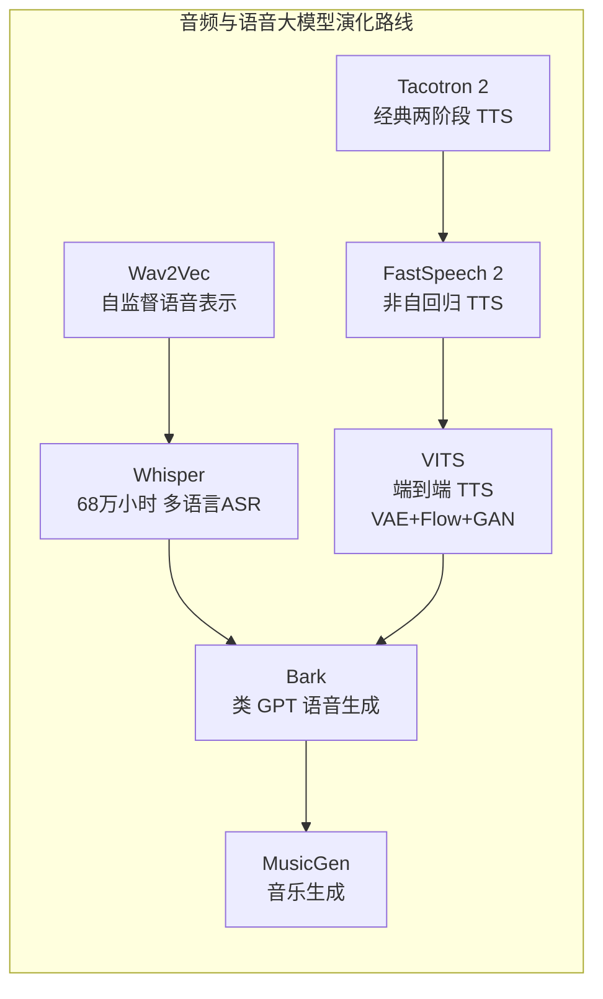
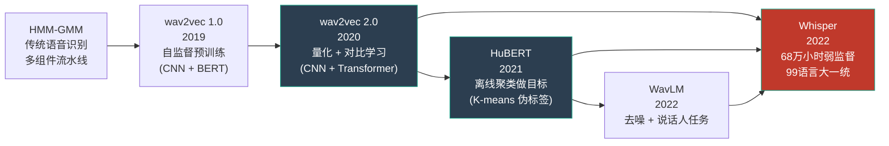
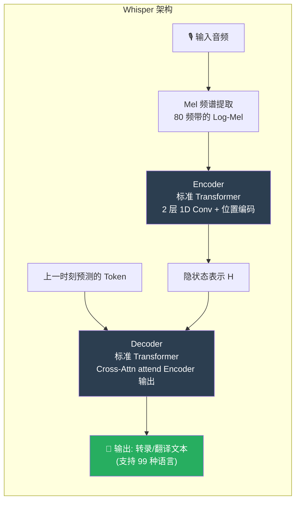
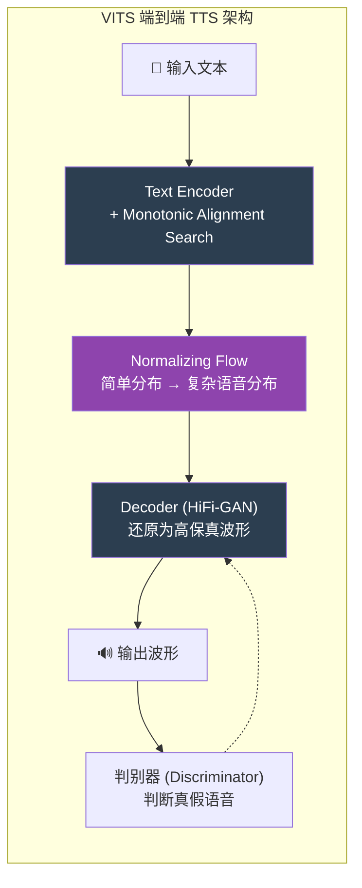
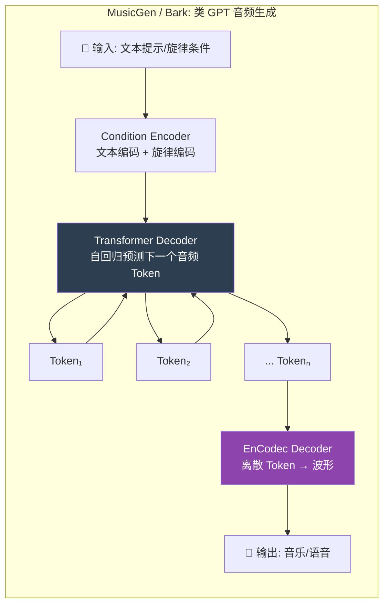
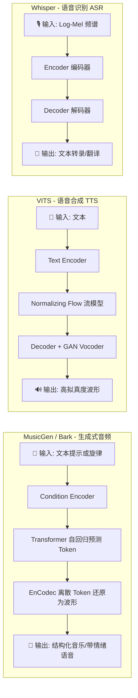

# Audio & Speech (语音与音频大模型：Whisper / VITS / Bark / MusicGen)

## 知识地图



## 前置知识

- **音频信号基础**: 采样率（Sample Rate）、波形（Waveform）、梅尔频谱（Mel Spectrogram）——Whisper 的输入格式
- **Transformer 架构**: Encoder-Decoder 结构，Whisper 和 MusicGen 的核心
- **自回归生成**: 逐 Token 预测下一个 Token——从 GPT 到音频生成
- **VAE (Variational Autoencoder)**: 编码器-隐变量-解码器，VITS 的核心组件之一
- **Normalizing Flow (标准化流)**: 可逆变换链，将简单分布映射为复杂分布
- **GAN (生成对抗网络)**: 判别器-生成器对抗训练，VITS 的 Vocoder 部分
- **音频编解码 (Audio Codec)**: EnCodec 如何将音频压缩为离散 Token

## 模型演化路线

### ASR 演化：从 wav2vec 到 Whisper



| 模型 | 年份 | 预训练方式 | 核心创新 | 数据规模 |
|------|------|-----------|----------|----------|
| wav2vec | 2019 | 对比预测编码 (CPC) | 首次将自监督用于语音：用 CNN 从原始波形预测未来帧 | LibriSpeech 960h |
| wav2vec 2.0 | 2020 | 量化 + 对比学习 | 引入离散化码本 + Masked Prediction，CNN编码器 + Transformer | LibriSpeech / 6万小时未标注 |
| HuBERT | 2021 | 离线 K-means 聚类 | 用 MFCC 聚类做伪标签作为预训练目标，解决量化码本训练不稳问题 | Libri-Light 6万小时 |
| WavLM | 2022 | 去噪 + 多任务 | 在 HuBERT 基础上加说话人识别和去噪任务，提升多人场景鲁棒性 | 9.4万小时 |
| Whisper | 2022 | 弱监督 (文本标签) | 68万小时直接训练 Encoder-Decoder，99种语言/翻译统一 | 68万小时多语言 |

### TTS 与音乐生成演化


| 模型 | 任务 | 架构 | 核心创新 |
|------|------|------|----------|
| wav2vec 2.0 | 语音表示学习 | CNN + Transformer | 量化码本 + 对比学习，自监督预训练语音特征 |
| HuBERT | 语音表示学习 | CNN + Transformer | K-means 聚类伪标签替代量化码本，训练更稳定 |
| Whisper | ASR (语音→文本) | Encoder-Decoder Transformer | 68万小时弱监督，99语言统一模型，极强噪声鲁棒性 |
| VITS | TTS (文本→语音) | VAE + Flow + GAN | 端到端消除级联误差，单阶段生成高保真波形 |
| Bark | 带情绪 TTS | GPT 自回归 + EnCodec | 语义 Token + 声学 Token 分离，支持笑声/叹气等非语言表达 |
| MusicGen | 音乐生成 | 单阶段 Transformer + EnCodec | 4 层交错 Codebook 生成，文本条件控制风格 |

## 为什么会出现 (Why)

在传统的 AI 领域，处理声音非常麻烦：(1) 声音是连续的波形，时间维度极长（1 秒音频=16000 个采样点），数据量远超文本；(2) 传统 ASR 依赖音素词典、语言模型等复杂的流水线组件，各组件独立优化，错误会级联放大；(3) TTS 传统架构分两步——先生成频谱图再转波形，中间信息损失导致声音机械感严重；(4) 音乐生成长期被符号化方法（MIDI）主导，无法捕捉音色、混响等表现力。

自监督学习在语音领域的突破是理解这个领域的关键——wav2vec 2.0 (2020) 首次证明了"像 BERT 那样 mask 音频也能学到强大的语音表示"，HuBERT (2021) 进一步用离线 K-means 聚类解决了训练稳定性问题，而 Whisper (2022) 则直接跳过自监督预训练的阶段，用 68 万小时的弱监督数据端到端训练——证明了"数据规模 > 预训练技巧"。这三者的演进展示了语音 AI 从"精标数据 + 复杂流水线"到"自监督预训练"再到"大规模弱监督端到端"的转型历程。

## 解决什么问题 (Problem)

1. **ASR**: 用单一模型支持 99 种语言的语音识别和翻译，无需语言相关的定制组件
2. **TTS**: 端到端生成高保真、自然的语音波形，消除传统两阶段方法的机械感
3. **音乐生成**: 用类似 GPT 的方式，根据文本提示直接生成高质量音乐
4. **情绪化语音**: 生成包含笑声、叹息、语气变化等丰富表现力的语音

## 核心思想 (Core Idea)

音频处理正经历"大一统"——Whisper 用海量弱监督数据实现了多语言 ASR，VITS 将 VAE/Flow/GAN 融合为端到端 TTS，而 MusicGen 和 Bark 则证明了**音频可以像文字一样被 Token 化**，然后用 Transformer 自回归生成。

## 模型结构图

### Whisper: 多语言 ASR 统一架构



### VITS: 端到端 TTS 融合架构



### MusicGen / Bark: Token 化音频生成



## 数学模型/公式

### 0. wav2vec 2.0 & HuBERT — 自监督语音预训练的演进

wav2vec 2.0 和 HuBERT 代表了语音领域自监督预训练的两种范式，为 Whisper 的出现奠定了技术基础。

**wav2vec 2.0 — 量化对比学习**

原始波形 → 多层 CNN 编码器 → Transformer → 对比损失 + 多样性损失：

$$\mathcal{L} = \mathcal{L}_m + \alpha \mathcal{L}_d$$

$$\mathcal{L}_m = -\log \frac{\exp(\text{sim}(\mathbf{c}_t, \mathbf{q}_t) / \kappa)}{\sum_{\tilde{\mathbf{q}} \in \mathbf{Q}_t} \exp(\text{sim}(\mathbf{c}_t, \tilde{\mathbf{q}}) / \kappa)}$$

**通俗解释：** wav2vec 2.0 的输入是原始波形（16kHz 采样），经过多层的 CNN 将波形压缩成 50Hz 的特征序列（0.02s 一帧），然后用 Transformer 建模上下文。训练时，随机 mask 掉部分时间步的特征，让模型从上下文中预测被 mask 位置的"离散码"（通过一个码本 Gumbel Softmax 量化得到）。对比损失 $\mathcal{L}_m$ 要求模型在候选干扰项（同一批次其他被 mask 位置的量化码）中识别出正确的码。多样性损失 $\mathcal{L}_d$ 鼓励模型平均使用码本中的所有码，避免"只用前几个码"的坍缩。

**HuBERT — 离线 K-means 聚类**

wav2vec 2.0 的量化码本通过 Gumbel Softmax 在线学习，训练不稳定。HuBERT 的改进：**用 MFCC 特征做 K-means 聚类，将聚类中心 ID 作为"伪标签"**。

$$y_t = \text{K-means}(\text{MFCC}(x_t)) \in \{1, 2, ..., K\}$$

$$\mathcal{L} = -\sum_{t \in M} \log P(y_t | \tilde{X})$$

**通俗解释：** HuBERT 不在线学习码本，而是"事先生成标签"：(1) 对训练数据的所有帧提取 39 维 MFCC（梅尔频率倒谱系数）特征；(2) 用 K-means 将所有帧聚成 K=100/500 类；(3) 每帧获得一个"伪标签"（它属于第几类）；(4) 训练时和 wav2vec 2.0 一样 mask 部分帧，让模型预测被 mask 帧的伪标签。因为聚类标签是固定的（非在线学习），训练比 wav2vec 2.0 稳定很多，且可以迭代：第一轮用 MFCC 聚类 → 训练第一代 HuBERT → 用 HuBERT 隐层特征再做聚类 → 训练第二代 HuBERT（特征更好）。这是语音领域的"自蒸馏"。

**wav2vec 2.0 vs HuBERT 对比：**

| 维度 | wav2vec 2.0 | HuBERT |
|------|------------|--------|
| 训练目标 | 在线量化的码本（Gumbel Softmax） | 离线 K-means 聚类（固定伪标签） |
| 训练稳定性 | 中（量化需调多样性损失） | 高（固定目标） |
| 聚类特征 | 模型内部隐层 | MFCC（外部声学特征） |
| 迭代能力 | 单阶段 | 可多轮迭代（用更深层特征重新聚类） |
| 下游微调效果 | 好 | 更好（尤其低资源语言） |

### 1. Whisper — 大力出奇迹的 ASR

架构：标准的 encoder-decoder Transformer。

$$\mathbf{H} = \text{Encoder}(\text{MelSpectrogram}(audio))$$

$$P(y_t | y_{<t}, \mathbf{H}) = \text{Decoder}(y_{<t}, \mathbf{H})$$

**通俗解释：** Whisper 把录音转成 80 个频率带的对数梅尔频谱图（一张"热量图"，纵轴是音高，横轴是时间，越亮表示那个频率的声音越大），然后让 Encoder 理解这张"声纹图"的内容，Decoder 逐词输出文本。核心护城河是 OpenAI 收集的 **68 万小时多语言弱监督数据**，证明了数据规模 > 架构魔法。

### 2. VITS — 高音质三合一 TTS

(1) **Variational Autoencoder (VAE)**：用于提取和重建隐变量。

$$\log p(x|c) \geq \mathbb{E}_{q(z|x)}[\log p(x|z)] - D_{KL}(q(z|x) \| p(z|c))$$

**通俗解释：** VAE 的 ELBO（证据下界）公式：第一项是"重建损失"——给定隐变量 $z$，能多好地重建出原始语音 $x$；第二项是"KL 散度"——编码器输出的后验分布 $q(z|x)$ 要尽量接近条件先验 $p(z|c)$（$c$ 是文本条件）。这确保了隐变量既能还原音频，又和输入文本对齐。

(2) **Normalizing Flow (标准化流)**：把简单的数学分布映射成复杂的人类声音特征。

$$z = f_K \circ \cdots \circ f_1(z_0), \quad \log p(z) = \log p(z_0) - \sum_k \log \left| \det \frac{\partial f_k}{\partial z_{k-1}} \right|$$

**通俗解释：** 假设你知道一个简单分布（如高斯分布 $z_0$）的概率密度，你希望通过一系列可逆变换 $f_k$ 把它逐步"扭"成复杂的语音分布 $z$。每一层变换都会改变"体积"（由雅可比行列式的绝对值衡量），Flow 的公式告诉你最终 $z$ 的概率密度等于初始概率密度减去每层体积变化的对数和。这保证了 TTS 生成的语音覆盖了真实人类语音分布的全部多样性。

(3) **单调对齐搜索 (MAS)**：由于文字长度和语音长度不同（比如"啊"字可以拖长音），MAS 采用动态规划（DP）的方式，在 $O(T_{text} \times T_{mel})$ 的时间复杂度内，找到文字和发音最完美的对齐点。

**通俗解释：** 文本"你好"是 2 个字，但对应的音频可能有 200 帧（梅尔频谱帧）。MAS 就是找出这 2 个字分别霸占了哪几十帧——"你"可能对应前 80 帧（拖了长音），"好"对应后 120 帧。这种对齐必须是单调的（字不能颠三倒四），MAS 用动态规划高效地找到最优解。

### 3. MusicGen & Bark — 像写文章一样写声音

**通俗解释：** 大语言模型（如 GPT）只能预测下一个文字。那怎么让它预测声音呢？答案是：**用 EnCodec 编码器把一秒钟的音频"压碎"成几个离散的代码（Token）**。

* **MusicGen**：输入文本提示（比如"动感的电子乐"），模型就像预测文字一样，自回归地预测下一个声音 Token。为了加快速度，它采用了 4 个并行的 Codebook 交错预测（每帧 4 个 Token 分别编码不同粒度的音频信息）。
* **Bark**：专注于语音。它先生成"语义 Token"（决定说什么字），再生成"声学 Token"（决定音色、叹气声、笑声等情绪），因此表现力极其丰富。

## 可视化展示

### 主流语音模型架构对比



### TTS 模型自然度对比 (MOS 评分)

*MOS (Mean Opinion Score) 是语音合成领域的"图灵测试"，满分 5 分，分数越接近真人录音越好。*

| 模型名称 | MOS (主观音质评分) | 核心技术与特点 |
| --- | --- | --- |
| **Tacotron 2** | 3.7 | 经典的两阶段自回归模型，偶尔会漏字或吞音 |
| **FastSpeech 2** | 3.9 | 非自回归模型，生成速度快，但声音略显平淡机械 |
| **Bark** | 4.1 | 像语言模型一样生成，能模仿笑声/叹气，但背景易有杂音 |
| **VITS** | **4.3** | **端到端生成，极度接近真人音质**，且推理速度极快 |
| **Ground Truth** | 4.5 | 真实人类录音（参考上限） |

## 最小可运行代码

### Python — Whisper 推理与多语言翻译

```python
import torch
import whisper

# 一键加载模型 (按显存大小可选 tiny/base/small/medium/large-v3)
model = whisper.load_model("large-v3")

# 常规任务：英文语音转文字
result = model.transcribe("audio.mp3", language="en")
print("转录结果:", result["text"])

# 翻译任务：输入任意语言语音（如中文），直接翻译为英文文本
result = model.transcribe("audio.mp3", task="translate")
print("翻译结果:", result["text"])
```

### Python — MusicGen 音乐生成

```python
from audiocraft.models import MusicGen
import torchaudio

# 加载 Facebook 开源的中型音乐生成模型
model = MusicGen.get_pretrained("facebook/musicgen-medium")
model.set_generation_params(duration=8)  # 设定生成时长为 8 秒

# 给出文字提示，模型即可"创作"音乐
wav = model.generate(
    descriptions=["upbeat electronic dance music with a driving beat"], # 动感电子舞曲
    progress=True
)

# 保存生成的波形文件
torchaudio.save("output.wav", wav[0].cpu(), sample_rate=32000)
```

### Python — 简化的 VITS 单调对齐搜索 (MAS)

这段代码展示了 VITS 如何利用动态规划（DP），找出文本和音频之间的最佳节奏对齐路径。

```python
def monotonic_alignment_search(log_prob, text_len, mel_len):
    """
    log_prob: [T_text, T_mel] — 每帧文本与每帧音频匹配的对数概率矩阵
    返回最优单调路径 (计算出哪个字应该拖多长的音)
    """
    T_t, T_m = log_prob.shape
    # DP 数组: dp[i][j] 代表到达坐标 (i,j) 的最大累积概率
    dp = torch.full((T_t, T_m), float('-inf'))
    path = torch.zeros((T_t, T_m), dtype=torch.long)

    dp[0, 0] = log_prob[0, 0]
    
    # 初始化第一行（第一个字被无限拖长的情况）
    for j in range(1, T_m):
        dp[0, j] = dp[0, j-1] + log_prob[0, j]

    # 动态规划状态转移
    for i in range(1, T_t):
        for j in range(i, T_m):
            from_left = dp[i, j-1]       # 继续读上一个字（拖音）
            from_diag = dp[i-1, j-1]     # 开始读下一个字
            
            if from_left >= from_diag:
                dp[i, j] = from_left + log_prob[i, j]
                path[i, j] = 0  # 记录横向移动
            else:
                dp[i, j] = from_diag + log_prob[i, j]
                path[i, j] = 1  # 记录对角线移动

    # 自底向上回溯，找出最优路径
    alignment = []
    i, j = T_t - 1, T_m - 1
    while i > 0 or j > 0:
        alignment.append((i, j))
        if i > 0 and (j == 0 or path[i, j] == 1):
            i -= 1; j -= 1
        else:
            j -= 1
    alignment.append((0, 0))
    
    # 翻转路径，变为正向时间顺序
    return alignment[::-1]
```

## 工业界应用

| 应用场景 | 代表产品/模型 | 核心技术 |
|----------|-------------|----------|
| **通用语音识别** | Whisper (OpenAI) | Encoder-Decoder Transformer + 68 万小时数据 |
| **实时转录** | Apple Dictation, Google Live Transcribe | 流式 Whisper / RNN-T |
| **语音助手 TTS** | Siri, Alexa, Google Assistant | VITS 变体 / WaveNet |
| **AI 配音/有声书** | ElevenLabs, 火山引擎 TTS | VITS / Bark 商业变体 |
| **音乐生成** | Suno AI, Udio | MusicGen 风格 + 扩散模型 |
| **语音翻译** | SeamlessM4T (Meta) | 统一多任务音频-文本模型 |

## 对比表格

### ASR 方案对比

| 维度 | 传统 ASR (Kaldi/ESPnet) | Whisper |
|------|------------------------|---------|
| 架构 | 声学模型 + 语言模型 + 词典 (多组件) | 单一 Transformer Encoder-Decoder |
| 语言支持 | 每语言需单独训练 | 99 种语言统一模型 |
| 训练数据 | 精标数据 (几百小时) | 弱监督 68 万小时 |
| 噪声鲁棒性 | 一般 | 极强 (大量噪声数据训练) |
| 部署复杂度 | 高 (多个组件串联) | 低 (单模型端到端) |

### TTS 方案对比

| 维度 | Tacotron 2 | FastSpeech 2 | VITS |
|------|-----------|-------------|------|
| 生成方式 | 自回归 (逐帧) | 非自回归 (并行) | 端到端 (并行) |
| 是否需要 Vocoder | 是 (如 WaveGlow) | 是 (如 HiFi-GAN) | 否 (内置) |
| 推理速度 | 慢 | 快 | 快 |
| 音质 (MOS) | 3.7 | 3.9 | **4.3** |
| 主要问题 | 漏字、吞音 | 声音机械 | 训练不稳定 |

## 学完后建议继续学习

1. **SeamlessM4T (Meta)** — 统一的语音-语音、语音-文本、文本-语音多任务翻译模型
2. **Diffusion-TTS / NaturalSpeech** — 扩散模型在 TTS 中的最新进展
3. **AudioLDM / Tango** — 文本到音效/音乐的扩散模型方案
4. **Speaker Diarization** — 多人对话场景下的"谁在说话"识别
5. **Emotion Recognition** — 语音情感识别的基础方法和前沿

## 高频面试题

### Q1: Whisper 为什么被称为"大力出奇迹"？它的核心创新是什么？

**标准答案：** Whisper 的核心创新不在于架构——它使用的是最标准的 Encoder-Decoder Transformer——而在于训练数据的规模和多样性。OpenAI 从互联网收集了 68 万小时的多语言弱监督音频数据（含各种背景噪声、口音、语速），这个规模远超之前精标数据的数百至数千小时。庞大的数据规模使得模型天然具备了极强的噪声鲁棒性、多语言泛化能力和跨领域适应能力。结论是：当数据足够大时，简单的架构也能在 99 种语言上获得接近甚至超越人类水平的转录效果。

### Q2: VITS 是如何实现端到端 TTS 的？为什么要端到端？

**标准答案：** VITS 融合了 VAE（变分自编码器）、Normalizing Flow（标准化流）和 GAN（生成对抗网络）三种技术：(1) VAE 将文本编码为隐变量分布，并在训练时重建波形；(2) Flow 将简单的高斯分布逐步变换为复杂的人类语音分布，保证声音的多样性；(3) GAN 判别器判断生成的波形是否真实，推动解码器生成更自然的音质。端到端的优势是消除了传统两阶段方法（先 Mel 频谱、再转波形）中的"中间信息损失"——两阶段方法在 Mel 频谱阶段已经丢失了相位等细节信息，而端到端直接优化波形重建，音质自然更好。

### Q3: MusicGen 是如何将音乐生成转化为 GPT 风格的 Token 预测的？

**标准答案：** MusicGen 依赖 EnCodec 音频编解码器将音频压缩为离散 Token。EnCodec 使用多层残差量化（RVQ），每层输出一个离散 Token，4 层共 4 个 Token 表示同一帧音频。MusicGen 的 Transformer Decoder 采用"交错 Codebook"模式：先预测所有帧的第一层 Token，再预测所有帧的第二层 Token...以此类推。这种模式相比逐帧生成所有 4 个 Token 更高效，因为第一层 Token 已经包含了音频的"骨架"信息，后续层只需填充细节。文本条件通过 Condition Encoder 注入到 Transformer 中，控制生成风格。

### Q4: Bark 的"语义 Token"和"声学 Token"分离设计有什么优势？

**标准答案：** Bark 将语音生成为两个阶段：(1) 第一个 Transformer 生成"语义 Token"，只关注"说什么内容"（文字、语境）；(2) 第二个 Transformer 基于语义 Token 生成"声学 Token"，关注"怎么说"（音色、语气、笑声、叹气等）。这种分离设计的优势是：(a) 天然支持情绪表达——即使文字相同，声学 Token 可以不同（如"我恨你"可以笑着说或愤怒说）；(b) 可以解耦音色和内容——用同一个语义 Token 序列配合不同的声学 Token 产生不同的说话人效果；(c) 训练更稳定——两个阶段各司其职，比一次性生成全部细节更容易优化。

### Q5: 为什么 ASR 任务适合使用 Encoder-Decoder 架构，而不是 Decoder-only？

**标准答案：** ASR 的输入（音频频谱）和输出（文本）处于完全不同的模态空间——音频是连续频谱帧，文本是离散 Token。Encoder-Decoder 架构天然适合这种跨模态转换：(1) Encoder 负责理解音频的全局和局部声学特征（音素、语调、语速），将其压缩为隐状态表示；(2) Decoder 从隐状态中提取语义信息并逐 Token 生成文本。如果使用 Decoder-only，音频和文本需要共享同一个嵌入空间，这在声学-语义之间的模态鸿沟下很难做到。此外，Encoder 的双向注意力能利用完整的音频上下文（前后声音），对语音识别中的"回声消除"和"上下文推断"至关重要。
