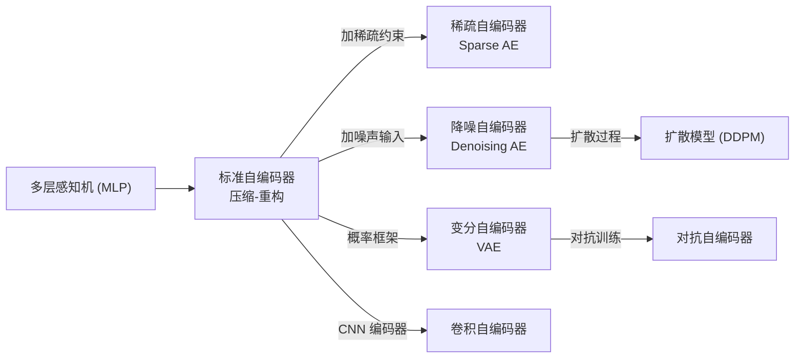
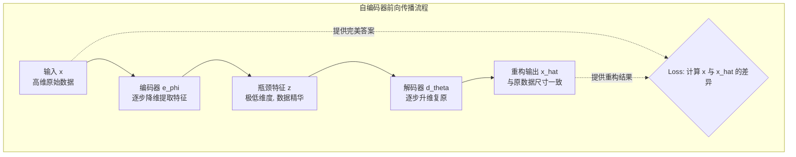
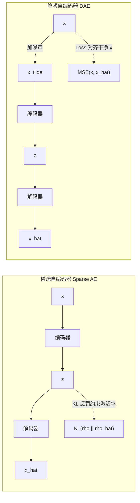

# Autoencoder (自编码器与它的变体)

## 知识地图



## 前置知识

- 全连接神经网络（线性层 + 激活函数）
- 损失函数（MSE、BCE）
- KL 散度的基本概念
- 特征提取与降维（PCA 等）

## 为什么会出现 (Why)

传统有监督学习需要大量标注数据，而标注是昂贵的。自编码器是无监督学习的一种经典方案——不需要标签，只需要数据本身。核心动机：如果能从极低维度的编码中重建出原始数据，那么这个低维编码必然包含了数据最核心、最本质的信息。

## 解决什么问题 (Problem)

- **降维和特征提取**：学习数据的低维表示（比 PCA 更强大，可处理非线性关系）
- **去噪**：从损坏数据中恢复干净数据
- **异常检测**：异常样本的重构误差会显著偏大
- **预训练**：为下游有监督任务提供好的初始权重
- **生成模型**：VAE 是可生成新样本的自编码器变体

## 核心思想 (Core Idea)

**强迫模型把高维数据压缩成极低维度的编码，再试图还原——在这个"压缩再解压"的过程中，模型被迫学会了数据中最核心、最本质的特征。**

---

## 数学定义与原理解析

### 1. 标准 Autoencoder

网络分为编码器 $e_\phi$ 和解码器 $d_\theta$ 两个部分：

$$\mathbf{z} = e_\phi(\mathbf{x}), \quad \hat{\mathbf{x}} = d_\theta(\mathbf{z})$$

**通俗解释：** 编码器把原始数据 $\mathbf{x}$（比如 784 维的手写数字图像）压缩成 $\mathbf{z}$（可能只有 16 维）。解码器拿着这 16 个数字尝试还原原始图像。如果 16 个数字真能还原出可辨认的数字，说明这 16 个数字确实抓住了数字的"本质特征"。

**损失函数**：通常是重建误差 $\mathcal{L} = \| \mathbf{x} - \hat{\mathbf{x}} \|^2$（MSE 均方误差）或 BCE（针对二值化数据）。模型的目标就是让输出 $\hat{\mathbf{x}}$ 尽可能等同于输入 $\mathbf{x}$。

### 2. 稀疏自编码器 (Sparse AE)

在瓶颈层加入稀疏性约束。通常使用 KL 散度来惩罚神经元的实际激活率偏离我们设定的极小目标激活率 $\rho$：

$$\mathcal{L} = \| \mathbf{x} - \hat{\mathbf{x}} \|^2 + \beta \sum_{j} \text{KL}(\rho \| \hat{\rho}_j)$$

**通俗解释：** 想象一家公司有 100 个员工（神经元）。没有稀疏约束时，所有人都参与每个任务，结果大家学到的技能都差不多（特征高度冗余）。加上稀疏约束（规定每个任务的激活率不能超过 5%）后，每次只有 5 个人干活，每个人都被逼着发展出独特的专长——这个员工专门识别横笔画，那个专门识别竖笔画——形成了真正高效的特征分工。

其中 $\hat{\rho}_j = \frac{1}{n}\sum_i z_j^{(i)}$ 是神经元 $j$ 在所有样本上的平均激活率。KL 散度的计算公式为：

$$\text{KL}(\rho \| \hat{\rho}) = \rho \log\frac{\rho}{\hat{\rho}} + (1-\rho)\log\frac{1-\rho}{1-\hat{\rho}}$$

**通俗解释：** KL 散度衡量两个分布 $\rho$ 和 $\hat{\rho}$ 的"距离"。若实际激活率 $\hat{\rho}$ 偏离目标 $\rho$（通常设为 0.05），惩罚项就会增大，强制神经元"不敢"频繁激活。

*注：$\rho$ 通常设得非常小（如 0.05），这意味着在大量样本通过时，某个特定的神经元只有 5% 的时间是被激活的。*

### 3. 降噪自编码器 (DAE)

输入在进入模型前会被人为随机损坏（例如加入高斯噪声或使用 Dropout 置零），但计算 Loss 时，输出必须与**原始干净数据**对齐：

$$\mathcal{L} = \| \mathbf{x} - d_\theta(e_\phi(\tilde{\mathbf{x}})) \|^2$$

其中 $\tilde{\mathbf{x}} \sim q(\tilde{\mathbf{x}} \mid \mathbf{x})$，例如 $\tilde{\mathbf{x}} = \mathbf{x} + \mathcal{N}(0, \sigma^2)$。

**通俗解释：** 给一张被刮花的旧照片（损坏的输入），要求画师不仅要临摹，还要把它复原成崭新无暇的样子（干净的输出）。为此模型不能简单地"死记硬背"输入（因为输入被污染了），必须学习数据的底层结构和统计规律，从被污染的输入中推断出干净的原始形态。这极大增强了模型的抗干扰和纠错能力（鲁棒性）。

---

## 可视化展示

### AE 压缩与重构流程



### Sparse AE vs Denoising AE 流程对比



### 瓶颈维度对重构质量的权衡 (以 MNIST 784维 图像为例)

*这是"压缩率"与"保真度"之间的经典博弈：瓶颈越小，压缩越狠，但重构越模糊。*

| 瓶颈层维度 ($k$) | 重构误差 (MSE) | 视觉效果与意义说明 |
| --- | --- | --- |
| **k = 2** | 0.065 | 误差极大。数字非常模糊，但可在 2D 平面上做极佳的数据聚类可视化。 |
| **k = 8** | 0.028 | 勉强能认出数字轮廓，丢失了笔画的粗细和倾斜细节。 |
| **k = 16** | 0.015 | 达到可用级别，基本能清晰复原数字形状。 |
| **k = 32** | 0.010 | **性价比最高**。将 784 维压缩了 24 倍，人眼几乎看不出重构前后的区别。 |
| **k = 128** | 0.007 | 误差极小。但维度过高，模型可能直接"死记硬背"（恒等映射），失去了提取核心特征的意义。 |

---

## 最小可运行代码

### PyTorch -- 降噪自编码器 (Denoising AE)

```python
import torch
import torch.nn as nn

class DenoisingAE(nn.Module):
    def __init__(self, input_dim=784, hidden_dims=[512, 256, 64]):
        super().__init__()
        
        # 构建 Encoder (逐步降维)
        enc_layers = []
        prev = input_dim
        for h in hidden_dims:
            enc_layers.extend([nn.Linear(prev, h), nn.ReLU()])
            prev = h
        self.encoder = nn.Sequential(*enc_layers)

        # 构建 Decoder (逐步升维对称还原)
        dec_layers = []
        for h in reversed(hidden_dims[:-1]):
            dec_layers.extend([nn.Linear(prev, h), nn.ReLU()])
            prev = h
        dec_layers.append(nn.Linear(prev, input_dim))
        self.decoder = nn.Sequential(*dec_layers)

    def forward(self, x, noise_std=0.2):
        # 核心：在输入端注入高斯噪声，强制模型学习抗噪
        x_noisy = x + torch.randn_like(x) * noise_std
        
        z = self.encoder(x_noisy)
        x_hat = self.decoder(z)
        return x_hat, z

    def loss(self, x):
        # 注意：前向传播用的是 noisy 数据，但计算 loss 对齐的是干净的 x
        x_hat, z = self.forward(x)
        return nn.functional.mse_loss(x_hat, x)
```

### PyTorch -- 稀疏惩罚项 Loss (Sparse AE)

```python
def kl_sparsity_loss(z, rho=0.05):
    """
    z: 瓶颈层的激活值 [Batch_size, k]
    rho: 目标激活率，通常很小 (如 0.05)
    """
    # 计算当前 batch 中每个神经元的平均激活率
    rho_hat = z.mean(dim=0)  # [k]
    
    # 构建目标分布矩阵
    rho_target = torch.full_like(rho_hat, rho)
    
    # 计算 KL 散度：强迫实际激活率 rho_hat 贴近目标激活率 rho
    kl = rho_target * torch.log(rho_target / rho_hat) + \
         (1 - rho_target) * torch.log((1 - rho_target) / (1 - rho_hat))
         
    return kl.sum()
```

---

## 工业界应用

| 变体 | 应用场景 | 典型项目/产品 |
|------|----------|-------------|
| 标准 AE | 特征提取、数据降维 | 替代 PCA 做非线性降维 |
| 降噪 AE | 图像去噪、语音增强、推荐系统去噪 | Adobe 去噪滤镜、音频修复 |
| 稀疏 AE | 可解释的特征学习、生物信息学 | 基因表达特征提取 |
| VAE | 图像生成、分子设计、异常检测 | Stable Diffusion (VAE 组件)、DALL-E 早期 |

---

## 对比表格

| | 标准 AE | 稀疏 AE | 降噪 AE | VAE |
|------|--------|--------|--------|-----|
| 目标 | 完美重构 | 稀疏化特征 | 从噪声中恢复 | 学习概率分布 |
| 瓶颈层约束 | 维度压缩 | 维度压缩 + 激活稀疏 | 维度压缩 | 均值 + 方差 |
| 训练输入 | 原始数据 | 原始数据 | 损坏数据 | 原始数据 |
| Loss 组成 | 重构 Loss | 重构 Loss + KL 稀疏 | 重构 Loss (对齐干净) | 重构 Loss + KL (先验) |
| 泛化能力 | 一般 | 较好 (解耦特征) | 强 (抗噪) | 强 (生成新样本) |
| 能否生成 | 否 | 否 | 否 | 是 |
| 典型用途 | 降维入门 | 可解释特征 | 去噪/鲁棒学习 | 生成模型 |

---

## 学完后建议继续学习

1. **VAE (Variational Autoencoder)** -- 自编码器从确定性到概率化的关键一步，可生成新样本
2. **U-Net** -- 带跳跃连接的自编码器架构，医学图像分割的标配
3. **扩散模型 (DDPM)** -- 降噪自编码器的时序扩展，当前最强的图像生成范式
4. **MAE (Masked Autoencoder)** -- 自编码器思想在 Transformer 时代的复兴（随机遮挡图像块再重建）

---

## 高频面试题

### Q1: 自编码器和 PCA 有什么区别？

**答：** 本质区别：PCA 是线性变换（寻找方差最大的正交方向），自编码器可以是非线性变换（通过激活函数引入非线性）。具体差异：(1) PCA 只能学习线性子空间，AE 可以学习非线性流形；(2) PCA 有解析解（特征分解），AE 需要梯度下降训练；(3) PCA 的编码/解码是彼此的转置（正交变换），AE 的编码器和解码器是独立的非线性函数；(4) 当 AE 使用线性激活函数且瓶颈层均方误差 Loss 时，其最优解等价于 PCA（但训练过程完全不同）。

### Q2: 降噪自编码器为什么能提高泛化能力？

**答：** DAE 通过人为损坏输入来强迫模型学习数据分布的底层结构。如果输入总是完美的，模型可能学到的是"恒等映射"——直接复制输入到输出。但当输入有噪声时，恒等映射会失败——输出也会带噪声。模型必须理解"干净数据应该长什么样"才能从噪声中还原。这相当于一种数据增强 + 表示学习：模型被迫学习数据中不变的本质特征（对噪声不敏感的特征），而不仅仅是输入的表层模式。

### Q3: 稀疏自编码器中 KL 散度惩罚项的原理是什么？

**答：** KL 散度惩罚项 $\text{KL}(\rho \| \hat{\rho}_j) = \rho \log\frac{\rho}{\hat{\rho}_j} + (1-\rho)\log\frac{1-\rho}{1-\hat{\rho}_j}$ 衡量神经元 $j$ 的实际平均激活率 $\hat{\rho}_j$ 与目标激活率 $\rho$（如 0.05）的差异。当 $\hat{\rho}_j = \rho$ 时 KL 散度 = 0；当 $\hat{\rho}_j$ 偏离 $\rho$ 时 KL 散度增大，产生惩罚梯度。加上总 Loss 后，优化器会倾向于让每个神经元的平均激活率接近 $\rho$——结果就是每个神经元只在少数特定模式上激活（特征解耦），而不是所有神经元对所有输入一视同仁地激活（特征冗余）。

### Q4: 自编码器的瓶颈层维度如何选择？

**答：** 需要在"压缩率"和"重构质量"之间权衡：(1) 维度过小（如 2-4）→ 无法捕捉足够的特征信息，重构模糊，但适合做可视化（t-SNE 替代方案）；(2) 维度适中（如 16-32 对 MNIST 784 维）→ 性价比最高，人眼几乎看不出重构损失；(3) 维度过大（接近输入维度）→ 模型可能学习恒等映射（不压缩，直接复制），失去特征提取的意义。实践中可以通过层叠式训练 (stacked AE) 渐进地增加压缩率，也可以通过重构误差曲线找到"误差不再显著下降"的拐点作为合适的维度。

### Q5: AE 和 VAE 的核心区别是什么？

**答：** AE 将输入映射到一个确定的低维向量（点估计）；VAE 将输入映射到一个概率分布（通常是高斯分布的均值和方差参数），然后用重参数化技巧采样。这带来三个根本差异：(1) VAE 的隐空间是连续的、平滑的——两个相似输入在隐空间中的编码也相近，且插值有语义意义；(2) VAE 可以生成新样本（从先验分布中采样再通过解码器）而 AE 不行；(3) VAE 的 Loss 包含 KL 散度项，强制隐空间分布接近标准正态分布，起到正则化作用。AE 是确定性压缩，VAE 是概率视角下的压缩+生成。
