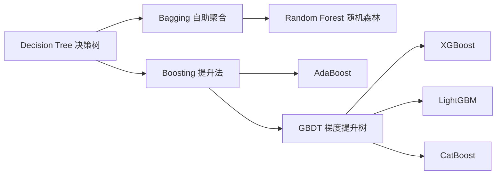
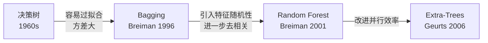
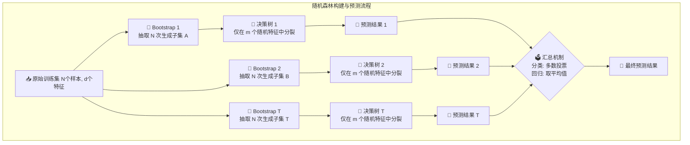

# Random Forest (随机森林)

## 知识地图



## 前置知识

- **决策树 (Decision Tree)**：理解树的分裂过程、信息增益/基尼系数、过拟合与剪枝策略。
- **方差与偏差 (Bias-Variance Tradeoff)**：理解模型的误差可以分解为偏差、方差和不可约误差三部分。偏差衡量模型预测的准确度，方差衡量模型在不同训练集上的稳定性。
- **自助采样法 (Bootstrap)**：从原始数据集中有放回地随机抽样，生成多个不同的训练子集。
- **中心极限定理与集成思想**：多个独立估计量的平均可以降低方差。

## 模型演化路线



| 算法 | 年份 | 关键创新 |
|------|------|----------|
| 决策树 | 1960s | 树形结构的 if-then 规则，可解释性强 |
| Bagging | 1996 | Bootstrap 自助采样 + 多数投票，降低方差 |
| Random Forest | 2001 | 在 Bagging 基础上增加特征随机抽样，进一步降低树间的相关性 |
| Extra-Trees | 2006 | 分裂阈值也随机选，进一步加速训练 |

## 为什么会出现 (Why)

单棵决策树虽然可解释性强，但存在一个致命的缺点：**方差极大**。稍微改动训练集中的几个样本，树的结构就可能发生翻天覆地的变化（不稳定性）。此外，决策树极容易过拟合——树长得太深，会记住训练集中的每一个噪声点。

Bagging 的出现就是为了解决这个问题：通过训练多棵"不同的"树并取平均，稳定模型的输出。但普通的 Bagging 只对数据做了随机化，树之间仍然可能高度相似（如果某个特征特别强，每棵树的第一次分裂都是同一个特征）。**Random Forest 在此基础上加上了特征随机抽样，强行切断了树之间的相关性**，使方差的降低效果达到极致。

## 解决什么问题 (Problem)

- **高方差问题**：单棵决策树在不同训练子集上表现差异巨大，随机森林通过多次采样和投票平均将方差大幅降低。
- **过拟合问题**：单棵决策树容易记住训练数据中的噪声，随机森林的"双重随机性"使得噪声无法被多棵树同时记住。
- **特征选择问题**：随机森林自带 OOB 误差估计和特征重要性排序，无需额外的交叉验证。

## 核心思想 (Core Idea)

**随机森林 = Bagging + 决策树 + 特征随机抽样**——通过"数据的随机性"和"特征的随机性"两项随机扰动，训练出大量彼此"不同"的决策树，然后通过多数投票（分类）或平均（回归）汇总结果，从而在保持较低偏差的同时大幅降低方差。

---

**比喻：**
假设你要评估一家餐厅好不好吃（预测任务）：

* **单棵决策树**：就像你去问一个美食博主。他虽然专业，但可能有个人偏见（容易过拟合）。
* **随机森林**：你找了 100 个普通路人。为了防止他们互相影响，你不仅不让他们商量，还故意蒙住他们的一只眼睛（特征随机抽样），并只让他们试吃部分菜品（自助采样）。最后大家投票，少数服从多数。事实证明，这种"充满多样性的乌合之众"做出的综合判断，往往比单个专家更准确、更稳定。

---

## 为什么叫"随机"森林？(两重随机性)

随机森林之所以能大幅降低模型的方差（Variance），核心在于它为每棵树注入了**两重随机性**，强迫树与树之间保持"差异性（独立性）"：

### 1. 数据的随机性 (Bootstrap 自助采样)

* **做法**：从 $n$ 个样本中，**有放回**地随机抽取 $n$ 次，作为一棵树的训练集。
* **数学奇迹 (63.2% 定律)**：一个样本在一次抽样中未被抽中的概率是 $1 - \frac{1}{n}$。抽了 $n$ 次始终没被抽中的概率是 $\left(1 - \frac{1}{n}\right)^n$。当 $n$ 趋于无穷大时，这个值约等于 $\frac{1}{e} \approx 36.8\%$。

> **通俗解释：** 每棵树大概只用了 63.2% 的原始数据来训练，剩下约 36.8% 的数据这棵树"从未见过"。这 36.8% 的数据就是"袋外数据"（OOB），可以免费用来评估模型好坏，不需要额外切验证集。

* **结论**：每棵树大概只用到了 **63.2%** 的原始数据。剩下的 **36.8%** 被称为 **袋外数据 (OOB, Out-of-Bag)**。

### 2. 特征的随机性 (Feature Sampling)

* **做法**：在树的每个节点分裂时，不再遍历所有 $d$ 个特征寻找最优解，而是随机挑选 $m$ 个特征进行比较。
* **经验参数**：
  * **分类任务**：$m = \lfloor\sqrt{d}\rfloor$
  * **回归任务**：$m = \lfloor d/3 \rfloor$

> **通俗解释：** 想象你要选一个地点建超市。如果不加限制，每棵树都会选"人流量最大的那条街"作为第一个分裂特征——那 100 棵树的第一次分裂都一样，树之间高度相关，投票就没意义了。特征随机抽样相当于强制每棵树只能从随机选出的几个特征中挑选，这样每棵树看问题的角度不同，最终的"综合意见"才真正有价值。

---

## 数学模型/公式

### 1. 泛化误差的上界分析

随机森林的泛化误差 ($\text{PE}^*$) 满足以下不等式：

$$\text{PE}^* \leq \frac{\bar{\rho}(1 - s^2)}{s^2}$$

* $\bar{\rho}$：树与树之间的**平均相关性**。
* $s$：单棵决策树的**平均强度**（预测准确度）。

> **通俗解释：** 这个公式是随机森林的灵魂！它告诉我们：要想泛化误差小，需要同时满足两个条件——(1) 每棵树本身要比较"靠谱"（$s$ 要大，即单棵树准确率要高）；(2) 但树与树之间不能"串通"（$\bar{\rho}$ 要小，即每棵树犯的错不能是一样的）。如果 100 棵树都犯同样的错误，那集成也没有意义。这就是为什么我们故意加入"特征随机抽样"——就是为了让树之间"不同步"。

> **核心指导意义**：要想模型好，单棵树必须有一定的准度（$s$ 要大），同时树与树之间必须尽量不一样（$\bar{\rho}$ 要小）。这就是为什么我们要引入**特征随机抽样**——强行切断树之间的相关性！

### 2. OOB 误差 (免费的交叉验证)

因为每棵树都有约 36.8% 的数据没见过，我们可以直接用这些没见过的数据来测试这棵树。将所有树的测试结果综合起来，就得到了极其靠谱的泛化误差估计，**完全不需要额外划分验证集**。

$$\text{OOB Error} = \frac{1}{n} \sum_{i=1}^{n} \ell(y_i, \hat{y}_i^{\text{OOB}})$$

> **通俗解释：** 对于样本 $i$，找出所有没有在训练集中使用过它的树，让这些树投票预测 $i$ 的标签，然后和真实标签比对。对所有样本算一遍平均误差，就是 OOB 误差。这相当于免费做了一次交叉验证！

### 3. 偏差-方差分解视角

对于回归任务，随机森林的期望泛化误差可以近似分解为：

$$\text{Error} = \text{Bias}^2 + \frac{1}{T}\sigma^2 + \frac{T-1}{T}\rho\sigma^2$$

其中 $T$ 是树的数量，$\sigma^2$ 是单棵树的方差，$\rho$ 是两棵树预测结果之间的相关系数。

> **通俗解释：** 当 $T \to \infty$ 时，独立的方差项 $\frac{1}{T}\sigma^2$ 趋于 0，但相关项 $\frac{T-1}{T}\rho\sigma^2 \to \rho\sigma^2$ 不会消失。所以，**增加树的数量只能降低独立部分的方差，无法消除由树之间的相关性带来的方差**。这就是为什么"特征随机化"如此重要——它直接降低 $\rho$！

---

## 算法流程图



---

## 可视化展示

### 决策边界：单棵决策树 vs 随机森林

**单棵决策树**的决策边界是阶梯状的、尖锐的、高度依赖训练数据的——稍微改几个样本，边界就会剧变。这是**高方差**的体现。

**随机森林**的决策边界是平滑的、稳定的大多数投票结果——即使改变部分训练样本，边界也基本不变。这是**低方差**的体现。

### OOB 误差 vs 树的数量

随着树的数量增加，OOB 误差会先快速下降，然后趋于平稳（不会上升！）。这是随机森林的一个重要特性：**随机森林不会过拟合**——增加更多树只会让预测更稳定，不会反过来损害泛化性能。

---

## 最小可运行代码

以下是仅依赖 `NumPy` 和 `scikit-learn` 单棵决策树的手写随机森林极简实现，完美复现了两重随机性：

```python
import numpy as np
from collections import Counter
from sklearn.tree import DecisionTreeClassifier

class RandomForest:
    def __init__(self, n_trees=100, max_features='sqrt', max_depth=None):
        self.n_trees = n_trees
        self.max_features = max_features
        self.max_depth = max_depth
        self.trees = []
        self.feature_subsets = []

    def fit(self, X, y):
        n, d = X.shape
        # 确定特征随机采样的数量 m
        m = int(np.sqrt(d)) if self.max_features == 'sqrt' else d
        
        for _ in range(self.n_trees):
            # 1. 数据的随机性: Bootstrap 有放回采样
            idx = np.random.choice(n, n, replace=True)  
            # 2. 特征的随机性: 无放回抽取 m 个特征
            feats = np.random.choice(d, m, replace=False)
            
            # 训练基学习器 (单棵决策树)
            tree = DecisionTreeClassifier(max_depth=self.max_depth)
            tree.fit(X[idx][:, feats], y[idx])
            
            self.trees.append(tree)
            self.feature_subsets.append(feats)

    def predict(self, X):
        preds = []
        # 让每棵树对数据进行预测 (注意只能用它训练时见过的特征列)
        for tree, feats in zip(self.trees, self.feature_subsets):
            preds.append(tree.predict(X[:, feats]))
            
        preds = np.array(preds).T  # 转置后，每一行是一个样本的 T 个预测结果
        
        # 多数投票机制 (Majority Voting)
        return np.array([Counter(row).most_common(1)[0][0] for row in preds])

```

### Scikit-learn 一行代码版本

```python
from sklearn.ensemble import RandomForestClassifier

rf = RandomForestClassifier(
    n_estimators=100,      # 树的数量 T
    max_features='sqrt',   # 特征抽样：分类默认 sqrt
    max_depth=None,        # 不限制深度（但建议设置）
    oob_score=True,        # 启用 OOB 误差估计
    n_jobs=-1,             # 并行使用所有 CPU 核心
    random_state=42
)
rf.fit(X_train, y_train)
print(f"OOB Score: {rf.oob_score_:.4f}")
```

---

## 工业界应用

| 场景 | 说明 | 为什么用随机森林 |
|------|------|------------------|
| **金融风控** | 信用评分、欺诈检测 | 高精度 + 特征重要性排序方便解释风控因子 |
| **医疗诊断** | 疾病预测、基因筛选 | 自带特征选择，能从成千上万个基因中筛选出关键基因 |
| **推荐系统** | 用户行为预测、商品推荐 | 处理高维稀疏特征效果好，不易过拟合 |
| **遥感分类** | 土地利用分类、植被识别 | 对噪声鲁棒，能处理多波段高维数据 |
| **工业预测维护** | 设备故障预测、异常检测 | OOB 提供可靠的泛化误差估计，调参压力小 |

---

## 对比表格

### Bagging vs Boosting

| 维度 | Bagging (随机森林) | Boosting (AdaBoost/GBDT/XGBoost) |
|------|-------------------|----------------------------------|
| **训练方式** | 并行（各树独立训练） | 串行（后一棵树依赖前一棵的结果） |
| **核心目标** | 降低方差 (Variance) | 降低偏差 (Bias) |
| **基学习器** | 强学习器（深树，低偏差高方差） | 弱学习器（浅树，高偏差低方差） |
| **样本权重** | 等权重 Bootstrap 采样 | 动态调整（错分样本权重变大） |
| **过拟合风险** | 极低（树越多越稳定） | 较高（需严格控制学习率和树的数量） |
| **并行能力** | 极好（线性加速） | 差（串行依赖） |
| **典型代表** | Random Forest, Extra-Trees | AdaBoost, GBDT, XGBoost, LightGBM |

---

## 算法优缺点总结

| 维度 | 评价 | 详细说明 |
| --- | --- | --- |
| **优点** | **精度高且抗造** | 极难发生过拟合（树越多越不容易过拟合，只会趋于稳定）。 |
|  | **高维数据克星** | 无需做特征选择，天然能够处理超高维的特征，且包含特征重要性评估。 |
|  | **并行计算极其友好** | 树与树之间毫无依赖关系，训练速度可以随 CPU 核心数线性提升。 |
|  | **自带"免费"验证** | OOB 数据使得无需单独划分验证集（Validation Set）或做交叉验证。 |
| **缺点** | **黑盒属性 (解释性差)** | 一棵树可以画出明确的规则，但几百棵树组成的森林完全是黑盒，无法给业务讲故事。 |
|  | **内存消耗与推理延迟** | 模型体积大。预测时需要所有树都跑一遍，延迟较高，不适合超低延迟场景。 |
|  | **噪音容忍上限** | 在噪音极其大（如类别标签标错比例过高）的数据集上，依然会发生过拟合。 |

---

## 学完后建议继续学习

1. **Boosting 家族**（AdaBoost / GBDT / XGBoost / LightGBM）——理解另一种集成范式：串行纠错 vs 并行投票
2. **Extra-Trees**——极端随机树，连分裂阈值都随机选，进一步加速
3. **Stacking / Blending**——用元学习器融合多个异构模型的输出
4. **特征工程**——理解 RF 特征重要性的计算（基于 Gini 不纯度减少 vs 基于排列重要性）
5. **贝叶斯优化调参**——用 Optuna 或 Hyperopt 在 RF 的超参数空间中自动寻优

---

## 高频面试题

### Q1: 随机森林为什么不容易过拟合？

**标准答案：** 随机森林通过两重随机性（Bootstrap 采样 + 特征随机抽样）使得每棵决策树看到的训练数据和特征子集都不同，树与树之间保持低相关性。由泛化误差上界 $\text{PE}^* \leq \frac{\bar{\rho}(1 - s^2)}{s^2}$ 可知，当树之间的相关性 $\bar{\rho}$ 很低时，即使增加树的数量 $T$，泛化误差的上界也不会增大。实际上，随着 $T \to \infty$，随机森林的泛化误差会收敛到一个极限值，而非发散——这就是"随机森林不会过拟合"的理论依据。**但要注意**：如果单棵树长得太深（不加 max_depth 限制）且数据噪声很大，森林整体仍可能过拟合，只是程度远低于单棵决策树。

### Q2: 随机森林的"两重随机性"分别解决什么问题？

**标准答案：**
- **数据随机性 (Bootstrap)**：通过有放回采样生成不同的训练集，使得每棵树学到数据的不同侧面。这使得约 36.8% 的数据成为 OOB 样本，可以被用来免费估计泛化误差。
- **特征随机性 (Feature Sampling)**：在每次节点分裂时只考虑随机选出的 $m$ 个特征，防止所有树在根节点都选同一个强特征进行分裂——如果所有树的第一个分裂都一样，那么树之间的相关性 $\bar{\rho}$ 就很高，集成的效果就大打折扣。特征随机性通过强行制造差异来降低 $\bar{\rho}$。

### Q3: 为什么随机森林的基学习器通常用"深树"而不用"浅树"？

**标准答案：** 这源于 Bagging 和 Boosting 的本质区别。Bagging 的目标是降低方差，所以需要一个**偏差低但方差高**的基学习器——深树（不剪枝的决策树）恰好满足这个条件：它能拟合得很准（低偏差），但在不同数据上变化很大（高方差），然后集成的作用就是把这个方差压下去。相反，Boosting 用**浅树**作为基学习器，因为 Boosting 的目标是降低偏差，每一轮只需要一个"弱学习器"（比随机猜略好即可）。

### Q4: OOB 误差和交叉验证 (CV) 误差有什么区别？什么时候可以替代？

**标准答案：** OOB 误差是随机森林特有的"免费午餐"——每棵树的训练集中没有用到的约 36.8% 的样本天然构成该树的验证集，综合所有树的验证结果即得 OOB 误差。与 K 折交叉验证相比：(1) OOB 无需额外划分数据和多次训练，计算成本极低；(2) 经验表明，OOB 误差和 5 折 CV 的误差高度相关，在很多场景下可以相互替代。但它不能替代 CV 用于其他模型（如 SVM、神经网络）的评估。

### Q5: 随机森林中 $m$（特征抽样数）和 $T$（树的数量）如何选择？

**标准答案：**
- **$m$（特征抽样数）**：分类问题默认 $m = \lfloor\sqrt{d}\rfloor$，回归问题默认 $m = \lfloor d/3 \rfloor$。$m$ 越小，树之间的相关性越低，方差越低，但单棵树的强度也越低（偏差可能上升）。默认值通常已经足够好，除非数据极其特殊。
- **$T$（树的数量）**：原则是"多多益善"——$T$ 越大，模型越稳定，且不会过拟合。但收益递减：从 10 到 100 提升显著，从 500 到 1000 几乎无差别。一般建议 100~500 棵，根据计算资源平衡。可以用 OOB 误差曲线来判断：当 OOB 误差不再下降时，再增加树也没意义了。
