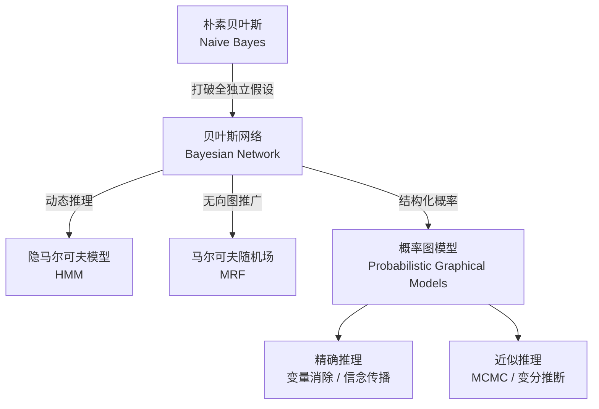
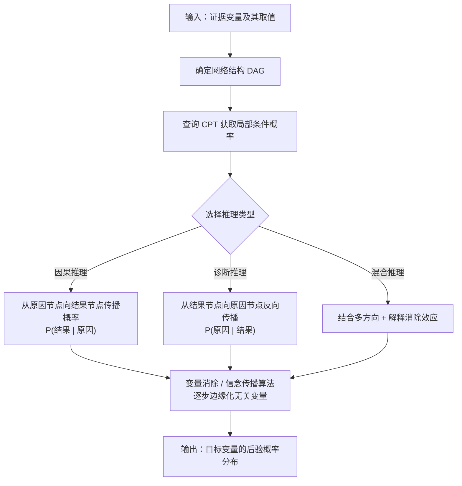
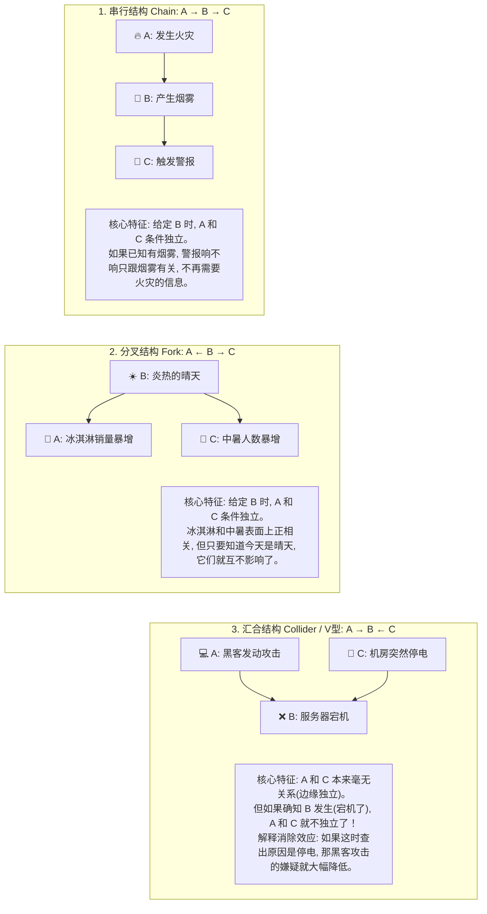

# Bayesian Network (贝叶斯网络)

## 知识地图



## 前置知识

- **概率论基础**：条件概率 $P(A \mid B)$、联合概率 $P(A, B)$、链式法则
- **朴素贝叶斯**：理解其"特征条件独立"假设及其局限性
- **图论基础**：有向图、无环图（DAG）的基本概念
- **最大似然估计 (MLE)**：从数据中估计参数的基本方法

## 为什么会出现 (Why)

朴素贝叶斯算法有一个致命的弱点：它假设世界上所有的特征都是"绝对独立"的（即"全独立"假设），这在现实中几乎不可能。例如，"发烧"和"咳嗽"这两个症状显然不是独立的——它们可能都由"感冒"这个隐藏原因引起。**贝叶斯网络（信念网络）** 就是为了打破这个限制而诞生的。它是一个**有向无环图 (DAG)**，节点代表随机变量，箭头代表因果或依赖关系，使得我们可以在复杂依赖关系中进行概率推理。

## 解决什么问题 (Problem)

在现实世界中，变量之间存在复杂的因果和依赖关系。我们需要一种模型能够：
1. 显式地编码变量之间的依赖结构（谁影响谁）
2. 在给定部分观测证据时，推断其他变量的概率分布
3. 避免全联合分布的参数爆炸问题（$n$ 个二值变量需要 $2^n$ 个参数）

## 核心思想 (Core Idea)

**利用有向无环图编码变量的条件依赖关系，将全联合概率分布分解为每个节点在父节点条件下的局部概率乘积，实现结构化、可解释的概率推理。**

**比喻：**
想象你是一个神探。

- **朴素贝叶斯** 就像一个死板的警察，认为"地上有水"和"天上打雷"是完全不相干的两条线索，分开计算概率。
- **贝叶斯网络** 就像夏洛克-福尔摩斯，他在脑海中画了一张关系网："打雷"会导致"下雨"，"下雨"会导致"地上有水"。如果这时候又发现"洒水车经过"，他会动态调整概率：既然洒水车来了，那地上有水很可能不是因为下雨，打雷的嫌疑也就降低了。

这就是贝叶斯网络的核心能力：**利用因果关系网，在复杂线索中进行动态的概率推理。**

---

## 数学模型/公式

### 联合概率分布分解

整个网络中所有事件同时发生的概率，可以通过"链式法则"极大地简化为每个节点条件概率的乘积：

$$P(X_1, X_2, \ldots, X_n) = \prod_{i=1}^{n} P(X_i \mid \text{Parents}(X_i))$$

**通俗解释：** 不需要记住所有变量的所有组合的概率，只需要记住每个变量"在它的直接原因已知时"的概率即可。比如要知道"火灾 + 烟雾 + 警报"同时发生的概率，只需知道：火灾发生的概率、火灾导致烟雾的概率、烟雾触发警报的概率，三者相乘即可。

### 条件概率表 (CPT)

一个完整的贝叶斯网络由两部分组成：

1. **定性结构**：一个有向无环图 $G = (V, E)$，表示谁影响了谁。
2. **定量参数**：每个节点的**条件概率表 (CPT, Conditional Probability Table)**。即在父节点发生的情况下，该节点发生的概率：$P(X_i \mid \text{Parents}(X_i))$。

**通俗解释：** CPT 就是每个节点的"规则表"。比如"警报"节点的 CPT 写着：如果有烟雾，警报响的概率是 99%；如果没有烟雾，警报响的概率是 0.1%（误报）。每个节点都有一张这样的表。

### 条件独立性与参数压缩

贝叶斯网络的核心价值在于编码了**条件独立性**。如果没有独立性假设，计算概率需要一张极其庞大的表格；而贝叶斯网络通过切断不相关的节点，极大地压缩了所需的参数量。

*假设有 $n$ 个二值变量（只有发生/不发生两种状态），每个节点最多有 $k$ 个父节点：*

| 模型类型 | 依赖假设 | 需要的参数数量级 | 评价 |
| --- | --- | --- | --- |
| **全联合分布** | 万物皆有关联 | $O(2^n)$ | 灾难级。稍微多几个变量，参数比宇宙原子还多，根本算不出来。 |
| **朴素贝叶斯** | 变量之间绝对独立 | $O(n)$ | 极简，计算飞快。但假设太天真，准确率受限。 |
| **贝叶斯网络** | **仅依赖直接父节点** | **$O(n \cdot 2^k)$** | **完美的折中。既保留了关键的依赖关系，又把计算量控制在了可接受的范围内。** |

**通俗解释：** 全联合分布相当于把所有可能的因果关系都画满——10 个变量就需要 1024 个概率值，100 个变量就彻底算不动了。朴素贝叶斯走到另一个极端，假设什么关系都没有。贝叶斯网络取中间：只记录真正重要的因果连线。

### 参数学习 (MLE)

当网络的图结构（连线方式）已经确定，且有充足的训练数据时，我们可以使用**最大似然估计 (MLE)** 来填满每个节点的条件概率表 (CPT)：

$$P(X_i = x \mid \text{Pa}(X_i) = \mathbf{p}) = \frac{\text{count}(X_i = x, \text{Pa}(X_i) = \mathbf{p})}{\text{count}(\text{Pa}(X_i) = \mathbf{p})}$$

**通俗解释：** 在所有"父亲"状态为 p 的样本中，"儿子"状态为 x 的样本占了多少比例。本质上就是数数——数出现了多少次，然后除以总数。

### 结构学习

如果没有现成的图结构，让机器自己从数据中找出因果连线，这是一个极其困难的 **NP-hard** 问题。常用的解法：

- **基于约束 (Constraint-based)**：用统计学检验（如卡方检验）测试变量间是否条件独立，如果独立就剪断连线。
- **基于评分 (Score-based)**：把找结构变成一个搜索问题。定义一个评分函数（如 BIC、AIC），尝试各种连线组合，选出得分最高的图。
- **混合方法 (Hybrid)**：先用约束法画出个粗略的草图，再用评分法精细调整箭头方向。

**通俗解释：** 结构学习就是让算法自己发现"谁导致谁"。约束法像科学家做实验——如果发现两个变量在控制第三个变量后不再相关，就说明它们之间没有直接连线。评分法则像赌徒——尝试各种连线组合，看哪个组合最能解释已有数据。

---

## 算法流程图

### 贝叶斯网络推理流程



### 三种基本拓扑结构

贝叶斯网络中任意复杂的图，都可以拆解为这三种基础结构：



---

## 可视化展示

### 经典推理类型

基于上述的图结构，我们可以进行多种方向的概率推理：

1. **因果推理 (顺藤摸瓜 / Top-Down)**：$P(\text{结果} \mid \text{原因})$
   - *已知起火了，求触发警报的概率。*

2. **诊断推理 (逆向溯源 / Bottom-Up)**：$P(\text{原因} \mid \text{结果})$
   - *听到警报响了，求真正发生火灾的概率（排除误报）。*

3. **混合推理 (跨因果)**：即汇合结构中的"解释消除 (Explaining Away)"。
   - *警报响了（火灾和被盗都有可能），但突然警察通知说是小偷触发的。那么真正起火的概率就会瞬间降低。*

---

## 最小可运行代码

```python
import numpy as np
from collections import defaultdict

class BayesianNetwork:
    """
    简单的贝叶斯网络实现，支持离散变量。
    结构用 DAG（父节点列表）定义，CPT 通过 MLE 学习。
    """
    def __init__(self, structure):
        """
        structure: dict {node: [parent_nodes]}
        例如: {'Fire': [], 'Smoke': ['Fire'], 'Alarm': ['Smoke']}
        """
        self.structure = structure
        self.nodes = list(structure.keys())
        self.cpt = {}  # {node: {parent_vals_tuple: {node_val: prob}}}

    def fit(self, data):
        """
        data: list of dicts, 每个 dict 是一次观测
        例: [{'Fire': 1, 'Smoke': 1, 'Alarm': 1}, {'Fire': 0, 'Smoke': 0, 'Alarm': 0}, ...]
        使用 MLE 学习 CPT
        """
        n = len(data)
        for node in self.nodes:
            parents = self.structure[node]
            self.cpt[node] = {}

            # 按父节点取值分组
            grouped = defaultdict(list)
            for row in data:
                parent_key = tuple(row[p] for p in parents) if parents else ()
                grouped[parent_key].append(row[node])

            for parent_key, vals in grouped.items():
                total = len(vals)
                self.cpt[node][parent_key] = {}
                unique_vals, counts = np.unique(vals, return_counts=True)
                for v, c in zip(unique_vals, counts):
                    self.cpt[node][parent_key][v] = c / total

    def get_prob(self, node, node_val, evidence):
        """
        查询 P(node = node_val | evidence)
        evidence: dict {parent_node: value}
        """
        parents = self.structure[node]
        if parents:
            parent_key = tuple(evidence.get(p, None) for p in parents)
        else:
            parent_key = ()
        return self.cpt[node].get(parent_key, {}).get(node_val, 0.0)

    def joint_prob(self, assignment):
        """
        计算联合概率 P(X1=x1, X2=x2, ...)
        P(X1,...,Xn) = ∏ P(Xi | Parents(Xi))
        """
        prob = 1.0
        for node in self.nodes:
            node_val = assignment[node]
            parents = self.structure[node]
            parent_key = tuple(assignment[p] for p in parents) if parents else ()
            p = self.cpt[node].get(parent_key, {}).get(node_val, 0.0)
            prob *= p
        return prob


# ===== 使用示例 =====
if __name__ == '__main__':
    # 定义结构: Fire → Smoke → Alarm
    structure = {'Fire': [], 'Smoke': ['Fire'], 'Alarm': ['Smoke']}
    bn = BayesianNetwork(structure)

    # 模拟训练数据
    np.random.seed(42)
    data = []
    for _ in range(10000):
        fire = 1 if np.random.random() < 0.01 else 0
        smoke = 1 if (fire and np.random.random() < 0.9) or (not fire and np.random.random() < 0.05) else 0
        alarm = 1 if (smoke and np.random.random() < 0.99) or (not smoke and np.random.random() < 0.001) else 0
        data.append({'Fire': fire, 'Smoke': smoke, 'Alarm': alarm})

    bn.fit(data)

    # 查询: P(Alarm=1 | Smoke=1)
    prob_alarm_given_smoke = bn.get_prob('Alarm', 1, {'Smoke': 1})
    print(f'P(Alarm=1 | Smoke=1) = {prob_alarm_given_smoke:.4f}')

    # 查询: 联合概率 P(Fire=1, Smoke=1, Alarm=1)
    joint = bn.joint_prob({'Fire': 1, 'Smoke': 1, 'Alarm': 1})
    print(f'P(Fire=1, Smoke=1, Alarm=1) = {joint:.6f}')
```

---

## 工业界应用

| 领域 | 应用场景 | 典型用法 |
| --- | --- | --- |
| **医疗诊断** | 疾病推理系统 | 建立"生活习惯 → 隐性疾病 → 显性症状 → 检查结果"网络，输入化验单推断患病概率 |
| **故障诊断 (RCA)** | IT 运维 / 工业设备 | 在微服务架构中，顺着报警风暴反向追踪最底层的故障根因 |
| **金融风控** | 欺诈检测 / 信用评估 | 综合"收入水平"、"消费习惯"、"历史违约"等相互依赖特征做概率推断 |
| **自然语言处理** | 主题模型 / 语义分析 | LDA 等主题模型可视为贝叶斯网络的特例 |
| **推荐系统** | 用户意图推断 | 建模"用户意图 → 浏览行为 → 点击/购买"的因果链 |
| **生物信息学** | 基因调控网络 | 建模基因之间的激活/抑制关系 |

---

## 对比表格

| 维度 | 朴素贝叶斯 | 贝叶斯网络 | 马尔可夫随机场 (MRF) |
| --- | --- | --- | --- |
| **图结构** | 星型（类别→所有特征） | 有向无环图 (DAG) | 无向图 |
| **依赖假设** | 特征条件独立 | 仅依赖父节点 | 局部马尔可夫性 |
| **参数复杂度** | $O(n)$ | $O(n \cdot 2^k)$ | 取决于团的大小 |
| **推理方向** | 只能诊断（原因←证据） | 因果 + 诊断 + 混合 | 无方向，更灵活 |
| **可解释性** | 中 | 强（箭头即因果关系） | 中（无因果方向） |
| **结构学习** | 无需（固定结构） | NP-hard | NP-hard |
| **典型应用** | 文本分类、垃圾邮件过滤 | 医疗诊断、故障分析 | 图像分割、去噪 |

---

## 学完后建议继续学习

1. **隐马尔可夫模型 (HMM)**：贝叶斯网络在时序数据上的推广，状态随时间演化
2. **马尔可夫随机场 (MRF)**：无向图模型，适用于图像分割等空间关系建模
3. **精确推理算法**：变量消除 (Variable Elimination)、信念传播 (Belief Propagation)
4. **近似推理方法**：MCMC 采样、变分推断 (Variational Inference)——当网络太复杂无法精确推理时使用
5. **因果推断 (Causal Inference)**：Pearl 的 do-calculus，从相关性走向因果性

---

## 高频面试题

### Q1: 贝叶斯网络和朴素贝叶斯的本质区别是什么？

**标准答案：** 朴素贝叶斯假设所有特征在给定类别下条件独立，即 $P(X_1, X_2 \mid Y) = P(X_1 \mid Y) \cdot P(X_2 \mid Y)$。贝叶斯网络放弃了这一强假设，允许特征之间存在任意的依赖关系（用 DAG 编码），将联合概率分解为 $P(X_1, \dots, X_n) = \prod_i P(X_i \mid \text{Parents}(X_i))$。朴素贝叶斯可以看作贝叶斯网络的一个特例——是一个两层的有向图，类别节点指向所有特征节点，特征之间无边。

### Q2: 什么是"解释消除"(Explaining Away)？请举例说明。

**标准答案：** 解释消除发生在汇合结构（V-结构）中：两个独立原因共同导致一个结果。当观察到结果发生时，两个原因变得相关（不再独立）；但如果确定其中一个原因是真凶，另一个原因的概率就会大幅下降。经典例子：服务器宕机（B）可能由黑客攻击（A）或停电（C）导致。A 和 C 原本独立。如果观察到服务器宕机了，A 和 C 同时变得可疑。但如果随后确认是停电导致的，黑客攻击的概率就大幅降低——停电"解释消除"了对黑客的怀疑。

### Q3: 如何从数据中学习贝叶斯网络的结构？

**标准答案：** 结构学习是 NP-hard 问题，主要有三类方法：
1. **基于约束的方法**：通过条件独立性检验（如卡方检验、G-test）判断变量间是否存在边。PC 算法是典型代表。
2. **基于评分的方法**：定义评分函数（BIC、AIC、MDL）评估图结构对数据的拟合程度，然后在 DAG 空间中使用爬山法、模拟退火等搜索最优结构。
3. **混合方法**：先用约束法缩小搜索空间，再用评分法精细调整。实践中常结合专家知识限定部分边的方向。

### Q4: 贝叶斯网络的参数学习如何做？如果有缺失数据怎么办？

**标准答案：** 完整数据下使用最大似然估计 (MLE)：$P(X_i = x \mid \text{Pa}(X_i) = \mathbf{p}) = \frac{\text{count}(x, \mathbf{p})}{\text{count}(\mathbf{p})}$，即数频次再归一化。也可使用贝叶斯估计（加 Dirichlet 先验平滑）避免零概率问题。有缺失数据时，MLE 没有闭式解，需要使用 EM 算法：E 步根据当前 CPT 估计缺失值的期望充分统计量，M 步用填充后的统计量更新 CPT，迭代至收敛。

### Q5: 贝叶斯网络的推理算法有哪些？各适用于什么场景？

**标准答案：**
- **精确推理**：变量消除 (Variable Elimination) 逐步边缘化无关变量；信念传播 (Belief Propagation) 在树状图上可精确计算，在一般图上为 Loopy BP（近似）。适用于网络较小（节点数 < 100）或树状结构。
- **近似推理**：MCMC 采样（如 Gibbs 采样）从后验分布中采样逼近；变分推断将推理转化为优化问题，用简单分布近似复杂后验。适用于大规模网络或稠密连接的图。
