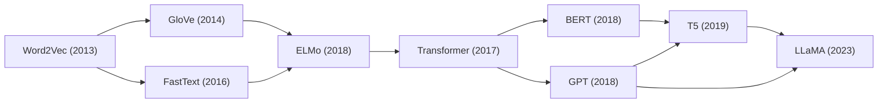
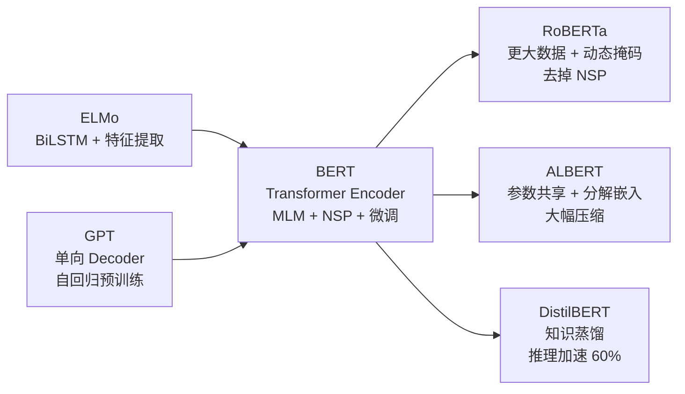
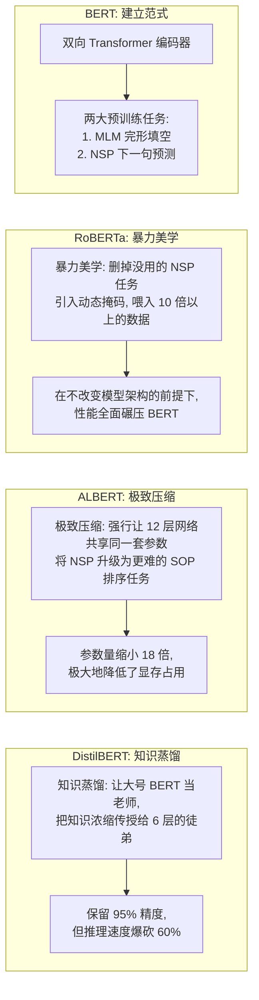
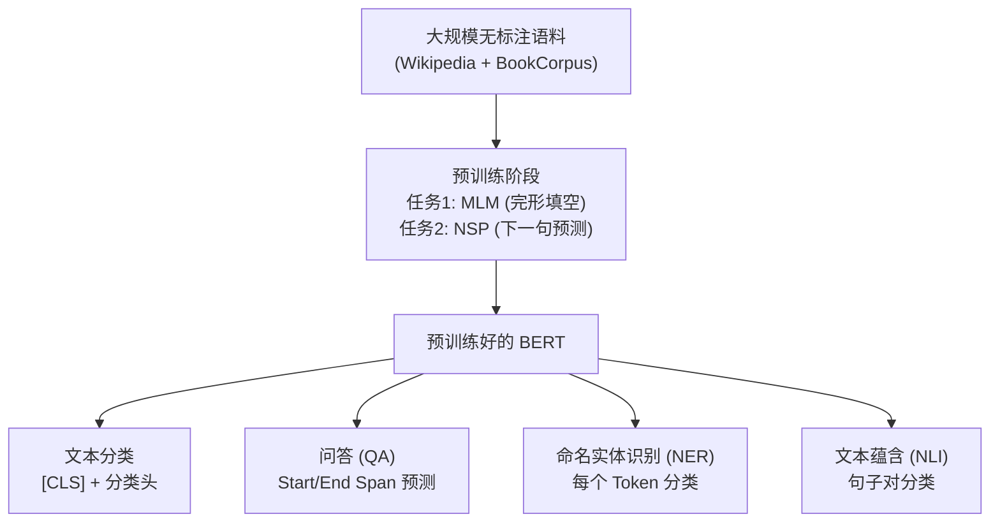
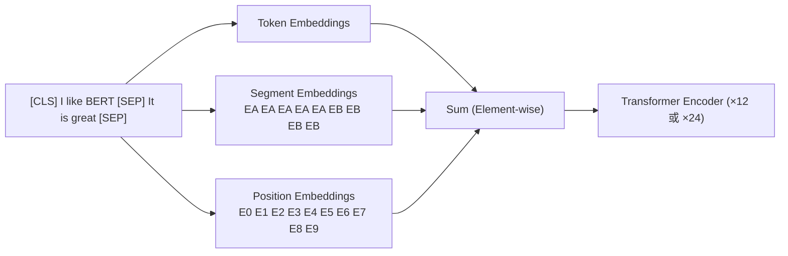

# BERT 家族大盘点 (BERT / RoBERTa / ALBERT / DistilBERT)

## 知识地图



## 前置知识

- **Transformer 架构**：深入理解 Encoder 结构，特别是 Self-Attention、FFN、残差连接和 LayerNorm。
- **ELMo**：理解双向语言模型预训练和上下文词向量的概念，BERT 是 ELMo 的"Transformer 升级版"。
- **GPT**：理解自回归语言模型（单向 Decoder 预训练），对比 BERT 的双向 Encoder 路线。
- **迁移学习**：理解"大规模预训练 + 下游微调"的范式，BERT 将这一范式推向成熟。
- **WordPiece Tokenization**：理解 BERT 使用的子词分词算法，与 BPE 的关系和区别。

## 模型演化路线



| 阶段 | 模型 | 核心突破 |
|------|------|----------|
| 上下文词向量 | ELMo | 双向 LSTM，词向量随上下文变化 |
| 预训练微调 | BERT | Transformer Encoder + MLM/NSP，双向深层交互 |
| 更大更强 | RoBERTa | 动态掩码、更大数据、去掉 NSP，不换架构也能屠榜 |
| 极致压缩 | ALBERT | 跨层参数共享 + 分解嵌入，参数量降 18 倍 |
| 蒸馏加速 | DistilBERT | 知识蒸馏，保留 95% 性能，推理快 60% |

## 为什么会出现 (Why)

### 从 ELMo 到 BERT

ELMo (2018 年初) 引入了"预训练 + 下游特征提取"范式，但存在两个根本局限：

1. **LSTM 的双向是"假的"**：ELMo 的前向 LSTM 和后向 LSTM 是独立训练的，两者之间没有交互。前向 LSTM 不知道后面的词，后向 LSTM 不知道前面的词。这不是真正的双向上下文建模。

2. **特征提取而非微调**：ELMo 将预训练的 BiLM 参数冻结，作为"特征提取器"喂给下游任务模型。这意味着预训练学到的知识不能随下游任务调整，迁移效率不高。

### BERT 的解决方案

- 用 **Transformer Encoder** 替代 LSTM，实现**真正的深层双向交互**（每一层 self-attention 都同时看左右）
- 设计 **MLM (Masked Language Model)** 预训练任务——随机遮盖部分词，让模型从完整上下文中预测被遮盖的词，天然实现双向建模
- 采用 **微调 (Fine-tuning)** 范式——预训练模型参数随下游任务一起更新，最大化知识迁移

### BERT 家族的出现

- **RoBERTa**：发现 BERT 根本没训练透，通过更大数据、动态掩码、去掉 NSP 实现性能飞跃
- **ALBERT**：BERT 太大（110M-340M 参数），普通显卡装不下，通过参数共享和分解嵌入极限压缩
- **DistilBERT**：BERT 推理太慢（24层），通过知识蒸馏压缩到 6 层，适合线上部署

## 解决什么问题 (Problem)

1. **实现真正的双向上下文理解**（ELMo 只是浅层双向）
2. **统一 NLP 任务范式**：所有任务都通过"预训练 + 微调"解决，不再需要为每个任务设计特定架构
3. **大幅提升 NLP 基准**：在 11 项 NLP 任务上刷新 SOTA（GLUE 提升 7.7%，MultiNLI 提升 4.6%，SQuAD v1.1 提升 5.1%）
4. **家族成员解决不同痛点**：RoBERTa 追求极致效果、ALBERT 追求低资源、DistilBERT 追求推理速度

## 核心思想 (Core Idea)

BERT 使用 Transformer 的**编码器 (Encoder) 部分**，通过"完形填空 (MLM)"和"下一句预测 (NSP)"两个预训练任务，在无标注语料上学习**真正双向的深层上下文表示**，然后在下游任务上微调。

---

## 1. 原生 BERT (Bidirectional Encoder Representations from Transformers)

### 预训练任务

#### 任务 1：掩码语言模型 (MLM, Masked Language Model)

随机遮住（Mask）输入序列中 15% 的词汇，让模型去猜。

**防死记硬背机制**：为了防止模型遇到 `[MASK]` 标记才去猜词，在这 15% 的词中：
- 80% 替换为 `[MASK]`
- 10% 替换为随机乱写的词
- 10% 保持原样不遮挡

**通俗解释：** 类似英语考试的完形填空题——把文章里的个别词抠掉，让你根据上下文填回来。BERT 通过做这道题学会理解语境。为什么不全用 [MASK]？因为下游任务（如文本分类）的数据中并不会出现 [MASK] 标记，如果训练时只会填 [MASK]，微调时就懵了。80-10-10 的分割策略让模型既学会填空，又保持对真实自然语言的泛化能力。

#### 任务 2：下一句预测 (NSP, Next Sentence Prediction)

给模型喂两句话 A 和 B，50% 的概率 B 真的是 A 的下一句，50% 的概率 B 是从别的文章里随便抽的一句话。模型需要输出 True 或 False。

**通俗解释：** 这个任务训练模型理解句子之间的关系——比如问答、推理任务需要判断两个句子的逻辑关联。给定两句话，判断它们是不是真正挨在一起。后来 RoBERTa 发现这个任务太简单（靠主题词就能猜出来），训练效果不大，于是直接删掉了。

### 输入表示 (Input Embeddings)

BERT 的输入极其讲究，它需要把三种信息"加"在一起喂给模型：

1. **Token Embedding**：词本身的向量（使用 WordPiece 子词分词）。
2. **Segment Embedding**：区分这个词是属于句子 A 还是句子 B。
3. **Position Embedding**：区分这个词在句子中的绝对位置（可学习的位置编码）。

**长相如下：**

```text
[CLS]  我  喜  欢  吃  [SEP]  苹  果  和  香  蕉  [SEP]
  ↑                       ↑
句子级分类标识           断句分隔符

```

*注：最终整句话的浓缩精华，会被提取到最前面的 `[CLS]` 标签里。*

---

## 2. RoBERTa — 更鲁棒的"究极体" BERT

RoBERTa 发现原生 BERT 其实**根本没训练透**。它没有提出新的网络结构，纯靠"炼丹手法的升级"就屠榜了：

1. **废弃 NSP 任务**：研究发现 NSP 任务太简单了（靠主题词就能猜出来），不仅没帮助，反而限制了模型的长文本推理能力。直接删掉！
2. **动态掩码 (Dynamic Masking)**：BERT 在整个训练周期里，每一句话被抠掉的词是固定的。RoBERTa 在每次把数据喂给模型时，都临时随机抠掉不同的词。
3. **疯狂加料**：把 Batch Size 从 256 暴涨到 8K；训练数据从 16GB 暴涨到 160GB。

**通俗解释：** RoBERTa 的核心哲学——"BERT 这个学生很聪明，但老师（谷歌）只给它做了 10 道题（epoch），还没学会就收卷了。让这个学生再多做 100 道题（更多数据 + 更久训练），每次都换新的题（动态掩码），再把那道太难又没用的大题（NSP）删掉。" 结果在不改任何架构的情况下全面超越 BERT。

---

## 3. ALBERT — 显存不够的救星

ALBERT 解决的核心痛点是：**模型太大，普通人的显卡根本装不下。**

### 核心魔改 1：跨层参数共享 (Cross-layer Parameter Sharing)

- **原理**：原本 BERT-Base 有 12 层不同的网络。ALBERT 强行规定：**这 12 层网络必须使用完全相同的一套权重参数。**
- **大白话**：以前是 12 个不同的工人流水线作业；现在是 1 个工人把同一套动作重复做了 12 遍。
- **注意（常见误区）**：这招**大幅减少了参数量（显存占用）**，但**完全没有减少计算时间**（因为前向传播依然要跑 12 遍）。

**通俗解释：** 想象一本书有 12 章，BERT 是每章内容都不同的完整书籍。ALBERT 则是把同一章复印了 12 份——纸张（显存）省了不少，但读书时还是得翻 12 遍（计算量不变）。

### 核心魔改 2：分解嵌入矩阵 (Factorized Embedding Parameterization)

把原本庞大的词汇表矩阵拆分成两个小矩阵相乘：

$$\mathbf{E} = \mathbf{W}_{V \times E} \quad \rightarrow \quad \mathbf{E} = \mathbf{W}_{V \times d} \cdot \mathbf{W}_{d \times H}$$

**通俗解释：** 原来的 Token Embedding 矩阵大小是 $V \times H$（词表大小 × 隐藏维度 = 30000 × 768 ≈ 2300 万参数）。ALBERT 把它拆成两步：先映射到一个很小的中间维度 $d$（如 128），再映射到隐藏维度 $H$（768）。参数量变成 $V \times d + d \times H$（30000 × 128 + 128 × 768 ≈ 394 万），节省了约 83%。本质是做了一个低秩分解。

### 核心魔改 3：句子顺序预测 (SOP, Sentence Order Prediction)

既然 NSP 被 RoBERTa 证明没用了，ALBERT 发明了更难的 SOP 任务：**把正常挨着的两句话顺序颠倒**，让模型判断语序对不对。这逼着模型真正去理解句子的逻辑，而不是只看主题。

**通俗解释：** NSP 是判断"这两个句子是不是邻居"（太简单，看主题词就行）。SOP 是判断"这两个邻居谁在前面谁在后面"（更难，需要理解句子间的逻辑顺序和因果关系）。

---

## 4. DistilBERT — 部署上线的最爱

采用**知识蒸馏 (Knowledge Distillation)** 技术，让庞大的 BERT-Base 作为"教师模型"，指导一个只有 6 层的"学生模型"学习。

- **效果**：参数直接砍半，推理速度提升 60%，但依然保留了原生 BERT 95% 的语言理解能力。工程落地（如文本分类、情感分析）的首选。

**通俗解释：** 知识蒸馏就像"名师带徒弟"——老师（BERT-Base 12 层）先做题，不仅告诉徒弟答案（分类标签），还把自己的"思考过程"（soft logits，即每个类别的概率分布）展示给徒弟（DistilBERT 6 层）。徒弟学习的不只是正确答案，还有老师的判别逻辑，因此能在参数减半的情况下保留 95% 的性能。

---

## 家族进化图谱



## 核心参数量对比

| 模型名称 | 层数 (Layers) | 隐藏层维度 | 参数量 | 核心定位 |
| --- | --- | --- | --- | --- |
| **BERT-Base** | 12 | 768 | ~110M | 经典基线标准 |
| **BERT-Large** | 24 | 1024 | ~340M | 高精度要求 |
| **RoBERTa-Large** | 24 | 1024 | ~355M | 打榜、刷 SOTA 必备 |
| **ALBERT-Large** | 24 | 1024 | **~18M** | 极致压缩，参数量骤降 18 倍 |
| **DistilBERT** | **6** | 768 | **~66M** | 速度快，适合实时在线推理 |

## 可视化展示

### BERT 预训练与微调流程



### BERT 输入表示



## 最小可运行代码

### PyTorch / HuggingFace 代码实战

只需短短几行代码，即可调用 BERT 家族提取文本特征：

```python
from transformers import AutoTokenizer, AutoModel
import torch

# 想换模型？直接把字符串换成 "roberta-base", "albert-base-v2", "distilbert-base-uncased" 即可
model_name = "bert-base-uncased"

tokenizer = AutoTokenizer.from_pretrained(model_name)
model = AutoModel.from_pretrained(model_name)

# 1. 文本预处理 (自动添加 [CLS], [SEP] 和 Padding)
inputs = tokenizer("Hello world, BERT is awesome!", return_tensors="pt")

# 2. 前向传播提取特征
with torch.no_grad():
    outputs = model(**inputs)

# 3. 解析输出
# last_hidden_state: 包含所有 token 的上下文向量，形状为 [Batch, Seq_Len, 768]
# 通常用于做 NER（命名实体识别）或 Token 级别的分类
all_tokens_embeddings = outputs.last_hidden_state

# pooler_output: 仅提取 [CLS] token 的向量（经过一次 Dense + Tanh），形状为 [Batch, 768]
# 包含整句话的浓缩含义，通常直接外接分类器做文本分类、情感分析
sentence_embedding = outputs.pooler_output
```

## 工业界应用

| 应用场景 | 说明 | 推荐模型 |
|----------|------|----------|
| 搜索引擎 | 查询-文档语义匹配 | BERT (Google Search 2019 起使用) |
| 情感分析 | 产品评价、舆情监控 | DistilBERT (部署成本低) |
| 问答系统 | 从文档中抽取答案 | BERT-Large / RoBERTa |
| 命名实体识别 | 提取文本中的人名、地名等 | BERT-Base + CRF 头 |
| 文本分类 | 新闻分类、垃圾邮件检测 | DistilBERT / ALBERT (资源受限) |
| 对话系统 | 意图识别、槽位填充 | BERT-Base (平衡效果和速度) |
| 低资源语言 | 通过多语言 BERT 迁移 | mBERT (104 种语言) |

## 对比表格

| 维度 | BERT | RoBERTa | ALBERT | DistilBERT |
|------|------|---------|--------|------------|
| 参数量 | 110M (Base) | 125M (Base) / 355M (Large) | 12M (Base) / 18M (Large) | 66M |
| 架构改进 | 原始 | 无架构变化 | 跨层参数共享 + 分解嵌入 | 6 层压缩 |
| 预训练任务 | MLM + NSP | 仅 MLM (动态掩码) | MLM + SOP | MLM (蒸馏) |
| 训练数据大小 | 16GB | 160GB | 16GB | 同 BERT |
| 训练时长 | 基准 | 比 BERT 长很多 | 较快 (参数少) | 借助教师模型 |
| 推理速度 | 基准 | 与 BERT 相同 | 与 BERT 相同 (计算量不变) | 比 BERT 快 60% |
| 最佳使用场景 | 通用基线 | SOTA 打榜、高精度 | 显存受限 | 线上部署、实时推理 |

## 学完后建议继续学习

1. **GPT 系列**：了解另一条路线——自回归语言模型 + 生成能力
2. **T5 / BART**：了解 Encoder-Decoder 架构如何统一理解和生成任务
3. **ELECTRA**：了解更高效的预训练判别方法（RTD）
4. **Prompt Engineering / In-Context Learning**：了解 GPT-3 引入的"不用微调也能做下游任务"新范式

## 高频面试题

### Q1: BERT 的 MLM 预训练中，为什么被 Mask 的 15% token 不全用 [MASK] 替换？

**标准答案：**
- 如果预训练时只见过 [MASK]，而下游任务的数据中根本没有 [MASK] 标记，就会产生**预训练和微调不匹配 (mismatch)** 的问题。模型在微调时面对正常的文本会"不知所措"。
- BERT 的对策是对这 15% 的 token 做三种处理：
  - 80% 替换为 [MASK]：让模型学会"填空"
  - 10% 替换为随机词：让模型知道并非所有被改的词都是 [MASK]，迫使模型用上下文（而非 [MASK] 标记本身）来判断词的正确性
  - 10% 保持不变：让模型学会分辨"这个词是不是对的"，保持对真实文本的感知
- 10% 随机替换虽然会引入噪音，但因为比例小（总 token 的 1.5%），不会显著影响模型的语言能力。

### Q2: BERT 的 NSP 任务为什么被 RoBERTa 废弃？SOP 和 NSP 有什么区别？

**标准答案：**
- **NSP 太简单**：判断两个句子是不是前后句，模型往往只需看主题词是否一致就能猜对（比如两个句子都在讲"篮球"，大概率是相邻的），并没有真正学到句子间的逻辑关系。
- **NSP 反而有害**：RoBERTa 实验发现，去掉 NSP 在某些长文本任务上效果更好，因为 NSP 强制将输入切成两个句子，限制了模型对更长连续文本的建模。
- **SOP (Sentence Order Prediction)**：ALBERT 提出的替代方案。不是判断"两句话是不是邻居"，而是判断"两句话的顺序是否正确"。这逼模型去理解句子间的因果、时序、逻辑关系，比 NSP 难得多且更有用。

### Q3: ALBERT 的跨层参数共享为什么不减少推理时间？

**标准答案：**
- 这是一个常见的理解误区。跨层参数共享只减少了**需要存储的参数量**（显存/磁盘占用），但没有减少**计算量**。
- 虽然所有层共享同一套权重，但前向传播时：
  - 输入仍然需要经过 12（或 24）层的 Transformer 计算
  - 每一层都要做 Self-Attention 和 FFN 的矩阵乘法
  - 只是每层使用的矩阵是同一套而已
- 类比：用同一个印章盖 12 次，章只有 1 个（参数量小），但盖 12 下的动作一个不少（计算量相同）。
- 真正减少计算量的是 DistilBERT，通过减少层数（12→6）来降低计算量。

### Q4: 知识蒸馏中，学生模型是如何从教师模型学习的？为什么只用 hard labels 不够？

**标准答案：**
- **Hard Label 蒸馏**：学生只看教师给出的最终分类标签（如"正面"）。这只传递了"答案是什么"。
- **Soft Label 蒸馏 (DistilBERT 的做法)**：学生看教师输出的完整概率分布（soft logits）。例如情感分析中，教师输出的可能是 [正面: 0.85, 负面: 0.10, 中性: 0.05]，这告诉了学生：
  - "正面"是正确答案（概率最高）
  - "负面"比"中性"更像正确答案（概率 0.10 vs 0.05）
  - 这个句子虽然被分为"正面"，但有一点"负面"的成分
- Soft labels 包含了**类别之间的相似关系**（知识暗含在概率分布的形状中），比 hard label 的信息量丰富得多。这就是为什么 DistilBERT 能保留 95% 的性能。

### Q5: BERT 的 [CLS] token 为什么能代表整个句子的语义？

**标准答案：**
- [CLS] 是 BERT 在每个输入序列开头添加的特殊 token，它本身没有语义信息，是一个"占位符"。
- 经过 12/24 层 Transformer Encoder 的 Self-Attention 处理后，[CLS] 位置会**聚合来自整个序列所有 token 的信息**——因为每一层的 Self-Attention 都允许 [CLS] 关注序列中的每一个 token。
- 从 BERT 官方设计的角度，[CLS] 被用作 NSP 任务的分类输入——它需要汇总两个句子的信息来判断它们是否相邻，因此天然被训练成"全局语义聚合器"。
- 在实际使用中，[CLS] 的输出向量通常直接接一个线性分类器做句子级任务（文本分类、情感分析等）。
