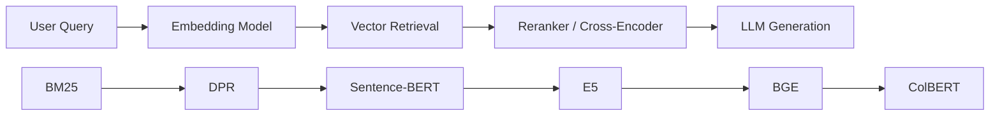
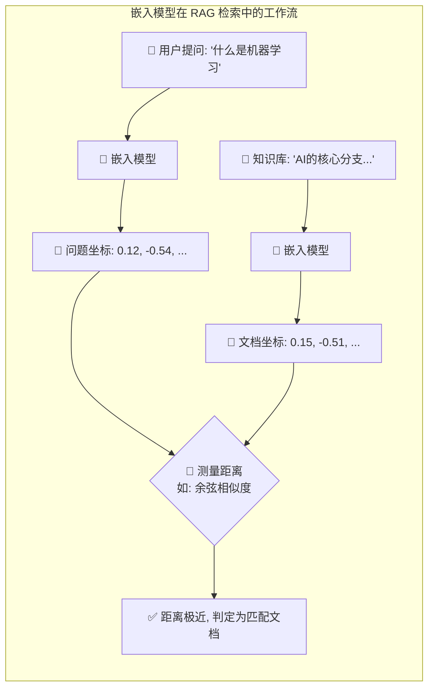
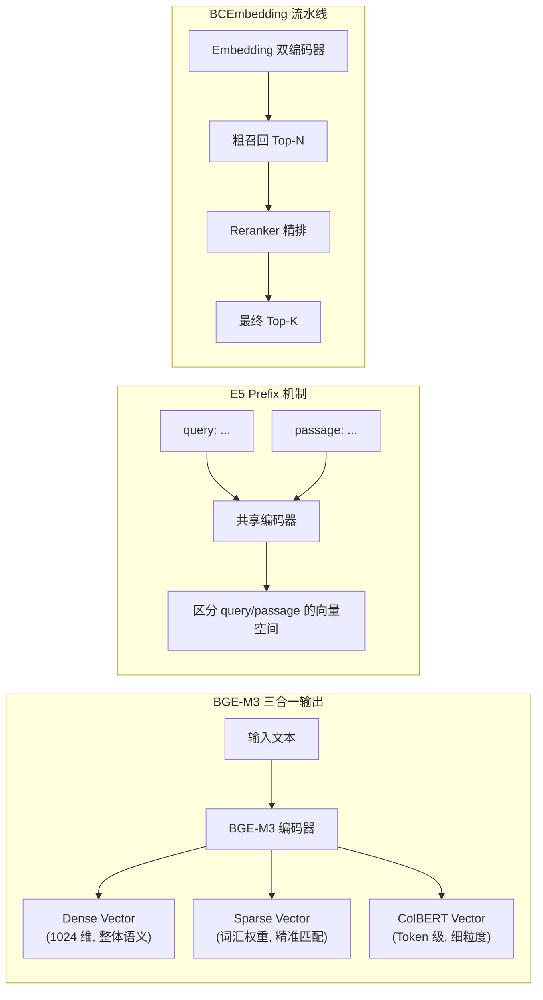

# Text Embedding Models (BGE / E5 / BCEmbedding)

## 知识地图



## 前置知识

- **Embedding 基础**：理解嵌入层和向量表示的基本概念（见 embedding-layer.md）
- **BERT 架构**：了解双向编码器和 [CLS] token 的作用
- **对比学习 (Contrastive Learning)**：理解正样本对/负样本对的概念
- **RAG 基础**：了解检索增强生成的 Pipeline（见 rag.md）

## 为什么会出现 (Why)

在 RAG 系统中，Embedding 模型的使命是将"用户的问题"和"知识库的文档"映射到同一个向量空间。早期的通用 Embedding 模型（如 Sentence-BERT）虽然在通用语义任务上表现不错，但在检索场景中存在明显短板：

1. 用户提问通常很短（5-15 词），而文档段落很长（数百词）——模型需要处理不对称输入。
2. 通用模型不理解"检索"这个任务——它只知道语义相似，不知道什么信息对回答一个问题有用。
3. 多语言、跨语言检索需求让单一语言模型力不从心。

BGE、E5、BCEmbedding 正是为检索场景专门设计和训练的 Embedding 模型。

## 解决什么问题 (Problem)

为 RAG 系统的检索环节提供高质量、面向检索任务优化的文本向量表示。具体包括：不对称输入处理（短 query vs 长 passage）、多语言/跨语言检索、词汇级精准匹配、以及检索+重排序的联合优化。

## 核心思想 (Core Idea)

在 RAG（检索增强生成）系统中，**嵌入模型 (Embedding Model) 是连接人类语言和 AI 数据库的"翻译官"**。

**比喻：**
如果把大语言模型（如 GPT-4）比作"大脑"，那么嵌入模型就是"图书管理员"。当你问"什么是机器学习？"时，管理员不会逐字去书架上找，而是把你的问题翻译成一串**数字坐标（向量）**。意思越相近的句子，在空间里的坐标距离就越近。管理员只需测量坐标距离，就能瞬间把最相关的资料抽出来交回给大脑。



---

## 数学模型/公式

### 对比学习目标（BGE / E5 训练的数学核心）

上述所有模型的核心训练目标都是对比学习损失 (InfoNCE)：

$$
\mathcal{L} = -\log \frac{\exp(\text{sim}(q, d^+) / \tau)}{\exp(\text{sim}(q, d^+) / \tau) + \sum_{d^-} \exp(\text{sim}(q, d^-) / \tau)}
$$

其中 $q$ 为 query，$d^+$ 为正样本文档，$d^-$ 为负样本文档，$\tau$ 为温度参数。

**通俗解释：** 模型的目标很简单——让问题和正确答案的相似度尽可能高，同时让问题和所有错误答案的相似度尽可能低。温度参数 $\tau$ 控制"区分度"：$\tau$ 越小，模型对难区分的样本越严格。

### E5 的 Prefix 机制

E5 要求输入带前缀，本质上改变了 Embedding 函数的形式：

$$\text{emb} = f(\text{"query: "} \oplus \text{input}) \quad \text{vs} \quad \text{emb} = f(\text{"passage: "} \oplus \text{input})$$

**通俗解释：** E5 发现了一个简单但极其有效的 trick：在用户问题前面加 `query:`，在文档前面加 `passage:`。这么做的原因是——同一个句子 "什么是机器学习" ，作为 query 时和作为 passage 时，最相关的文档可能完全不同。加前缀让模型明确知道自己正在处理哪种类型的文本，相当于给模型戴上不同的"眼镜"。

---

## 1. BGE 系列 (BAAI General Embedding)

由智源研究院 (BAAI) 推出，是目前开源界长期霸榜的中文/多语言嵌入模型。

### 训练策略

它之所以强，是因为采用了两阶段训练法：

1. **预训练 (RetroMAE)**：一种极其严苛的自编码"完形填空"，逼迫模型深刻理解词义。
2. **微调 (Fine-tuning)**：加入对比学习（告诉模型什么是相似，什么是不相似）和指令微调。

### 🌟 杀手锏：BGE-M3 的"三头六臂"

M3 代表 **M**ulti-Lingual（支持 100+ 语言）、**M**ulti-Functionality（多功能）、**M**ulti-Granularity（多粒度）。

**大白话**：以前的模型只能给出一组整体的向量（稠密向量），如果用户搜的是某个极其生僻的专有名词，模型可能会"顾大局而失细节"。BGE-M3 能同时做到：

* **Dense (稠密检索)**：理解整句话的宏观语义。
* **Sparse (稀疏检索/词汇级)**：精确计算并提取句子里的关键词权重（类似传统的 BM25）。
* **ColBERT (细粒度)**：Token 级别的极限匹配。

---

## 2. E5 系列 (EmbEddings from bidirEctional Encoder rEpresentations)

由微软 (Microsoft) 推出，在纯英文和多语言榜单上表现极其强悍。

### 核心创新：统一前缀 (Prefix) 魔法

**大白话**：E5 发现，用户的"简短提问"和知识库里的"长篇大论"长得完全不一样。为了让模型不犯迷糊，E5 强制要求在输入前贴上标签。

* 提问时必须加前缀：`query: 什么是机器学习？`
* 存知识库必须加前缀：`passage: 机器学习是人工智能的一个分支...`
就这么一个简单的前缀区分，让检索准确率大幅提升。

---

## 3. BCEmbedding (Bilingual and Crosslingual Embedding)

由**网易有道**推出，这是一个专为**企业级双语 RAG** 打造的实战派模型。

### 核心特点

1. **中英跨语种极强**：用中文搜英文文档，或者用英文搜中文文档，效果出类拔萃。
2. **RAG 联合优化**：它不仅提供了基础的 Embedding（双编码器），还提供了一套绝配的 **Reranker（交叉编码器/重排序模型）**。两者搭配使用，能在业务落地时大幅过滤掉"似是而非"的错误召回。

---

## 模型选型与对比指南

在实际的 RAG 工程落地中，没有绝对的最强，只有最合适的选择：

| 业务场景 | 推荐模型方案 | 核心理由 |
| --- | --- | --- |
| **纯中文 / 强依赖中文** | **BGE-M3** 或 **BCEmbedding** | 对中文语料训练极其充分，理解本土黑话和缩写。 |
| **中英混合 / 跨语言检索** | **BCEmbedding** | 网易有道翻译的底子，中英跨语种对齐效果极佳。 |
| **纯英文业务** | **E5 系列** (e5-large-v2) | 微软出品，在英文维基和各种英文测试集上表现霸榜。 |
| **极其看重专业名词匹配** | **BGE-M3** | 它是唯一支持 Sparse (Lexical) 词汇级精准权重的模型，能有效防止专有名词被忽略。 |
| **显存极小 / 边缘部署** | **BGE-Small-ZH** 或 **e5-small-v2** | 参数量极小（仅 30M 级别），CPU 也能轻松跑出极高并发。 |

---

## 最终裁判：MTEB 基准测试

**MTEB (Massive Text Embedding Benchmark)** 是目前最具公信力的文本向量评估榜单。它就像是嵌入模型界的"高考"，包含 7 大科目：

1. **Classification (分类)**
2. **Clustering (聚类)**
3. **Pair Classification (配对)**
4. **Reranking (重排序)**
5. **Retrieval (检索 - RAG最看重的指标)**
6. **STS (语义文本相似度)**
7. **Summarization (摘要评价)**

*选型建议：看榜单时，不要只看总分（Average），如果您的业务是做 RAG，请直接重点看 **Retrieval** 这一列的单科成绩。*

---

## 可视化展示



---

## 最小可运行代码

### BGE-M3 核心代码实现 (同时输出 Dense 与 Sparse)

```python
from FlagEmbedding import BGEM3FlagModel

# 加载 M3 模型
model = BGEM3FlagModel('BAAI/bge-m3')

# 1. 获取 Dense Embedding (捕捉整体语义，维度: 1024)
dense = model.encode("什么是机器学习？")['dense_vecs']

# 2. 获取 Sparse Embedding (精准词汇权重)
sparse = model.encode("什么是机器学习？")['lexical_weights']
# 输出示例: [{'机': 0.32, '器': 0.28, '学': 0.25, '习': 0.24, ...}]
```

### E5 使用示例 (Sentence-Transformers)

```python
from sentence_transformers import SentenceTransformer

model = SentenceTransformer('intfloat/e5-large-v2')

# 查询时必须加 "query: " 前缀
query = "query: 什么是机器学习？"
# 文档必须加 "passage: " 前缀
passages = [
    "passage: 机器学习是人工智能的一个分支...",
    "passage: 昨天天气很好。"
]

q_emb = model.encode(query)
p_embs = model.encode(passages)

# 计算相似度
scores = q_emb @ p_embs.T
```

### LangChain 中使用 BGE

```python
from langchain.embeddings import HuggingFaceBgeEmbeddings

model_name = "BAAI/bge-small-zh-v1.5"
embeddings = HuggingFaceBgeEmbeddings(
    model_name=model_name,
    model_kwargs={'device': 'cpu'},
    encode_kwargs={'normalize_embeddings': True}
)

vec = embeddings.embed_query("什么是机器学习?")
```

### LlamaIndex 中使用 E5

```python
from llama_index.embeddings.huggingface import HuggingFaceEmbedding

embed_model = HuggingFaceEmbedding(
    model_name="intfloat/e5-small-v2",
    query_instruction="query: ",
    text_instruction="passage: "
)
```

---

## 工业界应用

| 应用场景 | 推荐模型 | 原因 |
|----------|---------|------|
| 中文企业知识库 RAG | BGE-M3 / BCEmbedding | 中文理解深，支持稀疏检索 |
| 英文文档搜索引擎 | E5-large-v2 | 英文检索榜顶尖 |
| 跨语言电商搜索 | BCEmbedding | 中英跨语种对齐最佳 |
| 法律/金融文档检索 | BGE-M3 | 专有名词稀疏匹配不遗漏 |
| 边缘设备本地搜索 | BGE-Small-ZH / e5-small | 模型小，CPU 可跑 |
| 多语言客服系统 | BGE-M3 | 100+ 语言支持 |

---

## 对比表格

| 维度 | BGE-M3 | E5 | BCEmbedding |
|------|--------|----|-------------|
| 开发者 | 智源 BAAI | 微软 | 网易有道 |
| 语言支持 | 100+ 语言 | 多语言（英文最强） | 中英双语 |
| 向量类型 | Dense + Sparse + ColBERT | Dense only | Dense only |
| 输入格式 | 无特殊要求 | 必须加 query:/passage: | 无特殊要求 |
| Reranker | 无 | 无 | 有配套 Reranker |
| 中文效果 | 极强 | 一般 | 极强 |
| 模型大小 | 560M (M3) | 110M-330M | 110M-280M |

---

## 学完后建议继续学习

1. **BM25 与 DPR** — 理解稀疏检索与稠密检索的对比
2. **Sentence-BERT / ColBERT** — 深入句子级和 Token 级检索模型
3. **FAISS 向量索引** — 学习如何高效存储和搜索 Embedding 向量
4. **RAG 进阶** — 将 Embedding 模型应用到完整 RAG Pipeline
5. **Dense Retrieval Advanced** — Contriever、ANCE 等前沿检索技术

---

## 高频面试题

**Q1: BGE-M3 的 "M3" 指什么？为什么它是 RAG 中的"杀手级"模型？**

A: M3 代表 Multi-Lingual（100+ 语言）、Multi-Functionality（多功能）、Multi-Granularity（多粒度）。它是目前少有的同时输出 Dense（整体语义）、Sparse（词汇权重）和 ColBERT（Token 级）三种向量的模型。在 RAG 中，Dense 负责语义召回，Sparse 负责专有名词精准匹配，两者互补形成混合检索，不必部署两个模型。这是它区别于其他 Embedding 模型的核心优势。

**Q2: E5 的 Prefix 机制为什么有效？原理是什么？**

A: E5 在输入前加 `query:` 或 `passage:` 前缀，本质上是改变了 Embedding 函数的输入分布。用户查询通常很短（5-15 词），而文档段落很长（数百词），如果不加前缀，模型难以区分"我现在编码的是什么类型"。加前缀后，模型在训练时就学会了：`query:` 开头的输入应该映射到"搜索意图"空间，`passage:` 开头的输入应该映射到"文档内容"空间。这是不对称检索的一种简洁实现。

**Q3: MTEB 榜单中应该重点看哪些指标？**

A: MTEB 包含 7 类任务：Classification、Clustering、Pair Classification、Reranking、Retrieval、STS、Summarization。对于 RAG 系统，**Retrieval** 是最关键的单科指标。不要只看 Average 总分——很多模型在 STS（语义相似度）上得分高，但 Retrieval 表现一般。如果业务是 RAG，专看 Retrieval 列；如果做语义搜索/去重，重点看 STS 和 Pair Classification。

**Q4: BCEmbedding 相比 BGE 和 E5 的独特优势是什么？**

A: BCEmbedding 的独特优势有两个：1) **中英跨语言检索能力极强**（得益于网易有道的翻译技术积累），用中文 query 搜英文文档或反之，效果都很好；2) 提供 **Embedding + Reranker 联合优化方案**——不是孤立的 Embedding 模型，而是包含配套的 Cross-Encoder Reranker，两者协同工作能显著减少"似是而非"的错误召回。

**Q5: 在实际 RAG 项目中如何选择合适的 Embedding 模型？**

A: 选择矩阵：纯中文 → BGE-M3 或 BCEmbedding；纯英文 → E5-large-v2；中英混合/跨语言 → BCEmbedding；需要专有名词精准匹配 → BGE-M3（唯一支持 Sparse 词汇级输出）；边缘设备/低延迟 → BGE-Small-ZH 或 e5-small-v2（30M 参数量级）。选型后必须在自己业务数据上做检索 Recall@K 评测，因为公开榜单不代表你的场景表现。
