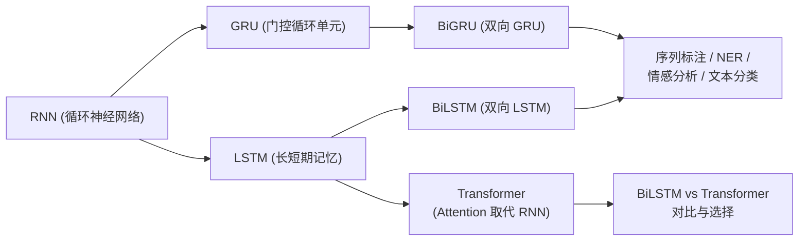
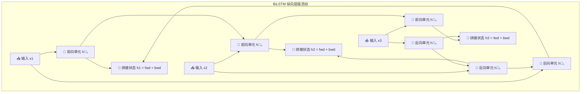

# BiLSTM / BiGRU (双向循环神经网络)

## 知识地图



## 前置知识

- **RNN 基础**：理解循环神经网络的时序递推特性（隐状态 $h_t = f(x_t, h_{t-1})$）
- **LSTM 门控机制**：理解遗忘门、输入门、输出门如何控制信息流动
- **GRU 的简化**：理解更新门和重置门如何替代 LSTM 的三个门
- **词嵌入 (Word Embedding)**：输入文本转化为稠密向量的基本方法

## 为什么会出现 (Why)

传统的单向 RNN/LSTM/GRU 是"单向单行道"——只能从左到右顺序处理。但在 NLP 任务中，"下文"往往和"上文"同样重要。

给你一个句子让你填空："我今天晚上准备去______吃一顿烤肉。"

如果只看左边："我今天晚上准备去" → 可能是"餐厅"、"商场"、"朋友家"。
但如果往右边看一眼下文："因为那家店正好打折" → 你就能瞬间锁定这里应该填"餐厅"或"特定店铺"。

单向 LSTM 没有"预知未来"的能力——它在每个时间步只能基于过去的信息做判断。对于序列标注（NER、分词、词性标注）和文本分类等任务，这限制了模型对上下文的理解。

**BiLSTM/BiGRU 的出现**就是为了让模型在每个时间步**同时拥有"上文"和"下文"的信息**。

## 解决什么问题 (Problem)

BiLSTM/BiGRU 解决的核心问题：**如何让序列中的每个位置同时融合过去（上文）和未来（下文）的上下文信息，而不是只能"回头看"。**

## 核心思想 (Core Idea)

**用两条独立的 RNN 分别从左到右和从右到左处理序列，然后在每个位置将两个方向的隐状态拼接——让模型在每个时间步"左顾右盼"，同时拥有过去和未来的上下文。**

---

## 数学公式

### 1. 双向拼接结构

对于一个长度为 $T$ 的输入序列 $\mathbf{x}_{1:T}$，我们在每个时间步 $t$ 同时运行两个独立的隐藏层：

**前向计算层 (Forward)**：顺向传递，依赖前一步的隐状态：

$$\overrightarrow{\mathbf{h}}_t = \text{LSTM}(\mathbf{x}_t, \overrightarrow{\mathbf{h}}_{t-1})$$

**通俗解释：** 前向工兵从左到右正常阅读，收集上文信息。读到 "我/今天/准备/去" 时，它脑子里装的是"某人今天要去某个地方"。

**后向计算层 (Backward)**：逆向传递，依赖后一步的隐状态：

$$\overleftarrow{\mathbf{h}}_t = \text{LSTM}(\mathbf{x}_t, \overleftarrow{\mathbf{h}}_{t+1})$$

**通俗解释：** 后向工兵从右到左倒着阅读，收集下文信息。读到 "打折" 时，它脑子里装的是"某个地方在打折——可能是商店/餐厅"。

**最终拼接输出**：将两个向量水平拼接（符号为 $[ ; ]$），维度直接翻倍：

$$\mathbf{h}_t = [\overrightarrow{\mathbf{h}}_t ; \overleftarrow{\mathbf{h}}_t] \in \mathbb{R}^{2d_h}$$

**通俗解释：** 两个工兵在同一个时间步碰头，把各自的笔记拼在一起——"前向工兵说这里大概是个地点，后向工兵补充说后面提到了打折——综合来看，这里应该是一个可以消费的商业场所"。

### 2. BiGRU 的精简

BiGRU 的逻辑与 BiLSTM 完全一致，只是其内部的单个循环单元替换为了 GRU。由于 GRU 砍掉了门控结构中的"输出门（Output Gate）"，只有"更新门（Update Gate）"和"重置门（Reset Gate）"，使得单个神经元的计算量大大减少，但依然能维持类似的双向语境捕捉能力。

**通俗解释：** BiLSTM 是"豪华版"——三个门（遗忘、输入、输出），功能全但计算贵。BiGRU 是"精简版"——两个门（更新、重置），把三个门的功能合并了，效果接近但计算更省。在参数预算有限时，BiGRU 是极佳的选择。

---

## 主流网络结构对比

### BiLSTM 与 Transformer 的横向较量

| 特征维度 | BiLSTM / BiGRU | Transformer |
| --- | --- | --- |
| **上下文捕获方式** | 前向和后向两个方向独立串行，最后强行拼接 | **天然全向**。注意力机制让每个词在第一步就直接看到其他所有词 |
| **时间复杂度** | $O(n)$ — 随句子长度线性增长，适合超长长文本 | $O(n^2)$ — 序列越长计算量呈平方级暴涨（自注意力导致的） |
| **并行计算能力** | 差。每一步都必须等待上一个（或下一个）时间步算完才能继续 | 极佳。所有 token 之间的关系可以同时并行计算 |
| **长距离依赖路径** | 较长。虽然有遗忘门缓解，但相隔很远的特征信息依然容易在长传导路径中被稀释 | **$O(1)$ 的直接路径**。任何两个词之间的联系都是一步直达 |

---

## 可视化展示

### 双向层级纵向流动图

为了清晰地展示每个时间步的信息交换逻辑且避免横向排版过于挤压，我们采用纵向阶梯视角呈现：



### 模型参数量与显存开销横向对比 (以 Hidden_Dim=256 为标准)

*在硬件资源有限的情况下，单双向与门控机制的选择直接影响显存开销。*

| 模型结构类型 | 隐藏层维度 | 参数量级别 (M) | 显存与速度特征说明 |
| --- | --- | --- | --- |
| **单向 LSTM** | 256 | ~3.1 M | 基线开销。计算速度一般，只具备"回看"能力。 |
| **双向 BiLSTM** | 256 | **~6.2 M** | **参数与显存直接翻倍**。计算开销最大，但特征最饱满。 |
| **单向 GRU** | 256 | ~2.3 M | 比单向 LSTM 省下约 30% 参数，结构更精简，收敛更快。 |
| **双向 BiGRU** | 256 | **~4.6 M** | **极佳的折中方案**。参数小于 BiLSTM，却能达到极其接近的双向效果。 |

### 双向 vs 单向的对比

```echarts
return {
  tooltip: { trigger: "axis", confine: true },
  title: { top: 5,  text: '不同 RNN 变体序列标注 F1 对比 (NER 任务)', left: 'center' },
  xAxis: { type: 'category', data: ['单向 LSTM', '单向 GRU', 'BiLSTM', 'BiGRU'] },
  yAxis: { type: 'value', min: 75, max: 95, name: 'F1 Score' },
  series: [{
    type: 'bar',
    data: [82.5, 82.1, 93.2, 92.8],
    itemStyle: { color: '#2980b9' },
    label: { show: true, position: 'top' }
  }],
  grid: { left: 60, right: 20, top: 55, bottom: 55 }
}
```

双向模型在序列标注任务上有显著性能提升，BiLSTM 和 BiGRU 效果接近，远优于单向版本。

---

## 最小可运行代码

### 1. PyTorch 工业级 BiLSTM 文本分类器

在实际工程中，句子的长度通常不一，代码中我们演示了如何使用 `pack_padded_sequence`（动态填充剔除机制）来避免模型在 Padding 占位符上浪费算力：

```python
import torch
import torch.nn as nn

class BiLSTMClassifier(nn.Module):
    def __init__(self, vocab_size, embed_dim, hidden_dim, num_classes, num_layers=2):
        super().__init__()
        self.embedding = nn.Embedding(vocab_size, embed_dim, padding_idx=0)
        
        # 核心：设置 bidirectional=True 开启双向模式
        self.lstm = nn.LSTM(embed_dim, hidden_dim,
                            num_layers=num_layers,
                            bidirectional=True,
                            batch_first=True,
                            dropout=0.3 if num_layers > 1 else 0)
        
        # 注意：由于双向拼接，线性分类器的输入维度必须乘以 2 (hidden_dim * 2)
        self.classifier = nn.Linear(hidden_dim * 2, num_classes)

    def forward(self, x, lengths=None):
        # x 维度: [Batch_size, Seq_Len]
        emb = self.embedding(x)  # [Batch_size, Seq_Len, Embed_dim]
        
        if lengths is not None:
            # 动态打包：压紧序列，告诉 LSTM 哪些是真实单词，哪些是 Padding
            packed = nn.utils.rnn.pack_padded_sequence(
                emb, lengths.cpu(), batch_first=True, enforce_sorted=False)
            packed_out, (hn, cn) = self.lstm(packed)
            # 解包：恢复为标准 Tensor 形状
            out, _ = nn.utils.rnn.pad_packed_sequence(packed_out, batch_first=True)
        else:
            out, _ = self.lstm(emb)  # out 维度: [Batch_size, Seq_Len, 2 * Hidden_dim]
            
        return self.classifier(out)  # 输出序列上每个位置的预测结果

    def get_last_output(self, x):
        """如果做整句分类任务（而非序列标注），需要提取全句最后的浓缩隐状态"""
        emb = self.embedding(x)
        out, (hn, cn) = self.lstm(emb)
        
        # hn 的形状为 [2 * num_layers, Batch_size, Hidden_dim]
        # hn[-2] 是最顶层的前向最后一步；hn[-1] 是最顶层的后向最后一步
        fwd_last = hn[-2, :, :]  
        bwd_last = hn[-1, :, :]  
        
        # 将前向和后向的终点状态拼接起来，作为整句话的特征向量
        return torch.cat([fwd_last, bwd_last], dim=-1)  # [Batch_size, 2 * Hidden_dim]

```

### 2. PyTorch 工业级 BiGRU 分类器简易框架

```python
class BiGRUClassifier(nn.Module):
    def __init__(self, vocab_size, embed_dim, hidden_dim, num_classes, num_layers=2):
        super().__init__()
        self.embedding = nn.Embedding(vocab_size, embed_dim, padding_idx=0)
        
        # 核心：开启双向 GRU 机制
        self.gru = nn.GRU(embed_dim, hidden_dim,
                          num_layers=num_layers,
                          bidirectional=True,
                          batch_first=True,
                          dropout=0.3 if num_layers > 1 else 0)
        
        self.classifier = nn.Linear(hidden_dim * 2, num_classes)

    def forward(self, x):
        emb = self.embedding(x)
        # GRU 内部不需要维持 cell 状态 (cn)，只返回输出和隐状态 (hn)
        out, hn = self.gru(emb)
        return self.classifier(out)

```

---

## 工业界应用

| 应用场景 | 模型/系统 | 说明 |
|----------|----------|------|
| 命名实体识别 (NER) | BiLSTM-CRF | 经典序列标注架构，至今仍在医疗/法律等领域广泛使用 |
| 词性标注 (POS) | BiLSTM + CRF | 双向上下文 + 标签转移约束 |
| 文本分类 | BiLSTM + Attention | 在短文本分类上仍具竞争力 |
| 机器翻译 (旧) | Seq2Seq + BiLSTM Encoder | Transformer 之前的 SOTA |
| 语音识别 | BiLSTM + CTC | 双向语音特征建模 |
| 生物信息学 | BiLSTM (DNA 序列) | DNA/蛋白质序列分析 |

## 对比表格

### BiLSTM vs BiGRU vs Transformer

| 特性 | BiLSTM | BiGRU | Transformer |
|------|--------|-------|-------------|
| 参数量 (hidden_dim=256) | ~6.2M | ~4.6M | 视配置而定 |
| 训练速度 | 慢（串行） | 中等（串行但更轻） | 快（并行） |
| 推理速度 | 慢 | 中等 | 快 |
| 短序列效果 | 好 | 接近 BiLSTM | 非常好 |
| 长序列效果 | 受长距离依赖限制 | 受长距离依赖限制 | 好（但 $O(n^2)$） |
| 并行训练 | 否 | 否 | 是 |
| 适用场景 | 需双向上下文的小规模任务 | 参数敏感的双向任务 | 大规模预训练 |

### LSTM vs GRU 内部机制对比

| 特性 | LSTM | GRU |
|------|------|-----|
| 门数量 | 3 (遗忘、输入、输出) | 2 (更新、重置) |
| 细胞状态 | 有（$c_t$ 和 $h_t$ 分离） | 无（$c_t$ 和 $h_t$ 合并） |
| 参数量 | 多 ~30% | 较少 |
| 训练速度 | 较慢 | 较快 |
| 效果 | 略优（大数据） | 接近（小数据可能更好） |

---

## 学完后建议继续学习

1. **BiLSTM-CRF** — 经典序列标注架构，理解 CRF 如何在 BiLSTM 之上添加标签转移约束
2. **Transformer / Self-Attention** — 理解为什么 Transformer 成为了 BiLSTM 的继任者
3. **ELMo** — 理解 BiLSTM 如何用于预训练语言模型（Transformer 之前的最佳选择）
4. **单向 vs 双向的适用场景** — 理解何时必须用单向（如自回归生成）
5. **Stacked BiLSTM** — 理解多层 BiLSTM 如何逐层提取更高级的特征

## 高频面试题

### Q1: BiLSTM 和普通 LSTM 的本质区别是什么？为什么双向能提升效果？

**标准答案：**
本质区别在于 **信息流向**：
- **LSTM**：单向，只能从左到右。时刻 $t$ 的输出 $\mathbf{h}_t$ 仅依赖 $x_1, x_2, \dots, x_t$（过去的信息）。
- **BiLSTM**：双向，由两条独立的 LSTM 组成——前向（左→右）捕获上文，后向（右→左）捕获下文。每个时刻的输出 $\mathbf{h}_t = [\overrightarrow{\mathbf{h}}_t ; \overleftarrow{\mathbf{h}}_t]$ 同时包含过去和未来的信息。

双向能提升效果的原因是：语言中"下文"对理解"当前"至关重要。例如在 NER 中，"苹果"之后跟着"发布了新手机"告诉我们它是公司名；跟在"我吃了一个"后面则是水果。双向让模型在每个位置都能利用完整的上下文做判断。

### Q2: BiGRU 和 BiLSTM 有什么关系？什么时候选 GRU 而不是 LSTM？

**标准答案：**
BiGRU 和 BiLSTM 的关系：双向逻辑完全相同（前向 + 后向拼接），区别仅在于内部循环单元：
- BiLSTM：3 门（遗忘门、输入门、输出门）+ 细胞状态 $c_t$
- BiGRU：2 门（更新门、重置门），$c_t$ 与 $h_t$ 合并

选择 GRU 的场景：
1. **参数/显存预算有限**：GRU 参数少约 30%，计算更快
2. **数据量较小**：GRU 结构更简单，不容易过拟合
3. **对实时性有要求**：GRU 计算量更小，推理延迟更低

选择 LSTM 的场景：
1. **数据量充足**：LSTM 更大的参数量可以学到更复杂的模式
2. **需要精细控制记忆**：细胞状态 $c_t$ 提供更独立的长距离记忆通道

经验上，两者效果差距不大（通常 <2%），BiGRU 是更高效的默认选择。

### Q3: BiLSTM 的最终输出维度是多少？分类器输入维度需要如何调整？

**标准答案：**
BiLSTM 在每个时间步的输出是前向和后向隐状态的拼接：$\mathbf{h}_t \in \mathbb{R}^{2d_h}$（$d_h$ 是 hidden_dim）。

因此分类器的输入维度必须是 `hidden_dim * 2`：

```python
self.lstm = nn.LSTM(embed_dim, hidden_dim, bidirectional=True)
self.classifier = nn.Linear(hidden_dim * 2, num_classes)  # 注意 *2
```

如果做的是整句分类（而非序列标注），通常用双向终点的拼接作为整句表示：`[fwd_last; bwd_last]`，维度同样是 `2 * hidden_dim`。

### Q4: BiLSTM 有什么局限性？为什么 Transformer 后来取代了它？

**标准答案：**
BiLSTM 的主要局限性：
1. **串行计算**：前向和后向分别串行，无法并行训练——序列越长，训练越慢
2. **长距离依赖衰减**：虽然 LSTM 的遗忘门缓解了梯度消失，但相距很远的 token 之间的信息传递仍需经过几十上百个时间步，特征被不断稀释
3. **双向不适用于生成**：生成任务需要自回归（只能看过去），BiLSTM 的双向优势无法发挥

Transformer 取代 BiLSTM 的原因：
1. **$O(1)$ 依赖路径**：任意两个 token 直接交互，不经过中间步骤
2. **完全并行**：所有位置同时计算
3. **大规模预训练友好**：并行性使其可以高效地在大规模语料上训练

不过在资源受限、短序列、需要双向上下文的小规模任务上，BiLSTM/BiGRU 仍然是简洁有效的选择。
