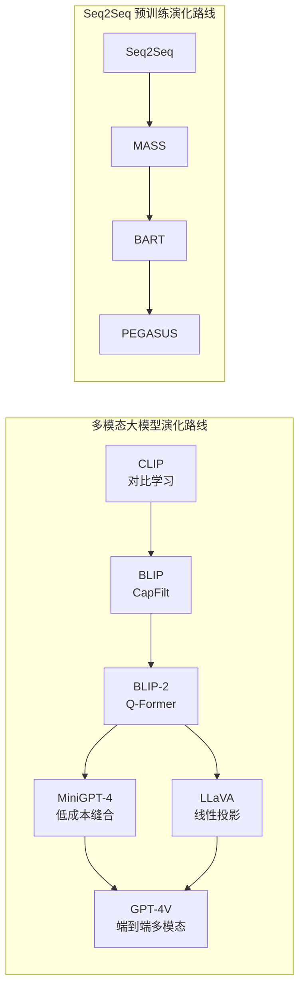
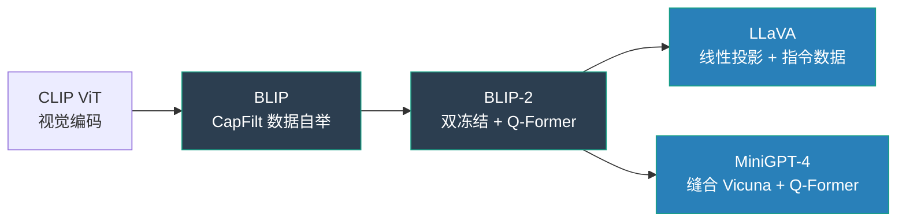
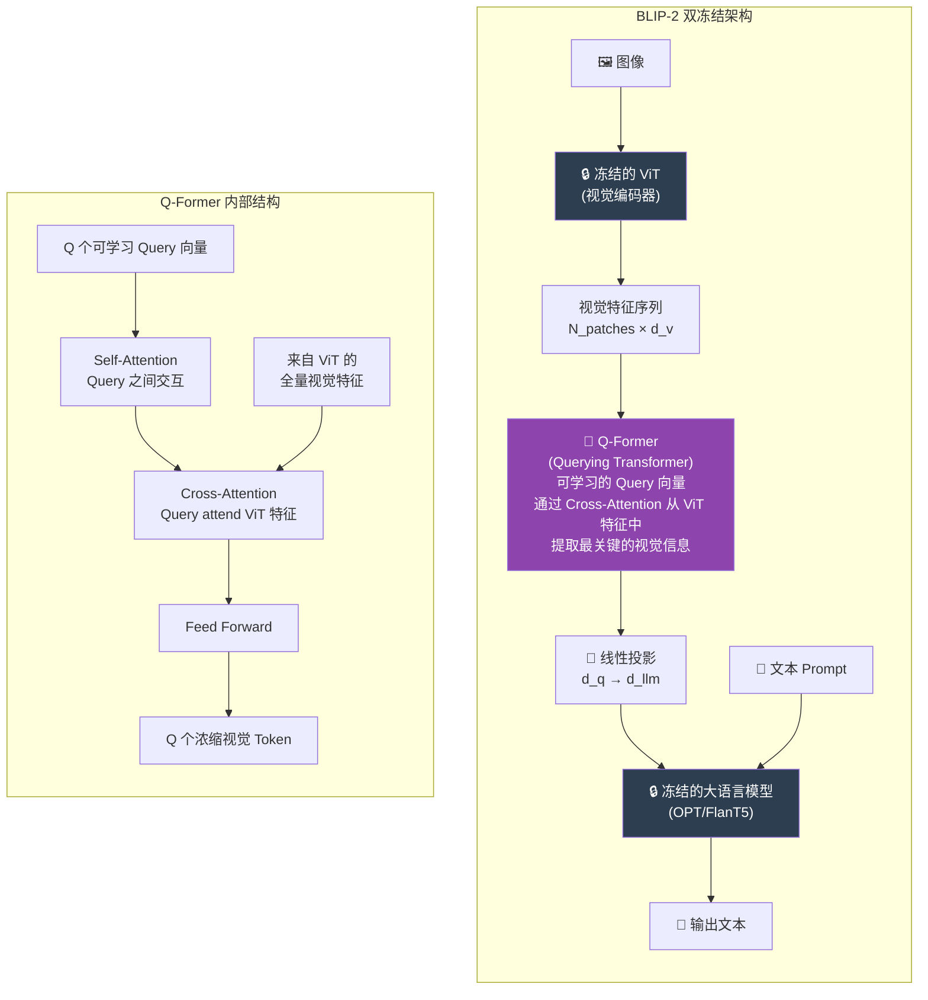
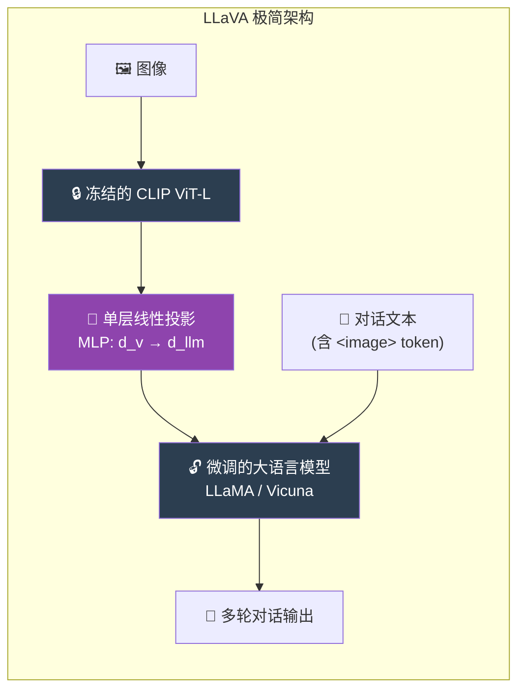
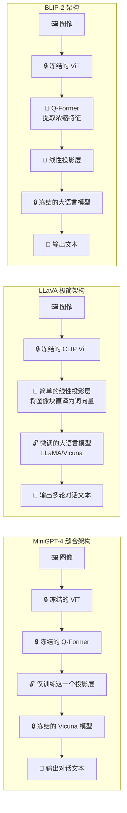

# Vision-Language Models (BLIP / LLaVA / MiniGPT-4) 视觉编码器

## 知识地图



## 前置知识

- **CLIP / 对比学习**: 理解图文在共享嵌入空间中的对齐原理
- **Vision Transformer (ViT)**: 图像如何被切分为 Patches 并编码为特征序列
- **大型语言模型 (LLM)**: LLaMA、Vicuna、OPT 等模型的自回归生成机制
- **Transformer 的 Cross-Attention**: Encoder-Decoder 架构中 Decoder 如何从 Encoder 输出中提取信息
- **指令微调 (Instruction Tuning)**: 如何用自然语言指令让模型适应对话和推理任务
- **LoRA / 参数高效微调**: 理解在冻结基座时如何低成本适配下游任务

## 模型演化路线



| 阶段 | 模型 | 核心创新 | 视觉-语言桥接方式 |
|------|------|----------|-------------------|
| 图文对齐 | CLIP | 对比学习 | 双塔独立编码 |
| 数据自举 | BLIP | CapFilt | 多任务架构 (ITC+ITM+LM) |
| 高效桥接 | BLIP-2 | 双冻结 + Q-Former | Q-Former (Cross-Attention) |
| 极简对话 | LLaVA | GPT-4 造数据 | 线性投影层 |
| 低成本缝合 | MiniGPT-4 | 强 LLM + 少数据 | Q-Former + 单层投影 |

## 为什么会出现 (Why)

大语言模型（LLM）虽然极其聪明，但它就像一个被关在小黑屋里的**"盲人天才"**，只能通过文字和外界交流；而视觉编码器（如 ViT）就像一个拿着摄像机的**"哑巴观察员"**，能看到画面却不会说话。要让 AI 真正理解世界，必须打通视觉和语言。然而直接拼接 ViT 和 LLM 进行全参数微调成本极高——两个百亿级模型加起来远超 GPU 显存。因此需要一个**高效的桥接机制**，让视觉信息和语言模型低成本地协同工作。

## 解决什么问题 (Problem)

1. **视觉-语言桥接**: 如何高效地将二维图像信息转化为 LLM 能理解的"语言"（Token 序列）
2. **数据质量瓶颈**: 网上的图文对（Alt-text）充满噪声，如何获得高质量的训练数据
3. **训练成本爆炸**: 如何在不重新训练 ViT 和 LLM 的前提下实现多模态能力
4. **复杂推理能力**: 如何让模型不仅能描述图像，还能进行因果推理和多轮对话

## 核心思想 (Core Idea)

BLIP/LLaVA 系列通过在冻结的视觉编码器和冻结/微调的大语言模型之间插入一个轻量级的**桥接模块**（Q-Former 或线性投影），以极低的训练成本让 LLM 获得视觉理解能力。

## 模型结构图

### BLIP-2: Q-Former 桥接机制



### LLaVA: 极简线性投影



## 数学模型/公式

### BLIP-2: Q-Former 查询机制

$$\mathbf{H}_{vision} = \text{ViT}(I) \in \mathbb{R}^{N_v \times d_v}$$

$$\mathbf{H}_{query} = \text{Q-Former}(\mathbf{Q}_{learnable}, \mathbf{H}_{vision}) \in \mathbb{R}^{Q \times d_q}$$

$$\text{Output} = \text{LLM}(\text{Proj}(\mathbf{H}_{query}), \text{TextPrompt})$$

**通俗解释：** ViT 对图像输出 $N_v$ 个特征向量（通常 257 个，包括 CLS token）。Q-Former 有 $Q$ 个可学习的 "Query 向量"（通常 32 个），它们通过 Cross-Attention 从 $N_v$ 个视觉特征中自主提取最关键的信息，把 257 个冗余特征压缩为 32 个浓缩 Token。这 32 个 Token 再被投影到 LLM 的词嵌入空间，作为"视觉单词"和文本一起输入 LLM。

### LLaVA: 线性投影

$$\mathbf{H}_{vision} = \text{CLIP-ViT}(I) \in \mathbb{R}^{N_v \times d_v}$$

$$\mathbf{H}_{proj} = \mathbf{W} \cdot \mathbf{H}_{vision} + \mathbf{b} \in \mathbb{R}^{N_v \times d_{llm}}$$

**通俗解释：** LLaVA 认为不需要 Q-Former 那么复杂的"翻译官"，一个简单的线性变换（矩阵乘法 + 偏置）就够了。它把 ViT 的 257 个特征向量直接乘以一个投影矩阵 $\mathbf{W}$，从 ViT 的维度（如 1024）映射到 LLM 的维度（如 4096），然后直接拼接到文本 Token 序列中。出乎意料的是，这个极简方案配合高质量指令数据，效果甚至不输复杂架构。

### BLIP: CapFilt 自举目标

$$\text{Data}_{new} = \text{Filter}(\text{Captioner}(\text{Images}_{web}), \text{Data}_{web})$$

$$\mathcal{L}_{BLIP} = \mathcal{L}_{ITC} + \mathcal{L}_{ITM} + \mathcal{L}_{LM}$$

**通俗解释：** BLIP 是一个"数据永动机"——它用现有模型给网上海量图片生成新描述（Captioner），再训练一个判断器剔除那些图文不匹配的垃圾数据（Filter），用清洗后的数据训练更强的模型，然后重复这个循环。同时 BLIP 有三个并行训练目标：ITC 判断图文是否匹配（对比学习），ITM 做更精细的二分类匹配判断，LM 看图逐词生成描述。

## 可视化展示

### 架构对比: BLIP-2 vs LLaVA vs MiniGPT-4



## 最小可运行代码

### BLIP-2 风格: Q-Former 前向传播

```python
import torch
import torch.nn as nn

class QFormer(nn.Module):
    """简化版 Q-Former: 用可学习 Query 向量从 ViT 特征中提取信息"""
    def __init__(self, num_queries=32, vit_dim=1024, qformer_dim=768, num_layers=6):
        super().__init__()
        # 可学习的 Query 向量
        self.query_tokens = nn.Parameter(torch.randn(1, num_queries, qformer_dim))

        # Cross-Attention: Query 从 ViT 特征中提取信息
        self.cross_attention = nn.MultiheadAttention(
            embed_dim=qformer_dim, num_heads=8, batch_first=True)
        self.self_attention = nn.MultiheadAttention(
            embed_dim=qformer_dim, num_heads=8, batch_first=True)

        # 将 ViT 特征维度投影到 Q-Former 维度
        self.vit_proj = nn.Linear(vit_dim, qformer_dim)
        self.ffn = nn.Sequential(
            nn.Linear(qformer_dim, qformer_dim * 4),
            nn.GELU(),
            nn.Linear(qformer_dim * 4, qformer_dim))

    def forward(self, vit_features):
        """
        vit_features: [B, N_patches, vit_dim] — ViT 输出的视觉特征
        返回: [B, num_queries, qformer_dim] — 浓缩后的视觉 Token
        """
        B = vit_features.shape[0]
        vit_feat = self.vit_proj(vit_features)  # 维度对齐

        # 扩展 Query 到 Batch 维度
        queries = self.query_tokens.expand(B, -1, -1)  # [B, Q, D]

        # Self-Attention: Query 向量内部交互
        queries = self.self_attention(queries, queries, queries)[0]

        # Cross-Attention: Query 从 ViT 特征中提取关键信息
        queries = self.cross_attention(queries, vit_feat, vit_feat)[0]

        # FFN
        queries = queries + self.ffn(queries)

        return queries  # [B, Q, D]
```

### LLaVA 风格: 极简多模态前向传播

```python
import torch
import torch.nn as nn

class LLaVASimple(nn.Module):
    """LLaVA 极简多模态架构: CLIP ViT + 线性投影 + LLM"""
    def __init__(self, vision_encoder, llm, projector=None):
        super().__init__()
        self.vision_encoder = vision_encoder  # 冻结的 CLIP ViT
        self.llm = llm  # 微调的大语言模型
        # 简单的 MLP 投影层: d_vision → d_llm
        if projector is None:
            self.projector = nn.Sequential(
                nn.Linear(1024, llm.config.hidden_size),
                nn.GELU(),
                nn.Linear(llm.config.hidden_size, llm.config.hidden_size))
        else:
            self.projector = projector

    def forward(self, images, input_ids, attention_mask):
        # 1. 视觉编码 (冻结，不计算梯度)
        with torch.no_grad():
            vision_feat = self.vision_encoder(images)  # [B, N_v, d_v]

        # 2. 线性投影: 将视觉特征映射到 LLM 的词嵌入空间
        vision_emb = self.projector(vision_feat)  # [B, N_v, d_llm]

        # 3. 文本嵌入
        text_emb = self.llm.model.embed_tokens(input_ids)  # [B, N_t, d_llm]

        # 4. 拼接视觉和文本嵌入
        inputs_embeds = torch.cat([vision_emb, text_emb], dim=1)

        # 5. LLM 前向传播
        outputs = self.llm(inputs_embeds=inputs_embeds)
        return outputs.logits
```

## 工业界应用

| 应用场景 | 代表产品/模型 | 架构来源 |
|----------|-------------|----------|
| **多模态对话** | GPT-4V, Gemini, Claude 3 Vision | LLaVA 范式的工业级实现 |
| **看图写代码** | Screenshot-to-Code, v0.dev | MiniGPT-4 / LLaVA 架构 |
| **文档理解** | Donut, Nougat | BLIP-2 风格编码器-解码器 |
| **电商图文理解** | 阿里通义千问-VL | Qwen-VL (Q-Former resampler) |
| **医学影像报告** | Med-Flamingo, CheXagent | BLIP / LLaVA fine-tune |
| **机器人操作** | RT-2 (Google DeepMind) | ViT + LLM 桥接 |

## 对比表格

### BLIP-2 vs LLaVA vs MiniGPT-4

| 维度 | BLIP-2 | LLaVA | MiniGPT-4 |
| --- | --- | --- | --- |
| **视觉-语言 桥接方式** | Q-Former (跨注意力机制) | **单纯的线性投影 (Linear Projection)** | Q-Former + 线性投影 |
| **搭载的 LLM 底座** | 早期模型 (OPT / FlanT5) | 强力开源对话模型 (LLaMA / Vicuna) | 强力开源对话模型 (Vicuna) |
| **模型训练成本** | **极低** (两大核心全部冻结) | **中等** (第二阶段需解冻 LLM 全参微调) | **极低** (仅训练桥接层) |
| **对话与推理能力** | 较弱 (偏向传统的看图写话) | **极强** (由于使用了 GPT-4 的指令数据) | **极强** (底座 Vicuna 的功劳) |
| **视觉 Token 数量** | 32 (Q-Former 压缩) | 257 (全量 ViT 输出) | 32 (Q-Former 压缩) |
| **核心贡献** | 证明了通过 Q-Former 桥接冻结模型的巨大潜力 | 证明了高质量的多轮对话指令数据比复杂的架构更重要 | 证明了强大 LLM 底座极易被激发出视觉能力 |

### 桥接方式对比

| 桥接方式 | 代表模型 | 参数量 | 优势 | 劣势 |
|----------|---------|--------|------|------|
| Q-Former | BLIP-2 | ~100M | 浓缩信息，Token 少 | 架构复杂，收敛慢 |
| 线性投影 | LLaVA | ~4M (单层) | 极简高效，信息无损 | Token 数量多 (257) |
| Resampler | Qwen-VL | ~20M | 动态压缩，自适应 | 训练技巧要求高 |

## 学完后建议继续学习

1. **CogVLM / InternVL** — 了解更先进的多模态大模型架构（视觉专家、动态分辨率）
2. **Qwen-VL** — 理解 Resampler 机制与 Q-Former 的异同
3. **Video-LLaMA / VideoChat** — 将多模态 LLM 扩展到视频理解
4. **GPT-4V 技术报告** — 了解工业级多模态系统的实际表现与局限性
5. **RLHF / DPO** — 理解如何用人类反馈进一步对齐多模态模型的输出

## 高频面试题

### Q1: BLIP-2 的"双冻结"策略是什么？为什么要冻结 ViT 和 LLM？

**标准答案：** BLIP-2 的"双冻结"策略是在训练时完全冻结视觉编码器（ViT）和大语言模型（LLM）的参数，只在两者之间插入一个可训练的 Q-Former 进行桥接。这样做的原因是：(1) ViT 和 LLM 各自已有数十亿参数，全量微调需要数千 GPU 的算力；(2) Q-Former 只有约 1 亿参数，训练成本极低；(3) 冻结的 ViT 已经能提取优秀的视觉特征，冻结的 LLM 已经具备强大的语言能力，Q-Former 只需学习两者的"翻译"即可。

### Q2: Q-Former 的工作原理是什么？

**标准答案：** Q-Former (Querying Transformer) 包含 $Q$ 个可学习的 Query 向量（通常 32 个），以及 Self-Attention 和 Cross-Attention 层。Query 向量首先通过 Self-Attention 相互交换信息，然后通过 Cross-Attention 以 ViT 输出的全量视觉特征作为 Key/Value，有选择性地从中提取最关键的视觉信息。最终输出 $Q$ 个"浓缩视觉 Token"，只保留了 LLM 需要的关键信息（如物体类别、位置关系、场景描述），丢弃了冗余的像素级细节。这 32 个 Token 经过线性投影后与文本 Token 一起送入 LLM。

### Q3: LLaVA 为什么说"数据比架构更重要"？

**标准答案：** LLaVA 使用了极其简单的线性投影层作为视觉-语言桥接（比 Q-Former 简单得多），但效果却非常惊艳。其成功关键在于训练数据：LLaVA 用 GPT-4 作为"数据标注员"，生成了 15.8 万条高质量的多轮视觉对话数据。这些数据包含了因果推理、空间关系描述、行为预测等复杂内容。实验结果证明，高质量指令微调数据带来的提升远超过架构复杂度带来的提升——好数据比好架构更重要。

### Q4: MiniGPT-4 的核心贡献是什么？为什么只需要训练一个投影层？

**标准答案：** MiniGPT-4 的核心贡献在于证明了"强 LLM 底座 + 强视觉编码器 + 极简桥接"即可涌现视觉对话能力。它将 BLIP-2 的 ViT+Q-Former 输出与 Vicuna（LLaMA 微调版）直接拼接，只训练一个单层投影层（约 4M 参数），仅仅用了几千张高质量图文对进行微调，就获得了看图写诗、写网页代码、理解复杂场景等高级能力。这证明了：只要底座的 LLM 足够强大，其内在的知识和推理能力只需一个简单的"视觉通道"即可被激活。

### Q5: BLIP 的 CapFilt 机制是如何解决数据质量问题的？

**标准答案：** CapFilt (Captioning + Filtering) 是一个数据自举循环：(1) Captioner——用现有模型给网上海量图片生成全新的高质量文字描述；(2) Filter——训练一个图文匹配判断器，把网上原本那些"图文不符"的噪声数据剔除；(3) 用清洗和生成后的纯净数据重新训练 Captioner 和 Filter，形成正向循环。这个机制让模型在不需要额外人工标注的情况下，持续提升数据质量和模型性能。
