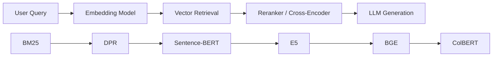
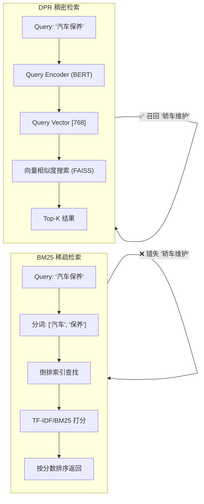

# Information Retrieval (信息检索：BM25 与 DPR)

## 知识地图



## 前置知识

- **TF-IDF 原理**：词频 (Term Frequency) 和逆文档频率 (Inverse Document Frequency)
- **向量空间模型**：将文档和查询表示为向量，通过距离/相似度匹配
- **双塔架构 (Bi-Encoder)**：两个独立编码器分别处理 query 和 document
- **对比学习**：正负样本对训练，InfoNCE 损失函数

## 为什么会出现 (Why)

搜索引擎和信息检索系统面临的核心挑战是：**词汇鸿沟 (Vocabulary Gap)**——用户使用的词和文档中出现的词可能完全不同，但表达的是同一个意思。

早期检索靠布尔匹配和 TF-IDF，只能做字面匹配。"汽车保养"搜不到"轿车维护"。BM25 在 TF-IDF 基础上引入了词频饱和和文档长度归一化，成为统治搜索领域近 30 年的 Baseline。

但随着深度学习的发展，DPR 提出用神经网络将 query 和 document 映射到同一个语义空间，通过对向量距离的计算来"理解"语义而非死磕字面。这是稀疏检索到稠密检索的范式转变。

## 解决什么问题 (Problem)

从海量文档中快速找出与用户问题最相关的 Top-K 篇。核心挑战是平衡**效率**（搜索速度）、**精度**（召回率）和**语义理解**（是否理解同义词和改写）。

## 核心思想

在 RAG（检索增强生成）和传统的搜索引擎中，如何从海量的文档中快速找出和用户问题最相关的几篇？业界有两大流派：

* **BM25 (字面派 / 稀疏检索)**：就像是一个极其严谨的"图书管理员"。你问"汽车保养"，他就会去书架上死磕包含"汽车"和"保养"这两个词的书。速度极快，绝不会给你找毫无关联的书，但如果书上写的是"轿车维护"，他就完全找不到了（词汇鸿沟）。
* **DPR (意会派 / 稠密检索)**：就像是一个懂行的"老教授"。你问"汽车保养"，他不仅懂"轿车维护"是一个意思，甚至还能给你推荐"换机油指南"。他通过神经网络把文字变成了"高维空间的坐标（向量）"，靠计算坐标的距离来意会你的需求。

---

## 数学模型/公式

### 1. BM25 (Best Matching 25 / 经典稀疏检索)

自 1990 年代以来统治搜索领域的霸主，至今依然是极其坚固的基线（Baseline）。

#### 拆解 BM25 公式

BM25 的本质是 TF-IDF 的究极升级版。它的算分逻辑其实非常符合人类直觉：

$$\text{Score}(q, d) = \sum_{t \in q} \text{IDF}(t) \cdot \frac{f_{t,d}(k_1+1)}{f_{t,d} + k_1(1-b+b \cdot \frac{|d|}{avgdl})}$$

1. **IDF (逆文档频率)**：**"这个词稀有吗？"** —— "的"、"是"这种词不值钱，"量子力学"这种词分值极高。
2. **$f_{t,d}$ (词频) 与 $k_1$ 参数**：**"这个词在文章里出现了几次？"** —— 出现次数越多得分越高，但 BM25 用 $k_1$（通常设为 1.5）做了"饱和限制"。出现 10 次的分数绝对不是出现 1 次的十倍，防止长文章靠疯狂堆砌关键词作弊。
3. **文档长度与 $b$ 参数**：**"这篇文章是不是太长了？"** —— 如果一篇文章只有 50 个字，却出现了 3 次你的关键词，那它大概率极其相关；如果一篇 10 万字的小说里出现了 3 次，那可能只是偶然。参数 $b$（通常设为 0.75）就是用来惩罚那些"又臭又长"的文档的。

**通俗解释（整体公式）：** BM25 对每个查询词分别打分然后求和。每个词的得分 = "这个词有多稀有（IDF）" x "这篇文章里这个词出现得多频繁（TF 项，但有上限）" x "这篇文章的长度合适吗（长度惩罚）"。最终得分越高的文档越相关。

### 2. DPR (Dense Passage Retrieval / 稠密段落检索)

#### 核心思想：双塔架构 (Bi-Encoder)

用两个独立的 BERT 模型（一个负责把问题编码成向量，一个负责把文档编码成向量）。如果问题和文档相关，就让它们在向量空间里的点积（内积）越大越好。

$$\text{sim}(q, d) = E_Q(q)^T \cdot E_D(d)$$

**通俗解释：** 两个 BERT 各自干活——query 编码器学会"我该在向量空间的哪个位置找答案"，document 编码器学会"我应该站在向量空间的哪个位置等 query 来找"。如果它们相关，两个向量的内积就大；不相关，内积就小。

#### 训练秘籍：对比学习与困难负样本 (Hard Negatives)

怎么教老教授区分相关和不相关的文章？

$$\text{loss} = -\log \frac{e^{\text{sim}(q, d^+)}}{e^{\text{sim}(q, d^+)} + \sum_{d^-} e^{\text{sim}(q, d^-)}}$$

公式大白话：**拉近正样本（相关文章），推远负样本（不相关文章）。**

**通俗解释：** 对于每个问题，正确答案 $d^+$ 的得分应该远高于所有错误答案。模型会把正样本的相似度指数化（放大差距），然后除以正负样本的指数和——这等价于让正样本在"总概率"中占尽可能大的份额。温度参数 $\tau$ 可以调节"区分难度"。

*最关键的技术点在于**负样本的选取策略***：

* **In-batch negatives**：把同一个训练批次里，别人问题的正确答案当成我的错误答案（提高训练效率）。
* **🔥 Hard negatives (困难负样本)**：找那些**BM25 打分极高，但其实跟问题毫无关系的文章**来欺骗模型。比如问题是"苹果的产地"，负样本喂给它"苹果公司的财报"。只有挺过这种严苛的训练，DPR 才能真正理解语义，而不是退化成一个字面匹配机器。

---

## 可视化展示



## 两种流派的终极对比

| 维度 | BM25 (稀疏检索) | DPR (稠密检索) |
| --- | --- | --- |
| **检索方式** | 严格的精确字词匹配 | 向量空间中的点积/余弦相似度 |
| **数据表示** | 超高维稀疏向量 (维度=词汇表大小，大部分为0) | 低维稠密向量 (通常 768 或 1024 维，全实数) |
| **语义理解能力** | ❌ **无**。遇到同义词直接抓瞎。 | ✅ **强**。能理解"汽车"和"轿车"的相近语义。 |
| **幻觉控制 (专有名词)** | ✅ **极佳**。绝不会搞混"型号 A-123"和"A-124"。 | ❌ **弱**。对极少见的专有名词或特定数字极不敏感。 |
| **索引与查询速度** | 🚀 **极快** (倒排索引技术极其成熟) | 🐢 **较慢** (必须依赖 FAISS、Milvus 等向量数据库做近似搜索) |
| **启动成本** | 🟢 **零成本**。不需要任何训练数据，即插即用。 | 🔴 **极高**。需要大量的 $(q, d^+, d^-)$ 三元组数据进行微调。 |

---

## 架构可视化：混合检索才是 SOTA

在当今真实的工业界 RAG 系统中，早就不用二选一了。大家都在用"混合检索 (Hybrid Search)"，发挥两者的互补优势。

```mermaid
graph LR
    subgraph sg1 [现代 RAG 混合检索架构]
        Q[👤 用户输入问题<br>'汽车A-123保养指南'] --> BM25_ENG[📚 BM25 引擎<br>寻找精确包含 'A-123' 的文档]
        Q --> DPR_ENG[🧠 稠密检索 (DPR)<br>寻找具有 '维护/保养' 语义的文档]

        BM25_ENG --> |召回 Top 100| RECALL{🔀 召回结果合并去重<br>Reciprocal Rank Fusion}
        DPR_ENG --> |召回 Top 100| RECALL

        RECALL --> RERANK[🎯 第二阶段精排: Cross-Encoder<br>让大模型仔细阅读问题和这 200 篇文章<br>重新打出精准的相关性分数]
        
        RERANK --> FINAL[🏆 最终输出 Top 5 完美文档]
    end

    %% 强制垂直单列排版
    BM25_ENG ~~~ RECALL
    DPR_ENG ~~~ RECALL
    RECALL ~~~ RERANK

```

---

## 最小可运行代码

### 1. BM25 开箱即用 (基于 rank_bm25 库)

```python
from rank_bm25 import BM25Okapi

# 语料库必须先分词 (对于中文，需要使用 jieba 等分词器)
tokenized_corpus = [
    ["我", "爱", "北京", "天安门"],
    ["天安门", "上", "太阳", "升"]
]

# 瞬间建立 BM25 倒排索引
bm25 = BM25Okapi(tokenized_corpus)

# 查询打分
tokenized_query = ["北京", "天安门"]
scores = bm25.get_scores(tokenized_query)
# [1.02, 0.54] -> 第一句话得分更高

```

### 2. 稠密检索简易实现 (基于 Sentence-Transformers)

```python
from sentence_transformers import SentenceTransformer

# 加载双塔模型 (这里以微软开源的 E5 为例)
model = SentenceTransformer('intfloat/e5-base-v2')

query = "query: 寻找好吃的川菜"
docs = [
    "passage: 这家餐厅的麻婆豆腐和水煮鱼非常地道...",
    "passage: 昨天的法国大餐真不错。"
]

# 1. 将查询和文档全部转换为 768 维的向量
q_emb = model.encode(query)
d_embs = model.encode(docs) # 实际工程中，这里的文档向量是提前算好存在数据库里的

# 2. 矩阵乘法直接计算点积相似度
scores = q_emb @ d_embs.T 
# 结果显然第一句话的相似度极高

```

### 3. LangChain 混合检索

```python
from langchain.retrievers import BM25Retriever, EnsembleRetriever
from langchain.vectorstores import Chroma
from langchain.embeddings import HuggingFaceEmbeddings

# 稠密检索器
embeddings = HuggingFaceEmbeddings(model_name="BAAI/bge-small-zh-v1.5")
vectorstore = Chroma.from_documents(docs, embeddings)
dense_retriever = vectorstore.as_retriever(search_kwargs={"k": 10})

# 稀疏检索器 (BM25)
bm25_retriever = BM25Retriever.from_documents(docs)
bm25_retriever.k = 10

# 混合检索：融合稠密和稀疏的召回结果
ensemble_retriever = EnsembleRetriever(
    retrievers=[bm25_retriever, dense_retriever],
    weights=[0.3, 0.7]  # BM25 权重 0.3, 稠密 0.7
)

results = ensemble_retriever.get_relevant_documents("什么是机器学习?")
```

---

## 工业界应用

| 应用 | 检索方式 | 原因 |
|------|---------|------|
| Google/Bing 网页搜索 | 混合检索 | 关键词匹配 + 语义理解 |
| 电商商品搜索 | BM25 + 向量 | 精确匹配型号 + 语义泛化 |
| 企业知识库 RAG | 混合检索 | 专有名词精确匹配 + 语义召回 |
| 法律文书检索 | BM25 为主 | 精确法条匹配至关重要 |
| 学术论文搜索 | DPR/SBERT 为主 | 同义术语和概念泛化 |
| 代码搜索 | DPR + BM25 | 函数名精确匹配 + 功能语义 |

---

## 对比表格

| 维度 | BM25 | DPR (Bi-Encoder) | Cross-Encoder (Reranker) |
|------|------|-------------------|--------------------------|
| 检索原理 | 词汇匹配概率模型 | 向量空间语义相似度 | Token 级交叉注意力 |
| 是否需要训练 | 否 | 是 | 是 |
| 查询速度 | 极快 | 快 | 慢 |
| 语义理解 | 无 | 强 | 最强 |
| 专有名词 | 极好 | 弱 | 强 |
| 在 Pipeline 中 | 粗召回 (可选) | 粗召回 | 精排 |
| 代表模型/库 | rank_bm25, Elasticsearch | BGE, E5, SBERT | BGE-Reranker, Cohere Rerank |

---

## 学完后建议继续学习

1. **Sentence-BERT / ColBERT** — 理解句子级和 Token 级的神经网络检索
2. **BGE / E5 模型** — 了解基于 DPR 架构优化的最新模型
3. **FAISS 向量索引** — 学习如何高效存储和搜索稠密向量
4. **RAG 基础** — 将检索模型应用到完整 RAG Pipeline
5. **Dense Retrieval Advanced** — Contriever, ANCE 等前沿检索训练技术

---

## 高频面试题

**Q1: BM25 相比 TF-IDF 做了哪些关键改进？**

A: BM25 有两个核心改进：1) **词频饱和**：TF-IDF 中词频线性增长（出现 10 次得分是 1 次的 10 倍），BM25 通过 $k_1$ 参数使词频得分非线性饱和，避免"堆砌关键词"作弊；2) **文档长度归一化**：BM25 通过参数 $b$ 和 avgdl 引入文档长度惩罚，短文档中高频出现的词比长文档中偶现的词得分更高。$k_1$ 通常取 1.2-2.0，$b$ 通常取 0.75。

**Q2: DPR 中为什么需要 Hard Negatives？如何生成？**

A: 如果只用随机负样本或 In-batch Negatives，模型只需学会简单的词面差异就能区分正负，无法学习深层语义。Hard Negatives 是指与 query 高度相似（如 BM25 高分）但实际不相关的文档——它们强迫模型"精细辨别"。生成方法：用 BM25 或其他检索器检索 Top-N，将其中非正样本的文档作为 Hard Negatives，或者用当前模型自身检索找到错误召回的文档作为负样本（ANCE 方法）。

**Q3: 混合检索 (Hybrid Search) 为什么比单一检索好？融合策略有哪些？**

A: 因为 BM25 和 DPR 有互补优势：BM25 擅长精确词汇匹配（专有名词、型号），DPR 擅长语义泛化（同义词、改写）。混合后两者取长补短。常见融合策略：1) 分数加权求和（各自归一化后加权）；2) Reciprocal Rank Fusion (RRF)：按排名倒数加权，无需归一化；3) 学习融合：训练一个小模型预测最终得分。

**Q4: DPR 的双塔架构中，query encoder 和 document encoder 可以共享权重吗？**

A: 可以。共享权重有助于减少参数量和训练数据需求，且在 query 和 document 来自同分布时效果好（如 StackOverflow 问题-答案匹配）。但在不对称检索任务中（query 很短、document 很长），独立权重通常效果更好，因为两个编码器可以学到不同分布的特征。现代模型（BGE, E5）大多使用共享权重以简化部署。

**Q5: BM25 和 DPR 各在什么情况下会失效？**

A: BM25 失效场景：同义词/改写查询（"汽车保养" vs "轿车维护"）、跨语言检索、长尾查询（词汇不在索引中）、语义相关但零词面重叠的文档。DPR 失效场景：极少见的专有名词或代码符号（训练中未见过的 token）、需要精确数字匹配的查询（"温度高于 37.3 度的记录"）、领域差距过大的场景（训练数据与目标领域完全不同）。最佳实践是混合检索 + Reranker 三层架构。
