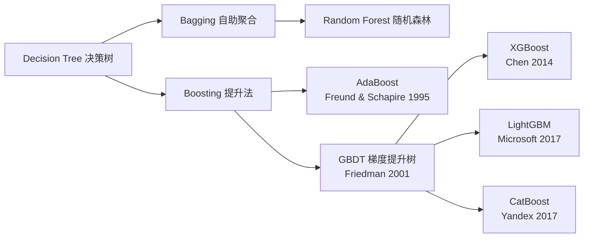
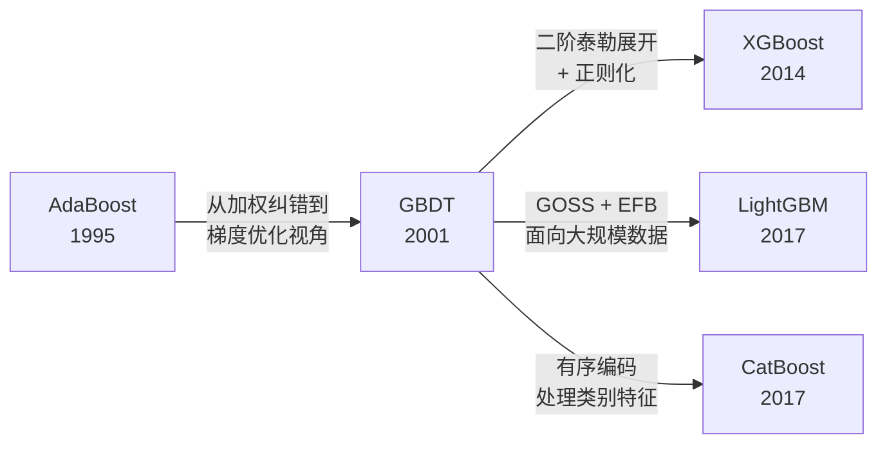

# Boosting 家族大盘点 (AdaBoost / GBDT / XGBoost / LightGBM / CatBoost)

## 知识地图



## 前置知识

- **决策树 (Decision Tree)**：理解 CART 树（分类和回归树）的分裂过程、叶节点预测值的计算方式。
- **偏差-方差分解 (Bias-Variance Tradeoff)**：Bagging 降低方差，Boosting 降低偏差。
- **梯度下降 (Gradient Descent)**：理解"沿负梯度方向逐步逼近最优解"的思想——GBDT 将梯度下降从参数空间搬到了函数空间。
- **泰勒展开**：理解一阶导数和二阶导数的几何意义。XGBoost 的核心改进（二阶泰勒展开）建立在此之上。
- **正则化 (Regularization)**：L1/L2 正则化的作用和公式形式。

## 模型演化路线



| 算法 | 年份 | 关键创新 |
|------|------|----------|
| AdaBoost | 1995 | 自适应样本权重 + 加权投票，首次证明了弱学习器可以提升为强学习器 |
| GBDT | 2001 | 函数空间上的梯度下降，每棵树拟合上一轮的"残差"（负梯度） |
| XGBoost | 2014 | 二阶泰勒展开 + 显式正则化 + 多种工程优化（列块存储、缓存感知等） |
| LightGBM | 2017 | GOSS 单边梯度采样 + EFB 互斥特征捆绑 + Leaf-wise 生长，训练速度提升数十倍 |
| CatBoost | 2017 | 有序目标编码 + Ordered Boosting，完美处理类别特征，免去手动编码 |

## 为什么会出现 (Why)

Bagging（如随机森林）虽然通过并行训练和投票有效降低了方差，但它有一个根本缺陷：**每棵树都是独立训练的，后面的树不会从前面的树的错误中学习**。想象 100 个人各自独立答题然后投票——如果所有人都犯了同样的系统性错误（比如都对某一类样本误判），投票也纠正不了这个错误。这就是**高偏差**的问题。

Boosting 的动机完全不同：与其找 100 个人独立答题，不如让一个人反复改进——第二遍专门纠正第一遍的错，第三遍弥补第二遍的残余误差……最终把偏差降到极低。

## 解决什么问题 (Problem)

- **高偏差问题**：Bagging 无法降低模型的偏差（预测值整体偏离真实值的程度）。Boosting 通过串行纠错，每一轮都"盯着"前一轮的残差来训练，逐步将偏差逼近到 0。
- **弱学习器到强学习器的转化**：理论证明，只要一个学习器的错误率略好于 50%（弱学习器），通过 Boosting 就可以将其提升为任意精度的强学习器。
- **结构化数据的极致精度**：在表格数据竞赛中（Kaggle、天池等），XGBoost 和 LightGBM 常年占据冠军方案的核心位置。

## 核心思想 (Core Idea)

**Boosting = 串行训练 + 残差拟合 + 加权集成**——每一轮新加入的弱学习器，唯一的任务就是去纠正前面所有学习器共同犯下的错误（拟合残差或加权错分样本），最终通过加权求和将所有弱学习器的"补丁"拼成一个强学习器，从而将偏差降到极低。

---

如果说 Bagging（如随机森林）的哲学是"集思广益、平行投票"，那么 Boosting 的哲学就是"知错能改、薪火相传"。它通过串行的方式训练弱学习器，每一个新加入的成员，唯一的任务就是去纠正前一个成员犯下的错误。

**比喻（打高尔夫球）：**

* **Bagging**：找 100 个普通人同时挥杆，最后取所有人落点的平均值，希望能靠近球洞（降低方差）。
* **Boosting**：你自己一个人打。第一杆打完，发现离球洞还差 50 米（这就是**残差**）。你的第二杆不再瞄准原来的起点，而是专门为了弥补这剩下的 50 米去挥杆。第三杆弥补第二杆剩下的 5 米……直到球进洞（降低偏差）。

---

## 数学模型/公式

### 1. AdaBoost --- 基于"错题本"的加权纠错

**大白话**：考试时做错的题，老师会用红笔圈出来并加重分值。下一次考试，如果还做错这些题，扣分会更狠。这就是 AdaBoost 的核心：**给分错的样本加权重，给准确率高的弱分类器加话语权。**

**核心算法流程**：

1. **初始化**：所有样本一视同仁，权重 $w_i = 1/n$。
2. **循环迭代 ($t = 1, \ldots, T$)**：
   * 训练当前的弱分类器 $h_t$。
   * 计算加权错误率 $\epsilon_t = \sum_i w_i \cdot \mathbb{I}(y_i \neq h_t(x_i))$。
   * 计算当前分类器的"话语权" $\alpha_t = \frac{1}{2} \ln\frac{1-\epsilon_t}{\epsilon_t}$（错误率越低，$\alpha_t$ 越大）。
   * **更新样本错题本**：$w_i \leftarrow w_i \cdot \exp(-\alpha_t y_i h_t(x_i))$（分错的样本权重指数级放大）。
3. **最终融合**：所有分类器按"话语权"加权投票：

$$H(x) = \text{sign}\left(\sum_{t=1}^{T} \alpha_t h_t(x)\right)$$

> **通俗解释 --- "话语权" $\alpha_t$：** 如果一个分类器的错误率是 5%，代入公式得 $\alpha_t \approx 1.47$；如果错误率是 45%，$\alpha_t \approx 0.10$。错误率越低的分类器，在最终投票中的"嗓门"越大。

> **通俗解释 --- 权重更新：** 对于被正确分类的样本（$y_i h_t(x_i) = +1$），权重乘以 $e^{-\alpha_t} < 1$，权重减小；对于被错分的样本（$y_i h_t(x_i) = -1$），权重乘以 $e^{\alpha_t} > 1$，权重被指数级放大。所以下一轮的分类器不得不多关注这些"难题"。

**流程可视化**：

```mermaid
graph TD
    subgraph sg1 [AdaBoost 串行加权流程]
        D1[📊 数据集 D1<br/>样本权重均匀] --> M1[🌳 弱学习器 1<br/>计算错误率 ε₁]
        M1 --> W1{权重更新分配<br/>生成话语权 α₁}
        W1 --> |"放大错分样本权重<br/>缩小正确样本权重"| D2[📊 数据集 D2<br/>困难样本被凸显]
        
        D2 --> M2[🌳 弱学习器 2<br/>专注攻克困难样本]
        M2 --> W2{权重更新分配<br/>生成话语权 α₂}
        W2 --> |"继续放大错分样本权重"| D3[📊 数据集 D3<br/>极难样本被凸显]
        
        D3 --> M3[🌳 弱学习器 3<br/>计算错误率 ε₃]
        
        M1 -.->|提供 α₁| OUT[🎯 最终分类器<br/>H(x) = sign(Σαₜhₜ)]
        M2 -.->|提供 α₂| OUT
        M3 -.->|提供 α₃| OUT
    end
    
    %% 强制垂直单列排版
    M1 ~~~ D2
    M2 ~~~ D3
    W2 ~~~ OUT

```

### 2. GBDT (Gradient Boosting Decision Tree) --- 梯度提升树

**大白话**：AdaBoost 是在算"对错"，而 GBDT 是在算"距离"。GBDT 每轮新长出来的树，都是为了去拟合上一轮预测结果与真实值之间的**差距（负梯度/伪残差）**。

残差公式：

$$r_{ti} = -\left[ \frac{\partial L(y_i, F(x_i))}{\partial F(x_i)} \right]_{F=F_{t-1}}$$

> **通俗解释：** $L(y, F)$ 是损失函数（比如回归用平方损失 $L = \frac{1}{2}(y - F)^2$，分类用对数损失）。对 $F$ 求偏导再取负号，得到的就是"沿着哪个方向调整 $F$ 能让损失下降最快"的方向。GBDT 每一轮训练一棵树来拟合这个方向向量，然后沿该方向迈一小步（乘以学习率 $\eta$）。

状态更新：

$$F_t(x) = F_{t-1}(x) + \eta \cdot h_t(x)$$

*注：$\eta$（学习率 Learning Rate）是最关键的参数，通常在 0.01~0.1 之间。步子迈得小（$\eta$ 小），需要的树就多，但模型更精细、泛化更好。*

> **通俗解释 --- 学习率 $\eta$：** 想象你蒙着眼睛走向一个目标。如果每一步迈得很大（$\eta=1$），你可能直接跨过目标甚至摔倒（过拟合）。如果每一步很小（$\eta=0.01$），虽然需要很多步才能到，但每一步都稳扎稳打（泛化好）。GBDT 中，$\eta$ 和树的数量 $T$ 通常联合调节——两者乘积大致恒定：$\eta$ 减半，$T$ 大致需要翻倍。

---

### 3. XGBoost --- 工程化与数学的极致 (Kaggle 屠榜杀手)

XGBoost 是陈天奇博士对 GBDT 的史诗级魔改，核心改进有两点：

**1. 二阶泰勒展开 (更准的导航)：**
GBDT 只用到了一阶导数（告诉你往前走），XGBoost 引入了二阶导数 Hessian（不仅告诉你往前走，还告诉你前面的坡度有多陡）。收敛更快，分裂更准。

$$\text{Obj}^{(t)} \approx \sum_i \left[ g_i h_t(x_i) + \frac{1}{2} h_i h_t^2(x_i) \right] + \Omega(h_t)$$

> **通俗解释：** 一阶导数 $g_i$ 告诉你"应该往哪走"，二阶导数 $h_i$ 告诉你"这个地方有多陡"。知道了坡度信息，你就可以预估迈出一小步之后损失会下降多少——这让 XGBoost 在选择分裂点时比 GBDT 更"有远见"，不只看当前收益，还考虑未来趋势。

**2. 自带正则化 (防过拟合的刹车)：**
传统的树很容易长得太深。XGBoost 直接在目标函数里加上了对"树的复杂度"的惩罚：

$$\Omega(f) = \gamma T + \frac{1}{2}\lambda \|\mathbf{w}\|^2$$

*（$T$ 是叶子节点数量，$\mathbf{w}$ 是叶子节点的分数。叶子越多、分数越极端，惩罚越大。）*

> **通俗解释：** $\gamma T$ 类似于在说"每多长一个叶子我就罚你一次"（防止树变得太复杂），$\frac{1}{2}\lambda \|\mathbf{w}\|^2$ 在说"每个叶子给出的预测值不要太极端"（防止模型记住个别样本）。这比传统 GBDT 只靠 max_depth 和 min_samples_split 来控制复杂度要精细得多。

---

### 4. LightGBM --- 速度与内存的王者

当数据量达到千万级，XGBoost 也会慢得像蜗牛。微软推出的 LightGBM 主打一个"快"字：

* **GOSS (单边梯度采样)**：**"抓大放小"**。梯度大的样本说明模型还没学好，全部保留；梯度小的样本说明已经学得很好了，随机丢掉一部分。直接砍掉大量计算。

> **通俗解释：** 就像老师在改作业——错的题认真批改（梯度大、模型没学好），已经做对的题粗略扫一眼就过。这样批改的效率极大提升，而质量不会明显下降。

* **EFB (互斥特征捆绑)**：遇到大量 One-hot 编码的稀疏特征时，把永远不会同时出现的特征（比如"是男人"和"是女人"）绑成一列，大幅降维。

> **通俗解释：** 如果两个特征永远不会同时为 1（互斥），那它们可以安全地合并到一个列里，通过偏移量区分。比如"性别_男"和"性别_女"本来是两列，可以绑成一列：值为 0 表示男，值为 1 表示女。这大幅减少了特征数量和内存占用。

* **Leaf-wise 生长策略**：不再像传统树那样一层层老老实实长，而是哪片叶子的误差下降最快，就无脑分裂哪片叶子。收敛极快，但必须严格限制 `max_depth`，否则极易过拟合。

> **通俗解释：** 传统的 XGBoost 用的是 Level-wise 生长——每层所有叶子同时分裂，公平但低效。LightGBM 的 Leaf-wise 是按"收益"排队——谁分裂后损失降得最多，就先分裂谁，像贪心算法一样。这更快但容易长成一根又深又细的"链"（过拟合），所以必须配合 `num_leaves` 或 `max_depth` 加以限制。

---

### 5. CatBoost --- 类别特征专家

由俄罗斯 Yandex 推出。传统模型遇到"城市=北京/上海/广州"这种类别特征（Categorical Features）需要手动做编码，而 CatBoost 可以开箱即用：

* **Ordered Target Encoding**：巧妙解决目标泄露问题。在给"北京"算平均分时，只用排在这个样本**前面**的数据，坚决不用未来的数据。

> **通俗解释：** 如果简单地用"北京"对应的所有样本标签的均值来编码，那么对于训练集，这个编码中包含了它自身的标签——这就是"目标泄露"（data leakage），会导致过拟合。Ordered Target Encoding 通过一个"时间顺序"（随机排列数据，每个样本只用排在它前面的样本来计算编码），优雅地解决了这个问题。

* **Ordered Boosting**：克服了训练集和测试集分布偏移的问题，调参极少，对新手极其友好。

---

## 算法流程图 (GBDT 核心流程)

```mermaid
graph TD
    Start[🎯 开始: 初始化 F0<br/>通常为训练集的均值] --> Iter{循环迭代<br/>t = 1, 2, ..., T}
    Iter --> Calc[📐 计算负梯度/伪残差<br/>r_i = -∂L/∂F]
    Calc --> Fit[🌳 训练回归树 h_t<br/>拟合残差 r_i]
    Fit --> Line[🔍 一维搜索最佳步长<br/>最小化 L(y, F_{t-1} + γ·h_t)]
    Line --> Update[📝 更新模型<br/>F_t = F_{t-1} + η·γ·h_t]
    Update --> Check{达到停止条件?<br/>T轮完成 或 验证集不再提升}
    Check -->|否| Iter
    Check -->|是| Done[✅ 输出最终模型<br/>F(x) = F_0 + η·Σγ_t·h_t(x)]
```

---

## 偏差-方差视角下的 Boosting

Boosting 的每一步都在降低**偏差**（因为每一步都针对性地修正了前一轮的残差），但同时会增大**方差**（因为后面的树强依赖前面的树，模型会逐渐变得敏感和复杂）。因此：

- **Boosting 的核心目标**：降低偏差（和 Bagging 的降低方差形成互补）
- **控制方差的策略**：通过较小的学习率 $\eta$（shrinkage）和限制树深度/叶子数量来抑制方差增长
- **Bagging vs Boosting 的互补性**：可以级联使用——先 Boosting 降偏差，再 Bagging 降方差（或反之）

---

## 框架对比与选型指南

| 框架 | 核心绝技 | 最佳适用场景 | 优缺点评价 |
| --- | --- | --- | --- |
| **XGBoost** | 二阶导数 + 强正则化 | 中小规模高精度竞技 (Kaggle) | **精工细作**。精度极高，支持自定义损失函数；但极耗内存，训练速度较慢。 |
| **LightGBM** | GOSS + EFB降维 | 工业界大规模数据、超高维特征 | **天下武功唯快不破**。内存占用极低，速度极快；但对极小数据集容易过拟合。 |
| **CatBoost** | 完美处理类别特征 | 包含大量文本/类别特征的数据 | **傻瓜式神器**。开箱即用，免去繁琐的特征工程；但模型体积偏大，预测耗时稍长。 |

---

## 最小可运行代码

在实际工程中，只需几行代码即可调用这些强大的算法：

### XGBoost 标准训练模板

```python
import xgboost as xgb

# 实例化模型
model = xgb.XGBClassifier(
    n_estimators=100,        # 迭代轮数 T
    max_depth=6,             # 树的最大深度 (控制复杂度)
    learning_rate=0.1,       # 学习率 η (步长)
    subsample=0.8,           # 行采样 (Bagging思想，防过拟合)
    colsample_bytree=0.8,    # 列采样 (特征随机抽取)
    reg_lambda=1.0,          # L2 正则化惩罚项
    early_stopping_rounds=10 # 连续10轮验证集无提升则提前停止
)

# 训练并监控验证集
model.fit(
    X_train, y_train, 
    eval_set=[(X_val, y_val)], 
    verbose=False
)

```

### LightGBM 标准训练模板

```python
import lightgbm as lgb

# 实例化模型
model = lgb.LGBMClassifier(
    n_estimators=100,
    num_leaves=31,           # LightGBM 核心参数：直接控制叶子数代替 max_depth
    learning_rate=0.1,
    subsample=0.8,
    colsample_bytree=0.8
)

# 训练并监控验证集
model.fit(
    X_train, y_train, 
    eval_set=[(X_val, y_val)]
)

```

### CatBoost 标准训练模板

```python
from catboost import CatBoostClassifier

model = CatBoostClassifier(
    iterations=100,
    learning_rate=0.1,
    depth=6,
    cat_features=categorical_cols_idx,  # 直接传入类别特征列索引
    verbose=False
)
model.fit(X_train, y_train, eval_set=(X_val, y_val))
```

---

## 工业界应用

| 场景 | 说明 | 推荐框架 |
|------|------|----------|
| **金融风控** | 信用评分、欺诈交易检测、贷款违约预测 | XGBoost / LightGBM |
| **推荐系统** | CTR 预估、搜索排序、个性化推荐 | LightGBM（数据量大） |
| **医疗健康** | 疾病预测、药物反应建模 | XGBoost（精度优先） |
| **广告投放** | 实时竞价 (RTB)、用户意图预测 | LightGBM（低延迟要求） |
| **零售与电商** | 销量预测、客户流失预警 | CatBoost（类别特征多） |
| **自然语言处理** | 文本分类、情感分析（结合 TF-IDF） | XGBoost |
| **Kaggle 竞赛** | 结构化数据竞赛 | XGBoost + LightGBM + 融合 |

---

## 对比表格

### Bagging vs Boosting

| 维度 | Bagging (随机森林) | Boosting (AdaBoost/GBDT/XGBoost) |
|------|-------------------|----------------------------------|
| **训练方式** | 并行（各树独立训练） | 串行（后一棵树依赖前一棵的结果） |
| **核心目标** | 降低方差 (Variance) | 降低偏差 (Bias) |
| **基学习器** | 强学习器（深树，低偏差高方差） | 弱学习器（浅树，高偏差低方差） |
| **过拟合风险** | 极低（树越多越稳定） | 较高（需严格控制学习率和树深） |
| **并行能力** | 极好（线性加速） | 差（串行依赖） |
| **对异常值的敏感度** | 较低（投票稀释了异常影响） | 较高（异常值残差大，Boosting 会过度关注） |
| **样本权重** | 等权重 Bootstrap | 动态调整（错分样本权重不断增大） |

---

## 学完后建议继续学习

1. **Stacking / Blending**——将 XGBoost、LightGBM、CatBoost 的输出堆叠起来，训练一个元模型（如逻辑回归）做最终预测，这是 Kaggle 冠军方案的常用技巧。
2. **NGBoost (Natural Gradient Boosting)**——不预测点估计，而是预测完整的概率分布（均值和方差同时输出）。
3. **TabNet / FT-Transformer**——深度学习在表格数据上的新尝试，了解其与 GBDT 的优劣对比。
4. **贝叶斯超参优化 (Optuna / Hyperopt)**——自动化调参：学习率、树深、叶子数、正则化系数之间的 tradeoff。
5. **可解释性工具 (SHAP)**——用 SHAP 值解释 XGBoost/LightGBM 模型的单个预测决策，把"黑盒"变成"灰盒"。

---

## 高频面试题

### Q1: Bagging 和 Boosting 的本质区别是什么？

**标准答案：** 两者在四个维度上有本质区别：
1. **目标不同**：Bagging 主要降低方差，Boosting 主要降低偏差。
2. **训练方式不同**：Bagging 是并行的（各基学习器独立训练），Boosting 是串行的（后一个依赖前一个的误差）。
3. **基学习器不同**：Bagging 用强学习器（深树，低偏差高方差），Boosting 用弱学习器（浅树，高偏差低方差）。
4. **聚合方式不同**：Bagging 是等权投票/平均，Boosting 是加权求和（准确度高的学习器权重更大）。

从偏差-方差分解看，Bagging 通过取平均消除独立随机误差来压方差，而 Boosting 通过不断"打补丁"修正系统性误差来降偏差。这也解释了为什么深度学习的 Bagging（多个网络的 ensemble）和 Boosting（残差网络 ResNet）都能提升性能——它们在误差空间里解决的是不同的问题。

### Q2: XGBoost 相对于 GBDT 有哪些关键改进？

**标准答案：** 主要有三大改进：
1. **二阶泰勒展开**：GBDT 只用一阶导数（梯度）来近似损失函数，XGBoost 引入了二阶导数（Hessian），使得对损失函数的近似更精确，分裂点的选择也更优，收敛更快。
2. **显式正则化**：GBDT 通常只通过树的深度或最小叶子样本数来限制复杂度（隐式正则），而 XGBoost 在目标函数中直接加入了 $\Omega(f) = \gamma T + \frac{1}{2}\lambda \|\mathbf{w}\|^2$，同时控制了叶子数量和叶子分数的极端程度，这是显式正则化。
3. **工程优化**：列块存储方案（对特征预排序 + 分块存储以提升分裂效率）、缓存感知访问、缺失值自动处理（学习默认分支方向）等，使得训练速度比传统 GBDT 快数倍。

### Q3: LightGBM 的 Leaf-wise 生长和 XGBoost 的 Level-wise 生长有什么区别？

**标准答案：** 
- **Level-wise（XGBoost 默认）**：逐层分裂，同一层的所有叶子节点同时进行分裂。优点是平衡、规则，缺点是计算了不必要的分裂（有些叶子分裂后收益很小却依然分裂），浪费计算资源。
- **Leaf-wise（LightGBM）**：按收益分裂，每次从所有叶子节点中选出"分裂后损失下降最多"的那一个进行分裂。优点是收敛极快、效率高，缺点是可能长出很深的不平衡树导致过拟合，所以必须配合 `num_leaves` 或 `max_depth` 参数加以限制。

打个比方：Level-wise 是全班同学按年级统一升级，Leaf-wise 是只让学得最快的那个学生跳级。后者更快，但需要额外的监控防止"过度跳级"。

### Q4: 为什么 XGBoost 和 LightGBM 在处理缺失值时不需要预处理？

**标准答案：** XGBoost 和 LightGBM 都在训练过程中**自动学习**了缺失值的最优处理方向，而非像传统方法那样先填一个值（均值/中位数/众数）。具体做法是：在每次分裂时，算法会将所有缺失值样本分别尝试分配到左子树和右子树，然后选择损失下降更多的那一侧作为"缺失值的默认去向"。这意味着模型根据数据驱动地学习出"对于这个特征，缺失值更像哪个方向的样本"，而非人为假设。

### Q5: Boosting 容易过拟合吗？如何防止？

**标准答案：** Boosting 比 Bagging 更容易过拟合，因为每棵树都在"纠正"前面的错误，越往后越可能开始拟合噪声。防止过拟合的核心手段：
1. **降低学习率 $\eta$**（Shrinkage）：$\eta$ 通常设 0.01~0.1，小学习率 + 多棵树的效果通常优于大学习率 + 少棵树。
2. **限制树的复杂度**：`max_depth`（3~6）、`min_child_weight`（XGBoost）、`num_leaves`（LightGBM）。
3. **行采样和列采样**：`subsample` 和 `colsample_bytree` 引入 Bagging 的随机性，增加树之间的独立性。
4. **早停 (Early Stopping)**：监控验证集，连续 N 轮无提升则停止训练。
5. **正则化**：$\lambda$（L2）和 $\gamma$（叶子惩罚）（XGBoost 特有）。
