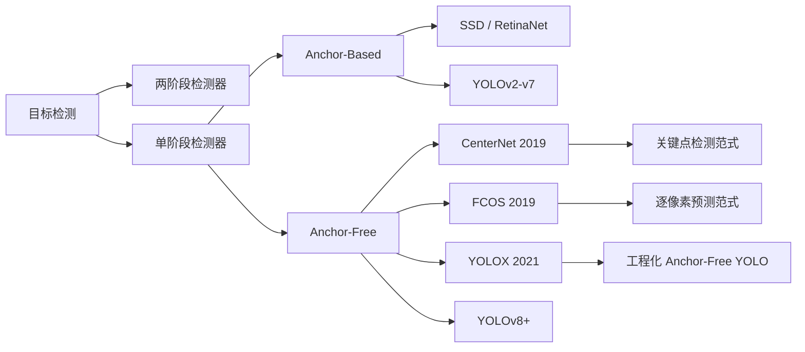
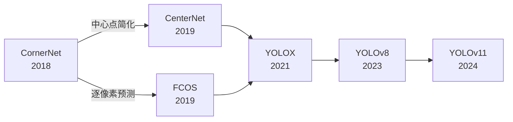
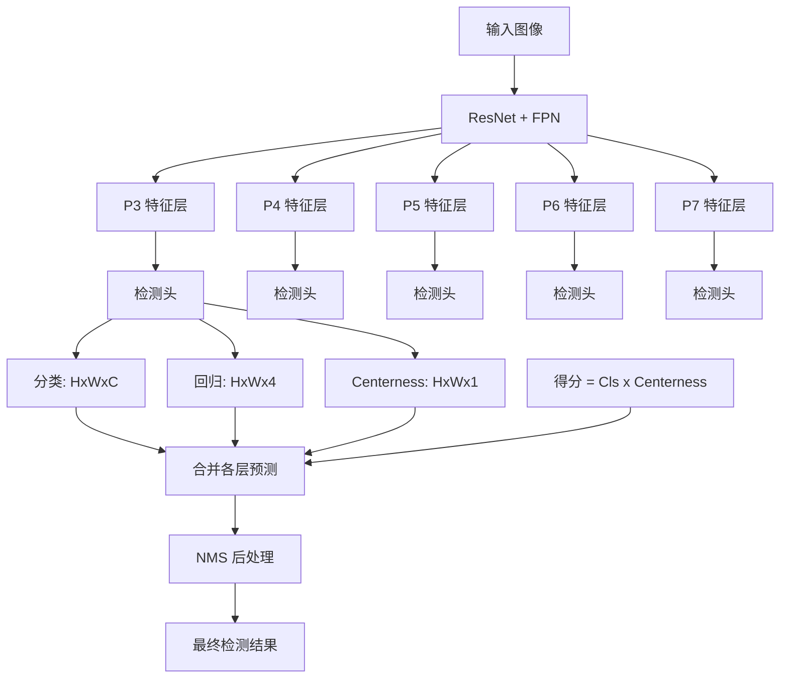
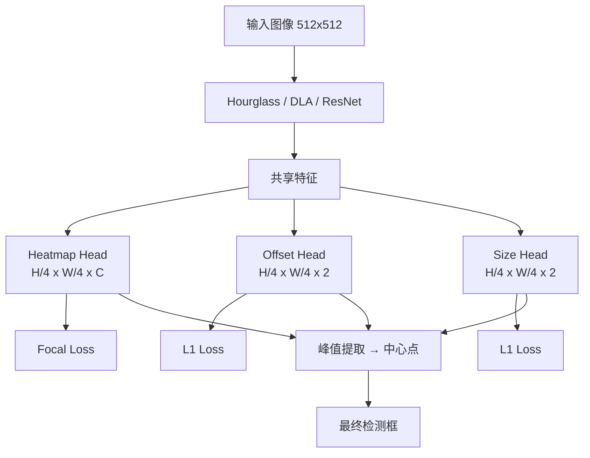
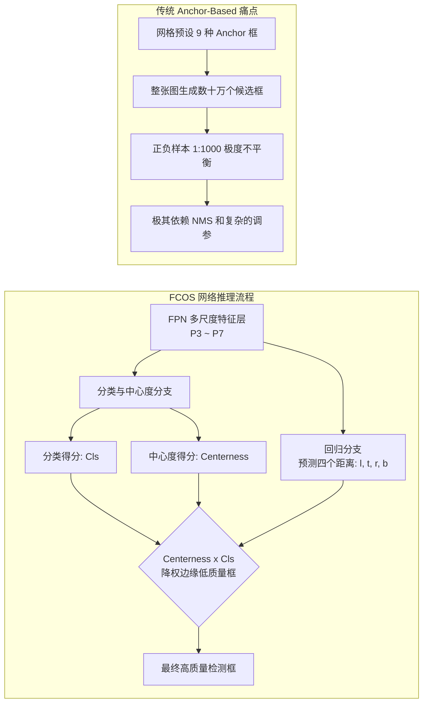

# Anchor-Free 目标检测三剑客 (CenterNet / FCOS / YOLOX)

## 知识地图



## 前置知识

- 目标检测基础：IoU、NMS、mAP、边界框编码
- Anchor-Based 检测器：Faster R-CNN 的 Anchor 机制，SSD 的默认框
- FPN (特征金字塔网络) 的多尺度特征融合
- 单阶段检测器的设计理念（YOLO, RetinaNet）
- Focal Loss 的原理（类别不平衡处理）
- 解耦头 (Decoupled Head) 的基本概念

## 模型演化路线



| 模型 | 年份 | 关键创新 |
|------|------|----------|
| CornerNet | 2018 | 第一个 Anchor-Free 检测器，检测左上角和右下角关键点 |
| CenterNet | 2019 | 将检测简化为中心点 + 宽高，极简设计 |
| FCOS | 2019 | 逐像素预测到四边的距离，Centerness 抑制低质量框 |
| YOLOX | 2021 | 解耦头 + SimOTA 动态标签分配 + 彻底无锚 |
| YOLOv8 | 2023 | Anchor-Free + 解耦头 + C2f 模块 |

## 为什么会出现 (Why)

在深度学习的早期（如 Faster R-CNN, YOLOv3），目标检测极度依赖 **Anchor (锚框)**。

**比喻 (Anchor-Based)**：这就像是在地图上预先撒下一堆大大小小、长长短短的"捕鼠笼"。模型的工作是判断哪个笼子抓到了老鼠，并且稍微调整一下笼子的大小。**缺点**是：笼子太多了（计算量大），老鼠长得千奇百怪（比例很难穷举），而且 99% 的笼子都是空的（正负样本极度不平衡）。

**Anchor-Free 检测器**掀桌子了：**我们不需要预设笼子了！**

**比喻 (Anchor-Free)**：
- **CenterNet**：像打靶子一样。模型直接在图上找老鼠的"心脏（中心点）"，一旦找到心脏，直接顺便猜一下老鼠的长宽。
- **FCOS**：只要是老鼠身上的像素点都算数！模型问每个点："你离老鼠的上下左右边缘各有多远？"
- **YOLOX**：把经典的 YOLO 架构进行了剥离，扔掉预设笼子，改用聪明的"动态分配"策略，让模型自己决定哪些像素点该去负责预测这只老鼠。

## 解决什么问题 (Problem)

**Anchor-Based 方法的核心痛点：**

1. **Anchor 设计依赖人工经验**：尺度、长宽比需要手动设置，不同任务需要不同配置
2. **计算冗余**：大量 Anchor 对应背景，计算资源浪费
3. **正负样本极度不平衡**：正样本 Anchor 占比不到 0.1%
4. **超参数敏感**：Anchor 数量、IoU 阈值等对性能影响大
5. **泛化性受限**：预设的 Anchor 形状难以覆盖所有数据分布

Anchor-Free 方法从根本上消除了这些问题。

## 核心思想 (Core Idea)

**抛弃预设的 Anchor 框，直接从特征图上的每个位置预测物体——要么预测它是不是中心点（CenterNet），要么预测它到边界的距离（FCOS），要么用动态策略分配正样本（YOLOX）。**

---

## 核心算法数学原理与机制

### 1. CenterNet (Objects as Points) — 极致的极简主义

CenterNet 将复杂的检测问题，退化成了"关键点检测"问题。

它的核心是输出一张**热力图 (Heatmap)**：

$$\hat{Y} \in [0, 1]^{\frac{H}{R} \times \frac{W}{R} \times C}$$

其中 $C$ 是类别数。如果某个坐标是目标中心，那里就会亮起一个红点。为了让模型好训练，真实的标签会在中心点周围用高斯核散开（越靠近中心越亮）：

$$Y_{xyc} = \exp\left(-\frac{(x - \tilde{p}_x)^2 + (y - \tilde{p}_y)^2}{2\sigma_p^2}\right)$$

**通俗解释：** CenterNet 不预测框，而是预测"每个像素是物体中心的概率"。就像一张热度图，猫的中心位置有一个亮点，周围逐渐变暗。然后从中心点出发，再预测宽和高，框就确定了。这是一个把检测问题降维成关键点估计的巧妙思路——极简、高效。

除了热力图，它只附带两个轻量级的预测：目标的宽和高，以及中心点因为降采样丢失的亚像素偏移量。

### CenterNet 损失函数

$$L = L_k + \lambda_{size} L_{size} + \lambda_{off} L_{off}$$

- $L_k$：Focal Loss（关键点热力图）
- $L_{size}$：L1 Loss（宽高回归）
- $L_{off}$：L1 Loss（偏移补偿）

**通俗解释：** 三项损失各司其职：(1) 热力图损失用 Focal Loss 缓解正负样本不平衡（大部分位置不是中心点）；(2) 尺寸损失用 L1 回归物体的宽高；(3) 偏移损失补偿下采样带来的误差。比如输入 512x512，输出热力图 128x128（4倍下采样），中心点坐标 (125, 125) 量化后丢失了亚像素精度，offset 分支负责找回这个精度。

### 2. FCOS (Fully Convolutional One-Stage) — 像素级的灵魂拷问

FCOS 抛弃了中心点，它认为**落在目标框内的所有特征点**都可以用来预测！每个位置 $(x, y)$ 都会预测自己到框的四个边界的距离 $(l, t, r, b)$：

$$l = x - x_0, \; t = y - y_0, \; r = x_1 - x, \; b = y_1 - y$$

**通俗解释：** 如果我站在物体框内的任意一个像素上，我往左看能看多远到头，往上看多远，往右看多远，往下看多远——这就是 l, t, r, b。这四个数唯一确定了一个边界框。相比于 Anchor-Based 方法需要预设参考框，FCOS 直接从每个像素的视角"目测"距离。

**核心痛点与神来之笔：Centerness (中心度)**

落在框边缘的点，视野不好，预测的框通常质量很差。FCOS 发明了 Centerness 分支，用来评估这个点有多靠近中心：

$$\text{centerness} = \sqrt{\frac{\min(l, r)}{\max(l, r)} \times \frac{\min(t, b)}{\max(t, b)}}$$

**通俗解释：** 如果你在中心，你到左右的距离应该差不多，到上下的距离也差不多——centerness 接近 1。如果你在左边边缘，到左边距离很小（接近 0），到右边距离很大，centerness 接近 0。在最后筛选框（NMS）的时候，centerness 乘以分类得分，那些处于边缘的低质量预测会被直接淘汰。

### 3. YOLOX — 实用主义的巅峰

YOLOX 是对 YOLO 系列的 Anchor-Free 改造版，包含三大杀招：

1. **解耦头 (Decoupled Head)**：以前的 YOLO 用一层卷积同时输出类别和坐标，YOLOX 发现"认东西"和"找位置"需要的特征完全不同，于是把它们强行分成了两个独立的分支。

2. **彻底无锚 (Anchor-Free)**：每个网格只预测 1 个框（抛弃了之前的 3 种比例组合）。

3. **SimOTA (动态标签分配)**：传统方法是死规矩（比如 IoU > 0.7 就是正样本）。SimOTA 就像一个智能的 HR，它会根据模型当前的预测状态，计算代价矩阵，**动态决定**把这张图里的"猫"分配给哪几个网格去预测。

**通俗解释 (SimOTA 工作机制)**：
- 计算每个预测框和每个真实框之间的代价（cost = 分类损失 + IoU 损失）
- 对每个真实框，选择代价最小的 Top-K 个预测作为正样本
- K 根据真实框大小动态变化（大框分配给更多预测，小框分配给更少）
- 一个预测可能被分配给多个真实框吗？不会——SimOTA 通过求解最优运输问题避免冲突

---

## 模型结构图

### FCOS 网络架构



### CenterNet 架构



---

## 可视化展示

### 架构演进与 FCOS 核心流程



### 三种 Anchor-Free 方法对比

| 维度 | CenterNet | FCOS | YOLOX |
|------|-----------|------|-------|
| 预测方式 | 中心点 + 宽高 | 到四边距离 l,t,r,b | 中心点 + 四边距离 |
| 关键机制 | 高斯热力图 | Centerness 抑制边缘 | SimOTA 动态分配 |
| 输出数量 | 每个位置 1 个预测 | 每个位置 1 个预测 | 每个位置 1 个预测 |
| 后处理 | NMS 或直接 | NMS | NMS |
| 复杂度 | 极简 | 中等 | 中等（但工程优化好） |
| 标签分配 | 固定（中心点附近） | 固定（GT 框内） | 动态（SimOTA） |

---

## 最小可运行代码

### PyTorch — FCOS 的解耦头与 Centerness 计算

这段代码展示了 FCOS 是如何将分类和回归解耦，并计算其灵魂机制"中心度"的。

```python
import torch
import torch.nn as nn

class FCOSHead(nn.Module):
    def __init__(self, in_channels, num_classes):
        super().__init__()

        # 1. 分类分支 (同时附带 centerness)
        # 抛弃了共享卷积，让分类任务专心提取分类特征
        self.cls_conv = nn.Sequential(
            nn.Conv2d(in_channels, in_channels, 3, padding=1),
            nn.GroupNorm(32, in_channels), nn.ReLU(),
            nn.Conv2d(in_channels, in_channels, 3, padding=1),
            nn.GroupNorm(32, in_channels), nn.ReLU()
        )
        # 输出类别预测
        self.cls_out = nn.Conv2d(in_channels, num_classes, 3, padding=1)
        # 核心创新：输出中心度 (1个通道)
        self.centerness = nn.Conv2d(in_channels, 1, 3, padding=1)

        # 2. 回归分支
        # 专门负责找位置
        self.reg_conv = nn.Sequential(
            nn.Conv2d(in_channels, in_channels, 3, padding=1),
            nn.GroupNorm(32, in_channels), nn.ReLU(),
            nn.Conv2d(in_channels, in_channels, 3, padding=1),
            nn.GroupNorm(32, in_channels), nn.ReLU()
        )
        # 输出每个像素到四条边的距离：left, top, right, bottom
        self.reg_out = nn.Conv2d(in_channels, 4, 3, padding=1)

        # 初始化技巧 (Focal Loss 必备 prior)
        nn.init.constant_(self.cls_out.bias, -4.595)  # 防止训练初期全负样本导致梯度爆炸

    def forward(self, features):
        cls_feat = self.cls_conv(features)
        cls_score = self.cls_out(cls_feat)
        centerness = self.centerness(cls_feat)

        reg_feat = self.reg_conv(features)
        # 使用 torch.exp 确保回归的距离 l, t, r, b 必须是正数
        bbox_pred = torch.exp(self.reg_out(reg_feat))

        return cls_score, centerness, bbox_pred

    def compute_centerness_target(self, l, t, r, b):
        """
        数学之美：计算真实框的 centerness 标签。
        如果处于绝对中心，min(l,r) == max(l,r)，得分为 1.0。
        越靠近边缘，乘积越小，得分越接近 0。
        """
        left_right = torch.min(l, r) / torch.max(l, r)
        top_bottom = torch.min(t, b) / torch.max(t, b)
        return torch.sqrt(left_right * top_bottom)
```

## 工业界应用

| 应用场景 | 推荐方案 | 原因 |
|----------|----------|------|
| 自动驾驶 | FCOS | 逐像素预测对遮挡和密集物体鲁棒 |
| 工业质检 | YOLOX | 工程化完善，部署友好，精度高 |
| 移动端检测 | CenterNet (轻量骨干) | 极简设计，计算量小 |
| 通用目标检测 | YOLOX / YOLOv8 | 训练稳定，精度和速度综合最优 |
| 关键点相关任务 | CenterNet | 天然适合关键点估计类任务 |
| 密集场景检测 | FCOS | Centerness 机制有效抑制低质量框 |

## 对比表格

| 维度 | CenterNet | FCOS | YOLOX | RetinaNet (Anchor) |
|------|-----------|------|-------|-------------------|
| 范式 | Anchor-Free | Anchor-Free | Anchor-Free | Anchor-Based |
| 预测方式 | 中心点 + 尺寸 | l,t,r,b 距离 | Anchor-Free 检测头 | Anchor 偏移 |
| 关键创新 | 高斯热力图 | Centerness | SimOTA 动态分配 | Focal Loss |
| 标签分配 | 固定（中心区域） | 固定（GT 框内） | 动态（代价矩阵） | 固定（IoU 阈值） |
| 正样本数/物体 | 1 | 多个 | 动态 Top-K | 多个（取决于 Anchor） |
| COCO AP | 适中 | 高 | 高 | 高 |
| 训练速度 | 快 | 快 | 快 | 中等 |
| 超参数数量 | 少 | 少 | 少 | 多（Anchor 相关） |

## 学完后建议继续学习

1. **DETR (Detection Transformer)**：了解 Transformer 在目标检测中的应用，端到端检测新范式
2. **YOLOv8/v11 深入**：理解最新 YOLO 如何融合 Anchor-Free、解耦头、SimOTA 等思想
3. **标签分配策略专题**：深入对比 ATSS、PAA、OTA、SimOTA、TaskAligned 等分配策略
4. **3D 目标检测**：了解 CenterPoint 等基于 CenterNet 思想的 3D 检测方法
5. **小样本/零样本检测**：了解 CLIP、OWL-ViT 等开放词汇检测方法

## 高频面试题

### Q1: Anchor-Free 方法相比 Anchor-Based 方法的根本优势是什么？

**答：**
1. **消除超参数**：不需要手动设计 Anchor 的数量、尺度、长宽比，减少了人工调参负担
2. **缓解正负样本不平衡**：Anchor-Based 产生数万个候选框（大部分为负），Anchor-Free 的正负样本比更合理
3. **更好的泛化性**：预设的 Anchor 形状难以覆盖所有数据分布，尤其对于异常长宽比的物体
4. **简化后处理**：减少了 NMS 前的候选框数量，有的方法甚至不需要 NMS
5. **更简洁的网络结构**：去掉了 Anchor 相关的复杂逻辑（如 Anchor 生成、匹配、采样）

### Q2: FCOS 的 Centerness 分支解决了什么问题？它在推理时如何使用？

**答：**
- **解决的问题**：FCOS 将 GT 框内的所有位置都作为正样本，但边缘位置的预测通常质量很差（视野受限、特征不完整）。Centerness 分支评估每个位置距离物体中心的远近，用来抑制边缘低质量预测。
- **推理时使用**：最终得分 = 分类得分 × Centerness 得分。边缘位置的 Centerness 得分接近 0，这些框在 NMS 排序中自然落后，被优先淘汰。训练时 Centerness 分支有独立的 BCE Loss 监督。
- **类比理解**：类似 YOLO 的 Objectness 得分，但 Centerness 只关心"位置是否靠近中心"，而 Objectness 关心"是否有物体"。

### Q3: SimOTA 标签分配与传统 IoU 阈值分配有什么区别？

**答：**
- **传统 IoU 阈值分配**：预设一个固定阈值（如 IoU > 0.5），只要 Anchor 和 GT 的 IoU 超过阈值就是正样本。问题是：(1) 阈值是全局固定的，大物体和小物体用同一个标准不合理；(2) 阈值需要手动调整。
- **SimOTA 动态分配**：
  1. 计算所有预测框与所有 GT 框之间的代价矩阵（分类代价 + IoU 代价）
  2. 对每个 GT 框，选择代价最小的 Top-K 个预测作为正样本
  3. K 根据 GT 框大小动态计算（大物体多分配几个预测）
  4. 避免了"一刀切"的阈值，每个 GT 都能获得最匹配的预测
- **核心优势**：自适应、无需调阈值，训练更稳定，精度更高。

### Q4: CenterNet 为什么要用高斯热力图而不是直接预测中心点坐标？

**答：**
1. **正样本过于稀疏**：如果只有精确的中心点是正样本，每张图只有极少几个正样本，训练极难收敛。高斯核将正样本扩散到中心点周围区域，形成平滑的监督信号。
2. **容忍标注误差**：人工标注的边界框中心不一定精确，高斯核让附近的位置也有一定的概率值，对标注噪声鲁棒。
3. **梯度平滑**：高斯分布让热力图从中心向外平滑衰减，避免了二值标签的梯度突变问题。
4. **NMS 友好**：推理时在热力图上做 3x3 MaxPool 找峰值，自然地去除了重复预测。

### Q5: 为什么 YOLOX 选择每个网格只预测 1 个框（而不是之前的 3 个）？

**答：**
1. **Anchor-Free 的优势**：没有了预设的 3 种 Anchor（不同长宽比），每个位置只需要预测 1 个通用框。网络通过训练学会适应各种形状的物体。
2. **配合 SimOTA**：动态标签分配让每个真实框选择最适合的网格来预测，不需要多个 Anchor "碰运气"。
3. **计算效率**：预测数量减少到原来的 1/3，检测头计算量和内存占用大幅降低。
4. **实验验证**：YOLOX 论文的实验表明，1 个框 + SimOTA 的组合精度超过了 3 个框 + 传统 IoU 匹配。说明关键是"聪明的标签分配"而不是"更多的候选项"。
