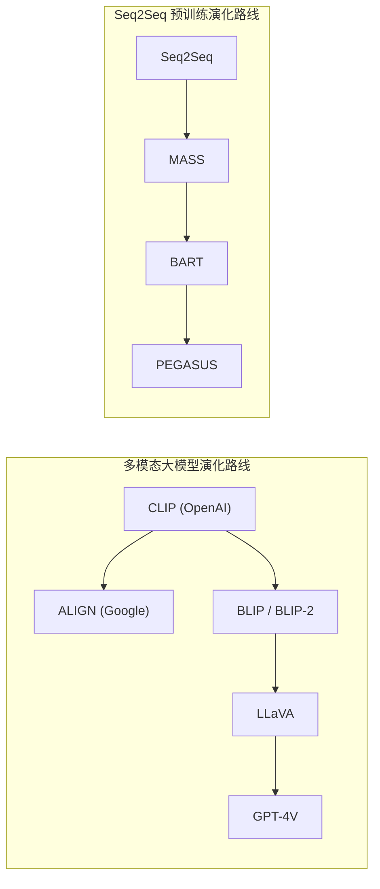
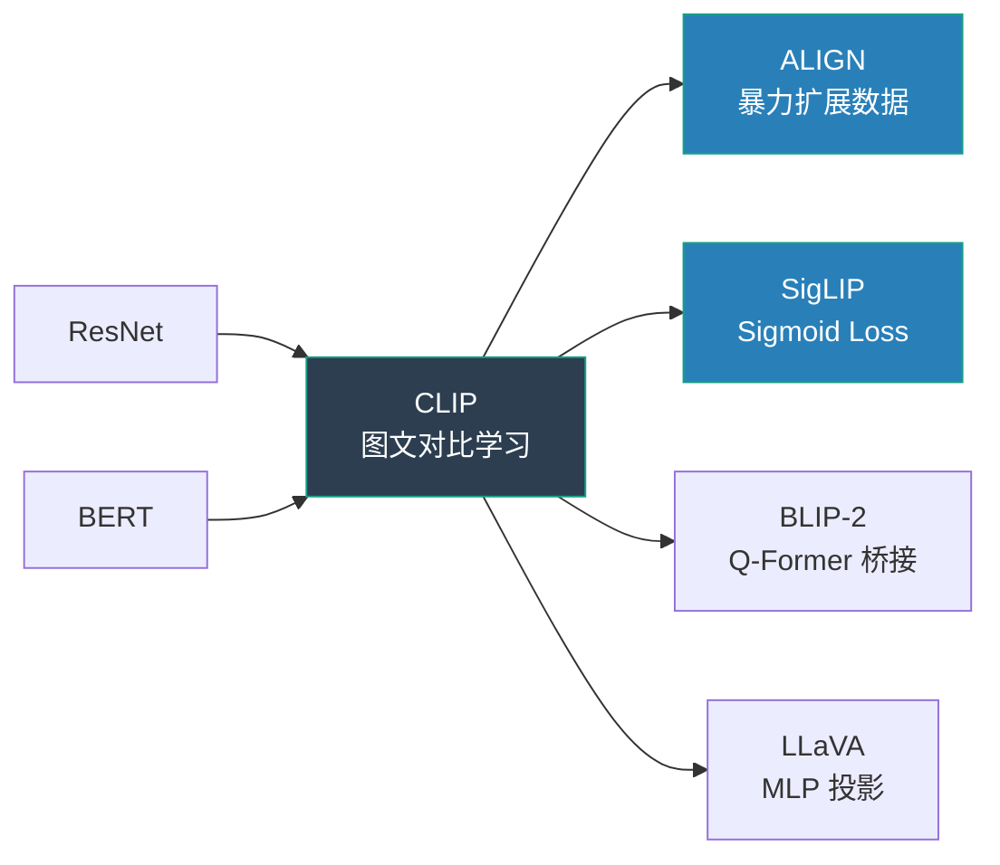
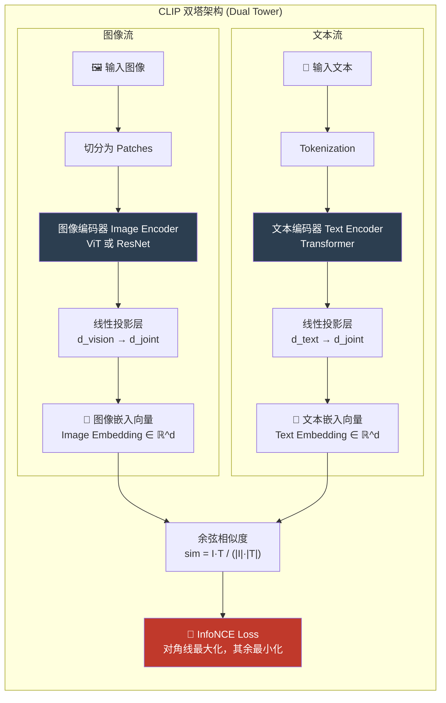
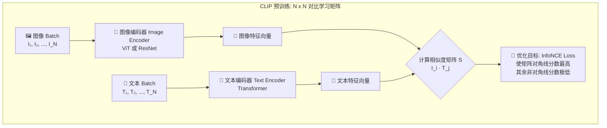

# Vision-Language Foundation Models (CLIP / ALIGN)

## 知识地图



## 前置知识

- **卷积神经网络 (CNN / ResNet)**: 图像特征提取的基础架构，理解残差连接和层级特征提取
- **Transformer**: 注意力机制、Self-Attention、位置编码——CLIP 文本编码器的核心
- **Vision Transformer (ViT)**: 如何将图像切分为 Patch 并输入 Transformer
- **词嵌入 (Word Embedding)**: 离散词汇如何映射为连续向量空间
- **余弦相似度**: 两个向量在空间中的夹角，越接近 1 表示方向越一致
- **Softmax 与交叉熵损失**: 多分类问题的标准损失函数，InfoNCE 的构建基础

## 模型演化路线



| 阶段 | 模型 | 核心突破 |
|------|------|----------|
| 传统视觉 | ResNet | 残差连接使深层网络可训练 |
| 图文对齐 | CLIP | 对比学习将图文映射到同一空间 |
| 数据规模 | ALIGN | 噪声数据 + 极致规模 > 精标数据 |
| 效率优化 | SigLIP | Sigmoid 替代 Softmax，摆脱大 Batch |
| 语言桥接 | BLIP-2 | 冻结编码器 + Q-Former 中间层 |
| 指令对话 | LLaVA | 线性投影 + GPT-4 生成指令数据 |

## 为什么会出现 (Why)

在 CLIP 诞生之前，传统图像识别模型（如 ResNet）只能做**闭集分类 (Closed-Set Classification)**——你必须在训练时就规定好类别（比如猫、狗、飞机），人工标注几百万张图片，然后模型永远只能在这固定集合里做选择题。遇到未知类别时彻底失效。更重要的是，**人工标注成本极高**——ImageNet 21k 类别、1400 万张图，已耗尽学术界资源，而现实世界的物体和概念远不止这些。

## 解决什么问题 (Problem)

1. **摆脱人工标注**: 直接从互联网图文对中学习，无需手工标注类别
2. **零样本 (Zero-Shot) 分类**: 训练完毕后，可以直接识别训练集从未见过的类别
3. **视觉-语义对齐**: 让机器理解"图像看起来像什么"和"文字描述了什么"之间的深层关联
4. **打通多模态**: 为后续的视觉问答 (VQA)、图文检索、图文生成等任务奠定基础

## 核心思想 (Core Idea)

CLIP 利用**对比学习 (Contrastive Learning)** 将图像和文本映射到**同一向量空间**，通过拉近匹配图文对、推开不匹配图文对，让模型学会"图"和"文"之间的语义对齐，从而实现零样本迁移。

## 模型结构图



## 数学模型/公式

### 对比学习矩阵

在训练时，CLIP 会抓取一个 Batch（比如 $N=32768$）的图文对。它会计算这 $N$ 张图和 $N$ 段文字两两之间的余弦相似度，形成一个 $N \times N$ 的矩阵。

### 核心数学公式：InfoNCE 损失函数

对比损失的核心目标是：**最大化对角线（真正配对的图文）的相似度，最小化其余所有组合的相似度。**

$$\mathcal{L} = -\frac{1}{2N} \left( \sum_{i} \log \frac{e^{I_i^T T_i / \tau}}{\sum_j e^{I_i^T T_j / \tau}} + \sum_{i} \log \frac{e^{T_i^T I_i / \tau}}{\sum_j e^{T_i^T I_j / \tau}} \right)$$

**通俗解释：** 这个公式做了两件事：第一项是"给定一张图，在所有 $N$ 段文字中找到正确的那一段"；第二项是"给一个段文字，在所有 $N$ 张图中找到正确的那一张"。$\tau$（温度系数）控制 Softmax 的"锐度"——越小则模型对困难负样本越敏感。两项取平均，构成了对称的 InfoNCE Loss。

### 余弦相似度

$$\text{sim}(I, T) = \frac{I \cdot T}{\|I\| \cdot \|T\|}$$

**通俗解释：** 在 CLIP 中，图文向量经过 L2 归一化后被映射到"超球面"上，余弦相似度就是两个向量在高维球面上的夹角余弦值。值域为 $[-1, 1]$，1 表示方向完全一致（图文高度匹配），-1 表示方向相反（完全不匹配）。

### Zero-Shot 分类

$$P(y | \text{image}) = \frac{\exp(\text{sim}(I, T_y) / \tau)}{\sum_{k=1}^K \exp(\text{sim}(I, T_k) / \tau)}$$

**通俗解释：** 给定一张图 $I$，把它和 $K$ 个候选类别文本（如 "a photo of a cat", "a photo of a dog"...）一一计算相似度，然后 Softmax 换算为概率，得分最高的就是模型预测的类别。全程不需要任何微调训练。

## 可视化展示

### CLIP 预训练: N x N 对比学习矩阵



### CLIP 训练流程: 从原始数据到 Zero-Shot

```mermaid
graph TD
    A[🌐 互联网抓取<br>4亿图文对] --> B[🔧 预处理与文本清洗]
    B --> C{🧠 双塔对比学习<br>InfoNCE Loss}
    C --> D[✅ 训练完成的 CLIP 模型]

    subgraph ZeroShot [Zero-Shot 推理流程]
        E[📝 输入候选标签<br>如: cat, dog, car] --> F[🎨 Prompt 模板<br>A photo of a {label}]
        F --> G[🧾 文本编码器]
        G --> H[📍 文本特征向量]

        I[🖼️ 输入测试图片] --> J[🧠 图像编码器]
        J --> K[📍 图像特征向量]

        H --> CALC[计算余弦相似度]
        K --> CALC
        CALC --> SOFTMAX[Softmax 转概率]
        SOFTMAX --> RESULT[✅ 最高概率类别]
    end

    C --> E
    C --> I
```

## 最小可运行代码

在实际工程中，调用 CLIP 提取图文特征或做分类仅需几行代码：

```python
import torch
from PIL import Image
from transformers import CLIPProcessor, CLIPModel

# 1. 自动加载预训练权重和处理器
model_id = "openai/clip-vit-base-patch32"
model = CLIPModel.from_pretrained(model_id)
processor = CLIPProcessor.from_pretrained(model_id)

# 2. 准备数据
image = Image.open("your_image.jpg")  # 假设这是一张猫的图片
candidate_labels = ["a cat", "a dog", "a car"] # 我们想让它判断是哪种

# 3. 预处理：将图片和文字打包，转换为模型需要的 Tensor
inputs = processor(text=candidate_labels, images=image, return_tensors="pt", padding=True)

# 4. 前向传播
with torch.no_grad():
    outputs = model(**inputs)

# 5. 获取结果
# logits_per_image 就是图像向量和这3个文本向量的点积相似度 (已缩放)
logits_per_image = outputs.logits_per_image  

# 过一层 Softmax 变成大家熟悉的百分比概率
probs = logits_per_image.softmax(dim=1)  

print("分类概率:", probs) 
# 预期输出类似: [[0.99, 0.008, 0.002]] -> 99% 的概率是 "a cat"
```

### 手动计算对比学习损失

```python
def clip_loss(image_embeddings, text_embeddings, temperature=0.07):
    """
    image_embeddings: [B, D] — 已 L2 归一化的图像特征
    text_embeddings:  [B, D] — 已 L2 归一化的文本特征
    返回: 对称 InfoNCE Loss
    """
    # 计算 N×N 的相似度矩阵
    logits = (image_embeddings @ text_embeddings.T) / temperature  # [B, B]

    # 图像到文本的 loss: 每行正确答案在对角线
    labels = torch.arange(len(logits), device=logits.device)
    loss_img = F.cross_entropy(logits, labels)

    # 文本到图像的 loss: 每列正确答案在对角线
    loss_txt = F.cross_entropy(logits.T, labels)

    return (loss_img + loss_txt) / 2
```

## 工业界应用

| 应用场景 | 代表产品/模型 | 如何使用 CLIP |
|----------|-------------|--------------|
| **多模态大模型** | GPT-4V, Gemini, Claude 3 Vision | CLIP ViT 作为视觉编码器基座 |
| **文生图** | DALL-E 2/3, Stable Diffusion | CLIP 文本编码器指导图像生成方向 |
| **图文检索** | Google Images, Unsplash | CLIP 编码查询文本和候选图片，用相似度排序 |
| **内容审核** | OpenAI Moderation API | Zero-shot 识别违规图片，无需重新训练 |
| **视频理解** | VideoCLIP | 将视频帧序列编码为 CLIP 特征进行时间建模 |
| **机器人视觉** | RT-2 (Google) | CLIP 让机器人理解自然语言指令对应的视觉目标 |

## 对比表格

| 维度 | CLIP (OpenAI) | ALIGN (Google) |
| --- | --- | --- |
| **数据规模** | 4 亿 (400M) | **18 亿 (1.8B)** |
| **数据质量要求** | 高。经过了严格的过滤和清洗 | **极低**。保留了大量原始网络噪声 |
| **图像编码器** | ViT 或 ResNet 系列 | **EfficientNet** 系列 |
| **文本编码器** | 标准 Transformer | BERT 风格的 Transformer |
| **核心历史贡献** | 跑通了图文对比学习的范式，开启了多模态 Zero-shot 时代 | 证明了**数据规模的扩大可以完全抹平数据质量的劣势** |
| **训练 Batch Size** | 32768 | 约 16000 |
| **开源情况** | 开源多个版本 (ViT-B/L, ResNet) | 未开源权重 |

### CLIP vs 传统视觉模型

| 维度 | 传统 ResNet | CLIP |
|------|-----------|------|
| 训练数据 | 人工标注的 ImageNet | 互联网图文对 (无需标注) |
| 分类方式 | 固定类别 Softmax | 文本匹配 (Zero-Shot) |
| 类别扩展 | 需要重新收集数据、重新训练 | 只需添加新的文本描述 |
| 泛化能力 | 只在训练类别内有效 | 可泛化到任意概念 |

## 学完后建议继续学习

1. **SigLIP / EVA-CLIP** — 理解如何优化 CLIP 的损失函数减少对巨型 Batch 的依赖
2. **BLIP-2 / LLaVA** — 理解如何将 CLIP 的视觉编码器接入大语言模型实现多模态对话
3. **DALL-E / Stable Diffusion** — 理解 CLIP 在文本到图像生成中的关键作用
4. **InfoNCE 变体** — SimCLR、MoCo 等自监督对比学习方法

## 高频面试题

### Q1: CLIP 的 InfoNCE Loss 是什么？为什么要对称计算？

**标准答案：** InfoNCE (Noise Contrastive Estimation) Loss 是 CLIP 的核心损失函数，形式为对称的交叉熵。它构建一个 $B \times B$ 的图文相似度矩阵：行方向是"图像→文本"的分类（给定图像找正确文本），列方向是"文本→图像"的分类（给定文本找正确图像）。对称计算的目的是让模型同时优化两个方向的对齐——不仅看图能识字，看字也能识图，保证嵌入空间的对称性。温度参数 $\tau$ 控制 Softmax 的锐度，训练中可学习。

### Q2: CLIP 如何实现 Zero-Shot 分类？具体流程是什么？

**标准答案：** Zero-Shot 分类不需要任何微调，流程为：(1) 将 $K$ 个候选类别名称填入 Prompt 模板（如 `"A photo of a {class}"`），通过文本编码器得到 $K$ 个文本向量；(2) 将测试图片通过图像编码器得到 1 个图像向量；(3) 计算图像向量与 $K$ 个文本向量的余弦相似度，经 Softmax 转化为概率分布；(4) 概率最高的类别即为预测结果。这种机制使得 CLIP 可以识别训练时从未标注过的类别。

### Q3: ALIGN 相比 CLIP 的核心改进是什么？"大力出奇迹"指什么？

**标准答案：** ALIGN 的核心改进是放弃了 CLIP 的数据清洗步骤，直接从网页 `alt-text` 标签中暴力抓取 18 亿图文对（含大量噪声和错别字），然后直接用对比学习训练。它证明了：当数据规模足够大时（1.8B vs 400M），即使数据质量差，模型的鲁棒性也能反超精心清洗的数据集。这开创了"数据扩展优于数据清洗"的研究方向。

### Q4: 为什么 CLIP 训练需要极大的 Batch Size？

**标准答案：** InfoNCE Loss 的分母包含整个 Batch 中所有负样本的相似度之和。如果 Batch Size 太小，负样本数量不足，模型容易找到"捷径解"而不是学到真正的语义对齐——这称为"Easy Negatives"问题。CLIP 使用 32768 的 Batch Size，确保每个正样本对都有足够多且多样的负样本做对比，迫使模型学习更细粒度的语义区分。SigLIP 后来通过将 Softmax 改为独立 Sigmoid 巧妙地解决了这个问题。

### Q5: CLIP 的局限性是什么？

**标准答案：** (1) **细粒度识别弱**——对花鸟品种、车型等需要细粒度区分的任务不擅长；(2) **结构化理解不足**——可以识别画面中有"猫"和"沙发"，但难以回答"猫在沙发上还是沙发下"；(3) **计数和空间推理差**——无法回答"图中有几只猫"；(4) **文本理解偏向英文**——非英语语言的性能急剧下降；(5) **计算资源需求大**——需要 32768 的 Batch Size 才能有效训练。
