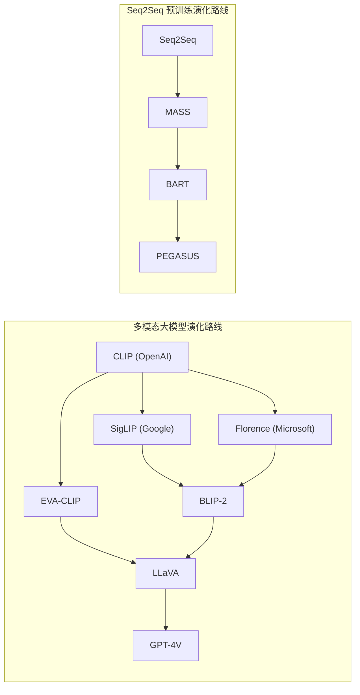
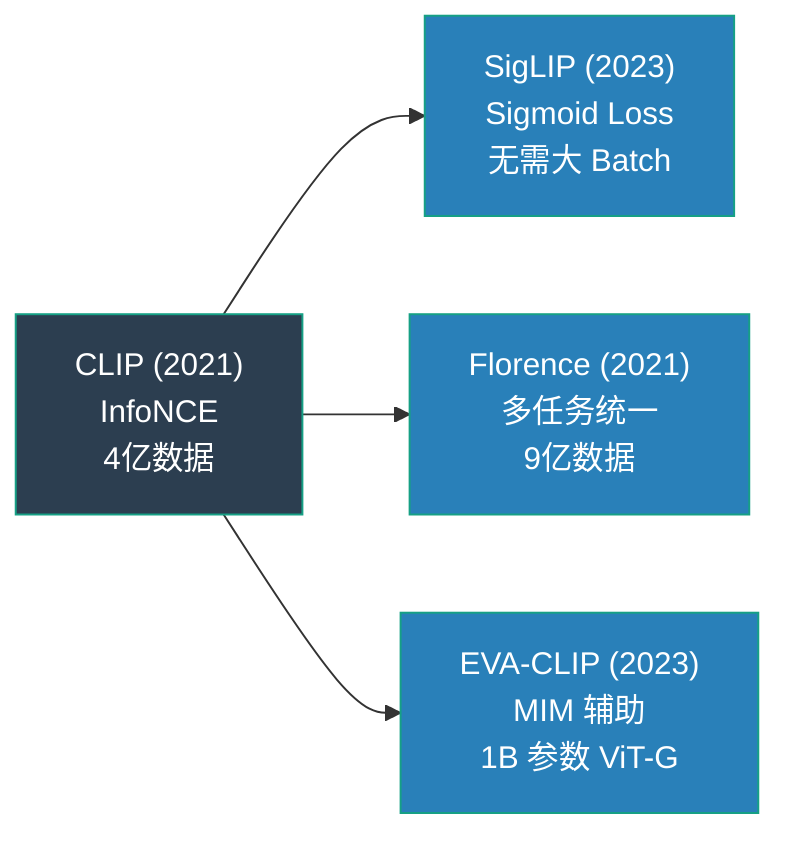
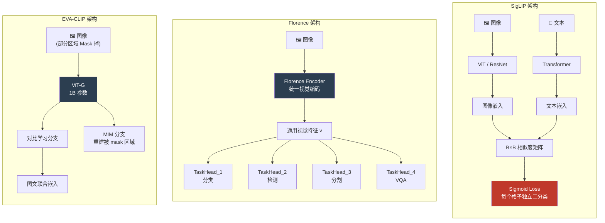

# CLIP Variants (CLIP 变体家族：SigLIP / Florence / EVA-CLIP)

## 知识地图



## 前置知识

- **CLIP 核心原理**: InfoNCE Loss、双塔架构、对比学习的目标——图文嵌入空间对齐
- **Softmax 与交叉熵**: 理解为什么 Softmax 在大 Batch 下才能提供足够的负样本多样性
- **Sigmoid 与二分类损失**: 理解将多分类问题转化为多个独立二分类问题的思想
- **Vision Transformer (ViT)**: 不同规模 ViT (ViT-B, ViT-L, ViT-G) 的参数量和表达能力差异
- **Masked Image Modeling (MIM)**: 类似 BERT 的 MLM，将图像部分区域遮挡后让模型重建
- **多任务学习**: 一个模型同时执行分类、检测、分割等多个任务的架构设计

## 模型演化路线



| 代际 | 模型 | 核心创新 | Batch Size 需求 |
|------|------|----------|-----------------|
| 第一代 | CLIP | InfoNCE 对比学习 | 极大 (32768) |
| 第二代 | SigLIP | Sigmoid 替代 Softmax | 极小 (256 即可) |
| 第二代 | Florence | 统一视觉架构 + Dynamic Head | 中等 |
| 第二代 | EVA-CLIP | MIM 辅助 + 1B 参数 ViT-G | 极大 |

## 为什么会出现 (Why)

原生的 CLIP 虽然强大，但有三个致命弱点：(1) **训练成本极高**——InfoNCE Loss 必须在极大 Batch Size（32768）下才能奏效，需要成百上千张 GPU；(2) **任务单一**——只能做分类和检索，无法扩展到目标检测、图像分割等其他视觉任务；(3) **性能瓶颈**——许多人认为对比学习的上限已到，继续扩大规模是否有益存疑。后续变体分别针对这三个痛点给出了解决方案。

## 解决什么问题 (Problem)

1. **SigLIP**: 打破 CLIP 对大 Batch Size 的依赖，用极少算力（几张消费级显卡）就能训练出更强的模型
2. **Florence**: 将 CLIP 的对比学习范式从单一分类任务扩展到全视觉任务的统一基础模型
3. **EVA-CLIP**: 探索 CLIP 的 Scaling Law 上限——更大模型、更多数据、更久训练能否持续提升性能

## 核心思想 (Core Idea)

CLIP 变体通过改进损失函数（SigLIP）、扩展任务范式（Florence）或引入辅助预训练任务（EVA-CLIP），在降低训练成本的同时大幅提升了视觉-语言表示的泛化能力。

## 模型结构图



## 数学模型/公式

### 1. SigLIP — Sigmoid Loss 对 Softmax 的降维打击

**原生 CLIP 的痛点 (Softmax 归一化)**：
原版 CLIP 在计算时，会把一张图片和 Batch 里的**所有**文本进行比较。它必须确保正确的配对得分高，并且**其他所有配对的得分之和被压低**。

$$\mathcal{L}_{CLIP} = -\frac{1}{B} \sum_i \log \frac{\exp(\tau \cdot x_i^T y_i)}{\sum_j \exp(\tau \cdot x_i^T y_j)}$$

**通俗解释：** 这就好比一次"多项选择题"——分母里包含了所有干扰项的总和。如果 Batch 太小（比如只有 4 对数据），干扰项就只有 3 个，模型几乎学不到什么。只有干扰项足够多（32768），模型才被迫学习好的特征。

**SigLIP 的神来之笔 (独立 Sigmoid 分类)**：
SigLIP 抛弃了全局比较，它把矩阵里的每一个格子（图文对）拆开，当成一个**独立的二分类判断题（是 / 否）**：是正样本就让 Sigmoid 尽量输出 1，负样本就输出 0。

$$\mathcal{L}_{SigLIP} = -\frac{1}{B^2} \sum_{i,j} \log \sigma(z_{ij} \cdot \tau \cdot (x_i^T y_j + b))$$

其中 $z_{ij} = 1$（如果是正样本），否则 $z_{ij} = -1$。

**通俗解释：** SigLIP 把"全班排名赛"变成了"一对一相亲"。每个图文对独立答题：正样本要输出 1，负样本要输出 0。不需要一次看几万对，只要正负样本都有（每对都有一个正样本和 $B^2-1$ 个负样本），模型就能学好。偏置项 $b$ 通常学出负数，它相当于一个"默认门槛"——因为绝大多数配对本来就是负样本，模型开始时就会倾向于输出低分。

### 2. Florence — 统一视觉表示的基础设施

传统的视觉任务，检测是检测的架构（YOLO/Faster R-CNN），分割是分割的架构（Mask R-CNN）。
Florence 的野心是构建**统一的视觉大模型（Foundation Model）**。它引入了**动态头（Dynamic Head）**：

$$\mathbf{v} = \text{FlorenceEncoder}(x), \quad y_{task} = \text{TaskHead}_{task}(\mathbf{v})$$

**通俗解释：** Florence 就像一个"全能运动员"。它的 Encoder 是一个通用的视觉理解引擎，不管你要做分类、检测、分割还是问答，都从这个通用引擎提取相同的特征 $v$，然后各自接一个轻量的"任务头"即可。这样，通过一个统一的预训练基础模型，就能取代过去每个任务都单独设计的架构。

### 3. EVA-CLIP — 暴力的缩放策略 (Scaling Law)

EVA 探索了开源 CLIP 的天花板：

* **EVA-01**：强行训出了 1B（10亿）参数的 ViT-G（比原版最大的 ViT-L 还要大近 10 倍）。
* **EVA-02**：不光用对比学习，还在训练时把图片遮住一块，让模型去猜（MIM, Masked Image Modeling）。

**通俗解释：** EVA 相当于 CLIP 的"极限运动版"。MIM（遮蔽图像建模）是一个辅助训练任务：把图片的一部分随机遮住，让模型猜测被遮住的内容。这个任务强迫模型理解图像的局部细节和上下文关系，而不仅仅是全局语义。实验证明，这种"对比学习 + 图像重建"的组合拳能进一步提升特征质量。

## 可视化展示

### SigLIP vs CLIP 损失计算流对比

```mermaid
graph TD
    subgraph sg1 [原生 CLIP (InfoNCE / Softmax)]
        C1[输入: Batch 内 B 张图 和 B 段文] --> C2[计算 B×B 的全矩阵点积]
        C2 --> C3{Softmax 归一化操作<br>每行/列的分数必须相加为1}
        C3 --> C4[只对对角线上的正确答案求 -log]
        C4 -.-> C5[痛点: 高度依赖巨型 Batch 寻找困难负样本]
    end

    subgraph sg2 [SigLIP (Sigmoid)]
        S1[输入: Batch 内 B 张图 和 B 段文] --> S2[计算 B×B 的全矩阵点积 + 偏置项 b]
        S2 --> S3{完全拆解矩阵<br>变成 B² 个独立的二分类任务}
        S3 --> S4[对角线正样本逼近 1<br>其余所有负样本逼近 0]
        S4 -.-> S5[优势: 彻底摆脱对超大 Batch 的依赖]
    end

    C5 ~~~ S1
```

### 核心变体性能指标横评 (ImageNet Zero-Shot Top-1)

*注：Zero-Shot (零样本) 指标最能反映模型提取通用特征的能力。原生 CLIP 苦苦挣扎的准确率，被后来的变体轻松拉高了近 20 个百分点。*

| 模型变体名称 | 核心特征 / 模型规模 | Zero-Shot 准确率 (%) | 评价 |
| --- | --- | --- | --- |
| **CLIP (ViT-B)** | 经典基线 Baseline | 68.3 | 时代的开拓者，但目前看来性能偏弱 |
| **CLIP (ViT-L)** | OpenAI 提供的最大开源版本 | 75.5 | 曾经的标杆，被广泛用于各种下游任务 |
| **SigLIP (ViT-L)** | **无需大 Batch，Sigmoid 魔法** | 80.5 | **同等体量下性价比之王**，完全超越原版 |
| **EVA-CLIP (ViT-G)** | 10亿参数巨兽 + 遮蔽建模 | 82.0 | 证明了模型越大越香，视觉大模型的尽头还没到 |
| **Florence-2** | 微软多任务统一底座 | **85.8** | 不仅分类准，检测、分割等任务样样精通 |

## 最小可运行代码

这几十行代码，蕴含了谷歌研究员极其惊艳的思想：把复杂的 Softmax 替换为极简的二元交叉熵。

### SigLIP Loss 核心逻辑

```python
import torch
import torch.nn.functional as F

def siglip_loss(img_emb, text_emb, temperature=10.0, bias=-10.0):
    """
    img_emb:  [B, D] — 图像编码 (必须已过 L2 归一化)
    text_emb: [B, D] — 文本编码 (必须已过 L2 归一化)
    """
    B = img_emb.shape[0]

    # 1. 计算 B x B 的点积矩阵，并乘上温度系数、加上偏置项
    # 注意：这里的 bias 通常初始化为一个负数 (如 -10)，
    # 因为绝大多数配对都是负样本，加上负偏置能天然抑制初始阶段的错误激活
    logits = temperature * (img_emb @ text_emb.T + bias)  # [B, B]

    # 2. 构造 B x B 的标签矩阵
    # 巧妙的数学转化：对角线正样本为 1，其余所有负样本为 -1
    labels = 2 * torch.eye(B, device=img_emb.device) - 1  # [B, B]

    # 3. 计算极简的 Sigmoid Loss: -log σ(标签 · logits)
    # 无论是正样本还是负样本，这里都化简成了一行代码
    loss = -F.logsigmoid(labels * logits)
    
    # 返回平均损失
    return loss.mean()
```

### SigLIP 简易前向传播框架

```python
import torch.nn as nn

class SigLIPModel(nn.Module):
    def __init__(self, image_encoder, text_encoder, dim=768):
        super().__init__()
        self.img_enc = image_encoder
        self.txt_enc = text_encoder
        
        # SigLIP 特有的可学习参数
        self.temperature = nn.Parameter(torch.ones(1) * 10.0)
        self.bias = nn.Parameter(torch.zeros(1))

    def forward(self, images, texts):
        # 提取特征并严格进行 L2 归一化，把它们映射到超球面上
        img_emb = F.normalize(self.img_enc(images), dim=-1)
        txt_emb = F.normalize(self.txt_enc(texts), dim=-1)
        
        # 调用上方写好的 SigLIP Loss
        return siglip_loss(img_emb, txt_emb, self.temperature, self.bias)
```

## 工业界应用

| 应用场景 | 代表产品/模型 | 使用哪个变体 |
|----------|-------------|------------|
| **多模态 LLM 视觉编码** | PaLI (Google), Gemini | SigLIP ViT-SO400M |
| **多任务视觉平台** | Azure Cognitive Services | Florence-2 |
| **开源多模态对话** | LLaVA-1.6, InternVL | EVA-CLIP ViT-G |
| **图文检索系统** | Google Images, 电商搜索 | SigLIP |
| **医学影像分析** | BiomedCLIP | SigLIP fine-tune |
| **卫星遥感识别** | RemoteCLIP | EVA-CLIP 架构 |

## 对比表格

### SigLIP vs CLIP 核心差异

| 维度 | CLIP | SigLIP |
|------|------|--------|
| 损失函数 | InfoNCE (Softmax) | Sigmoid Loss (二分类) |
| Batch Size 依赖 | 极大 (32768) | 极小 (256 即可) |
| 计算复杂度 | $O(B^2)$ Softmax | $O(B^2)$ Sigmoid |
| 可学习参数 | $\tau$ (温度) | $\tau$ + $b$ (温度 + 偏置) |
| 训练稳定性 | 小 Batch 震荡严重 | 小 Batch 依然稳定 |
| Zero-Shot (ViT-L) | 75.5% | **80.5%** |

### Florence vs EVA-CLIP 设计理念对比

| 维度 | Florence | EVA-CLIP |
|------|----------|----------|
| 核心目标 | 视觉任务大一统 | 视觉表征精度极限 |
| 创新方法 | 多任务 Dynamic Head | MIM 辅助 + 1B ViT-G |
| 适用场景 | 分类 + 检测 + 分割 + VQA | 视觉编码（作为多模态 LLM 的眼睛） |
| 上游数据 | 9亿图文对 (FLD-900M) | 大规模图文对 + MIM |
| 下游适配 | 轻量 TaskHead | 冻结或微调作为 Encoder |

## 学完后建议继续学习

1. **BLIP-2 / LLaVA** — 理解 SigLIP/EVA-CLIP 的视觉编码器如何接入大语言模型
2. **InternVL / Qwen-VL** — 了解最新多模态大模型中的视觉编码器选择
3. **DINOv2** — 另一种视觉自监督范式的代表（ViT + 自蒸馏）
4. **MAE (Masked Autoencoders)** — MIM 范式的经典代表，理解与 EVA-CLIP 的异同

## 高频面试题

### Q1: SigLIP 为什么能摆脱对大 Batch Size 的依赖？

**标准答案：** CLIP 的 InfoNCE Loss 使用 Softmax 归一化，分母包含整个 Batch 所有负样本的相似度之和。小 Batch 时负样本少，梯度信号弱，模型容易走捷径。SigLIP 将 Softmax 替换为 Sigmoid，把整个矩阵的 $B^2$ 个格子独立处理为二分类：正样本（对角线）输出 1，负样本（其余）输出 0。由于每个格子独立计算梯度，不需要在分母做全局比较，所以即使 Batch Size 很小（如 256），也能获得足够多的负样本梯度信号（256x256=65536 个独立决策）。

### Q2: SigLIP 中的偏置项 b 有什么作用？为什么初始化为负数？

**标准答案：** 偏置项 $b$ 为每个格子的 Logit 提供一个基准偏移。由于 $B \times B$ 矩阵中绝大多数格子是负样本（对角线只有 $B$ 个正样本，但有 $B^2 - B$ 个负样本），模型在训练初期会对所有配对给出相似的分数。将 $b$ 初始化为负数（如 -10），意味着模型一开始就倾向于输出负值，通过 Sigmoid 后接近 0（即负样本的默认预测），这符合数据分布的先验。训练过程中 $b$ 作为可学习参数自动调整。

### Q3: Florence 的 Dynamic Head 是如何实现多任务统一的？

**标准答案：** Florence 的 Dynamic Head 是一种注意力机制，它根据不同的任务类型动态调整对视觉特征的关注区域。共享的 FlorenceEncoder 提取通用视觉特征 $v$，然后每个任务有独立的 TaskHead。TaskHead 通过 cross-attention 从 $v$ 中提取任务相关的信息——分类任务关注全局语义，检测任务关注物体边界，分割任务关注像素级密度。预训练使用了 9 亿图文对，使得编码器学会足够通用的表示来支持所有下游任务。

### Q4: EVA-CLIP 中的 MIM (Masked Image Modeling) 辅助任务为什么有效？

**标准答案：** MIM 是 EVA-02 引入的辅助预训练任务，在对比学习的同时随机遮挡图像的一部分 Patch，让模型预测被遮住的内容。传统对比学习侧重于全局语义（"这是什么"），但局部结构理解较弱。MIM 强迫模型关注被遮区域的上下文和局部细节，使得 ViT 既理解"整体是什么"（对比学习），也理解"局部有什么"（MIM）。两者结合产生的特征在所有下游任务中都比单纯对比学习更强。

### Q5: 如果只有单张 A100 (80GB) GPU，应该选择哪个 CLIP 变体进行训练？为什么？

**标准答案：** 应该选择 **SigLIP**。原因：(1) SigLIP 不依赖大 Batch Size，256 的 Batch 在单张 A100 上完全可行；(2) EVA-CLIP 需要 1B 参数 ViT-G + 32768 的 Batch Size，单卡内存远不够；(3) Florence 需要 9 亿数据量和多任务训练管线，资源开销大；(4) SigLIP 在 ViT-B/L 规模下即可超越同体量 CLIP，且代码极简（只需替换 Loss 函数），对单卡训练最友好。
