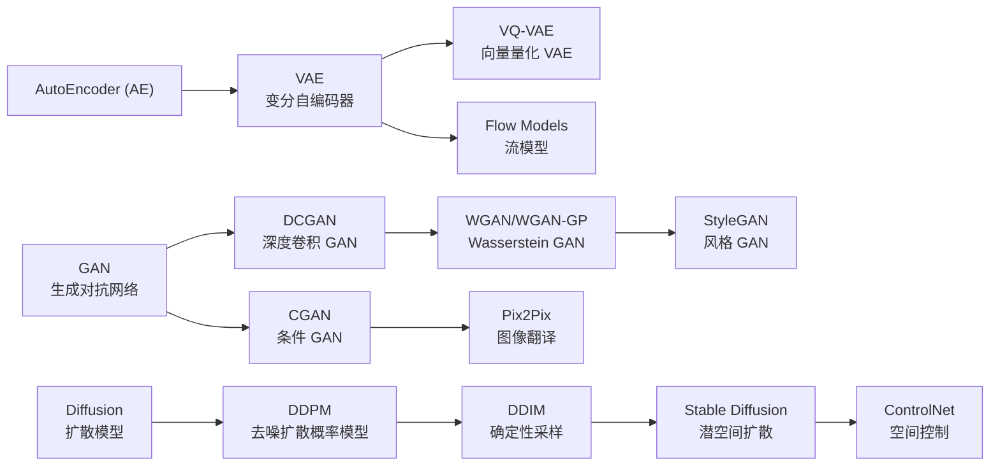
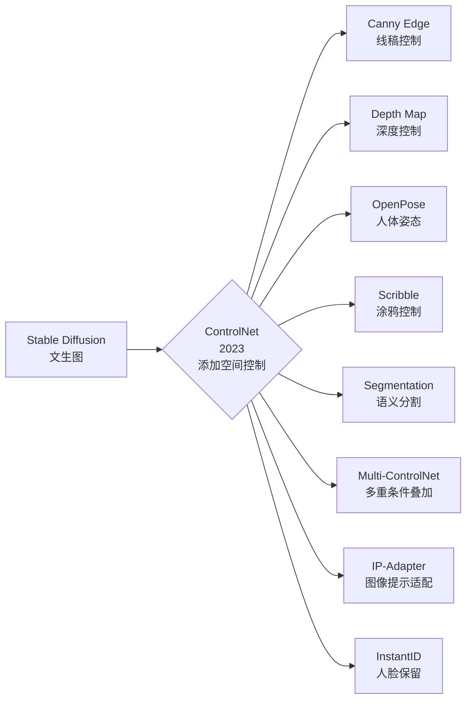
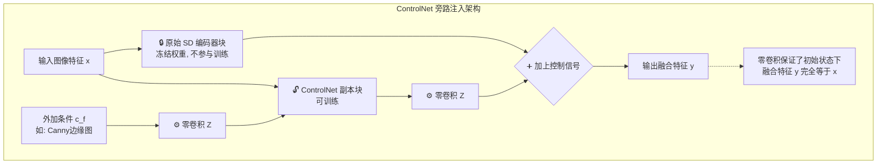
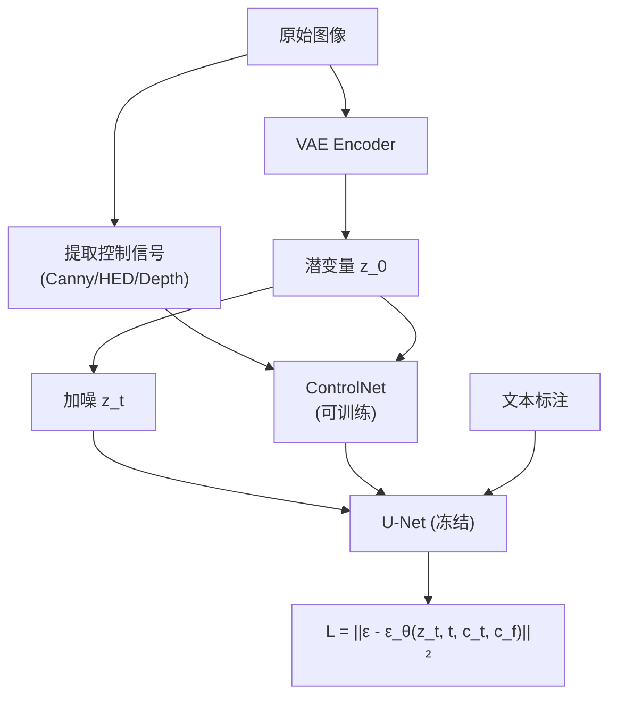

# ControlNet (AI 绘画的空间控制大师)

## 知识地图



## 前置知识

- **Stable Diffusion (LDM)**：VAE 潜空间 + U-Net 去噪 + Cross-Attention 文本注入的完整管道。
- **扩散模型训练**：$L = \mathbb{E}[\|\epsilon - \epsilon_\theta(z_t, t, c_t)\|^2]$，预测噪声。
- **U-Net 架构**：下采样 → 瓶颈 → 上采样（带 skip connection），ControlNet 复制了 U-Net 的编码器部分。
- **零初始化 (Zero-Initialization)**：将新增层的权重和偏置初始化为零，确保新增部分对原模型没有任何初始干扰。
- **空间条件 (Spatial Condition)**：与文本条件不同，空间条件有精确的像素级对应关系（如边缘图、深度图）。

## 模型演化路线



| Model | Year | Key Innovation | Solved Problem |
|-------|------|----------------|----------------|
| Stable Diffusion | 2022 | 潜空间扩散 + 文生图 | 高效的文生图 |
| ControlNet | 2023 | 零卷积 + 冻结原模型副本 | 文本提示无法精确控制空间布局 |
| Multi-ControlNet | 2023 | 多重条件信号相加融合 | 单一条件不足以精确指定所有需求 |
| T2I-Adapter | 2023 | 轻量级条件适配器 | ControlNet 参数量偏大 |
| IP-Adapter | 2023 | 图像作为 prompt 条件 | 无法用参考图引导风格/内容 |

## 为什么会出现 (Why)

在 ControlNet 诞生之前，使用 Stable Diffusion 画图就像是在"开盲盒"。你只能用文字描述（Prompt）来许愿，比如输入"一个跳舞的女孩"，出来的图可能是站着的、坐着的、面向左的、面向右的。**你很难精确控制画面的构图和人物的姿态。**

文本 prompt 本质上是全局语义描述，缺乏像素级的空间对应关系。你无法通过文字告诉模型："这棵树放在画面的左上角，高度占 1/3"。

**ControlNet 彻底改变了这个局面，它为文生图模型加上了"线框和骨架"的物理控制。** 比喻：如果把原始的 SD 大模型比作一个极具想象力但喜欢自由发挥的**顶级画师**，ControlNet 就像是一个**透写台（描图纸）**。你可以放上一张线稿、一张火柴人骨架图、或者一张黑白景深图，画师不仅听你的文字要求，还必须严格**沿着透写台上的轮廓和姿势去上色和描绘细节**。

## 解决什么问题 (Problem)

Stable Diffusion 只能通过文本 prompt 控制生成内容，缺乏**精确的空间控制**。ControlNet 让用户可以通过以下方式精确控制生成结果：

- **边缘图 (Canny Edge)**：指定物体轮廓和线条
- **深度图 (Depth Map)**：指定空间前后关系
- **人体姿态 (OpenPose)**：指定人物动作和肢体位置
- **语义分割 (Segmentation)**：指定每个区域的语义类别

本质上，ControlNet 将生成问题从"文本到图像"扩展为 **"文本 + 空间条件 → 图像"**。

## 核心思想 (Core Idea)

**"锁定原始大模型 + 复制一份可训练副本 + 零卷积连接"，在不破坏预训练能力的前提下，让模型学会将空间控制信号（线稿、骨架、深度图）平滑注入生成过程。**

---

## 核心架构机制解析

### 双副本设计与"零卷积 (Zero Convolution)"魔法

为了不破坏原始 SD 大模型花费几百万美元训练出来的顶级画画能力，ControlNet 采用了一种极其聪明的"旁路控制"策略。

1. **锁定原始大模型 (Frozen)**：坚决不修改原始 SD 模型的任何权重。
2. **复制一份副本 (Trainable Copy)**：把原始模型的"编码器"层原封不动地复制一份，作为专门处理控制信号（比如边缘图）的 ControlNet。
3. **零卷积连接 (Zero Convolution)**：在控制信号汇入主模型的地方，加入一个特殊的 $1 \times 1$ 卷积层，并把它的权重和偏置在初始时全部设为 0。

**数学上的精妙之处**：在训练的绝对初期，由于零卷积的存在，ControlNet 输出的信号全是 0。这意味着**网络等同于没有 ControlNet，表现和原始 SD 完全一样**。随着训练的进行，零卷积才慢慢"苏醒"，开始学习如何将额外的骨架/线稿信号平滑地注入到主干网络中，绝不引起训练早期的灾难性崩溃。

---

## 数学模型/公式

### 层融合公式

第 $l$ 层融合特征的输出：

$$\mathbf{y}_l = \mathcal{F}_l(\mathbf{x}) + \mathcal{Z}(\mathcal{F}'_l(\mathbf{x} + \mathcal{Z}(\mathbf{c}_f)))$$

**通俗解释：** 
- $\mathbf{y}_l$ 是第 $l$ 层最终输出——原 SD 特征 + ControlNet 控制信号的和。
- $\mathcal{F}_l(\mathbf{x})$ 是原始冻结的 SD 块输出——负责"正常看图"。
- $\mathcal{F}'_l(\mathbf{x} + \mathcal{Z}(\mathbf{c}_f))$ 是 ControlNet 副本的输出——它先接收"原图特征 + 零卷积处理过的控制信号 $\mathbf{c}_f$"（边缘图/深度图），产生一个修正信号。
- $\mathcal{Z}$ 是零卷积——训练初期输出全 0，让 ControlNet 从零开始"慢慢学"。

* $\mathcal{F}_l$：原始被锁死的 SD 编码器块（保持强大的基础生成能力）。
* $\mathcal{F}'_l$：ControlNet 可训练的副本块。
* $\mathbf{c}_f$：外加的控制条件（如边缘图、深度图）。
* $\mathcal{Z}$：零卷积操作（作为保护墙和融合器）。

### 训练目标

ControlNet 的训练目标依然是标准的扩散模型噪声预测损失，只是多加了一个条件信号 $c_f$：

$$L = \mathbb{E}_{z_0, t, c_t, c_f, \epsilon} \left[ \|\epsilon - \epsilon_\theta(z_t, t, c_t, c_f)\|^2 \right]$$

**通俗解释：** 和 SD 的训练损失几乎一样——预测噪声的 MSE。唯一的区别是多了一个输入 $c_f$（空间控制条件）。模型学到的是：给定"文本描述 $c_t$ + 空间草图 $c_f$"，如何预测当前步该去掉的噪声。

* $\epsilon$：真实的噪声。
* $\epsilon_\theta$：模型预测出的噪声。
* $c_t$：文本条件（Text Prompt）。
* $c_f$：ControlNet 的附加空间条件（Feature Condition）。

---

## 模型结构图

### ControlNet 旁路注入架构



### ControlNet 在 SD 管道中的位置

```mermaid
graph TD
    subgraph Input["输入"]
        TEXT["Prompt 文本"] --> CLIP["CLIP Text Encoder"]
        CONTROL["空间条件图像<br/>(Canny/Depth/Pose)"] --> CNET["ControlNet<br/>(可训练副本编码器)"]
    end

    subgraph Pipeline["SD 主流程"]
        NOISE["噪声 z_T"] --> UNET["U-Net 去噪<br/>(原 SD 权重冻结)"]
        CLIP -->|Cross-Attention (K,V)| UNET
        CNET -->|"零卷积注入"| UNET
        UNET --> Z0["去噪后 z_0"]
    end

    subgraph Output["输出"]
        Z0 --> VAE_DEC["VAE Decoder"]
        VAE_DEC --> IMAGE["生成图像"]
    end
```

### 训练时的数据流



---

## 可视化展示

### ControlNet vs 纯文本提示的生成效果对比

```echarts
return {
  tooltip: { trigger: "axis", confine: true },
  title: { top: 5,  text: 'ControlNet 效果: 文本遵循度 vs 布局控制力', left: 'center', textStyle: { fontSize: 12 } },
  radar: {
    indicator: [
      { name: '文本遵循度', max: 10 },
      { name: '空间控制力', max: 10 },
      { name: '姿态准确性', max: 10 },
      { name: '风格自由度', max: 10 },
      { name: '细节保留', max: 10 }
    ],
    center: ['50%', '55%'],
    radius: '65%'
  },
  legend: { data: ['纯 SD', 'SD + ControlNet'], bottom: 0 },
  series: [
    { name: 'ControlNet 对比', type: 'radar',
      data: [
        { value: [7, 2, 1, 10, 6], name: '纯 SD' },
        { value: [7, 9, 9, 8, 8], name: 'SD + ControlNet' }
      ]
    }
  ],
  grid: { left: 60, right: 20, top: 55, bottom: 55 }
}
```

纯 SD 在风格自由度上略有优势（不受约束），但在空间控制力、姿态准确性上远不如加载 ControlNet 后。

---

## 主流控制类型与应用大盘点

ControlNet 的强大之处在于它的"插件化"特性。你可以根据需要提取不同类型的控制信号。

| 插件名称 (控制类型) | 信号提取方式与视觉特征 | 核心控制内容与业务场景 |
| --- | --- | --- |
| **Canny Edge** | 经典的 Canny 算子，提取极度锐利的黑白线条 | **严格线稿控制**。完美保留原图复杂的轮廓细节。 |
| **HED / PIDI** | 神经网络提取，线条比 Canny 更柔和、粗细有致 | **艺术化线稿**。适合画风转换，给模型更多发挥空间。 |
| **Depth Map** | 用 MiDaS 等模型估算图像的黑白景深图 | **空间关系控制**。前后的远近关系（如：生成三维立体场景）。 |
| **Normal Map** | 提取物体表面的 3D 法线朝向（红蓝紫图） | **材质与光影**。非常适合石膏雕像、工业硬表面建模渲染。 |
| **OpenPose** | 提取人体骨骼节点（火柴人）、手部骨骼、面部表情 | **人物姿态控制**。让 AI 精确摆出你想要的动作，不再残疾。 |
| **Scribble** | 用户随手画的极简涂鸦（如几根歪七扭八的线条） | **自由创意发散**。随手画一个圈，AI 生成一个精致的苹果。 |
| **Segmentation** | 语义分割色块图（这块是天空，那块是建筑） | **区域内容指定**。精确规划画面中不同物体的占地面积。 |

---

## 进阶玩法：Multi-ControlNet (多重控制叠加)

如果单一条件不能满足需求，你可以像叠 Buff 一样叠加多个 ControlNet 插件。
*由于每个 ControlNet 的输出是与主干网络相加的，多个控制器的信号可以直接通过**相加**来融合。*

**经典叠加组合公式**：

> `OpenPose (精确控制人体动作)` + `Depth Map (控制人物在场景中的纵深位置)` + `Canny Edge (保留背景中的某栋建筑轮廓)` + `Prompt (文本：赛博朋克风格, 霓虹灯)`
> = 一张构图完美、姿势精准且风格切换自如的大片。

---

## 最小可运行代码

### ControlNet 推理 (Diffusers)

```python
import torch
from diffusers import StableDiffusionControlNetPipeline, ControlNetModel
from diffusers.utils import load_image

# 加载 ControlNet (如 Canny Edge 控制)
controlnet = ControlNetModel.from_pretrained(
    "lllyasviel/sd-controlnet-canny",
    torch_dtype=torch.float16
)

# 加载 SD 管道 + ControlNet
pipe = StableDiffusionControlNetPipeline.from_pretrained(
    "runwayml/stable-diffusion-v1-5",
    controlnet=controlnet,
    torch_dtype=torch.float16
).to("cuda")

# 加载或使用控制图像 (边缘图)
control_image = load_image("canny_edge.png")

# 生成
prompt = "a beautiful fantasy landscape, ultra detailed, trending on artstation"
image = pipe(
    prompt,
    image=control_image,       # 空间条件图像
    num_inference_steps=50,
    guidance_scale=7.5,
).images[0]

image.save("output.png")
```

### 零卷积实现 (PyTorch)

```python
import torch
import torch.nn as nn

class ZeroConv2d(nn.Module):
    """ControlNet 的零卷积层: 初始化为零, 训练时逐步学习"""
    def __init__(self, in_channels, out_channels):
        super().__init__()
        self.conv = nn.Conv2d(in_channels, out_channels, kernel_size=1, stride=1, padding=0)
        # 权重和偏置初始化为零
        nn.init.zeros_(self.conv.weight)
        nn.init.zeros_(self.conv.bias)

    def forward(self, x):
        return self.conv(x)


class ControlNetBlock(nn.Module):
    """ControlNet 的单个编码器块"""
    def __init__(self, sd_block, in_channels, out_channels):
        super().__init__()
        # sd_block 是预训练 SD 编码器块 (不参与训练)
        self.frozen_block = sd_block  # 🔒 冻结
        self.trainable_copy = copy_block(sd_block)  # 🔓 可训练副本

        # 两个零卷积: 一个在输入侧, 一个在输出侧
        self.zero_conv_input = ZeroConv2d(in_channels, in_channels)
        self.zero_conv_output = ZeroConv2d(out_channels, out_channels)

    def forward(self, x, control_signal):
        # 原始 SD 块输出 (冻结)
        frozen_out = self.frozen_block(x)

        # ControlNet 副本输出
        control_input = x + self.zero_conv_input(control_signal)
        trainable_out = self.trainable_copy(control_input)

        # 融合: y = 原输出 + 零卷积(副本输出)
        return frozen_out + self.zero_conv_output(trainable_out)
```

### Multi-ControlNet 推理 (Diffusers)

```python
from diffusers import StableDiffusionControlNetPipeline, ControlNetModel

# 加载多个 ControlNet
controlnet_canny = ControlNetModel.from_pretrained(
    "lllyasviel/sd-controlnet-canny", torch_dtype=torch.float16
)
controlnet_pose = ControlNetModel.from_pretrained(
    "lllyasviel/sd-controlnet-openpose", torch_dtype=torch.float16
)

# 创建管道 (传入多个 ControlNet)
pipe = StableDiffusionControlNetPipeline.from_pretrained(
    "runwayml/stable-diffusion-v1-5",
    controlnet=[controlnet_canny, controlnet_pose],
    torch_dtype=torch.float16
).to("cuda")

# 提供多个控制图像
image = pipe(
    prompt="a dancer in cyberpunk city",
    image=[canny_image, pose_image],   # Canny Edge + OpenPose
    num_inference_steps=50,
    guidance_scale=7.5,
).images[0]
```

---

## 工业界应用

| 应用领域 | 控制类型 | 为什么 | 知名产品/项目 |
|---------|---------|-------|-------------|
| 游戏概念设计 | Canny + Scribble | 线稿上色 + 快速迭代创意 | 独立游戏开发 |
| 建筑可视化 | Depth + Segmentation | 从白模/草图生成渲染图 | 建筑方案设计 |
| 人物姿势生成 | OpenPose | 精确控制角色动作 | 虚拟人、VTuber |
| 电商产品图 | Canny + Depth | 保留产品轮廓 + 换背景 | 电商平台 AI 工具 |
| 动画/漫画 | Canny + Scribble | 线稿自动上色 + 中间帧 | 动画制作辅助 |
| 室内设计 | Depth + Segmentation | 空间布局控制 + 风格渲染 | 室内设计工具 |
| 工业生产 | Canny + Normal | 3D 模型渲染为产品图 | 工业设计可视化 |

---

## 对比表格

### ControlNet vs 纯文本 Prompt vs 其他控制方法

| 特性 | 纯文本 Prompt | ControlNet | T2I-Adapter | IP-Adapter |
|------|-------------|-----------|-------------|------------|
| 空间控制力 | 极低 | 极高 | 高 | 低 |
| 文本遵循度 | 高 | 高 | 高 | 中 |
| 使用门槛 | 低 (文字即可) | 中 (需控制图) | 中 (需控制图) | 低 (一张参考图) |
| 控制精度 | 语义级 | 像素级 | 像素级 | 风格/内容级 |
| 参数量 | 0 (不加) | ~360M (可训练) | ~77M (可训练) | ~22M (可训练) |
| 是否修改原模型 | 否 | 否 (旁路) | 否 (旁路) | 否 (旁路) |
| 多重条件叠加 | N/A | 支持 (相加) | 支持 | 支持 |

### ControlNet 不同控制类型对比

| 控制类型 | 自由度 | 精确度 | 适用场景 |
|---------|--------|--------|---------|
| Canny Edge | 低 (严格约束) | 极高 | 精准线稿上色 |
| HED / PIDI | 中 | 高 | 艺术化风格转换 |
| Depth Map | 中 | 高 | 空间布局、3D 场景 |
| OpenPose | 中 | 极高 | 人物动作控制 |
| Scribble | 极高 | 低 | 自由创作、快速原型 |
| Segmentation | 低 | 极高 | 语义区域分配 |
| Normal Map | 低 | 极高 | 材质、光影控制 |

---

## 学完后建议继续学习

1. **T2I-Adapter** — 轻量级条件适配器，与 ControlNet 思路相似但参数更少，适合资源受限场景。
2. **IP-Adapter** — 用图像而非文本作为 prompt，实现"以图生图"的风格/内容控制。
3. **InstantID / PhotoMaker** — 在 ControlNet 思路上进一步，实现人脸保留 + 姿态控制。
4. **AnimateDiff** — 将 ControlNet 的控制能力扩展到视频生成，逐帧保持一致性。
5. **LayerDiffuse** — 透明图层生成的扩散模型扩展，理解扩散模型的可控生成新方向。

---

## 高频面试题

### Q1: ControlNet 的"零卷积"(Zero Convolution) 为什么重要？如果不用零初始化会怎样？

**标准答案：**
零卷积是 $1 \times 1$ 卷积，权重和偏置初始化为全零。其关键作用：**在训练初期，ControlNet 对原模型的影响绝对为零**。

如果不用零初始化（例如用随机初始化或 Xavier 初始化），训练初期 ControlNet 副本输出的随机噪声会直接注入到预训练的 SD 模型中，破坏 SD 已经学到的生成能力。这会导致：(1) 训练初期的生成结果急剧退化；(2) SD 的权重被噪声污染，需要大量迭代恢复；(3) 可能出现灾难性遗忘——SD 原有的"听懂文本"能力被覆盖。

零卷积让训练过程是**渐进的、安全的**：模型从"完全没有 ControlNet"慢慢过渡到"有 ControlNet 辅助"，绝不会在训练早期崩溃。

### Q2: ControlNet 为什么要冻结原始 SD 模型，而不是直接微调 (fine-tune)？

**标准答案：**
1. **保护预训练能力**：SD 模型是在数十亿图文对上训练的，其文生图能力是巨大的资产。直接微调容易导致灾难性遗忘——模型学会了 Canny 控制但忘了怎么理解文本。
2. **数据效率**：ControlNet 只需要百万级的数据即可训练（相比之下 SD 需要数十亿级）。冻结原模型让 ControlNet 只需要学习"如何将控制信号映射到 SD 已有的能力"而非重新学习生成。
3. **模块化和可插拔**：冻结策略使 ControlNet 成为"插件"——可以加载不同的 ControlNet 权重（Canny/Depth/OpenPose）到同一个 SD base model 上，灵活组合。
4. **训练稳定性**：冻结原模型让梯度只流过可训练的副本块，减少了优化的自由度，训练更稳定。

### Q3: Multi-ControlNet 如何融合多个控制信号？为什么可以简单相加？

**标准答案：**
Multi-ControlNet 的关键公式是：每个 ControlNet 独立处理自己的控制信号 $\mathbf{c}_{f_i}$，输出控制特征 $\mathbf{y}_{i}$，最终通过相加融合到主网络：

$$\mathbf{y} = \mathcal{F}(\mathbf{x}) + \sum_i \mathcal{Z}_i(\mathcal{F}'_i(\mathbf{x} + \mathcal{Z}_i^{\text{in}}(\mathbf{c}_{f_i})))$$

可以简单相加的原因是：每个 ControlNet 的训练是独立的——它们各自学会了从特定类型的控制信号（Canny/Depth/Pose）产生"修正"信号。这些修正信号都是与 SD 主特征同维的加法修正项，因此线性叠加在数学上成立。零卷积保证了每个 ControlNet 初始时输出为 0，多个 ControlNet 可以同时训练或独立训练后组合。

### Q4: ControlNet 的训练数据是如何准备的？需要什么样的标注？

**标准答案：**
ControlNet 的训练需要三元组：(原始图像, 文本描述, 控制信号图像)。

具体流程：
1. 收集大规模图文对（如 LAION 数据集）。
2. 对于每张图像，用相应的工具提取控制信号——例如用 Canny 算子提取边缘图、用 MiDaS 提取深度图、用 OpenPose 提取骨骼关键点。这是完全自动化的，不需要人工标注。
3. 将原始图像通过 VAE 编码器转为潜变量 $z_0$，加上噪声得到 $z_t$。
4. 训练 U-Net 预测噪声：$\|\epsilon - \epsilon_\theta(z_t, t, \text{text}, \text{control_image})\|^2$。

关键点：控制信号的提取是**自动化的预处理**，不需要人工标注。这使得训练成本可控——只需要原始图文对数据集即可。

### Q5: ControlNet 和 T2I-Adapter、IP-Adapter 的区别是什么？各适用于什么场景？

**标准答案：**
三者都是 SD 的"适配器"，不修改原模型，但目标和机制不同：

- **ControlNet**：复制 SD 编码器作为可训练副本，通过零卷积注入空间控制信号（边缘/深度/姿态）。参数最多（~360M），但控制力最强。适用于需要**精确像素级空间控制**的场景（如建筑设计、人物姿势生成）。
- **T2I-Adapter**：使用轻量级的条件编码器（几个卷积/残差块），不复制 SD 编码器。参数少（~77M），训练快，但控制力略弱于 ControlNet。适用于**资源受限**或**简单控制**的场景。
- **IP-Adapter**：将图像（而非文本）作为 prompt 条件，通过分离的 Cross-Attention 层注入到 U-Net 中。参数极少（~22M）。不控制空间布局，而是控制**风格/内容/角色**（如"以这张图的风格画一只猫"）。适用于**以图生图**和**角色一致性**场景。
