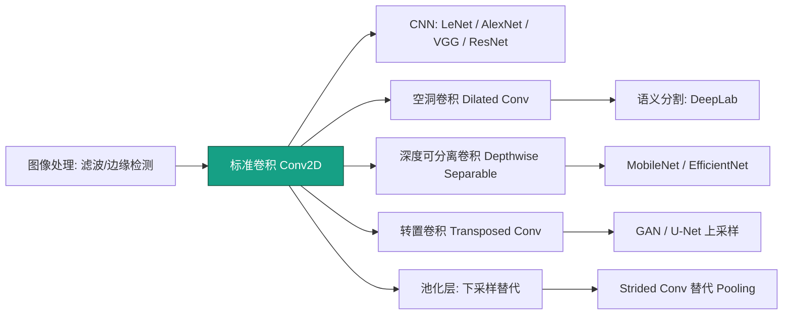
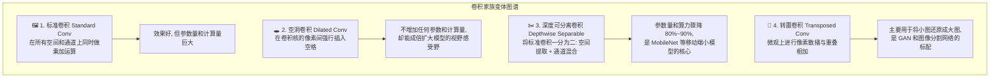
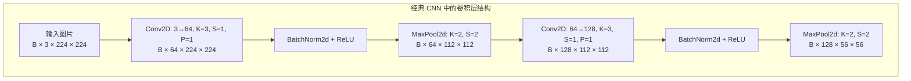

# Convolutional Layers (卷积层与它的变体家族)

## 知识地图



## 前置知识

- 全连接层（Dense Layer）及其参数量问题
- 图像的基本概念（像素、通道 RGB、宽高）
- 矩阵点积运算
- 感受野 / 局部性的直观理解（相邻像素相关性高）

## 为什么会出现 (Why)

在处理图像等二维数据时，如果用传统的多层感知机（全连接层），参数量会瞬间爆炸，且完全破坏了图像的二维空间结构。例如一张 224×224×3 的图片，输入向量长达 15 万维，连接到同样大小的隐藏层需要 225 亿参数——不可行。同时，图像中"猫的耳朵在左上角"和"猫的耳朵在右下角"应该被同一组权重检测到（平移等变性），但全连接层无法天然做到这一点。

## 解决什么问题 (Problem)

卷积层（Convolutional Layer）通过**局部连接**和**权值共享**，在保留二维空间结构的前提下，将参数量降低多个数量级，成为现代计算机视觉（CNN）的绝对基石。

**比喻：** 想象你要在一张清明上河图（输入图片）里找所有的"马"。全连接层：雇几十万个人，每个人死死盯着画面的固定一个像素，然后汇总报告——极度浪费资源。卷积层：你手里拿着一个特定花纹的"放大镜"（卷积核 Filter），这个花纹专门对"马"起反应。你只需要拿着这个放大镜，从左到右、从上到下扫遍全图（这叫滑动窗口 / 局部连接）。而且不管扫到画的哪个角落，你手里的放大镜始终是同一个（这叫权值共享）。这不仅保住了图像的空间结构，还将参数量压缩了千万倍！

## 核心思想 (Core Idea)

通过一个小尺寸的可学习"放大镜"（卷积核）在输入特征图上滑动，用同一组权重检测任意位置的局部模式——**局部连接 + 权值共享 = 平移等变性 + 参数高效**。

---

## 数学模型/公式

### 2D 标准卷积计算公式

假设我们有一个卷积核 $w$，在输入特征图 $x$ 上滑动，输出特征图 $y$ 在 $(i, j)$ 位置的值，就是输入局部区域与卷积核的点积（加权求和），最后加上偏置 $b$：

$$
y_{i,j} = \sum_{u=0}^{k_h-1} \sum_{v=0}^{k_w-1} \sum_{c=0}^{C_{in}-1} x_{i+u, j+v, c} \cdot w_{u, v, c} + b
$$

**通俗解释：** 把卷积核想象成一个模板（比如检测"横边"的模板 `[-1, 0, 1]`），你在图片的每个位置做一次"模板匹配"——把模板盖上去，对应位置相乘再求和，得到一个分数。分数高说明这个位置和模板很像（有横边），分数低则不像。偏置 b 相当于"及格线"，分数加 b 后才算最终输出。

### 卷积的四大核心旋钮 (Hyper-parameters)

| 参数名称 | 数学符号 | 大白话解释 | 实际作用 |
|----------|---------|-----------|---------|
| Kernel Size (卷积核尺寸) | $K$ | 放大镜的口径大小（通常是 3x3 或 5x5） | 决定每次能看多大范围的局部细节 |
| Stride (步长) | $S$ | 放大镜每次移动跳过几个格子 | $S>1$ 时，具有**降采样（缩小图像）**的功能 |
| Padding (填充) | $P$ | 在原图外面补几圈 0 | 保护边缘信息不丢失，同时控制输出尺寸 |
| Dilation (膨胀率) | $D$ | 放大镜内部网眼之间的间距 | 扩大视野范围（感受野），常用于图像分割 |

### 输出尺寸 (Output Size) 公式

当你搭建网络报错 size mismatch 时，掏出这个公式算一下即可（高和宽同理）：

$$
H_{out} = \left\lfloor \frac{H_{in} + 2P - D \cdot (K-1) - 1}{S} + 1 \right\rfloor
$$

**通俗解释：** 这个公式回答了一个问题——"我拿一个尺寸为 K 的放大镜、一步跨 S 格、在周围垫了 P 圈零的图片上滑动，最后能留下多少个看过的位置？"分子 = 输入宽度 + 两边填充 - 放大镜有效宽度 - 1，除以步长取整后 + 1。

### 深度可分离卷积的压缩比

$$
\text{Params Ratio} = \frac{1}{C_{out}} + \frac{1}{K^2}
$$

(如果用 3x3 卷积，计算量直接变成原来的约九分之一！)

**通俗解释：** 标准卷积是"一边看人、一边看衣服颜色"——空间信息和通道信息同时处理。深度可分离卷积拆成两步：先找形状（Depthwise，每个通道自己看），再调色（Pointwise 1x1 做通道混合）。参数从 $K^2 \cdot C_{in} \cdot C_{out}$ 降到 $K^2 \cdot C_{in} + C_{in} \cdot C_{out}$，大约压缩到原来的 1/9（以 3x3 为例）。

### 感受野 (Receptive Field) 递归公式

大白话："模型眼中的世界有多大"。深层网络的一个神经元，虽然它的卷积核只有 3x3，但因为它看到了上一层的特征，上一层又看了上上一层，层层叠加后，这个深层神经元实际上可能在审视原图上 100x100 的巨大区域。

第 $l$ 层的感受野计算公式（递归向后推导）：

$$
RF_l = RF_{l-1} + (K_l - 1) \times \prod_{i=1}^{l-1} S_i
$$

**通俗解释：** 你的感受野 = 上一层的感受野 + 本层新增的"视野扩展"。每多一层，你就多看到一点。如果中间有 Stride=2 的下采样，后续层扩展的视野会被放大（乘以之前所有 stride 的乘积）——所以越深层的神经元能看到的原图范围越大。

---

## 可视化展示

### 卷积滑窗操作示意

```mermaid
%%{init: {'flowchart': {'nodeSpacing': 25, 'rankSpacing': 45}}}%%
flowchart TD
    subgraph input["输入特征图 5×5"]
        direction LR
        a1[a]; a2[b]; a3[c]; a4[d]; a5[e]
        b1[f]; b2[g]; b3[h]; b4[i]; b5[j]
        c1[k]; c2[l]; c3[m]; c4[n]; c5[o]
        d1[p]; d2[q]; d3[r]; d4[s]; d5[t]
        e1[u]; e2[v]; e3[w]; e4[x]; e5[y]
    end
    subgraph kernel["卷积核 3×3"]
        k11[w₁]; k12[w₂]; k13[w₃]
        k21[w₄]; k22[w₅]; k23[w₆]
        k31[w₇]; k32[w₈]; k33[w₉]
    end
    subgraph output["输出特征图 3×3<br/>(padding=0, stride=1)"]
        o11[y₁₁]; o12[y₁₂]; o13[y₁₃]
        o21[y₂₁]; o22[y₂₂]; o23[y₂₃]
        o31[y₃₁]; o32[y₃₂]; o33[y₃₃]
    end
    input --> |"滑动窗口点积"| kernel --> output
```



### 主流卷积变体家族



---

## 模型结构图



---

## 最小可运行代码

在 PyTorch 中，这四种卷积都已经被高度封装，只需调整参数即可无缝切换：

```python
import torch
import torch.nn as nn

# 1. 标准卷积 (提取基础特征)
# 输入 3 通道 (RGB)，输出 64 种特征图，3x3 的放大镜
conv_std = nn.Conv2d(in_channels=3, out_channels=64,
                     kernel_size=3, stride=1, padding=1)

# 2. 深度可分离卷积 (移动端省算力必备)
# 秘诀在于 groups = in_channels (每个通道独立卷积)
depthwise = nn.Conv2d(in_channels=64, out_channels=64,
                      kernel_size=3, padding=1, groups=64)
# 接上一个 1x1 卷积做特征融合
pointwise = nn.Conv2d(in_channels=64, out_channels=128, kernel_size=1)

# 3. 转置卷积 (图像放大/上采样)
# 将尺寸放大 2 倍 (stride=2 带来的反向扩张)
deconv = nn.ConvTranspose2d(in_channels=64, out_channels=32,
                            kernel_size=4, stride=2, padding=1)

# 4. 空洞卷积 (扩大感受野)
# 关键参数: dilation=2 (同时 padding 也需相应放大以对齐尺寸)
dilated = nn.Conv2d(in_channels=64, out_channels=64,
                    kernel_size=3, padding=2, dilation=2)

# 可运行测试
if __name__ == "__main__":
    x = torch.randn(1, 3, 224, 224)          # 模拟一张 224×224 RGB 图片
    y1 = conv_std(x)                          # [1, 64, 224, 224]
    y2 = deconv(torch.randn(1, 64, 7, 7))    # [1, 32, 14, 14]  上采样 2x
    y3 = dilated(torch.randn(1, 64, 32, 32)) # [1, 64, 32, 32]  不降尺寸扩大感受野
    print(f"Standard Conv: {x.shape} → {y1.shape}")
    print(f"Transposed Conv: [1,64,7,7] → {y2.shape}")
    print(f"Dilated Conv: [1,64,32,32] → {y3.shape}")
```

---

## 工业界应用

| 应用领域 | 具体场景 | 为什么使用卷积 |
|----------|----------|---------------|
| 图像分类 | ResNet / EfficientNet / ViT 混合架构 | 提取层次化视觉特征（边缘→纹理→物体部件→完整物体） |
| 目标检测 | YOLO / Faster R-CNN | 在空间维度定位物体，同时提取分类特征 |
| 语义分割 | U-Net / DeepLab | 用空洞卷积扩大感受野，逐像素分类 |
| 移动端视觉 | MobileNet / ShuffleNet | 深度可分离卷积节省 90% 算力 |
| 图像生成 | GAN / VAE | 转置卷积做上采样，从隐向量生成高分辨率图像 |
| 医学影像 | MRI/CT 病灶检测 | 3D 卷积处理体积数据 |
| 语音处理 | 声学特征提取 | 1D 卷积在时间轴上提取局部模式 |
| 视频理解 | 3D ResNet | 时空卷积同时建模空间和时间维度 |

---

## 对比表格

| 卷积变体 | 参数量级 | 感受野 | 计算量 | 典型使用场景 |
|----------|---------|--------|--------|-------------|
| 标准卷积 (3×3) | $9 \cdot C_{in} \cdot C_{out}$ | 逐层线性增长 | 高 | 通用特征提取 |
| 空洞卷积 (Dilation=2) | $9 \cdot C_{in} \cdot C_{out}$（同标准） | 指数级增长 | 同标准 | 语义分割、密集预测 |
| 深度可分离 | $9 \cdot C_{in} + C_{in} \cdot C_{out}$ | 同标准 | 约 1/9 标准 | 移动端、边缘设备 |
| 转置卷积 | $K^2 \cdot C_{in} \cdot C_{out}$ | N/A（上采样） | 高 | 图像生成、分割恢复 |
| 1×1 卷积 | $C_{in} \cdot C_{out}$ | 1 像素 | 低 | 通道降维/升维、特征融合 |

### 空洞卷积示意图

标准卷积 (Dilation=1): `[a][b][c]`
空洞卷积 (Dilation=2): `[a] _ [b] _ [c]`

---

## 学完后建议继续学习

- [池化层 (Pooling)](./pooling-layer.md) —— 下采样与平移不变性
- [归一化方法 (BatchNorm)](./normalization.md) —— 加速 CNN 训练
- [Dropout 正则化](./dropout.md) —— 防止 CNN 过拟合
- [全连接层 (Dense Layer)](./dense-layer.md) —— CNN 分类头的基础
- [残差连接 (ResNet)](./resnet.md) —— 让深层 CNN 可训练的关键突破

---

## 高频面试题

**Q1: 为什么 3×3 卷积比 5×5 和 7×7 更受欢迎？**

标准答案：(1) 两个 3×3 堆叠的感受野 = 5×5，三个 3×3 = 7×7，但参数量更少——2 个 3×3 有 $2 \times 9 C^2 = 18C^2$ 参数，而一个 5×5 有 $25C^2$；(2) 更多非线性——每层 3×3 后接一个 ReLU，两个 3×3 有两次非线性，一个 5×5 只有一次；(3) 硬件优化——3×3 是 GPU 矩阵乘法（im2col + GEMM）最优化的小尺寸。VGG 论文最早系统论证了这一点。

**Q2: 空洞卷积 (Dilated Convolution) 解决了什么问题？有什么副作用？**

标准答案：在语义分割中，传统做法是用 Pooling 下采样扩大感受野，但分辨率丢失后上采样难以恢复细节。空洞卷积在不丢失空间分辨率的前提下成倍扩大感受野。副作用是"网格效应"(Gridding Effect)——空洞过大时，卷积核的采样点过于稀疏，导致远距离像素之间的信息不连续，某些像素可能完全不被看到。解决方案：使用不同 dilation rate 的组合（如 dilation=[1,2,3]）或 ASPP（Atrous Spatial Pyramid Pooling）。

**Q3: 深度可分离卷积 (Depthwise Separable Convolution) 为什么能大幅减少计算量？**

标准答案：标准卷积同时处理空间和通道两个维度，计算量为 $K^2 \cdot C_{in} \cdot C_{out} \cdot H_{out} \cdot W_{out}$。深度可分离卷积拆成两步：Depthwise（空间）计算量 $K^2 \cdot C_{in} \cdot H_{out} \cdot W_{out}$，Pointwise（通道）计算量 $C_{in} \cdot C_{out} \cdot H_{out} \cdot W_{out}$。比值为 $(K^2 \cdot C_{out}) / (K^2 + C_{out})$。当 $K=3, C_{out}=64$ 时，比值约为 $9 \times 64 / (9 + 64) \approx 7.9$，即约 1/8 的计算量。实际 MobileNet 等模型中使用 stride 等技巧进一步压缩。

**Q4: 转置卷积的"棋盘效应"(Checkerboard Artifacts) 是什么？如何避免？**

标准答案：当转置卷积的 kernel_size 不能被 stride 整除时，上采样后的特征图会出现明暗交替的棋盘格状伪影。这是因为输出特征图中相邻像素接收到的"散播"次数不均衡——有些位置被覆盖多次（重叠相加），有些位置只被覆盖一次。解决方法：(1) 让 kernel_size 能被 stride 整除（如 stride=2, kernel=4）；(2) 改用 `nn.Upsample` + 标准卷积的组合（先插值放大，再卷积平滑）。

**Q5: groups 参数在 Conv2D 中是什么含义？groups=in_channels 代表什么？**

标准答案：`groups` 参数控制输入通道和输出通道之间的连接分组。默认 `groups=1` 是所有输入通道连接所有输出通道（标准卷积）。`groups=in_channels` 时，每个输入通道对应一个独立的卷积核（只处理该通道），输出通道数 = 输入通道数——这就是 Depthwise Convolution（深度卷积）。`groups` 为中间值时，通道被分为若干组，每组内部做标准卷积，组间无连接——这是 ResNeXt 等架构中使用的 Group Convolution。
