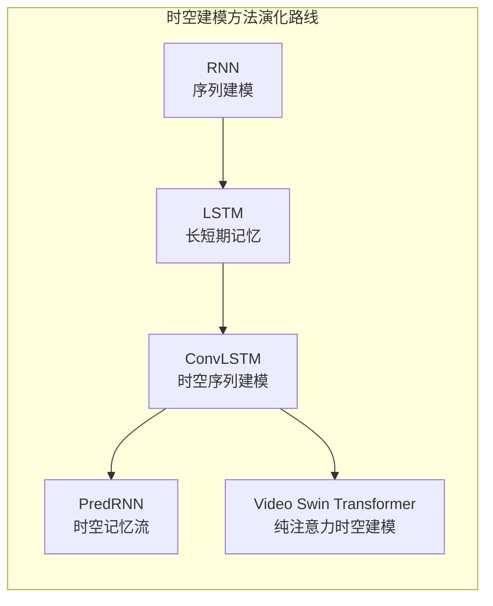
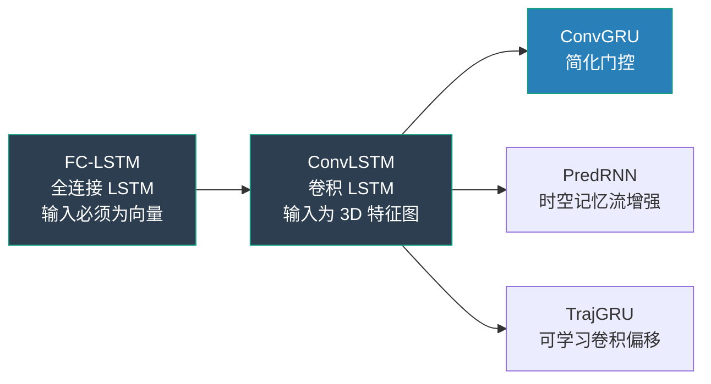
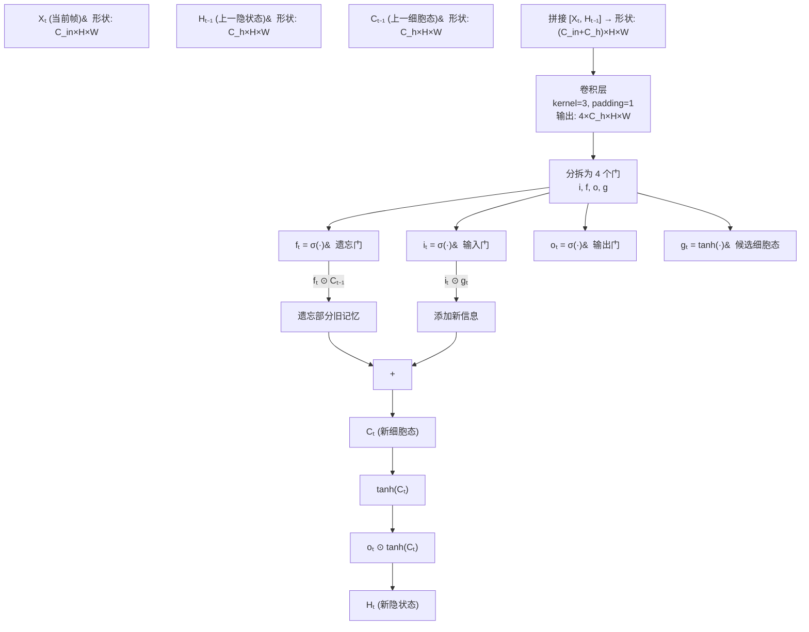
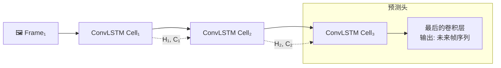
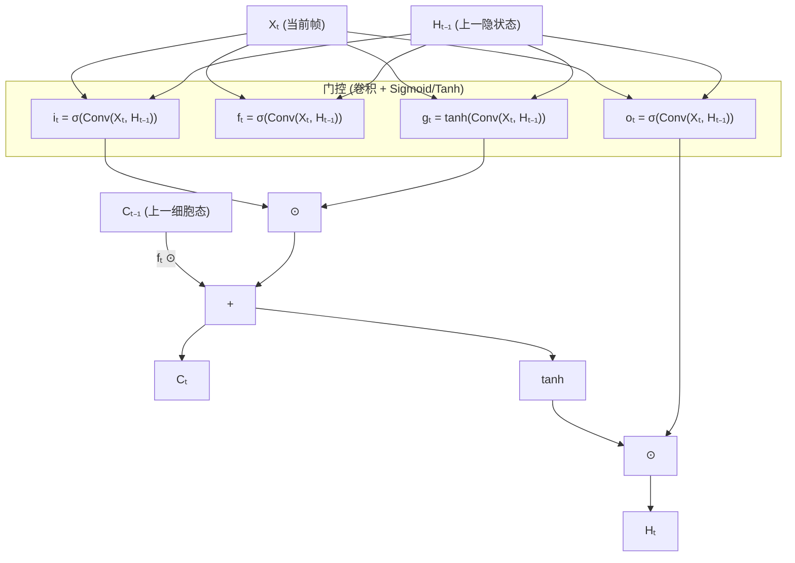

# ConvLSTM (卷积 LSTM)

## 知识地图



## 前置知识

- **标准 LSTM**: 遗忘门、输入门、输出门、细胞状态——ConvLSTM 的基础门控机制
- **卷积操作 (Convolution)**: 滤波器在空间维度上的滑动窗口运算，理解 kernel size、padding、stride
- **Spatiotemporal 数据**: 多帧 2D 图像构成的时间序列（如雷达回波、视频帧），形状为 $[T, C, H, W]$
- **RNN 循环机制**: 隐状态如何在时间步之间传递信息
- **3D 卷积 (3D CNN)**: $[C, T, H, W]$ 维度的卷积——ConvLSTM 的替代方案，理解两者在长时序建模上的差异

## 模型演化路线



| 模型 | 输入形状 | 空间运算 | 核心应用 | 关键局限 |
|------|----------|----------|----------|----------|
| FC-LSTM | $(B, T, d)$ | 全连接 (展平) | 时间序列预测 | 丢失空间结构 |
| ConvLSTM | $(B, T, C, H, W)$ | 2D 卷积 | 降水预测、视频预测 | 参数多、训练慢 |
| ConvGRU | $(B, T, C, H, W)$ | 2D 卷积 | 同上 | 表达能力略弱但更快 |
| PredRNN | $(B, T, C, H, W)$ | 2D 卷积 + 时空记忆 | 长时序预测 | 内存开销大 |

## 为什么会出现 (Why)

标准 LSTM 在设计时假设输入是向量——每一帧的特征必须被展平（Flatten）为一维才能输入。这对于时空数据（如雷达回波图、视频帧）来说是灾难性的：展平操作破坏了 2D 图像中像素之间的空间关系（上下左右邻居），模型无法理解"雨云在向右移动"这种空间运动模式。同时，FC-LSTM 的全连接权重数量随着图像尺寸平方增长（$H \times W$ 像素的全连接，参数量爆炸）。

## 解决什么问题 (Problem)

1. **保留空间结构**: 用卷积替代全连接，让 LSTM 的每一步都能理解 2D 空间中的局部模式
2. **参数效率**: 卷积的权重共享使得参数量与输入尺寸无关（仅由 kernel size 决定），远少于全连接
3. **时空联合建模**: 在一个模型中同时捕捉空间模式（卷积）和时间演化（LSTM 循环）
4. **长时序预测**: 对降水预报、交通流量、视频预测等需要多步时间外推的任务

## 核心思想 (Core Idea)

ConvLSTM 将标准 LSTM 中的所有全连接运算替换为卷积运算，使 LSTM 的隐状态和输入都是 3D 特征图 $(C, H, W)$，从而同时保留卷积的空间建模能力和 LSTM 的时间记忆能力，实现对时空序列的端到端学习。

## 模型结构图

### ConvLSTM 单元内部结构



### 时空序列预测流程



## 数学模型/公式

### ConvLSTM 门控方程

将标准 LSTM 的门控方程中所有矩阵乘法变为卷积：

$$
\mathbf{i}_t = \sigma(\mathbf{W}_{xi} * \mathbf{X}_t + \mathbf{W}_{hi} * \mathbf{H}_{t-1} + \mathbf{b}_i)
$$

**通俗解释：** 输入门 $i_t$ 决定"当前帧的哪些信息应该写入细胞态"。$\mathbf{W}_{xi} * \mathbf{X}_t$ 是输入图像的卷积响应，$\mathbf{W}_{hi} * \mathbf{H}_{t-1}$ 是上一时刻隐状态的卷积响应，两者相加后过 Sigmoid 挤压到 $[0,1]$——接近 1 表示"这个位置的这一特征很重要，要记住"。

$$
\mathbf{f}_t = \sigma(\mathbf{W}_{xf} * \mathbf{X}_t + \mathbf{W}_{hf} * \mathbf{H}_{t-1} + \mathbf{b}_f)
$$

**通俗解释：** 遗忘门 $f_t$ 决定"上一时刻的细胞态中哪些该遗忘"。类似地，对输入和隐状态做卷积后过 Sigmoid。在降水预测中，遗忘门学会了"当云团飘过某个区域后，该区域的记忆应该被清除"。

$$
\mathbf{o}_t = \sigma(\mathbf{W}_{xo} * \mathbf{X}_t + \mathbf{W}_{ho} * \mathbf{H}_{t-1} + \mathbf{b}_o)
$$

**通俗解释：** 输出门 $o_t$ 决定"细胞态中的哪些信息应该作为当前帧的输出（隐状态）"。它控制信息从内部记忆到外部可见状态的流动。

$$
\tilde{\mathbf{C}}_t = \tanh(\mathbf{W}_{xc} * \mathbf{X}_t + \mathbf{W}_{hc} * \mathbf{H}_{t-1} + \mathbf{b}_c)
$$

**通俗解释：** 候选细胞态 $\tilde{C}_t$ 是"基于当前帧，可能写入细胞态的新信息"。通过 tanh 压缩到 $[-1,1]$，正值表示"应该激活的特征"，负值表示"应该抑制的特征"。

$$
\mathbf{C}_t = \mathbf{f}_t \odot \mathbf{C}_{t-1} + \mathbf{i}_t \odot \tilde{\mathbf{C}}_t
$$

**通俗解释：** 细胞态更新公式——$f_t \odot C_{t-1}$ 是"选择性遗忘旧记忆"，$i_t \odot \tilde{C}_t$ 是"选择性写入新信息"。这里的 $\odot$ 不是逐元素乘法，而是逐像素逐通道的乘法（Hadamard 积），因为 $C_t, f_t, i_t, \tilde{C}_t$ 都是 3D 张量 $(C, H, W)$。

$$
\mathbf{H}_t = \mathbf{o}_t \odot \tanh(\mathbf{C}_t)
$$

**通俗解释：** 最终输出隐状态 $H_t$——输出门 $o_t$ 控制从细胞态中释放多少信息，tanh 将细胞态压缩到 $[-1,1]$ 后再逐像素过滤。

其中 $\mathbf{X}_t, \mathbf{H}_t, \mathbf{C}_t, \mathbf{i}_t, \mathbf{f}_t, \mathbf{o}_t \in \mathbb{R}^{C \times H \times W}$（3D 张量），$*$ 是 2D 卷积运算（在 $H \times W$ 平面），每个卷积核的大小通常为 $3 \times 3$ 或 $5 \times 5$。

### 与标准 LSTM 的关键区别

| 组件 | 标准 LSTM | ConvLSTM |
|------|----------|----------|
| 输入形状 | $(B, d)$ | $(B, C, H, W)$ |
| 权重运算 | 矩阵乘 $\mathbf{Wx}$ | 卷积 $\mathbf{W} * \mathbf{x}$ |
| 隐状态 | 向量 $\mathbf{h} \in \mathbb{R}^H$ | 特征图 $\mathbf{H} \in \mathbb{R}^{C \times H \times W}$ |
| 细胞态 | 向量 $\mathbf{c} \in \mathbb{R}^H$ | 特征图 $\mathbf{C} \in \mathbb{R}^{C \times H \times W}$ |
| 感受野 | N/A (全连接无空间概念) | 由 kernel size 决定（典型 3×3） |
| 参数量 | $O(H \cdot (d+H))$ | $O(H \cdot k^2)$ (与图像尺寸无关) |

## 可视化展示

### ConvLSTM 单元结构 (简化版)



### ConvLSTM vs 3D CNN 对比

```echarts
return {
  tooltip: { trigger: "axis", confine: true },
  title: { top: 5,  text: '时空建模方法对比', left: 'center', textStyle: { fontSize: 12 } },
  xAxis: { type: 'category', data: ['参数量', '长时序', '局部空间', '训练难度'] },
  yAxis: { type: 'value', min: 0, max: 1, name: '相对得分' },
  legend: { top: 28,  data: ['ConvLSTM', '3D CNN', 'ConvGRU'] },
  series: [
    { name: 'ConvLSTM', type: 'bar', data: [0.6, 0.85, 0.8, 0.55], itemStyle: { color: '#2c3e50' } },
    { name: '3D CNN', type: 'bar', data: [0.8, 0.4, 0.9, 0.75], itemStyle: { color: '#2980b9' } },
    { name: 'ConvGRU', type: 'bar', data: [0.5, 0.82, 0.78, 0.6], itemStyle: { color: '#16a085' } }
  ],
  grid: { left: 60, right: 20, top: 55, bottom: 55 }
}
```

## 最小可运行代码

### PyTorch ConvLSTM Cell

```python
import torch
import torch.nn as nn

class ConvLSTMCell(nn.Module):
    def __init__(self, in_channels, hidden_channels, kernel_size=3):
        super().__init__()
        self.hidden_channels = hidden_channels
        padding = kernel_size // 2

        # 合并所有卷积为一个大卷积（效率优化）
        self.conv = nn.Conv2d(
            in_channels + hidden_channels,
            4 * hidden_channels,
            kernel_size, padding=padding)

    def forward(self, x, state):
        # x: [B, C_in, H, W]
        # state: (h, c) each [B, C_hidden, H, W]
        h_prev, c_prev = state
        combined = torch.cat([x, h_prev], dim=1)  # [B, C_in+H, H, W]
        gates = self.conv(combined)  # [B, 4*H, H, W]
        i, f, o, g = gates.chunk(4, dim=1)

        i = torch.sigmoid(i)
        f = torch.sigmoid(f)
        o = torch.sigmoid(o)
        g = torch.tanh(g)

        c = f * c_prev + i * g
        h = o * torch.tanh(c)
        return h, (h, c)


class ConvLSTM(nn.Module):
    def __init__(self, in_channels, hidden_channels, kernel_size=3, num_layers=2):
        super().__init__()
        self.cells = nn.ModuleList()
        for i in range(num_layers):
            in_ch = in_channels if i == 0 else hidden_channels
            self.cells.append(ConvLSTMCell(in_ch, hidden_channels, kernel_size))

    def forward(self, x):
        # x: [B, T, C, H, W]
        B, T, C, H, W = x.shape
        states = [None] * len(self.cells)
        outputs = []

        for t in range(T):
            h = x[:, t]
            for i, cell in enumerate(self.cells):
                h, states[i] = cell(h, states[i] or (
                    torch.zeros(B, cell.hidden_channels, H, W, device=x.device),
                    torch.zeros(B, cell.hidden_channels, H, W, device=x.device)
                ))
            outputs.append(h)

        return torch.stack(outputs, dim=1)  # [B, T, H, H, W]
```

### 简化的时序预测训练示例

```python
# 假设有雷达回波数据: [B, T_in, C, H, W]
# 目标: 预测未来的 T_out 帧
model = ConvLSTM(in_channels=1, hidden_channels=64, num_layers=3)
# 把隐状态输出映射回单通道回波图
head = nn.Conv2d(64, 1, kernel_size=3, padding=1)

# 训练伪代码
for batch in dataloader:
    x = batch['past_frames']      # [B, 10, 1, 256, 256] — 过去 10 帧
    y = batch['future_frames']    # [B, 10, 1, 256, 256] — 未来 10 帧

    # ConvLSTM 输出所有时间步的隐状态
    hidden_states = model(x)      # [B, 10, 64, 256, 256]

    # 用最后一帧的隐状态预测未来 (简化方案)
    last_hidden = hidden_states[:, -1]  # [B, 64, 256, 256]
    # 或者逐时间步自回归外推
    ...
```

## 工业界应用

| 应用场景 | 代表机构/系统 | 使用方法 |
|----------|-------------|----------|
| **降水临近预报** | 中国气象局、DeepMind (DGMR) | ConvLSTM 预测雷达回波外推 |
| **视频帧预测** | DeepMind | 下一帧预测、机器人规划 |
| **交通流量预测** | 各地城市交通系统 | 路网栅格化 + ConvLSTM |
| **海面温度预测** | NOAA | 卫星数据时空建模 |
| **医学影像分析** | 肿瘤生长预测 | DCE-MRI 时间序列分析 |
| **动作识别** | ConvLSTM + 3D Conv 混合 | 视频中的动作分类 |

## 对比表格

### ConvLSTM vs 替代方案

| 维度 | ConvLSTM | 3D CNN | ConvGRU | Transformer (时空) |
|------|----------|--------|---------|-------------------|
| **长时序依赖** | **强** (门控机制) | 弱 (仅限卷积窗口) | 强 | **极强** (全局注意力) |
| **局部空间建模** | 强 | **极强** | 强 | 弱 (需额外位置编码) |
| **参数量** | 中 | 高 | **低** | 极高 |
| **训练难度** | 中 (RNN 梯度) | **低** | 中 | 高 (需要大量数据) |
| **推理速度** | 慢 (逐步迭代) | **快** (并行) | 中 | 慢 ($O(N^2)$) |
| **典型应用** | 降水预测、交通 | 短视频分类 | 轻量级时序 | 长视频理解 |

### ConvLSTM vs 标准 LSTM

| 维度 | 标准 LSTM | ConvLSTM |
|------|----------|----------|
| 输入格式 | 一维向量 $(B, d)$ | 三维特征图 $(B, C, H, W)$ |
| 空间信息 | 丢失 (必须展平) | **保留** (卷积保持空间结构) |
| 权重类型 | 全连接矩阵 | **卷积核** (共享参数) |
| 平移等变性 | 无 | **有** (CNN 核心特性) |
| 参数效率 | 随图像尺寸平方增长 | **与图像尺寸无关** |

## 学完后建议继续学习

1. **PredRNN / PredRNN++** — 引入时空记忆流解决梯度消失问题，增强长时序预测能力
2. **TrajGRU** — 可学习的卷积偏移量，让感受野随物体运动方向自适应
3. **3D CNN + ConvLSTM 混合** — 如 C3D-LSTM，结合两者的优势
4. **Video Transformer / Video Swin** — 纯注意力机制如何取代 ConvLSTM 进行视频理解
5. **DGMR (DeepMind 生成式雨量模型)** — ConvLSTM 在天气预报中的前沿应用

## 高频面试题

### Q1: ConvLSTM 与标准 LSTM 的根本区别是什么？为什么要做这个改进？

**标准答案：** 标准 LSTM 使用全连接层处理输入和隐状态，要求输入必须展平为一维向量。ConvLSTM 将所有全连接替换为 2D 卷积。根本改进在于：(1) **保留空间结构**——卷积天然保持输入的空间维度 $(H, W)$，像素之间的局部空间关系被保留；(2) **参数效率**——卷积核参数与图像尺寸无关（由 $k \times k$ 决定），而全连接随图像面积平方增长；(3) **平移等变性**——卷积对空间平移具有等变性，允许相同的运动模式在不同位置被识别。这对降水预报（追踪云团运动）、视频预测（追踪物体移动）等任务至关重要。

### Q2: ConvLSTM 的"合并卷积"优化是什么？为什么这样做？

**标准答案：** 标准 ConvLSTM 需要 4 个独立的卷积层分别计算 $i_t$, $f_t$, $o_t$, $\tilde{C}_t$，共 4 次前向传播。合并卷积优化是将这 4 个卷积合为一个：在输入通道维度上，拼接 $[X_t, H_{t-1}]$ 后进行一次卷积，输出 $4 \times C_{hidden}$ 个通道，再用 `.chunk(4, dim=1)` 拆分为 4 个门。这样做将 4 次卷积的 GPU 内核启动开销合并为 1 次，实际推理速度可提升 2-3 倍，且减少了约 25% 的显存占用（卷积层权重的中间缓冲区）。

### Q3: ConvLSTM 和 3D CNN 在时空建模上有什么区别？各自适合什么场景？

**标准答案：** ConvLSTM 通过循环连接建模时间，时间步之间是串行的（必须 $t_1 \to t_2 \to t_3$），3D CNN 在 $[T, H, W]$ 维度上做 3D 卷积，时间方向是并行的。关键差异：(1) **长时序建模**——ConvLSTM 的 LSTM 门控可以捕捉数百步的时间依赖，3D CNN 的时间感受野受限于卷积核大小（通常 3-16 帧）；(2) **推理灵活性**——ConvLSTM 可以在任意长度上自回归外推，3D CNN 的输出长度在训练时固定；(3) **计算效率**——3D CNN 可全并行计算，推理极快；ConvLSTM 必须逐帧展开，推理较慢。选择策略：长时序预测（降水预报 1-2 小时）用 ConvLSTM，短视频分类/检测用 3D CNN。

### Q4: 为什么降水预报（雷达回波外推）是 ConvLSTM 的经典应用场景？

**标准答案：** 降水预报天然适合 ConvLSTM，原因有四：(1) 雷达回波数据是规则的 2D 栅格图像，每个像素表示该位置的降雨强度，与 ConvLSTM 的 3D 特征图输入天然匹配；(2) 云团运动具有明显的时间和空间连续性（匀速移动、旋转、增强/消散），LSTM 的门控适合建模这种渐变过程；(3) 需要长时序预测——通常输入 1 小时回波数据，预测未来 1-2 小时，ConvLSTM 能比 3D CNN 更好地保持长时间依赖性；(4) 平移等变性的重要——同样的降水模式可能出现在雷达图的任何位置，卷积的权重共享保证了模式的可迁移性。Google DeepMind 的 DGMR 模型即是 ConvLSTM 的进阶实现。

### Q5: ConvLSTM 有哪些局限性？后续工作如何改进？

**标准答案：** 主要局限性：(1) **梯度消失**——随着时间步增加，LSTM 仍然面临梯度衰减，长时序（100+ 步）表现差。PredRNN 引入时空记忆流（ST-LSTM），让细胞态在层间和时间步之间多路径流通缓解此问题。(2) **固定感受野**——卷积核大小固定，对于尺度变化大的运动模式（如降水云团从小到大）适应性差。TrajGRU 引入可学习的卷积偏移量，让感受野随物体运动自适应。(3) **训练慢**——逐帧展开导致反向传播深度大。ConvGRU 将三个门简化为两个，减少了约 25% 的计算量。(4) **全局依赖弱**——卷积本质上是局部操作。最近的 Video Transformer 和 Swin Transformer 开始将自注意力引入时空建模，在全局依赖上表现出色。
