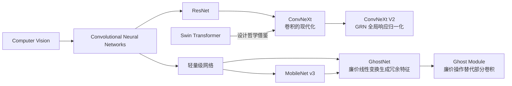
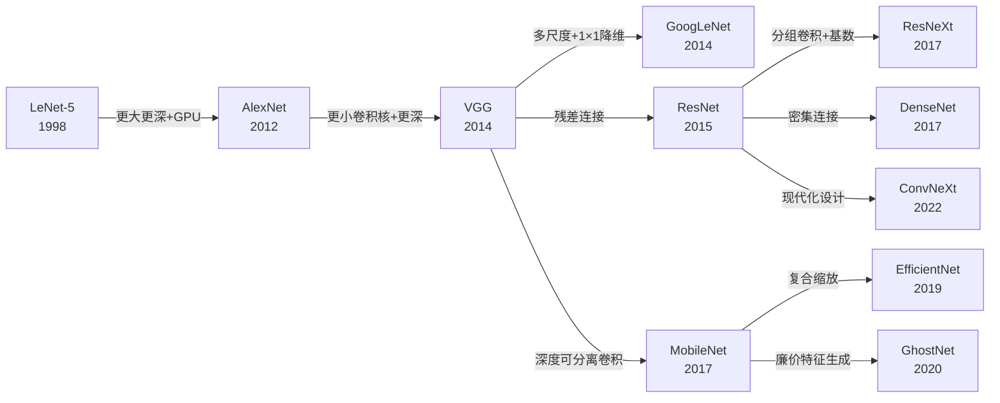
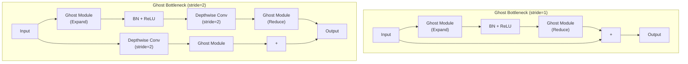
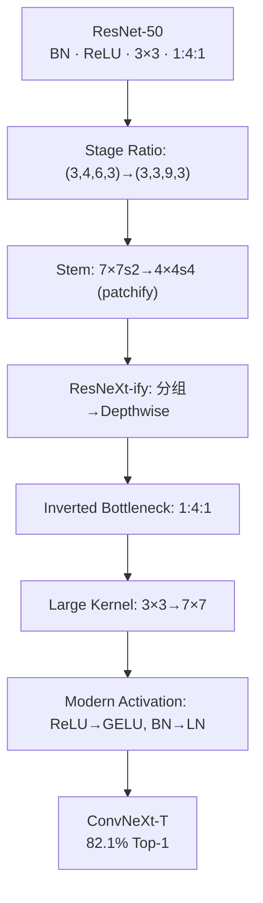

# ConvNeXt / GhostNet

## 知识地图



## 前置知识

- ResNet 残差连接和 Bottleneck 结构
- 深度可分离卷积（Depthwise Separable Convolution）的原理
- Batch Normalization 和 Layer Normalization 的区别
- Vision Transformer (ViT) 和 Swin Transformer 的基本概念
- MobileNet 系列轻量模型的设计思路
- FLOPs 和参数量（Params）的计算

## 模型演化路线



| 模型 | 年份 | 关键创新 | 解决的问题 |
|------|------|---------|-----------|
| ConvNeXt | 2022 | 7×7 Depthwise + LayerNorm + GELU + 倒残差 | 证明纯 CNN 可以匹敌 Swin Transformer |
| GhostNet | 2020 | Ghost Module（廉价线性变换生成冗余特征） | CNN 中间层存在大量相似特征图，浪费计算 |

---

## ConvNeXt

### 核心思想

2022 年，ConvNeXt 提出一个挑衅性问题：**如果纯粹用 ConvNet 技术、但按照 Swin Transformer 的设计哲学来重新设计 ResNet，会得到什么？** 答案是一个纯卷积模型，在 ImageNet 上匹配甚至超越 Swin Transformer，证明了卷积架构远未过时。

ConvNeXt V2 进一步引入**全局响应归一化（GRN）**替代 LayerNorm，解决了特征坍塌问题——深层特征图中不同通道的输出变得高度相关，GRN 通过通道间竞争恢复多样性。

### 为什么会出现

2020-2021 年，Vision Transformer（ViT）和 Swin Transformer 在 ImageNet 上全面超越传统 CNN，引发了"CNN 是否过时"的争论。但 ConvNeXt 的作者团队（Meta AI）观察到：Transformer 的成功可能不完全来自 attention 机制本身，而来自社区积累的**工程优化和设计范式**（如更大的卷积核、更少的激活层、GELU 激活、LayerNorm 等）。

### 解决什么问题

挑战"Transformer 天生优于 CNN"的观点——证明经过现代化设计的纯卷积网络可以达到与 Swin Transformer 相同甚至更好的精度，同时保持卷积的硬件友好性。

### 核心思想

**用 Swin Transformer 的设计哲学重新设计 ResNet 的每一个组件：7×7 Depthwise 卷积 + 倒残差 + LayerNorm + GELU + 单独的降采样层——整个过程只用卷积，但每一步都借鉴了 Transformer 的最佳实践。**

---

### 数学定义与原理解析

#### 从 ResNet 到 ConvNeXt 的现代化步骤

| 步骤 | ResNet-50 | → | ConvNeXt-T |
|------|-----------|---|------------|
| 训练策略 | 90 epochs | → | 300 epochs + 现代增强 |
| 阶段比 | (3,4,6,3) | → | (3,3,9,3) |
| Stem | 7×7, s=2 | → | 4×4, s=4 (patchify) |
| 卷积 | 3×3 分组 | → | 7×7 Depthwise |
| 瓶颈比 | 1:4:1 | → | 1:4:1 (inverted bottleneck) |
| 激活 | ReLU | → | GELU |
| 归一化 | BN | → | LayerNorm |
| 下采样 | 1×1, s=2 | → | 2×2, s=2 (separate) |

#### ConvNeXt Block 数学定义

$$
\begin{aligned}
\mathbf{x}' &= \text{DepthwiseConv}_{7\times7}(\mathbf{x}) \\
\mathbf{x}' &= \text{LayerNorm}(\mathbf{x}') \\
\mathbf{x}' &= \text{GELU}(\mathbf{x}') \\
\mathbf{x}' &= \text{Conv}_{1\times1, C \to 4C}(\mathbf{x}') \\
\mathbf{x}' &= \text{GELU}(\mathbf{x}') \\
\mathbf{x}' &= \text{Conv}_{1\times1, 4C \to C}(\mathbf{x}') \\
\text{out} &= \mathbf{x} + \text{LayerScale}(\mathbf{x}')
\end{aligned}
$$

**通俗解释：** 这个 block 的流程就像做一道菜：先用 7×7 的大视野扫一眼周围（深度卷积，不混合通道），然后把菜谱标准化（LayerNorm，统一味道基准），加一点调料（GELU 激活），用大火把食材膨胀 4 倍（特征丰富化），再用小火浓缩回原来的量（1×1 压缩），最后加一点点盐调味（LayerScale 缩放因子），和原始原料混在一起（残差连接）。

#### GRN (ConvNeXt V2) — 全局响应归一化

$$
G(\mathbf{X}) = \|\mathbf{X}\|_{\text{channel}} = \sqrt{\sum_{c} X_c^2}
$$

$$
\mathbf{X}' = \frac{\mathbf{X}}{\mathbb{E}[G(\mathbf{X})] + \epsilon} \cdot \gamma + \beta
$$

全局响应归一化：先计算全局特征范数，再在空间维度上归一化——强制通道间竞争。

**通俗解释：** 深层网络中，很多通道学到的特征趋同（特征坍塌——不同通道的输出高度相似，像复读机）。GRN 把每个位置的"通道响应强度"（所有通道输出的平方和的平方根）计算出来，然后在整个空间上归一化——如果某个通道的响应在所有位置都很强，它会被抑制；如果某个通道在某位置特别强但在其他位置弱，它会被突出。这强制了通道间的差异化竞争。

---

## GhostNet (2020)

### 为什么会出现

MobileNet v3 和 EfficientNet 已经将 CNN 的计算量压到很低，但华为诺亚实验室的 Kai Han 等人观察到一个有趣的现象：**CNN 的中间层特征图中存在大量"相似对"——两个特征图看起来几乎一样，只是亮暗或方向略有不同。** 如果很多特征是冗余的，那意味着有大量计算被浪费在生成"几乎相同"的特征图上。

GhostNet 提出：不要为每个输出通道都做真正的卷积——只对一半的通道做真正的卷积（称为"内在特征"），另一半通道通过对内在特征做廉价的线性变换（如 3×3 深度卷积）来"模仿"出来（称为"幽灵"特征）。

### 解决什么问题

在极低 FLOPs 预算下（100-200M）进一步提升精度——通过识别和利用 CNN 中间特征的冗余性，用廉价的线性变换替代昂贵的卷积操作。

### 核心思想

**一张好的"照片"（经过真正卷积的特征图）可以用廉价操作复制出多张"复印本"（幽灵特征）——把它们拼在一起，效果接近全是"原片"但计算量减半。**

### 数学定义

普通卷积输出中，很多特征图两两之间存在简单的线性关系（"幽灵对"）。Ghost 模块：

1. 正常卷积产生 $\frac{C_{out}}{2}$ 个"内在"特征图：$\mathbf{Y}' = \mathbf{X} * \mathbf{W}$
2. 对每个内在特征图施加廉价操作 $\Phi_i$（如 $3 \times 3$ 深度卷积），各生成一个"幽灵"特征：$\mathbf{y}_{ij} = \Phi_{i,j}(\mathbf{y}'_i)$
3. 拼接 → $C_{out}$ 个特征图：$\mathbf{Y} = [\mathbf{Y}', \Phi(\mathbf{Y}')]$

**通俗解释：** 假设你要生成 100 张特征图。传统方法：全部 100 张都做高成本的真正卷积。Ghost 方法：只做 50 张真正的卷积（内在特征），剩下的 50 张通过对这 50 张做简单的线性变换（如 3×3 的"复印"操作）来近似生成。因为 CNN 中间特征天然存在大量"相似关系"（如边缘检测器对亮暗/方向变化敏感），这些便宜的"复印件"已经有足够的信息量。计算量约减少 50%。

计算量减少约 50%，因为一半的特征图由廉价操作生成。

### Ghost Bottleneck



---

## 可视化展示

### ResNet → ConvNeXt 现代化路径



### ConvNeXt vs Swin 对比

```echarts
return {
  tooltip: { trigger: "axis", confine: true },
  title: { top: 5,  text: 'ConvNeXt vs Swin Transformer', left: 'center', textStyle: { fontSize: 12 } },
  xAxis: { type: 'value', name: 'FLOPs (G)' },
  yAxis: { type: 'value', name: 'ImageNet Top-1 (%)', min: 81, max: 88 },
  series: [
    { name: 'ConvNeXt', type: 'line', smooth: true,
      data: [[4.5,82.1], [8.7,83.8], [15.4,84.9], [34.4,85.8]],
      lineStyle: { color: '#16a085', width: 2.5 },
      symbolSize: 8 },
    { name: 'Swin Transformer', type: 'line', smooth: true,
      data: [[4.5,81.3], [8.7,83.3], [15.4,84.5], [34.5,85.2]],
      lineStyle: { color: '#2980b9', width: 2.5 },
      symbolSize: 8 }
  ],
  grid: { left: 60, right: 20, top: 55, bottom: 60 }
}
```

### 轻量模型对比 (GhostNet vs Others)

```echarts
return {
  tooltip: { trigger: "axis", confine: true },
  title: { top: 5,  text: '轻量模型 ImageNet Top-1 vs FLOPs', left: 'center', textStyle: { fontSize: 12 } },
  xAxis: { type: 'value', name: 'FLOPs (M)', min: 0, max: 600 },
  yAxis: { type: 'value', name: 'Top-1 Accuracy (%)', min: 68, max: 78 },
  series: [
    { name: 'MobileNetV3', type: 'scatter', symbolSize: 14,
      data: [[219, 75.2]], itemStyle: { color: '#2980b9' } },
    { name: 'ShuffleNetV2', type: 'scatter', symbolSize: 14,
      data: [[299, 74.9], [149, 72.6]], itemStyle: { color: '#16a085' } },
    { name: 'GhostNet', type: 'scatter', symbolSize: 14,
      data: [[141, 73.9], [226, 75.0]], itemStyle: { color: '#d35400' } },
    { name: 'MobileNetV2', type: 'scatter', symbolSize: 14,
      data: [[300, 72.0]], itemStyle: { color: '#2c3e50' } }
  ],
  grid: { left: 60, right: 20, top: 55, bottom: 60 }
}
```

---

## 最小可运行代码

### ConvNeXt Block

```python
import torch
import torch.nn as nn

class ConvNeXtBlock(nn.Module):
    def __init__(self, dim, drop_path=0.0, layer_scale_init_value=1e-6):
        super().__init__()
        self.dwconv = nn.Conv2d(dim, dim, 7, padding=3, groups=dim)  # depthwise
        self.norm = nn.LayerNorm(dim, eps=1e-6)
        self.pwconv1 = nn.Linear(dim, 4 * dim)   # pointwise ↑
        self.act = nn.GELU()
        self.pwconv2 = nn.Linear(4 * dim, dim)    # pointwise ↓

        self.gamma = nn.Parameter(
            layer_scale_init_value * torch.ones(dim),
            requires_grad=True) if layer_scale_init_value > 0 else None
        self.drop_path = nn.Identity()

    def forward(self, x):
        shortcut = x
        x = self.dwconv(x)
        x = x.permute(0, 2, 3, 1)  # [B, C, H, W] → [B, H, W, C]
        x = self.norm(x)
        x = self.pwconv1(x)
        x = self.act(x)
        x = self.pwconv2(x)
        if self.gamma is not None:
            x = self.gamma * x
        x = x.permute(0, 3, 1, 2)  # [B, H, W, C] → [B, C, H, W]
        return shortcut + self.drop_path(x)


class ConvNeXt(nn.Module):
    def __init__(self, in_chans=3, num_classes=1000,
                 dims=[96, 192, 384, 768],
                 depths=[3, 3, 9, 3]):
        super().__init__()
        # Patchify stem
        self.stem = nn.Sequential(
            nn.Conv2d(in_chans, dims[0], 4, stride=4),
            nn.LayerNorm(dims[0], eps=1e-6))

        self.stages = nn.ModuleList()
        for i in range(4):
            stage = nn.Sequential(*[ConvNeXtBlock(dims[i]) for _ in range(depths[i])])
            self.stages.append(stage)
            if i < 3:
                self.stages.append(nn.Sequential(
                    nn.LayerNorm(dims[i], eps=1e-6),
                    nn.Linear(dims[i], dims[i+1])))  # downsample

    def forward(self, x):
        x = self.stem(x)
        for stage in self.stages:
            if isinstance(stage[0], ConvNeXtBlock):
                x = stage(x)
            else:
                x = stage(x.permute(0,2,3,1)).permute(0,3,1,2)
        return x.mean(dim=[2,3])  # global avg pool
```

### Ghost Module

```python
import torch
import torch.nn as nn

class GhostModule(nn.Module):
    """Ghost 模块：一半通道用普通卷积，另一半用廉价操作生成"""
    def __init__(self, in_ch, out_ch, kernel_size=1, ratio=2, dw_size=3, stride=1):
        super().__init__()
        self.out_ch = out_ch
        init_channels = out_ch // ratio           # 内在特征通道数
        cheap_channels = init_channels * (ratio - 1)  # 幽灵特征通道数

        # 内在特征：正常卷积
        self.primary_conv = nn.Sequential(
            nn.Conv2d(in_ch, init_channels, kernel_size, stride,
                      padding=kernel_size//2, bias=False),
            nn.BatchNorm2d(init_channels),
            nn.ReLU(inplace=True),
        )

        # 幽灵特征：廉价操作（深度卷积）
        self.cheap_operation = nn.Sequential(
            nn.Conv2d(init_channels, cheap_channels, dw_size, 1,
                      padding=dw_size//2, groups=init_channels, bias=False),
            nn.BatchNorm2d(cheap_channels),
            nn.ReLU(inplace=True),
        )

    def forward(self, x):
        y_primary = self.primary_conv(x)
        y_cheap = self.cheap_operation(y_primary)
        return torch.cat([y_primary, y_cheap], dim=1)


class GhostBottleneck(nn.Module):
    """GhostNet 的基础构建块"""
    def __init__(self, in_ch, mid_ch, out_ch, stride=1, se_ratio=0):
        super().__init__()
        self.use_residual = stride == 1 and in_ch == out_ch

        # Expand
        self.ghost1 = GhostModule(in_ch, mid_ch, kernel_size=1, stride=1) if in_ch != mid_ch else nn.Identity()

        # Depthwise (stride applied here)
        layers = []
        if stride > 1:
            layers.append(nn.Conv2d(mid_ch, mid_ch, 3, stride, 1, groups=mid_ch, bias=False))
            layers.append(nn.BatchNorm2d(mid_ch))

        # SE (optional)
        if se_ratio > 0:
            se_ch = max(1, int(mid_ch * se_ratio))
            layers.append(nn.Sequential(
                nn.AdaptiveAvgPool2d(1),
                nn.Conv2d(mid_ch, se_ch, 1), nn.ReLU(inplace=True),
                nn.Conv2d(se_ch, mid_ch, 1), nn.Sigmoid(),
            ))

        self.depthwise = nn.Sequential(*layers) if layers else nn.Identity()

        # Reduce
        self.ghost2 = GhostModule(mid_ch, out_ch, kernel_size=1, stride=1)

    def forward(self, x):
        out = self.ghost1(x)
        out = self.depthwise(out)
        out = self.ghost2(out)
        if self.use_residual:
            out = x + out
        return out


# torchvision 内置
import torchvision.models as models

convnext_tiny  = models.convnext_tiny(weights=None)
convnext_small = models.convnext_small(weights=None)
convnext_base  = models.convnext_base(weights=models.ConvNeXt_Base_Weights.IMAGENET1K_V1)

for name, model in [("ConvNeXt-T", convnext_tiny), ("ConvNeXt-S", convnext_small),
                     ("ConvNeXt-B", convnext_base)]:
    params = sum(p.numel() for p in model.parameters()) / 1e6
    print(f"{name}: {params:.1f}M parameters")
```

---

## 工业界应用

| 模型 | 应用场景 | 原因 |
|------|---------|------|
| ConvNeXt-T/S | 目标检测 backbone (Cascade R-CNN) | 层级特征图与 ResNet 兼容，即插即用 |
| ConvNeXt-B | 语义分割 (UPerNet) | 高分辨率特征图质量高 |
| ConvNeXt | 需要替换 Swin 的场景 | 纯卷积实现，硬件加速更好（cuDNN 优化成熟） |
| GhostNet | 手机端实时分类（< 50ms） | 极低 FLOPs（~141M），比 MobileNet v3 更省算力 |
| GhostNet | 嵌入式 NPU（神经网络处理器）推理 | 廉价操作用分组卷积实现，NPU 友好 |
| GhostNet | IoT 设备上的面部识别 | 模型极小（~5MB），适合边缘设备 |

---

## 对比表格

| 维度 | ConvNeXt-T | GhostNet 1.0× | MobileNet v3 Large | ResNet-50 |
|------|-----------|--------------|--------------------|-----------|
| 年份 | 2022 | 2020 | 2019 | 2015 |
| 参数量 | 29M | 5.2M | 5.4M | 25.6M |
| FLOPs | 4.5G | 141M | 219M | 4.1G |
| ImageNet Top-1 | 82.1% | 73.9% | 75.2% | 76.1% |
| 核心创新 | 卷积现代化 | Ghost Module | NAS + SE | 残差连接 |
| 设计目标 | 云端高精度 | 移动端极致效率 | 移动端精度-速度平衡 | 通用 backbone |
| 归一化 | LayerNorm | BN | BN | BN |
| 激活函数 | GELU | ReLU | h-swish | ReLU |

---

## 学完后建议继续学习

- [MobileNet / EfficientNet](/learn/mobilenet-efficientnet) — 了解 GhostNet 之前的轻量模型发展脉络
- [SENet / ShuffleNet](/learn/senet-shufflenet) — 了解 GhostNet 中可选的 SE 模块原理和 ShuffleNet 的通道混洗
- [ResNeXt / DenseNet](/learn/resnext-densenet) — 了解 ConvNeXt 的现代化过程中借鉴的分组卷积设计

---

## 高频面试题

### Q1: ConvNeXt 和 ResNet 的核心区别是什么？为什么要做这些改动？

**答案：** ConvNeXt 从 ResNet-50 出发做了 7 个关键改动：

1. **训练策略现代化**：300 epochs + Mixup/CutMix/RandAugment 等现代增强（仅此一项就大幅提点）。
2. **阶段比例调整**：(3,4,6,3) → (3,3,9,3)，让 Stage3（第三组）有更多层，类似 Swin 的设计。
3. **Patchify Stem**：4×4 stride-4 卷积替代 7×7 stride-2，更接近 ViT 的 patch 分割方式。
4. **7×7 Depthwise 卷积**：替代 3×3，更大的感受野类似于 Swin 的 7×7 窗口 attention。
5. **倒残差**：MobileNet v2 的 Expand→Depthwise→Project 模式，类似 Transformer FFN 的 hidden_dim 膨胀。
6. **GELU + LayerNorm**：与 Transformer 使用相同的激活和归一化，减少激活函数数量（只在 1×1 之间放一个 GELU）。
7. **单独的下采样层**：2×2 stride-2 卷积独立于残差块，不混在瓶颈块内部。

这些改动的统一逻辑：**把 ResNet 的每个设计决策拿出来，用 Swin Transformer 的标准重新评估一遍。**

### Q2: GhostNet 的 Ghost Module 为什么有效？它的理论基础是什么？

**答案：** Ghost Module 基于一个经验观察：**CNN 中间层的特征图存在大量冗余——很多特征图彼此之间只差一个简单的线性变换（如翻转、旋转、亮暗调整）。**

这些"幽灵对"不需要通过昂贵的高维卷积来生成——可以通过对"内在特征图"做廉价的深度卷积来近似。GhostNet 将输出通道分为两组：
- **内在特征**（约 1/2）：通过正常卷积生成，包含主要的语义信息。
- **幽灵特征**（约 1/2）：通过对内在特征做廉价的 3×3 深度卷积生成。

理论依据是：如果中间特征的存在可以用线性变换近似，那么 $N/2$ 个内在特征 + $N/2$ 个经变换的幽灵特征 ≈ $N$ 个全卷积特征——但计算量约为原来的一半。

### Q3: ConvNeXt V2 的 GRN（全局响应归一化）解决了什么问题？

**答案：** 解决了**特征坍塌（Feature Collapse）**问题。在深层网络中，随着层数增加，不同通道输出的特征图变得越来越相似（不同通道间的余弦相似度趋向 1），这意味着很多通道在做重复工作，浪费了模型容量。

GRN 的工作机制：
1. 对每个空间位置，计算所有通道的 L2 范数 $G(\mathbf{X}) = \sqrt{\sum_c X_c^2}$
2. 在空间维度上对 G(X) 取均值
3. 用这个均值归一化所有通道

效果：如果某个通道在大多数位置都输出很大的值，它会被抑制（division by a large mean）。如果某个通道只在少数位置有极大值，它会被凸显。这强制了通道间的**差异化竞争**——每个通道必须找到自己独特的"用武之地"。

### Q4: ConvNeXt 为什么用 LayerNorm 而不用 BatchNormalization？两种归一化有什么区别？

**答案：**

| 特性 | Batch Normalization (BN) | Layer Normalization (LN) |
|------|-------------------------|-------------------------|
| 归一化维度 | 在 batch 维度（B, H, W 上统计均值/方差） | 在 channel 维度（C 上统计均值/方差） |
| 训练/推理 | 训练和推理行为不同 | 训练和推理行为一致 |
| batch size 依赖 | 是，小 batch 时不稳定 | 否，与 batch size 无关 |
| 对 CNN 的效率 | 高（共享统计量）| 略低 |

ConvNeXt 使用 LN 的原因：
1. **对标 Swin Transformer**：Swin 使用 LN，ConvNeXt 要保持每一步改动都在 Swin 的框架下评估。
2. **训练稳定性**：LN 不依赖 batch size，在大规模分布式训练中（batch size 很大或很小）都稳定。

实验表明：BN → LN 这一项改动仅提升 0.1% Top-1，但它是 ConvNeXt "完全遵循 Transformer 设计哲学"的一部分。

### Q5: GhostNet 和 MobileNet v3 都是轻量模型，该如何选择？

**答案：** 

| 场景 | 推荐选择 | 原因 |
|------|---------|------|
| 精度优先（FLOPs ~200M） | MobileNet v3 Large | NAS 搜索 + SE + h-swish 综合优化，Top-1 更高（75.2% vs 73.9%） |
| 效率优先（FLOPs < 150M） | GhostNet 1.0× | 141M FLOPs 下 73.9% Top-1，比同量级 MobileNet v2 更优 |
| 嵌入式 NPU 部署 | GhostNet | 廉价操作用分组卷积实现，对 NPU（神经网络处理器）更友好 |
| 通用移动端部署 | MobileNet v3 | 生态成熟，TensorFlow Lite / Core ML / ONNX 都有官方优化版本 |
| 需要极致压缩 | GhostNet 0.5× | 宽度乘数缩放灵活，~5MB 模型大小，适合 IoT |

实际选择时：如果有成熟的推理框架支持（TensorFlow Lite、ONNX Runtime），优先考虑 MobileNet v3。如果是自研 NPU 或者 FLOPs 预算极紧张（<150M），GhostNet 是更好的选择。
