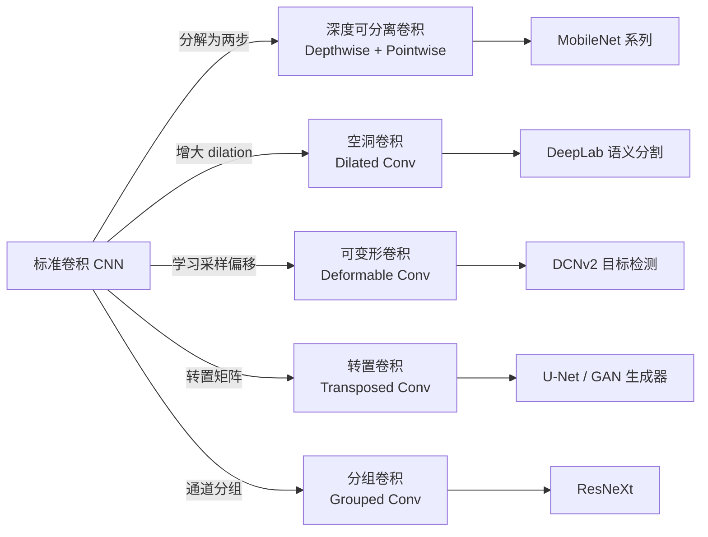
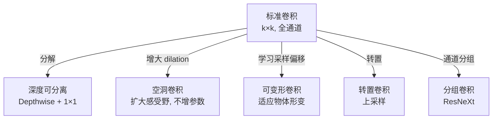

# Convolution Variants (卷积变体)

## 知识地图



## 前置知识

- 标准卷积运算（滑动窗口、通道、padding、stride）
- CNN 基础架构（卷积层、池化层、特征图）
- 参数量和 FLOPs 的计算方法
- 感受野（Receptive Field）的概念

## 为什么会出现 (Why)

标准卷积用固定 kernel 在规则网格上滑动，适合"局部平移不变"的特征提取，但现实中有多种特殊需求：扩大感受野但不想增加参数、移动端部署需要极低计算量、物体形变导致规则网格失效、需要上采样操作。每种变体针对不同的限制条件对标准卷积做了结构化改造。

## 解决什么问题 (Problem)

- **空洞卷积**：在语义分割中需要大感受野但不希望池化丢失空间分辨率
- **深度可分离卷积**：移动端/嵌入式设备的计算和存储资源极度受限
- **可变形卷积**：物体存在几何形变（姿态、视角变化），规则采样网格不够灵活
- **转置卷积**：生成模型中需要从低分辨率特征图上采样到高分辨率
- **分组卷积**：在参数量约束下增加网络宽度（多分支并行学习不同特征）

## 核心思想 (Core Idea)

**标准卷积用固定 kernel 在规则网格上滑动做局部特征提取；五种变体分别从采样方式、计算分解、学习偏移、方向反转、通道分组等角度对标准卷积进行了结构化改造。**

---

## 数学定义与原理解析

### 空洞卷积 (Dilated Convolution)

在标准卷积的采样点之间引入空洞（dilation rate $r$）：

$$
y[p] = \sum_{k} x[p + r \cdot k] \cdot w[k]
$$

有效感受野：$k' = k + (k-1)(r-1)$。

**通俗解释：** 想象一个 3x3 的卷积核，标准卷积在图像上紧密采样（相邻像素间距为 1）；空洞卷积则每隔 $r-1$ 个像素采样一次（间距为 $r$）。$r=2$ 时 3x3 卷积的实际感受野变为了 5x5，但参数依然是 9 个。不增加参数和计算量的前提下指数级扩大感受野——DeepLab 系列的核心。

### 深度可分离卷积 (Depthwise Separable Convolution)

分解为标准卷积的两步：

**Depthwise**：每个通道独立卷积（$C$ 个 $k \times k$ 单通道卷积）

**Pointwise**：$1 \times 1$ 卷积混合通道

**通俗解释：** 标准卷积同时做两件事——空间滤波（在 H,W 维度滑动）和通道混合（所有输入通道加权求和）。深度可分离卷积把这两步拆开：先用 Depthwise 对每个通道单独做空间滤波（不混合通道），再用 Pointwise 的 1x1 卷积纯粹做通道混合。就像洗牌和发牌分两步做，比同时操作省了巨量计算。

计算量对比（$C_{in}=C_{out}=C$）：

$$
\frac{\text{FLOPs}_{ds}}{\text{FLOPs}_{std}} = \frac{C \cdot k^2 \cdot H \cdot W + C^2 \cdot H \cdot W}{C^2 \cdot k^2 \cdot H \cdot W} = \frac{1}{C} + \frac{1}{k^2} \approx \frac{1}{k^2}
$$

3x3 卷积大约节省 8-9 倍计算——MobileNet 的基石。

### 可变形卷积 (Deformable Convolution)

标准卷积在规则网格 $\mathcal{R}$ 上采样。可变形卷积学习采样点的**偏移** $\Delta p_n$：

$$
y[p_0] = \sum_{p_n \in \mathcal{R}} w[p_n] \cdot x[p_0 + p_n + \Delta p_n]
$$

$\Delta p_n$ 由另一个卷积层从输入中学习。偏移可以是小数，需要双线性插值采样。

**通俗解释：** 标准卷积的 3x3 网格是固定形状的正方形。可变形卷积给每个采样点添加了一个可学习的"偏移量"——网络自己决定采样点该往哪偏。比如识别一只弯着脖子的长颈鹿：标准卷积的方形感受野可能框到背景，可变形卷积的采样点则会自动"弯"到长颈鹿的轮廓上。偏移量由额外的卷积层从输入特征中预测得到。

### 转置卷积 (Transposed Convolution)

"逆卷积"的直觉：标准卷积的矩阵形式是 $\mathbf{y} = \mathbf{C} \cdot \mathbf{x}$（$\mathbf{C}$ 是稀疏 Toeplitz 矩阵），转置卷积是 $\mathbf{x}' = \mathbf{C}^T \cdot \mathbf{y}$。

**通俗解释：** 标准卷积把大图变小的过程可以写成矩阵乘法（展平输入向量，用稀疏权重矩阵乘法实现滑动窗口）。转置卷积就是这个稀疏矩阵的转置——信息的流动方向反转，从小特征图"散布"回大图。用于上采样——GAN 的生成器和 U-Net 的解码器。

注意：转置卷积不是卷积的逆运算（不能还原被卷积丢失的信息），它只是形状上的"逆映射"。

### 分组卷积 (Grouped Convolution)

将输入通道等分为 $g$ 组，每组内独立做标准卷积，组间无信息交互。

**通俗解释：** 标准卷积中每个输出通道"看"所有输入通道。分组卷积把通道分成若干组，每组自己玩自己的卷积，组之间不交流。好处是参数和计算量降至原来的 $1/g$。ResNeXt 用分组卷积实现了"在相同计算量下用更多通道"的效果。极端情况 $g = C_{in}$ 就是 Depthwise 卷积。

---

## 可视化展示

### 五种卷积对比



### 空洞卷积的感受野增长

```echarts
return {
  tooltip: { trigger: "axis", confine: true },
  title: { top: 5,  text: '空洞卷积感受野 (k=3)', left: 'center', textStyle: { fontSize: 12 } },
  xAxis: { type: 'category', data: ['r=1(标准)', 'r=2', 'r=3', 'r=4', 'r=2^2层', 'r=2^3层'] },
  yAxis: { type: 'value', name: '感受野大小' },
  series: [{
    type: 'bar',
    data: [3, 5, 7, 9, 7, 15],
    itemStyle: { color: '#2c3e50' },
    label: { show: true, position: 'top' }
  }],
  grid: { left: 60, right: 20, top: 55, bottom: 55 }
}
```

空洞卷积在不增加参数的前提下指数级扩大感受野——DeepLab 用 $r=1,2,4,8,\dots$ 的级联达到 224x224 的感受野。

---

## 最小可运行代码

### PyTorch -- 各类卷积

```python
import torch
import torch.nn as nn

# 1. 空洞卷积 -- 扩大感受野, 不增参数
dilated_conv = nn.Conv2d(64, 64, 3, dilation=2, padding=2)

# 2. 深度可分离卷积 = Depthwise + Pointwise
class DepthwiseSeparableConv(nn.Module):
    def __init__(self, in_c, out_c, kernel=3):
        super().__init__()
        self.depthwise = nn.Conv2d(in_c, in_c, kernel,
                                    groups=in_c,
                                    padding=kernel//2, bias=False)
        self.pointwise = nn.Conv2d(in_c, out_c, 1, bias=False)

    def forward(self, x):
        return self.pointwise(self.depthwise(x))

# 3. 转置卷积 -- 上采样
transposed_conv = nn.ConvTranspose2d(64, 32, kernel_size=4, stride=2, padding=1)

# 4. 分组卷积 -- 通道间独立
grouped_conv = nn.Conv2d(64, 64, 3, groups=4, padding=1)

# 5. 可变形卷积 (PyTorch >= 1.9)
from torchvision.ops import DeformConv2d
deform_conv = DeformConv2d(64, 64, 3, padding=1)
offset = nn.Conv2d(64, 2 * 9, 3, padding=1)  # 每个采样点 (Delta_x, Delta_y)
# 使用: out = deform_conv(x, offset(x))
```

### 计算量对比

```python
def count_flops(in_c, out_c, k, h, w):
    std = in_c * out_c * k * k * h * w
    ds = in_c * k * k * h * w + in_c * out_c * h * w  # depthwise separable
    return std, ds, ds / std

# 3x3 Conv, 64->128, 56x56 feature map
std, ds, ratio = count_flops(64, 128, 3, 56, 56)
# 标准: 463M FLOPs, 深度可分离: 57M FLOPs, 约 12% 计算量
```

---

## 工业界应用

| 卷积类型 | 代表模型 | 应用场景 |
|----------|----------|----------|
| 空洞卷积 | DeepLab v3+ | 语义分割（保持空间分辨率 + 大感受野） |
| 深度可分离卷积 | MobileNet / Xception | 移动端图像分类、目标检测 |
| 可变形卷积 | DCNv2 + Faster R-CNN | 目标检测（适应物体形变） |
| 转置卷积 | DCGAN / U-Net | 图像生成、医学图像分割 |
| 分组卷积 | ResNeXt | 轻量级图像分类 |

---

## 对比表格

| | 标准卷积 | 深度可分离 | 空洞卷积 | 可变形卷积 | 转置卷积 | 分组卷积 |
|------|---------|-----------|---------|-----------|---------|---------|
| 参数量 | $C_{in} C_{out} k^2$ | $C_{in}(k^2 + C_{out})$ | 同标准 | 标准 + offset 网络 | 同标准 | $C_{in} C_{out} k^2 / g$ |
| 计算量 | 高 | 低 (~1/k^2) | 同标准 | 略高 | 同标准 | 低 (~1/g) |
| 感受野 | $k$ | $k$ | $k + (k-1)(r-1)$ | 灵活自适应 | - | $k$ |
| 采样方式 | 固定规则网格 | 固定规则网格 | 稀疏规则网格 | 学习偏移的网格 | 分数步长插入零 | 固定规则网格 |
| 核心用途 | 通用特征提取 | 移动端部署 | 语义分割 | 形变物体检测 | 上采样/生成 | 多分支轻量化 |
| 代表论文 | LeNet/AlexNet | MobileNet (2017) | DeepLab (2015) | DCN (2017) | FCN (2015) | ResNeXt (2017) |

---

## 学完后建议继续学习

1. **MobileNet 系列 (v1/v2/v3)** -- 深度可分离卷积 + 倒残差结构 + SE 模块的工程化演进
2. **语义分割架构 (FCN / U-Net / DeepLab)** -- 空洞卷积和转置卷积在实际分割网络中的组合使用
3. **EfficientNet** -- NAS 搜索出的缩放策略，大量使用深度可分离卷积
4. **ConvNeXt** -- 卷积网络"现代化"改造：大 kernel、LayerNorm、GELU，重新审视卷积

---

## 高频面试题

### Q1: 深度可分离卷积为什么能减少计算量？具体减少多少？

**答：** 标准卷积同时做空间滤波和通道混合，计算量为 $C_{in} \times C_{out} \times k^2 \times H \times W$。深度可分离卷积拆分为两步：Depthwise（每个通道独立的 $k \times k$ 卷积）计算量为 $C_{in} \times k^2 \times H \times W$；Pointwise（$1 \times 1$ 卷积混合通道）计算量为 $C_{in} \times C_{out} \times H \times W$。两者之比约为 $\frac{1}{C_{out}} + \frac{1}{k^2} \approx \frac{1}{k^2}$（当 $C_{out}$ 较大时）。对于 3x3 卷积，计算量约为标准卷积的 1/9，实际节省 8-9 倍。

### Q2: 空洞卷积和普通卷积 + 池化的区别是什么？什么时候用空洞卷积？

**答：** 池化通过下采样扩大感受野，但会丢失空间分辨率（例如 2x 池化后分辨率减半），后续上采样会引入模糊和棋盘伪影。空洞卷积在不降分辨率的前提下直接扩大感受野，保留了空间细节。

适用场景：语义分割（需要像素级输出，不能接受分辨率损失）；不适用的场景：需要降采样来控制计算量的深层网络（空洞卷积不减少计算量）。实践中常组合使用：浅层用普通卷积 + 池化控制计算，深层用空洞卷积保持分辨率。

### Q3: 转置卷积的"棋盘效应"(Checkerboard Artifacts) 是什么？如何避免？

**答：** 当 kernel_size 不能被 stride 整除时，转置卷积的上采样会产生"某些位置被覆盖次数不均匀"的问题，导致输出出现棋盘格状伪影。例如 kernel_size=3、stride=2 时，相邻像素被覆盖的频率不同。

解决方案：(1) 确保 kernel_size 是 stride 的整数倍；(2) 使用双线性插值上采样 + 普通卷积替代转置卷积（U-Net 和 StyleGAN 的做法）；(3) 使用 sub-pixel convolution (PixelShuffle)。

### Q4: 分组卷积和深度可分离卷积的关系是什么？

**答：** 深度可分离卷积是分组卷积的一个特例——当分组数 $g = C_{in}$ 时，分组卷积退化为 Depthwise 卷积（每个通道一组，组内只有 1 个通道）。深度可分离 = 极端分组卷积 + Pointwise 1x1 卷积。ResNeXt 的分组卷积取 $g = 32$ 或 $g = 64$（称为 cardinality），在分组和通道混合之间取折中；MobileNet 的 Depthwise 取的是最极端的情况 $g = C_{in}$。

### Q5: 可变形卷积中偏移量是怎么学习的？会不会学到无意义的偏移？

**答：** 偏移量 $\Delta p_n$ 由一个额外的卷积层（与主卷积并行的标准卷积）从相同的输入特征中预测。输出通道数为 $2 \times k^2$（每个采样点有 $\Delta x, \Delta y$ 两个值）。训练时，偏移量通过双线性插值反向传播梯度（与 Spatial Transformer Network 类似）。

不会学到无意义偏移，因为：(1) 偏移量受分类/检测 Loss 的监督，会学到对任务有利的采样位置；(2) DCNv2 增加了调制因子（modulation），允许网络为每个采样点学习一个权重，减小不可靠偏移的影响；(3) 实践中学到的偏移通常是有意义的——例如在检测行人时采样点会聚焦到人体轮廓上。
