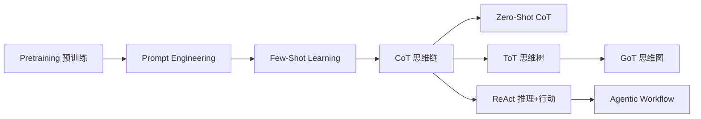
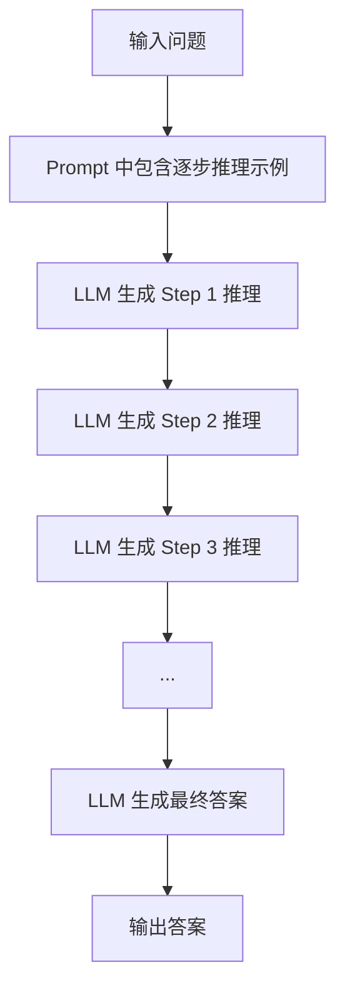
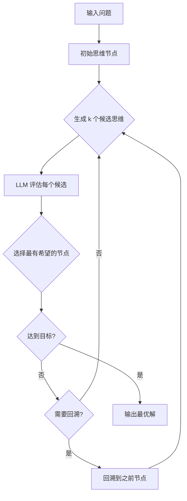
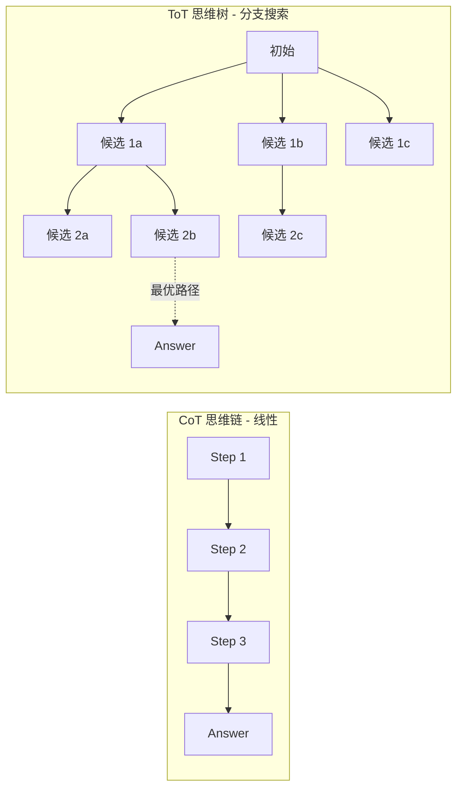

# Few-Shot / CoT / ToT (推理策略)

## 知识地图



## 前置知识

- **Prompt Engineering 基础**：理解 prompt 的基本结构和作用
- **LLM 推理机制**：理解自回归生成和 next-token prediction
- **In-Context Learning**：理解模型通过上下文学习的现象
- **基本概率论**：理解条件概率和搜索算法

## 为什么会出现 (Why)

### Few-Shot 的局限

标准 Few-Shot 给模型看几个示例就让它照着做，但对需要多步推理的任务（如数学应用题、逻辑推理）效果很差——模型直接跳到答案，中间推理过程是隐式的、容易出错。

### CoT 的动机

人们发现：如果在 Few-Shot 示例中显式展示推理步骤，模型就能学会"一步步思考"，答案准确率大幅提升。这催生了 CoT。

### ToT 的动机

CoT 的问题是：它是一条"不回头"的单行道，一步走错全盘皆输。对于需要探索多种可能性的任务（规划、博弈、创造性写作），需要在每一步考虑多个候选并选择最优路径。这催生了 ToT。

## 解决什么问题 (Problem)

- **Few-Shot**：解决零样本能力不足的问题，通过示例让模型理解任务格式
- **CoT**：解决复杂推理中"跳步"导致的错误，将隐式推理外化为显式步骤
- **ToT**：解决 CoT 无法回溯和探索的问题，在解空间中搜索最优推理路径

## 核心思想

通过改变 prompt 的结构（示例 → 步骤展示 → 树搜索），逐步提升 LLM 的推理深度和探索能力。

---

## Few-Shot Learning

### 核心思想

在 prompt 中提供几个示例（输入-输出对），让模型在上下文中理解任务格式和要求，无需更新参数。

```
将中文翻译为英文：

中文: 你好
英文: Hello

中文: 今天天气很好
英文: The weather is nice today

中文: 机器学习
英文:
```

### Few-Shot 的局限性

- 对复杂推理任务效果有限
- 示例的选择和排列顺序敏感
- 占用大量上下文窗口

---

## Chain-of-Thought (CoT) 思维链

### 核心思想

让模型在给出答案前**一步步推理**，将复杂问题分解为中间步骤。

### Standard Prompting

```
Q: 小明有 12 个苹果，给了小红 3 个，又买了 5 个，现在有几个？
A: 14 个
```

### CoT Prompting

```
Q: 小明有 12 个苹果，给了小红 3 个，又买了 5 个，现在有几个？
A: 小明开始有 12 个苹果。
   给了小红 3 个，剩下 12-3=9 个。
   又买了 5 个，总共 9+5=14 个。
   答案是 14 个。
```

### Zero-Shot CoT

只需加一句 **"Let's think step by step"** 即可：

```
Q: 小明有 12 个苹果...
A: 让我们一步步思考。
```

### 为什么 CoT 有效？

1. 将隐式推理**外化为显式步骤**
2. 分解问题降低了每个步骤的难度
3. 提供更多"思考时间"（用更多 token 换取更深的计算）

### 算法流程



---

## Tree-of-Thoughts (ToT) 思维树

### 核心思想

不做单一的思维链，而是**在每一步探索多个可能性**，使用 BFS 或 DFS 搜索。

### 算法流程



### 算法步骤

1. **生成**：对当前思维节点生成 $k$ 个候选下一步
2. **评估**：让 LLM 评估每个思维的价值
3. **选择**：选择最有希望的思维
4. **回溯**：必要时回溯到之前的思维节点

### 数学模型/公式

#### CoT 的条件概率

$$P(\text{Answer} | Q) = \prod_{t=1}^{T} P(\text{Step}_t | Q, \text{Step}_{<t})$$

**通俗解释：** CoT 把答案分解成一步步生成：第一步推理 → 基于第一步做第二步 → ... → 最终答案。每一步都依赖于之前的所有步骤。这比一次性生成答案多了很多"思考时间"。

#### ToT 的搜索公式

对于广度优先搜索 (BFS)：

$$\text{NextNodes} = \text{Top}_k \left( \text{Evaluate}(\text{Generate}(\text{CurrentNode}, k)) \right)$$

**通俗解释：** 从当前思维节点出发，先让 LLM 生成 k 个可能的"下一步思路"（Generate），再让 LLM 给每个思路打分（Evaluate），最后保留分数最高的几个（Top-k）继续探索。

#### ToT 的价值函数

$$V(\text{node}) = \text{LLM}(\text{node}, \text{"Evaluate the promise of this thought"})$$

**通俗解释：** 让 LLM 自己当"裁判"，评估某个中间思路有多大希望通向正确答案。这是一种自评估机制。

### ToT vs CoT

| | CoT | ToT |
|------|-----|-----|
| 推理结构 | 链 (线性) | 树 (分支) |
| 探索能力 | 无 | 有 |
| Token 消耗 | 少 | 多（搜索成本） |
| 适用任务 | 算术/常识推理 | 规划/博弈/创造性任务 |

---

## 可视化展示



## 最小可运行代码

### CoT Prompting 实现

```python
def cot_prompt(question, examples=None):
    """构建 CoT prompt"""
    if examples is None:
        examples = [
            {
                "q": "小明有 5 个苹果，吃了 2 个，又买了 3 个，现在有几个？",
                "a": "开始有 5 个，吃了 2 个剩下 5-2=3 个。买了 3 个，总共 3+3=6 个。答案是 6 个。"
            }
        ]

    prompt = "请一步步推理，展示你的思考过程。\n\n"
    for ex in examples:
        prompt += f"Q: {ex['q']}\nA: {ex['a']}\n\n"
    prompt += f"Q: {question}\nA:"
    return prompt
```

### Zero-Shot CoT

```python
def zero_shot_cot(question):
    """Zero-Shot CoT: 只需加上 'Let's think step by step'"""
    prompt = f"Q: {question}\nA: Let's think step by step."
    return llm(prompt)
```

### ToT 的简化实现 (BFS)

```python
def tot_bfs(problem, breadth=3, depth=3):
    """简化版 ToT 广度优先搜索"""
    current_nodes = [{"thought": "", "value": 1.0}]

    for d in range(depth):
        candidates = []
        for node in current_nodes:
            # 生成 k 个候选下一步
            next_thoughts = generate_candidates(problem, node["thought"], k=breadth)
            for thought in next_thoughts:
                # LLM 评估每个候选
                value = evaluate_thought(problem, thought)
                candidates.append({"thought": thought, "value": value})

        # 保留最优的 breadth 个
        candidates.sort(key=lambda x: x["value"], reverse=True)
        current_nodes = candidates[:breadth]

    return current_nodes[0]["thought"]
```

## 工业界应用

| 场景                     | 使用的推理策略   | 说明                                       |
| ------------------------ | ---------------- | ------------------------------------------ |
| ChatGPT (OpenAI)         | CoT (隐式)       | 模型被训练为给出步骤化回答                 |
| GPT-4 数学推理           | Zero-Shot CoT    | "Let's think step by step" 显著提升准确率  |
| AlphaCode (DeepMind)     | ToT 类似         | 竞赛编程中生成多个候选解并筛选             |
| 游戏/规划类任务          | ToT              | 需要探索多个策略并回溯的复杂决策           |
| 客服/教育对话系统        | CoT              | 需要展示推理过程让用户理解和信任           |

## 对比表格

|                      | Few-Shot        | CoT             | ToT               | ReAct            |
| -------------------- | --------------- | --------------- | ----------------- | ---------------- |
| 推理方式             | 无显式推理      | 线性步骤链      | 树搜索 + 回溯     | 循环 + 工具调用  |
| 探索能力             | 无              | 无              | 有 (多候选)       | 有 (工具反馈)    |
| 与外界交互           | 无              | 无              | 无                | 有               |
| Token 消耗           | 低              | 中              | 高 (搜索开销)     | 中               |
| 适用任务             | 格式转换/翻译   | 数学/逻辑推理   | 规划/博弈/创作    | QA/事实核查      |
| 是否需要示例         | 是              | 推荐 (或 Zero-Shot) | 否           | 推荐             |

## 学完后建议继续学习

- **ReAct**：将推理与工具调用结合，适合需要获取外部信息的场景
- **GoT (Graph-of-Thoughts)**：ToT 的进一步泛化（允许思维节点合并）
- **Self-Consistency**：对 CoT 采样多条路径然后投票，进一步提升准确性
- **Agentic Workflows**：将推理策略嵌入到 Agent 系统中
- **Prompt Engineering 进阶**：Automatic Prompt Engineering (APE)、DSPy 等

## 高频面试题

### Q1: CoT 为什么能提升推理准确率？原理是什么？

**标准答案：** CoT 通过三个机制提升准确率：(1) **分解复杂问题**：将复杂推理拆分为简单子步骤，每个步骤对模型来说更容易正确；(2) **增加计算深度**：用更多的 token 换取更多的前向传播"思考时间"，每一步的生成都基于前一步的结果；(3) **显式化隐式推理**：将模型内部的隐式推理过程外化为自然语言步骤，减少了"跳步"导致的中间错误。此外，如果使用 Few-Shot CoT，示例中的推理模式也为模型提供了更明确的格式引导。

### Q2: Few-Shot CoT 和 Zero-Shot CoT 的区别是什么？

**标准答案：** Few-Shot CoT 在 prompt 中提供若干个包含完整推理步骤的示例（问题 + 逐步推理 + 答案），模型通过这些示例学会推理格式和风格。Zero-Shot CoT 不提供示例，只需在 prompt 末尾加上"Let's think step by step"即可触发模型的逐步推理能力。Zero-Shot CoT 更简单、不占上下文窗口，但在某些复杂任务上效果不如精心设计的 Few-Shot CoT。

### Q3: ToT 相比 CoT 有什么优势和代价？

**标准答案：** ToT 的优势在于：(1) 可以在每一步探索多个候选方向，而非局限于单一路径；(2) 支持回溯机制，发现某路径不通时可以返回尝试其他方案；(3) 通过 LLM 自评估进行剪枝，保留最有希望的路径。代价是：(1) Token 消耗大幅增加（每一步需要生成 k 个候选 + 评估），可能达到 CoT 的数十倍；(2) 延迟更高（多次 LLM 调用）；(3) 实现复杂度更高，需要设计搜索策略和评估标准。ToT 最适合规划类、博弈类和需要创造性探索的任务。

### Q4: 什么场景下应该选择 CoT 而非 ToT？

**标准答案：** 当任务满足以下条件时，CoT 更合适：(1) 推理路径相对确定，不需要探索多个可能性（如标准数学题、常识推理）；(2) Token 预算或延迟有限；(3) 每一步的正确性高度依赖于上一步（线性依赖），分支探索收益不大。而当任务需要权衡多种策略、可能需要回溯、或者答案空间较大需要搜索时（如 24 点游戏、创意写作、复杂规划），ToT 才值得投入。

### Q5: CoT/ToT 与 ReAct 的本质区别是什么？

**标准答案：** CoT 和 ToT 是"纯推理"策略——所有信息来自模型内部，不涉及与外部世界的交互。ReAct 在 CoT 的基础上引入了"行动"——调用外部工具获取真实信息，然后基于观察结果继续推理。这使得 ReAct 适合需要外部知识或事实核查的任务，而 CoT/ToT 适合纯逻辑推理或数学计算。可以把 ReAct 理解为"CoT + 工具调用"。
