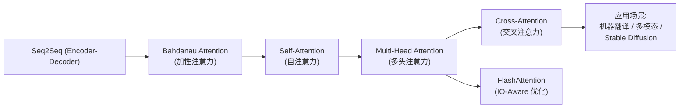
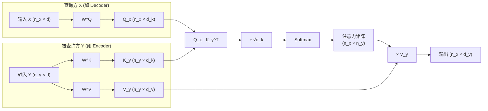

# 交叉注意力 (Cross-Attention)

## 知识地图



## 前置知识

- **Self-Attention**：理解 Q, K, V 来自同一序列的注意力机制
- **Transformer Encoder-Decoder 架构**：了解编码器-解码器结构和信息传递路径
- **多模态对齐的基本概念**：理解不同模态（文本、图像、音频）之间如何建立对应关系

## 为什么会出现 (Why)

Self-Attention 解决的是**序列内部**的信息交互——序列中每个位置关注序列内的其他位置。但在很多实际场景中，我们需要**两个不同序列之间**进行信息交互：

- 机器翻译：解码器翻译到第 t 个词时，需要"查阅"编码器对源语言的理解
- 文生图（Stable Diffusion）：图像生成过程需要"参考"文本提示词
- 图文检索（CLIP）：图像和文本需要互相"理解"对方

Self-Attention 无法胜任这种跨序列交互，因为它的 Q, K, V 都来自同一个序列。Cross-Attention 正是为解决这一需求而设计。

## 解决什么问题 (Problem)

Cross-Attention 解决的核心问题：**如何让一个序列（查询方）从另一个序列（被查询方）中提取相关信息，实现两个序列之间的信息融合和语义对齐。**

## 核心思想 (Core Idea)

**与自注意力（Q, K, V 来自同一序列）不同，交叉注意力的 Q 来自一个序列，K 和 V 来自另一个序列——它使一个序列可以"查询"另一个序列中的信息。**

---

## 数学公式

### 交叉注意力公式

$$
\text{CrossAttention}(\mathbf{Q}_x, \mathbf{K}_y, \mathbf{V}_y) = \text{softmax}\left(\frac{\mathbf{Q}_x \mathbf{K}_y^T}{\sqrt{d_k}}\right) \mathbf{V}_y
$$

其中：
- $\mathbf{Q}_x$ 来自序列 $x$（查询方），$\mathbf{Q}_x = \mathbf{X} \mathbf{W}^Q$
- $\mathbf{K}_y, \mathbf{V}_y$ 来自序列 $y$（被查询方），$\mathbf{K}_y = \mathbf{Y} \mathbf{W}^K$，$\mathbf{V}_y = \mathbf{Y} \mathbf{W}^V$

**通俗解释：** Self-Attention 是自己问自己（"我这句话里哪些词跟我关系大？"），Cross-Attention 是拿着自己的问题去问别人（"源语言句子里哪些词能帮我翻出下一个词？"）。Query 带着自己的"困惑"去匹配另一个序列的 Key，然后从那个序列的 Value 中提取需要的信息。

### 与 Self-Attention 的公式对比

| | Self-Attention | Cross-Attention |
|---|---|---|
| 公式 | $\text{softmax}(\frac{\mathbf{Q}_x \mathbf{K}_x^T}{\sqrt{d_k}}) \mathbf{V}_x$ | $\text{softmax}(\frac{\mathbf{Q}_x \mathbf{K}_y^T}{\sqrt{d_k}}) \mathbf{V}_y$ |
| Q 来源 | 序列 x | 序列 x |
| K 来源 | 序列 x | 序列 y |
| V 来源 | 序列 x | 序列 y |
| 注意力矩阵形状 | $n_x \times n_x$ | $n_x \times n_y$ |

**通俗解释：** Self-Attention 的注意力矩阵是方的（自己对自己），Cross-Attention 的注意力矩阵是矩形的（查询方长度 × 被查询方长度），因为两个序列长度可以不同。

---

## 可视化展示

### Cross-Attention 信息流



### 注意力矩阵概念

Cross-Attention 的注意力矩阵是 $n_x \times n_y$（查询方长度 × 被查询方长度）。矩阵的每一行表示"查询方第 $i$ 个位置关注被查询方哪些位置"。

以英译中为例（$n_x=3$ 个中文词，$n_y=4$ 个英文词）：

```
          cat  sat  on   mat
我(Query) 0.8  0.1  0.05 0.05  ← "我"主要关注"cat"
坐在      0.1  0.6  0.2  0.1   ← "坐在"主要关注"sat"
垫子上    0.05 0.05 0.1  0.8   ← "垫子上"主要关注"mat"
```

这形成了清晰的**对齐矩阵**，直观展示了翻译中的词对齐关系。

---

## 典型应用

### 1. Transformer 解码器中的 Encoder-Decoder Attention

解码器的每一层在自注意力后，用解码器的输出作为 Q，编码器的输出作为 K 和 V。这使得解码时能"看"整个输入序列。

### 2. 多模态模型 (如 Stable Diffusion)

```python
# 文本特征作为条件，指导图像生成
Q = image_features       # 图像查询"需要什么文本信息"
K = text_features        # 文本"提供什么语义"
V = text_features        # 文本的实际贡献
output = CrossAttention(Q, K, V)
```

### 3. CLIP / 图文检索

图像和文本互为查询方和键值方进行交互。

---

## 最小可运行代码

### PyTorch 完整实现

```python
import torch
import torch.nn as nn
import math

class CrossAttention(nn.Module):
    def __init__(self, d_model=512, n_heads=8):
        super().__init__()
        self.n_heads = n_heads
        self.d_k = d_model // n_heads
        self.W_q = nn.Linear(d_model, d_model)
        self.W_k = nn.Linear(d_model, d_model)
        self.W_v = nn.Linear(d_model, d_model)
        self.W_o = nn.Linear(d_model, d_model)

    def forward(self, x, context):
        """
        x: 查询方 [B, N_x, D]
        context: 被查询方 [B, N_c, D]
        """
        B, N_x, D = x.shape
        _, N_c, _ = context.shape

        Q = self.W_q(x).view(B, N_x, self.n_heads, self.d_k).transpose(1, 2)
        K = self.W_k(context).view(B, N_c, self.n_heads, self.d_k).transpose(1, 2)
        V = self.W_v(context).view(B, N_c, self.n_heads, self.d_k).transpose(1, 2)

        scores = Q @ K.transpose(-2, -1) / math.sqrt(self.d_k)
        attn = torch.softmax(scores, dim=-1)
        out = (attn @ V).transpose(1, 2).contiguous().view(B, N_x, D)
        return self.W_o(out)
```

---

## 工业界应用

| 应用场景 | 模型/系统 | Cross-Attention 用法 |
|----------|----------|---------------------|
| 机器翻译 | Transformer, MarianMT | Decoder(Query) → Encoder(K, V) |
| 文生图 | Stable Diffusion, DALL-E | 图像 patch(Query) → 文本 token(K, V) |
| 图文理解 | LLaVA, BLIP-2 | 文本(Query) → 图像特征(K, V) |
| 语音识别 | Whisper | Decoder(Query) → Encoder(K, V) |
| 视频理解 | Video-LLaMA | 文本(Query) → 视频帧特征(K, V) |
| 蛋白质设计 | ProtGPT2 | Decoder(Query) → 结构 Encoder(K, V) |

---

## 对比表格：Self-Attention vs Cross-Attention

| 特性 | Self-Attention | Cross-Attention |
|------|---------------|-----------------|
| Q, K, V 来源 | 同一序列 | Q 和 K,V 不同源 |
| 功能 | 序列内部建模 | 序列间信息融合 |
| 注意力矩阵形状 | $n \times n$ (方阵) | $n_x \times n_y$ (矩形) |
| 对角线含义 | 自关注（通常最高） | 无对角线概念——跨序列对齐 |
| 典型位置 | Encoder 和 Decoder 首层 | Decoder 中间层 |
| 是否需要 Causal Mask | 在 Decoder Self-Attn 中需要 | 不需要（可以看到全部 Encoder 输出） |

## 学完后建议继续学习

1. **Transformer 完整架构** — 理解 Self-Attention 和 Cross-Attention 在 Encoder-Decoder 中的协作
2. **Multi-Head Cross-Attention** — 多头视角下的跨序列交互
3. **Stable Diffusion 原理** — 深入理解 Cross-Attention 在文生图中的应用（U-Net + Cross-Attention 架构）
4. **KV Cache** — 理解自回归解码时如何高效处理 Cross-Attention 的 K, V
5. **Perceiver IO** — 理解如何用 Cross-Attention 实现不同模态的统一处理

## 高频面试题

### Q1: Self-Attention 和 Cross-Attention 的本质区别是什么？

**标准答案：**
本质区别在于 **Q, K, V 的来源**：
- **Self-Attention**：Q, K, V 来自同一个序列（自指）。注意力矩阵是 $n \times n$ 方阵，刻画序列内部位置之间的关系。
- **Cross-Attention**：Q 来自一个序列（查询方），K 和 V 来自另一个序列（被查询方）。注意力矩阵是 $n_x \times n_y$ 矩形，刻画两个序列之间的对齐关系。

功能上，Self-Attention 做**序列内建模**（理解一个句子内部的关系），Cross-Attention 做**序列间融合**（让一个句子"参考"另一个句子）。

### Q2: Transformer Decoder 中为什么既有 Self-Attention 又有 Cross-Attention？

**标准答案：**
Transformer Decoder 的每一层包含两个注意力子层：
1. **Masked Self-Attention**：让 Decoder 序列内部建模——当前 token 只能看到之前已生成的 token（因果掩码），这是自回归生成的约束。
2. **Cross-Attention**：让 Decoder 的每个位置"查阅" Encoder 的输出——Q 来自 Decoder 自身的表示，K、V 来自 Encoder 的最终输出。这使得生成过程可以"参考"源语言信息。

两者缺一不可：Self-Attention 负责语言模型的流畅性，Cross-Attention 负责源语言到目标语言的语义对齐。

### Q3: 在 Stable Diffusion 中 Cross-Attention 起到了什么作用？

**标准答案：**
在 Stable Diffusion 的 U-Net 中，Cross-Attention 是实现**文本条件控制图像生成**的核心机制：
- **Q**：来自图像 latent（当前像素需要生成什么）
- **K, V**：来自 CLIP 编码的文本 prompt（文本提供了什么语义指导）

每次去噪步骤中，图像通过 Cross-Attention "查询"文本信息，确保生成的图像内容与文本描述一致。没有 Cross-Attention，模型就无法进行"文控图"生成。

### Q4: Cross-Attention 的注意力矩阵形状是什么？为什么不是方的？

**标准答案：**
Cross-Attention 的注意力矩阵形状为 $n_x \times n_y$（查询方长度 × 被查询方长度），是矩形的而非方的，因为两个序列的长度通常不同。例如：
- 机器翻译中，中文有 10 个 token（$n_x=10$），英文有 8 个 token（$n_y=8$）→ 注意力矩阵 10×8
- Stable Diffusion 中，图像有 4096 个 patch（$n_x=4096$），文本有 77 个 token（$n_y=77$）→ 注意力矩阵 4096×77

这是 Core Attention 机制的自然结果：$Q \in \mathbb{R}^{n_x \times d_k}$，$K \in \mathbb{R}^{n_y \times d_k}$，$QK^T \in \mathbb{R}^{n_x \times n_y}$。
