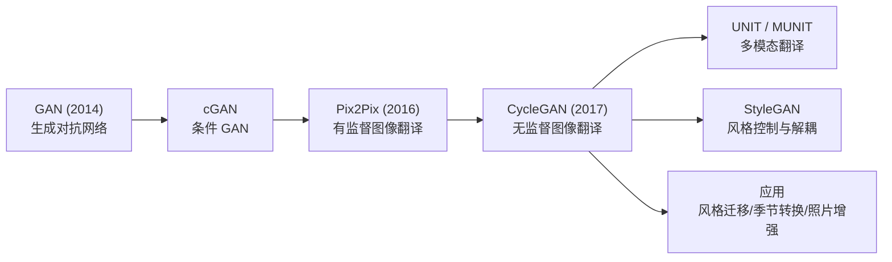
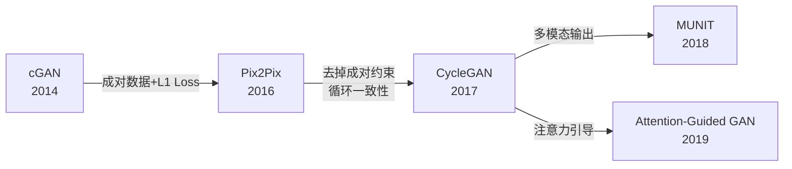
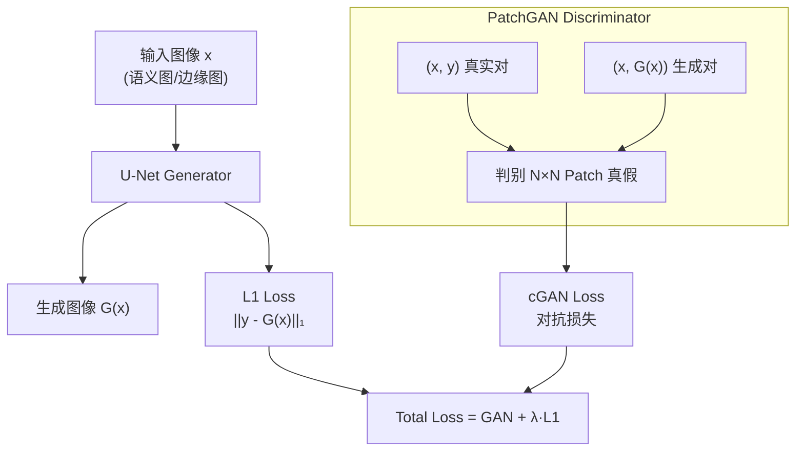
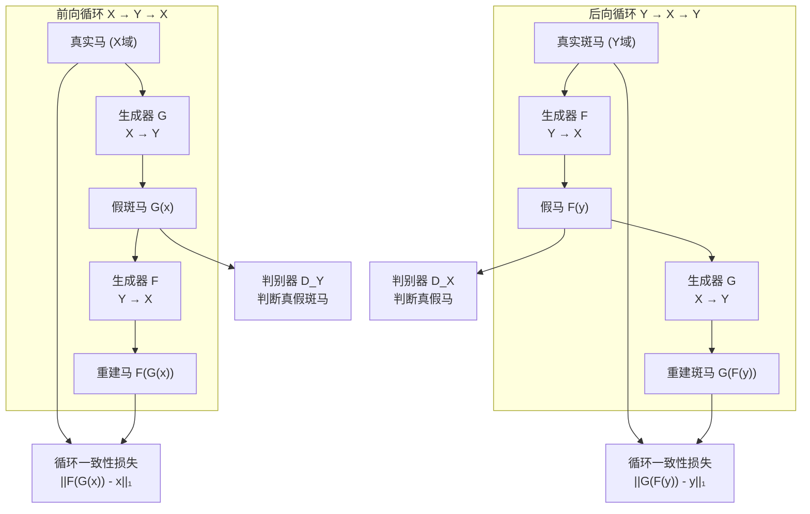

# CycleGAN / Pix2Pix

## 知识地图



## 前置知识

- **GAN 基础**：生成器与判别器的对抗训练、条件 GAN (cGAN)
- **U-Net**：编码器-解码器 + 跳跃连接的架构
- **CNN 基础**：卷积、转置卷积、Patch 判别器
- **L1/L2 Loss**：L1（MAE）产生更清晰图像，L2（MSE）产生更平滑图像

## 模型演化路线



| Model | Year | Key Innovation |
|-------|------|---------------|
| cGAN | 2014 | 条件输入控制生成器输出 |
| Pix2Pix | 2016 | 成对数据 + U-Net + PatchGAN + L1 Loss |
| CycleGAN | 2017 | 循环一致性损失，无需成对数据 |
| MUNIT | 2018 | 解耦内容编码与风格编码 |
| Attention-Guided GAN | 2019 | 引入注意力机制引导翻译 |

## 为什么会出现 (Why)

Pix2Pix 之前：图像翻译（如语义图到真实照片）需要手工设计损失函数，效果差且泛化能力弱。Pix2Pix 用 GAN 框架自动化了这个过程，但有一个致命限制：**需要成对训练数据**（如同一场景的草图+照片）。

CycleGAN 的出现：在许多实际场景中，成对数据根本不存在（如马和斑马不可能在同一姿势/背景下被拍摄）。CycleGAN 通过**循环一致性**（翻译过去再翻译回来应该回到原点）完全摆脱了成对数据的约束。

## 解决什么问题 (Problem)

1. **图像翻译缺乏自动化框架**：Pix2Pix 提供统一的 cGAN + L1 框架处理所有图像翻译任务
2. **成对数据稀缺**：CycleGAN 实现无监督/无成对数据的图像翻译
3. **翻译质量与保真度**：L1 Loss 保留低频结构，PatchGAN 保证局部纹理真实性

## 核心思想 (Core Idea)

**Pix2Pix 用成对数据 + cGAN + L1 Loss 实现有监督图像翻译，CycleGAN 通过循环一致性损失（翻译过去再翻译回来应等于原图）实现无需成对数据的无监督翻译。**

---

## 模型结构图

### Pix2Pix 架构



### CycleGAN 架构



## 数学模型/公式

### Pix2Pix 总损失

$$G^* = \arg\min_G \max_D \mathcal{L}_{cGAN}(G, D) + \lambda \mathcal{L}_{L1}(G)$$

**通俗解释：** 生成器要同时满足两个目标：骗过判别器（GAN Loss），同时让输出和真实图像尽可能接近（L1 Loss）。$\lambda$（通常取 100）控制哪个目标更重要——L1 权重越大，输出越接近原图但可能模糊；GAN 权重越大，纹理越真实但可能出现伪影。

### 条件 GAN Loss

$$\mathcal{L}_{cGAN}(G, D) = \mathbb{E}_{x,y}[\log D(x,y)] + \mathbb{E}_{x,z}[\log(1 - D(x, G(x,z)))]$$

**通俗解释：** 和普通 GAN 的区别在于判别器的输入还包括条件图像 $x$。判别器不只判断"这张照片是否真实"，而是判断"这张照片和这个草图/边缘图是否匹配"。这确保了生成图像不仅真实，还忠实于输入条件。

### L1 Loss

$$\mathcal{L}_{L1}(G) = \mathbb{E}_{x,y,z}[\|y - G(x, z)\|_1]$$

**通俗解释：** L1 比 L2 产生更清晰的图像。原因是 L2 对误差平方，大误差惩罚极重，会迫使模型选择"中庸"的输出（模糊但平均误差小）。L1 对每个像素同等惩罚，允许模型保留锐利边缘而在少数像素上"犯大错"。

### CycleGAN 循环一致性损失

$$G: X \to Y, \quad F: Y \to X$$

$$\mathcal{L}_{cyc}(G, F) = \mathbb{E}_{x\sim X}[\|F(G(x)) - x\|_1] + \mathbb{E}_{y\sim Y}[\|G(F(y)) - y\|_1]$$

**通俗解释：** 把中文翻译成英文，再翻译回中文，应该得到原句。如果回来的句子变了，说明翻译过程中丢失了关键信息。循环一致性损失正是利用这个直觉——把马变成斑马再变回马，应该和原来的马一模一样。这个损失完全不需要成对数据（不需要知道这匹马对应的斑马长什么样），所以是无监督的。

### CycleGAN 总损失

$$\mathcal{L} = \mathcal{L}_{GAN}(G, D_Y, X, Y) + \mathcal{L}_{GAN}(F, D_X, Y, X) + \lambda \mathcal{L}_{cyc}(G, F)$$

**通俗解释：** 三个部分：(1) 前向 GAN Loss——让 $G$ 生成的假斑马骗过 $D_Y$，(2) 后向 GAN Loss——让 $F$ 生成的假马骗过 $D_X$，(3) 循环一致性损失——保证两边的翻译是可逆的，防止 $G$ 把所有马都映射到同一张斑马图（模式坍塌）。

### 身份保持损失（可选）

$$\mathcal{L}_{identity}(G, F) = \mathbb{E}_{y\sim Y}[\|G(y) - y\|_1] + \mathbb{E}_{x\sim X}[\|F(x) - x\|_1]$$

**通俗解释：** 把一张斑马的照片输入给"马→斑马"的生成器 $G$，既然输入已经是斑马了，输出应该保持不变。如果没有这个损失，$G$ 可能会把斑马的橙色夕阳背景也改成马的草原背景——因为它以为所有输入都来自马域。

---

## 可视化展示

（保留原有可视化图表）

---

## 最小可运行代码

```python
# Pix2Pix Generator (U-Net)
import torch
import torch.nn as nn

class UNetGenerator(nn.Module):
    def __init__(self, in_channels=3, out_channels=3, features=64):
        super().__init__()
        # Encoder
        self.enc1 = self._conv_block(in_channels, features)
        self.enc2 = self._conv_block(features, features * 2)
        # Decoder with skip connections
        self.dec1 = self._upconv_block(features * 2, features)
        self.dec2 = nn.Sequential(
            nn.ConvTranspose2d(features * 2, out_channels, 4, 2, 1),
            nn.Tanh())

    def _conv_block(self, in_c, out_c):
        return nn.Sequential(
            nn.Conv2d(in_c, out_c, 4, 2, 1), nn.BatchNorm2d(out_c), nn.LeakyReLU(0.2))

    def _upconv_block(self, in_c, out_c):
        return nn.ConvTranspose2d(in_c, out_c, 4, 2, 1)

    def forward(self, x):
        e1 = self.enc1(x)
        e2 = self.enc2(e1)
        d1 = torch.cat([self.dec1(e2), e1], dim=1)
        return self.dec2(d1)

# PatchGAN Discriminator
class PatchGANDiscriminator(nn.Module):
    def __init__(self, in_channels=6):
        super().__init__()
        self.model = nn.Sequential(
            nn.Conv2d(in_channels, 64, 4, 2, 1), nn.LeakyReLU(0.2),
            nn.Conv2d(64, 128, 4, 2, 1), nn.BatchNorm2d(128), nn.LeakyReLU(0.2),
            nn.Conv2d(128, 256, 4, 2, 1), nn.BatchNorm2d(256), nn.LeakyReLU(0.2),
            nn.Conv2d(256, 1, 4, 1, 1))  # 输出 N×N 的 patch 真假判断

    def forward(self, x, y):
        return self.model(torch.cat([x, y], dim=1))

# CycleGAN 循环一致性损失
def cycle_consistency_loss(G, F, real_X, real_Y):
    fake_Y = G(real_X)
    fake_X = F(real_Y)
    cycle_X = F(fake_Y)  # F(G(x)) 应 ≈ x
    cycle_Y = G(fake_X)  # G(F(y)) 应 ≈ y
    return nn.L1Loss()(cycle_X, real_X) + nn.L1Loss()(cycle_Y, real_Y)
```

---

## 工业界应用

| 产品/项目 | 说明 |
|-----------|------|
| **Prisma** | 将照片转换为艺术风格，使用类似 CycleGAN 的风格迁移 |
| **FaceApp** | 年龄变换/性别变换，基于图像翻译技术 |
| **Adobe Photoshop** | Neural Filters 中的风格转换和着色功能 |
| **NVIDIA GauGAN** | 语义分割图到真实风景照片的翻译 |
| **DeepArt** | 任意风格迁移的在线服务 |
| **卫星图像增强** | 卫星图到地图的翻译（Pix2Pix 经典用例） |

---

## 对比表格

| | Pix2Pix | CycleGAN |
|------|---------|----------|
| 训练数据 | 成对 (paired) | 不成对 (unpaired) |
| 输入约束 | 强配对（同一场景的 A/B） | 弱（两个独立集合） |
| 核心损失 | cGAN + L1 | cGAN + GAN(双向) + Cycle + Identity |
| 应用场景 | Labels→照片，边缘→实物，白天→夜晚 | 风格迁移，季节转换，马↔斑马 |
| 训练难度 | 较低 | 中等（需平衡多个损失） |
| 模式坍塌风险 | 低（L1 提供强约束） | 中（循环一致性是软约束） |
| 生成多样性 | 低（一对一映射） | 中（存在多解空间） |
| 身份保持 | 不需要（成对数据自带对齐） | 需要身份保持损失辅助 |

---

## 学完后建议继续学习

- **StyleGAN** — 从图像翻译到可控生成，学习解耦隐空间
- **MUNIT / DRIT** — 多模态无监督翻译，解耦内容与风格
- **Stable Diffusion + ControlNet** — 用扩散模型实现更高质量的图像翻译
- **Video-to-Video Translation** — 将图像翻译扩展到视频

---

## 高频面试题

### Q1: Pix2Pix 为什么用 PatchGAN 而不是全图判别器？

**标准答案：**
全图判别器只给出一张图"是真是假"的标量判断，无法评估局部纹理质量。PatchGAN 将输入图像分割为 $N \times N$ 的 patch（通常 70x70），对每个 patch 分别判断真假，然后取平均。这样做的好处是：(1) 参数更少，训练更快；(2) 强制生成器关注局部纹理真实性，而非只学会"整图看起来很真实"但细节模糊；(3) PatchGAN 可以应用于任意尺寸的图像（全卷积，无全连接层）。从信息论角度，PatchGAN 将图像建模为马尔可夫随机场，假设像素间隔大于 patch 直径时相互独立。

### Q2: CycleGAN 的循环一致性损失为什么是必要的？如果去掉会怎样？

**标准答案：**
如果只有双向 GAN 损失而没有循环一致性损失，生成器 $G$ 可以将所有的马都映射到同一张看起来很真实的斑马图（模式坍塌），或者将马映射到斑马域中任意一张图而不管原图的内容。循环一致性损失 $|F(G(x)) - x|_1$ 保证了翻译是**可逆的**——编码在输入图像中的内容信息必须在整个翻译过程中保留。去掉它会导致：生成结果随机且不忠实于输入内容，模型无法学到有意义的跨域映射。

### Q3: Pix2Pix 为什么用 L1 Loss 而非 L2 Loss？效果上有什么区别？

**标准答案：**
L1 (MAE) 和 L2 (MSE) 的关键差异在于对大误差的处理方式。L2 对误差平方，大误差惩罚极重，这迫使模型选择"在所有像素上都不太错"的保守策略——导致输出模糊（blurry）。L1 对所有误差线性惩罚，允许模型在少数像素上"犯大错"以换取大部分像素的锐利边缘。实验证明 L1 产生的图像更清晰。这也是为什么许多图像生成工作选择 L1 而非 L2，L1 配合 GAN Loss 能够同时保证低频结构（L1）和高频纹理（GAN）的质量。

### Q4: CycleGAN 中的身份保持损失 (Identity Loss) 是做什么的？什么时候需要？

**标准答案：**
身份保持损失规定：如果输入图像已经属于目标域，生成器应该原样输出。例如，将一张斑马照片输入"马→斑马"的生成器，输出应该仍是同一张斑马照片。这个损失的作用是：(1) 防止生成器改变已属于目标域图像的色调/背景，(2) 保持颜色分布的一致性。它在需要保留原图色调的场景（如照片增强、风格迁移）中很重要，但在域间差异很大时（如照片→梵高风格画）则不适用，因为它会抑制风格变化。

### Q5: Pix2Pix 和 CycleGAN 各自适合什么样的实际场景？如何选择？

**标准答案：**
选择的核心依据是**能否获得成对数据**：
- **有成对数据**（如同一建筑在不同天气下的照片、语义标注图 vs 街景照片）：用 Pix2Pix。成对数据提供强监督信号，效果通常更好且训练更稳定。
- **无成对数据**（如马与斑马、莫奈画与照片、冬天与夏天风景）：只能用 CycleGAN。虽然训练难度更大（需平衡多个损失），但数据获取成本大幅降低。
- 实际工程建议：如果能花少量成本获取一小部分成对数据，可以考虑半监督方案（部分成对数据 + 循环一致性正则化）。
