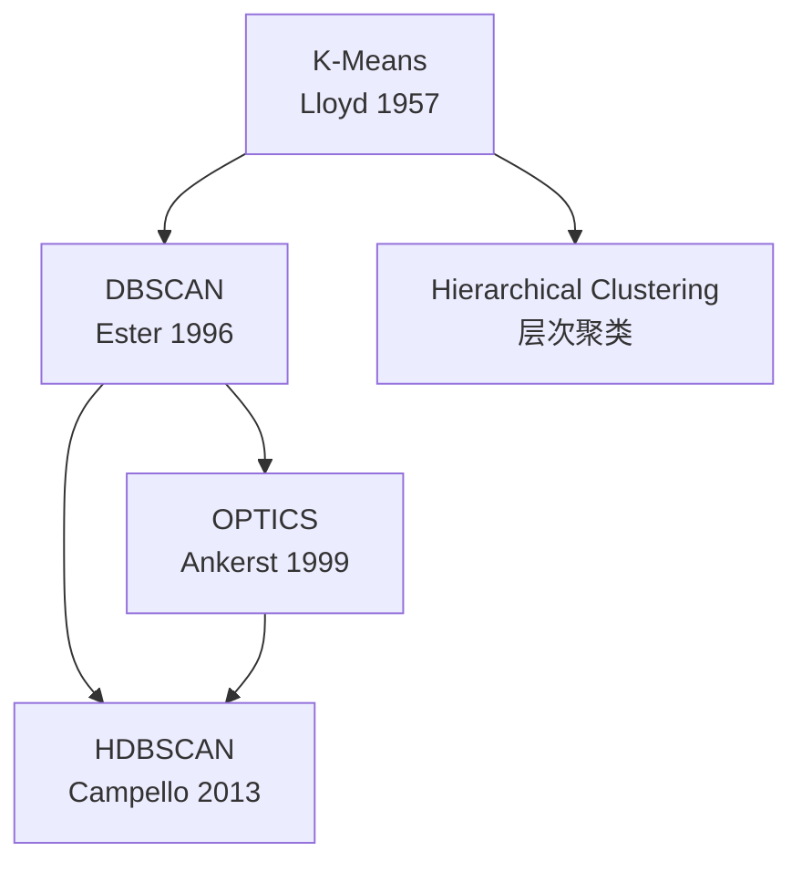
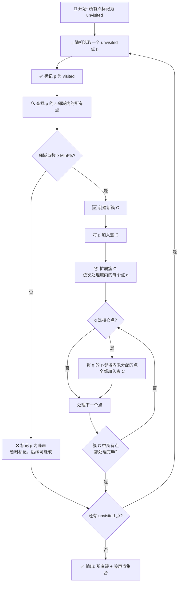

# DBSCAN / OPTICS

## 知识地图



## 前置知识

- **基于密度的聚类思想**：理解"密度"在聚类中的含义——一个区域内点的密集程度。簇被定义为"密度相连的点的最大集合"而非"靠近中心点的集合"。
- **K-Means 的局限性**：K-Means 只能发现球形簇、需要预设 K、无法处理噪声。这些正是 DBSCAN 要解决的问题。
- **图论基础**：DBSCAN 的"密度可达"和"密度相连"概念本质上是图上的连通分量问题。理解连通性的传递性。
- **最近邻搜索 (Nearest Neighbor Search)**：DBSCAN 的核心操作是查找每个点在 $\epsilon$ 邻域内的邻居。KD 树、Ball 树等数据结构加速此过程。
- **距离度量与维度灾难**：理解高维空间中点的距离趋于均等化（距离度量退化），这对基于密度的算法是致命的。

## 为什么会出现 (Why)

K-Means 虽然简单高效，但隐含了三个强假设：(1) 簇是球形的；(2) 每个点都必须属于一个簇（不能有噪声）；(3) K 是预先知道的。在现实世界中，数据往往是任意形状的（如 GPS 轨迹、地理区域、图像中的物体轮廓），而且常混杂噪声。DBSCAN 的提出就是为了打破这些假设——让算法自己去"发现"簇的形状，自己去"判断"哪些点是噪声。

## 解决什么问题 (Problem)

- **任意形状的簇**：不再假设簇是球形，可以处理月牙形、环形、S 形等复杂结构。
- **自动识别噪声**：不需要预设"异常比例"，算法自动将稀疏区域中的点标记为噪声。
- **无需预设 K**：通过 $\epsilon$（邻域半径）和 MinPts（核心密度阈值）两个参数隐式确定簇数量。
- **簇数量自适应**：数据库中可以存在任意数量的簇，由数据密度结构决定。

## 核心思想 (Core Idea)

**DBSCAN = 密度相连的点的最大集合**——如果一个区域内的点足够密集（点数的邻域内有超过 MinPts 个点），就从该点出发通过密度可达性不断"蔓延"，将所有可连通的点聚合为一个簇；稀疏区域的点则被标记为噪声。

---

DBSCAN (Density-Based Spatial Clustering of Applications with Noise) 基于密度定义簇：**簇是密度相连的点的最大集合**。它可以发现任意形状的簇并自动识别噪声。

---

## 数学模型/公式

### 两个核心参数

- **$\epsilon$ (eps)**：邻域半径
- **MinPts**：成为核心点所需的最小邻域点数

> **通俗解释：** $\epsilon$ 定义了"什么叫邻居"——半径 $\epsilon$ 以内的都是邻居。MinPts 定义了"什么叫密集"——如果一个点的邻居数达到 MinPts，这个区域就是"高密度"的，可以开始一个簇。在 2D 数据中，MinPts 通常设为 4 就够了。

### 三种点类型

- **核心点 (Core Point)**：$\epsilon$-邻域内点数 $\geq$ MinPts
- **边界点 (Border Point)**：自身不是核心点，但在某个核心点的 $\epsilon$-邻域内
- **噪声点 (Noise Point)**：既不是核心点也不是边界点

> **通俗解释：** 把数据想象成一幅星图。核心点是"星团中心"——周围星星很多。边界点是"星团边缘"——自己在边缘，周围星星不多，但旁边就有一个核心点。噪声点是"散落的孤星"——既不在任何星团内部，也不在任何星团边缘。

### 密度可达与密度相连

- **直接密度可达 (Directly Density-Reachable)**：$q$ 在 $p$ 的 $\epsilon$-邻域内，且 $p$ 是核心点
- **密度可达 (Density-Reachable)**：存在一条核心点链连接
- **密度相连 (Density-Connected)**：存在点 $o$，从 $o$ 出发对两个点都密度可达

> **通俗解释：** 直接密度可达 = "一步之遥"（q 就是 p 的邻居且 p 在密集区）；密度可达 = "捷力传递"（通过一连串处于密集区的点走过去）；密度相连 = "同一个朋友圈"（两个人都通过同一个"社交达人"o 认识）。**簇 = 所有密度相连的点的集合。**

**簇 = 所有密度相连的点的集合。**

---

## 算法流程图



---

## 可视化展示

### DBSCAN 的三类点示意图

在 DBSCAN 的聚类结果中：
- **红色**的核心点密集分布，周围环绕足够多的邻居
- **黄色**的边界点位于簇的边缘，靠核心点"拉入"簇中
- **蓝色**的噪声点孤立于稀疏区域，不属于任何簇

### DBSCAN vs K-Means 在非球形数据上的对比

- **DBSCAN** 能完美识别两个嵌套的同心圆、月牙形的"笑脸"数据、S 形弯曲簇——因为它只关心密度连续性。
- **K-Means** 在这些数据上表现灾难性——它会用直线切过弯曲的簇，因为它的核心假设是"靠近质心即属该簇"。

---

## OPTICS --- 消除 $\epsilon$ 的敏感度

OPTICS 不需要指定 $\epsilon$，而是生成一个**可达距离图**：

- **核心距离**：点到其第 MinPts 近邻的距离
- **可达距离**：$\max(\text{核心距离}(p), d(p, q))$

> **通俗解释 --- 核心距离：** 对于点 $p$，把它的所有邻居按距离从小到大排好：$d_1 \leq d_2 \leq \cdots \leq d_{MinPts} \leq \cdots$。$d_{MinPts}$ 就是 $p$ 的"核心距离"——想让 $p$ 成为核心点所需的最小球半径。大于这个值的邻居，$p$ 可以不管。

> **通俗解释 --- 可达距离：** 从 $p$ 出发到 $q$ 的"可达距离"，取的是 $\max(\text{核心距离}(p), d(p, q))$。取 max 的物理含义是：如果 $q$ 离 $p$ 很近（$d(p,q)$ 小于核心距离），那让 $q$ 成为核心点的代价也至少需要核心距离那么大；如果 $q$ 离 $p$ 很远（$d(p,q)$ 大于核心距离），那代价就是实际距离。

从可达距离图中提取簇结构，可同时发现不同密度的簇。

> **通俗解释：** DBSCAN 的一个重大缺陷是：如果数据中有两个密度差异很大的簇，无论怎么调 $\epsilon$ 都无法同时发现它们——调小会漏掉稀疏的簇，调大会把稠密的簇和周围的稀疏区全混成一个簇。OPTICS 通过生成一个"可达距离图"来将密度结构可视化——图中的"山谷"就是簇，谷底越深代表密度越高。这样可以在同一个输出中发现不同密度的簇。

---

## 最小可运行代码

```python
import numpy as np
from sklearn.neighbors import NearestNeighbors

def dbscan(X, eps, min_pts):
    n = X.shape[0]
    labels = -np.ones(n, dtype=int)  # -1 = unvisited
    nn = NearestNeighbors(radius=eps).fit(X)
    cluster_id = 0

    for i in range(n):
        if labels[i] != -1:
            continue
        neighbors = nn.radius_neighbors([X[i]], return_distance=False)[0]
        if len(neighbors) < min_pts:
            labels[i] = -2  # noise
            continue

        labels[i] = cluster_id
        seeds = list(neighbors[neighbors != i])
        j = 0
        while j < len(seeds):
            p = seeds[j]
            if labels[p] == -2:
                labels[p] = cluster_id
            if labels[p] != -1:
                j += 1
                continue
            labels[p] = cluster_id
            p_neighbors = nn.radius_neighbors([X[p]], return_distance=False)[0]
            if len(p_neighbors) >= min_pts:
                for nbr in p_neighbors:
                    if labels[nbr] == -1:
                        seeds.append(nbr)
            j += 1
        cluster_id += 1
    return labels
```

### Scikit-learn 一行代码版本

```python
from sklearn.cluster import DBSCAN, OPTICS

# DBSCAN
db = DBSCAN(eps=0.5, min_samples=5)
labels = db.fit_predict(X)  # -1 = noise

# OPTICS
optics = OPTICS(min_samples=5, xi=0.05)
labels = optics.fit_predict(X)
```

---

## 工业界应用

| 场景 | 说明 | 为什么用 DBSCAN/OPTICS |
|------|------|------------------------|
| **地理空间分析** | 根据 GPS 轨迹识别热点区域、商圈划分 | 任意形状的簇 + 自动滤除孤立点 |
| **异常检测** | 信用卡欺诈、网络入侵检测、传感器异常 | 异常 = 噪声点，天然分离 |
| **天文数据分析** | 识别星团、星系团 | 星团的形状不规则，密度定义更符合物理直觉 |
| **图像分割** | 基于像素颜色/位置聚团分离物体 | 物体轮廓任意，背景即噪声 |
| **社交网络分析** | 社区发现、识别紧密交互的群体 | 密度相连 = 社交关系传递 |

---

## 对比表格

### K-Means vs DBSCAN vs Hierarchical

| 维度 | K-Means | DBSCAN | Hierarchical |
|------|---------|--------|--------------|
| **簇形状** | 仅球形 | 任意形状 | 取决于 Linkage |
| **是否需要预设 K** | 是 | 否（需 eps + MinPts） | 否（可从树状图后切） |
| **噪声处理** | 强制分配 | 自动标记为噪声 | 取决于后切策略 |
| **时间复杂度** | $O(nKd \cdot t)$ | $O(n \log n)$ (KD树) | $O(n^2 \log n) \sim O(n^3)$ |
| **密度差异适应** | 差 | 差（OPTICS 好） | 一般（Ward 偏好等大小簇） |
| **高维适用性** | 一般 | 差（维度灾难导致密度失效） | 一般 |

---

## DBSCAN vs K-Means

| | DBSCAN | K-Means |
|------|--------|---------|
| 簇形状 | 任意形状 | 球形 |
| 噪声处理 | 自动识别 | 强制分配 |
| 参数 | eps + MinPts | K |
| 密度差异 | 单密度（OPTICS 多密度）| 不支持 |

---

## 优缺点

- **优点**：不需要预设 K，可发现任意形状簇，自动识别噪声
- **缺点**：对 eps 敏感，密度差异大时效果差，高维数据稀疏导致效果下降

---

## 学完后建议继续学习

1. **HDBSCAN**——DBSCAN 的现代升级版，自动选择 $\epsilon$，通过层次密度树的稳定性选择最稳健的聚类结果，已逐步替代原始 DBSCAN
2. **OPTICS**——解决 DBSCAN 对 $\epsilon$ 敏感的问题，可通过可达距离图同时发现不同密度的簇
3. **Gaussian Mixture Model (GMM)**——从概率生成视角看聚类，与 DBSCAN 的密度视角形成互补
4. **谱聚类 (Spectral Clustering)**——通过图的拉普拉斯矩阵做降维后再在低维空间聚类，可以处理更复杂的簇拓扑结构
5. **聚类内部评估指标**——在无真实标签的情况下如何评估 DBSCAN 的结果质量（如 DBCV 指标，专为基于密度的聚类设计）

---

## 高频面试题

### Q1: DBSCAN 的三个核心概念（核心点、边界点、噪声点）是怎么定义的？它们和"密度可达"的关系是什么？

**标准答案：**
- **核心点**：$\epsilon$-邻域内点数 $\geq$ MinPts。只有核心点可以"传播"簇的扩展。
- **边界点**：自身不是核心点，但位于某个核心点的 $\epsilon$-邻域内。边界点可以"被拉入"簇中但不能"拉入"新点。
- **噪声点**：既不是核心点也不是边界点。最终标记为 -1，不属于任何簇。

关系：一个簇的定义是"从一个核心点出发，通过密度可达性找到的所有（核心点 + 边界点）的集合"。密度可达性是传递的——核心点 A 密度可达 B，B 密度可达 C，则 A 密度可达 C。簇的扩展流程是：从任何一个未处理的核心点开始，找到该核心点的 $\epsilon$-邻域内所有点（包括边界点和新的核心点），对于新的核心点继续找其 $\epsilon$-邻域的点……直到无法再扩展为止。

### Q2: DBSCAN 的 $\epsilon$ 和 MinPts 怎么选？

**标准答案：**
- **MinPts**：经验规则是 MinPts $\geq$ 维度 + 1（2D 数据至少设 3），通常设为 $2 \cdot d$（$d$ 为数据维度）。对于噪声多的数据集，可以适当增大 MinPts 来减少误判。实践中 MinPts 通常固定为 4 或 5，只调 $\epsilon$。
- **$\epsilon$**：最常用的方法是 **k-距离图**——对每个点计算其到第 k 近邻的距离（$k = \text{MinPts} - 1$），将这些距离从小到大排序后画曲线。曲线上第一个明显的"拐点"就是合适的 $\epsilon$。如果曲线光滑无拐点，说明数据的密度是均匀的，可能不适合用 DBSCAN。

### Q3: DBSCAN 的时间复杂度是多少？在大数据上怎么加速？

**标准答案：** 如果使用 KD 树或 Ball 树做邻域查询，DBSCAN 的时间复杂度是 $O(n \log n)$。如果使用暴力搜索（对所有点两两比较距离），则是 $O(n^2)$。加速方案：(1) 使用 KD 树/Ball 树的空间索引，将邻域查询从 $O(n)$ 降到 $O(\log n)$；(2) 使用近似最近邻（如 LSH 或 Faiss），牺牲微小精度换取大幅速度提升；(3) 对大数据集先做随机子采样，确定合适的 $\epsilon$ 和 MinPts 后再全量运行。

### Q4: OPTICS 和 DBSCAN 的关系是什么？OPTICS 解决了 DBSCAN 的什么问题？

**标准答案：** OPTICS 是 DBSCAN 的扩展，解决的核心问题是：**DBSCAN 用全局统一的 $\epsilon$ 无法处理密度差异大的数据**。OPTICS 的改进：(1) 不生成显式的簇划分，而是生成一个有序的点列表和每个点的可达距离；(2) 可达距离图中的"山谷"对应簇，谷底越深代表密度越高；(3) 可通过设定不同的可达距离阈值从同一个 OPTICS 结果中提取不同密度等级的簇。总结：DBSCAN 是"一刀切"，OPTICS 是"分层级"。
