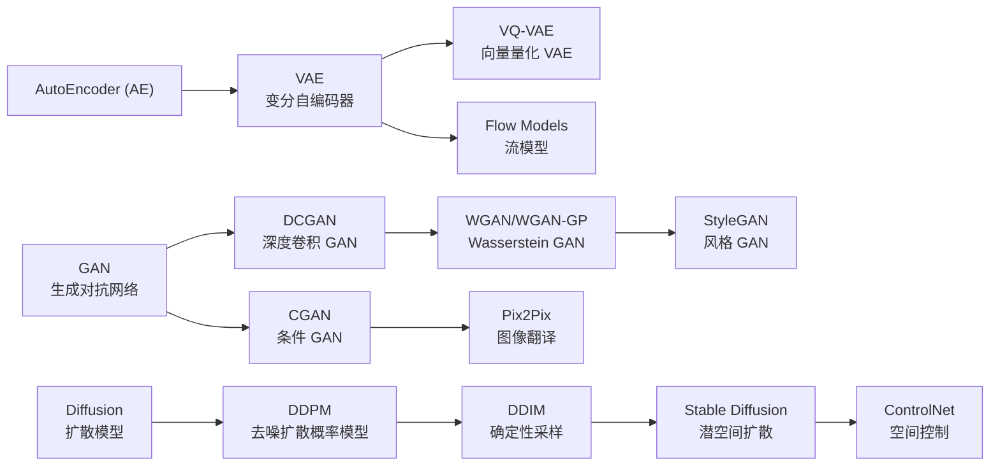
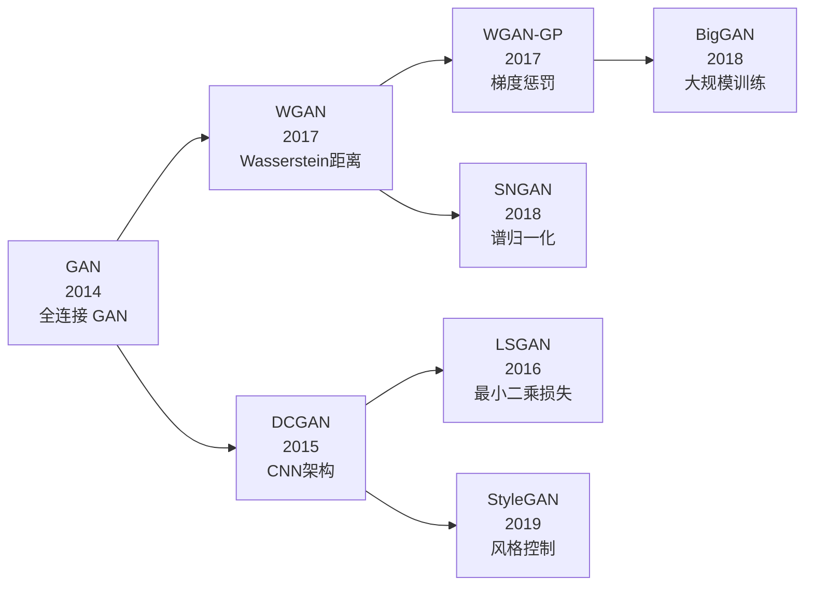
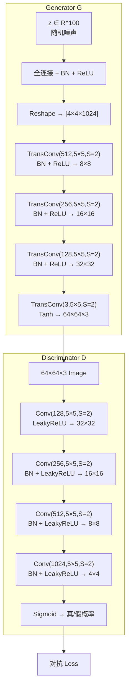
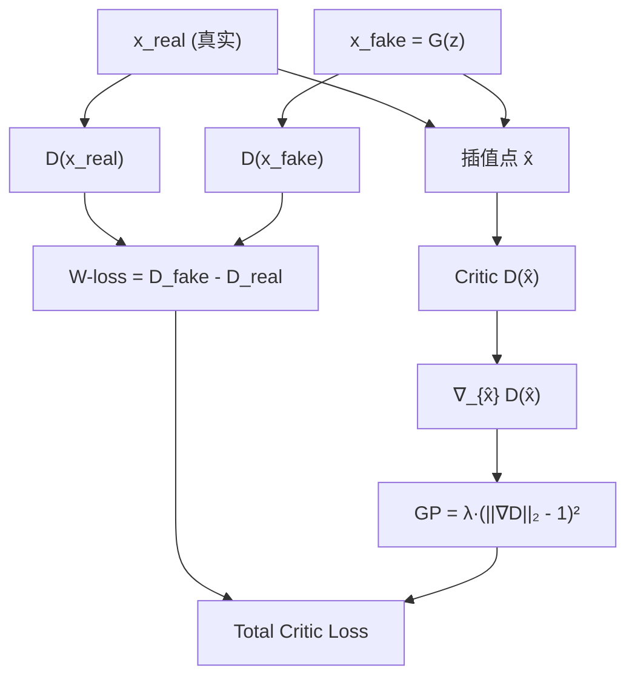

# DCGAN / WGAN

## 知识地图



## 前置知识

- **原始 GAN**：生成器 $G$ 和判别器 $D$ 的 minmax 博弈；$D$ 输出概率判断真假。
- **CNN 基础**：卷积层、转置卷积、BatchNorm、ReLU/LeakyReLU。
- **概率分布距离**：KL 散度、JS 散度的定义和局限性。
- **Lipschitz 连续**：函数输出变化有界——$\|f(x) - f(y)\| \leq L \|x - y\|$。

## 模型演化路线



| Model | Year | Key Innovation | Solved Problem |
|-------|------|----------------|----------------|
| GAN (原始) | 2014 | 对抗训练框架 | 开创隐式生成模型范式 |
| DCGAN | 2015 | CNN 架构替代全连接 | 提升图像质量，训练更稳定 |
| LSGAN | 2016 | 最小二乘损失 | 缓解梯度消失 |
| WGAN | 2017 | Wasserstein 距离 | JS 散度梯度消失问题 |
| WGAN-GP | 2017 | 梯度惩罚 | WGAN 权重裁剪不稳定 |
| SNGAN | 2018 | 谱归一化 | 全局 1-Lipschitz 约束 |

## 为什么会出现 (Why)

### DCGAN 为什么出现

原始 GAN (2014) 使用全连接网络，生成图像质量差、分辨率低（如 MNIST 级别的 28x28）。**核心问题不是 GAN 的思路不对，而是架构不合适**——全连接层无法捕捉图像的局部空间结构。DCGAN 把 CNN 引入 GAN，用卷积层学习层次化特征，用转置卷积从低维向量"上采样"出高分辨率图像。

### WGAN 为什么出现

JS 散度有一个致命缺陷：当真假分布 $P_r$ 和 $P_g$ 的支撑集不重叠时，JS 散度恒等于 $\log 2$，**梯度为 0**。在高维空间中，两个低维流形几乎必然不重叠——所以 GAN 训练初期，$D$ 可以完美区分真假，但 $G$ 收不到任何有用的梯度信号。WGAN 用 Wasserstein 距离替代 JS 散度——它即使在分布完全分离时也提供平滑梯度。

## 解决什么问题 (Problem)

| 模型 | 解决的核心问题 |
|------|-------------|
| DCGAN | GAN 生成图像质量差——引入 CNN 架构，用转置卷积上采样，BN 稳定训练 |
| WGAN | JS 散度梯度消失——用 Wasserstein 距离提供平滑梯度 |
| WGAN-GP | WGAN 权重裁剪训练不稳定——用梯度惩罚实现 Lipschitz 约束 |

## 核心思想 (Core Idea)

- **DCGAN**：用卷积神经网络（CNN）替代全连接层构建 GAN 的生成器和判别器，大幅提升图像质量和训练稳定性。
- **WGAN**：用 Wasserstein 距离（推土机距离）替代 JS 散度作为分布距离度量，解决梯度消失问题。

---

## DCGAN (Deep Convolutional GAN)

### 数学模型

DCGAN 的数学形式与原始 GAN 相同（minmax 博弈），核心变化在**架构**而非数学：

$$
\min_G \max_D \mathbb{E}_{x \sim P_r}[\log D(x)] + \mathbb{E}_{z \sim P_z}[\log(1 - D(G(z)))]
$$

**通俗解释：** $D$ 想给真图打高分（$\log D(x)$ 大）、给假图打低分（$\log(1-D(G(z)))$ 大）；$G$ 想骗 $D$ 给它生成的图打高分。训练时两者交替上升。

### 架构设计准则

1. 用 **stride 卷积替代池化**（下采样）
2. 用 **转置卷积**上采样
3. 生成器用 **ReLU**（输出层 Tanh），判别器用 **LeakyReLU**
4. 全部使用 **Batch Normalization**（除了 G 输出层和 D 输入层）

### 生成器架构

```
z (100) → FC → reshape[4×4×1024]
→ TransConv(512, 5×5, S=2) → BN + ReLU
→ TransConv(256, 5×5, S=2) → BN + ReLU
→ TransConv(128, 5×5, S=2) → BN + ReLU
→ TransConv(3, 5×5, S=2) → Tanh → [64×64×3]
```

$z \in \mathbb{R}^{100}$ 的 100 维噪声向量，经过一系列转置卷积逐步"放大"为 64x64 的彩色图像。

---

## WGAN (Wasserstein GAN)

### 动机：GAN 训练不稳定的根源

原始 GAN 的 JS 散度在两个分布不重叠时恒为 $\log 2$（梯度消失）。WGAN 用 **Wasserstein 距离**（推土机距离）替代 JS 散度。

### Wasserstein 距离

$$W(P_r, P_g) = \inf_{\gamma \in \Pi(P_r, P_g)} \mathbb{E}_{(x,y)\sim \gamma}[\|x - y\|]$$

**通俗解释：** 把分布 $P_g$ 想象成一堆土，分布 $P_r$ 想象成需要填平的坑。Wasserstein 距离就是把土搬运到坑里的"最小总工作量"（每单位土搬运距离 x 搬运量）。不管两堆相距多远，搬运工作量都能告诉你距离。不像 JS 散度——两堆土不贴在脸上就说"它们完全不同，无法判断谁更远"。

直观理解：将分布 $P_g$ "搬运"成分布 $P_r$ 的最小成本。

### Kantorovich-Rubinstein 对偶

$$W(P_r, P_g) = \sup_{\|f\|_L \leq 1} \mathbb{E}_{x\sim P_r}[f(x)] - \mathbb{E}_{\tilde{x}\sim P_g}[f(\tilde{x})]$$

**通俗解释：** 原始 Wasserstein 定义中的 inf（在所有联合分布中找最省力的搬运方案）没法直接算。Kantorovich-Rubinstein 对偶把它变成 sup（在所有 1-Lipschitz 函数中找最能区分真假的评分函数）。这个 sup 的形式可以直接用神经网络优化。

其中 $f$ 是 1-Lipschitz 函数，由**判别器**（称为 Critic）学习。

### WGAN 损失

**Critic**：

$$L_c = \mathbb{E}_{\tilde{x}\sim P_g}[D(\tilde{x})] - \mathbb{E}_{x\sim P_r}[D(x)]$$

**通俗解释：** Critic 想最大化假图得分与真图得分的差。真图分低、假图分高说明判别差，所以 $D(x)$ 应该大、$D(\tilde{x})$ 应该小。

**Generator**：

$$L_G = -\mathbb{E}_{\tilde{x}\sim P_g}[D(\tilde{x})]$$

**通俗解释：** Generator 想让 Critic 给自己打高分。注意这里没有 log，因为 $D$ 输出的是评分（实数），不是概率。

### Lipchitz 约束实现

**WGAN** (原始)：权重裁剪到 $[-c, c]$

**通俗解释：** 每更新一次 Critic，就把它的所有权重硬压进 $[-0.01, 0.01]$。简单粗暴，但参数被挤到边界上，梯度分布极差。

**WGAN-GP** (梯度惩罚)：

$$L_{GP} = \lambda \cdot \mathbb{E}_{\hat{x}} \left[ (\|\nabla_{\hat{x}} D(\hat{x})\|_2 - 1)^2 \right]$$

**通俗解释：** 不硬砍权重了。在真假图的连线上采样点 $\hat{x}$，要求 Critic 的梯度范数刚好 = 1——不快不慢地变化。偏离 1 就罚。这样 Lipschitz 约束是"学"出来的而非"砍"出来的。

在真实样本和生成样本的连线上采样 $\hat{x}$，约束梯度范数接近 1。

---

## 模型结构图

### DCGAN 架构



### WGAN-GP 梯度惩罚流程



---

## 可视化展示

### GAN vs WGAN 训练 Loss 对比

```echarts
return {
  tooltip: { trigger: "axis", confine: true },
  title: { top: 5,  text: 'GAN vs WGAN: Generator Loss 曲线', left: 'center', textStyle: { fontSize: 12 } },
  xAxis: { type: 'category', data: ['Epoch 0', 'Epoch 20', 'Epoch 50', 'Epoch 100', 'Epoch 150', 'Epoch 200'] },
  yAxis: { type: 'value', name: 'Loss' },
  legend: { top: 28,  data: ['GAN-G Loss', 'WGAN-G Loss'] },
  grid: { left: 60, right: 20, top: 55, bottom: 55 },
  series: [
    { name: 'GAN-G Loss', type: 'line', data: [5.2, 4.8, 4.2, 0.9, 0.8, 0.8], smooth: true, itemStyle: { color: '#e74c3c' },
      markLine: { data: [{ type: 'average', name: '突然下降(模式坍塌)' }], silent: true }
    },
    { name: 'WGAN-G Loss', type: 'line', data: [5.0, 4.0, 3.0, 1.5, 0.8, 0.3], smooth: true, itemStyle: { color: '#2980b9' } }
  ]
}
```

GAN 的 Generator Loss 突然骤降通常意味着模式坍塌——Generator 找到了一个欺骗 D 的捷径；WGAN 的 Loss 平滑下降，反映了真实的 Wasserstein 距离。

---

## 最小可运行代码

### DCGAN Generator (PyTorch)

```python
import torch
import torch.nn as nn

class DCGANGenerator(nn.Module):
    def __init__(self, latent_dim=100, img_channels=3):
        super().__init__()
        self.main = nn.Sequential(
            # input: [B, 100, 1, 1] -> [B, 512, 4, 4]
            nn.ConvTranspose2d(latent_dim, 512, 4, 1, 0, bias=False),
            nn.BatchNorm2d(512), nn.ReLU(True),
            # [B, 512, 4, 4] -> [B, 256, 8, 8]
            nn.ConvTranspose2d(512, 256, 4, 2, 1, bias=False),
            nn.BatchNorm2d(256), nn.ReLU(True),
            # [B, 256, 8, 8] -> [B, 128, 16, 16]
            nn.ConvTranspose2d(256, 128, 4, 2, 1, bias=False),
            nn.BatchNorm2d(128), nn.ReLU(True),
            # [B, 128, 16, 16] -> [B, 64, 32, 32]
            nn.ConvTranspose2d(128, 64, 4, 2, 1, bias=False),
            nn.BatchNorm2d(64), nn.ReLU(True),
            # [B, 64, 32, 32] -> [B, 3, 64, 64]
            nn.ConvTranspose2d(64, img_channels, 4, 2, 1, bias=False),
            nn.Tanh()
        )

    def forward(self, z):
        return self.main(z.unsqueeze(-1).unsqueeze(-1))
```

### DCGAN Discriminator (PyTorch)

```python
class DCGANDiscriminator(nn.Module):
    def __init__(self, img_channels=3):
        super().__init__()
        self.main = nn.Sequential(
            # [B, 3, 64, 64] -> [B, 64, 32, 32]
            nn.Conv2d(img_channels, 64, 4, 2, 1, bias=False),
            nn.LeakyReLU(0.2, inplace=True),
            # [B, 64, 32, 32] -> [B, 128, 16, 16]
            nn.Conv2d(64, 128, 4, 2, 1, bias=False),
            nn.BatchNorm2d(128), nn.LeakyReLU(0.2, inplace=True),
            # [B, 128, 16, 16] -> [B, 256, 8, 8]
            nn.Conv2d(128, 256, 4, 2, 1, bias=False),
            nn.BatchNorm2d(256), nn.LeakyReLU(0.2, inplace=True),
            # [B, 256, 8, 8] -> [B, 512, 4, 4]
            nn.Conv2d(256, 512, 4, 2, 1, bias=False),
            nn.BatchNorm2d(512), nn.LeakyReLU(0.2, inplace=True),
            # [B, 512, 4, 4] -> [B, 1, 1, 1]
            nn.Conv2d(512, 1, 4, 1, 0, bias=False),
            nn.Sigmoid()
        )

    def forward(self, x):
        return self.main(x).view(-1, 1)
```

### WGAN-GP 训练步骤 (PyTorch)

```python
def train_wgan_gp(G, D, dataloader, device,
                  latent_dim=100, lambda_gp=10,
                  n_critic=5, lr=1e-4):
    """WGAN-GP 训练循环"""
    opt_G = torch.optim.Adam(G.parameters(), lr=lr, betas=(0, 0.9))
    opt_D = torch.optim.Adam(D.parameters(), lr=lr, betas=(0, 0.9))

    for real_imgs, _ in dataloader:
        real_imgs = real_imgs.to(device)
        B = real_imgs.size(0)

        # ---- Train Critic (n_critic 次) ----
        for _ in range(n_critic):
            z = torch.randn(B, latent_dim, device=device)
            fake_imgs = G(z)

            # Critic loss
            d_loss = D(fake_imgs).mean() - D(real_imgs).mean()

            # Gradient penalty
            epsilon = torch.rand(B, 1, 1, 1, device=device)
            interpolates = epsilon * real_imgs + (1 - epsilon) * fake_imgs.detach()
            interpolates.requires_grad_(True)
            d_interpolates = D(interpolates)
            gradients = torch.autograd.grad(
                outputs=d_interpolates, inputs=interpolates,
                grad_outputs=torch.ones_like(d_interpolates),
                create_graph=True, retain_graph=True)[0]
            gp = lambda_gp * ((gradients.view(B, -1).norm(2, dim=1) - 1) ** 2).mean()

            opt_D.zero_grad()
            (d_loss + gp).backward()
            opt_D.step()

        # ---- Train Generator ----
        z = torch.randn(B, latent_dim, device=device)
        g_loss = -D(G(z)).mean()
        opt_G.zero_grad()
        g_loss.backward()
        opt_G.step()
```

---

## 工业界应用

| 应用领域 | 使用模型 | 为什么 | 知名产品/项目 |
|---------|---------|-------|-------------|
| 图像生成 | DCGAN | CNN 提升了基础生成质量 | 早期学术实验基准 |
| 稳定训练框架 | WGAN-GP | 提供平滑梯度，避免模式坍塌 | 大多数 GAN 论文的 baseline |
| 人脸生成 | DCGAN + WGAN-GP | 稳定训练 + 面部特征学习 | 早期人脸生成研究 |
| 数据增强 | DCGAN | 简单高效的样本生成 | Kaggle 竞赛常用 |
| 风格迁移 | DCGAN 架构 | 编码-解码对称结构 | CycleGAN (基于 DCGAN) |
| 超分辨率 | WGAN-GP | 感知损失 + 稳定训练 | ESRGAN |

---

## 对比表格

### DCGAN vs WGAN(-GP)

| | DCGAN | WGAN-GP |
|------|-------|---------|
| 损失含义 | 真假概率 (交叉熵) | Wasserstein 距离 (得分) |
| 训练稳定性 | 需仔细调参 | 稳定 |
| Mode Collapse | 常见 | 较少 |
| 收敛指示 | 不明确 | Loss 越小越好 |
| Lipschitz 约束 | 无 | 梯度惩罚 |
| 判别器输出 | [0, 1] 概率 | 实数 (评分) |
| 判别器名称 | Discriminator | Critic |

### DCGAN 训练技巧 vs 原始 GAN

| 技巧 | 作用原理 |
|------|---------|
| 转置卷积替代上采样+卷积 | 端到端学习上采样核，保留梯度流 |
| BatchNorm (G和D) | 减少内部协变量偏移，加速收敛 |
| ReLU (G) / LeakyReLU (D) | 避免死神经元，LeakyReLU 给负值留梯度 |
| Tanh (G 输出) | 将像素值压缩到 [-1, 1]，匹配归一化数据 |
| strided conv 替代池化 | 让网络自己学下采样方式，非固定池化 |
| Adam (β1=0.5) | 低动量适合 GAN 的震荡训练 |

---

## 学完后建议继续学习

1. **WGAN-GP 深刻理解** — 学习梯度惩罚的数学原理和为什么它在真-假连线上采样。
2. **SNGAN (谱归一化 GAN)** — 另一种实现 1-Lipschitz 约束的方法，与 WGAN-GP 互补。
3. **StyleGAN / StyleGAN2** — DCGAN 架构 + WGAN-GP 训练哲学的集大成者，图像生成的艺术巅峰。
4. **扩散模型 (DDPM)** — 理解为什么扩散最终超越了 GAN，以及两者在训练哲学上的差异。
5. **BigGAN** — 将 WGAN-GP 的稳定训练推向大规模，证明 GAN 也能 scaling。

---

## 高频面试题

### Q1: DCGAN 相比原始 GAN 最重要的架构改进是什么？为什么这些改进有效？

**标准答案：**
1. **用 CNN 替代全连接**：全连接层把所有像素当成独立的，忽略图像的 2D 空间结构（相邻像素具有相关性）。CNN 的局部感受野和权重共享捕捉了空间模式。
2. **转置卷积替代上采样**：转置卷积学习最优的上采样核，而非固定插值（如双线性），生成质量更高。
3. **BatchNorm**：GAN 中每轮 Generator 和 Discriminator 的输入分布都在变（因为它们互相追逐）。BN 将每层输入归一化，减少这种"移动靶标"效应，加速收敛。
4. **ReLU (G) / LeakyReLU (D)**：ReLU 在 G 中提供稀疏激活（避免模糊）；LeakyReLU 给负输入保留微小梯度，避免 D 死掉。

### Q2: 解释 Wasserstein 距离相比 JS 散度的优势。为什么 WGAN 的 Critic 输出是实数而非概率？

**标准答案：**
JS 散度在 $P_r$ 和 $P_g$ 支撑集不重叠时恒等于 $\log 2$（常数导数为 0），Generator 收不到有用梯度。Wasserstein 距离衡量"搬运土的最小成本"——两堆土相距 1 米和相距 1000 米，搬运成本不同，即使它们完全不重叠。因此 Wasserstein 距离在任何时候都能提供平滑有意义的梯度信号。

Critic 输出是实数（不是概率）是因为 WGAN 不再做真假分类。Critic 本质上是一个评分函数 $f$，最大化 $\mathbb{E}_{P_r}[f] - \mathbb{E}_{P_g}[f]$ 来逼近 Wasserstein 距离。这里的 $f$ 输出是一个"真实性评分"而非概率。去掉 sigmoid 避免了梯度饱和——这是 WGAN 训练更稳定的另一个原因。

### Q3: WGAN 的权重裁剪 (weight clipping) 和 WGAN-GP 的梯度惩罚有什么区别？

**标准答案：**
- **权重裁剪**：在每个 Critic 更新后，将所有权重硬性夹紧到 $[-c, c]$（通常 $c=0.01$）。问题：(1) $c$ 的选择极其敏感——太大约束无效，太小 Critic 表达能力不足；(2) 权重被推向 ±c 边界，导致梯度集中在极端值，训练震荡。
- **梯度惩罚**：不对权重做硬约束。在真假样本连线的随机点上，计算 Critic 对该点的梯度范数，惩罚其偏离 1。这软性地施加 Lipschitz 约束——相当于告诉 Critic "在真假之间的任何地方，评分变化应该匀速"。数学上，1-Lipschitz 函数的梯度范数几乎处处 ≤ 1，而最优 Critic 的梯度范数在真-假连线上恰好 = 1。

### Q4: 为什么 DCGAN 中 Generator 输出层用 Tanh 而不用 Sigmoid？

**标准答案：**
Tanh 输出范围为 $[-1, 1]$，对应预处理时图像像素被归一化到 $[-1, 1]$。Tanh 相比 Sigmoid 有两个优势：(1) 关于 0 对称——与 BN 归一化后的数据分布一致，梯度流动更均衡；(2) 梯度更强——Tanh 中心区域梯度约 1，而 Sigmoid 最大梯度仅 0.25。如果图像归一化到 $[0, 1]$，则用 Sigmoid。

### Q5: 什么是模式坍塌 (Mode Collapse)？WGAN-GP 如何缓解？

**标准答案：**
模式坍塌指 Generator 只生成数据分布中的少数几个模式（如只生成数字"1"，不管 $z$ 怎么变），丧失了多样性。原因是 Generator 找到了一个能持续欺骗 Discriminator 的捷径——当 Discriminator 被这个模式骗过后，Generator 没有动力去探索其他模式。

WGAN-GP 通过三条途径缓解：(1) Wasserstein 距离是平滑的——当 Generator 只生成一种模式时，Critic 的评分会持续下降（而非饱和），持续给 Generator 正确的梯度方向；(2) 梯度惩罚让 Critic 在所有位置梯度范数接近 1，不会在某个区域"彻底放弃"而给 Generator 零梯度；(3) Critic 训练多步（通常 $n_{critic}=5$）后再更新一次 Generator，确保 Critic 始终逼近最优，给 Generator 更准确的梯度方向。
