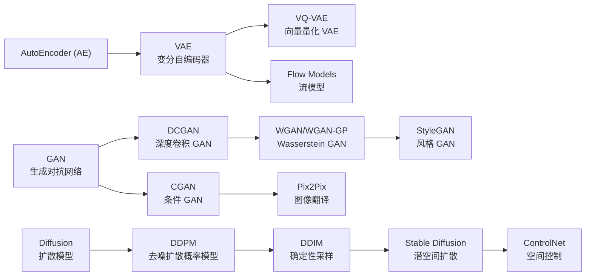
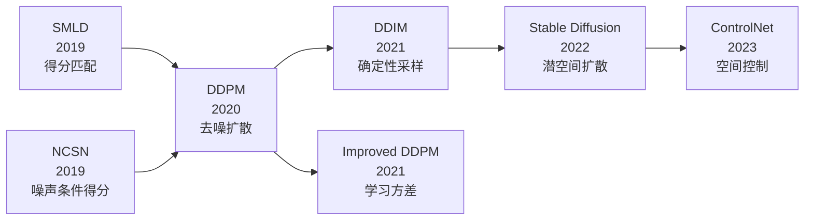
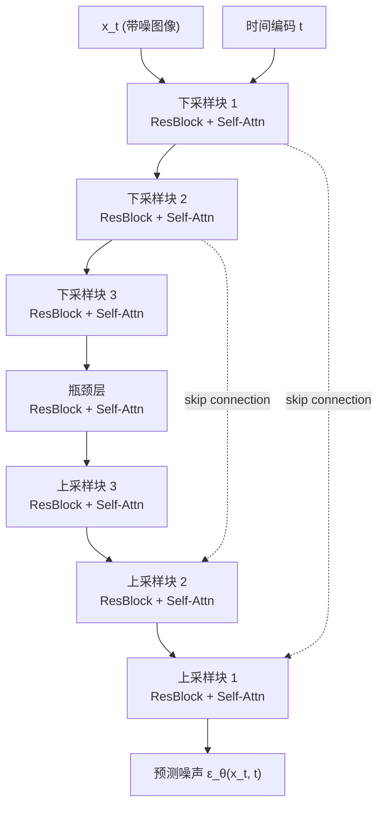

# DDPM / DDIM (扩散模型)

## 知识地图



## 前置知识

- **马尔可夫链**：序列中每个状态仅依赖于前一个状态。DDPM 的前向和反向过程都是马尔可夫链。
- **高斯分布与重参数化**：$x = \mu + \sigma \epsilon$ 使采样可导，扩散模型大量使用。
- **VAE 的 ELBO**：DDPM 的损失函数也可以从变分下界推导出来，与 VAE 有深层联系。
- **U-Net 架构**：DDPM 使用 U-Net 预测噪声，跳跃连接保留细节信息。
- **概率论基础**：条件概率 $q(x_t|x_{t-1})$、$p(x_{t-1}|x_t)$。

## 模型演化路线



| Model | Year | Key Innovation | Solved Problem |
|-------|------|----------------|----------------|
| SMLD / NCSN | 2019 | 得分匹配 + 朗之万动力学 | 用梯度场指导生成 |
| DDPM | 2020 | 前向加噪 + 反向预测噪声 | 统一扩散-去噪框架，高质量生成 |
| Improved DDPM | 2021 | 学习方差 + 余弦噪声调度 | 提升似然和采样效率 |
| DDIM | 2021 | 非马尔可夫前向 + 确定性采样 | 采样加速（1000 步->50 步） |
| LDM / Stable Diffusion | 2022 | 潜空间扩散 | 高分辨率生成可行 |

## 为什么会出现 (Why)

在 DDPM (2020) 之前，生成模型的主流是 GAN。GAN 生成质量高但训练不稳定（模式坍塌、梯度消失），VAE 稳定但生成模糊。

扩散模型提供了一条全新的路径：**不通过对抗训练，而是学习"去噪"——把纯噪声逐步还原为清晰图像**。这个思路的灵感来自于非平衡热力学：如果定义一个逐步加噪的前向过程，其反向过程自然就是去噪。只要前向过程设计得当，反向过程理论上可解，只需学习每一步的"去噪方向"。

DDPM 在 2020 年证明：这个简单的"预测噪声 - 去噪"循环可以生成与 GAN 匹敌、甚至更高质量的图像，且训练极其稳定。

DDIM 进一步解决：DDPM 的采样太慢（1000 步），通过去除非马尔可夫约束实现几十步采样。

## 解决什么问题 (Problem)

| 模型 | 解决的核心问题 |
|------|-------------|
| DDPM | 提供一个训练稳定、生成质量高的生成模型新范式 |
| DDIM | DDPM 采样太慢（1000 步）——通过确定性采样大幅加速（50 步） |
| Improved DDPM | DDPM 似然不足——学习方差项 + 余弦调度 |

## 核心思想 (Core Idea)

- **DDPM**：定义一个逐步向数据加高斯噪声的前向过程，然后训练神经网络学习逆过程——从纯噪声逐步去噪恢复数据。
- **DDIM**：将去噪过程从随机（马尔可夫）改为确定性（非马尔可夫），用极少的步数（50-100 步）达到相当的生成质量。

---

## DDPM (Denoising Diffusion Probabilistic Models)

### 数学模型/公式

#### 前向过程 (Diffusion)

逐步向数据添加高斯噪声：

$$q(x_t \mid x_{t-1}) = \mathcal{N}(x_t; \sqrt{1 - \beta_t} x_{t-1}, \beta_t \mathbf{I})$$

**通俗解释：** 每一步都让图像模糊一点——把上一步图像 $x_{t-1}$ 缩放 ($\sqrt{1-\beta_t}$ 略小于 1），再混入少量高斯噪声（$\beta_t$ 很小）。重复 1000 次后，图像完全变成标准正态噪声。$\beta_t$ 控制每步加多少噪声，通常从 $10^{-4}$ 线性增加到 $0.02$。

$\beta_t$ 是噪声调度（noise schedule），通常从 $\beta_1=10^{-4}$ 线性增加到 $\beta_T=0.02$。

**重参数化 — 任意时间步一步采样**：

$$x_t = \sqrt{\bar{\alpha}_t} x_0 + \sqrt{1 - \bar{\alpha}_t} \epsilon, \quad \epsilon \sim \mathcal{N}(0, I)$$

**通俗解释：** 这是 DDPM 最有用的公式！不需要逐步加噪——给定原始图像 $x_0$，可以一步跳到第 $t$ 步的 $x_t$。$\bar{\alpha}_t$ 是 $t$ 步后保留的原始信号比例（初始接近 1，最后接近 0）。$\sqrt{\bar{\alpha}_t} x_0$ 是还剩下的信号，$\sqrt{1-\bar{\alpha}_t} \epsilon$ 是累积的噪声。

其中 $\alpha_t = 1 - \beta_t$，$\bar{\alpha}_t = \prod_{s=1}^{t} \alpha_s$。

#### 反向过程 (Denoising)

$$p_\theta(x_{t-1} \mid x_t) = \mathcal{N}(x_{t-1}; \mu_\theta(x_t, t), \Sigma_\theta(x_t, t))$$

**通俗解释：** 给你一张有噪声的图 $x_t$，网络预测"去噪一步后"的图应该是什么。$\mu_\theta$ 是预测的去噪图像均值，$\Sigma_\theta$ 是去噪的不确定性。训练目标就是让预测的 $\mu_\theta$ 尽可能接近真实的去噪均值。

#### 训练目标

简化后等价于预测添加的噪声：

$$L_{simple} = \mathbb{E}_{t, x_0, \epsilon} \left[ \|\epsilon - \epsilon_\theta(x_t, t)\|^2 \right]$$

**通俗解释：** 训练简单到令人发指——随机选一个时间步 $t$，给原图加噪声得到 $x_t$，让 U-Net 预测"我加了多少噪声"。预测的噪声 $\epsilon_\theta$ 和真实噪声 $\epsilon$ 的 MSE 就是 loss。就这么简单！

其中 $x_t = \sqrt{\bar{\alpha}_t} x_0 + \sqrt{1 - \bar{\alpha}_t} \epsilon$。

#### U-Net 预测器

$\epsilon_\theta$ 是 U-Net，输入 $x_t$ 和时间步 $t$（通过位置编码注入），输出预测的噪声。

---

## DDIM (Denoising Diffusion Implicit Models)

### 动机

DDPM 的反向过程是随机的且非常慢（$T=1000$ 步）。

### 核心创新：非马尔可夫前向过程

DDIM 重新定义了前向过程，使其不再是马尔可夫的，从而反向过程可以**确定性**且**大幅加速**。

### 确定性采样

$$x_{t-1} = \sqrt{\bar{\alpha}_{t-1}} \cdot \hat{x}_0 + \sqrt{1 - \bar{\alpha}_{t-1}} \cdot \epsilon_\theta(x_t, t)$$

**通俗解释：** 给定当前噪声图 $x_t$，先估计"去噪后的干净图" $\hat{x}_0$，然后把 $\hat{x}_0$ 重新加噪到时间步 $t-1$ 的水平。整个过程是确定性的——同一个 $x_T$ 永远生成同一张图。

$$\hat{x}_0 = \frac{x_t - \sqrt{1 - \bar{\alpha}_t} \epsilon_\theta(x_t, t)}{\sqrt{\bar{\alpha}_t}}$$

**通俗解释：** 这个公式从"当前噪声图 = 信号 + 噪声"的等式中解出原始信号。因为 $x_t = \sqrt{\bar{\alpha}_t} x_0 + \sqrt{1 - \bar{\alpha}_t} \epsilon$，移项即得 $x_0 = (x_t - \sqrt{1-\bar{\alpha}_t}\epsilon) / \sqrt{\bar{\alpha}_t}$。用预测的噪声 $\epsilon_\theta$ 替代真实噪声 $\epsilon$，得到估计 $\hat{x}_0$。

- **$\eta = 0$**：DDIM（确定性）——极少步数（~50 步）即可生成好图像
- **$\eta = 1$**：退化为 DDPM 的随机采样

---

## 模型结构图

### DDPM 训练与采样流程

```mermaid
%%{init: {'flowchart': {'nodeSpacing': 25, 'rankSpacing': 45}}}%%
graph TD
    subgraph Forward["前向过程 (固定, 不需要训练)"]
        X0["x_0 (原始图像)"] -->|"+ 少量噪声"| X1["x_1"]
        X1 -->|"再加噪声"| X2["x_2"]
        X2 -->|"... 重复 T 次"| XT["x_T ~ N(0, I)"]
    end

    subgraph Training["训练: 预测噪声"]
        X0_2["x_0"] -->|"采样 t ~ U(1,T)"| NOISE["加噪声: x_t = √ᾱ_t x_0 + √(1-ᾱ_t) ε"]
        NOISE --> UNET["U-Net ε_θ(x_t, t)"]
        UNET --> LOSS["L = ||ε - ε_θ(x_t, t)||²"]
    end

    subgraph Sampling["采样 (反向过程)"]
        NOISE_T["x_T ~ N(0, I)"] -->|"去噪一步"| XT_1["x_{T-1}"]
        XT_1 -->|"... 逐步去噪"| X1_REV["x_1"]
        X1_REV -->|"最后一步"| X0_OUT["x_0 (生成图像)"]
    end
```



### U-Net 预测噪声



---

## 可视化展示

### 前向扩散过程示意

```echarts
return {
  tooltip: { trigger: "axis", confine: true },
  title: { top: 5,  text: '扩散过程: 信号保留比例 ᾱ_t', left: 'center', textStyle: { fontSize: 12 } },
  xAxis: { type: 'category', data: ['t=0', 't=100', 't=250', 't=500', 't=750', 't=1000'] },
  yAxis: { type: 'value', min: 0, max: 1, name: 'ᾱ_t (信号保留比例)' },
  grid: { left: 60, right: 20, top: 55, bottom: 55 },
  series: [{
    type: 'line',
    data: [1.0, 0.88, 0.65, 0.30, 0.08, 0.0],
    smooth: true,
    areaStyle: { color: 'rgba(41, 128, 185, 0.3)' },
    itemStyle: { color: '#2980b9' }
  }],
  visualMap: {
    show: false,
    dimension: 0,
    pieces: [
      { lt: 1, color: '#2980b9' },
      { gte: 1, lt: 2, color: '#7fb3d8' },
      { gte: 2, lt: 3, color: '#bdc3c7' },
      { gte: 3, lt: 4, color: '#d5dbdb' },
      { gte: 4, lt: 5, color: '#e5e7e9' },
      { gte: 5, color: '#f2f3f4' }
    ]
  }
}
```

随着 $t$ 增加，原始信号的 $\bar{\alpha}_t$ 从 1 降到 0——图像逐渐从清晰变为纯噪声。

### DDPM vs DDIM 采样质量 (不同步数)

```echarts
return {
  tooltip: { trigger: "axis", confine: true },
  title: { top: 5,  text: 'DDPM vs DDIM: 采样步数 vs 生成质量 (FID)', left: 'center', textStyle: { fontSize: 12 } },
  xAxis: { type: 'category', data: ['T=10', 'T=20', 'T=50', 'T=100', 'T=200', 'T=1000'] },
  yAxis: { type: 'value', min: 0, max: 100, name: 'FID (越低越好)' },
  legend: { top: 28,  data: ['DDPM', 'DDIM'] },
  grid: { left: 60, right: 20, top: 55, bottom: 55 },
  series: [
    { name: 'DDPM', type: 'line', data: [90, 60, 25, 12, 6, 4], smooth: true, itemStyle: { color: '#e74c3c' } },
    { name: 'DDIM', type: 'line', data: [25, 12, 6, 5, 4.5, 4.2], smooth: true, itemStyle: { color: '#2980b9' } }
  ]
}
```

DDIM 在极短步数（10-50 步）下远优于 DDPM——这是它被 Stable Diffusion 等实际系统采用的原因。

---

## 最小可运行代码

### DDPM 核心组件 (PyTorch)

```python
import torch
import torch.nn as nn
import torch.nn.functional as F
import math

class DDPM:
    """DDPM 扩散过程管理"""
    def __init__(self, timesteps=1000, beta_start=1e-4, beta_end=0.02, device='cpu'):
        self.timesteps = timesteps
        self.device = device

        # 线性噪声调度
        self.betas = torch.linspace(beta_start, beta_end, timesteps).to(device)
        self.alphas = 1.0 - self.betas
        self.alpha_bars = torch.cumprod(self.alphas, dim=0)  # ᾱ_t

    def q_sample(self, x0, t, noise=None):
        """前向加噪: x_t = √ᾱ_t x_0 + √(1-ᾱ_t) ε"""
        if noise is None:
            noise = torch.randn_like(x0)
        alpha_bar = self.alpha_bars[t].view(-1, 1, 1, 1)
        return math.sqrt(alpha_bar) * x0 + math.sqrt(1 - alpha_bar) * noise

    def p_sample(self, model, x_t, t):
        """单步去噪 (DDPM)"""
        alpha = self.alphas[t].view(-1, 1, 1, 1)
        alpha_bar = self.alpha_bars[t].view(-1, 1, 1, 1)
        beta = self.betas[t].view(-1, 1, 1, 1)

        # 预测噪声
        eps_pred = model(x_t, t)

        # 估计 x_0
        x0_pred = (x_t - math.sqrt(1 - alpha_bar) * eps_pred) / math.sqrt(alpha_bar)

        # 计算均值
        coef1 = math.sqrt(alpha) * (1 - alpha_bar / alpha) / (1 - alpha_bar)
        coef2 = math.sqrt(alpha_bar / alpha) * beta / (1 - alpha_bar)
        mean = coef1 * x_t + coef2 * x0_pred

        if t[0] == 0:
            return mean

        # 加回随机噪声 (最后一步不用)
        noise = torch.randn_like(x_t)
        return mean + math.sqrt(beta) * noise

    def p_sample_loop(self, model, shape):
        """完整采样循环 (DDPM)"""
        model.eval()
        x = torch.randn(shape, device=self.device)
        for t in reversed(range(self.timesteps)):
            t_batch = torch.full((shape[0],), t, device=self.device, dtype=torch.long)
            x = self.p_sample(model, x, t_batch)
        return x


class DDIMSampler:
    """DDIM 确定性采样"""
    def __init__(self, ddpm, eta=0.0):
        self.ddpm = ddpm  # 复用 DDPM 的 alpha/beta 参数
        self.eta = eta

    def ddim_p_sample(self, model, x_t, t, t_prev):
        """DDIM 单步采样"""
        alpha_bar_t = self.ddpm.alpha_bars[t].view(-1, 1, 1, 1)
        alpha_bar_prev = self.ddpm.alpha_bars[t_prev].view(-1, 1, 1, 1)

        # 预测噪声
        eps_pred = model(x_t, t)

        # 估计 x_0
        x0_pred = (x_t - math.sqrt(1 - alpha_bar_t) * eps_pred) / math.sqrt(alpha_bar_t)

        # 确定性更新
        pred_dir = math.sqrt(1 - alpha_bar_prev) * eps_pred
        x_prev = math.sqrt(alpha_bar_prev) * x0_pred + pred_dir

        if self.eta > 0:
            # 可控随机性 (eta=1 退化为 DDPM)
            sigma = self.eta * math.sqrt(
                (1 - alpha_bar_prev) / (1 - alpha_bar_t)
                * (1 - alpha_bar_t / alpha_bar_prev)
            )
            x_prev = x_prev + sigma * torch.randn_like(x_prev)

        return x_prev

    def ddim_sample_loop(self, model, shape, num_steps=50):
        """DDIM 加速采样 (仅用 num_steps 步)"""
        model.eval()

        # 等距选取时间步
        step_indices = list(reversed(
            range(0, self.ddpm.timesteps, self.ddpm.timesteps // num_steps)
        ))

        x = torch.randn(shape, device=self.ddpm.device)
        for i in range(len(step_indices) - 1):
            t = torch.full((shape[0],), step_indices[i],
                          device=self.ddpm.device, dtype=torch.long)
            t_prev = torch.full((shape[0],), step_indices[i+1],
                               device=self.ddpm.device, dtype=torch.long)
            x = self.ddim_p_sample(model, x, t, t_prev)

        return x


class SimpleUNet(nn.Module):
    """简化版 U-Net 用于噪声预测"""
    def __init__(self, in_channels=3, base_channels=64, time_emb_dim=128):
        super().__init__()
        # 时间嵌入
        self.time_mlp = nn.Sequential(
            nn.Linear(1, time_emb_dim),
            nn.SiLU(),
            nn.Linear(time_emb_dim, time_emb_dim),
        )

        # 下采样
        self.down1 = nn.Conv2d(in_channels, base_channels, 3, padding=1)
        self.down2 = nn.Conv2d(base_channels, base_channels * 2, 3, stride=2, padding=1)
        self.down3 = nn.Conv2d(base_channels * 2, base_channels * 2, 3, stride=2, padding=1)

        # 中间层
        self.mid = nn.Conv2d(base_channels * 2, base_channels * 2, 3, padding=1)
        self.time_proj = nn.Linear(time_emb_dim, base_channels * 2)

        # 上采样
        self.up1 = nn.ConvTranspose2d(base_channels * 2, base_channels * 2, 4, stride=2, padding=1)
        self.up2 = nn.ConvTranspose2d(base_channels * 4, base_channels, 4, stride=2, padding=1)
        self.out = nn.Conv2d(base_channels * 2, in_channels, 3, padding=1)

    def forward(self, x, t):
        # 时间嵌入
        t = t.float().unsqueeze(-1) / 1000.0  # 归一化到 [0,1]
        t_emb = self.time_mlp(t).unsqueeze(-1).unsqueeze(-1)  # [B, C, 1, 1]

        # 下采样
        h1 = F.silu(self.down1(x))
        h2 = F.silu(self.down2(h1))
        h3 = F.silu(self.down3(h2))

        # 注入时间信息
        h3 = h3 + self.time_proj(t_emb.squeeze(-1).squeeze(-1)).unsqueeze(-1).unsqueeze(-1)

        # 中间处理
        h_mid = F.silu(self.mid(h3))

        # 上采样 + skip connection
        h_up1 = F.silu(self.up1(h_mid))
        h_up1 = torch.cat([h_up1, h2], dim=1)  # skip
        h_up2 = F.silu(self.up2(h_up1))
        h_up2 = torch.cat([h_up2, h1], dim=1)  # skip

        return self.out(h_up2)
```

---

## 工业界应用

| 应用领域 | 使用模型 | 为什么 | 知名产品/项目 |
|---------|---------|-------|-------------|
| 文生图 | DDPM + DDIM (潜空间) | 生成质量最高，训练稳定 | Stable Diffusion, DALL-E 2/3 |
| 图像编辑 | DDIM | 确定性采样保证可复现的编辑 | Imagen Editor, InstructPix2Pix |
| 视频生成 | DDPM 扩展 | 逐帧去噪保持时序一致性 | Sora (OpenAI), VideoPoet |
| 音频生成 | DDPM | 逐步去噪与音频波形生成天然契合 | AudioLDM, MusicLM |
| 3D 生成 | DDPM + NeRF | 去噪过程适配 3D 表示 | DreamFusion, 3D 扩散模型 |
| 分子构象生成 | DDPM | 3D 坐标的逐步细化 | AlphaFold 相关研究 |

---

## 对比表格

### DDPM vs DDIM

| 特性 | DDPM | DDIM |
|------|------|------|
| 采样步数 | 1000 | 50-100 |
| 采样方式 | 随机 | 确定性 / 随机 |
| 隐空间插值 | 不可控 | 可控（确定性使 x_T → Image 是函数映射） |
| 关键优势 | 质量最高（全步） | 速度快 20-50x |
| 马尔可夫性 | 是 | 否 |
| 每步时间 | 与 DDIM 相同 | 每步时间相同，步数少 |
| 实际应用 | 研究基准 | Stable Diffusion 等产品 |

### VAE vs GAN vs Diffusion

| 特性 | VAE | GAN (DCGAN/WGAN-GP) | Diffusion (DDPM/DDIM) |
|------|-----|---------------------|----------------------|
| 训练方式 | 最大化 ELBO | 对抗博弈 | 预测噪声 (MSE) |
| 训练稳定性 | 高 | 低-中（WGAN-GP 改善） | 高 |
| 生成质量 | 模糊 | 高 | 最高 |
| 生成速度 | 快（单次前向） | 快（单次前向） | 慢（多步迭代） |
| 模式覆盖 | 好（覆盖全部模式） | 差（模式坍塌） | 好 |
| 似然估计 | ELBO 近似 | 无 | 变分下界 |
| 隐空间 | 连续低维 | 连续低维 | 连续同维 |
| 可控性 | β-VAE 可解耦 | StyleGAN 可控制 | DDIM 可插值 |

---

## 学完后建议继续学习

1. **Stable Diffusion (Latent Diffusion)** — DDPM 在 VAE 潜空间中运行，大幅降低计算量，是文生图的核心技术。
2. **DDIM 深入** — 理解确定性采样的数学原理，以及为什么去掉马尔可夫约束可以加速采样。
3. **Score-Based Models (NCSN)** — 扩散模型的得分匹配视角，与 DDPM 等价的另一套理论。
4. **Classifier-Free Guidance (CFG)** — Stable Diffusion 实际使用的文本引导技术，$\hat{\epsilon} = \epsilon_{\text{uncond}} + w(\epsilon_{\text{cond}} - \epsilon_{\text{uncond}})$。
5. **ControlNet** — 在扩散模型上添加空间控制（线稿、骨架、深度图等）。

---

## 高频面试题

### Q1: DDPM 的前向过程和反向过程分别是什么？为什么前向过程不需要训练？

**标准答案：**
- **前向过程（加噪）**：从原始图像 $x_0$ 开始，每一步按 $q(x_t|x_{t-1}) = \mathcal{N}(x_t; \sqrt{1-\beta_t}x_{t-1}, \beta_t I)$ 逐步添加高斯噪声。这是一个固定过程——$\beta_t$ 是预定义的噪声调度（如线性从 $10^{-4}$ 到 $0.02$），不包含任何可学习参数。
- **反向过程（去噪）**：从纯噪声 $x_T \sim \mathcal{N}(0,I)$ 开始，用神经网络 $\epsilon_\theta$ 预测每一步添加的噪声，逐步去噪恢复 $x_0$。
- **为什么前向不要训练**：前向过程是人工设计的确定性变换，目的是把数据分布 $p_{\text{data}}$ 逐渐转化为 $\mathcal{N}(0,I)$。其参数 $\beta_t$ 是超参数而非学习参数。只有反向过程的噪声预测网络 $\epsilon_\theta$ 需要训练。

### Q2: DDPM 的简化训练目标 $L_{\text{simple}} = \|\epsilon - \epsilon_\theta(x_t, t)\|^2$ 是怎么推导出来的？

**标准答案：**
DDPM 的原始损失从变分下界（ELBO）出发，包含重建项、KL 项等复杂形式。Ho et al. (2020) 发现：
1. 如果把反向过程的方差 $\Sigma_\theta$ 固定为常数（如 $\beta_t$），则优化目标简化为预测均值 $\mu_\theta$。
2. 由于 $x_t = \sqrt{\bar{\alpha}_t}x_0 + \sqrt{1-\bar{\alpha}_t}\epsilon$，预测去噪均值和预测噪声是等价的——可以互相转换。
3. 经验发现直接预测噪声 $\epsilon$（而非 $x_0$ 或均值）效果最好，且形式最简单——就是 MSE。
4. 去掉 ELBO 中的权重项（不同 $t$ 的权重不同），只用均匀权重 $L_{\text{simple}}$，训练更稳定且生成质量更高。

### Q3: DDIM 为什么能比 DDPM 用更少步数采样？确定性采样的原理是什么？

**标准答案：**
DDPM 要求反向过程严格满足马尔可夫性（$x_{t-1}$ 仅依赖 $x_t$），这意味着每步的随机噪声是必须的——你需要 1000 次小的随机跳跃来近似真实的去噪路径。

DDIM 推广到非马尔可夫前向过程，发现反向过程可以写成：
$$x_{t-1} = \sqrt{\bar{\alpha}_{t-1}} \hat{x}_0 + \sqrt{1-\bar{\alpha}_{t-1}} \epsilon_\theta(x_t, t)$$

这个公式不依赖 $x_{t-1}$ 和 $x_t$ 之间的马尔可夫关系——它直接从估计的干净图像 $\hat{x}_0$ 重新"加噪"到任意更早的时间步。因此可以跳过大段的时间步（如从 t=1000 直接跳到 t=980、t=960...），只用 50 步甚至 10 步完成采样。当 $\eta=0$ 时，给定 $x_T$ 的生成结果完全确定（同一个种子永远生成同一张图），这对实际应用非常重要。

### Q4: DDPM 中 $\bar{\alpha}_t$ 的作用是什么？噪声调度 (noise schedule) 如何设计？

**标准答案：**
$\bar{\alpha}_t = \prod_{s=1}^{t} (1 - \beta_s)$ 表示 $t$ 步后原始信号保留的比例。$\bar{\alpha}_T \approx 0$ 时 $x_T \approx \mathcal{N}(0,I)$（加噪充分），$\bar{\alpha}_0 = 1$（无噪声）。

噪声调度 $\beta_t$ 的设计关键：
- **线性调度** (DDPM 原版)：$\beta_t$ 从 $10^{-4}$ 线性增加到 $0.02$。简单但后期加噪太快、前期太慢。
- **余弦调度** (Improved DDPM)：$\bar{\alpha}_t = \cos^2(\frac{t/T + s}{1 + s} \cdot \frac{\pi}{2})$，其中 $s=0.008$。中间 step 噪声变化线性，两端平缓——避免前几步和后几步信息被浪费。
- 设计原则：中间时间步应有充分的信号+噪声混合（$\bar{\alpha}_t \approx 0.5$），让网络有丰富的训练样本。

### Q5: 扩散模型和 VAE 有什么本质联系？

**标准答案：**
两者都基于变分推断优化 ELBO：
- VAE 用编码器 $q(z|x)$ 将 $x$ 压缩到低维隐变量 $z$，然后解码器 $p(x|z)$ 重建。KL 项约束 $z$ 靠近先验。
- 扩散模型可以看作一个**多步 VAE**——$T$ 个隐变量 $x_1, ..., x_T$，编码器是固定的加噪过程（无参数），解码器是逐步去噪的神经网络。区别在于：扩散的隐变量与数据同维（不做压缩）；编码器是固定的（非学习）；解码过程是 $T$ 步迭代（非常慢）。

也可以反过来说：VAE 是 1 步扩散模型。这解释了为什么 VAE 生成模糊（1 步太粗糙）而扩散模型生成精细（$T$ 步逐步细化）。
