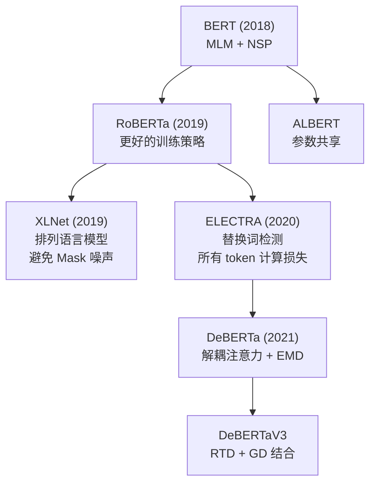
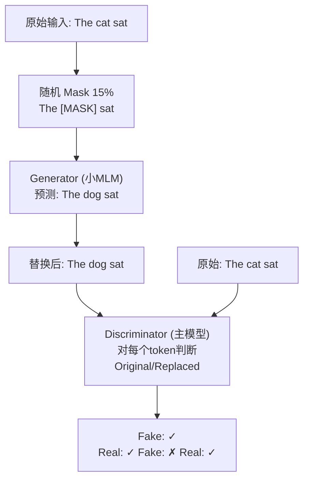
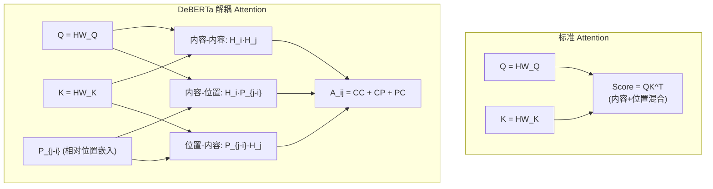

# DeBERTa / ELECTRA / XLNet

## 知识地图



## 前置知识

- **BERT 的 MLM (Masked Language Model)**：理解 15% token 被 [MASK] 替换，模型预测被 mask 的词
- **Transformer Encoder 架构**：理解 Self-Attention + FFN 的基本结构
- **相对位置编码**：理解位置编码分为绝对（为每个位置分配唯一编码）和相对（建模位置之间的差值）
- **生成器-判别器架构 (GAN 基础)**：了解两个网络协作训练的基本概念

## 为什么会出现 (Why)

BERT 的 MLM 预训练虽然有效，但有三个核心痛点：

1. **预训练-微调不一致 (Pretrain-Finetune Discrepancy)**：预训练时有 [MASK] token，但下游任务没有——模型看到的是"不真实"的数据。
2. **训练效率低**：MLM 只对 15% 的 token 计算损失，其余 85% 的 token 在预训练中"白费了"。
3. **位置和内容纠缠**：标准注意力将位置信息和内容信息混合投影，无法独立建模"词义"和"位置"。

三个改进方向分别解决这三个痛点：

- **XLNet** 解决痛点 1：排列语言模型（Permutation LM）——不引入 [MASK] 噪声，通过排列序列实现双向上下文
- **ELECTRA** 解决痛点 2：替换词检测（RTD）——对所有 token 做二分类判断是否被替换，训练信号密度是 MLM 的 ~6.7 倍
- **DeBERTa** 解决痛点 3：解耦注意力（Disentangled Attention）——内容和位置分别建模，让模型独立学习"词是什么"和"词在哪"

共同目标：**比 BERT 更高效地学习更好的上下文表示**。

## 解决什么问题 (Problem)

- **XLNet**：如何在保持自回归特性的同时实现真正的双向上下文，避免 [MASK] 噪声
- **ELECTRA**：如何在同等训练计算量下，让模型从更多 token 中学习
- **DeBERTa**：如何让注意力机制同时考虑"内容"和"相对位置"，而不是将两者混合

## 核心思想 (Core Idea)

**BERT 的 MLM 简单有效，但三个改进方向分别解决了不同痛点：DeBERTa 将位置编码解耦（内容-内容和内容-位置独立建模），ELECTRA 将 MLM 改写为替换词检测（对所有 token 计算损失而非仅 15%），XLNet 用排列语言模型实现真正的双向上下文（不引入 [MASK] 噪声）。**

---

## 数学公式

### DeBERTa — 解耦注意力

标准注意力将内容和位置混合投影。DeBERTa 将两者分离开：

$$
A_{ij} = \underbrace{\mathbf{H}_i \mathbf{H}_j^T}_{\text{内容-内容}} + \underbrace{\mathbf{H}_i (\mathbf{P}_{j-i})^T}_{\text{内容-位置}} + \underbrace{\mathbf{P}_{j-i} (\mathbf{H}_j)^T}_{\text{位置-内容}} + \dots
$$

位置编码 $\mathbf{P}_{j-i}$ 是相对位置嵌入。额外引入**增强掩码解码器**（EMD）——在 MLM 预训练时用 absolute position 帮助解码 masked token。

**通俗解释：** 标准注意力就像把"词的意思"和"词在第几号位"搅在一起打分。DeBERTa 把它们拆开——"这两个词意思相关吗？"(内容-内容) + "这个词在这个位置合适吗？"(内容-位置) + "这个位置一般放什么词？"(位置-内容)。拆开后模型能更精细地学习——例如"形容词后面通常是名词"是位置-内容关系，与具体是什么形容词无关。

### ELECTRA — 替换词检测

用两个网络：**Generator**（小型 MLM，BERT 的 1/4 大小）和 **Discriminator**（主模型）。

1. Generator 对 15% token 做 MLM → 生成替代词
2. Discriminator 对**所有 token** 做二分类：每个 token 是原始的还是 Generator 替换的

损失函数：

$$
\mathcal{L} = \mathcal{L}_{MLM}(G) + \lambda \cdot \mathcal{L}_{RTD}(D)
$$

关键效率提升：MLM 只对 15% token 监督，RTD 对所有 token 监督。同等训练下 ELECTRA 比 BERT 好得多。

**通俗解释：** BERT 的 MLM 像一个考试，100 道题中只考 15 道（80% 以上直接给答案），其他 85 道白做了。ELECTRA 换了考试方式——Generator 先尝试填 15 个空（可能填错），然后 Discriminator 要对所有 100 个 token 判断"这个 token 是原装的还是被 Generator 掉包了"。因为判断 100 个 token 的判断力需要理解整个句子，所以训练效率大幅提升。

### XLNet — 排列语言模型

对长度为 $T$ 的序列，随机采样一个排列 $\mathbf{z}$，按排列顺序预测：

$$
\max_\theta \mathbb{E}_{\mathbf{z} \sim \mathcal{Z}_T} \left[ \sum_{t=1}^{T} \log p_\theta(x_{z_t} | \mathbf{x}_{z_{<t}}) \right]
$$

**Two-Stream Self-Attention**：Content Stream（能看自己和上文）和 Query Stream（不能看自己的内容）——这是实现排列 LM 同时保持自回归特性的关键。

**通俗解释：** BERT 的做法是在句子里挖掉一些词，打上 [MASK] 标记让模型猜。这有个问题——实际使用时没有 [MASK]，模型在预训练和微调之间产生"落差"。XLNet 的做法更聪明：把句子的词序打乱（排列），然后按打乱后的顺序一个一个预测。例如排列后变成"喜欢 我 吃 苹果"，第一步预测"喜欢"时看不到后面三个词；第二步预测"我"时可以看"喜欢"……因为每一次排列顺序都不同，最终每个词都会在多个排列中"看到"其他所有词，实现了真正的双向上下文——没有用一个 [MASK]。

---

## 可视化展示

### ELECTRA 训练流程



### BERT 家族对比

```echarts
return {
  tooltip: { trigger: "axis", confine: true },
  title: { top: 5,  text: 'BERT 家族 GLUE 基准对比 (Base)', left: 'center', textStyle: { fontSize: 12 } },
  xAxis: { type: 'category', data: ['BERT', 'RoBERTa', 'XLNet', 'ELECTRA', 'DeBERTa'] },
  yAxis: { type: 'value', min: 78, max: 88, name: 'GLUE Avg Score' },
  series: [{
    type: 'bar',
    data: [79.6, 82.1, 83.1, 84.0, 86.8],
    itemStyle: { color: '#2c3e50' },
    label: { show: true, position: 'top' }
  }],
  grid: { left: 60, right: 20, top: 55, bottom: 55 }
}
```

DeBERTa 凭借解耦注意力 + EMD，在 BERT 家族中取得了最高的 GLUE 分数。

### DeBERTa 解耦注意力 vs 标准注意力



---

## 最小可运行代码

### PyTorch — ELECTRA Discriminator Head

```python
import torch
import torch.nn as nn

class ELECTRADiscriminator(nn.Module):
    def __init__(self, bert_encoder):
        super().__init__()
        self.encoder = bert_encoder  # 共享 BERT encoder 结构
        self.disc_head = nn.Linear(768, 1)  # 二分类头 (原始/替换)

    def forward(self, input_ids, attention_mask):
        # input_ids: generator 替换后的序列
        hidden = self.encoder(input_ids, attention_mask).last_hidden_state
        # [B, T, 768]
        logits = self.disc_head(hidden).squeeze(-1)  # [B, T]
        return logits  # 每个 token 的替换概率

    def loss_fn(self, logits, labels, attention_mask):
        """labels: 1=原始, 0=被替换"""
        loss = nn.functional.binary_cross_entropy_with_logits(
            logits, labels.float(), reduction='none')
        return (loss * attention_mask).sum() / attention_mask.sum()
```

### PyTorch — DeBERTa 解耦注意力

```python
class DisentangledSelfAttention(nn.Module):
    def __init__(self, dim, max_rel_pos=512):
        super().__init__()
        self.dim = dim
        self.max_rel_pos = max_rel_pos
        # 相对位置嵌入
        self.rel_embeddings = nn.Embedding(2 * max_rel_pos + 1, dim)

        self.q_proj = nn.Linear(dim, dim)
        self.k_proj = nn.Linear(dim, dim)
        self.v_proj = nn.Linear(dim, dim)
        self.out_proj = nn.Linear(dim, dim)

    def forward(self, hidden_states, attention_mask=None):
        B, N, D = hidden_states.shape
        Q = self.q_proj(hidden_states)
        K = self.k_proj(hidden_states)
        V = self.v_proj(hidden_states)

        # 内容-内容注意力
        content_score = torch.matmul(Q, K.transpose(-2, -1))

        # 内容-位置注意力 (简化: 仅计算相对位置偏置)
        rel_pos = self._get_rel_pos(N, hidden_states.device)
        rel_pos_emb = self.rel_embeddings(rel_pos)  # [N, N, D]
        pos_score = torch.einsum('bnd,bnmd->bnm', Q, rel_pos_emb.unsqueeze(0))

        attn = content_score + pos_score
        attn = attn / (D ** 0.5)

        if attention_mask is not None:
            attn = attn + attention_mask

        attn_weights = torch.softmax(attn, dim=-1)
        return self.out_proj(torch.matmul(attn_weights, V))

    def _get_rel_pos(self, length, device):
        """生成相对位置索引"""
        range_vec = torch.arange(length, device=device)
        rel_pos = range_vec.unsqueeze(0) - range_vec.unsqueeze(1)
        rel_pos = torch.clamp(rel_pos, -self.max_rel_pos, self.max_rel_pos)
        return rel_pos + self.max_rel_pos
```

---

## 工业界应用

| 应用场景 | 模型 | 说明 |
|----------|------|------|
| 文本分类 | DeBERTa | 高精度文本分类和理解任务 |
| 自然语言推理 (NLI) | DeBERTa + MNLI | 前提-假设关系判断 |
| 信息检索 | ELECTRA | 高效文本编码 + 检索 |
| 问答系统 | XLNet + SQuAD | 上下文敏感的答案抽取 |
| 序列标注 (NER) | DeBERTa | 命名实体识别 |
| 语义相似度 | ELECTRA | 句子对匹配 |

## 对比表格

### BERT vs RoBERTa vs XLNet vs ELECTRA vs DeBERTa

| 特性 | BERT | RoBERTa | XLNet | ELECTRA | DeBERTa |
|------|------|---------|-------|---------|---------|
| 预训练任务 | MLM + NSP | MLM (无 NSP) | Permutation LM | RTD (替换检测) | MLM + RTD + EMD |
| 训练信号密度 | 15% | 15% | 100% (所有排列) | **100% (所有 token)** | 混合 |
| [MASK] 噪声 | 有 | 有 | **无** | 有 (在 Generator) | 有 |
| 位置编码 | 绝对 | 绝对 | 相对 | 绝对 | **解耦相对** |
| 注意力类型 | 标准 | 标准 | Two-Stream | 标准 | **解耦注意力** |
| Base GLUE Avg | 79.6 | 82.1 | 83.1 | 84.0 | **86.8** |
| 训练效率 | 低 | 低 | 中 | **高** | 中 |
| 核心创新 | 双向预训练 | 更好的训练策略 | 排列 LM | 替换词检测 | 解耦注意力 |

### 关键机制对比

| 机制 | BERT MLM | XLNet Permutation LM | ELECTRA RTD | DeBERTa DA |
|--------|----------|---------------------|-------------|------------|
| 本质 | 完形填空 | 打乱顺序重排 | 真假辨别 | 内容-位置分离 |
| 是否有 [MASK] | 是 | 否 | 是 (但 Discriminator 不看 [MASK]) | 是 (EMD 中) |
| 训练信号利用率 | ~15% | ~100% | **100%** | 取决于配置 |
| 双向性来源 | 直接双向 | 排列平均 → 近似双向 | 双向 Encoder | 双向 Encoder |
| 额外开销 | 无 | Two-Stream (2× 注意力量) | Generator (小模型) | 解耦计算 |

---

## 学完后建议继续学习

1. **DeBERTaV3** — 将 ELECTRA 的 RTD 与 DeBERTa 的解耦注意力结合，使用梯度解耦嵌入共享 (GDES)
2. **RoBERTa** — 详细理解 BERT 训练策略优化（更大 batch、更长训练、动态 masking）
3. **ALBERT** — 理解参数共享和因子分解嵌入在减少参数量方面的应用
4. **ModernBERT / DeBERTa-v3-base** — 了解 2024 年最新的 Encoder 模型进展
5. **Encoder vs Decoder 架构选择** — 理解何时用 BERT-like encoder 而非 GPT-like decoder

## 高频面试题

### Q1: BERT 的 MLM 有什么缺点？XLNet 如何解决？

**标准答案：**
BERT MLM 的主要缺点：
1. **预训练-微调不一致**：预训练有 [MASK] token，下游任务没有——模型训练时看到的数据分布与实际使用不同
2. **独立性假设**：BERT 假设被 mask 的 token 之间相互独立预测（如 "the [MASK] [MASK]" 中两个 [MASK] 分别预测），忽略它们之间的依赖关系
3. **训练信号稀疏**：只有 15% token 有监督信号

XLNet 的解决方案——**排列语言模型 (Permutation LM)**：
- 对输入序列随机采样排列（如 1→3→2→4），按排列顺序自回归预测
- 不引入 [MASK]：输入始终是原始 token，通过 attention mask 控制可见性
- 双向性：不同排列中每个 token 都能"看到"所有其他 token（平均效果等于双向）
- 保留依赖：自回归预测天然保留了 token 之间的依赖关系

代价是使用 Two-Stream Self-Attention（Content Stream + Query Stream），计算量大约是 BERT 的 2 倍。

### Q2: ELECTRA 为什么比 BERT 训练效率高？Generator 和 Discriminator 分别做什么？

**标准答案：**
ELECTRA 训练效率高的核心原因：**训练信号密度**。

- BERT MLM：只对 15% 的 token 计算损失（且其中 10% 保持原样、10% 替换为随机词），实际上有效学习信号仅约 ~12%
- ELECTRA RTD：Discriminator 对**所有 token** 做二分类判断是否被替换，训练信号利用率 100%，是 BERT 的 ~6.7 倍

Generator 和 Discriminator 的角色：
- **Generator**（小型 MLM，通常为 Discriminator 的 1/4 大小）：接收被 mask 的输入，预测被 mask 的 token；将预测结果与原始 token 混合形成"被污染的序列"
- **Discriminator**（主模型，最终使用的模型）：接收被污染的序列，对每个 token 判断它是原始的还是被 Generator 替换的

训练完成后只保留 Discriminator，Generator 被丢弃。

### Q3: DeBERTa 的解耦注意力 (Disentangled Attention) 是什么？相比标准注意力有什么优势？

**标准答案：**
DeBERTa 的解耦注意力将标准注意力分解为两个独立分量：

标准注意力：$A_{ij} = H_i W^Q (H_j W^K)^T$——内容和位置信息被混合编码在 $H$ 中。

解耦注意力：$A_{ij} = H_i H_j^T + H_i P_{j-i}^T + P_{j-i} H_j^T + \dots$
- **内容-内容 (Content-to-Content)**：两个 token 的语义相关性
- **内容-位置 (Content-to-Position)**：当前 token 的内容在位置 $j-i$ 的"适配度"（例如形容词后跟名词更合理）
- **位置-内容 (Position-to-Content)**：位置 $j-i$ 对 token $j$ 内容的"倾向性"

优势：
1. **独立建模**：模型可以分别学习"词义相关"和"位置偏好"，互不干扰
2. **泛化更好**：位置模式（如"形容词-名词"）与具体的词无关，可以泛化到未见过的词对
3. **EMD 增强**：解耦后的相对位置编码在 MLM 解码时还可以引入绝对位置信息（EMD），进一步提升性能

### Q4: XLNet 的 Two-Stream Self-Attention 是什么？为什么需要它？

**标准答案：**
Two-Stream Self-Attention 是 XLNet 实现排列语言模型的核心机制，包含两个信息流：

1. **Content Stream (内容流)**：标准的 Self-Attention，$h_{\theta}(x_{z_{\leq t}})$——看得到自己的内容和上文。用于编码完整的上下文表示，与 BERT 的 Self-Attention 相同。
2. **Query Stream (查询流)**：特殊的 Self-Attention，$g_{\theta}(x_{z_{<t}}, z_t)$——只看得到上文但**看不到自己的内容**，只知道自己要预测的位置。用于做预测。

为什么需要 Query Stream？因为在排列语言模型中，预测 $x_{z_t}$ 时，模型不能看到 $x_{z_t}$ 本身的内容（否则就是"看答案答题"），但需要知道自己要预测的是位置 $z_t$。Query Stream 就是解决这个矛盾的——它接收"位置信息"但不接收"内容信息"。

### Q5: BERT 家族（BERT / RoBERTa / XLNet / ELECTRA / DeBERTa）的核心进化脉络是什么？

**标准答案：**
BERT 家族的进化围绕**三个核心维度**展开：

1. **训练效率维度** (RoBERTa → ELECTRA)：
   - RoBERTa：发现 BERT 训练不足，改进训练策略（更大 batch、更长训练、动态 masking、去掉 NSP）
   - ELECTRA：从 MLM 转向 RTD，将训练信号密度从 ~15% 提升到 100%

2. **预训练范式维度** (BERT → XLNet)：
   - XLNet：从 MLM（带噪声的双向）转向排列 LM（无损的双向），消除 [MASK] 噪声，保留 token 间的依赖关系

3. **模型架构维度** (BERT → DeBERTa)：
   - DeBERTa：将注意力矩阵分解为内容-内容和内容-位置，实现更精细的表示学习 + EMD 增强解码

最终集成：DeBERTaV3 将 ELECTRA 的 RTD + DeBERTa 的解耦注意力 + 梯度解耦嵌入共享统一到一个框架中，代表了 BERT 家族的最高水平。
