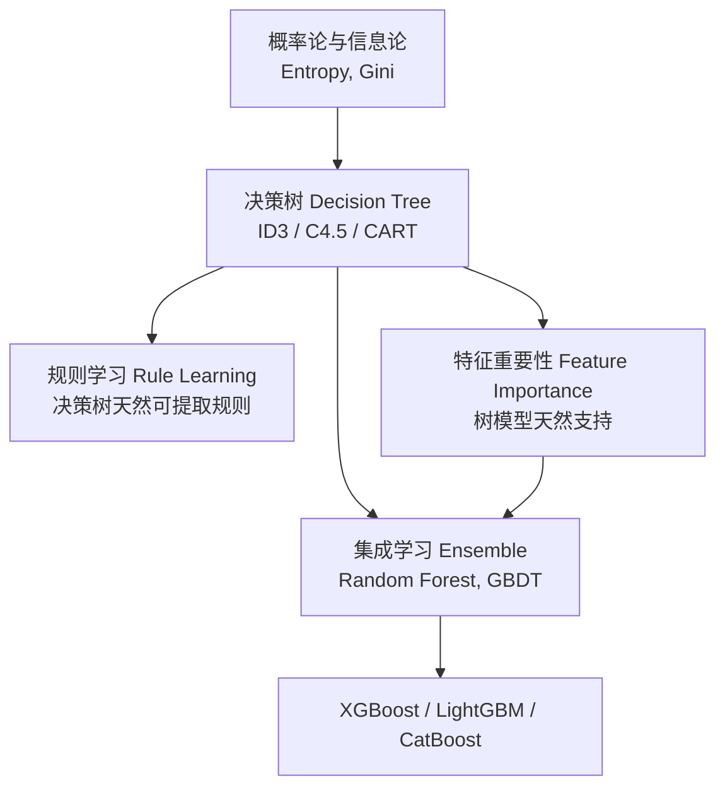
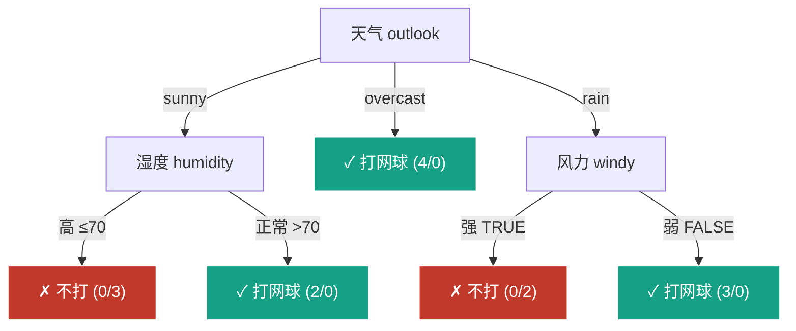
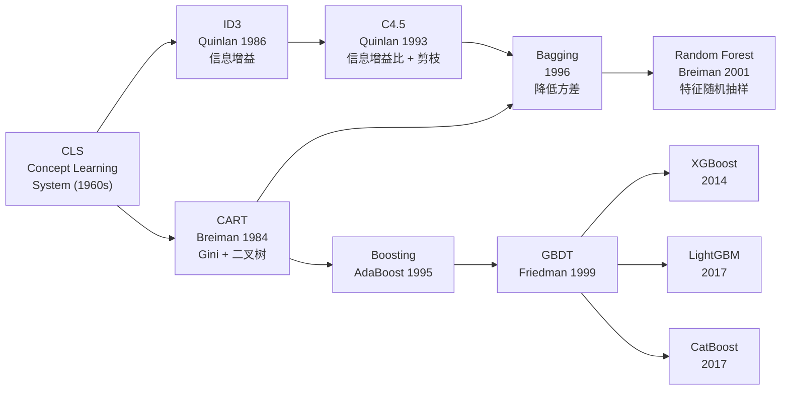

# Decision Tree (决策树)

## 知识地图



## 前置知识

- 信息论基础：熵 (Entropy)、信息量的概念
- 概率论：条件概率、贝叶斯公式
- 基本的分类与回归概念
- [逻辑回归](logistic-regression.md) 的决策边界思想
- 算法复杂度与贪心搜索

## 为什么会出现 (Why)

在决策树之前，统计学习方法（如 [线性回归](linear-regression.md)、[逻辑回归](logistic-regression.md)）强依赖线性假设，无法自然处理非线性关系和混合类型特征。20 世纪 60-80 年代，研究者受人类决策流程启发，想要一种**直观可解释、自动处理特征交互、无需特征工程**的方法。Hunt 等人提出概念学习系统 (CLS)，随后 Quinlan 在 1986 年提出 ID3，奠定了用信息论指导分裂的范式；Breiman 等人在 1984 年提出 CART，统一了分类与回归的二叉树框架，至今仍是 scikit-learn 等库的默认实现。

## 解决什么问题 (Problem)

决策树解决的是**表格数据的分类与回归问题**，特别适合：

1. 需要**可解释性**的场景（医疗诊断、风控审批）——树结构可直接翻译成 if-else 规则
2. 特征类型混杂（离散 + 连续）——无需哑编码或标准化
3. 特征之间存在非线性交互——树天然按条件组合特征

## 核心思想 (Core Idea)

决策树通过**递归地选择最优特征进行二分（或多分）**，将数据不断划分为纯度更高的子集。如果把分类过程想象成 20 Questions 游戏，决策树就是学到的"最佳提问顺序"——每次都在当前数据上问一个最"一针见血"的问题。

---

## 数学模型/公式

### 三种经典算法

| 算法 | 年份 | 分裂准则 | 树类型 | 特征支持 |
|------|------|----------|--------|----------|
| ID3 | 1986 | 信息增益 | 多叉 | 仅离散 |
| C4.5 | 1993 | 信息增益比 | 多叉 | 离散+连续 |
| CART | 1984 | Gini (分类) / MSE (回归) | **二叉** | 离散+连续 |

现代主流是 CART（二叉、高效、可用 Gini 和 MSE）。

### 熵与信息增益 (ID3)

**熵**衡量数据的不确定性：

$$
H(D) = -\sum_{k=1}^{K} p_k \log_2 p_k
$$

**通俗解释：** 熵就像一篮子水果的"混乱程度"。如果篮子里全是苹果（纯），你知道随便拿一个就是苹果——没有不确定性，熵为 0。如果苹果、梨、橘子各占 1/3，你完全猜不出下一个是什么——熵最大。对数底取 2 是因为信息论中用比特 (bit) 衡量信息量。

- 纯数据集（所有样本同类）：$H=0$
- 极度混乱（各类均匀）：$H = \log_2 K$（最大）

**信息增益** = 划分前后的熵差：

$$
\text{Gain}(D, A) = H(D) - \sum_{v} \frac{|D_v|}{|D|} H(D_v)
$$

**通俗解释：** 信息增益衡量"问了特征 A 的问题后，不确定性减少了多少"。类比：你在猜一个人是谁，问"性别"可能帮你排除一半选项，但如果问"身份证号"，一步到位直接确定——信息增益极大。但这也正是 ID3 的**缺陷**：倾向选择取值多的特征（如 ID 列），因为按 ID 分裂后每个子集都是纯的，信息增益最大，但这种分裂毫无泛化能力，极易过拟合。

### 信息增益比 (C4.5)

用特征自身的熵做归一化，惩罚取值多的特征：

$$
\text{GainRatio}(D, A) = \frac{\text{Gain}(D, A)}{H_A(D)}
$$

其中 $H_A(D) = -\sum_v \frac{|D_v|}{|D|} \log_2 \frac{|D_v|}{|D|}$ 是特征 $A$ 的固有熵。

**通俗解释：** 信息增益比相当于给信息增益打了一个"折扣因子"。特征是身份证号时，分子（信息增益）很大，但分母 $H_A(D)$（身份证号自身的熵）也很大——每个身份证号都不同，自身熵极高。一除之下，信息增益比回归正常水平，不会盲目选择取值多的特征。这就像高考的"加分比例"——不是看谁加分多，而是看加分占原始分的比例。

### Gini 系数 (CART)

$$
\text{Gini}(D) = 1 - \sum_{k=1}^{K} p_k^2
$$

**通俗解释：** Gini 系数衡量"随机抽两个样本，它们属于不同类的概率"。想象一个袋子里有红球和蓝球：全是红球时，抽两次一定同色，Gini = 0；红蓝各半时，有一半概率抽到不同色，Gini 最大。Gini 就像是熵的"山寨版"——不用算对数，计算更快，但形状几乎一样（Gini 是熵的一阶泰勒近似）。实际项目中两者分裂效果高度相似，Gini 因计算快成为默认选择。

- Gini 越小 → 数据越纯
- 相比熵，Gini 计算更快（无对数运算）
- 两者在实际中的分裂效果高度相似

### 剪枝

防止过拟合的核心手段：
- **预剪枝**：`max_depth`、`min_samples_split`、`min_samples_leaf`——在树生长时就限制
- **后剪枝**：先生成完整树，再从底向上剪去增益小的分支——"先长再修"

**通俗解释：** 预剪枝就像给孩子规定"每天最多玩 2 小时游戏"——事前约束。后剪枝就像"先让你玩，玩完后我检查，把不该玩的时段扣掉"——事后审查。预剪枝更快但可能欠拟合，后剪枝更准但计算量大。

---

## 可视化展示

### 决策树结构示意（以是否打网球为例）



### Gini 系数 vs 熵

```echarts
return {
  xAxis: { type: 'value', min: 0, max: 1, name: '正类概率 p' },
  yAxis: { type: 'value', min: 0, max: 1.2, name: '不纯度' },
  legend: { top: 28,  data: ['Gini = 1-p²-(1-p)²', 'Entropy = -p·log₂(p)-(1-p)·log₂(1-p)', '分类误差 = 1-max(p,1-p)'] },
  series: [
    {
      name: 'Gini = 1-p²-(1-p)²', type: 'line', smooth: true,
      lineStyle: { color: '#2c3e50', width: 2 },
      data: (function() { const d = []; for (let p = 0; p <= 1; p += 0.01) d.push([p, 1 - p*p - (1-p)*(1-p)]); return d; })()
    },
    {
      name: 'Entropy', type: 'line', smooth: true,
      lineStyle: { color: '#d35400', width: 2 },
      data: (function() { const d = []; for (let p = 0.001; p <= 0.999; p += 0.01) d.push([p, -p*Math.log2(p) - (1-p)*Math.log2(1-p)]); return d; })()
    },
    {
      name: '分类误差', type: 'line', smooth: false,
      lineStyle: { color: '#95a5a6', width: 1.5, type: 'dashed' },
      data: (function() { const d = []; for (let p = 0; p <= 1; p += 0.01) d.push([p, 1 - Math.max(p, 1-p)]); return d; })()
    }
  ],
  tooltip: { trigger: 'axis' },
  grid: { left: 60, right: 20, top: 40, bottom: 60 }
}
```

Gini 和熵的形状几乎一致——Gini 是熵的一阶泰勒近似，因此分裂效果相近，但 Gini 计算更快。

---

## 最小可运行代码

### Scikit-learn

```python
from sklearn.tree import DecisionTreeClassifier, DecisionTreeRegressor

# 分类树
clf = DecisionTreeClassifier(
    criterion='gini',        # 或 'entropy'
    max_depth=5,             # 预剪枝
    min_samples_split=10,
    min_samples_leaf=5,
    random_state=42
)
clf.fit(X_train, y_train)

# 回归树
reg = DecisionTreeRegressor(criterion='squared_error', max_depth=5)
reg.fit(X_train, y_train)
```

### NumPy 手写 CART（核心分裂逻辑）

```python
import numpy as np
from collections import Counter

class DecisionTree:
    def __init__(self, max_depth=5, min_samples=2):
        self.max_depth = max_depth
        self.min_samples = min_samples

    def _gini(self, y):
        _, counts = np.unique(y, return_counts=True)
        probs = counts / len(y)
        return 1 - np.sum(probs ** 2)

    def _best_split(self, X, y):
        best_gain, best_feat, best_thresh = 0, None, None
        for feat in range(X.shape[1]):
            thresholds = np.unique(X[:, feat])
            for thresh in thresholds:
                left_mask = X[:, feat] <= thresh
                left, right = y[left_mask], y[~left_mask]
                if len(left) < self.min_samples or len(right) < self.min_samples:
                    continue
                gini = (len(left) * self._gini(left) + len(right) * self._gini(right)) / len(y)
                gain = self._gini(y) - gini
                if gain > best_gain:
                    best_gain, best_feat, best_thresh = gain, feat, thresh
        return best_feat, best_thresh

    def fit(self, X, y, depth=0):
        if depth >= self.max_depth or len(np.unique(y)) == 1:
            self.label = Counter(y).most_common(1)[0][0]
            return
        feat, thresh = self._best_split(X, y)
        if feat is None:
            self.label = Counter(y).most_common(1)[0][0]
            return
        self.feat, self.thresh = feat, thresh
        left_mask = X[:, feat] <= thresh
        self.left = DecisionTree(self.max_depth, self.min_samples)
        self.right = DecisionTree(self.max_depth, self.min_samples)
        self.left.fit(X[left_mask], y[left_mask], depth + 1)
        self.right.fit(X[~left_mask], y[~left_mask], depth + 1)

    def predict_one(self, x):
        if hasattr(self, 'label'): return self.label
        return self.left.predict_one(x) if x[self.feat] <= self.thresh else self.right.predict_one(x)
```

---

## 工业界应用

| 应用场景 | 为什么使用决策树 | 优点 | 缺点 |
|----------|-----------------|------|------|
| 银行风控 / 信用评分 | 审批规则必须可解释（监管要求） | 可转化为 if-else 规则，审计友好 | 单棵树精度不如集成模型 |
| 医疗辅助诊断 | 诊断路径与医生思维一致 | 可视化呈现决策流程，医生可审核 | 对罕见病样本敏感 |
| 客户流失预警 | 市场部门需要理解流失原因 | 可输出特征重要性，定位关键因子 | 高方差，换一批数据树结构可能大不同 |
| 故障诊断 / 根因分析 | 需要定位故障路径 | 规则清晰，便于运维编写排查手册 | 连续传感器数据需先离散化 |
| 推荐系统初筛 | 快速生成候选集 | 推理极快（O(树深)），支持在线服务 | 冷启动场景分裂不充分 |

---

## 优缺点对比

| 优点 | 缺点 |
|------|------|
| 可解释性强（可视化即规则） | 容易过拟合（需要剪枝） |
| 无需特征缩放 | 对数据变化敏感（高方差） |
| 自动处理非线性关系 | 偏向类别多的特征（需用 GainRatio 修正） |
| 可处理混合类型数据 | 难以捕捉 XOR 等线性不可分关系 |
| 推理速度快，O(树深度) | 边界是轴平行的（axis-aligned），对角线分割需多层近似 |
| 天然支持缺失值（C4.5 用概率权重处理） | 贪心分裂不保证全局最优 |

---

## 对比表格

| 维度 | ID3 | C4.5 | CART |
|------|-----|------|------|
| 分裂准则 | 信息增益 | 信息增益比 | Gini (分类) / MSE (回归) |
| 树结构 | 多叉树 | 多叉树 | **二叉树** |
| 连续值处理 | 不支持 | 支持（二分阈值） | 支持（二分阈值） |
| 缺失值处理 | 不支持 | 支持（概率权重） | 支持（代理分裂 surrogate splits） |
| 剪枝 | 无 | 后剪枝（悲观剪枝 PEP） | 后剪枝（代价复杂度剪枝 CCP） |
| 任务类型 | 仅分类 | 仅分类 | **分类 + 回归** |
| 实际使用 | 已淘汰 | 较少使用 | **主流（scikit-learn 默认）** |

---

## 模型演化路线



---

## 学完后建议继续学习

- [随机森林 / Bagging](bagging-rf.md) —— 用多棵树投票降低方差，解决单棵树过拟合问题
- [Boosting / GBDT](boosting.md) —— 从弱到强的串行提升，工业界表格数据的王者
- [逻辑回归](logistic-regression.md) —— 与决策树形成"可解释性"对比（线性 vs 规则）
- [交叉熵](cross-entropy.md) —— 理解熵概念在分类损失中的延伸
- [SHAP / 特征重要性](bagging-rf.md) —— 利用树模型进行特征重要性分析

---

## 高频面试题

**Q1: 决策树为什么不需要做特征归一化？**

标准答案：决策树的分裂只依赖特征值的相对顺序（找阈值 $x_j \leq t$），不涉及距离计算或梯度更新。无论特征范围是 [0, 1] 还是 [0, 10000]，分裂阈值会等比例调整，分裂结果不变。这和需要计算欧氏距离的 KNN、KMeans，以及需要梯度下降的神经网络形成鲜明对比。

**Q2: ID3 为什么会被 C4.5 和 CART 取代？**

标准答案：三个致命缺陷：(1) **偏向多值特征**——信息增益天然倾向选择取值多的特征（如 ID 列），导致过拟合；(2) **无法处理连续特征**——必须提前离散化；(3) **无法处理缺失值**。C4.5 用信息增益比解决偏向问题并支持连续值/缺失值，CART 用二叉结构和 Gini 系数简化计算并统一分类回归。

**Q3: Gini 系数和信息增益在实际中怎么选？效果差别大吗？**

标准答案：实际效果差别极小。理论上看，Gini 是熵的一阶泰勒近似，两者形状几乎一致。选 Gini 的主要原因是计算更快（无对数运算，纯乘法/加法）。在处理多分类且类别极度不均衡时，信息增益对低概率类更敏感，可能略有优势，但差异通常不显著。scikit-learn 默认使用 Gini（`criterion='gini'`）。

**Q4: 决策树如何处理连续特征？**

标准答案：对连续特征的所有（或采样的）取值排序，依次尝试相邻值的中点作为分裂阈值，计算每种分裂的不纯度减少量，选择增益最大的阈值。具体做法：假设特征取值为 {1.5, 2.0, 3.5, 4.0}，尝试的阈值有 (1.5+2.0)/2=1.75, (2.0+3.5)/2=2.75, (3.5+4.0)/2=3.75。每次二分后，同一个特征在后续节点仍可再次分裂（不同于离散特征的 one-hot 方式）。

**Q5: 决策树过拟合怎么办？预剪枝和后剪枝怎么选？**

标准答案：预剪枝常用参数：`max_depth`（限制深度）、`min_samples_split`（节点最少样本数才可分裂）、`min_samples_leaf`（叶节点最少样本数）、`min_impurity_decrease`（不纯度下降不足不分叉）。后剪枝经典方法：代价复杂度剪枝 CCP (CART)，用 `ccp_alpha` 控制——越大剪得越狠。实践中优先调预剪枝参数（快、简单），如果验证曲线不理想再尝试后剪枝（Cross-Validation 确定最佳 `ccp_alpha`）。多数工业场景用预剪枝 + GridSearch 足够。
