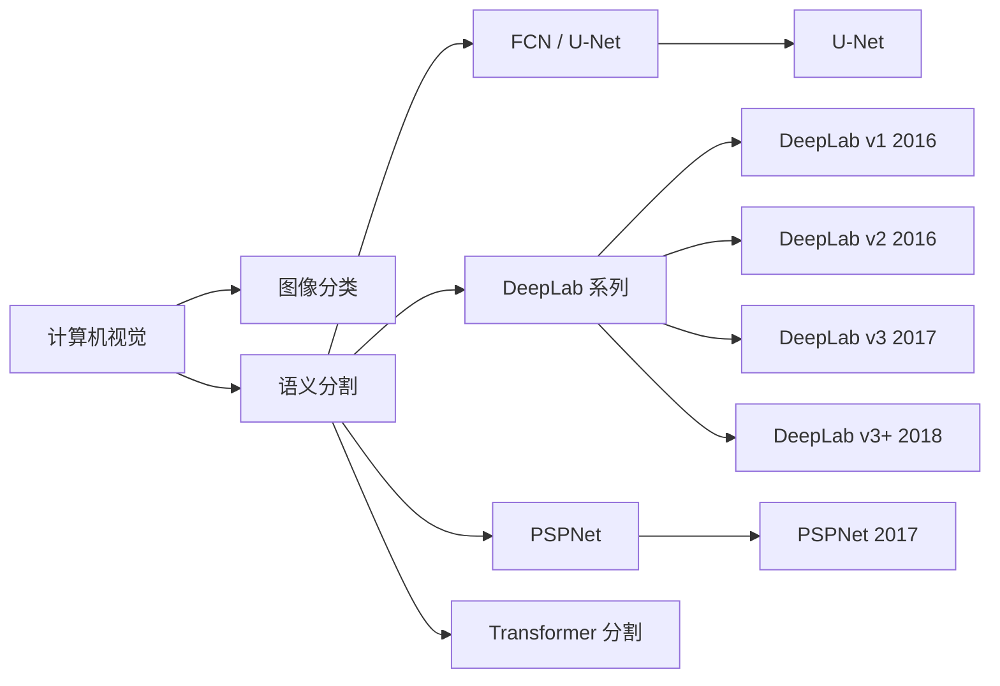
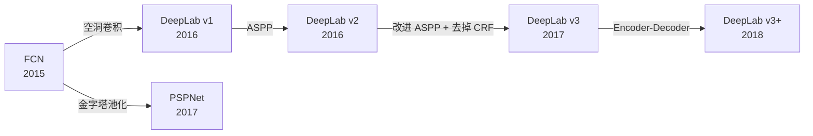
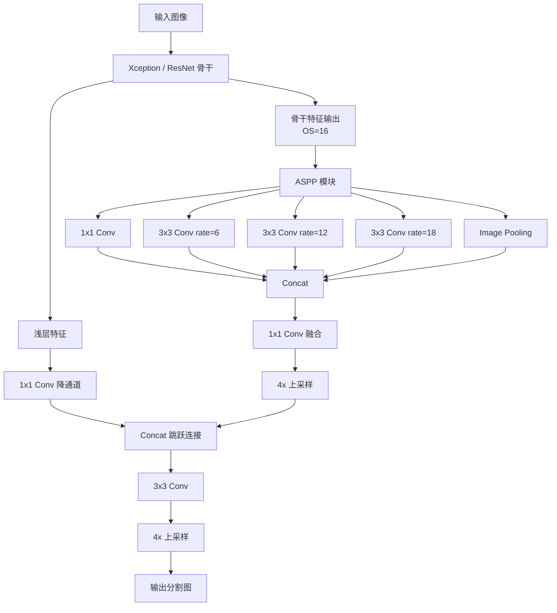
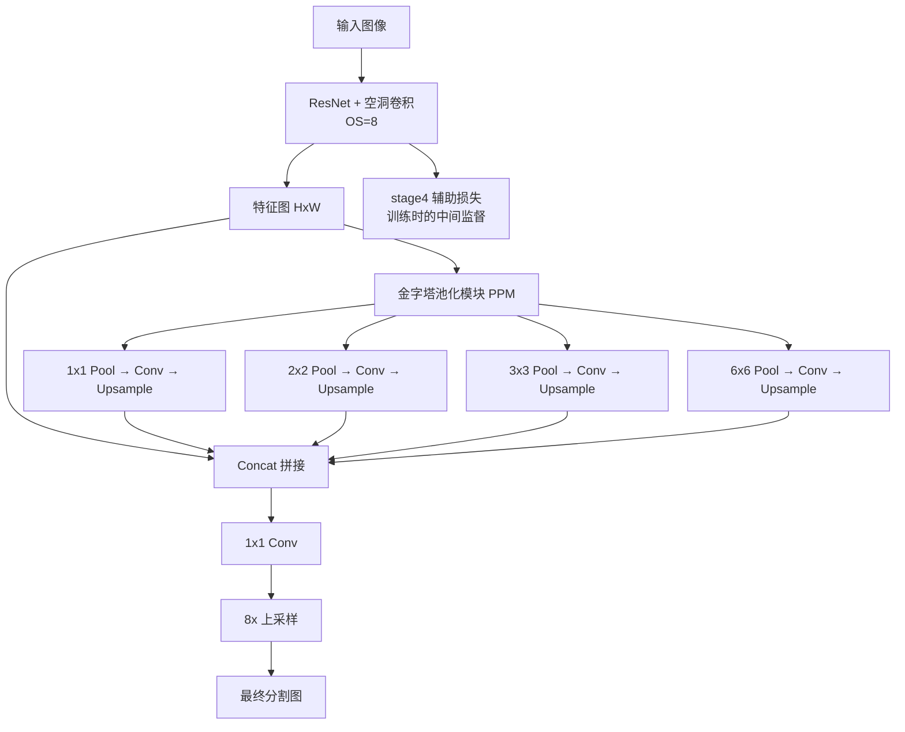
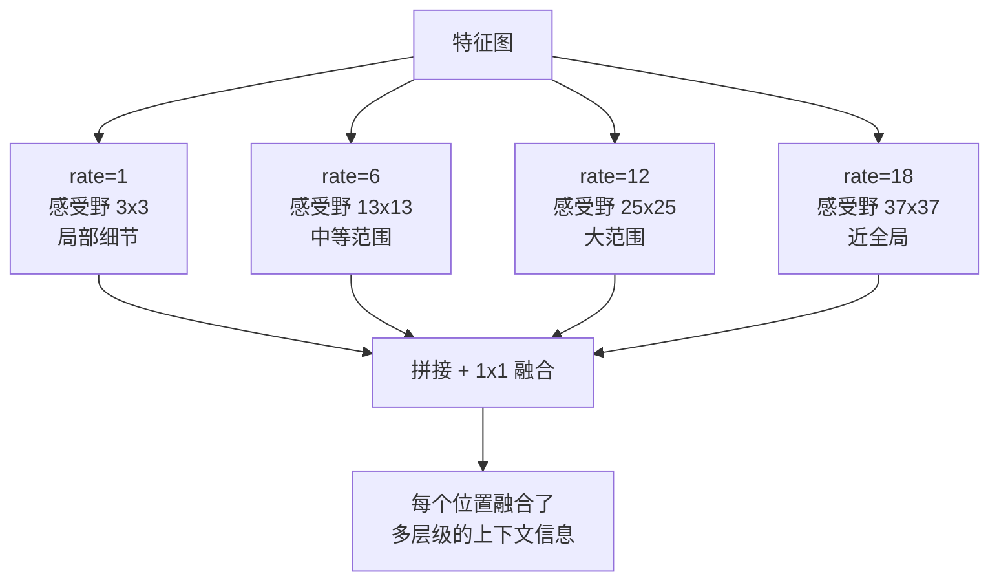

# DeepLab / PSPNet

## 知识地图



## 前置知识

- 语义分割基础：FCN 的全卷积架构和上采样方法
- 卷积神经网络的感受野概念
- 空洞卷积 (Dilated/Atrous Convolution) 的原理
- ASPP (Atrous Spatial Pyramid Pooling) 的基本概念
- 多尺度特征融合的思想
- 条件随机场 (CRF) 的基本原理

## 模型演化路线



| 模型 | 年份 | 关键创新 |
|------|------|----------|
| FCN | 2015 | 全卷积化，转置卷积上采样 |
| DeepLab v1 | 2016 | 空洞卷积扩大感受野 + DenseCRF 后处理 |
| DeepLab v2 | 2016 | ASPP 多尺度并行采样 |
| DeepLab v3 | 2017 | 改进 ASPP（Image Pooling + 级联空洞卷积），去除 CRF |
| PSPNet | 2017 | 金字塔池化模块 (PPM) + 辅助损失 |
| DeepLab v3+ | 2018 | Encoder-Decoder 结构 + 深度可分离卷积 |

## 为什么会出现 (Why)

FCN 和 U-Net 虽然实现了端到端的语义分割，但存在一个根本问题：**感受野不足**。

分类网络中的下采样（MaxPooling）虽然扩大了感受野，但也丢失了空间分辨率。FCN 通过上采样恢复分辨率，但语义信息强而空间细节弱——物体边界模糊，小物体容易被忽略。

DeepLab 的核心洞见是：**不要下采样——用空洞卷积代替！** 空洞卷积可以在不降低分辨率的前提下扩大感受野，让网络既看到全局又能保持空间精度。

PSPNet 从另一个角度解决问题：**全局上下文很重要，但不同区域的上下文需要不同大小的视野**——引入金字塔池化来同时捕捉不同大小的区域信息。

## 解决什么问题 (Problem)

**如何在不损失空间分辨率的前提下扩大感受野，使分割网络能同时利用全局语义信息和局部空间细节？**

具体挑战：
- 下采样（池化/跨步卷积）扩大感受野但丢失空间信息
- 不同物体需要不同尺度的上下文（小物体需要局部信息、大物体需要全局信息）
- 分割边界的精细程度受限于特征图的分辨率

## 核心思想 (Core Idea)

**DeepLab 用空洞卷积代替下采样，在不增加参数的前提下指数级扩大感受野，并通过 ASPP 并行捕获多尺度上下文；PSPNet 通过金字塔池化模块在不同尺度上聚合全局信息，让每个像素都能利用到全图级别的上下文。**

---

## DeepLab v1

### 核心创新：空洞卷积

用空洞卷积在不增加参数的情况下扩大感受野：

| dilation rate | 3x3 核的感受野 | 参数量 |
|:---|:---|:---|
| 1 | 3x3 | 9 |
| 2 | 5x5 | 9 |
| 4 | 9x9 | 9 |

**通俗解释：** 普通 3x3 卷积看的是 3x3 的区域。空洞卷积在 3x3 核的元素之间"留空白"——rate=2 时，核的 9 个元素分布在 5x5 的区域上采样（像在原有 3x3 核的元素之间插入 0），参数量仍然是 9 个，但能覆盖 5x5 的感受野。rate=4 覆盖 9x9。这是用稀疏采样换取"看得更广"，而且不损失分辨率。

### 条件随机场 (CRF)

后处理步骤：用 DenseCRF 精修分割边缘。

**通俗解释：** 深度学习的分割结果在边界处往往是模糊的。CRF 像一个"精细修图师"——它同时考虑两个因素：像素的颜色相似度（颜色相近的像素很可能属于同一物体）和空间距离（离得近的像素大概率是同类）。CRF 优化后，边界变得更锐利、精确。但 CRF 是后处理，不参与端到端训练，DeepLab v3 最终去掉了它。

---

## DeepLab v2 — ASPP

### Atrous Spatial Pyramid Pooling

并行使用不同 dilation rate 的卷积，捕获多尺度上下文：

```
输入特征 → 1x1 Conv → rate=6 Conv → rate=12 Conv → rate=18 Conv → Pool → Concat → 1x1 Conv
```

多个尺度同时处理，适应不同大小的物体。

**通俗解释：** ASPP 像一组不同倍率的放大镜同时观察图像。rate=6 的看中等范围（适合汽车），rate=12 的看更大范围（适合公交车），rate=18 的看全局（适合建筑）。最后把所有倍率看到的信息拼接在一起，每个像素都能同时利用多个尺度的上下文——判断一个像素是不是"车窗"时，不仅看局部纹理，还参考周围"车身"的信息。

---

## DeepLab v3

- 改进 ASPP：加入全局平均池化和 Image Pooling
- 用级联空洞卷积模块替代 CRF（端到端）
- Multi-Grid 策略：不同层用不同 dilation rate

### 输出步幅 (Output Stride)

控制最终特征图分辨率的关键参数：

$$OS = \frac{\text{Input Resolution}}{\text{Output Resolution}}$$

OS=16 是精度和速度的常用折中。

**通俗解释：** 输出步幅决定了特征图缩小的倍数。OS=8 时精度最高但计算量大（特征图大），OS=16 是一个平衡点，OS=32 时最快但精度下降。DeepLab v3 通过空洞卷积在 OS=16 时仍能保持大感受野——这比 FCN 的 32 倍下采样保留了 4 倍的更多空间信息。

---

## PSPNet (Pyramid Scene Parsing Network)

### 核心创新：金字塔池化模块 (PPM)

将特征图池化到不同尺度（1x1, 2x2, 3x3, 6x6），然后上采样 + 拼接：

```python
class PyramidPooling(nn.Module):
    def __init__(self, in_ch, sizes=(1, 2, 3, 6)):
        super().__init__()
        self.pools = nn.ModuleList([
            nn.Sequential(
                nn.AdaptiveAvgPool2d(s),
                nn.Conv2d(in_ch, in_ch // 4, 1, bias=False),
                nn.BatchNorm2d(in_ch // 4),
                nn.ReLU(),
            ) for s in sizes
        ])

    def forward(self, x):
        h, w = x.shape[2:]
        pooled = [x]
        for pool in self.pools:
            p = pool(x)
            pooled.append(F.interpolate(p, (h, w), mode='bilinear'))
        return torch.cat(pooled, dim=1)
```

**通俗解释：** PSPNet 的金字塔池化像一个多分辨率的"地图缩放器"：
- 1x1 池化：看全局，整个图像压缩到一个像素——"整个场景是城市街道"
- 2x2 池化：看四分图，分成四个象限——"左上角是天空，右下角是马路"
- 3x3 池化：看九分图——更细的区域划分
- 6x6 池化：看 36 格——接近局部了

这些不同粒度的信息被拼接起来，每个像素同时拥有"我是人行道上的像素"（最细粒度）和"我所在的大场景是城市街道"（最粗粒度）的信息。这就是完整的场景理解能力。

### 辅助损失

在 ResNet 的 stage4 后添加辅助分类器，帮助中间层梯度传播。

**通俗解释：** 深层网络的梯度容易在回传时"衰减殆尽"。辅助损失像一个"中途补给站"——在网络的中间层额外加一个监督信号，让靠近输入的层也能收到足够强的梯度，训练更稳定、更快收敛。

---

## 数学模型/公式

### 空洞卷积的输出公式

对于输入 $x$，卷积核 $w$，dilation rate $r$：

$$y[i] = \sum_{k} x[i + r \cdot k] \cdot w[k]$$

**通俗解释：** 普通卷积是 $x[i + k]$（相邻采样），空洞卷积是 $x[i + r \cdot k]$（每隔 $r-1$ 个采样）。当 $r=1$ 时退化为普通卷积。这个简单的改动让 3x3 卷积的感受野从 3 变成 3+2r（不考虑多层累积）。

### ASPP 的数学表示

$$\text{ASPP}(x) = \text{Concat}(\text{Conv}_{1\times1}(x), \text{Conv}_{rate=6}(x), \text{Conv}_{rate=12}(x), \text{Conv}_{rate=18}(x), \text{ImagePool}(x))$$

**通俗解释：** 五个分支并行处理同一输入：(1) 1x1 卷积（原尺度），(2-4) 三个不同空洞率的 3x3 卷积，(5) 全局平均池化 + 上采样。五路结果拼接，经 1x1 卷积融合——每个位置同时拥有从局部到全局的多尺度信息。

### 感受野计算公式

对于连续的卷积层，感受野递推公式：

$$RF_{l} = RF_{l-1} + (k_l - 1) \times \prod_{i=1}^{l-1} s_i$$

其中有空洞的卷积核有效大小：

$$k_{eff} = k + (k - 1) \times (r - 1)$$

**通俗解释：** 空洞卷积通过扩大有效核大小来指数级扩大感受野。一个 rate=2 的 3x3 卷积，有效核大小是 5x5；rate=4 时是 9x9。堆叠多层时感受野增长更快——但代价是相邻像素的采样越来越稀疏，可能丢失局部连续性。

---

## 模型结构图

### DeepLab v3+ 架构



### PSPNet 架构



## 可视化展示

### ASPP 多尺度采样示意



### PPM 金字塔层级

| 池化尺度 | 输出的区域划分 | 每个区域包含的信息 | 对全局理解的贡献 |
|:---:|:---|:---|:---|
| 1x1 | 整个图像 | 全图统计信息 | 最粗粒度的场景类别 |
| 2x2 | 4 个象限 | 区域级特征 | 天空/地面等大区域区分 |
| 3x3 | 9 个区块 | 子区域特征 | 道路/建筑/车辆分布 |
| 6x6 | 36 个网格 | 局部上下文 | 物体间的空间关系 |

---

## DeepLab vs PSPNet

| | DeepLab v3+ | PSPNet |
|------|------------|--------|
| 多尺度策略 | ASPP + Encoder-Decoder | PPM |
| 骨干 | Xception / ResNet | ResNet |
| 解码器 | 简单解码器 + 浅层特征 | 无（仅上采样） |
| 速度 | 较快 | 中等 |
| 空洞卷积 | ASPP 中密集使用 | 骨干中使用 |
| 辅助损失 | 无 | 有（stage4 辅助分类器） |
| 精度 (Cityscapes) | ~82% mIoU | ~80% mIoU |

## 最小可运行代码

```python
import torchvision.models.segmentation as seg

deeplab = seg.deeplabv3_resnet50(pretrained=True)
# 或 deeplabv3_mobilenet_v3_large
```

## 工业界应用

| 应用场景 | 推荐方案 | 原因 |
|----------|----------|------|
| 自动驾驶 | DeepLab v3+ (Xception) | 大感受野，高精度，适合道路场景理解 |
| 移动端/边缘设备 | DeepLab v3+ (MobileNet) | 深度可分离卷积加速 |
| 场景理解 | PSPNet | 金字塔池化天然适合全局场景解析 |
| 遥感/航拍分析 | PSPNet | 金字塔池化对不同尺度地物都友好 |
| 医学影像分割 | DeepLab v3+ | 空洞卷积保持空间精度 |
| 视频分割 | DeepLab v3+ (轻量) | 速度较快，适合帧级处理 |

## 对比表格

| 维度 | DeepLab v3+ | PSPNet | FCN | U-Net | SegFormer |
|------|------------|--------|-----|-------|-----------|
| 多尺度策略 | ASPP | PPM | 跳跃连接 | 跳跃连接 | Transformer |
| 编码器 | Xception/ResNet | ResNet | VGG | 自定义 | MiT (Transformer) |
| 解码器 | 有 | 无 | 无 | 对称 | MLP |
| 感受野 | 极大 (空洞卷积) | 极大 (PPM) | 有限 | 中等 | 全局 (Attention) |
| 速度 | 快 | 中 | 中 | 中 | 快 |
| mIoU (Cityscapes) | ~82% | ~80% | ~65% | ~70% | ~82% |
| 参数量 | 中等 | 中 | 大 | 中 | 大 |

## 学完后建议继续学习

1. **SegFormer / Swin Transformer**：Transformer 架构在分割中的应用，全局注意力替代空洞卷积
2. **Panoptic Segmentation**：全景分割——同时处理"东西"（语义分割）和"物体"（实例分割）
3. **视频语义分割**：利用时序信息提升分割质量（TCB, NetWarp 等）
4. **实时语义分割**：BiSeNet, STDC, PIDNet 等轻量级实时分割网络
5. **域自适应/域泛化**：在合成数据上训练、真实场景中部署的域迁移技术

## 高频面试题

### Q1: 空洞卷积的原理是什么？它如何在不增加参数的情况下扩大感受野？

**答：**
- **原理**：空洞卷积在普通卷积核的元素之间插入"空洞"（即 0）。对于 dilation rate=$r$ 的 3x3 卷积，核的 9 个有效元素分布在 $(2r+1) \times (2r+1)$ 的区域上（只有 9 个位置有非零权重，其余为 0）。
  - 计算：$y[i] = \sum_{k} x[i + r \cdot k] \cdot w[k]$
- **不增加参数的原因**：卷积核的大小和参数数量不变（仍然是 3x3 = 9 个参数），只是采样位置变稀疏了。感受野被 "拉开" 到更大区域。
- **有效核大小**：$k_{eff} = k + (k-1) \times (r-1)$，所以 rate=2 时 3x3 核等效于 5x5 的感受野，rate=6 等效于 13x13。
- **优势**：保持特征图分辨率（不做下采样）的同时获得了大感受野。对分割特别重要——既有语义强的深层特征，又有足够的分辨率。

### Q2: ASPP 和 PPM 的核心区别是什么？各自适合什么场景？

**答：**
- **ASPP (Atrous Spatial Pyramid Pooling)**：
  - 方式：并行使用不同空洞率的卷积
  - 特点：所有分支处理同一分辨率的特征图，在卷积层面做多尺度
  - 优势：计算高效，所有分支可并行计算
  - 适用场景：需要保持高空间分辨率的分割任务

- **PPM (Pyramid Pooling Module)**：
  - 方式：将特征图池化到不同尺度（1x1, 2x2, 3x3, 6x6），再上采样拼接
  - 特点：先下采样（池化）获取不同粒度的区域特征，再恢复到原分辨率
  - 优势：更强地捕获区域级和全局级上下文
  - 适用场景：需要全局场景理解的任务（如 ADE20K 场景解析）

- **核心区别**：ASPP 用不同空洞率的卷积并行看不同范围（类似不同焦距的镜头）；PPM 用不同大小的池化看不同区域（类似不同比例尺的地图）。ASPP 保留了像素级精度，PPM 更好地捕获了区域统计信息。

### Q3: DeepLab v3 为什么去掉了 CRF？v3+ 相比 v3 做了什么改进？

**答：**
- **去掉 CRF 的原因**：
  1. CRF 是独立的后处理步骤，不参与端到端训练
  2. DeepLab v3 通过改进 ASPP（加入 Image Pooling）和多层级联空洞卷积，已经能产生足够精确的分割边界
  3. CRF 推理速度慢（DenseCRF 需要迭代优化），影响整体效率
  4. 实验表明 v3 去掉 CRF 后精度没有明显下降

- **v3+ 的改进**：
  1. 引入 Encoder-Decoder 结构：在 ASPP 之后增加解码器模块
  2. 融合浅层特征：将骨干的浅层低层特征通过跳跃连接传入解码器，恢复空间细节
  3. 将 Xception 改造为深度可分离卷积版本（更轻量）
  4. 结果：边界更精细，对细小物体分割更好

### Q4: PSPNet 的辅助损失是如何工作的？为什么需要它？

**答：**
- **工作原理**：在 ResNet 的 stage4（约网络 2/3 深度处）添加一个辅助分类器。该分类器接受 stage4 的特征，经过 1x1 卷积输出逐像素类别预测，计算交叉熵损失。总损失 = 主损失 + 0.4 x 辅助损失。
- **为什么需要**：
  1. 深层网络的梯度经过多层回传后容易衰减，靠近输入的层收到极弱的监督信号（梯度消失）
  2. 辅助损失像一个"中间监考老师"，在网络的中间层提供直接的梯度信号
  3. 迫使中间层也学习有判别力的特征，而非等到最后一层才被"折腾"
- **训练 vs 推理**：辅助分类器只在训练时使用，推理时丢弃，不影响推理速度。

### Q5: 为什么 DeepLab 系列使用输出步幅 (Output Stride) 而不是固定下采样倍数？

**答：**
- **输出步幅** = 输入分辨率 / 特征图分辨率。OS=8 表示特征图是输入的 1/8 大小。
- **灵活性的原因**：
  1. 不同应用场景对速度/精度的权衡不同。自动驾驶需要快速推理，可选 OS=16；医学影像需要高精度，可选 OS=8。
  2. 通过调整骨干后半部分的空洞卷积 rate 来控制 OS，不需要重新训练。
  3. OS=8 保留更多空间细节但计算量大；OS=16 是常用折中；OS=32 最快但精度最差。
- **与普通下采样的区别**：普通下采样通过 stride=2 卷积实现，OS=32 意味着最后 5 次 stride=2（$2^5$）。DeepLab 通过空洞卷积在不增加 stride 的情况下扩大感受野，使 OS=16 甚至 OS=8 时仍有足够大的感受野——这是 FCN 做不到的。
