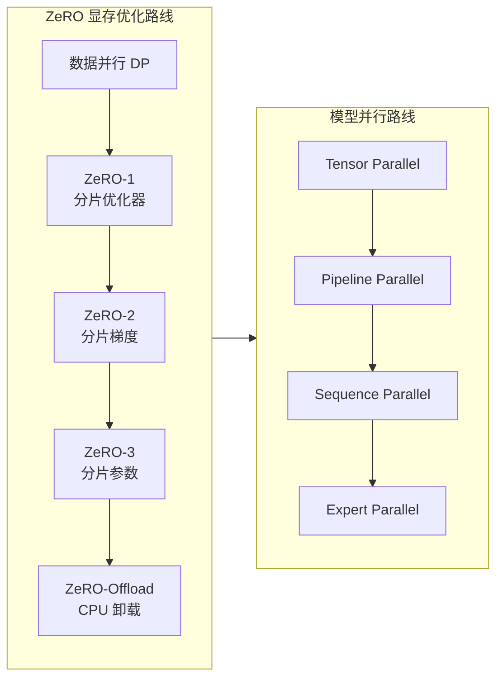
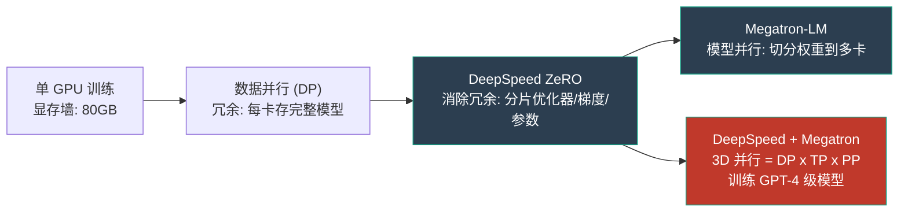
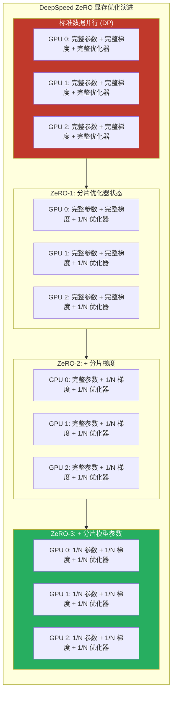
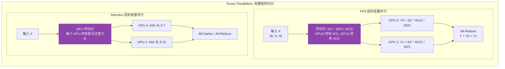
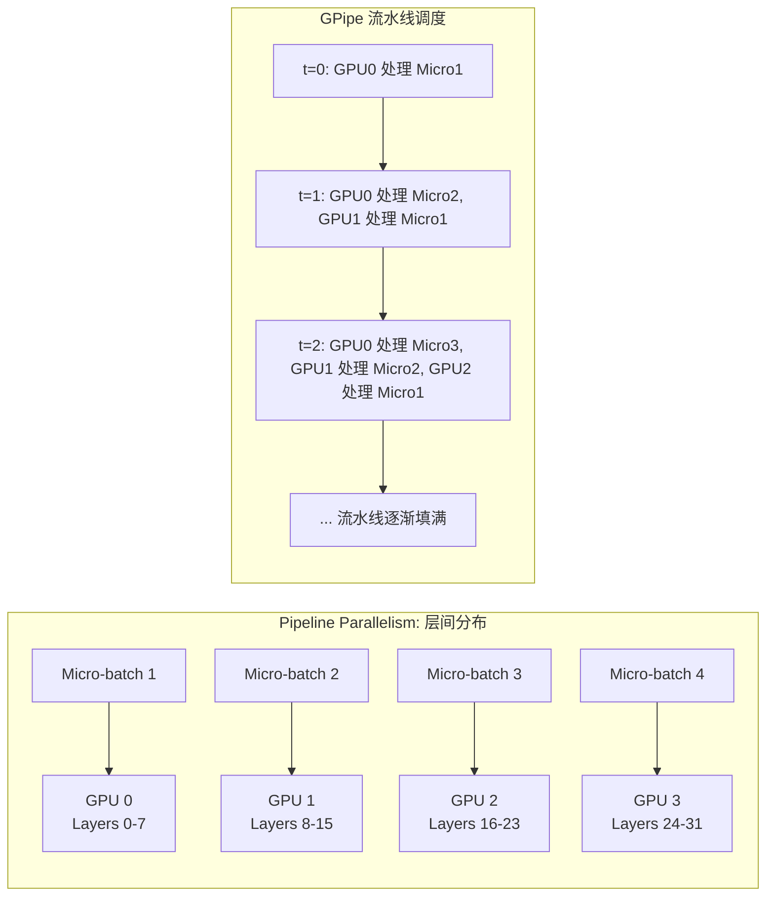
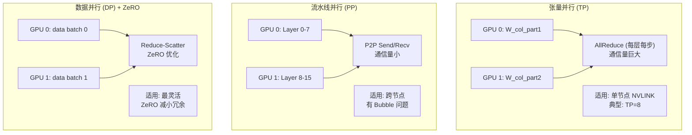
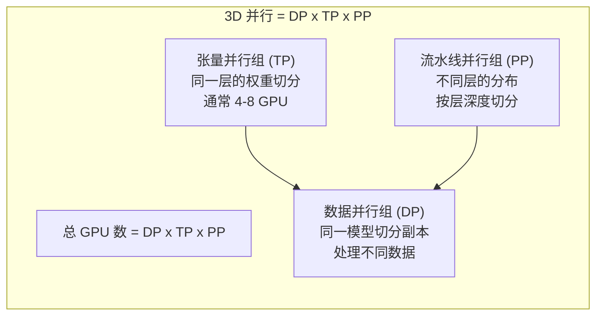
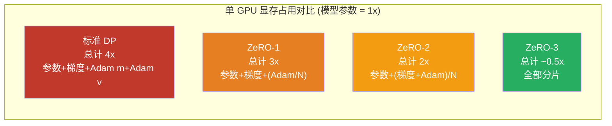

# DeepSpeed / Megatron-LM (大规模分布式训练)

## 知识地图



## 前置知识

- **数据并行 (Data Parallelism, DP)**：每 GPU 持有完整模型副本，输入数据切分，梯度 All-Reduce 同步
- **GPU 显存组成**：模型参数 + 梯度 + 优化器状态（Adam: m + v，占参数 2 倍）+ 激活值
- **Adam 优化器**：$m_t = \beta_1 m_{t-1} + (1-\beta_1)g_t$，$v_t = \beta_2 v_{t-1} + (1-\beta_2)g_t^2$，需要存储 $m$ 和 $v$ 两个与参数同形状的变量
- **All-Reduce / All-Gather**：分布式通信原语。All-Reduce 将各 GPU 的梯度求和并广播。All-Gather 从各 GPU 收集分片并拼接。Reduce-Scatter 先求和再分片
- **混合精度训练**：FP16 前向/反向 + FP32 主权重副本，理解显存中三种精度的分布
- **Transformer 层结构**：Self-Attention (QKV 投影) + FFN (两个线性层)，理解层的内部参数分布

## 模型演化路线



| 阶段 | 技术 | 核心思想 | 单 GPU 显存节省 |
|------|------|----------|----------------|
| 初始 | 数据并行 (DP) | 每卡复制完整模型 | 0 (完全冗余) |
| 第一阶段 | ZeRO-1 | 分片优化器状态 | 4x |
| 第二阶段 | ZeRO-2 | + 分片梯度 | 8x |
| 第三阶段 | ZeRO-3 | + 分片模型参数 | Nx (N=GPU 数量) |
| 扩展 | Tensor Parallelism | 层内权重矩阵切分 | 配合模型尺寸 |
| 扩展 | Pipeline Parallelism | 层间分布 | 配合模型深度 |
| 终极 | 3D 并行 | DP x TP x PP | 近乎线性扩展 |

## 为什么会出现 (Why)

训练 GPT-4 级别的大模型需要解决三个瓶颈：

1. **显存墙**：175B 参数 x 2 bytes (FP16) = 350GB 模型参数，加上梯度 (+350GB) 和 Adam 优化器状态 (+700GB)，总计 ~1.4TB。单 GPU 只有 80GB，差距 17 倍以上。
2. **计算墙**：数万亿 Token 的训练量，单 GPU 需要数百年。必须用数千 GPU 并行。
3. **通信墙**：数千 GPU 之间的梯度同步、参数广播成为新瓶颈。

DeepSpeed (微软) 和 Megatron-LM (NVIDIA) 分别从**消除显存冗余**和**模型结构切分**两个维度系统性地解决这些问题。

## 解决什么问题 (Problem)

1. **显存不足**：让 175B+ 参数模型能在有限 GPU 显存上训练
2. **训练效率**：在数千 GPU 上实现高吞吐量（高 Model FLOPS Utilization, MFU）
3. **通信优化**：在保证数学正确性的前提下最小化 GPU 间通信量
4. **易用性**：让研究人员不需要手写分布式代码即可训练大模型

## 核心思想 (Core Idea)

**DeepSpeed ZeRO 通过分片（将优化器状态/梯度/参数分布到多 GPU，使用时临时通信聚合）消除数据并行中的显存冗余；Megatron-LM 通过模型并行（将 Transformer 层的权重矩阵和层本身切分到多 GPU）突破单卡无法装下完整模型的问题，两者结合构成 3D 并行体系。**

---

## 数学模型/公式

### ZeRO 显存分析

训练时每个 GPU 的显存占用分解（以 FP16 混合精度 + Adam 为例）：

标准 DP 每个 GPU 的内存占用：
$$M_{DP} = 2\Psi + 2\Psi + 12\Psi = 16\Psi$$

- $2\Psi$：模型参数（FP16，2 bytes）
- $2\Psi$：梯度（FP16）
- $12\Psi$：Adam 状态（FP32 的参数副本 4 + 动量 m 4 + 二阶矩 v 4）

**通俗解释：** 参数 $\Psi$ 是 FP16（2 bytes），所以参数和梯度各占 $2\Psi$。Adam 需要存储 FP32 的参数副本（用于精确更新）、动量 m（FP32）、二阶矩 v（FP32），各 $4\Psi$，合计 $12\Psi$。总共 $16\Psi$——7.5B 参数需要 $16 \times 7.5 \times 10^9 = 120\text{GB}$，而 A100 只有 80GB，根本放不下。而且 8 个 GPU 都各存一份——7 份是完全冗余的。

### ZeRO-1: 分片优化器状态

$$M_{ZeRO-1} = 2\Psi + 2\Psi + \frac{12\Psi}{N_d} = 4\Psi + \frac{12\Psi}{N_d}$$

**通俗解释：** 每个 GPU 仍存储完整参数和梯度，但优化器状态被切分。GPU 0 只负责更新参数的第 0 到 N/8-1 部分、GPU 1 负责第 N/8 到 2N/8-1 部分...梯度通过 Reduce-Scatter 收集到对应 GPU → 各自更新自己负责的参数 → AllGather 把更新后的参数同步给所有 GPU。$N_d=8$ 时，$4\Psi + 12\Psi/8 = 5.5\Psi \approx 41\text{GB}$——可以放入 A100。通信量：与标准 DP 相同（一次等价 AllReduce），无额外开销。

### ZeRO-2: + 分片梯度

$$M_{ZeRO-2} = 2\Psi + \frac{2\Psi + 12\Psi}{N_d} = 2\Psi + \frac{14\Psi}{N_d}$$

**通俗解释：** 梯度也不需每个 GPU 存完整副本——每个 GPU 在 Reduce-Scatter 后只保留自己负责段的梯度。不需要先 All-Reduce 再更新，Reduce-Scatter 直接完成聚合和分片。$N_d=8$ 时内存约为 $3.75\Psi \approx 28\text{GB}$，节省约 8 倍。

### ZeRO-3: + 分片模型参数

$$M_{ZeRO-3} = \frac{16\Psi}{N_d}$$

**通俗解释：** 最激进的阶段——连模型参数也分片。每个 GPU 只永久存储 $1/N_d$ 的模型参数，前向传播时通过 AllGather 从其他 GPU 收集需要的参数，计算完立刻释放。$N_d=64$ 时，每个 GPU 只需 $16\Psi/64 = 0.25\Psi \approx 1.9\text{GB}$——甚至可以用消费级 GPU。代价是每层前向/反向都需要额外 AllGather 通信，但可以通过预取与计算重叠来缓解。

### ZeRO-Offload 与 ZeRO-Infinity

**ZeRO-Offload**：将优化器状态和更新计算卸载到 CPU 内存。CPU 内存通常是 GPU 显存的 10-20 倍（512GB vs 80GB），且优化器更新计算量远小于前向/反向（仅为逐元素操作）。

**ZeRO-Infinity**：进一步将模型状态卸载到 NVMe SSD（~4GB/s 带宽），通过预取和缓存策略管理 SSD ↔ CPU ↔ GPU 的数据流。实现**万亿参数**级别的训练。

### 3D 并行 GPU 数量

$$\text{总 GPU 数} = TP \times PP \times DP$$

- **TP（张量并行）**：层内权重的切分（通常 8 GPU，限单节点 NVLink 900GB/s）
- **PP（流水线并行）**：层间模型的分布（可跨节点，IB/RoCE 200GB/s）
- **DP（数据并行）**：数据切分，配合 ZeRO 优化内存（可扩展到数千 GPU）

**通俗解释：** TP 决定单层如何在一个节点内的 8 卡之间分布；PP 决定不同层如何分布到不同节点；DP 决定有多少组这样的配置同时处理不同数据。三者相乘是总 GPU 数。例如：TP=8, PP=4, DP=16 → 512 GPU。

### Pipeline Bubble 时间

$$\text{Bubble Fraction} = \frac{PP - 1}{m}$$

其中 $m$ 是 micro-batch 数量，$PP$ 是流水线并行度。

**通俗解释：** Bubble 是因为流水线启动和关闭时前面/后面的 GPU 需要等待。micro-batch 越多（$m$ 大），Bubble 占比越小——因为启动/关闭时间相对总计算时间变少了。这就是为什么流水线并行通常会用大 batch 和多 micro-batch。1F1B 调度策略通过交错前向/反向进一步减少 Bubble。

---

## 可视化展示

### DeepSpeed ZeRO 三个阶段的内存分布



### Megatron-LM: Tensor Parallelism 原理



### Pipeline Parallelism 原理



### 三种并行策略通信模式对比



### 3D 并行体系



### ZeRO 各阶段显存分布对比



---

## 最小可运行代码

### DeepSpeed 使用

```python
import deepspeed

model_engine, optimizer, _, _ = deepspeed.initialize(
    model=model,
    model_parameters=model.parameters(),
    config="ds_config.json",
)
# 训练循环
for data in dataloader:
    loss = model_engine(data)
    model_engine.backward(loss)
    model_engine.step()
```

### DeepSpeed 配置文件示例 (ds_config.json)

```json
{
  "train_batch_size": 2048,
  "gradient_accumulation_steps": 8,
  "fp16": {
    "enabled": true
  },
  "zero_optimization": {
    "stage": 2,
    "offload_optimizer": {
      "device": "cpu",
      "pin_memory": true
    },
    "allgather_partitions": true,
    "allgather_bucket_size": 5e8,
    "reduce_scatter": true,
    "reduce_bucket_size": 5e8,
    "overlap_comm": true,
    "contiguous_gradients": true
  },
  "gradient_clipping": 1.0,
  "steps_per_print": 100
}
```

### Megatron-LM 风格: Tensor Parallelism 简化实现

```python
import torch
import torch.nn as nn
import torch.nn.functional as F
import torch.distributed as dist

class ColumnParallelLinear(nn.Module):
    """列并行线性层: 将权重矩阵沿列切分"""
    def __init__(self, in_features, out_features, world_size, rank):
        super().__init__()
        self.world_size = world_size
        self.rank = rank
        # 每个 GPU 只持有 1/world_size 的输出维度
        self.out_per_gpu = out_features // world_size
        self.weight = nn.Parameter(
            torch.randn(self.out_per_gpu, in_features))
        
    def forward(self, x):
        # x 在所有 GPU 上相同 (输入不切分)
        # 每 GPU 独立计算自己的输出部分
        # 输出 shape: [B, S, out_per_gpu]
        return torch.matmul(x, self.weight.t())


class RowParallelLinear(nn.Module):
    """行并行线性层: 将权重矩阵沿行切分"""
    def __init__(self, in_features, out_features, world_size, rank):
        super().__init__()
        self.world_size = world_size
        self.rank = rank
        self.in_per_gpu = in_features // world_size
        self.weight = nn.Parameter(
            torch.randn(out_features, self.in_per_gpu))
        
    def forward(self, x):
        # x 是列并行层的输出 (部分在每 GPU 上)
        # 每 GPU 独立计算
        local_out = torch.matmul(x, self.weight.t())
        # All-Reduce 求和得到完整结果
        dist.all_reduce(local_out, op=dist.ReduceOp.SUM)
        return local_out
```

### ZeRO-3 简化核心逻辑

```python
class ZeRO3ParameterServer:
    """演示 ZeRO-3 的核心思想: 参数按需收集和释放"""
    def __init__(self, param_tensor, world_size, rank):
        self.world_size = world_size
        self.rank = rank
        total_params = param_tensor.numel()
        # 每个 GPU 只永久持有 1/N 的参数
        chunk_size = total_params // world_size
        start = rank * chunk_size
        end = start + chunk_size if rank < world_size - 1 else total_params
        self.local_param = param_tensor.view(-1)[start:end].clone()
        # 其他参数在需要时通过 all-gather 获取

    def all_gather_params(self):
        """需要完整参数时，从所有 GPU 收集"""
        full_param = [torch.zeros_like(self.local_param) 
                      for _ in range(self.world_size)]
        dist.all_gather(full_param, self.local_param)
        return torch.cat(full_param, dim=0)
```

---

## 工业界应用

| 应用场景 | 组织/项目 | 使用的并行策略 |
|----------|---------|--------------|
| **GPT-4 训练** | OpenAI | 未公开（推测 3D 并行 + ZeRO） |
| **LLaMA 2/3 训练** | Meta | Megatron TP + PP + FSDP |
| **Gemini 训练** | Google/DeepMind | TPU 专属并行 + Pathways |
| **BLOOM 训练** | BigScience | Megatron-DeepSpeed (3D 并行) |
| **Claude 训练** | Anthropic | DeepSpeed ZeRO-3 + TP |
| **开源大模型微调** | Hugging Face + DeepSpeed | ZeRO-2/3 + LoRA |
| **科学计算 (蛋白质)** | AlphaFold 训练 | TP + DP |
| **DeepSpeed-Chat (RLHF)** | Microsoft | ZeRO-3 + Hybrid Engine |

---

## 对比表格

### DeepSpeed vs Megatron-LM

| 维度 | DeepSpeed (Microsoft) | Megatron-LM (NVIDIA) |
|------|-----------|-------------|
| 核心贡献 | ZeRO 优化器 (消除显存冗余) | 模型并行策略 (权重切分) |
| 解决问题 | 数据并行中的参数/梯度/优化器冗余 | 单卡装不下完整模型 (层内切分) |
| 内存优化 | ZeRO-1/2/3 + Offload + Infinity | TP + SP + Activation Recomputation |
| 通信量 | ZeRO-3 每层需要 All-Gather 参数 | TP 每层需要 All-Reduce 激活 |
| 扩展性 | 可扩展到数千 GPU (DP 维度) | TP 通常限 8 GPU (通信密集) |
| 易用性 | **配置驱动**，易上手 | 需要修改模型代码 |
| 最佳配合 | 常与 Megatron 结合使用 | 常与 DeepSpeed 结合使用 |

### Data Parallel vs Tensor Parallel vs Pipeline Parallel

| 维度 | 数据并行 (DP) | 张量并行 (TP) | 流水线并行 (PP) |
|------|-------------|-------------|----------------|
| **切分对象** | 输入数据批次 | 单层权重矩阵 | 模型层序列 |
| **通信时机** | 每步反向传播后 (All-Reduce 梯度) | 每层前向/反向 (All-Reduce 激活) | 层边界 (Send/Recv 激活) |
| **通信量** | 中 (梯度大小) | **高** (激活大小 x 每层) | 低 (仅层边界) |
| **单次通信大小** | 参数总量 (一次) | 层输出的 Token 大小 (多次) | 层输出大小 (一次) |
| **GPU 间带宽要求** | 中 | **极高** (最好 NVLink) | 低 |
| **气泡 (Bubble)** | 无 | 无 | **有** (流水线填充/排空) |
| **最佳 GPU 数** | 任意 | 4-8 (单节点) | 数十到数百 |
| **适合场景** | 模型能装入单卡时 | 模型极宽时 (大 hidden dim) | 模型极深时 (多 Layer) |

### ZeRO 三个阶段总结

| ZeRO 阶段 | 分片内容 | 显存节省 (N GPU) | 通信量增加 | 适用场景 |
|-----------|----------|-----------------|-----------|----------|
| ZeRO-1 | 优化器状态 (Adam m,v) | 约 4x | 极小 | 模型能装入单卡，仅需省优化器显存 |
| ZeRO-2 | + 梯度 | 约 8x | 中 | 标准大模型训练，最常用配置 |
| ZeRO-3 | + 模型参数 | 随 N 线性增长 | **高** | 超大规模模型 (175B+)，单卡装不下参数 |
| Offload | 优化器/参数 into CPU | 突破 GPU 限制 | 极高 (PCIe 瓶颈) | 消费级 GPU 训练中型模型 |
| Infinity | 参数 into NVMe SSD | 近乎无限 | 极高 (SSD 瓶颈) | 万亿参数级别训练 |

---

## 学完后建议继续学习

1. **Megatron-LM 源码** — 深入理解 TP/PP/SP 在真实代码中的实现细节
2. **GPipe / PipeDream** — 不同流水线并行调度策略 (F-then-B vs 1F1B)
3. **FSDP (Fully Sharded Data Parallel)** — PyTorch 原生的 ZeRO-3 等价实现
4. **Mixed Precision Training** — FP16/BF16/FP8 混合精度训练，理解 Loss Scaling
5. **Activation Checkpointing (Gradient Checkpointing)** — 用计算换显存，舍弃部分激活值
6. **FlashAttention** — IO-aware 注意力机制，大幅降低 Attention 的显存占用
7. **LLM 推理框架** — 参见 serving-frameworks.md，训练后的模型如何高效推理

---

## 高频面试题

### Q1: DeepSpeed ZeRO 的三个 Stage 分别优化了什么？显存节省的原理是什么？

**标准答案：** ZeRO (Zero Redundancy Optimizer) 的三个 Stage 逐级消除数据并行中的显存冗余：

- **ZeRO-1 (分片优化器状态)**：Adam 的 $m$ 和 $v$（大小各等于参数量 $\Psi$）被均分到 $N$ 个 GPU。每 GPU 只用自己那 $1/N$ 更新参数，然后 All-Gather 获取完整参数。将优化器显存从 $2\Psi$ 降至 $2\Psi/N$，总体节省约 4 倍。

- **ZeRO-2 (+ 分片梯度)**：反向传播后，每 GPU 只保留自己负责的 $1/N$ 梯度（通过 Reduce-Scatter 实现聚合+分片一步完成）。梯度现存储从 $\Psi$ 降至 $\Psi/N$，总体节省约 8 倍。

- **ZeRO-3 (+ 分片模型参数)**：模型参数本身也被分片。前向/反向传播时通过 All-Gather 按需获取需要的参数分片，用完立即释放。参数显存从 $\Psi$ 降至 $\Psi/N$。总显存降至 $(16\Psi)/N$，节省随 GPU 数量线性增长。

关键洞察：数据并行中每个 GPU 并不需要完整的优化器状态、梯度和参数——只是在特定计算步骤需要特定的数据。按需通信获取 + 用完释放 = 极致的显存效率。

### Q2: Tensor Parallelism 和 Pipeline Parallelism 有什么区别？各适合什么场景？

**标准答案：** Tensor Parallelism (TP) 在**同一层内**切分权重矩阵。例如 FFN 的 $W_1 \in \mathbb{R}^{H \times 4H}$ 按列一分为二，两个 GPU 各自算一部分，再 All-Reduce 求和。TP 每层都需要 All-Reduce 通信（列切分不需要额外通信因为输入相同，但行切分后需要 All-Reduce），通信频率极高（等于层数），因此要求 GPU 间有高带宽低延迟的 NVLink——通常限制在单节点 8 卡内。适合模型**特别宽**（hidden dim 很大）的场景。

Pipeline Parallelism (PP) 在**层间**切分：GPU0 持有 Layer 0-7，GPU1 持有 Layer 8-15，依此类推。每块 GPU 只需将输出发给下一块，通信量远小于 TP（只在层边界）。但 PP 有"气泡"问题（Bubble）——流水线的填充和排空期间 GPU 空闲。PP 可以跨节点，适合模型**特别深**（层数多）的场景。

实际中通常组合使用：在同一节点的 8 卡内用 TP（NVLink 高速通信），跨节点用 PP，数据维度用 DP。

### Q3: ZeRO-3 的通信开销有多大？如何优化？

**标准答案：** ZeRO-3 为每个 Transformer 层引入了前向的一次参数 All-Gather（收集切分的参数）和反向的一次参数 Re-All-Gather（重新收集参数用于计算梯度），每层增加约 $2 \times \Psi$ 的数据通信。对于 175B 模型和 64 GPU，每层约 5.5GB 通信。

优化手段包括：(1) **Prefetch**——在计算当前层时预先通信获取下一层参数，计算和通信重叠；(2) **Bucketing**——将多个小参数的 All-Gather 合并为大批次通信，减少通信启动开销；(3) **Reduce-Scatter 取代 All-Reduce**——ZeRO-2 开始用 Reduce-Scatter 更新优化器，避免了 All-Reduce 后多余的全量广播；(4) **与 TP 组合**——TP 在层内进一步减小每个 GPU 的参数分片，缓解 ZeRO-3 的通信压力。

### Q4: Pipeline Parallelism 的"气泡 (Bubble)"是什么？如何减少？

**标准答案：** Pipeline Parallelism 将不同层分到不同 GPU，用微批次（Micro-batch）保持流水线运转。在流水线"填充"期（第一批微批次从 GPU0 传到最后一个 GPU）和"排空"期（最后一批微批次走完所有 GPU），部分 GPU 处于空闲状态——这些空闲时间就是"气泡"。

气泡大小为：$\frac{(P-1)}{M} \times 100\%$，其中 $P$ 是 PP 的 GPU 数，$M$ 是微批次数量。例如 $P=8, M=32$，气泡约为 22%。

减少气泡的方法：(1) **增加微批次数量 $M$**（但会增加显存占用——需要同时存储更多 micro-batch 的中间激活）；(2) **1F1B (One-Forward-One-Backward) 调度**——不等所有前向走完，就开始交替执行前向和反向，使气泡更均匀分布；(3) **交错调度 (Interleaved)**——每个 GPU 分配多个不连续的层段（如 GPU0 有 Layer 0,4,8,...），进一步重叠计算。

### Q5: 如果要训练一个 175B 参数的模型，如何使用 ZeRO + Megatron 进行规划？

**标准答案：** 175B 参数 (FP16) = 350GB，梯度 350GB，Adam 状态 700GB，总计 ~1.4TB。使用 64 张 A100 (80GB)：

1. **TP = 8, PP = 4, DP = 2 (ZeRO-2)**：
   - TP=8 将每层权重切分为 8 份 → 单层参数降至 1/8
   - PP=4 将层分到 4 个 PP stage → 每个 stage 约 1/4 的层
   - ZeRO-2 (DP=2) 分片梯度+优化器 → 单卡最终约 60GB，可装入 A100 80GB
   - 总 GPU = 8 x 4 x 2 = 64

2. **纯 ZeRO-3, DP=64**：每卡参数 350/64 ≈ 5.5GB，需大量 All-Gather 通信（每层都需要收集参数）。可行但通信开销大，MFU 不如 3D 并行高。

最优策略：同一节点 8 卡 TP（NVLink 高速），4 节点 PP（跨节点），2 路 DP + ZeRO-2（梯度分片）。这样通信模式和硬件拓扑匹配（TP 通信走 NVLink 不跨节点，PP 通信只跨节点一次），MFU 可达 50%+。
