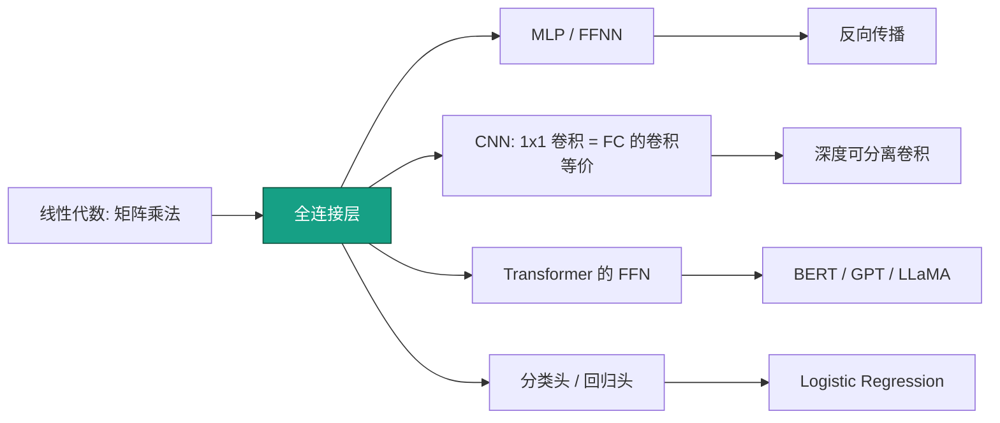
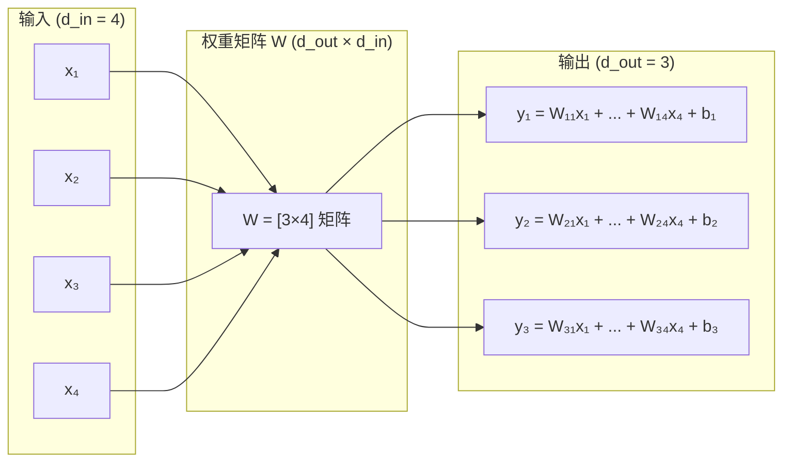
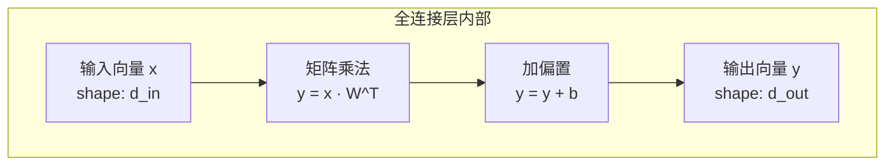

# 全连接层 (Dense / Linear Layer)

## 知识地图



## 前置知识

- 矩阵乘法与转置（$\mathbf{Y} = \mathbf{X}\mathbf{W}^T$）
- 向量空间与线性变换
- 梯度的基本概念（偏导数）
- 激活函数的作用

## 为什么会出现 (Why)

在神经网络出现之前，机器学习依赖人工设计特征来连接原始数据和最终输出。全连接层可以理解为一种**可学习的线性变换 + 偏置**——让网络自己从数据中学习特征组合规则，而非手动设计。单个全连接层等价于线性回归/逻辑回归；堆叠多层并加入非线性后，就构成了 MLP，实现从简单线性模型到深度网络的跨越。

## 解决什么问题 (Problem)

将输入向量 $\mathbf{x} \in \mathbb{R}^{d_{in}}$ 映射到输出向量 $\mathbf{y} \in \mathbb{R}^{d_{out}}$，学习输入特征之间的**加权组合关系**。在深度网络中，全连接层承担"特征重组合"的角色——每一层将上一层提取的特征以不同的权重重新混合，逐步提炼出对目标任务最有用的表示。

## 核心定义

全连接层（又称线性层或稠密层）是神经网络最基础的组件。每个输入神经元与每个输出神经元都有连接权重。

## 数学模型/公式

$$\mathbf{y} = \mathbf{W} \mathbf{x} + \mathbf{b}$$

其中 $\mathbf{W} \in \mathbb{R}^{d_{out} \times d_{in}}$，$\mathbf{b} \in \mathbb{R}^{d_{out}}$。

**通俗解释：** 一个全连接层就像一个"加权投票器"——每个输出神经元对所有输入神经元做一次加权求和（$\mathbf{W}\mathbf{x}$），再加上自己的"偏好分"（$\mathbf{b}$）。权重 W 决定了"哪个输入对哪个输出更重要"，偏置 b 让输出即使所有输入为 0 时也能有一个基础值。

对于批量数据 $\mathbf{X} \in \mathbb{R}^{n \times d_{in}}$：

$$\mathbf{Y} = \mathbf{X} \mathbf{W}^T + \mathbf{b}$$

**通俗解释：** 小批量处理时，我们不是一条一条数据算，而是把所有 n 条数据打包成矩阵一起算——这利用了 GPU 的并行计算能力。注意 PyTorch 中 $\mathbf{W}$ 的形状是 `[d_out, d_in]`，所以要做转置。

### 参数量

$$d_{in} \times d_{out} + d_{out}$$

**通俗解释：** 参数量 = 权重矩阵的每个格子（$d_{in} \times d_{out}$）加上每个输出神经元一个偏置（$d_{out}$）。比如 512 → 1024 的全连接层有 `512 × 1024 + 1024 = 525,312` 个参数——这就是为什么全连接层是参数大户，CNN 用局部连接就是为了避免这个开销。

### 反向传播梯度

对损失 $L$ 的梯度：

$$\frac{\partial L}{\partial \mathbf{x}} = \frac{\partial L}{\partial \mathbf{y}} \mathbf{W}$$

**通俗解释：** 要算"损失对输入的敏感度"，就把"损失对输出的敏感度"乘上权重矩阵。这就像问责——当前输出如果有多重要（梯度大），那么这个输出放大过的输入特征也要承担更多责任。

$$\frac{\partial L}{\partial \mathbf{W}} = \frac{\partial L}{\partial \mathbf{y}}^T \mathbf{x}$$

**通俗解释：** 权重的梯度 = "输出梯度"的外积与"输入"。如果某个输入很大、同时输出梯度也很大，那么这个连接的权重就需要大幅调整。

$$\frac{\partial L}{\partial \mathbf{b}} = \sum_i \frac{\partial L}{\partial y_i}$$

**通俗解释：** 偏置的梯度就是对 batch 中所有样本的输出梯度求和——偏置不管输入是什么，它对每个样本的影响都一样，所以直接累加所有样本的梯度。

---

## 可视化展示

### 全连接层数据流



---

## 模型结构图



---

## 最小可运行代码

### PyTorch 实现

```python
import torch
import torch.nn as nn

# 单层
linear = nn.Linear(in_features=512, out_features=256, bias=True)
x = torch.randn(32, 512)  # [batch, features]
y = linear(x)              # [32, 256]

# 等价于手动计算
w = linear.weight  # [256, 512]
b = linear.bias    # [256]
y_manual = x @ w.T + b

print(f"Input: {x.shape}, Output: {y.shape}")
print(f"Parameters: {sum(p.numel() for p in linear.parameters()):,}")  # 131,328
```

### NumPy 手写

```python
import numpy as np

class DenseLayer:
    def __init__(self, d_in, d_out):
        # He 初始化
        self.W = np.random.randn(d_out, d_in) * np.sqrt(2.0 / d_in)
        self.b = np.zeros(d_out)

    def forward(self, x):
        """x: [batch, d_in] → [batch, d_out]"""
        self.x = x  # 缓存用于反向传播
        return x @ self.W.T + self.b

    def backward(self, grad_out, lr=0.01):
        """grad_out: [batch, d_out]"""
        batch_size = self.x.shape[0]
        # 梯度计算
        grad_W = grad_out.T @ self.x / batch_size      # [d_out, d_in]
        grad_b = grad_out.sum(axis=0) / batch_size      # [d_out]
        grad_x = grad_out @ self.W                      # [batch, d_in]
        # 参数更新
        self.W -= lr * grad_W
        self.b -= lr * grad_b
        return grad_x

# 测试
layer = DenseLayer(10, 5)
x = np.random.randn(3, 10)   # batch=3, d_in=10
y = layer.forward(x)          # [3, 5]
print(f"Forward: {x.shape} → {y.shape}")
```

---

## 工业界应用

| 应用领域 | 具体场景 | 为什么使用全连接层 |
|----------|----------|-------------------|
| 图像分类 | CNN 最后的分类头 | 将卷积特征聚合映射到类别概率 |
| 自然语言处理 | Transformer FFN 子层 | 对每个 token 做非线性特征变换 |
| 推荐系统 | DeepFM / Wide&Deep | 学习特征间的非线性交叉组合 |
| 语音识别 | 声学模型输出层 | 将时序特征映射到音素概率 |
| 强化学习 | Actor-Critic 网络 | 灵活表示策略和价值函数 |
| 生成模型 | VAE 的 encoder/decoder | 将高维数据压缩到隐空间再重建 |

---

## 对比表格

| 对比维度 | 全连接层 (FC) | 卷积层 (Conv2D) | 1×1 卷积 |
|----------|--------------|-----------------|----------|
| 连接方式 | 每个输入连接每个输出 | 局部窗口内连接 | 每个像素位置独立做 FC |
| 参数量 | $d_{in} \times d_{out}$ | $C_{in} \times C_{out} \times K^2$ | $C_{in} \times C_{out}$ |
| 空间信息 | 丢失（输入视为向量） | 保留（二维结构） | 保留（逐点操作） |
| 输入格式 | `[B, d_in]` | `[B, C, H, W]` | `[B, C, H, W]` |
| 典型位置 | MLP 全层、分类头 | CNN 特征提取 | 通道融合、降维 |
| 计算量 | 大 | 大（但参数高效） | 轻量 |

---

## 学完后建议继续学习

- [MLP / FFNN](./ffnn-mlp.md) —— 全连接层堆叠构成多层感知机
- [卷积层 (Conv Layer)](./conv-layer.md) —— 从全连接到局部连接
- [归一化方法](./normalization.md) —— BatchNorm / LayerNorm 加速收敛
- [Dropout 正则化](./dropout.md) —— 防止全连接层过拟合
- [反向传播详解](./backpropagation.md) —— 理解梯度计算的链式法则

---

## 高频面试题

**Q1: 全连接层中 $W$ 乘上 $x$ 的两种写法 $\mathbf{W}\mathbf{x}$ 和 $\mathbf{x}\mathbf{W}^T$ 有什么区别？**

标准答案：$\mathbf{W}\mathbf{x}$（W 在左，数学表示法）中 $\mathbf{W}$ 的形状是 $[d_{out}, d_{in}]$；$\mathbf{x}\mathbf{W}^T$（x 在左，批量计算法）中，$\mathbf{X}$ 的形状是 $[N, d_{in}]$，$\mathbf{W}$ 的形状是 $[d_{out}, d_{in}]$。PyTorch 的 `nn.Linear` 内部存储 `weight` 为 $[d_{out}, d_{in}]$，forward 时做 $\mathbf{x}\mathbf{W}^T$。两种写法数学上等价，区别在于批量处理时的维度排列。

**Q2: 为什么全连接层最容易过拟合？怎么缓解？**

标准答案：因为全连接层参数量极大——每个输入和输出之间都有独立参数。例如从 512 维到 256 维就有 13 万参数，而一个 3×3 卷积只有 9 个参数。缓解方法：(1) Dropout（最常用，p=0.5 对 FC 层效果最好）；(2) L1/L2 正则化（权重衰减）；(3) BatchNorm 提供轻微正则化；(4) 减小层宽度或深度。

**Q3: Transformer 中 FFN 的 $d_{ff} \approx 4 \times d_{model}$ 是怎么来的？**

标准答案：这是从原始 Transformer 论文（Vaswani et al., 2017）沿袭下来的经验设计。FFN 是一个 2 层 MLP：$\text{FFN}(x) = \text{GELU}(xW_1 + b_1)W_2 + b_2$，其中 $W_1$ 将维度从 $d_{model}$ 扩到 $d_{ff}$（通常 4 倍），$W_2$ 再缩回来。4 倍是一个平衡点——太小则表达力不足，太大则参数量爆炸（FFN 占 Transformer 参数的约 2/3，因为 $W_1$ 和 $W_2$ 各含 $d_{model} \times d_{ff}$ 个参数）。

**Q4: 全连接层在 CNN 和 Transformer 中的角色有什么不同？**

标准答案：在 CNN 中，全连接层通常只在最后的"分类头"出现——将卷积层提取的高维空间特征（经 Global Average Pooling 压成向量后）映射到类别 logits。早期 CNN（AlexNet、VGG）在最后用多层 FC，现代 CNN（ResNet）多用单层 FC 或直接 GAP + FC。在 Transformer 中，全连接层是 FFN 的核心，每个 block 里都有，对所有 token 位置独立应用相同的变换（position-wise），负责对注意力输出的 token 表示做非线性特征变换。

**Q5: `nn.Linear` 的 bias 参数什么时候应该设为 False？**

标准答案：当全连接层紧跟在 BatchNorm 后面时，可以把 bias 设为 False——因为 BatchNorm 的 $\beta$（可学习偏移参数）已经包含了 bias 的功能，Linear 的 bias 是冗余的。另外在某些特定架构中（如某些 Transformer 实现），Attention 层中的 QKV 投影有时也设 bias=False，因为 LayerNorm 已做中心化处理。
