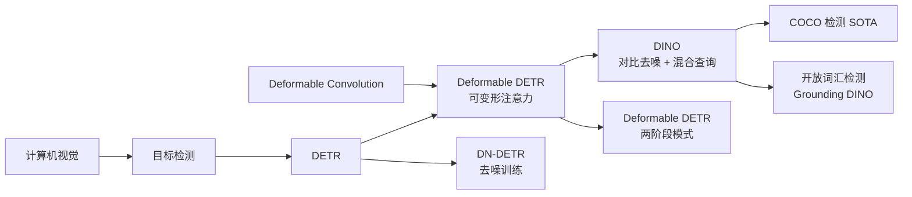
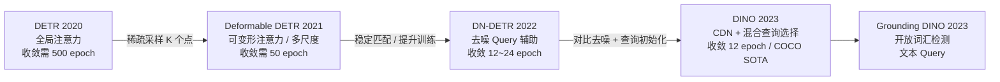
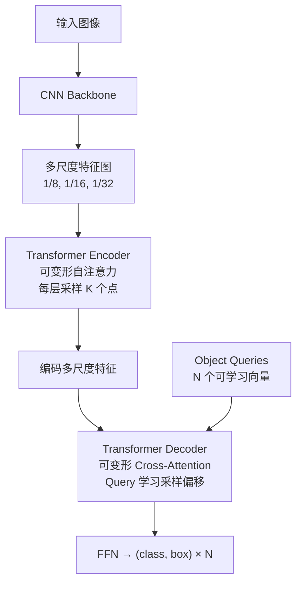
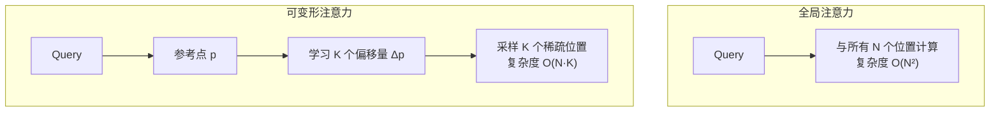
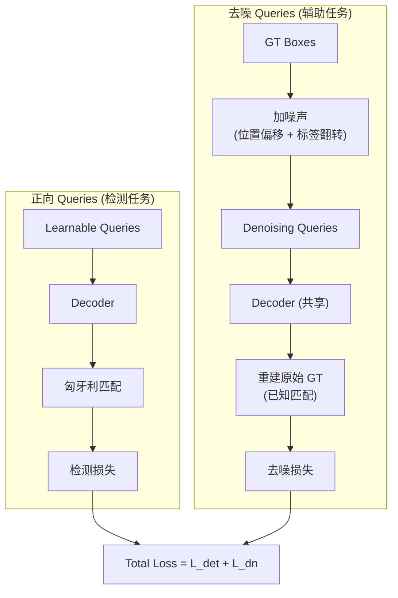
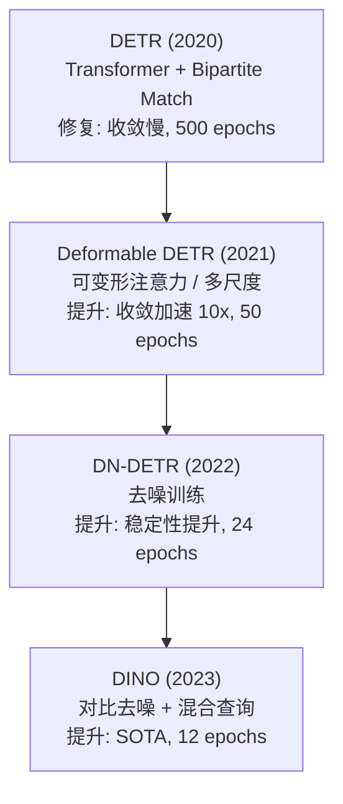
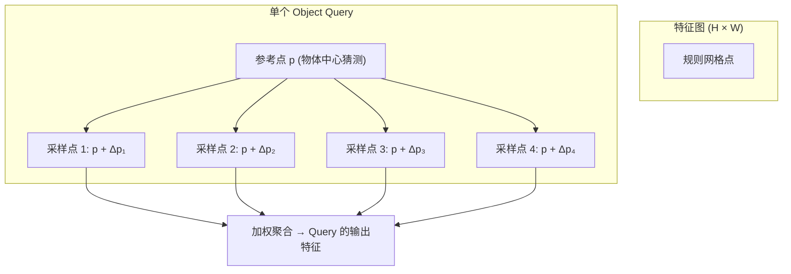

# DETR Variants (Deformable DETR / DINO)

## 知识地图



## 前置知识

- **DETR 基础**：Object Queries、匈牙利匹配、端到端集合预测
- **Deformable Convolution**：可变形卷积中偏移学习的思想
- **注意力机制**：标准 Self-Attention 和 Cross-Attention 的计算
- **目标检测评估**：COCO mAP、收敛 epoch 的概念
- **对比学习基础**：正负样本对的构建

## 模型演化路线



| Model | Year | Key Innovation |
|-------|------|----------------|
| DETR | 2020 | Transformer + Bipartite Matching，无 Anchor/NMS 的端到端检测 |
| Deformable DETR | 2021 | 可变形注意力（稀疏采样 K 个点），收敛速度提升 10 倍，支持多尺度 |
| DN-DETR | 2022 | Denoising Training：给 GT 框加噪声生成去噪 Query，稳定 Hungarian 匹配 |
| DINO | 2023 | 对比去噪 (CDN) + 混合 Query 选择 + Look Forward Twice，12 epoch 即 SOTA |
| Grounding DINO | 2023 | 文本 Query 引导的开放词汇检测，DINO + 语言模型融合 |

## 为什么会出现 (Why)

DETR 用 Transformer 彻底简化了检测流水线——没有 Anchor、没有 NMS、没有 RPN，直接端到端预测集合。但原始 DETR 有两个致命弱点：

1. **收敛慢**：训练需要 500 epochs（Faster R-CNN 只需 12 epochs）。原因在于 Cross-Attention 的注意力图在训练初期是随机的，Query 需要大量迭代才能学会聚焦物体区域。此外，全局注意力在 $H \times W$ 个位置上的搜索空间太大了。

2. **小目标差**：DETR 的全局注意力在低分辨率特征图（$H/32 \times W/32$）上操作，小物体的特征只有几个像素，很难被注意力捕捉。

Deformable DETR 用可变形注意力替代全局注意力：每个 Query 只关注 $K$ 个（通常 4 个）学习到的稀疏采样点。复杂度从 $O(H^2W^2)$ 降到 $O(HWK)$，收敛速度飙升 10 倍，同时支持多尺度特征图改善小目标检测。DINO 进一步引入对比去噪训练和混合查询选择，成为 DETR 系列的集大成者。

## 解决什么问题 (Problem)

- **Deformable DETR**：加速 DETR 收敛（500→50 epoch），改善小目标检测
- **DINO**：进一步加速收敛（50→12 epoch），达到 COCO 检测 SOTA，匹敌甚至超越传统检测器

## 核心思想 (Core Idea)

**Deformable DETR**：每个 Query 只关注特征图上 $K$ 个可学习的稀疏参考点，将注意力复杂度从 $O(N^2)$ 降为 $O(NK)$。  
**DINO**：通过对比去噪训练（正向 Query 学检测、负向 Query 学拒识）和从 Encoder 输出初始化 Decoder Query，实现极速收敛。

## 模型结构图

### Deformable DETR 架构



### 可变形注意力 vs 全局注意力



### DINO 对比去噪训练



## 数学模型/公式

### Deformable DETR — 可变形注意力

$$\text{DeformAttn}(\mathbf{z}_q, \mathbf{p}_q, \mathbf{x}) = \sum_{m=1}^{M} \mathbf{W}_m \left[ \sum_{k=1}^{K} A_{mqk} \cdot \mathbf{W}_m' \mathbf{x}(\mathbf{p}_q + \Delta \mathbf{p}_{mqk}) \right]$$

**通俗解释：** $\mathbf{z}_q$ 是某个 Query 的特征向量，$\mathbf{p}_q$ 是该 Query 的参考点（一个二维坐标）。Query 通过学习得到 $K$ 个采样偏移量 $\Delta \mathbf{p}_{mqk}$（每个 head $m$ 独立学习），每个采样点上的特征向量 $\mathbf{x}(\mathbf{p}_q + \Delta \mathbf{p})$ 用注意力权重 $A_{mqk}$ 加权求和。因为是在连续坐标上采样（通过双线性插值实现），所以叫"可变形"——采样位置可以偏离规则网格。

这与标准注意力的关键区别：标准注意力中 $K = N$（所有位置），这里 $K$ 是常数（4~8）。

### 计算复杂度分析

| 方法 | 复杂度 | 说明 |
|------|--------|------|
| 标准自注意力 | $O(N_q C^2 + N_q N_k C)$ | $N_k = HW$ (所有位置) |
| 可变形注意力 | $O(2 N_q C^2 + N_q K C)$ | $K \ll N_k$ (常数) |

**通俗解释：** Deformable DETR 中 $N_q$ 是 Query 数量（~300），$C$ 是特征维度（256），$K$ 是采样点数（4）。标准注意力中 $N_k = HW$，对于 800×1333 的输入约为 2000，所以 $N_k$ 项主导了复杂度。可变形注意力中 $K=4$ 是常数，复杂度线性增长于 $N_q$，而与图像大小几乎无关。

### DINO — 对比去噪 (CDN) 原理

$$\mathcal{L}_{total} = \mathcal{L}_{det}(y, \hat{y}_+) + \lambda \cdot \mathcal{L}_{denoise}(y, \hat{y}_{dn})$$

**通俗解释：** DINO 的两组 Query 在 Decoder 中并行前向：
- **正向 Queries**：标准的可学习 Object Queries，通过匈牙利匹配训练。这是正常的检测任务。
- **去噪 Queries**：已知每个去噪 Query 对应哪个 GT（因为是在 GT 上加噪声生成的），无需匈牙利匹配。模型的任务是从噪声样本中重建正确的 GT。这给了模型一个稳定的"辅助训练信号"——即使匈牙利匹配不稳定，去噪损失也能提供可靠的梯度。

CDN 的"对比"体现在：去噪 Queries 中混入了"负样本"（标签被改为 no-object），让模型学习区分"有物体的噪声样本"和"无物体的噪声样本"。

### DINO — 混合查询选择 (Mixed Query Selection)

$$\mathbf{z}_q^{(0)} = \text{TopK}(\text{Encoder}(\mathbf{I}))_{position}$$

**通俗解释：** 原始 DETR 的 Decoder Queries 用全零向量或可学习的固定向量初始化。DINO 从 Encoder 的输出中选出 top-K 个最有可能是物体的位置，用这些位置的特征来初始化 Decoder Queries。这让 Query 一开始就有了"可能在哪"的先验——它们不再是从随机开始搜索，而是从 Encoder 认为的"高概率物体区域"开始。

## 可视化展示

### DETR 系列演进



### 收敛速度对比

```echarts
return {
  tooltip: { trigger: "axis", confine: true },
  title: { top: 5,  text: 'DETR vs Deformable DETR vs DINO 收敛速度', left: 'center', textStyle: { fontSize: 12 } },
  xAxis: { type: 'value', name: 'Training Epochs' },
  yAxis: { type: 'value', name: 'COCO AP', min: 25, max: 52 },
  series: [
    { name: 'DETR', type: 'line', smooth: true,
      data: [[12,31],[25,37],[50,40],[100,42],[300,44],[500,45]],
      lineStyle: { color: '#95a5a6', width: 2 } },
    { name: 'Deformable DETR', type: 'line', smooth: true,
      data: [[12,44],[25,46],[50,47],[100,47.5]],
      lineStyle: { color: '#16a085', width: 2.5 } },
    { name: 'DINO', type: 'line', smooth: true,
      data: [[12,49.5],[25,50.8],[36,51.2]],
      lineStyle: { color: '#d35400', width: 2.5 } }
  ],
  grid: { left: 60, right: 20, top: 55, bottom: 60 }
}
```

### 可变形注意力采样示意



## 最小可运行代码

### PyTorch — Deformable Attention 简化版

```python
import torch
import torch.nn as nn

class DeformableAttention(nn.Module):
    def __init__(self, d_model=256, n_heads=8, n_points=4):
        super().__init__()
        self.n_heads = n_heads
        self.n_points = n_points
        self.head_dim = d_model // n_heads

        self.sampling_offsets = nn.Linear(d_model, n_heads * n_points * 2)
        self.attention_weights = nn.Linear(d_model, n_heads * n_points)
        self.value_proj = nn.Linear(d_model, d_model)
        self.output_proj = nn.Linear(d_model, d_model)

    def forward(self, query, reference_points, feat_map):
        """
        query: [B, Nq, C] — decoder queries
        reference_points: [B, Nq, 2] — 归一化坐标 [0,1]
        feat_map: [B, C, H, W] — encoder 输出
        """
        B, Nq, _ = query.shape
        _, C, H, W = feat_map.shape

        # 学习采样偏移和注意力权重
        offsets = self.sampling_offsets(query)      # [B, Nq, H*P*2]
        offsets = offsets.view(B, Nq, self.n_heads, self.n_points, 2)
        attn_w = self.attention_weights(query)       # [B, Nq, H*P]
        attn_w = torch.softmax(attn_w.view(B, Nq, self.n_heads, self.n_points), dim=-1)

        # 采样位置 = 参考点 + 偏移
        sample_locs = reference_points.unsqueeze(2).unsqueeze(3) + offsets
        sample_locs = sample_locs * 2 - 1  # 转到 [-1, 1] 给 grid_sample

        # 使用 grid_sample 进行稀疏采样
        # feat_map: [B, C, H, W] -> [B*H, C/H, Nq, P]
        V = self.value_proj(feat_map.flatten(2).transpose(1, 2))
        V = V.view(B, Nq, self.n_heads, -1, self.head_dim)

        output = torch.zeros(B, Nq, d_model, device=query.device)
        # 简化: 实际需要对每个 head 和 point 做 grid_sample
        # 完整实现参考 mmdetection / deformable_detr 官方仓库

        return self.output_proj(output)
```

### PyTorch — DINO 去噪 Query 构造

```python
def build_denoising_queries(gt_boxes, gt_labels, num_queries=300, noise_scale=0.4):
    """
    构造 DINO 的去噪 Queries：
    1. 对 GT 框加位置噪声（中心偏移 + 尺度缩放）
    2. 对部分标签做翻转（label flipping）
    3. 注意力掩膜（防止去噪 Query 看到正向 Query）
    """
    B = len(gt_boxes)
    dn_queries = []
    dn_labels = []
    attn_mask_parts = []

    for b in range(B):
        boxes = gt_boxes[b]  # [M, 4]
        labels = gt_labels[b]  # [M]

        # 位置噪声: 中心坐标偏移 + 尺寸缩放
        noise = (torch.rand_like(boxes) - 0.5) * 2 * noise_scale
        noised_boxes = boxes + noise

        # 标签翻转: 随机改部分标签为 no-object
        flip_mask = torch.rand(len(labels)) < 0.1
        noised_labels = labels.clone()
        noised_labels[flip_mask] = -1  # -1 表示 no-object (负样本)

        dn_queries.append(noised_boxes)
        dn_labels.append(noised_labels)

    return dn_queries, dn_labels
```

## 工业界应用

| 应用领域 | 使用模型 | 说明 |
|----------|---------|------|
| 通用检测 | DINO | COCO SOTA，替代 Faster R-CNN 作为检测基线 |
| 自动驾驶感知 | Deformable DETR | 多尺度可变形注意力对中远距离小物体友好 |
| 开放词汇检测 | Grounding DINO | 文本 Query + 图像 Query，任意类别检测 |
| 遥感检测 | Deformable DETR (微调) | 航拍图中物体密集、尺度变化大，端到端无 NMS 设计适配 |
| 医学影像检测 | DN-DETR | 病灶检测中的稀疏匹配场景 |
| 视频检测 | DINO + 时序传播 | Object Query 在时序帧间传播，实现视频目标检测 |

## 对比表格

| | Deformable DETR | DN-DETR | DINO | Faster R-CNN |
|------|----------------|---------|------|-------------|
| 注意力类型 | 可变形 (K 点采样) | 可变形 | 可变形 | - (ROI Pooling) |
| 收敛 Epoch | ~50 | ~24 | ~12 | ~12 |
| COCO AP (R50) | ~43.8 | ~44.1 | ~49.0 | ~40.3 |
| Query 初始化 | 可学习向量 | 可学习向量 | Encoder Top-K 混合选择 | - |
| 去噪训练 | 无 | 标准去噪 | 对比去噪 (CDN) | 无 |
| 端到端 | 是 | 是 | 是 | 否 (需要 NMS) |
| 代码复杂度 | 中 | 中 | 中-高 | 高 |

## 学完后建议继续学习

1. **DINOv2** — 自监督预训练的 ViT，与 DINO 检测器思路的内在联系
2. **Mask DINO** — DINO 统一检测和分割，一个架构搞定全景分割
3. **Grounding DINO** — 文本 Query 引导的开放词汇检测，DETR 系列与 CLIP 的融合
4. **RT-DETR** — 实时 DETR，解决端到端检测器的推理速度问题
5. **Co-DETR** — 协作式混合分配训练，进一步提升 DETR 系列性能

## 高频面试题

### Q1: Deformable DETR 的"可变形"体现在哪里？和 Deformable Convolution 有什么关系？

**答案：** "可变形"的核心理念相同：让采样位置从固定的规则网格中解放出来，由数据驱动地学习采样位置。

**Deformable Convolution**：标准卷积在固定网格（如 3×3）上采样。可变形卷积为每个采样点学习一个 2D 偏移量，卷积核在偏移后的不规则位置上采样。

**Deformable Attention**：标准注意力在特征图的所有 $N$ 个位置上计算。可变形注意力为每个 Query 学习 $K$ 个稀疏采样点的偏移量，只在这 $K$ 个位置上采样特征。

两者的联系：都是从"规则采样"到"自适应的不规则采样"。可变形注意力可以看作将可变形卷积的思想从 CNN 搬到了 Transformer 中。关键区别在于：可变形卷积的偏移是基于输入特征学习的（local），而可变形注意力的偏移是基于 Query 学习的（query-dependent）。

### Q2: 为什么 Deformable DETR 收敛比 DETR 快 10 倍？

**答案：** 主要有三个原因：

1. **注意力搜索空间缩小**：DETR 的 Cross-Attention 需要从 $HW$（~2000+）个位置中找出物体位置，训练初期注意力近似随机分布，梯度信号非常弱。Deformable DETR 只从 $K=4$ 个稀疏采样点中聚合信息，搜索空间从 2000 维降到 4 维，每个 Query 快速学会聚焦。

2. **多尺度特征图**：Deformable DETR 使用 3~4 个尺度的特征图（1/8, 1/16, 1/32），每个 Query 可以选择从哪个尺度采样。低分辨率特征负责大物体，高分辨率负责小物体，信息层级清晰。而 DETR 只有单尺度的 1/32 特征图，小物体的特征几乎无法被区分。

3. **参考点提供了强先验**：每个 Query 有一个可学习的参考点坐标，采样位置围绕参考点偏移。这相当于给了 Query 一个"空间锚点"。DETR 的 Query 没有这种空间先验，完全靠 Cross-Attention 全局搜索。

### Q3: DINO 的"对比去噪"(CDN) 和 DN-DETR 的"去噪训练"有什么区别？

**答案：** 核心区别在于引入了**负样本**（对比学习的思想）：

- **DN-DETR**：给 GT 框加噪声生成去噪 Query，所有去噪 Query 都对应一个真实的 GT。训练目标是让去噪 Query 重建原始 GT。所有去噪样本都是"正样本"（对应某个 GT）。

- **DINO 的 CDN**：除了正去噪样本（加噪声但保留真实类别），还引入了**负去噪样本**——给 GT 框加噪声后，把类别标签改成"no-object"标签。这些负样本的训练目标是输出"空"类别。这形成了一种对比学习：正样本学会"从噪声中识别物体"，负样本学会"拒识被破坏的噪声样本"。

这种对比设计让模型不仅在知道"某个位置有物体"时能重建，还能学会"某位置的噪声程度已经让物体不可辨识"的判断能力，提高了训练信号的丰富度。

### Q4: DINO 的"混合查询选择"(Mixed Query Selection) 是怎么做的？为什么有效？

**答案：** 传统 DETR/Deformable DETR 的 Decoder Queries 是用可学习的嵌入向量初始化的，这些向量和输入图像无关。DINO 的 MQS 方法：

1. Encoder 输出后，对所有空间位置计算一个简单的"物体性分数"(objectness score)
2. 选出 top-K 个分数最高的位置
3. 用这些位置的 Encoder 特征来初始化 Decoder Queries 的内容部分，用这些位置的坐标来初始化参考点

为什么有效？这给了 Decoder 一个强大的"热启动"——Query 不再从随机位置开始搜索，而是从 Encoder 已经识别出的"高概率物体位置"开始。这相当于将 Encoder 定位为一个"初筛器"，Decoder 在这个初筛结果上做精细化的检测和分类。本质上是将"找到候选物体"和"精确检测物体"两个任务分开处理。

### Q5: DETR 系列模型的 Decoder 中为什么需要 Self-Attention？Object Queries 之间在通信什么？

**答案：** Decoder 中的 Self-Attention 让 Object Queries 之间互相通信，作用有三：

1. **抑制重复检测**：如果两个 Queries 试图检测同一个物体，Self-Attention 让它们互相"看到"对方的意图，通过注意力权重产生抑制效应——都检测同一物体会导致训练损失增大，模型自然学会让 Queries 分散到不同物体。

2. **全局上下文建模**：一个查询在决策"这里是否有一个物体"时，需要知道其他位置已经分配了什么。例如，"画面中已经检测出了 3 个人了，我检测到的也是人，但位置是新的，那合理"——这种推理需要 Self-Attention。

3. **物体关系建模**：在 Cross-Attention 之前，Self-Attention 让 Queries 之间交换信息，形成更全局的理解。类似于检测器中的 NMS 的功能，但以可导的注意力形式实现。

如果去掉 Decoder Self-Attention，DETR 会输出大量重复的检测框——这是验证 Self-Attention 必要性最直接的实验。
