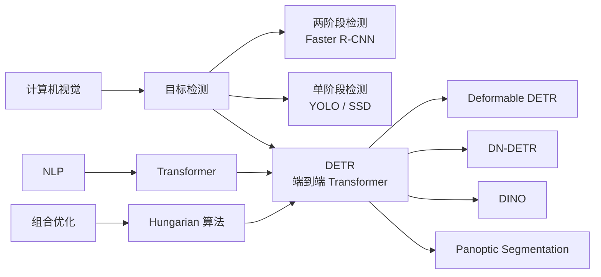
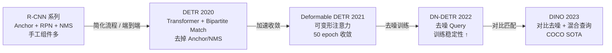
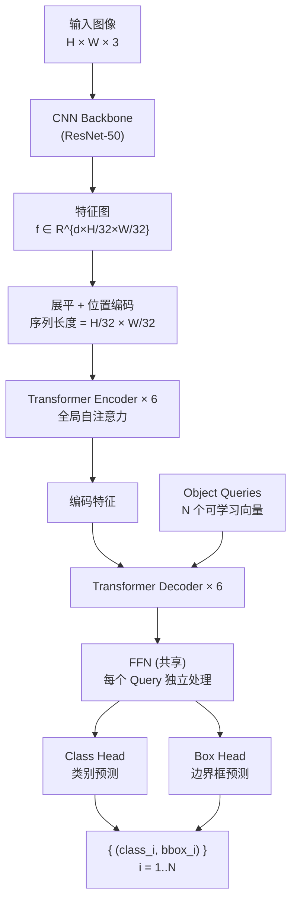
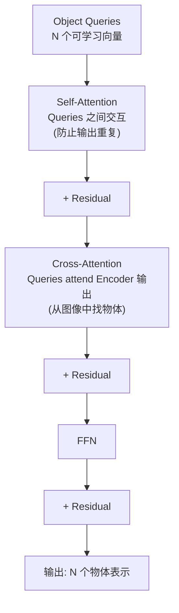
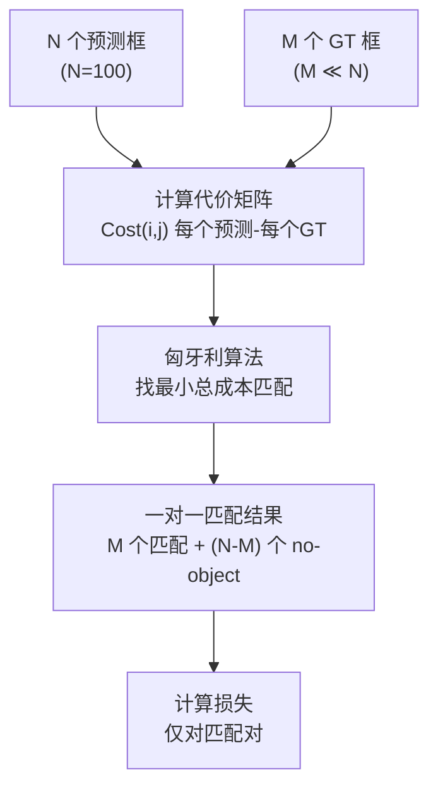

# DETR (DEtection TRansformer)

## 知识地图



## 前置知识

- **目标检测基础**：Anchor、RPN、NMS、IoU、mAP
- **Faster R-CNN**：两阶段检测的流程与组件
- **Transformer**：Encoder-Decoder 架构、Cross-Attention、Position Encoding
- **二分图匹配**：匈牙利算法的基本思想
- **损失函数**：Cross-Entropy、L1 Loss、GIoU Loss

## 模型演化路线



| Model | Year | Key Innovation |
|-------|------|----------------|
| DETR | 2020 | 第一个将 Transformer 用于目标检测，二分图匹配替代 NMS，去掉 Anchor |
| Deformable DETR | 2021 | 可变形注意力，稀疏采样 K 个参考点，收敛速度 10× 加速 |
| DN-DETR | 2022 | 给 Ground Truth 加噪声构造"去噪 Query"，提高训练稳定性 |
| DINO | 2023 | 对比去噪 (CDN) + 混合 Query 选择 + Look Forward Twice，DETR 系列集大成 |

## 为什么会出现 (Why)

传统目标检测（Faster R-CNN、YOLO、SSD）充满了**手工设计的启发式组件**：

1. **Anchor Boxes**：需要预先设计尺度、长宽比，对数据分布敏感
2. **Region Proposal Network (RPN)**：用滑窗提议候选框，产生大量重复预测
3. **Non-Maximum Suppression (NMS)**：后处理去除重叠框，不可导，无法端到端训练
4. **Label Assignment**：需要 IoU 阈值规则决定哪个 Anchor 匹配哪个 GT 框

这些组件让检测流水线变得复杂、脆弱、难以调优。NLP 中 Transformer 的成功启发了 DETR 的作者：能不能把检测建模为**集合预测**问题——直接输出一组无序的物体预测，用 Transformer 处理这种无序性，用二分图匹配做一对一的 GT 匹配？

## 解决什么问题 (Problem)

将目标检测转化为端到端的集合预测问题，用一个统一的 Transformer 架构完全替代 Anchor + RPN + NMS + Label Assignment 的手工流水线。

## 核心思想 (Core Idea)

DETR 将目标检测建模为集合预测问题——用 Transformer Encoder-Decoder 直接输出 $N$ 个物体的类别和边界框，通过匈牙利算法实现预测框与 GT 框的一对一无序匹配，完全去掉 Anchor、RPN 和 NMS。

## 模型结构图

### DETR 完整架构



### Transformer Decoder 层详解



### 二分图匹配流程



## 数学模型/公式

### 二分图匹配 (Bipartite Matching)

$$\hat{\sigma} = \arg\min_{\sigma \in \mathfrak{S}_N} \sum_{i=1}^{N} \mathcal{L}_{match}(y_i, \hat{y}_{\sigma(i)})$$

**通俗解释：** 我们预测了 $N$ 个框（$N=100$），但只有 $M$ 个真实物体。需要在 $N$ 个预测和 $M$ 个 GT 之间做最优的一对一配对。$\sigma$ 是一个排列，$\sigma(i)$ 表示第 $i$ 个 GT 匹配到的预测框编号。匈牙利算法能在 $O(N^3)$ 内找到代价最小的匹配方案。

### 匹配代价函数

$$\mathcal{L}_{match}(y_i, \hat{y}_{\sigma(i)}) = -\mathbb{1}_{\{c_i \neq \varnothing\}} \cdot \hat{p}_{\sigma(i)}(c_i) + \mathbb{1}_{\{c_i \neq \varnothing\}} \cdot \mathcal{L}_{box}(b_i, \hat{b}_{\sigma(i)})$$

**通俗解释：** 匹配代价由两部分加权组成：
- 分类代价：预测框的类别概率 $\hat{p}_{\sigma(i)}(c_i)$ 越接近 1，代价越小（前面有负号）
- 边界框代价：预测框和 GT 框的位置/大小差异
- $\mathbb{1}_{\{c_i \neq \varnothing\}}$ 是指示函数——只有真实物体的类别（非空）才参与框匹配。空类（no-object）的代价为 0。

### 训练损失函数

$$L_{Hungarian}(y, \hat{y}) = \sum_{i=1}^{N} \left[ -\log \hat{p}_{\hat{\sigma}(i)}(c_i) + \mathbb{1}_{\{c_i \neq \varnothing\}} \cdot \mathcal{L}_{box}(b_i, \hat{b}_{\hat{\sigma}(i)}) \right]$$

**通俗解释：** 先用匈牙利算法找到最优匹配 $\hat{\sigma}$，然后对匹配后的预测-GT 对计算损失。对于"无匹配"的预测（预测了但没对应任何 GT），分类损失将其推向"背景/空"类别。框损失只在有匹配的真实物体上计算（L1 + GIoU 的组合）。

### 边界框损失

$$\mathcal{L}_{box}(b_i, \hat{b}_i) = \lambda_{iou} \cdot \mathcal{L}_{iou}(b_i, \hat{b}_i) + \lambda_{L1} \cdot \|\|b_i - \hat{b}_i\|\|_1$$

**通俗解释：** 框损失 = GIoU（广义 IoU）损失 + L1 损失。GIoU 对尺度不敏感（两个框完全重叠时 GIoU=1，离得越远 GIoU 越小），L1 损失则直接约束坐标值。两者的 $\lambda$ 权重通过实验确定。

### Object Queries 工作机制

$$\text{Decoder}(\mathbf{Q}, \text{Encoder}(\mathbf{I})) \rightarrow \{\hat{y}_i\}_{i=1}^N$$

**通俗解释：** $N$ 个 Object Queries 是可学习的嵌入向量（随机初始化后通过训练学习）。每个 Query 像一个"物体探测器"——在 Cross-Attention 中，Query 会从编码后的图像特征中抓取与自己相关的信息。训练后不同 Query 会自然地"专精"于不同位置和尺度的物体（如有的专看左上角大物体，有的专看右下角小物体）。Decoder 中的 Self-Attention 确保不同 Query 不会重复检测同一个物体。

## 可视化展示

### DETR 与 R-CNN 流程对比

```mermaid
%%{init: {'flowchart': {'nodeSpacing': 30, 'rankSpacing': 50}}}%%
graph TD
    subgraph RCNN["Faster R-CNN (多阶段)"]
        R1["Image"] --> R2["CNN Backbone"]
        R2 --> R3["RPN → 生成 Anchors"]
        R3 --> R4["NMS 去重"]
        R4 --> R5["RoI Pooling"]
        R5 --> R6["Classifier + Regressor"]
        R6 --> R7["NMS 再次去重"]
    end
    subgraph DETR2["DETR (端到端)"]
        D1["Image"] --> D2["CNN + Encoder"]
        D2 --> D3["Decoder + Object Queries"]
        D3 --> D4["FFN → (class, box) × N"]
    end
```



## 最小可运行代码

### PyTorch — DETR 核心前向传播

```python
import torch
import torch.nn as nn

class DETR(nn.Module):
    def __init__(self, backbone, transformer, num_classes, num_queries=100):
        super().__init__()
        self.backbone = backbone
        self.transformer = transformer
        self.query_embed = nn.Embedding(num_queries, transformer.d_model)
        self.input_proj = nn.Conv2d(backbone.num_channels, transformer.d_model, 1)
        self.class_head = nn.Linear(transformer.d_model, num_classes + 1)  # +1 for no-object
        self.bbox_head = MLP(transformer.d_model, 4)

    def forward(self, x):
        # 1. CNN Backbone 提取特征
        features = self.backbone(x)  # [B, C, H, W]
        src = self.input_proj(features)  # [B, d_model, H, W]
        B, C, H, W = src.shape
        src = src.flatten(2).permute(2, 0, 1)  # [H*W, B, d_model]

        # 2. Position Encoding
        pos_embed = self.position_encoding(H, W).to(x.device)
        pos_embed = pos_embed.flatten(2).permute(2, 0, 1)  # [H*W, B, d_model]

        # 3. Object Queries
        query = self.query_embed.weight.unsqueeze(1).repeat(1, B, 1)  # [N, B, d_model]

        # 4. Transformer Encoder + Decoder
        hs = self.transformer(src, pos_embed, query)  # [N, B, d_model]

        # 5. Prediction Heads
        outputs_class = self.class_head(hs)  # [N, B, num_classes+1]
        outputs_coord = self.bbox_head(hs).sigmoid()  # [N, B, 4]
        return {'pred_logits': outputs_class, 'pred_boxes': outputs_coord}
```

### PyTorch — 匈牙利匹配实现

```python
from scipy.optimize import linear_sum_assignment

def hungarian_matching(outputs, targets):
    """
    outputs: {'pred_logits': [B, N, C+1], 'pred_boxes': [B, N, 4]}
    targets: list of {labels: [M], boxes: [M, 4]}
    """
    B, N = outputs['pred_logits'].shape[:2]
    indices = []

    for b in range(B):
        # 分类代价: -log(prob) for target class
        pred_logits = outputs['pred_logits'][b]  # [N, C+1]
        pred_boxes = outputs['pred_boxes'][b]    # [N, 4]
        tgt_labels = targets[b]['labels']         # [M]
        tgt_boxes = targets[b]['boxes']           # [M, 4]
        M = len(tgt_labels)

        # 代价矩阵: [M, N]
        cost_class = -pred_logits[:, tgt_labels].T  # [M, N]
        cost_bbox = torch.cdist(pred_boxes, tgt_boxes, p=1)  # [M, N] L1
        cost_giou = 1 - generalized_box_iou(pred_boxes, tgt_boxes)  # [M, N]

        C = cost_class + 5 * cost_bbox + 2 * cost_giou
        C = C.detach().cpu().numpy()

        # 匈牙利算法
        row_ind, col_ind = linear_sum_assignment(C)
        indices.append((row_ind, col_ind))

    return indices
```

## 工业界应用

| 应用领域 | 使用模型 | 说明 |
|----------|---------|------|
| 通用目标检测 | DETR / Deformable DETR | COCO 基准，无 NMS 后端更简洁 |
| 全景分割 | DETR + Mask Head | 统一检测和分割，一个模型同时输出 bbox 和 mask |
| 多目标跟踪 | TrackFormer (DETR-based) | Object Query 在帧间传播实现跟踪 |
| 3D 目标检测 | DETR3D | 多视角图像到 3D 框的端到端检测 |
| 视觉问答 | MDETR | DETR 结构 + 文本 Query 做多模态推理 |
| 医学影像检测 | DETR (fine-tuned) | 病灶检测中的稀疏标签场景，无需手工设置 Anchor |

## 对比表格

| | DETR | Faster R-CNN | YOLOv5/v8 |
|------|------|-------------|-----------|
| NMS | 不需要 | 需要 | 不需要 (v8+) |
| Anchor | 不需要 | 需要 (手工设计) | 不需要 (v8+) |
| 架构 | Transformer Encoder-Decoder | CNN + RPN + RoI Pooling | CNN 单阶段 |
| 收敛速度 | 慢 (~500 epochs) | 快 (~12 epochs) | 快 (~300 epochs) |
| 小物体检测 | 差 (全局注意力对小分辨率不友好) | 较好 | 中 |
| 端到端程度 | 完全端到端 | 需要 NMS 后处理 | 需要 NMS (v5) |
| 代码复杂度 | 低 (统一架构) | 高 (多组件) | 中 |
| 优雅度 | 极高 | 中等 | 中等 |

## 学完后建议继续学习

1. **Deformable DETR / DINO** — DETR 系列的改进，解决收敛慢和小目标差的问题
2. **匈牙利算法原理** — 理解组合优化中的二分图匹配
3. **MaskFormer / Mask2Former** — DETR 思想在语义/实例分割中的推广
4. **TrackFormer** — Object Query 跨帧传播实现端到端多目标跟踪
5. **Grounding DINO** — 文本引导的开放词汇检测，DETR + CLIP 的结合

## 高频面试题

### Q1: DETR 为什么不需要 NMS？它是怎么避免重复检测的？

**答案：** DETR 通过三个机制避免重复检测：

1. **二分图一对一匹配**：训练时，匈牙利算法强制每个 GT 框只匹配一个预测框。如果两个预测框都对应同一个 GT，只有一个能匹配上，另一个被标记为"no-object"。这让模型学到"一个物体只应该输出一个框"。

2. **Decoder 中的 Self-Attention**：Object Queries 在 Decoder 的 Self-Attention 层中互相通信。如果两个 Query 试图检测同一个物体，它们的 Attention 会互相抑制——这使得 Queries 自然地分散到不同位置和尺度的物体。

3. **足够多的 Queries (N=100) + 空类别**：模型输出固定 100 个预测，多余的 Queries 被训练为输出"no-object"（空类别），推理时直接过滤。

### Q2: DETR 为什么收敛慢？训练 500 epochs 是什么概念？

**答案：** 三个原因导致收敛慢：

1. **注意力学习困难**：Cross-Attention 在训练初期几乎是"随机注意力"——Query 随机地关注图像各处，无法有效聚焦物体区域。需要大量迭代才能让注意力图收敛到有意义的区域。

2. **二分图匹配的不稳定性**：训练初期预测质量差，匈牙利匹配的结果在每个 epoch 波动很大。同一个 Query 在不同 epoch 可能被匹配到不同的 GT，导致优化目标频繁切换。

3. **L1 框损失的尺度问题**：大框和小框的 L1 损失数值差异大，影响梯度平衡。

对比：Faster R-CNN 通过 Anchor 和 RPN 提供了一个很强的"初始猜测"（proposals），训练一开始就有合理的候选框，因此 12 epochs 就能收敛。Deformable DETR 通过可变形注意力（只关注 K 个稀疏采样点）将注意力搜索空间大幅缩小，收敛到 ~50 epochs。

### Q3: Object Queries 是什么？它们如何学会"各司其职"？

**答案：** Object Queries 是 $N$ 个可学习的嵌入向量（如 $N=100$，每个 256 维），作为 Transformer Decoder 的输入。它们的本质是"物体探测器模板"——每个 Query 学习成为一种特定模式的检测器。

训练过程：Query 首先通过 Decoder 的 Cross-Attention 从编码后的图像特征中聚合信息，然后通过共享的 FFN 生成 class 和 box 预测。由于匈牙利算法强制一对一匹配，不同 Query 被"推"向不同的物体。作者可视化发现：不同 Queries 确实专精于不同空间位置（左上、右下等）和不同尺度（大框 vs 小框）。

CV 意义的理解：可以把 Object Queries 看成一种"软 Anchor"——不像传统 Anchor 那样手工定义尺度和位置，而是让模型从数据中学习"在哪里找什么大小的物体"。

### Q4: DETR 中的 Position Encoding 是怎么做的？为什么比 ViT 的 Position Embedding 更复杂？

**答案：** DETR 使用**正弦位置编码**（和原始 Transformer 一致），但对特征图的 x 和 y 坐标分别编码后拼接：

$$\text{PE}(x, y, 2i) = \sin(x / 10000^{2i/d})$$
$$\text{PE}(x, y, 2i+1) = \cos(x / 10000^{2i/d})$$

对 y 坐标同样编码。最终每个空间位置得到一个 d_model 维的编码向量。

为什么比 ViT 复杂？ViT 只需要编码 Patch 的"顺序"（1D 序列位置），DETR 需要编码 2D 空间坐标。位置编码在 DETR 中尤为重要——Attention 本身是置换不变的，Encoder 和 Decoder 都需要位置编码来让模型"知道每个特征向量来自图像的哪个位置"。Decoder 的 Cross-Attention 正是利用位置编码来引导 Object Queries 关注特定区域。

### Q5: DETR 的损失函数和传统检测器有什么根本不同？

**答案：** 最根本的区别在于**标签分配**方式：

- **传统检测器**：预测框通过 IoU 阈值（如 >0.7 正样本，<0.3 负样本）分配给 GT 框。一个 GT 可能匹配多个预测框（多对一），正负样本的数量和配对比率由 IoU 阈值控制。这个分配规则是固定的启发式规则。

- **DETR**：通过匈牙利算法求解最优的一对一匹配。每个 GT 恰好分配一个预测框（一对一），匹配是在损失函数层面动态计算的——每次前向传播后找到当前模型下的最优匹配。不存在手工的正负样本阈值，匹配完全基于最小化总代价。

这种设计的影响：一对一匹配天然去掉了重复检测（因为一个 GT 只有一个预测），不再需要 NMS；但没有多对一的"redundant assignments"也让收敛变慢（每个 GT 只有一个梯度信号的来源）。
