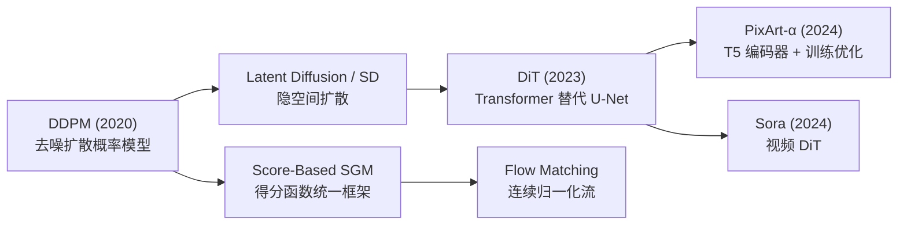
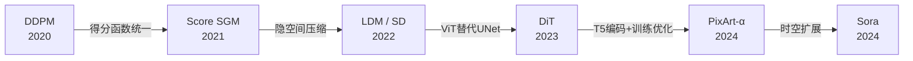
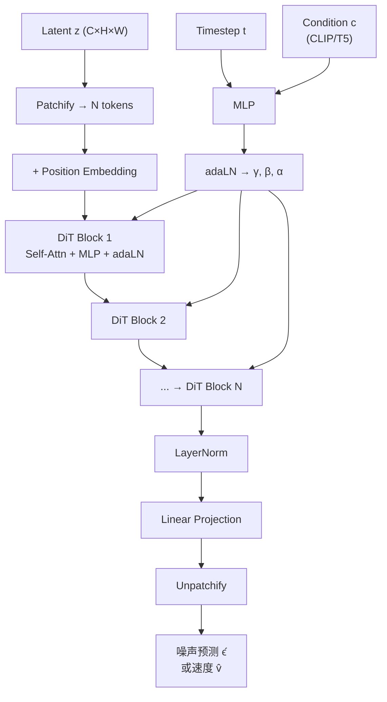
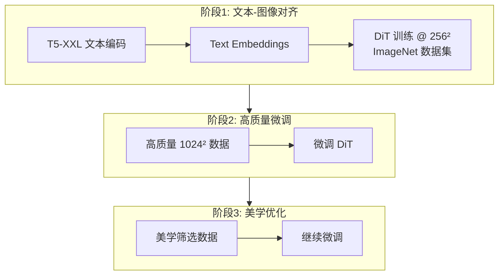

# Diffusion Advanced (SGM / DiT / PixArt-α)

## 知识地图



## 前置知识

- **扩散模型基础 (DDPM/LDM)**：前向加噪、反向去噪、噪声预测
- **U-Net 架构**：编码器-解码器 + 跳跃连接（被 DiT 替代）
- **Transformer / ViT**：自注意力、位置编码、LayerNorm
- **Stable Diffusion**：VAE 压缩 + CLIP 文本编码 + U-Net 去噪

## 模型演化路线



| Model | Year | Key Innovation |
|-------|------|---------------|
| DDPM | 2020 | 去噪扩散概率模型，奠定扩散生成框架 |
| Score SGM | 2021 | 得分函数统一框架，连接 SDE 与扩散 |
| LDM / SD | 2022 | 隐空间扩散，大幅降低计算成本 |
| DiT | 2023 | 用 ViT + adaLN 替代 U-Net 作为去噪骨干 |
| PixArt-α | 2024 | T5-XXL 文本编码器 + 多阶段训练策略 |
| Sora | 2024 | 将 DiT 扩展到视频的时空块建模 |

## 为什么会出现 (Why)

U-Net 虽然是扩散模型的主力架构，但它是为生物医学图像分割设计的 CNN 架构，并非为扩散任务量身定制。随着 ViT 在分类、检测、分割任务中全面超越 CNN，一个自然的问题浮现：**扩散模型的质量瓶颈是否在于 U-Net 架构本身？** 如果能用更具表达能力的 Transformer 替代 CNN，是否能提升生成质量？

同时，CLIP 文本编码器虽然图文对齐好，但在深层语义理解和复杂文本推理方面能力有限——这对需要精确遵循 prompt 的图像生成是瓶颈。

## 解决什么问题 (Problem)

1. **U-Net 表达能力的上限**：CNN 的局部感受野和多尺度设计可能不是去噪任务的最优解
2. **文本理解深度不足**：CLIP 文本编码器的语义理解弱于纯文本大模型 (T5)
3. **训练效率**：如何在保证质量的前提下降低训练和推理成本

## 核心思想 (Core Idea)

**扩散模型的质量瓶颈不在扩散过程而在去噪网络的表达能力——用 Vision Transformer + adaLN 条件注入替代 U-Net (DiT)，用 T5 纯文本编码器替代 CLIP 图文编码器 (PixArt-α)，在压缩隐空间中完成去噪以最大化效率。**

---

## 模型结构图

### DiT 架构 (Diffusion Transformer)



### PixArt-α 训练流程



## 数学模型/公式

### Score-Based Generative Models (SGM)

扩散模型可以统一理解为估计数据分布的**得分函数（score function）**：

$$
s_\theta(\mathbf{x}) = \nabla_{\mathbf{x}} \log p(\mathbf{x})
$$

**通俗解释：** 得分函数告诉你"往哪个方向走一小步能让数据更真实"。$\nabla_{\mathbf{x}} \log p(\mathbf{x})$ 是数据分布的对数概率密度的梯度，指向高概率区域。去噪过程本质上是沿着得分函数指引的方向从噪声走向数据。

### 逆向 SDE

$$
d\mathbf{x} = [\mathbf{f}(\mathbf{x}, t) - g(t)^2 s_\theta(\mathbf{x}, t)] dt + g(t) d\bar{\mathbf{w}}
$$

**通俗解释：** 这是描述从噪声"倒带"回到数据的连续时间方程。$\mathbf{f}$ 是漂移项（向前推），$-g^2 s_\theta$ 是得分项（往高概率方向拉），$g d\bar{\mathbf{w}}$ 是随机扰动（防止卡在局部最优）。每个时间步都同时做"得分引导+微小随机扰动"。

### DDPM 噪声预测与得分函数的关系

$$
s_\theta(\mathbf{x}_t, t) \approx -\frac{\epsilon_\theta(\mathbf{x}_t, t)}{\sigma_t}
$$

**通俗解释：** DDPM 的噪声预测 $\epsilon_\theta$ 和得分函数 $s_\theta$ 本质上是同一回事，只差一个缩放因子 $-\frac{1}{\sigma_t}$。预测噪声为负的得分函数——预测噪声告诉你去除什么，得分函数告诉你增加什么。

### DiT — adaLN (自适应 Layer Normalization)

adaLN 将时间步嵌入 $t_{emb}$ 和条件 $c$ 输入 MLP 生成 scale/shift 参数：

$$
\text{adaLN}(x) = \gamma(t, c) \cdot \text{LayerNorm}(x) + \beta(t, c)
$$

**通俗解释：** 这是 DiT 替代 U-Net 跨层时间注入的关键机制。U-Net 中时间条件通过 cross-attention 注入，而 DiT 中通过对每一层的 LayerNorm 进行"偏移和缩放"来注入。$\gamma$ 控制特征幅度的缩放，$\beta$ 控制特征的偏移，两者都由时间步和文本条件共同决定。

### PixArt-α — 压缩比与训练策略

压缩比 $8\times$（SD 的 $2\times$），即 latent 空间分辨率是原图的 $1/8$：

$$
\mathbf{z} = \text{VAE}_{8\times}(x) \in \mathbb{R}^{B \times C \times H/8 \times W/8}
$$

**通俗解释：** SD 的 VAE 压缩 8 倍，PixArt-α 也是 8 倍。但与 SD 的关键区别在于：(1) 使用 T5-XXL 文本编码器（比 CLIP 语义理解强得多），(2) 三阶段训练策略（先学语义对齐、再学高质量生成、最后精调美学）。

---

## 可视化展示

### DiT 架构

（保留原有 Mermaid DiT 架构图）

### U-Net vs DiT

```echarts
return {
  tooltip: { trigger: "axis", confine: true },
  title: { top: 5,  text: '扩散模型 backbone 对比 (ImageNet 256×256)', left: 'center', textStyle: { fontSize: 12 } },
  xAxis: { type: 'category', data: ['U-Net (ADM)', 'U-Net (LDM)', 'DiT-L', 'DiT-XL', 'PixArt-α'] },
  yAxis: { type: 'value', min: 2, max: 6, name: 'FID (↓ 越低越好)' },
  series: [{
    type: 'bar',
    data: [3.94, 3.60, 3.07, 2.27, 2.53],
    itemStyle: { color: '#2c3e50' },
    label: { show: true, position: 'top' }
  }],
  grid: { left: 60, right: 20, top: 55, bottom: 60 }
}
```

---

## 最小可运行代码

### PyTorch — DiT Block with adaLN

```python
import torch
import torch.nn as nn

class DiTBlock(nn.Module):
    def __init__(self, dim, num_heads, mlp_ratio=4.0):
        super().__init__()
        self.norm1 = nn.LayerNorm(dim, elementwise_affine=False)
        self.norm2 = nn.LayerNorm(dim, elementwise_affine=False)
        self.attn = nn.MultiheadAttention(dim, num_heads, batch_first=True)
        self.mlp = nn.Sequential(
            nn.Linear(dim, int(dim * mlp_ratio)),
            nn.GELU(),
            nn.Linear(int(dim * mlp_ratio), dim))

        # adaLN: MLP 从时间+条件生成 6 组 scale/shift 参数
        self.adaLN_modulation = nn.Sequential(
            nn.SiLU(),
            nn.Linear(dim, 6 * dim, bias=True))

    def forward(self, x, c):
        # c: 时间 + 条件的联合嵌入 [B, dim]
        shift_msa, scale_msa, gate_msa, shift_mlp, scale_mlp, gate_mlp = \
            self.adaLN_modulation(c).chunk(6, dim=1)

        # 自注意力 + adaLN
        x_norm = self.norm1(x)
        x_mod = x_norm * (1 + scale_msa.unsqueeze(1)) + shift_msa.unsqueeze(1)
        attn_out, _ = self.attn(x_mod, x_mod, x_mod)
        x = x + gate_msa.unsqueeze(1) * attn_out

        # FFN + adaLN
        x_norm = self.norm2(x)
        x_mod = x_norm * (1 + scale_mlp.unsqueeze(1)) + shift_mlp.unsqueeze(1)
        x = x + gate_mlp.unsqueeze(1) * self.mlp(x_mod)
        return x


class DiT(nn.Module):
    def __init__(self, in_channels=4, dim=512, depth=12, num_heads=8):
        super().__init__()
        self.patch_embed = nn.Conv2d(in_channels, dim, 2, stride=2)
        self.time_embed = nn.Sequential(
            nn.Linear(256, dim), nn.SiLU(), nn.Linear(dim, dim))
        self.blocks = nn.ModuleList([
            DiTBlock(dim, num_heads) for _ in range(depth)])
        self.final = nn.Sequential(
            nn.LayerNorm(dim), nn.Linear(dim, in_channels * 4))

    def forward(self, z, t, cond=None):
        # z: [B, C, H, W]
        x = self.patch_embed(z).flatten(2).transpose(1, 2)  # [B, N, D]
        c = self.time_embed(timestep_embedding(t, 256))
        if cond is not None:
            c = c + cond
        for block in self.blocks:
            x = block(x, c)
        B, N, D = x.shape
        H = W = int(N ** 0.5)
        x = x.transpose(1, 2).view(B, D, H, W)
        return self.final(x)  # 预测的噪声或速度
```

---

## 工业界应用

| 产品/项目 | 说明 |
|-----------|------|
| **OpenAI Sora** | 基于 DiT 架构的视频生成模型，将图像 DiT 扩展到时空维度 |
| **PixArt-α** | 华为诺亚方舟实验室发布，用 T5 + DiT 实现高质量文本到图像 |
| **PixArt-Σ** | PixArt-α 的升级版，支持 4K 分辨率生成 |
| **Stable Diffusion 3** | Stability AI 采用 DiT (MMDiT) 架构替代 U-Net |
| **Flux** | Black Forest Labs (原 SD 团队) 基于 DiT 的文本到图像模型 |
| **Hunyuan-DiT** | 腾讯的 DiT 变体，中英双语文本到图像 |

---

## 对比表格

| | U-Net (LDM/SD) | DiT | PixArt-α |
|------|----------|-----|----------|
| 骨干架构 | CNN U-Net | Vision Transformer | Vision Transformer |
| 条件注入 | Cross-Attention | adaLN (自适应 LayerNorm) | adaLN |
| 文本编码器 | CLIP (图文对齐) | CLIP / T5 | T5-XXL (纯文本) |
| 训练策略 | 单阶段 | 单阶段 | 三阶段 (对齐→质量→美学) |
| Latent 压缩比 | 8x | 8x | 8x |
| 计算效率 | 中 | 高 (可扩展) | 高 |
| ImageNet FID | 3.60 | 2.27 (XL) | 2.53 |
| 文本遵循度 | 中 | 中高 | 高 |

---

## 学完后建议继续学习

- **Flow Matching / Rectified Flow** — 扩散模型的连续时间推广，SD3 的核心技术
- **Sora / Video Generation** — DiT 从 2D 图像到 3D 时空的扩展
- **MMDiT (SD3)** — 双流 DiT 架构，图文 token 独立处理
- **ControlNet / IP-Adapter** — 在 DiT 架构上的可控生成

---

## 高频面试题

### Q1: DiT (Diffusion Transformer) 相比 U-Net 扩散模型的核心优势是什么？

**标准答案：**
DiT 用 Vision Transformer 替代 U-Net 作为去噪骨干，优势体现在三方面：(1) **扩展性**：Transformer 已被验证在数据和参数规模增大时持续提升性能，而 CNN 的扩展收益递减更快；(2) **全局感受野**：自注意力天然具备全局感受野，不需要 U-Net 的多级下采样来增大感受野；(3) **统一的 token 处理**：将所有 latent patch 和条件统一为 token 序列，便于融合多模态信息。DiT-XL 在 ImageNet 256 上的 FID 达到 2.27，显著优于 U-Net 的 3.60。但代价是计算量和参数量更大。

### Q2: DiT 中的 adaLN (自适应 LayerNorm) 是如何注入条件的？与 cross-attention 有何区别？

**标准答案：**
adaLN 通过对 LayerNorm 的 scale 和 shift 参数进行条件化来注入时间步和文本信息：$\text{adaLN}(x) = \gamma(t, c) \cdot \text{LayerNorm}(x) + \beta(t, c)$。其中 $\gamma$ 和 $\beta$ 由时间步嵌入和条件嵌入通过 MLP 生成。

与 cross-attention 的关键区别：
- **Cross-attention**：token 之间显式交互，查询（图像 token）主动"检索"相关条件信息。计算复杂度 $O(N \cdot M)$（$N$ 个图像 token，$M$ 个条件 token）。
- **adaLN**：条件作为全局调制信号，对所有 token 施加统一的缩放和偏移。计算复杂度 $O(N + M)$。效率更高，但没有 token 级别的选择性。
- 实践中，adaLN 足以传达全局条件（时间步、类别），但对于需要空间对应关系的条件（如文本到图像的文本-token 对应），cross-attention 更精确。

### Q3: PixArt-α 为什么用 T5 文本编码器替代 CLIP？各有什么优劣？

**标准答案：**
CLIP 通过图文对比学习训练，擅长将文本和图像映射到同一向量空间（图文对齐），但其文本理解的深度和推理能力有限——CLIP 本质上是"匹配"而非"理解"文本。T5 是纯文本编码器-解码器模型，在大量文本语料上预训练，语义理解和推理能力远强于 CLIP。

优劣：
- **CLIP 优势**：图文对齐好（同空间表示），计算量小，与 SD 生态兼容。
- **CLIP 劣势**：语义推理弱，无法处理复杂描述和长文本。
- **T5 优势**：深层语义理解，可处理复杂/长文本 prompt，纯文本训练数据量远超图文对。
- **T5 劣势**：与图像 latent 不在同一表示空间（需要更多训练来桥接），T5-XXL 计算量大（4.7B 参数 vs CLIP 约 0.4B）。

### Q4: 得分函数 (Score Function) 和 DDPM 的噪声预测有什么关系？

**标准答案：**
得分函数 $s_\theta(\mathbf{x}) = \nabla_{\mathbf{x}} \log p(\mathbf{x})$ 表示数据对数概率密度的梯度，指向更高概率密度区域。DDPM 的噪声预测 $\epsilon_\theta(\mathbf{x}_t, t)$ 与得分函数的关系为 $s_\theta(\mathbf{x}_t, t) \approx -\frac{\epsilon_\theta(\mathbf{x}_t, t)}{\sigma_t}$。这意味着预测噪声等同于预测负的得分函数（缩放后）。两者的训练目标可以互换——预测噪声更直观（从噪声图中提取噪声分量），预测得分更理论优雅（直接建模数据分布的梯度）。SGM 统一框架表明二者本质上是同一事物的不同参数化。

### Q5: DiT 的 patchify 与 ViT 的 patchify 有何异同？

**标准答案：**
相同点：两者都是将 2D 特征图切分为非重叠的 patch，然后将每个 patch 展平为 token 向量。

不同点：
- **ViT** 在原始 RGB 图像上进行 patchify，patch_size 通常为 16（每个 patch 覆盖 16x16 像素）。
- **DiT** 在 VAE 压缩后的 **latent space** 上进行 patchify（Stable Diffusion 的 VAE 已压缩 8x），patch_size 通常为 2（每个 patch 覆盖 2x2 个 latent 元素，对应 16x16 像素）。这意味着 DiT 的 token 已经在语义更丰富的 latent 空间，而非像素空间。
- DiT 的 patch embedding 用 stride=2 的 Conv2d 实现，等效于非重叠 2x2 patch。
