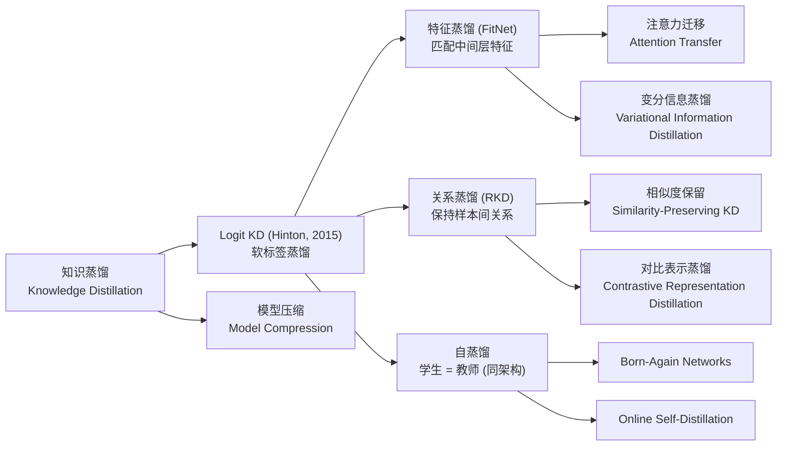
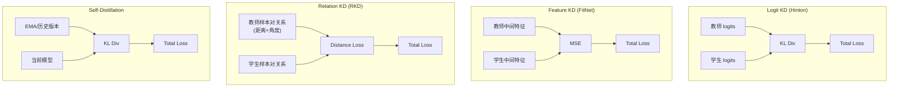
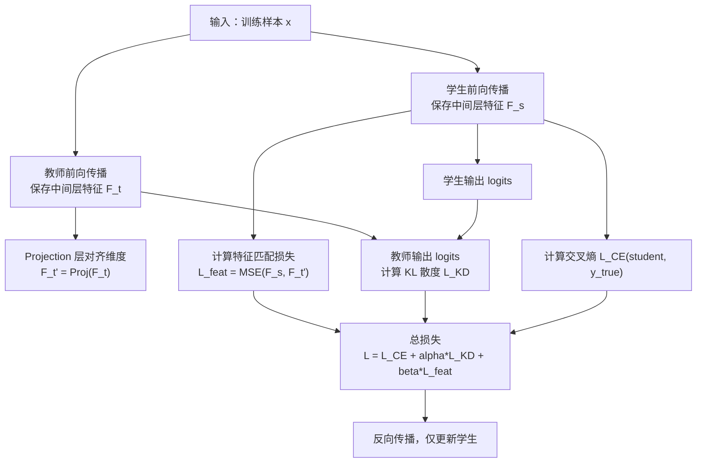
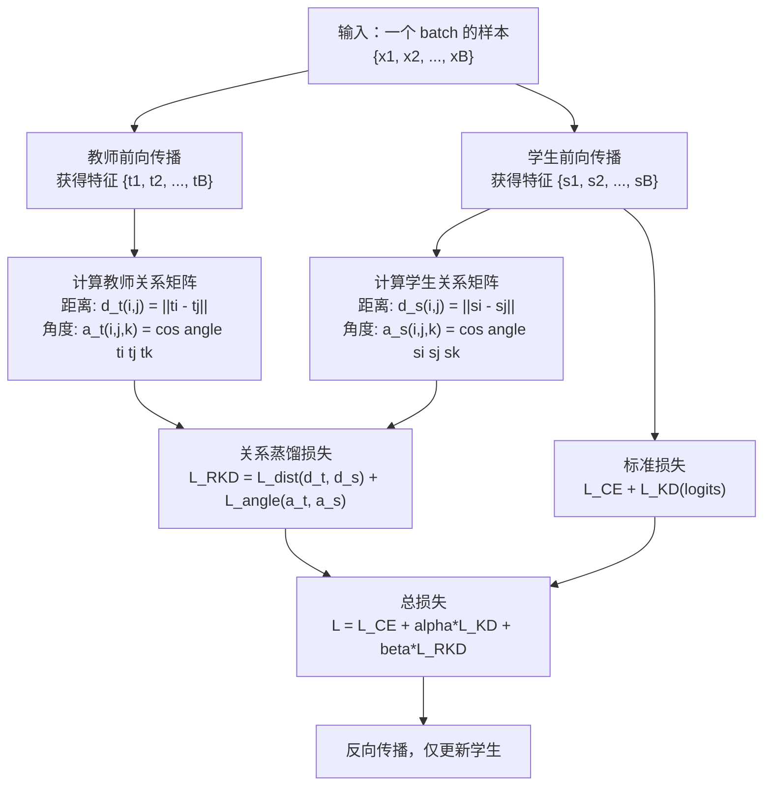
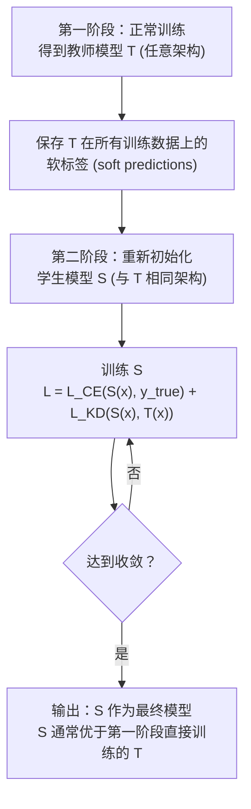

# Advanced Distillation (特征 KD / 关系 KD / 自蒸馏)

## 知识地图



## 前置知识

- **Hinton 的知识蒸馏基础**：理解 Teacher-Student 框架、软标签 (Soft Label)、温度系数 $T$、KL 散度损失（参见 knowledge-distillation.md）
- **KL 散度**：$D_{KL}(P \| Q) = \sum P(x) \log \frac{P(x)}{Q(x)}$——衡量两个分布的差异
- **交叉熵损失**：分类任务的标准损失函数
- **CNN 特征图**：理解中间层特征图的含义（不同层编码不同级别的语义信息）
- **余弦相似度**：$\cos(\mathbf{a}, \mathbf{b}) = \frac{\mathbf{a}^T \mathbf{b}}{\|\mathbf{a}\| \|\mathbf{b}\|}$——用于关系蒸馏中度量方向一致性
- **EMA (指数移动平均)**：$\theta_{EMA} = \beta \theta_{EMA} + (1-\beta) \theta_{current}$，自蒸馏中用于生成教师

## 为什么会出现 (Why)

Hinton 的 logit 蒸馏只从教师最后一层的"答案"中学习——学生只知道教师对每个类别的最终评分，但不理解教师是如何得出这个答案的。这就像学生只看答案而看不到解题过程。特征蒸馏更进一步：**让学生中间层的特征图尽可能匹配教师的特征图**——相当于让学生模仿教师的"解题过程"而非仅"最终答案"。关系蒸馏走另一条路：不匹配单个样本的绝对值，而是保持样本之间的**相对关系**（样本 A 和 B 的距离/角度在师生模型中一致）。自蒸馏则颠覆了需要大教师的假设——**学生自己当自己的教师**，发现软标签本身就比硬标签包含更多信息。

## 解决什么问题 (Problem)

- **特征蒸馏 (FitNet)**：让学生不仅学习教师的最终输出，还学习教师中间层的特征表示，实现更深层次的知识迁移
- **关系蒸馏 (RKD)**：保持样本之间的相对关系（距离、角度）在师生模型中一致，迁移"数据结构"知识而非单点知识
- **自蒸馏**：在没有更大教师模型的情况下，用模型自身（或历史版本）产生软标签来提升自身性能

## 核心思想 (Core Idea)

**特征蒸馏强制学生中间层模仿教师的中间表示（解题过程）；关系蒸馏保持样本间相对关系（数据结构）在师生间一致；自蒸馏让模型用自己的软标签训练自己，利用软标签中类别间相似性的额外信息。**

---

## 数学模型/公式

### FitNet — 特征蒸馏

让学生第 $l$ 层的特征匹配教师第 $m$ 层的特征：

$$
\mathcal{L}_{FitNet} = \frac{1}{2} \| \mathbf{F}_s^{(l)} - \text{Proj}(\mathbf{F}_t^{(m)}) \|^2
$$

中间的 Projection 层确保特征维度匹配。

**通俗解释：** 教师模型处理一张猫的图片时，中间某层的特征图可能激活了"耳朵形状"、"胡须"、"毛发纹理"等模式。特征蒸馏要求学生模型在处理同一张图片时，中间层的特征图也要激活类似的模式。Projection 层是一个适配器——因为教师的特征维度通常比学生大，需要一个线性层把教师特征压缩（或变换）到学生的维度。

### RKD — 关系知识蒸馏

**距离关系（Distance-wise）：保持样本对之间的欧氏距离**

$$
\mathcal{L}_{RKD-D} = \sum_{(x_i, x_j) \in \mathcal{X}^2} \ell_\delta(\psi_D(t_i, t_j), \psi_D(s_i, s_j))
$$

$$
\psi_D(\mathbf{t}_i, \mathbf{t}_j) = \frac{1}{\mu_D} \|\mathbf{t}_i - \mathbf{t}_j\|_2
$$

**通俗解释：** 不是比较单个样本的教师和学生特征是否一致，而是比较"样本对之间的距离"是否一致。如果教师认为猫和狗的特征距离是 5.0，猫和汽车的距离是 20.0，那么学生也应该保持：猫-狗的距离 << 猫-汽车的距离。$\mu_D$ 是平均距离，用于归一化以消除尺度差异。

**角度关系（Angle-wise）：保持三个样本之间的夹角**

$$
\mathcal{L}_{RKD-A} = \sum_{(x_i, x_j, x_k)} \ell_\delta(\psi_A(t_i, t_j, t_k), \psi_A(s_i, s_j, s_k))
$$

$$
\psi_A(\mathbf{t}_i, \mathbf{t}_j, \mathbf{t}_k) = \cos \angle \mathbf{t}_i \mathbf{t}_j \mathbf{t}_k = \langle \frac{\mathbf{t}_i - \mathbf{t}_j}{\|\mathbf{t}_i - \mathbf{t}_j\|}, \frac{\mathbf{t}_k - \mathbf{t}_j}{\|\mathbf{t}_k - \mathbf{t}_j\|} \rangle
$$

**通俗解释：** 用三个样本看角度关系。比如样本 j 是"金毛犬"，i 是"哈士奇"，k 是"波斯猫"。教师认为从金毛犬到哈士奇的方向和从金毛犬到波斯猫的方向夹角很大（一个是狗-狗，一个是狗-猫）。学生也应该保持这个角度关系——即保持样本在特征空间中的"局部几何结构"。角度关系对特征的绝对尺度不敏感，是高阶结构约束。

### 自蒸馏

教师和学生是**同一架构**，训练分为两轮或使用历史 EMA 参数：

1. **Born-Again**：Student = Teacher（相同架构），用 Teacher 的软标签重新训练 Student
2. **Self-Distillation (Online)**：训练过程中，EMA 版本的模型作为教师指导当前模型

自蒸馏的关键发现：即使教师不比学生强，蒸馏仍然有效——因为软标签提供了比 hard label 更丰富的监督信号（类别间的相对关系）。

**通俗解释：** 传统蒸馏需要"大教师教小学生"。自蒸馏的惊人发现是"自己教自己也能进步"。原因：硬标签（one-hot：[猫=1, 狗=0, 汽车=0]）只告诉你"这是猫"，不告诉你"它最像猫，但也有一点像狗，完全不像汽车"。软标签（[猫=0.85, 狗=0.12, 汽车=0.03]）包含了类别之间相似性的丰富信息。第一轮训练的模型产生了这种软标签，第二轮用这些软标签训练同一个架构——模型学到了类别间的结构关系，提升了泛化能力。

### 总损失

$$
\mathcal{L}_{total} = \mathcal{L}_{CE}(y_{true}, y_{student}) + \alpha \mathcal{L}_{KD}(y_{teacher}, y_{student}) + \beta \mathcal{L}_{feat}
$$

**通俗解释：** 总损失是三部分的加权和：(1) 标准的交叉熵——确保学生分类正确；(2) 蒸馏损失——让学生模仿教师的输出；(3) 特征损失——让学生模仿教师的中间表示。$\alpha$ 和 $\beta$ 控制各部分的重要性，通常 $\alpha \approx 0.7-0.9$, $\beta \approx 0.1-0.3$。

---

## 可视化展示

### 蒸馏方法对比



### 算法流程图

#### 特征蒸馏 (FitNet) 流程



#### 关系蒸馏 (RKD) 流程



#### 自蒸馏 (Born-Again) 流程



### 蒸馏策略对比

```echarts
return {
  tooltip: { trigger: "axis", confine: true },
  title: { top: 5,  text: '蒸馏方法在 CIFAR-100 上的提升 (ResNet-18 学生)', left: 'center', textStyle: { fontSize: 12 } },
  xAxis: { type: 'category', data: ['No KD', 'Logit KD', 'FitNet', 'RKD', 'Self-Distill'] },
  yAxis: { type: 'value', min: 73, max: 80, name: 'Top-1 Accuracy (%)' },
  series: [{
    type: 'bar',
    data: [74.5, 76.2, 77.1, 77.8, 76.5],
    itemStyle: { color: '#2c3e50' },
    label: { show: true, position: 'top', formatter: '{c}%' }
  }],
  grid: { left: 60, right: 20, top: 55, bottom: 55 }
}
```

---

## 最小可运行代码

### PyTorch — RKD Loss (距离 + 角度)

```python
import torch
import torch.nn.functional as F

def rkd_distance_loss(student_feat, teacher_feat):
    """
    student_feat / teacher_feat: [B, D]
    保持样本对之间的欧氏距离一致
    """
    # 成对距离矩阵
    with torch.no_grad():
        t_dist = torch.cdist(teacher_feat, teacher_feat, p=2)
        mu_t = t_dist.mean()
        t_dist = t_dist / mu_t

    s_dist = torch.cdist(student_feat, student_feat, p=2)
    mu_s = s_dist.mean()
    s_dist = s_dist / mu_s

    return F.smooth_l1_loss(s_dist, t_dist)


def rkd_angle_loss(student_feat, teacher_feat):
    """
    保持三个样本之间的角度关系
    Student 的局部结构与 Teacher 一致
    """
    B = student_feat.shape[0]
    with torch.no_grad():
        t = F.normalize(teacher_feat, dim=1)  # [B, D]
        t_diff = t.unsqueeze(0) - t.unsqueeze(1)  # [B, B, D]
        t_angle = torch.einsum('bnd,bmd->bnm', t_diff, t_diff)  # cosine of angle

    s = F.normalize(student_feat, dim=1)
    s_diff = s.unsqueeze(0) - s.unsqueeze(1)
    s_angle = torch.einsum('bnd,bmd->bnm', s_diff, s_diff)

    return F.smooth_l1_loss(s_angle, t_angle)


def rkd_total_loss(student_feat, teacher_feat, lambda_d=1.0, lambda_a=2.0):
    return lambda_d * rkd_distance_loss(student_feat, teacher_feat) + \
           lambda_a * rkd_angle_loss(student_feat, teacher_feat)
```

### 自蒸馏 (Born-Again)

```python
import torch
import torch.nn.functional as F

def born_again_train(student, X_train, y_train, teacher_logits, T=4.0):
    """
    Born-Again Network: teacher = student(同架构)
    第一阶段已经产生 teacher_logits
    """
    optimizer = torch.optim.Adam(student.parameters())
    for x, y, t_logits in zip(X_train, y_train, teacher_logits):
        s_logits = student(x)
        # CE + KL
        ce_loss = F.cross_entropy(s_logits, y)
        kd_loss = F.kl_div(
            F.log_softmax(s_logits / T, dim=-1),
            F.softmax(t_logits / T, dim=-1),
            reduction='batchmean') * (T * T)
        loss = ce_loss + kd_loss
        optimizer.zero_grad()
        loss.backward()
        optimizer.step()
```

### 特征蒸馏 + Logit 蒸馏完整示例

```python
import torch
import torch.nn as nn
import torch.nn.functional as F


class FeatureDistillationTrainer:
    """
    结合 Logit KD + Feature KD 的蒸馏训练器。
    """
    def __init__(self, teacher, student, projection_layer,
                 T=4.0, alpha=0.5, beta=0.1):
        self.teacher = teacher
        self.student = student
        self.proj = projection_layer  # 对齐教师和学生特征维度
        self.T = T
        self.alpha = alpha
        self.beta = beta

        # 冻结教师
        for p in self.teacher.parameters():
            p.requires_grad = False

    def train_step(self, x, y, optimizer):
        # 教师前向（不计算梯度）
        with torch.no_grad():
            t_logits = self.teacher(x)
            t_feat = self.teacher.get_intermediate_features(x)  # 需自定义钩子

        # 学生前向
        s_logits = self.student(x)
        s_feat = self.student.get_intermediate_features(x)

        # 1. 标准交叉熵
        loss_ce = F.cross_entropy(s_logits, y)

        # 2. Logit 蒸馏 (KL)
        loss_kd = F.kl_div(
            F.log_softmax(s_logits / self.T, dim=-1),
            F.softmax(t_logits / self.T, dim=-1),
            reduction='batchmean') * (self.T * self.T)

        # 3. 特征蒸馏 (MSE)
        t_feat_proj = self.proj(t_feat)  # 维度对齐
        loss_feat = F.mse_loss(s_feat, t_feat_proj)

        # 总损失
        total_loss = loss_ce + self.alpha * loss_kd + self.beta * loss_feat

        optimizer.zero_grad()
        total_loss.backward()
        optimizer.step()

        return {
            'loss_ce': loss_ce.item(),
            'loss_kd': loss_kd.item(),
            'loss_feat': loss_feat.item(),
            'total': total_loss.item(),
        }


# ===== 使用示例 =====
if __name__ == '__main__':
    # 模拟：教师 ResNet-50，学生 ResNet-18
    print("Feature Distillation Example:")
    print("  Teacher: ResNet-50 (frozen)")
    print("  Student: ResNet-18 (trained)")
    print()

    # 模拟一个 batch 的特征
    B, D_t, D_s = 32, 2048, 512
    t_feat = torch.randn(B, D_t)
    s_feat = torch.randn(B, D_s)

    # Projection 层：将教师特征映射到学生维度
    proj = nn.Linear(D_t, D_s)
    t_feat_proj = proj(t_feat)
    loss_feat = F.mse_loss(s_feat, t_feat_proj)

    print(f"  Teacher feature dim: {D_t}")
    print(f"  Student feature dim: {D_s}")
    print(f"  After projection: {t_feat_proj.shape}")
    print(f"  Feature distillation loss: {loss_feat.item():.4f}")

    # RKD 示例
    print("\nRKD Example:")
    loss_dist = rkd_distance_loss(s_feat, t_feat_proj)
    loss_angle = rkd_angle_loss(s_feat, t_feat_proj)
    print(f"  RKD Distance loss: {loss_dist.item():.4f}")
    print(f"  RKD Angle loss: {loss_angle.item():.4f}")
```

---

## 工业界应用

| 领域 | 应用场景 | 典型用法 |
| --- | --- | --- |
| **移动端部署** | 模型压缩 | 用 ResNet-152 蒸馏 MobileNet-v3——在保持准确率的同时实现手机端实时推理 |
| **NLP 大模型** | BERT 压缩 | DistilBERT——用 BERT-base 蒸馏一个 40% 参数量的学生，保持 97% 性能 |
| **目标检测** | 轻量化检测器 | 用大型检测器蒸馏 YOLO/TinyDet，在边缘设备上运行实时检测 |
| **语音识别** | 流式 ASR | 用离线大模型蒸馏在线小模型，保持高精度的同时实现低延迟 |
| **多模态** | CLIP 蒸馏 | 用大型视觉-语言模型蒸馏跨模态知识到小模型 |
| **联邦学习** | 隐私保护训练 | 自蒸馏技术用于联邦学习场景——不需要传输大模型权重 |

---

## 对比表格

| 维度 | Logit KD (Hinton) | 特征蒸馏 (FitNet) | 关系蒸馏 (RKD) | 自蒸馏 (Born-Again) |
| --- | --- | --- | --- | --- |
| **知识来源** | 教师最后一层 logits | 教师中间层特征图 | 样本对之间的关系结构 | 自身的前一轮输出 |
| **迁移的知识** | "答案"（类间相似性） | "解题过程"（中间表示） | "数据结构"（相对位置） | "自身的软标签" |
| **是否需要大教师** | 是（通常更大更深） | 是 | 是 | 否（同架构） |
| **额外计算开销** | 低（仅最后层） | 中（需存储中间特征） | 中（需计算关系矩阵） | 低（两轮训练） |
| **实现复杂度** | 低 | 中（需选择匹配层） | 中（需计算成对关系） | 低 |
| **效果提升** | 基准方法，稳定 | 对比 Logit KD 额外提升 | 数据量少时优势明显 | 平均 1-2% 提升 |
| **典型应用** | 通用蒸馏基线 | 图像分类、检测 | 小样本场景、度量学习 | 无大教师时的默认选择 |

---

## 学完后建议继续学习

1. **注意力迁移 (Attention Transfer)**：匹配教师和学生的注意力图（activation-based 或 gradient-based）
2. **对比表示蒸馏 (CRD)**：用对比学习框架最大化师生特征之间的互信息
3. **变分信息蒸馏 (VID)**：用变分信息最大化的视角统一各种蒸馏方法
4. **无数据蒸馏 (Data-Free KD)**：在无法访问原始训练数据时，用教师生成的合成数据蒸馏学生
5. **大语言模型蒸馏**：从 GPT-4/Claude 等大模型蒸馏到小模型的特殊挑战和技术

---

## 高频面试题

### Q1: 特征蒸馏 (FitNet) 相比于 Logit 蒸馏的优势是什么？如何选择学生和教师的匹配层？

**标准答案：** 优势：(1) 特征蒸馏不仅迁移最终决策知识，还迁移中间表示知识——学生学到的是"如何表示"而非仅是"如何分类"，泛化能力更强；(2) 特征层包含更丰富的结构化信息（空间位置、局部模式），比 logit 层的单一向量包含更多监督信号。选择匹配层的方法：通常选择语义级别相似的层（如教师最后一个 stage 的输出匹配学生最后一个 stage 的输出）；也可以启发式地选择：教师的中间层和学生中间层（到最后一层的相对位置相似）；或用可学习的路由网络自动选择最优匹配。由于维度不同，必须通过 Projection 层对齐。

### Q2: RKD 的"关系知识"具体指什么？为什么保持"关系"比保持"绝对值"更有意义？

**标准答案：** RKD 关注的是样本之间的**相对关系**而非单个样本的**绝对特征值**。具体包括：(1) 距离关系——样本对之间的欧氏距离；(2) 角度关系——三个样本构成的夹角。保持关系比保持绝对值更有意义的原因：绝对特征值可能因为教师和学生架构不同而无法直接对齐（维度不同、表示尺度不同），但关系是"尺度无关"的——只要 $\frac{\|\mathbf{t}_i - \mathbf{t}_j\|}{\|\mathbf{t}_i - \mathbf{t}_k\|} = \frac{\|\mathbf{s}_i - \mathbf{s}_j\|}{\|\mathbf{s}_i - \mathbf{s}_k\|}$ 成立，学生就正确迁移了数据结构。这使得 RKD 对架构差异更鲁棒。此外，关系知识对下游的聚类、检索等依赖样本间相似度的任务特别有利。

### Q3: 自蒸馏为什么有效？明明教师和学生是同一个模型，为什么第二轮训练能超过第一轮？

**标准答案：** 自蒸馏有效的核心原因是软标签包含了硬标签（one-hot）没有的"暗知识"——类别间的相似性结构。例如，一张猫的图片，硬标签是 [猫=1, 狗=0, 汽车=0]；而第一轮模型的软标签可能是 [猫=0.85, 狗=0.12, 汽车=0.01, 老虎=0.02]。软标签告诉第二轮训练：猫和狗比猫和汽车更相似，猫和老虎有一定相似性。这种类别间的关系信息是一种有效的正则化——防止模型对训练样本过拟合（过度自信），同时帮助模型学习更平滑的决策边界。此外，自蒸馏等价于在模型上加了一个隐含的标签平滑 (Label Smoothing) 和集成效应的正则化。

### Q4: 蒸馏损失中的温度参数 $T$ 的作用是什么？如何选择 $T$？

**标准答案：** $T$ 控制 softmax 输出的"软硬程度"。当 $T \to 0$ 时，softmax 接近 argmax（one-hot）；当 $T \to \infty$ 时，softmax 接近均匀分布。蒸馏使用 $T > 1$ 来"软化"教师的输出，使得非目标类别的小概率在 softmax 后也能获得不可忽略的值——这些就是"暗知识"（如：猫的照片在"狗"类别上也有 0.001 的概率）。$T$ 的选择：(1) 太小——软标签退化为硬标签，蒸馏等同于普通训练；(2) 太大——所有类别概率接近均匀，蒸馏失去信息含量；(3) 经验值——分类任务通常 $T \in [2, 10]$，$T=4$ 是常用默认值；(4) 需要根据教师置信度调整——教师越自信，$T$ 应该越大以暴露更多暗知识。蒸馏损失需要乘以 $T^2$ 来保持梯度尺度不变。

### Q5: 知识蒸馏中，学生模型是否可以比教师模型更深？什么情况下蒸馏反而有害？

**标准答案：** 学生可以比教师更深，但这种情况下的收益通常较小——因为学生在容量上已经不缺，主要瓶颈是训练数据和优化，而非表示能力。如果学生比教师更深，蒸馏仍然可以提供正则化效果（软标签包含的数据结构信息）。蒸馏可能有害的情况：(1) 教师和学生能力差距过大（教师是 ResNet-152，学生是 2 层 MLP）——学生容量不足以模仿教师，强行蒸馏会导致欠拟合；(2) 教师质量差——从错误教师那里学到的错误知识反而误导学生；(3) 师生数据分布不匹配——教师在有偏差的数据上训练，学生继承并放大偏差；(4) 温度 $T$ 选择不当——温度过高导致软标签信息不足；(5) 蒸馏权重过大——学生过度模仿教师，失去从真实标签中学习的机会（需要平衡 $\alpha$ 参数）。
