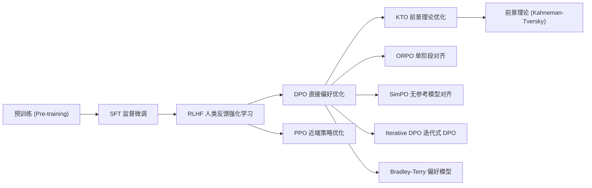
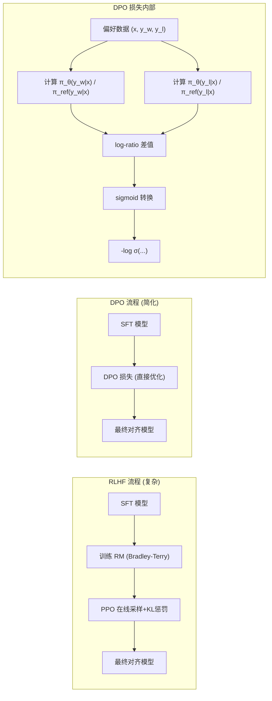

# DPO (直接偏好优化 / Direct Preference Optimization)

## 知识地图



## 前置知识

- **RLHF 三步流程**：SFT -> 奖励模型 (RM) -> PPO 优化，理解 RM 和 KL 惩罚的作用。
- **Bradley-Terry 模型**：成对比较的统计模型，$P(A > B) = \sigma(r_A - r_B)$。
- **KL 散度**：衡量两个分布差异，在 RLHF 中作为约束项。
- **强化学习基础**：策略 (policy)、奖励 (reward)、价值函数 (value function) 的概念。
- **SFT (监督微调)**：DPO 通常在 SFT 模型基础上进行。

## 为什么会出现 (Why)

RLHF 虽然效果好，但有严重工程缺陷：
- **4 个模型同时维护**：Policy、Reference、Reward Model、Value Model，显存和计算开销巨大。
- **训练极其不稳定**：RM 的过拟合、PPO 的超参数敏感、KL 惩罚系数需要精细调整、奖励分布的漂移——任何一个环节出问题训练都会崩溃。
- **在线采样慢**：PPO 每次更新都需要从当前策略采样新的回答，这个生成过程相比梯度计算慢数十倍，严重拖慢训练速度。
- **工程复杂度高**：需要维护数据收集-打分-训练的流水线，多进程协调困难。

DPO (Rafailov et al., 2023) 发现了一个优美的数学事实：**在最优策略的表达式中，RM 可以被策略本身替代**——通过数学推导可以直接将偏好数据转化为策略的优化信号，彻底绕过显式的 RM 训练和在线采样。

## 解决什么问题 (Problem)

DPO 解决的核心问题是：**如何在不训练奖励模型、不做在线强化学习的前提下，直接利用人类偏好数据优化语言模型**。

具体来说：
1. **消除 RM 训练**：不需要额外的奖励模型，减少 1 个模型。
2. **消除在线采样**：不需要 PPO 迭代，可以像普通监督学习一样直接对批量偏好数据进行训练。
3. **提高训练稳定性**：DPO 是一个分类损失（logistic loss），训练行为和普通二分类一样稳定。

## 核心思想 (Core Idea)

**通过数学推导，将 RLHF 中的"奖励模型 + PPO"两步转化为单一的偏好损失函数——直接把"人类更喜欢 A 而非 B"编码为让模型提高 A 的概率、降低 B 的概率，并用参考模型防止跑偏。**

## 算法流程/模型结构图

### DPO 训练流程



## 数学模型/公式

### 核心推导

从 RLHF 的最优策略解析解出发：

$$\pi^*(y|x) = \frac{1}{Z(x)} \pi_{ref}(y|x) \exp\left(\frac{1}{\beta} r(x, y)\right)$$

**通俗解释：** 这是从 KL 约束的强化学习中推导出的最优策略。它告诉我们：最优策略 $\pi^*$ 应该在参考策略 $\pi_{ref}$ 的基础上，对奖励高的回答给予指数级更高的概率。$Z(x)$ 是归一化常数，$\beta$ 控制奖励信号对概率的影响程度——$\beta$ 越小，奖励影响越大。

解出奖励：

$$r(x, y) = \beta \log \frac{\pi^*(y|x)}{\pi_{ref}(y|x)} + \beta \log Z(x)$$

**通俗解释：** 反过来，如果我们有了最优策略，可以从它和参考策略的比值反推"隐含的奖励函数"。这意味着奖励函数不是必须显式训练的——策略本身就隐含了对"好坏"的判断。

### DPO 损失

代入 Bradley-Terry 偏好模型，$Z(x)$ 项抵消掉：

$$L_{DPO} = -\mathbb{E}_{(x, y_w, y_l) \sim D} \left[ \log \sigma\left( \beta \log \frac{\pi_\theta(y_w|x)}{\pi_{ref}(y_w|x)} - \beta \log \frac{\pi_\theta(y_l|x)}{\pi_{ref}(y_l|x)} \right) \right]$$

**直觉**：$\pi_\theta$ 对 $y_w$（优）提高概率，对 $y_l$（差）降低概率，$\pi_{ref}$ 作为锚点防止偏离太远。

**通俗解释：** 这个公式虽然看着长，但逻辑很直接。在括号内部，我们计算了两个"隐含奖励"的差：好回答的奖励减去差回答的奖励。如果好回答的奖励确实大于差回答，sigmoid 接近 1，损失小。如果差回答的奖励反而更大，sigmoid 接近 0，log 惩罚巨大。$\pi_{ref}$ 像一个"定心丸"——我们对好回答提高概率时，需要相对于参考模型；对差回答降低概率时，也需要相对于参考模型。这给出了自然的方向感和幅度。

### DPO vs RLHF

| | RLHF | DPO |
|------|------|-----|
| 模型数 | 4 | 2 (policy + ref) |
| 训练稳定性 | 不稳定 | 稳定 |
| 显式 RM | 需要 | 不需要 |
| 在线采样 | 需要 | 不需要 |
| 效果 | SOTA | 接近或达到 SOTA |

---

## PPO (Proximal Policy Optimization)

### 核心公式

$$L^{CLIP}(\theta) = \hat{\mathbb{E}}_t \left[ \min(r_t(\theta)\hat{A}_t, \text{clip}(r_t(\theta), 1-\epsilon, 1+\epsilon)\hat{A}_t) \right]$$

其中 $r_t(\theta) = \frac{\pi_\theta(a_t|s_t)}{\pi_{old}(a_t|s_t)}$。

**通俗解释：** PPO-CLIP 是对标准策略梯度的"安全带"。$r_t(\theta)$ 表示新策略对旧策略的概率比值。如果某动作有正优势（好的），PPO 会鼓励增加它的概率，但用 clip 限制不超过 $1+\epsilon$。如果旧策略已经给了它很大概率，不用再拼命增加（可能破坏其他能力）。同理，负优势的动作用 $1-\epsilon$ 限制不能过度惩罚。

两种情况下裁剪生效：
- 优势为正 → 限制 $r_t$ 不能 > $1+\epsilon$（不要太激进）
- 优势为负 → 限制 $r_t$ 不能 < $1-\epsilon$（不要太保守）

### RLHF 中的 PPO

$$\text{reward} = r_{RM}(x, y) - \beta \cdot \text{KL}(\pi_\theta \| \pi_{ref})$$

**通俗解释：** RLHF 中的 PPO 奖励是两个力量的平衡：RM 打分的"向上拉"（鼓励高质量）和 KL 惩罚的"往回拽"（防止走偏）。$\beta$ 是控制这个平衡的手柄。

---

## KTO (Kahneman-Tversky Optimization)

### 核心思想

基于前景理论的洞察：**人类对损失的敏感度高于收益**。

KTO 不需要成对的偏好数据（A > B），只需要"满意/不满意"的二元信号：

$$L_{KTO} = \mathbb{E}_{(x,y) \sim D} \left[ w(y) \cdot \left(1 - h(r_\theta(x, y))\right) \right]$$

**通俗解释：** KTO 将经济学前景理论引入 LLM 对齐。人类的心理特点是"丢 100 块的痛苦大于捡 100 块的快乐"——损失厌恶 (loss aversion)。KTO 据此对"坏回答"和"好回答"使用不对称的权重：坏回答受到的惩罚权重更大。这比 DPO 更灵活——不需要成对数据，只要知道每个回答是"好"还是"坏"。

对想要的输出：鼓励 KL 散度大；对不想要的输出：惩罚 KL 散度大。

## 可视化展示

### DPO 训练过程中的奖励差异

```echarts
return {
  tooltip: { trigger: "axis", confine: true },
  title: { top: 5,  text: 'DPO 训练中 Chosen vs Rejected 隐含奖励', left: 'center', textStyle: { fontSize: 12 } },
  xAxis: { type: 'category', data: ['Step 0', 'Step 200', 'Step 400', 'Step 600', 'Step 800', 'Step 1000'] },
  yAxis: { type: 'value', name: '隐含奖励' },
  legend: { top: 28,  data: ['Chosen 奖励', 'Rejected 奖励', '奖励差'] },
  grid: { left: 60, right: 20, top: 55, bottom: 55 },
  series: [
    { name: 'Chosen 奖励', type: 'line', data: [0.0, 0.8, 1.5, 2.2, 2.8, 3.5], smooth: true },
    { name: 'Rejected 奖励', type: 'line', data: [0.0, 0.2, 0.1, -0.3, -0.8, -1.2], smooth: true, itemStyle: { color: '#e74c3c' } },
    { name: '奖励差', type: 'line', data: [0.0, 0.6, 1.4, 2.5, 3.6, 4.7], smooth: true, itemStyle: { color: '#27ae60' } }
  ]
}
```

## 最小可运行代码

### DPO 损失实现 (PyTorch)

```python
import torch
import torch.nn.functional as F

def dpo_loss(policy_logps_chosen, policy_logps_rejected,
             ref_logps_chosen, ref_logps_rejected,
             beta=0.1):
    """
    policy_logps_chosen:   log π_θ(y_w|x)  [B]
    policy_logps_rejected: log π_θ(y_l|x)  [B]
    ref_logps_chosen:      log π_ref(y_w|x) [B]
    ref_logps_rejected:    log π_ref(y_l|x) [B]
    beta: KL penalty 系数
    """
    # 计算 chosen 和 rejected 的隐含奖励
    chosen_reward = beta * (policy_logps_chosen - ref_logps_chosen)
    rejected_reward = beta * (policy_logps_rejected - ref_logps_rejected)

    # 奖励差 → sigmoid → 负对数似然
    reward_diff = chosen_reward - rejected_reward
    loss = -F.logsigmoid(reward_diff).mean()

    return loss, {
        'chosen_reward': chosen_reward.mean().item(),
        'rejected_reward': rejected_reward.mean().item(),
        'reward_margin': reward_diff.mean().item()
    }


# ========== 完整 DPO 训练示例 ==========
from transformers import AutoModelForCausalLM, AutoTokenizer
import torch

class DPOTrainer:
    def __init__(self, model_name="gpt2", beta=0.1, lr=5e-6):
        self.policy = AutoModelForCausalLM.from_pretrained(model_name)
        self.ref_model = AutoModelForCausalLM.from_pretrained(model_name)
        self.tokenizer = AutoTokenizer.from_pretrained(model_name)
        self.tokenizer.pad_token = self.tokenizer.eos_token

        # 冻结参考模型
        for param in self.ref_model.parameters():
            param.requires_grad = False

        self.beta = beta
        self.optimizer = torch.optim.AdamW(self.policy.parameters(), lr=lr)

    def compute_logprob(self, model, input_ids, attention_mask, labels):
        """计算给定回答的 log 概率 (仅计算回答部分)"""
        outputs = model(input_ids, attention_mask=attention_mask, labels=labels)
        # 使用 label mask 计算平均 log 概率
        nll = outputs.loss  # CrossEntropyLoss 已经处理了 label masking
        return -nll  # 返回 log 概率

    def train_step(self, batch):
        """
        batch 格式:
        {
            'prompt': str,
            'chosen': str,
            'rejected': str
        }
        """
        # Tokenize
        def tokenize(prompt, response):
            full = prompt + response
            tokens = self.tokenizer(full, return_tensors="pt", padding=True, truncation=True)
            # 创建 label mask: prompt 部分为 -100
            prompt_tokens = self.tokenizer(prompt, return_tensors="pt")
            prompt_len = prompt_tokens.input_ids.shape[1]
            labels = tokens.input_ids.clone()
            labels[0, :prompt_len] = -100
            return tokens.input_ids, tokens.attention_mask, labels

        chosen_ids, chosen_mask, chosen_labels = tokenize(batch['prompt'], batch['chosen'])
        rejected_ids, rejected_mask, rejected_labels = tokenize(batch['prompt'], batch['rejected'])

        # 计算 policy 的 log 概率
        policy_chosen_logp = self.compute_logprob(self.policy, chosen_ids, chosen_mask, chosen_labels)
        policy_rejected_logp = self.compute_logprob(self.policy, rejected_ids, rejected_mask, rejected_labels)

        # 计算 ref 的 log 概率 (冻结, 不更新)
        with torch.no_grad():
            ref_chosen_logp = self.compute_logprob(self.ref_model, chosen_ids, chosen_mask, chosen_labels)
            ref_rejected_logp = self.compute_logprob(self.ref_model, rejected_ids, rejected_mask, rejected_labels)

        # DPO 损失
        loss, metrics = dpo_loss(
            policy_chosen_logp, policy_rejected_logp,
            ref_chosen_logp, ref_rejected_logp,
            beta=self.beta
        )

        # 反向传播
        self.optimizer.zero_grad()
        loss.backward()
        self.optimizer.step()

        return loss.item(), metrics

# 使用示例
trainer = DPOTrainer()
batch = {
    'prompt': 'What is the capital of France?',
    'chosen': 'The capital of France is Paris.',
    'rejected': 'France is a country in Europe.'
}
loss, metrics = trainer.train_step(batch)
print(f"Loss: {loss:.4f}, Margin: {metrics['reward_margin']:.4f}")
```

### PPO-CLIP 损失实现 (PyTorch)

```python
def ppo_clip_loss(logprobs_new, logprobs_old, advantages, clip_epsilon=0.2):
    """
    PPO CLIP 损失函数
    logprobs_new: 当前策略的 log 概率 [B]
    logprobs_old: 旧策略的 log 概率 [B]
    advantages: 优势函数 [B]（正=好动作，负=坏动作）
    """
    ratio = torch.exp(logprobs_new - logprobs_old)  # r_t(θ) = π_new/π_old
    clipped_ratio = torch.clamp(ratio, 1 - clip_epsilon, 1 + clip_epsilon)

    # 取最小值：保守地选择更悲观的目标
    loss = -torch.min(ratio * advantages, clipped_ratio * advantages).mean()
    return loss
```

## 工业界应用

| 应用领域 | 使用方法 | 为什么用 DPO | 优势 | 劣势 |
|---------|---------|-------------|------|------|
| 开源模型对齐 | LLaMA-3、Mistral 使用 DPO | 训练稳定，不需要复杂 RL 框架 | 成本低，复现容易 | 离线数据可能过时 |
| 对话助手微调 | Zephyr、Tulu 系列 | 快速迭代，可通过偏好数据注入特定行为 | 迭代周期短 | 偏好数据质量决定效果 |
| 安全对齐 | 拒绝回答有害请求 | 偏好数据明确标注安全/不安全回答 | 可精确控制安全边界 | 可能过度拒绝 |
| 代码模型微调 | 偏好正确代码 > 错误代码 | 代码正确性对错明确，排序容易 | 排序标注简单 | 需要大量测试样例 |

## 对比表格

### DPO vs RLHF vs KTO vs ORPO

| 特性 | RLHF | DPO | KTO | ORPO |
|------|------|-----|-----|------|
| 模型数量 | 4 | 2 | 2 | 1 |
| 需要 RM | 是 | 否 | 否 | 否 |
| 需要参考模型 | 是 | 是 | 是 | 否 |
| 需要成对数据 | 是 (排序) | 是 (排序) | 否 (二元标签) | 是 (排序) |
| 训练阶段 | 多阶段 | 两阶段 (SFT+DPO) | 两阶段 | 单阶段 |
| 在线采样 | 需要 | 不需要 | 不需要 | 不需要 |
| 训练稳定性 | 低 | 高 | 高 | 高 |
| 标注成本 | 最高 | 高 | 中 | 高 |
| 效果 | SOTA | 接近/达到 SOTA | 弱于 DPO | 接近 DPO |

### 什么时候用什么方法？

| 场景 | 推荐方法 |
|------|----------|
| 有成对偏好数据 | DPO |
| 有绝对打分 | KTO |
| 可以在线采样 | Online DPO / PPO |
| 资源受限 | DPO |
| 追求极致性能 | Iterative DPO / PPO |

## 学完后建议继续学习

1. **[RLHF 基础](rlhf.md)** — 理解 DPO 之前的标准范式，掌握奖励模型和 PPO 的完整流程。
2. **[对齐进阶方法](alignment-advanced.md)** — 学习 KTO、ORPO、SimPO 等更前沿的对齐技术，理解各方法的数学推导和适用场景。
3. **[SFT 监督微调](sft.md)** — DPO 的基础步骤，掌握高质量指令微调数据的构建和训练。
4. **Rejection Sampling 对齐** — 从 SFT 模型采样 K 个回答，只保留 RM 打分最高的进行 SFT——最简单的对齐方式。
5. **Iterative DPO** — 理解在线 DPO 的优势：每轮用最新策略重新采样偏好数据，避免离线 DPO 的数据分布漂移问题。

## 高频面试题

### Q1: DPO 是如何绕过奖励模型 (RM) 的？请阐述核心数学推导。

**标准答案：**

DPO 的核心洞察来自 RLHF 中最优策略的解析解：

$$\pi^*(y|x) = \frac{1}{Z(x)} \pi_{ref}(y|x) \exp\left(\frac{1}{\beta} r(x, y)\right)$$

将等式两边取对数并整理，可以把奖励函数表示为策略的函数：

$$r(x, y) = \beta \log \frac{\pi^*(y|x)}{\pi_{ref}(y|x)} + \beta \log Z(x)$$

将这两个奖励表达式代入 Bradley-Terry 偏好模型 $P(y_w > y_l) = \sigma(r(y_w) - r(y_l))$，$Z(x)$ 项是 prompt 的函数且同时出现在 $r(y_w)$ 和 $r(y_l)$ 中，相减消去：

$$P(y_w > y_l) = \sigma\left( \beta \log \frac{\pi^*(y_w|x)}{\pi_{ref}(y_w|x)} - \beta \log \frac{\pi^*(y_l|x)}{\pi_{ref}(y_l|x)} \right)$$

这个公式不再包含 $r$ 和 $Z(x)$——偏好概率完全由策略 $\pi^*$ 和参考策略 $\pi_{ref}$ 表达。DPO 损失就是这个模型的负对数似然（即 -log P），直接优化策略参数 $\theta$。

关键含义：**RM 不是消失的——策略本身就成为了隐式奖励模型**。训练过程中，策略学会自动给 chosen 回答分配更高概率。

### Q2: DPO 中的 $\beta$ 参数有什么作用？如何选择？

**标准答案：**

$\beta$ 有两个核心作用：

1. **控制对齐强度**：$\beta$ 越大，偏好信号的影响越小，策略越保守（更像参考模型）。$\beta$ 越小，偏好信号的影响越大，策略越激进地偏离参考模型。

2. **替代 KL 惩罚**：在 RLHF 公式 $\max_\pi \mathbb{E}[r] - \beta \cdot KL(\pi \| \pi_{ref})$ 中，$\beta$ 直接控制 KL 散度的权重。DPO 继承了这个语义——更大的 $\beta$ 意味着更强的隐式 KL 正则化。

如何选择：
- 常用范围：$\beta \in [0.01, 0.5]$
- 经验值：DPO 论文使用 $\beta=0.1$
- 如果训练后模型输出奇怪或不连贯，增大 $\beta$（更保守）
- 如果模型几乎没有区分 chosen 和 rejected，减小 $\beta$（更强的偏好信号）
- 最终选择应通过验证集上的奖励值和 KL 散度来调优

### Q3: 为什么 DPO 比 RLHF 更稳定？

**标准答案：**

三个层面：

1. **损失函数性质**：DPO 是标准的 logistic 损失（和做二分类完全一样），凸且平滑，优化行为可预测。RLHF 中的 PPO 涉及策略梯度、裁剪、优势估计（GAE），每一步都有估计误差累积。

2. **离线 vs 在线**：DPO 在整个固定的偏好数据集上训练，数据分布恒定。PPO 每步都要从当前策略采样新数据——如果策略在某步更新后变得很差，后续采样的数据质量也会下降，形成恶性循环（策略崩溃）。

3. **RM 的误差传播**：RLHF 有一个独立的 RM，它的误差（过拟合某些模式、数据盲区）会通过 PPO 被放大——策略找到的"最优"可能是 RM 的漏洞而非真正的质量。DPO 没有独立 RM，避免了这种误差放大回路。

### Q4: DPO 有什么局限性？

**标准答案：**

1. **离线数据的分布漂移**：DPO 的偏好数据通常由 SFT 模型（或其他模型）采样。当 DPO 训练后策略发生变化，旧偏好数据可能不再准确——SFT 模型"觉得难区分"的回答对，训练后的模型可能"一眼就能区分"，导致训练信号变弱。

2. **偏好数据质量依赖**：DPO 的效果完全取决于偏好数据质量。如果标注员的偏好不一致或不合理，DPO 会学到错误的偏好。

3. **缺少在线探索**：PPO 可以探索新的回答空间并从中学习。DPO 被锁死在已有的偏好数据中，无法发现标注数据之外的更好回答。

4. **reference model 的选择敏感**：DPO 效果依赖于参考模型的选择。如果用 SFT 模型作为参考，某些情况下效果不如用更强模型做参考。

### Q5: 请对比 DPO、KTO、ORPO 的适用场景。

**标准答案：**

- **DPO**：适用于有成对偏好数据（同一个 prompt 的 chosen vs rejected）且标注质量高的场景。标注成本最高但效果最好，是目前开源社区的主流选择（LLaMA-3、Mistral 等模型使用）。

- **KTO**：适用于数据来源多样但不成对的场景——每条数据只要知道"这个回答好还是坏"即可。例如从用户点赞/点踩、论坛 upvote/downvote 中收集的信号。标注成本最低，但效果通常弱于 DPO。

- **ORPO**：适用于想一步到位完成 SFT + 对齐的场景。ORPO 在同一个训练阶段同时优化 SFT 的 CE 损失和对齐的 Odds Ratio 损失，不需要单独的 SFT 阶段。推荐在算力受限或原型快速验证时使用。
