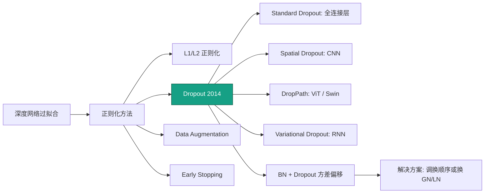
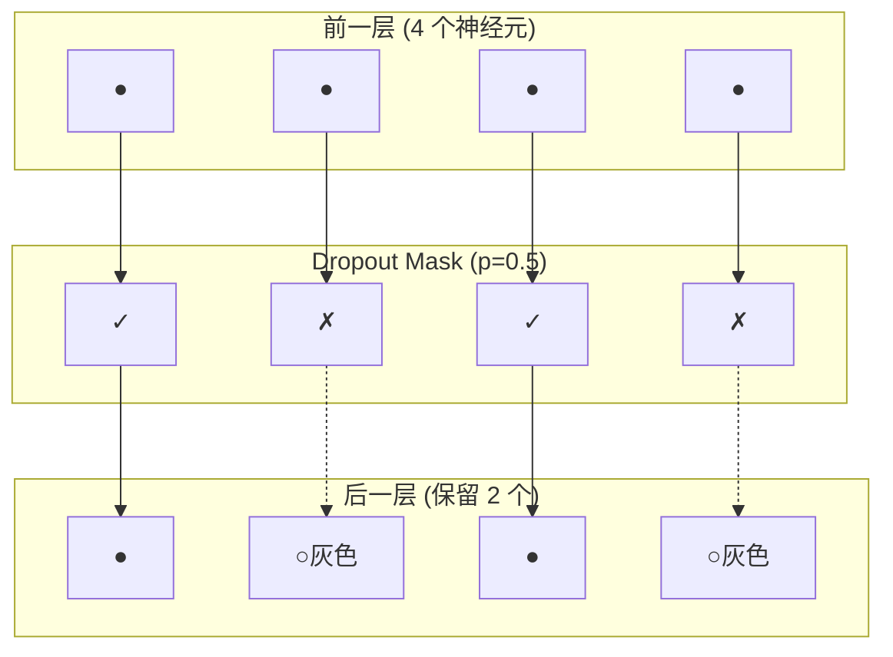

# Dropout

## 知识地图



## 前置知识

- 过拟合的基本概念和表现（训练集准确率高、测试集低）
- 神经网络的前向传播和训练流程
- 集成学习（Ensemble）的基本思想——多个模型投票
- 全连接层和 CNN 的基本结构
- 激活函数的概念

## 为什么会出现 (Why)

深度网络参数多、表达力强，在小数据集上容易过拟合——网络"记住"了每个训练样本的噪声和特例，而不是学到泛化规律。传统的正则化方法（L1/L2 权重衰减）只能约束权重的大小，无法解决神经元之间的"共适应"(co-adaptation) 问题——某些神经元形成了固定的"搭档关系"，一个只处理 A 类型的输入，另一个只处理 B 类型，两者互相依赖，导致网络缺乏冗余和鲁棒性。

Hinton 等人在 2012 年提出 Dropout，以一种极其简洁的方式打破了这种共适应：训练时随机"杀死"一部分神经元，迫使每个神经元必须独立学习有用的特征，因为它的"搭档"随时可能消失。

## 解决什么问题 (Problem)

以极低的计算代价实现强大的正则化效果，防止深度网络过拟合。训练时以概率 $p$ 随机"杀死"神经元，迫使每个神经元学会独立提取有用特征，而非依赖特定同伴——这本质上是**训练 $2^n$ 个子网络的隐式集成**。

## 核心思想 (Core Idea)

每次训练迭代随机丢弃一部分神经元（置零），迫使网络变成多个"残缺但独立"的子网络的隐式集成——每个神经元都必须学会独立工作，而不是依赖特定搭档。

---

## 数学模型/公式

### 标准 Dropout

训练时：

$$
h' = h \odot \mathbf{m}, \quad m_i \sim \text{Bernoulli}(1-p)
$$

其中 $\mathbf{m}$ 是随机二值 mask。

**通俗解释：** 以概率 $p$ 把神经元"枪毙"（输出置零），以概率 $1-p$ 让它存活。每个神经元相当于在玩"俄罗斯轮盘赌"——每轮训练都可能被随机选中出局，所以每个神经元都不敢"偷懒"依赖别人，必须自己学出有用的特征。

测试时所有神经元激活，但需乘 $(1-p)$ 以保持期望一致：

$$
\mathbb{E}[h'_{\text{test}}] = (1-p) \cdot h = \mathbb{E}[h'_{\text{train}}]
$$

### Inverted Dropout（PyTorch 默认方式）

训练时缩放，测试时原样输出——更优雅：

$$
h'_{\text{train}} = \frac{1}{1-p} \cdot h \odot \mathbf{m}, \quad h'_{\text{test}} = h
$$

**通俗解释：** 标准 Dropout 的"麻烦"在于测试时要乘 $(1-p)$，这需要改推理代码。Inverted Dropout 把这个缩放提前到训练阶段——训练时活下来的神经元值放大 $1/(1-p)$ 倍，测试时就不用任何额外操作了。PyTorch 的 `nn.Dropout` 默认用这个方式。

### 为什么有效？三个视角

1. **集成学习视角**：每次前向传播随机丢弃不同神经元 = 训练不同的子网络。$n$ 个神经元对应 $2^n$ 个可能的子网络，测试时近似为它们的集成

2. **共适应（Co-adaptation）抑制**：神经元不能依赖特定"搭档"，必须各自独立学习鲁棒特征

3. **噪声注入**：Dropout 等效于在激活上乘以乘性伯努利噪声，类似数据增强在特征空间的作用

---

## 可视化展示

### Dropout 在前向传播中的随机丢弃示意



### Dropout 概率与子网络数量关系

```echarts
return {
  xAxis: { type: 'value', min: 0, max: 1, name: 'Dropout 概率 p' },
  yAxis: { type: 'value', name: '有效子网络比例' },
  series: [{
    type: 'line',
    smooth: true,
    data: (function() {
      const d = [];
      for (let p = 0; p <= 1; p += 0.01) d.push([p, Math.pow(1 - p, 10)]);
      return d;
    })(),
    lineStyle: { color: '#c0392b', width: 2 },
    areaStyle: { color: 'rgba(192, 57, 43, 0.1)' }
  }],
  tooltip: { trigger: 'axis', formatter: 'p = {b}<br/>子网络比例: {c}' },
  grid: { left: 60, right: 20, top: 20, bottom: 60 }
}
```

$n=10$ 个神经元的层中，不同 $p$ 值下活跃子网络的比例。$p$ 越大，集成的子网络越多，但每个子网络容量越小。

---

## 模型结构图

```mermaid
flowchart TD
    subgraph train["训练阶段: model.train()"]
        T_Input[上一层输出 h] --> T_Mask[生成 Bernoulli Mask<br/>每个神经元以概率 1-p 存活]
        T_Mask --> T_Scale[存活值放大 1/(1-p) 倍]
        T_Scale --> T_Output[输出: h' = h / (1-p) ⊙ m]
    end
    subgraph eval["推理阶段: model.eval()"]
        E_Input[上一层输出 h] --> E_Output[输出: h' = h<br/>不做任何操作]
    end
```

---

## 最小可运行代码

### PyTorch

```python
import torch
import torch.nn as nn

# 全连接层后的标准 Dropout
model = nn.Sequential(
    nn.Linear(512, 256),
    nn.ReLU(),
    nn.Dropout(p=0.5),   # 全连接层常用 p=0.5
)

# CNN 用较小的 Dropout
cnn_model = nn.Sequential(
    nn.Conv2d(64, 128, kernel_size=3, padding=1),
    nn.ReLU(),
    nn.Dropout2d(p=0.1),      # 丢弃整个通道（空间 Dropout）
)

# Transformer 中的 Dropout（p=0.1 远小于 CNN）
transformer_dropout = nn.Dropout(p=0.1)

# 可运行测试
if __name__ == "__main__":
    x = torch.randn(4, 512)  # batch=4, features=512

    # 训练模式
    model.train()
    y_train = model(x)        # 每次输出不同（随机丢弃）
    print(f"Train output std: {y_train.std():.4f}")

    # 推理模式
    model.eval()
    y_eval = model(x)         # 确定性输出
    print(f"Eval output std:  {y_eval.std():.4f}")
```

### DropPath (Stochastic Depth)

ViT、Swin Transformer 中使用——丢弃整个残差块而非单个神经元：

```python
import torch

def drop_path(x, drop_prob, training):
    if not training or drop_prob == 0.:
        return x
    keep_prob = 1 - drop_prob
    shape = (x.shape[0],) + (1,) * (x.ndim - 1)
    random_tensor = keep_prob + torch.rand(shape, dtype=x.dtype, device=x.device)
    random_tensor.floor_()
    return x / keep_prob * random_tensor

# 测试
x = torch.randn(4, 256)
y = drop_path(x, drop_prob=0.2, training=True)
print(f"DropPath: input {x.shape} → output {y.shape}")
# 约 20% 的样本被完全清零
print(f"Surviving samples: {(y.abs().sum(dim=1) > 0).sum().item()} / {x.shape[0]}")
```

---

## 工业界应用

| 应用领域 | 具体场景 | 为什么使用 Dropout |
|----------|----------|-------------------|
| 图像分类 | CNN 全连接层 | 全连接层参数多，p=0.5 的 Dropout 是最有效的防过拟合手段 |
| 自然语言处理 | Transformer (原始论文) | p=0.1 轻微正则化，应用在 Attention 和 FFN 的残差连接后 |
| 视觉 Transformer | ViT / Swin Transformer | DropPath (Stochastic Depth) 随机丢弃整个 Transformer 块 |
| 推荐系统 | Deep 网络 | 稀疏特征 + 全连接层极易过拟合，高 p 值（0.5~0.7）Dropout |
| 金融风控 | 深度评分卡 | 小数据集 + 宽网络 → Dropout 是标配 |
| 语音识别 | 声学模型 | 全连接层用 Dropout，RNN 用 Variational Dropout |

---

## 对比表格

| 变体 | 粒度 | 丢弃方式 | 使用场景 | 典型 p 值 |
|------|------|----------|----------|----------|
| Standard Dropout | 单个神经元 | 随机置零 | 全连接层 | 0.5 |
| Spatial Dropout (Dropout2d) | 整个通道 | 整个通道置零 | CNN 卷积层 | 0.1-0.2 |
| DropPath (Stochastic Depth) | 整个残差块 | 整块输出置零 | ViT, Swin Transformer | 0.1-0.3（随深度递增） |
| DropConnect | 权重（而非激活） | 随机将权重置零 | 理论研究 | 0.5 |
| Variational Dropout | RNN 时间步共享 mask | 同一 mask 应用于所有时间步 | RNN/LSTM | 0.2-0.5 |
| AlphaDropout | 保持自归一化属性 | 配合 SELU 的 dropout | 自归一化网络 (SNN) | 0.05-0.1 |
| Gaussian Dropout | 乘性高斯噪声 | 乘以 N(1, p/(1-p)) 噪声 | 替代伯努利 dropout | 0.5 |

### 不同架构的 Dropout 使用策略

| 架构 | Dropout 位置 | 典型 p 值 | 配套技巧 |
|------|-------------|----------|---------|
| CNN (VGG, AlexNet) | 全连接层前 | 0.5 | 避免在卷积层后使用 |
| CNN (ResNet) | 几乎不用 | 0 | 用 BN + Data Augmentation 替代 |
| RNN/LSTM | 非循环连接 | 0.2-0.5 | 使用 Variational Dropout |
| Transformer (BERT) | Attention + FFN 后 | 0.1 | 总参数量大，p 值较小 |
| ViT/Swin | 随深度递增的 DropPath | 0.0 → 0.3 | 浅层几乎不丢，深层线性增加 |

---

## 学完后建议继续学习

- [全连接层 (Dense Layer)](./dense-layer.md) —— Dropout 最常用于全连接层
- [归一化方法 (BN/LN)](./normalization.md) —— BN + Dropout 的方差偏移问题
- [CNN 卷积层](./conv-layer.md) —— Spatial Dropout 的使用场景
- [MLP / FFNN](./ffnn-mlp.md) —— Dropout 在 MLP 中的位置
- [Transformer 架构](./transformer.md) —— DropPath 和 Attention Dropout
- [Batch Normalization](./normalization.md) —— 为什么 BN 和 Dropout 不太合得来

---

## 高频面试题

**Q1: Dropout 训练和测试时的行为有什么不同？Inverted Dropout 解决了什么问题？**

标准答案：标准 Dropout 训练时以概率 p 丢弃神经元（不做缩放），测试时所有神经元激活但要乘以 (1-p)。Inverted Dropout（PyTorch 默认）将缩放从测试移到训练——训练时存活神经元的值除以 (1-p)，测试时原样输出。这样做的好处是：(1) 推理代码更简洁——不需要记住哪些层有 Dropout；(2) 模型导出和部署更方便——Dropout 层在 eval 模式下完全是恒等映射，可直接移除。

**Q2: Dropout 的 p 值怎么选？为什么全连接层用 p=0.5，CNN 用 p=0.1？**

标准答案：全连接层参数多（每个输入-输出之间都有独立连接），过拟合风险最高，所以用较大的 p=0.5（相当于最大随机性，最大化子网络多样性）。CNN 中卷积层通过权值共享已经大幅降低了有效参数量，且相邻像素高度相关——丢弃单个像素对整体影响不大（会被周边像素补上），所以对 CNN 通常用 Spatial Dropout（丢整个通道）且 p 值较小（0.1-0.2）。实践建议：全连接层 p=0.5，CNN 的 Spatial Dropout p=0.1-0.2，Transformer 中 p=0.1。

**Q3: DropPath (Stochastic Depth) 和普通 Dropout 有什么区别？为什么 ViT 用 DropPath？**

标准答案：Dropout 是丢弃单个神经元；DropPath 是直接丢弃整个残差块的输出（将该分支输出置零，只保留 skip connection 的直接通路）。ViT/Swin Transformer 使用 DropPath 是因为 Transformer 块内部已经有全连接层级的 Dropout，如果在每个组件都加 Dropout 会导致正则化过强。DropPath 提供了一个更粗粒度、更结构化的正则化手段——随机让某些 Transformer 块"短路"，等效于随机训练不同深度的网络，这是一种隐式的深度集成。实践中 DropPath 的概率从浅层到深层线性递增（如 0.0 到 0.3），因为深层块过度拟合风险更高。

**Q4: 为什么 BN 和 Dropout 一起用可能会有问题？（方差偏移 Variance Shift）**

标准答案：两者在训练和测试时行为不一致导致"方差偏移"。BatchNorm 训练时用 mini-batch 统计量（有噪声），测试时用 running stats（无噪声）。Dropout 训练时将部分神经元置零并缩放，这会改变输出的方差分布。当 BN 后面紧接 Dropout 时，BN 的 running stats 是在训练时有 Dropout 噪声的情况下累积的，但测试时 Dropout 关闭——导致 BN 的 running stats 和实际测试时的输入分布不匹配。具体表现为测试误差可能高于训练误差。解决方案：将 Dropout 放在 BN 之前（而不是之后），或使用 GN/LN 替代 BN（这些归一化方法训练/测试行为一致）。

**Q5: 除了 Dropout，还有哪些正则化方法？它们各自的优缺点是什么？**

标准答案：
(1) **L1/L2 正则化（权重衰减）**：直接在损失函数中惩罚大权重。优点：简单，理论清晰（贝叶斯先验）。缺点：需要调超参 $\lambda$，对深层网络效果不如 Dropout。
(2) **Batch Normalization**：通过 mini-batch 统计量的噪声实现隐式正则化。优点：同时加速收敛。缺点：强依赖 batch size。
(3) **Data Augmentation**：在输入数据层面增强多样性（翻转、裁剪、颜色抖动）。优点：直接增加有效数据量，和模型无关。缺点：需要领域知识设计合理的增强策略。
(4) **Early Stopping**：在验证集误差不再下降时停止训练。优点：零成本，无需调参。缺点：可能过早停止导致欠拟合。
(5) **Label Smoothing**：将 one-hot 标签从 `[0,0,1,0]` 软化为 `[0.025, 0.025, 0.925, 0.025]`。优点：防止模型对预测过分自信。缺点：可能降低训练集准确率（但提升泛化）。
现代实践中通常组合使用——如 ResNet 用 BN + Data Augmentation + Weight Decay（不依赖 Dropout），Transformer 用 Dropout + LayerNorm + Label Smoothing。
