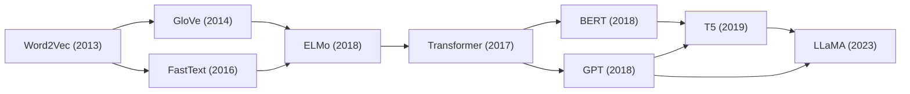
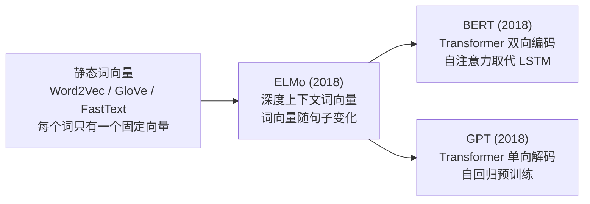
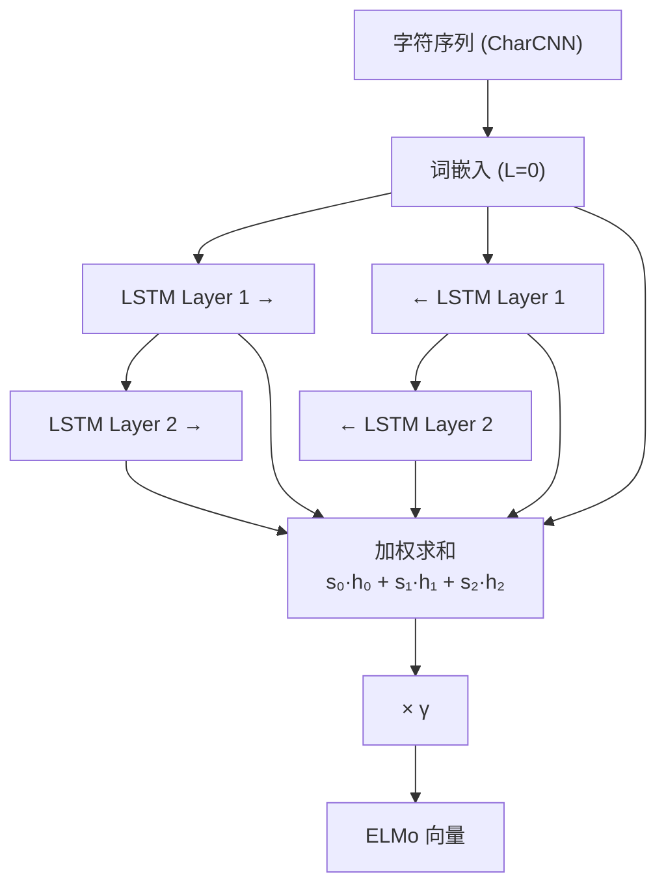
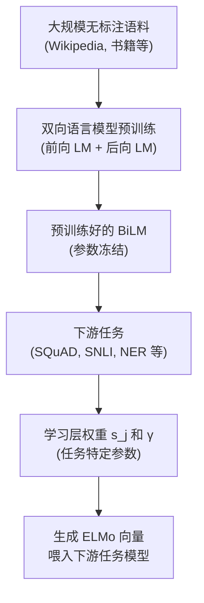

# ELMo (深度上下文词向量)

## 知识地图



## 前置知识

- **Word2Vec / GloVe / FastText**：理解静态词向量的原理和局限（每个词只有一个固定向量）。
- **LSTM (Long Short-Term Memory)**：理解 LSTM 的输入门、遗忘门、输出门机制，以及如何建模序列依赖。
- **双向 LSTM (BiLSTM)**：理解前向 LSTM（从左到右）和后向 LSTM（从右到左）如何拼接成双向表示。
- **语言模型 (Language Model)**：理解通过预测下一个词/上一个词进行预训练的基本范式。
- **迁移学习**：理解"在大规模语料上预训练 + 在下游任务上微调"的基本思想。

## 模型演化路线



| 阶段 | 模型 | 核心突破 |
|------|------|----------|
| 静态词向量 | Word2Vec / GloVe / FastText | 一个词一个固定向量 |
| 上下文词向量 | ELMo | 词向量是整句的函数，解决多义性 |
| 预训练微调 | BERT / GPT | Transformer + 大规模预训练 + 下游微调 |

## 为什么会出现 (Why)

### 静态词向量的根本缺陷

在 ELMo (2018) 之前，Word2Vec、GloVe、FastText 等方法给每个词分配**一个固定的向量**。这意味着：

- "bank" 在 "river bank"（河岸）和 "bank account"（银行账户）中**完全相同的向量**
- "play" 在 "play football"、"play music"、"play games" 中**完全相同的向量**
- 任何多义词（占常用词的绝大多数）都无法被正确区分

这违背了语言学的基本事实：**词的含义取决于上下文**。

### 为什么之前的方案不行

- 给多义词单独维护多个向量的方案不可扩展（需要预先知道每个词有多少含义）
- 在具体任务上微调虽然能让向量偏向任务特定语义，但词向量仍然是全局固定的，不随上下文变化

ELMo 首次提出：**词向量不是查表得到的固定值，而是整个句子的函数**。这一思想直接催生了后面的 BERT 和 GPT。

## 解决什么问题 (Problem)

让同一个词在不同上下文中拥有**不同的**向量表示（如 "bank" 在 "river bank" 和 "bank account" 中得到不同的向量），实现真正的上下文感知。

## 核心思想 (Core Idea)

ELMo 开创性地提出**深度上下文词向量**：每个词的表示是其所在句子的函数（两层双向 LSTM 语言模型各层隐状态的加权组合），而非固定的查找表。

这直接启发了 BERT 和 GPT 的双向/单向预训练范式——ELMo 是"预训练"时代的开端。

---

## 数学模型 / 公式

### 双向语言模型

前向语言模型：$p(t_1, \ldots, t_N) = \prod_{k=1}^{N} p(t_k | t_1, \ldots, t_{k-1})$

**通俗解释：** 前向 LM 从左到右逐个预测每个词。给定前面的所有词 $t_1, \ldots, t_{k-1}$，预测下一个词 $t_k$。这是一个"接龙"任务——给你 "The cat sat on"，预测 "the"。

后向语言模型：$p(t_1, \ldots, t_N) = \prod_{k=1}^{N} p(t_k | t_{k+1}, \ldots, t_N)$

**通俗解释：** 后向 LM 从右到左逐个预测每个词。给定后面的所有词 $t_{k+1}, \ldots, t_N$，预测当前词 $t_k$。这是一个"逆着读"任务——给你 "...on the mat" 猜 "sat"。

### 联合目标（负对数似然最小化）

$$
\mathcal{L} = -\sum_{k=1}^{N} \left( \log p(t_k | t_{<k}; \Theta) + \log p(t_k | t_{>k}; \Theta) \right)
$$

**通俗解释：** 同时训练前向和后向两个语言模型，让它们分别在各自的方向上预测正确。最小化负对数似然就是最大化每个位置的预测准确率。两个方向的约束共享底层参数（token embedding），但不共享 LSTM 参数。

### 词表示 = 各层加权和

对于 token $t_k$，ELMo 输出 $L+1$ 个表示（$L$ 层 BiLM + 输入嵌入）：

$$
\mathbf{R}_k = \{\mathbf{x}_k^{LM}, \overrightarrow{\mathbf{h}}_{k,1}, \overleftarrow{\mathbf{h}}_{k,1}, \ldots, \overrightarrow{\mathbf{h}}_{k,L}, \overleftarrow{\mathbf{h}}_{k,L}\}
$$

$$
\text{ELMo}_k = \gamma \sum_{j=0}^{L} s_j \cdot \mathbf{h}_{k,j}
$$

**通俗解释：** ELMo 不是直接用最后一层的输出，而是把所有层的输出做加权组合。为什么要这样做？因为不同层学到不同层面的信息——底层 $j=0$ 更像传统的上下文无关词向量（词法信息），中间层 $j=1$ 学到句法结构，顶层 $j=2$ 学到语义信息。每个下游任务通过学习自己的 $s_j$ 权重来告诉模型"我这个任务更需要哪一层的信息"。

- $s_j$：softmax 归一化的层权重（每层的重要性由具体下游任务学习）
- $\gamma$：全局缩放因子（任务相关，让模型可以整体放大或缩小 ELMo 向量的尺度）

### 字符级 CNN 输入

ELMo 不使用固定词表——用字符 CNN 从字符序列生成词表示，天然处理 OOV 词：

$$
\text{CharCNN}(c_1, \ldots, c_m) = \text{MaxPool}(\text{CNN}(\text{CharEmbed}(c_1, \ldots, c_m)))
$$

**通俗解释：** 不是为每个完整词分配一个 embedding，而是从字符层面构建词表示。先用卷积核在字符序列上滑动（类似 FastText 的 n-gram 思想但更强大），再通过最大池化提取最显著的特征，最终得到一个固定维度的词级表示。这样即使遇到训练时从未见过的词，只要字符级别有模式可循，就能产生有意义的表示。

---

## 可视化展示

### ELMo 架构



### 整体预训练与微调流程



### 不同任务学到的层权重

```echarts
return {
  tooltip: { trigger: "axis", confine: true },
  title: { top: 5,  text: 'ELMo 各层在下游任务中的权重', left: 'center', textStyle: { fontSize: 12 } },
  xAxis: { type: 'category', data: ['Layer 0 (词法)', 'Layer 1 (句法)', 'Layer 2 (语义)'] },
  yAxis: { type: 'value', min: 0, max: 1, name: 'softmax 权重' },
  legend: { top: 28,  data: ['SQuAD (QA)', 'SNLI (推理)', 'POS Tagging'] },
  series: [
    { name: 'SQuAD (QA)', type: 'bar', data: [0.1, 0.3, 0.6], itemStyle: { color: '#2c3e50' } },
    { name: 'SNLI (推理)', type: 'bar', data: [0.05, 0.2, 0.75], itemStyle: { color: '#2980b9' } },
    { name: 'POS Tagging', type: 'bar', data: [0.25, 0.65, 0.1], itemStyle: { color: '#16a085' } }
  ],
  grid: { left: 60, right: 20, top: 55, bottom: 55 }
}
```

浅层更适合词法任务（词性标注），深层更适合语义理解（QA、推理）。

---

## 最小可运行代码

### PyTorch — ELMo 风格的 BiLM

```python
import torch
import torch.nn as nn
import torch.nn.functional as F

class BiLM(nn.Module):
    def __init__(self, vocab_size, embed_dim=512, hidden_dim=4096, n_layers=2):
        super().__init__()
        self.token_embed = nn.Embedding(vocab_size, embed_dim)
        # 前后向 LSTM
        self.forward_lstm = nn.LSTM(embed_dim, hidden_dim,
                                     num_layers=n_layers, batch_first=True)
        self.backward_lstm = nn.LSTM(embed_dim, hidden_dim,
                                      num_layers=n_layers, batch_first=True)
        # 输出映射
        self.fwd_proj = nn.Linear(hidden_dim, vocab_size)
        self.bwd_proj = nn.Linear(hidden_dim, vocab_size)

    def forward(self, x):
        emb = self.token_embed(x)  # [B, T, D]

        # 前向 LSTM: 预测下一个 token
        fwd_out, fwd_h = self.forward_lstm(emb[:, :-1])
        fwd_logits = self.fwd_proj(fwd_out)  # [B, T-1, V]
        # 后向 LSTM: 翻转序列, 预测上一个 token
        rev_emb = torch.flip(emb[:, 1:], [1])
        bwd_out, bwd_h = self.backward_lstm(rev_emb)
        bwd_logits = self.bwd_proj(bwd_out)

        return fwd_logits, bwd_logits, (fwd_h, bwd_h)

    def get_elmo_representations(self, x):
        """提取 ELMo 风格的多层表示"""
        emb = self.token_embed(x)
        layers = [emb]

        fwd_out, _ = self.forward_lstm(emb)
        bwd_out, _ = self.backward_lstm(torch.flip(emb, [1]))
        bwd_out = torch.flip(bwd_out, [1])

        layers.append(torch.cat([fwd_out, bwd_out], dim=-1))
        return layers  # [layer0_emb, layer1_bilm_outputs]
```

## 工业界应用

| 应用场景 | 说明 | ELMo 的优势 |
|----------|------|-------------|
| 问答系统 (QA) | 理解问题和上下文的深层语义 | 深层 LSTM 捕获长距离依赖，上下文动态表示消歧 |
| 命名实体识别 (NER) | 在上下文中识别人名、地名等 | 字符 CNN 处理罕见实体词，上下文区分同词不同类 |
| 情感分析 | 判断文本情感倾向 | "sick" 在 "sick performance" vs "sick patient" 中得不同向量 |
| 文本蕴含 (NLI) | 判断两个句子的逻辑关系 | 双向建模同时捕获前提和假设的语义 |
| 语义角色标注 (SRL) | 识别"谁对谁做了什么" | 利用多层特征：句法层权重高对 SRL 至关重要 |

## 对比表格

| | 静态词向量 (Word2Vec/GloVe/FastText) | ELMo |
|------|----------|----------|
| 表示方式 | 每个词一个固定向量 | 每个词 = 整个句子的函数 |
| 多义性 | 无法处理（"bank" 只有一个向量） | 自动处理（"bank" 在不同句子中不同向量） |
| 架构 | 浅层神经网络 | 两层双向 LSTM |
| OOV | Word2Vec/GloVe 不支持；FastText 支持但无上下文 | 字符 CNN 处理，且带上下文 |
| 下游使用 | 直接查表使用 | 预训练 + 特征提取（冻结 BiLM） |
| 训练数据 | 无标注语料 | 无标注语料（语言模型预测任务） |
| 启发 | — | 预训练 → 微调范式，直接启发 BERT/GPT |

## 学完后建议继续学习

1. **Transformer**：理解为什么要用自注意力机制替代 RNN/LSTM（并行化、长距离依赖）
2. **BERT**：理解如何用 Transformer Encoder 做比 ELMo 更强的双向上下文建模（MLM 替代 LM）
3. **GPT**：理解自回归语言模型 + Transformer Decoder 的生成式预训练范式

## 高频面试题

### Q1: ELMo 和 Word2Vec 最本质的区别是什么？

**标准答案：**
- Word2Vec 学的是**静态词向量**：训练完成后，每个词只有一个固定的向量，无论上下文如何变化。"bank" 在所有句子中都是同一个向量。
- ELMo 学的是**上下文相关的动态词向量**：每个词的表示是整个输入句子的函数。"bank" 在 "river bank" 和 "bank account" 中得到完全不同的向量。
- 技术实现上：Word2Vec 是浅层查表模型，ELMo 是深层双向 LSTM 语言模型，词表示从模型的隐状态中提取。
- 使用方式上：Word2Vec 直接查表使用；ELMo 需要跑一遍前向传播（对整个句子编码后取该位置的隐状态）。

### Q2: ELMo 为什么需要对不同层的输出做加权组合，而不是直接用最后一层？

**标准答案：**
- 双向语言模型的不同层学到**不同粒度的语言知识**：
  - 底层（Layer 0，即输入 embedding）：类似传统词向量，主要编码词法信息
  - 中间层（Layer 1）：主要编码句法结构信息（如依存关系、词性）
  - 顶层（Layer 2）：主要编码语义信息（如词义消歧、指代消解）
- 不同下游任务需要不同层面的信息：POS Tagging 更依赖句法层，QA 和 NLI 更依赖语义层。
- 加权组合让每个下游任务可以**自己学习**需要侧重哪一层，提升了 ELMo 的通用性和灵活性。

### Q3: ELMo 是双向的，为什么不直接用 ELMo 做文本生成？

**标准答案：**
- ELMo 的"双向"是指训练时用了两个**独立的单向 LSTMs**（一个前向、一个后向），但它们之间没有交互。
- 前向 LSTM 只看左边的上文，后向 LSTM 只看右边的下文，两者在不同方向上做预测。
- 文本生成需要**自回归地逐个生成 token**（下一个 token 只能基于已生成的内容），而 ELMo 的双向机制要求看到完整句子才能编码。ELMo 本质是一个**编码器**，是一个**特征提取器**，不是生成模型。
- 真正能做到文本生成的是 GPT 这样的自回归模型（单向 Transformer Decoder）。

### Q4: ELMo 的字符 CNN 和 FastText 的字符 n-gram 有什么不同？

**标准答案：**
- **FastText 的字符 n-gram**：直接将词的所有 n-gram 向量求和得到词向量，无非线性变换，等同于"词袋+求和"。
- **ELMo 的字符 CNN**：在字符 embedding 上应用多个卷积核，然后通过最大池化和多层非线性变换得到固定大小的词表示。这可以捕获字符序列中的位置和组合模式（如 "tion" 出现的位置暗示该词可能是名词）。
- **能力差异**：字符 CNN 表达能力更强，能捕获字符间的非线性组合模式；FastText n-gram 更简单高效，但对复杂字符模式的建模能力弱于 CNN。

### Q5: ELMo 相比 BERT 有什么不足？为什么被 BERT 取代了？

**标准答案：**
- **并行化**：ELMo 使用 LSTM，本质是串行计算，无法像 Transformer 一样并行处理整个序列。这导致训练和推理速度都慢很多（尤其是长序列）。
- **长距离依赖**：LSTM 的信息传递路径长度为序列长度 $n$，梯度需要经过 $n$ 步回传，容易梯度消失。Transformer 的自注意力机制让任意两个位置直接连接，路径长度为 $O(1)$。
- **特征提取方式**：ELMo 是**特征基 (feature-based)** 方法，BiLM 参数冻结后作为特征提取器，下游任务模型独立训练。BERT 是**微调 (fine-tuning)** 方法，预训练模型参数随下游任务一起更新，能更好地适配任务。
- **双向建模方式**：ELMo 用两个独立的单向 LSTM 近似双向（浅层双向），BERT 用 MLM 和 Transformer Encoder 实现真正的深层双向交互。
