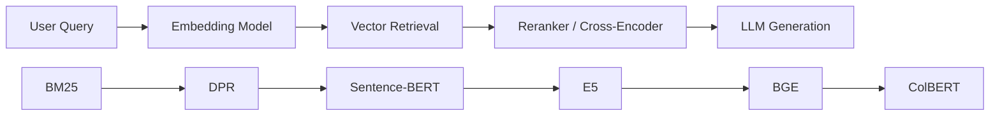
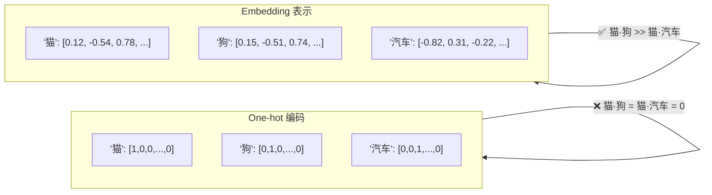

# 嵌入层 (Embedding Layer)

## 知识地图



## 前置知识

- **线性代数基础**：向量、矩阵乘法、余弦相似度
- **神经网络基础**：前向传播、反向传播、损失函数
- **NLP 基础概念**：Tokenization（分词）、词汇表 (Vocabulary)、One-hot 编码
- **分布假说 (Distributional Hypothesis)**："一个词的含义由它周围的词决定"

## 为什么会出现 (Why)

在 NLP 早期，文本用 One-hot / Bag-of-Words 表示。这种表示存在根本缺陷：

- 任意两个词之间两两正交（内积为 0），无法表达语义相似度。"猫"和"狗"与"猫"和"汽车"的向量距离完全相同。
- 维度等于词汇表大小（数万到数十万），极为稀疏，计算效率低。

Embedding 的诞生解决了这些痛点：它将离散符号映射到连续的低维向量空间，使得语义相近的词在空间中的距离也近。

## 解决什么问题 (Problem)

将离散的、高维的类别特征（如词、用户 ID、物品 ID）映射到**低维稠密向量**空间，使得语义相似的对象在向量空间中也彼此接近。这一定义适用于 NLP（词嵌入）、推荐系统（用户/物品嵌入）、图神经网络（节点嵌入）等广泛领域。

## 核心思想 (Core Idea)

嵌入层本质上是一个**可学习的查找表 (Lookup Table)**：给定一个离散索引，从矩阵中取出一行作为该索引的向量表示。

## 数学定义

嵌入层本质上是一个**可学习的查找表 (Lookup Table)**：

$$\mathbf{E} \in \mathbb{R}^{V \times d}$$

给定索引 $i$，输出第 $i$ 行：$\mathbf{e}_i = \mathbf{E}[i, :]$。

其中：
- $V$：词汇表大小
- $d$：嵌入维度

**通俗解释：** 想象一本词典，每个词占一页，每页上写着 d 个数字来描述这个词的"含义"。模型训练的过程就是不断修改这些数字，让意思相近的词拥有相似的数字组合。Embedding 层就是这本不断优化的词典。

## 为什么需要 Embedding

One-hot 编码的问题：
- 维度 = 词汇量（数万到数十万）
- 向量之间两两正交（无法表达语义相似度）

Embedding 的优势：
- 维度可控（50~1024）
- 语义相近的词向量距离也近（分布假说）

## 词嵌入的经典理论

$$\text{king} - \text{man} + \text{woman} \approx \text{queen}$$

嵌入空间中的线性操作可以编码语义关系。

**通俗解释：** 在嵌入空间中，"国王"的向量减去"男人"的向量再加上"女人"的向量，结果非常接近"女王"的向量。这说明嵌入空间不仅学到了词本身的含义，还学到了词与词之间的**关系维度**（如性别、年龄、地位等）。这种"向量算术"是 Embedding 强大的证据。

## 位置嵌入 (Positional Embedding)

Transformer 需要位置信息（因为自注意力不具备顺序感知）：

**正弦位置编码**（原始 Transformer）：

$$PE_{(pos, 2i)} = \sin\left(\frac{pos}{10000^{2i/d}}\right)$$
$$PE_{(pos, 2i+1)} = \cos\left(\frac{pos}{10000^{2i/d}}\right)$$

**通俗解释：** 因为 Transformer 是一次性读入所有词，不知道谁是第一个谁是第二个。位置编码就是给每个位置打上一个独特的"时间戳"。正弦/余弦版本的好处是不需要训练，而且任意两个位置之间的关系可以用线性变换推导出来——模型能从中学到"位置 3 和位置 5 之间差 2 步"这种相对距离。

**可学习位置嵌入**：直接将位置 $pos$ 视为索引查表（BERT, GPT 使用）。

**通俗解释：** 不手动设计正弦波，而是让模型自己学每个位置该用什么向量表示。更灵活，但无法外推到训练时没见过的更长的序列长度。

## Embedding 维度选择经验

| 场景 | 推荐维度 |
|------|----------|
| 小词汇（< 10K） | 64–128 |
| 中词汇（10K–100K） | 256–512 |
| 大词汇/LLM | 768–4096+ |

嵌入层参数量 = $V \times d$，是很多 NLP 模型参数的大头。

**通俗解释：** 维度 d 越高，模型能编码的语义信息越丰富，但参数量也线性增长。选择 d 的原则是：词汇量越大、语义越复杂 → d 越大。但过大的 d 可能导致过拟合，尤其是训练数据较少时。

## 可视化展示



## 最小可运行代码

### PyTorch 原生实现

```python
import torch.nn as nn

# 词嵌入
embed = nn.Embedding(num_embeddings=10000, embedding_dim=256, padding_idx=0)

# 输入：词的索引 [batch, seq_len]
indices = torch.LongTensor([[1, 5, 3], [2, 7, 0]])  # [2, 3]
out = embed(indices)  # [2, 3, 256]
```

### LangChain 中使用 Embedding

```python
from langchain.embeddings import OpenAIEmbeddings, HuggingFaceEmbeddings

# OpenAI Embedding
openai_emb = OpenAIEmbeddings(model="text-embedding-3-small")
vec = openai_emb.embed_query("什么是机器学习?")  # [1536]

# 开源 HuggingFace Embedding
hf_emb = HuggingFaceEmbeddings(model_name="sentence-transformers/all-MiniLM-L6-v2")
vec = hf_emb.embed_query("什么是机器学习?")  # [384]
```

## 工业界应用

| 应用场景 | 嵌入对象 | 典型维度 | 代表技术 |
|----------|---------|---------|----------|
| 搜索引擎 | Query / Document | 768-1024 | BERT, E5, BGE |
| 推荐系统 | User / Item | 64-256 | Matrix Factorization, Two-Tower |
| 知识图谱 | Entity / Relation | 128-512 | TransE, RotatE |
| 代码搜索 | Code / Natural Language | 768 | CodeBERT, UniXcoder |
| 多模态检索 | Image / Text | 512-1024 | CLIP, BLIP |
| LLM 输入层 | Token | 768-4096+ | GPT, LLaMA |

## 对比表格

| 维度 | One-hot | Word2Vec | BERT Embedding | LLM Embedding |
|------|---------|----------|----------------|---------------|
| 维度 | V (词汇量) | 100-300 | 768-1024 | 768-4096+ |
| 语义表达 | 无 | 静态上下文无关 | 动态上下文相关 | 动态上下文相关 |
| 训练方式 | 无需训练 | 浅层神经网络 | Transformer 预训练 | 大规模预训练 |
| 同义词区分 | 无法区分 | "苹果"(水果)和"苹果"(公司)同一向量 | 根据上下文区分 | 根据上下文区分 |

## 学完后建议继续学习

1. **BGE / E5 模型** — 了解主流开源文本 Embedding 模型
2. **Sentence-BERT / ColBERT** — 学习句子级的嵌入与检索
3. **BM25 与 DPR** — 理解稀疏检索和稠密检索的区别
4. **FAISS 向量索引** — 学习如何高效存储和搜索大规模向量
5. **RAG 基础** — 将 Embedding 应用于检索增强生成系统

## 高频面试题

**Q1: Embedding 和 One-hot 编码的本质区别是什么？**

A: One-hot 编码是正交的、等距的——任何两个不同词的 One-hot 向量内积都为 0，无法表达语义相似度。Embedding 将词映射到低维稠密向量空间，语义相近的词向量距离也近（如"猫"和"狗"的内积远大于"猫"和"汽车"）。此外，One-hot 维度等于词汇量（通常数万），Embedding 维度可控（通常几十到几千），计算效率更高。

**Q2: Word2Vec 和 BERT 的 Embedding 有什么不同？**

A: Word2Vec 产生**静态**嵌入——每个词只有一个固定的向量，无论上下文如何。"苹果"在"吃苹果"和"苹果手机"中得到相同向量。BERT 产生**动态/上下文相关**嵌入——同一个词在不同句子中会根据上下文得到不同的向量。"苹果"在"吃苹果"中获得水果语义，在"苹果手机"中获得品牌语义。

**Q3: Transformer 中为什么需要位置编码？**

A: 自注意力机制本身不具备顺序感知能力——它把输入当作一个集合而非序列，对位置不敏感。如果没有位置编码，"A 爱 B"和"B 爱 A"会得到完全相同的表示。位置编码为每个位置的 token 注入位置信息，使得模型能够区分词序。原始 Transformer 用正余弦函数编码，BERT/GPT 用可学习的位置嵌入。

**Q4: Embedding 维度如何选择？**

A: 维度选择遵循经验规则：小词汇（<10K）选 64-128，中词汇（10K-100K）选 256-512，大词汇/LLM 选 768-4096+。核心权衡是：维度越高编码能力越强，但参数量 = V x d 也线性增长，可能导致过拟合。实际中通常参考同领域 SOTA 模型的维度设置，并在下游任务上做 ablation 实验。

**Q5: 介绍一下 Embedding 在 RAG 系统中的作用。**

A: 在 RAG 中，Embedding 是连接用户问题和知识库的桥梁。离线阶段：将文档切分为 chunks，用 Embedding 模型编码为向量存入向量数据库。在线阶段：将用户问题用同一个/对应的 Embedding 模型编码为向量，在向量数据库中做相似度搜索（余弦相似度或内积），返回最相关的 Top-K chunks。Embedding 模型的质量直接决定了检索的召回率和精度。
