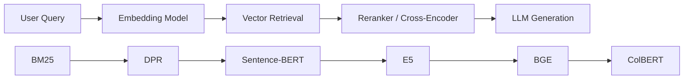
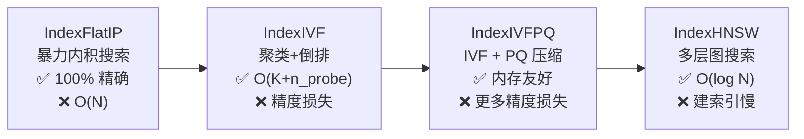
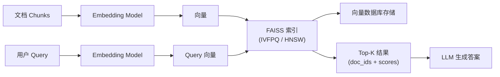

# FAISS (向量索引与近似最近邻搜索)

## 知识地图



## 前置知识

- **向量与相似度**：余弦相似度、欧氏距离、内积
- **K-Means 聚类**：聚类中心、簇分配
- **图论基础**：邻接表、图的遍历
- **Embedding 模型**：理解文本向量化的过程（见 embedding-layer.md）

## 为什么会出现 (Why)

在 RAG 和语义搜索系统中，文档被编码为稠密向量后，面临的核心工程问题是：**如何在数百万甚至数十亿个向量中，快速找到与查询向量最相似的 Top-K 个？**

暴力搜索（逐个计算相似度）的时间复杂度是 $O(Nd)$，当 $N$ 达到百万级时，每次查询可能耗时数秒甚至数十秒——这在实时搜索场景中完全不可接受。同时，$N$ 个 $d$ 维向量全部用 float32 存储，内存占用 $O(Nd \times 4)$ bytes，在大规模场景中也难以承受。

FAISS (Facebook AI Similarity Search) 正是为解决这两个工程瓶颈而设计的。

## 解决什么问题 (Problem)

在大规模向量检索场景中，平衡**搜索精度**（召回率）和**搜索速度**（QPS），同时控制**内存占用**。核心是在"尽量少检查向量 + 尽量少存储向量"的前提下，保持尽可能高的召回率。

## 核心思想

暴力搜索（遍历所有向量计算相似度）在百万级以上不可行。FAISS 用**索引结构**来组织向量空间，使得查询时只检查一小部分候选。从最简单的 IVF（聚类 + 同簇搜索）到最复杂的 HNSW（多层图遍历），本质上都是在"搜索精度"和"搜索速度"之间做权衡。Product Quantization (PQ) 进一步压缩向量本身，把内存占用压到原来的 4-16 倍以下。

---

## 数学定义与原理解析

### IVF (Inverted File)

1. 用 K-Means 将所有向量聚类为 $K$ 个簇
2. 建倒排索引：每个簇存其成员向量 ID
3. 查询时：计算 query 与 $K$ 个聚类中心的距离，只搜最近的 $n_{probe}$ 个簇

搜索复杂度：$O(n_{probe} \times N/K \times d)$，vs 暴力 $O(Nd)$。

**通俗解释：** 类比图书馆系统。不是每次查书都遍历所有书架，而是先看"分类目录"（K 个聚类中心）——你要找机器学习书籍，就去"计算机科学"那个大分类下找（最近的 $n_{probe}$ 个簇），跳过文学、历史等不相关的区域。这样每次搜索只检查所有书的 $1/K$，速度快了 K 倍。

### HNSW (Hierarchical Navigable Small World)

构建多层图结构，每层是一个近似 Delaunay 图：
- **上层**：长距离连接（高速公路），快速导航到目标区域
- **底层**：短距离连接（小路），精确搜索最近邻

查询时从顶层开始贪婪搜索，逐层下降。搜索复杂度 $O(\log N)$。

**通俗解释：** 类比地图导航。你要从北京找到上海的一个具体门牌号——你不会走遍每一个门牌号，而是：1) 先上"高速公路"（顶层），确定上海的大概方向；2) 下高速进入"城市道路"（中层），找到目标街区；3) 最后走"小巷"（底层），精确找到目标。HNSW 在向量空间里做完全一样的事，复杂度从 $O(N)$ 降为 $O(\log N)$。

### Product Quantization (PQ)

将 $d$ 维向量均分为 $M$ 段，每段 $d/M$ 维：

$$
\mathbf{x} \mapsto (q_1(x_{1:d/M}), q_2(x_{d/M:2d/M}), \ldots, q_M(x_{(M-1)d/M:d}))
$$

每段独立用 K-Means（256 个中心 → 1 byte），整个向量压缩为 $M$ bytes。$d=1024$ 时：4096 bytes (float32) → 64 bytes (64×1 byte)，压缩比 64×。

搜索时用**非对称距离计算**（Asymmetric Distance Computation）：query 向量不量化，只有数据库向量量化，精度损失更小。

**通俗解释：** 把 1024 维向量切成 64 段，每段 16 维。每段都用 K-Means 聚类，用离它最近的聚类中心编号（0-255，只需 1 字节）代替原始浮点向量。搜索时，query 保持高精度不变（不量化），只拿 compressed 后的数据库向量做近似距离计算。这就像把高清照片（float32）压缩成 256 色索引图（1 byte per pixel）——损失了一些细节，但文件大小缩小了 64 倍，而且肉眼（搜索精度）几乎看不出来区别。

### IVFPQ — 工业标配

结合 IVF（过滤候选）+ PQ（压缩向量）：

1. IVF 粗量化找到最近的 $n_{probe}$ 个簇
2. 在这部分子集上用 PQ code 做精确距离计算
3. 返回 Top-K

**通俗解释：** 先用粗筛（IVF：找到相关的大类），再用压缩表示（PQ：在候选集合中做近似精确比较）。两者结合，速度比暴力快 100-1000 倍，内存仅需暴力方案的 1/64，同时召回率维持在 90%+。

---

## 可视化展示

### FAISS 索引类型



### 召回率 vs 速度

```echarts
return {
  tooltip: { trigger: "axis", confine: true },
  title: { top: 5,  text: 'FAISS 索引召回率 vs QPS (1M vectors, 128d)', left: 'center', textStyle: { fontSize: 12 } },
  xAxis: { type: 'value', name: 'QPS (越高越快)' },
  yAxis: { type: 'value', name: 'Recall@10', min: 0.5, max: 1.0 },
  series: [
    { type: 'scatter', symbolSize: 14,
      data: [[100, 1.0], [5000, 0.98], [20000, 0.92], [80000, 0.85], [300000, 0.72]],
      label: { show: true,
        formatter: (p) => ['Flat','IVF','IVFPQ','HNSW','PQ+HNSW'][p.dataIndex],
        position: 'bottom' }
    }
  ],
  grid: { left: 60, right: 20, top: 55, bottom: 60 }
}
```

### FAISS 在 RAG Pipeline 中的位置



---

## 核心代码实现

### FAISS 索引构建与搜索

```python
import faiss
import numpy as np

# 1. IndexFlatIP — 内积搜索 (精确)
flat_index = faiss.IndexFlatIP(128)   # 128 维向量
flat_index.add(vectors)               # vectors: [N, 128]
D, I = flat_index.search(query, k=10) # D: distances, I: indices

# 2. IVFPQ — 工业级索引
d = 128
nlist = 1024          # 聚类中心数
m = 8                 # PQ 分段数
nbits = 8             # 每段聚类中心数 = 256 (1 byte)

quantizer = faiss.IndexFlatIP(d)  # 粗量化器
index = faiss.IndexIVFPQ(quantizer, d, nlist, m, nbits)
index.train(train_vectors)        # 必须先训练!
index.add(vectors)
index.nprobe = 32                 # 搜索时检查的簇数
D, I = index.search(query, k=10)

# 3. HNSW — 图搜索
index_hnsw = faiss.IndexHNSWFlat(d, 32)  # 32 connections per node
index_hnsw.hnsw.efConstruction = 200      # 构建时的搜索宽度
index_hnsw.hnsw.efSearch = 64             # 查询时的搜索宽度
index_hnsw.add(vectors)
D, I = index_hnsw.search(query, k=10)

# 4. GPU 加速
res = faiss.StandardGpuResources()
gpu_index = faiss.index_cpu_to_gpu(res, 0, index)
D, I = gpu_index.search(query, k=10)
```

### 基于 FAISS 的检索 Pipeline

```python
class VectorRetriever:
    def __init__(self, embed_dim, nlist=1024):
        self.dim = embed_dim
        quantizer = faiss.IndexFlatIP(embed_dim)
        self.index = faiss.IndexIVFPQ(quantizer, embed_dim, nlist, 8, 8)
        self.index.nprobe = 32
        self.id_map = []

    def build(self, embeddings, doc_ids):
        """embeddings: [N, D], doc_ids: [N]"""
        self.index.train(embeddings)
        self.index.add(embeddings)
        self.id_map = list(doc_ids)

    def search(self, query_emb, top_k=10):
        """query_emb: [D]"""
        D, I = self.index.search(query_emb.reshape(1, -1), top_k)
        results = []
        for dist, idx in zip(D[0], I[0]):
            if idx < len(self.id_map):
                results.append({'doc_id': self.id_map[idx], 'score': float(dist)})
        return results
```

### LangChain + FAISS

```python
from langchain.embeddings import HuggingFaceEmbeddings
from langchain.vectorstores import FAISS

# 加载 Embedding 模型
embeddings = HuggingFaceEmbeddings(model_name="BAAI/bge-small-zh-v1.5")

# 从文档构建 FAISS 索引
vectorstore = FAISS.from_documents(documents, embeddings)

# 保存索引到磁盘
vectorstore.save_local("faiss_index")

# 从磁盘加载
vectorstore = FAISS.load_local("faiss_index", embeddings)

# 检索
results = vectorstore.similarity_search_with_score("什么是机器学习?", k=5)
```

---

## 工业界应用

| 应用场景 | 推荐 FAISS 索引 | 原因 |
|----------|----------------|------|
| 中小规模 RAG (< 100K docs) | IndexFlatIP | 数据量小，精确搜索足够快 |
| 中等规模 RAG (100K - 1M docs) | IndexIVFPQ | 平衡速度和精度 |
| 大规模 RAG (> 1M docs) | IndexHNSWFlat 或 IndexIVFPQ | 对数复杂度，大规模友好 |
| 内存极端受限 | IndexIVFPQ (m=16) | PQ 压缩比高 |
| 需要最高精度 | IndexHNSWFlat (efSearch=128+) | 图搜索精度最高 |
| GPU 加速 | IndexIVFFlat (GPU) | IVF 结构 GPU 并行加速明显 |

---

## 对比表格

| 维度 | IndexFlat | IndexIVF | IndexIVFPQ | IndexHNSW |
|------|-----------|----------|------------|-----------|
| 搜索复杂度 | O(Nd) | O(n_probe x N/K x d) | O(n_probe x N/K x M) | O(log N x d) |
| 内存占用 | N x d x 4 bytes | N x d x 4 + 索引 | N x M bytes + 索引 | N x d x 4 + 图 |
| 是否需要训练 | 否 | 是 (K-Means) | 是 (K-Means + PQ) | 否 (但构建慢) |
| 召回率 | 100% | 90-98% | 85-95% | 95-99% |
| 构建时间 | O(1) | O(NK) | O(NK + NM) | O(N log N) |
| 增量更新 | 简单 | 需要重建 | 需要重建 | 支持但复杂 |

---

## 学完后建议继续学习

1. **BM25 与 DPR** — 理解稀疏检索和稠密检索如何配合 FAISS 使用
2. **BGE / E5 模型** — FAISS 存储的向量由它们生成
3. **RAG 基础** — 将 FAISS 集成到完整的检索增强生成 Pipeline
4. **Dense Retrieval Advanced** — PLAID 等 ColBERT 的加速索引方案
5. **Milvus / Weaviate** — 工业级向量数据库的分布式能力

---

## 高频面试题

**Q1: FAISS 中 IVF 和 HNSW 的核心区别是什么？各适合什么场景？**

A: IVF 基于**空间划分**——用 K-Means 聚类将向量空间划分为区域，查询时只搜最近区域；HNSW 基于**图遍历**——构建多层近邻图，从顶层开始贪婪搜索。核心区别：IVF 搜索复杂度 $O(N/K)$，需要足够的训练数据做聚类；HNSW 复杂度 $O(\log N)$，不需要训练，但构建图本身很慢且内存开销大。选型：数据分布均匀、数据量适中选择 IVF；数据分布不规则、追求高精低延迟选择 HNSW。

**Q2: Product Quantization (PQ) 的原理是什么？为什么压缩后还能做相似度搜索？**

A: PQ 将 d 维向量均分 M 段，每段用 K-Means 聚类映射到最近的聚类中心编号（1 byte）。压缩后每个向量变为 M bytes。搜索时用非对称距离计算（ADC）：query 保持完整精度，预先计算 query 每段与所有聚类中心的距离（距离表），搜索时用查表代替重新计算。这相当于用近似向量代替精确向量做距离计算——精度有损但可控，内存和速度收益巨大（压缩比 16-64 倍）。

**Q3: FAISS 中 nprobe 参数的作用是什么？如何调优？**

A: nprobe 是 IVF 查询时检查的聚类簇数。nprobe=1 最快（只搜最近的一个簇），但可能遗漏在其他簇中的相关文档；nprobe=K（搜所有簇）等价于暴力搜索。调优策略：从目标 Recall 反推——如果业务要求 Recall@10 >= 0.95，则在验证集上从小到大调 nprobe 直到满足要求。通常 nprobe 设为 nlist 的 1-5% 是较好的起点。

**Q4: FAISS 索引是否支持增量更新 (Insert/Delete)？**

A: 部分支持。IndexFlat 和 IndexHNSW 可以直接 add() 新向量（但 HNSW 的图可能需要重建以维持图质量）。IndexIVF 和 IndexIVFPQ 理论上可以 add，但新增向量可能改变数据分布，导致聚类中心和 PQ 码本"过时"——需要重新训练。删除操作一般通过 `remove_ids()` 方法，后者需要一个 `IDSelector`。生产环境中最佳实践是定期重建索引。

**Q5: 如何在 GPU 上使用 FAISS？有什么注意事项？**

A: 使用 `faiss.index_cpu_to_gpu()` 将 CPU 索引转移到 GPU。GPU 对 IndexFlat、IndexIVF 的加速非常明显（矩阵乘法并行），但对 PQ 和 HNSW 的加速有限。注意：单 GPU 最大索引大小受显存限制；GPU 索引操作（add/search）可能需要批量处理以避免 OOM；需要指定 GPU 设备 ID；推荐使用 `faiss.StandardGpuResources()` 管理 GPU 资源；多 GPU 时可用 `faiss.index_cpu_to_all_gpus()` 自动分片。
