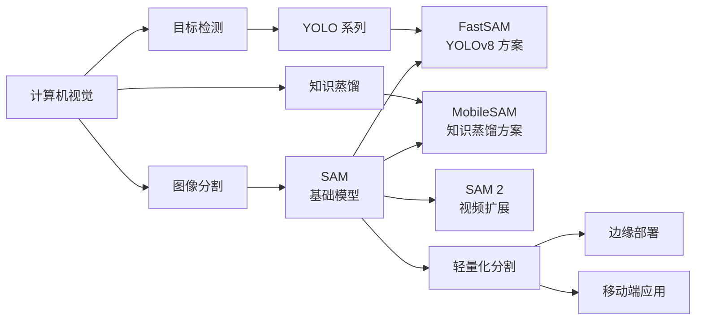
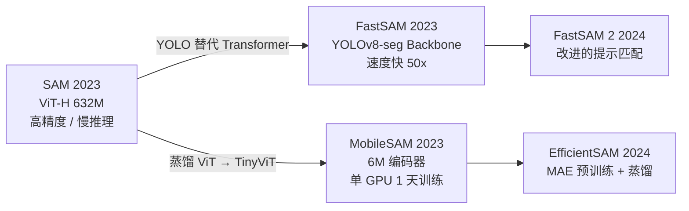
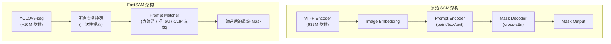
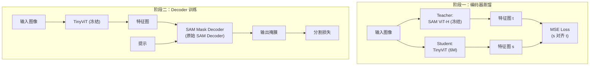
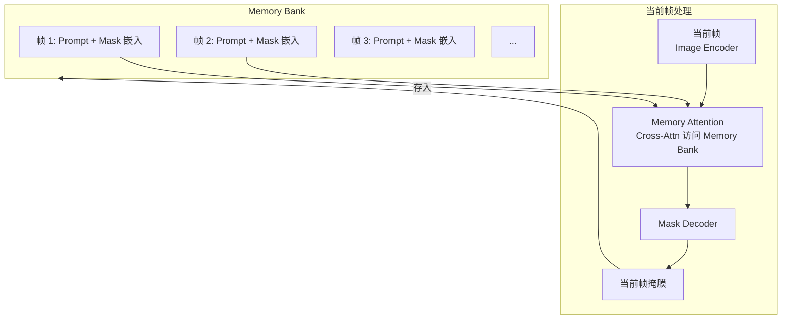
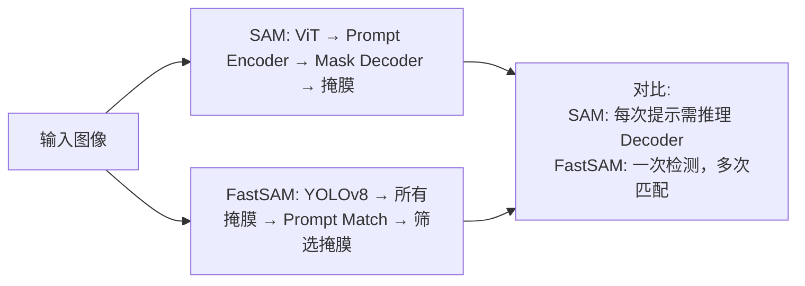

# FastSAM / MobileSAM (轻量 SAM)

## 知识地图



## 前置知识

- **SAM 基础**：Image Encoder (ViT-H)、Prompt Encoder、Mask Decoder、歧义处理
- **YOLOv8-seg**：YOLOv8 的实例分割版本，一阶段检测 + 分割
- **知识蒸馏**：教师-学生框架，MSE 损失，解耦蒸馏策略
- **TinyViT**：轻量级 Vision Transformer 架构
- **提示匹配**：点包含筛选、框 IoU 匹配、CLIP 文本匹配

## 模型演化路线



| Model | Year | Key Innovation |
|-------|------|----------------|
| SAM | 2023 | 提示式分割基础模型，ViT-H 632M，SA-1B 大数据 |
| FastSAM | 2023 | 用 YOLOv8-seg 替代 ViT，"检测→提示匹配"流程，50x 加速 |
| MobileSAM | 2023 | 解耦蒸馏 ViT-H → TinyViT (6M)，单 GPU 1 天内训完 |
| EfficientSAM | 2024 | 结合 MAE 预训练和蒸馏，balance 精度和效率 |
| SAM 2 | 2024 | SAM 扩展到视频，记忆机制和时序传播 |

## 为什么会出现 (Why)

SAM 效果好但太大——ViT-H 编码器有 632M 参数，单张图像编码需要数秒（即使是高端 GPU）。这在以下场景不可用：

1. **实时应用**：自动驾驶、AR/VR 等需要毫秒级响应的场景
2. **边缘设备**：手机、嵌入式设备上无法运行 632M 的 ViT
3. **大规模处理**：处理 SA-1B 级别的数据需要大量计算资源

FastSAM 和 MobileSAM 从两个完全不同的方向解决效率问题：

- **FastSAM**：完全抛弃 Transformer，用成熟的 YOLOv8-seg 做实例分割。将 SAM 的"提示→掩膜"流程转换为"无提示检测所有物体 + 提示后筛选"的两阶段流程。YOLO 擅于实时检测，速度极快（50x 加速）。
- **MobileSAM**：保留 SAM 的完整架构，但将 ViT-H 蒸馏为 TinyViT（仅 6M 参数）。思路是：SAM 的"知识"储存在 ViT-H 的特征输出中，可以用一个小网络来近似。

结论：SAM 的知识可以被蒸馏——一个比 ViT-H 小 60 倍的编码器也能产出可比的结果。

## 解决什么问题 (Problem)

让分割基础模型可以：
- **FastSAM**：在消费级硬件上实时运行，适合视频流等低延迟场景
- **MobileSAM**：在移动设备上部署，保持 SAM 的提示交互范式，降低 60 倍编码器参数量

## 核心思想 (Core Idea)

**FastSAM**：完全抛弃 ViT，用 YOLOv8-seg 做实例分割，将 SAM 的"提示生成掩膜"转化为"检测所有物体 → 提示匹配筛选"的两步流程，速度提升 50 倍。  
**MobileSAM**：解耦蒸馏策略——先蒸馏编码器（MSE 对齐学生/教师特征），再冻结编码器独立训练 Decoder，将 632M 的 ViT-H 压缩到 6M 的 TinyViT。

## 模型结构图

### FastSAM 架构（对比 SAM）



### MobileSAM 蒸馏流程



### SAM 2 记忆机制



## 数学模型/公式

### FastSAM — 两阶段流程

**阶段 1**：YOLOv8-seg 对所有实例生成分割掩膜：
$$\{\mathbf{m}_1, \mathbf{m}_2, ..., \mathbf{m}_K\} = \text{YOLOv8-seg}(\mathbf{I})$$

**通俗解释：** YOLOv8-seg 在不接收任何提示的情况下，一次性检测出图像中的所有物体并输出它们的实例分割掩膜。$K$ 是检测到的物体数量。

**阶段 2**：根据用户提示从所有提议中选择匹配的掩膜：
$$\mathbf{m}_{selected} = \text{MatchPrompt}(\{\mathbf{m}_k\}, P)$$

**通俗解释：** 三种匹配策略：
- Point prompt：选择包含该点的所有掩膜，按面积排序取前三（类似 SAM 的多粒度输出）
- Box prompt：选择与框 IoU 最大的掩膜
- Text prompt：用 CLIP 编码文本和掩膜区域图像，选择余弦相似度最高的

### MobileSAM — 解耦蒸馏损失

$$\mathcal{L}_{distill} = \text{MSE}(\mathbf{f}_{student}, \mathbf{f}_{teacher})$$

**通俗解释：** 蒸馏的核心损失函数：学生网络（TinyViT）的输出特征图 $\mathbf{f}_{student}$ 与教师网络（冻结的 ViT-H）的输出特征图 $\mathbf{f}_{teacher}$ 计算均方误差。每个空间位置、每个通道都要求对齐。这是"特征级别的知识转移"——学生不需要复现教师内部的每一层，只需要保证最终输出的全局特征图接近。

### MobileSAM — 解耦的关键设计

$$\text{Stage 1}: \min_\theta \text{MSE}(\text{TinyViT}_\theta(x), \text{ViT-H}(x))$$

$$\text{Stage 2}: \min_\phi \mathcal{L}_{seg}(\text{Decoder}_\phi(\text{TinyViT}(x), p), y)$$

**通俗解释：** 解耦是两个阶段分开训练：
- Stage 1：只训练编码器，目标是特征对齐。学生只需要学会"看到和教师一样的图像表达"。
- Stage 2：冻结编码器，用原始 SAM Decoder 的结构和损失函数独立训练 Decoder。这样做的好处是：如果联合训练（Encoder + Decoder 一起），难以平衡蒸馏损失和分割损失，容易不收敛。

结果：MobileSAM 在单 GPU 上 1 天内训完（vs SAM 需要 68 个 V100 训 3 天）。

### SAM 2 记忆注意力

$$\mathbf{y}_t = \text{MaskDecoder}(\mathbf{I}_t, P_t, \text{MemAttn}(\mathbf{I}_t, \text{MemoryBank}))$$

**通俗解释：** SAM 2 的 Memory Bank 存储了所有历史帧的 prompt 和掩膜预测的嵌入向量。当前帧通过 Memory Attention 访问这些历史信息——对每一个空间位置，会用 Query 去查 Memory Bank 中"历史上哪一帧的哪个位置和当前最相关"。这让模型可以从历史线索中推断当前帧的掩膜（如物体短暂被遮挡时）。

## 可视化展示

### FastSAM vs SAM 流程对比（详细）



### SAM 系列参数量 vs 推理速度

```echarts
return {
  tooltip: { trigger: "axis", confine: true },
  title: { top: 5,  text: 'SAM 系列参数量 vs 推理速度', left: 'center', textStyle: { fontSize: 12 } },
  xAxis: { type: 'value', name: '参数量 (M)' },
  yAxis: { type: 'value', name: '推理时间 (ms)', min: 0, max: 2000 },
  series: [
    { type: 'scatter', symbolSize: 20,
      data: [[632, 1800], [312, 900], [11, 50], [6, 35]],
      label: { show: true, formatter: (p) => ['SAM-H','SAM-B','MobileSAM','TinyViT'][p.dataIndex], position:'right' }
    }
  ],
  grid: { left: 60, right: 60, top: 55, bottom: 60 }
}
```

### 轻量 SAM 方案对比

| 维度 | FastSAM | MobileSAM | EfficientSAM |
|------|---------|-----------|-------------|
| 路线 | 架构替代 | 知识蒸馏 | MAE + 蒸馏 |
| 骨干网络 | YOLOv8-seg | TinyViT | 轻量 ViT |
| 参数量 | ~11M | ~6M (Encoder) | ~10M |
| 速度提升 | ~50x | ~60x (Encoder) | ~40x |
| 保留 SAM 架构 | 否 | 是 | 是 |
| 需提示 | 后匹配 | 实时编码 | 实时编码 |

## 最小可运行代码

### FastSAM 推理

```python
from ultralytics import FastSAM

# 自动下载模型 + 推理
model = FastSAM('FastSAM-x.pt')

# 推理一切 (prompt='everything')
results = model('image.jpg', device='mps')
masks = results[0].masks.data  # 所有实例掩码

# 点提示模式
results = model('image.jpg', points=[[100, 200]], point_label=[1])

# 框提示模式
results = model('image.jpg', boxes=[[100, 100, 400, 400]])

# 文本提示模式
results = model('image.jpg', text="a person wearing a red shirt")
```

### MobileSAM 蒸馏思路

```python
import torch
import torch.nn as nn

class DistillSAMEncoder(nn.Module):
    """学生编码器 + 蒸馏损失"""
    def __init__(self, teacher, student):
        super().__init__()
        self.teacher = teacher  # 冻结的 ViT-H
        self.student = student  # TinyViT

    def forward(self, x):
        with torch.no_grad():
            t_feat = self.teacher(x)  # [B, D, H, W]
        s_feat = self.student(x)      # [B, D, H, W]
        return s_feat, t_feat

    def distill_loss(self, x):
        s_feat, t_feat = self.forward(x)
        return nn.functional.mse_loss(s_feat, t_feat)
```

### SAM 2 记忆注意力的概念

```python
class MemoryAttention(nn.Module):
    """SAM 2: 当前帧通过 cross-attn 访问历史记忆"""
    def __init__(self, dim):
        super().__init__()
        self.q_proj = nn.Linear(dim, dim)
        self.k_proj = nn.Linear(dim, dim)
        self.v_proj = nn.Linear(dim, dim)

    def forward(self, curr_frame, memory_bank):
        # curr_frame: [B, N, D]  当前帧的 token
        # memory_bank: [B, M, D]  存储的 (帧+prompt+掩码) 嵌入
        Q = self.q_proj(curr_frame)
        K = self.k_proj(memory_bank)
        V = self.v_proj(memory_bank)
        attn = torch.softmax(Q @ K.transpose(-2, -1) / (Q.shape[-1] ** 0.5), dim=-1)
        return curr_frame + attn @ V
```

## 工业界应用

| 应用领域 | 使用模型 | 说明 |
|----------|---------|------|
| 移动端 AR 应用 | MobileSAM | 手机上的实时物体分割，背景替换、虚拟试穿 |
| 视频监控 | FastSAM | 实时视频流的物体分割，配合跟踪器做行为分析 |
| 视频编辑 / 抠图 | SAM 2 | 视频中的交互式物体分割，帧级修正传播 |
| 无人机实时分割 | FastSAM | 边缘设备上的航拍场景分割 |
| 在线标注工具 | FastSAM + SAM | FastSAM 快速初筛 + SAM 精细化修正 |
| 移动端医疗 | MobileSAM (微调) | 手机端皮肤病/口腔病变初筛 |

## 对比表格

| | SAM | FastSAM | MobileSAM | SAM 2 |
|------|-----|---------|-----------|-------|
| 骨干网络 | ViT-H (632M) | YOLOv8-seg (~11M) | TinyViT (6M) | ViT-H + Memory |
| 架构风格 | Transformer | CNN (YOLO) | Transformer (轻量) | Transformer + 记忆 |
| 推理速度 | 慢 (数秒) | 快 (50ms) | 快 | 慢 (时序) |
| 精度 | 最高 | 中 | 中-高 | 最高 (视频) |
| 同时支持图像/视频 | 仅图像 | 仅图像 | 仅图像 | 图像 + 视频 |
| 提示方式 | 点/框/掩膜/文本 | 点/框/文本 (后匹配) | 点/框/掩膜 | 点/框/掩膜 + 时序 |
| 训练成本 | 极高 (68 V100 × 3天) | 低 | 低 (单GPU 1天) | 极高 |

## 学完后建议继续学习

1. **YOLOv8-seg / YOLOv9** — FastSAM 的底层的检测分割架构原理
2. **知识蒸馏方法综述** — 从 Hinton 的原始蒸馏到解耦蒸馏等各种策略
3. **TinyViT / MobileViT** — 轻量级 Vision Transformer 的设计原则
4. **EfficientSAM** — 另一条路线：MAE 预训练 + 蒸馏的结合
5. **SAM 2 深入** — 视频分割中的记忆机制，Memory Bank 的设计和实现
6. **Grounded-SAM** — SAM 与语言模型的结合，实现文本驱动的语义分割

## 高频面试题

### Q1: FastSAM 和 SAM 的核心区别是什么？FastSAM 为什么这么快？

**答案：** 核心区别在于**问题定义方式的转换**：

- **SAM**：给定图像和提示 → 生成对应物体的掩膜。是一个"条件生成"问题。每次不同提示都需要运行 Mask Decoder。
- **FastSAM**：给定图像 → 先生成所有可能物体的掩膜 → 再根据提示筛选。是一个"检测 + 后匹配"问题。

速度优势来源：
1. **YOLOv8-seg vs ViT-H**：YOLOv8 是为实时检测设计的 CNN 架构（~11M 参数），远轻于 ViT-H（632M 参数）。YOLO 的一阶段检测+分割通过 CSP/ELAN 等架构优化极度高效。
2. **一次生成 vs 每次推理**：FastSAM 只需一次前向传播生成所有掩膜。之后任意多次提示只需做后处理筛选（无神经网络推理）。SAM 每次换提示都需要重新运行 Mask Decoder。
3. **无 Transformer 开销**：FastSAM 没有注意力计算，所有操作都是高效的卷积操作。

代价是精度略低于 SAM，尤其在复杂场景下边界精度和细粒度分割能力不如 SAM。

### Q2: MobileSAM 的"解耦蒸馏"和普通的端到端蒸馏有什么区别？为什么要解耦？

**答案：** 区别在于训练的先后顺序和梯度回传方式：

- **端到端蒸馏**：学生编码器和 Decoder 同时训练，损失函数同时包含蒸馏损失和分割损失。梯度从 Decoder 回流到编码器。问题是两个损失函数的尺度不同、方向可能冲突，导致训练不稳定，容易不收敛或性能下降。
- **解耦蒸馏**：
  - Stage 1：只训练编码器，目标纯粹——让 TinyViT 的特征图尽可能接近 ViT-H 的特征图。使用简单的 MSE 损失，稳定收敛。
  - Stage 2：冻结编码器，只训练 Decoder。Decoder 拿到学生编码器输出的稳定特征图后，用原始 SAM 的分割损失独立训练。

解耦的动机：编码器蒸馏是一个相对简单的回归任务（特征对齐），而 Decoder 训练需要复杂的分割损失（Dice + BCE + IoU）。混在一起训练时，分割损失可能"干扰"特征对齐，导致蒸馏效果不佳。解耦让每个阶段专注于一个明确目标，训练更稳定，成果也更可预测。

### Q3: SAM 2 的 Memory Bank 是怎么工作的？和 SAM 有什么本质区别？

**答案：** SAM 2 将分割从单帧扩展到了视频。核心机制：

**Memory Bank 存储**：每一帧处理后，将其关键信息存入 Memory Bank：
- 当前帧的 Spatial Features（空间特征图）
- Prompt 编码（用户的点/框提示）
- 预测掩膜的嵌入（Mask Output Encoding）
- 帧的时间戳（Temporal Position Encoding）

**Memory Attention**：当前帧的 Image Embedding 通过 Cross-Attention 访问 Memory Bank。对每个空间位置，它会查询"历史帧中哪里和这里最相关"。这个机制让 SAM 2 能：
- 跨帧追踪同一个物体（通过记忆关联）
- 在物体被遮挡时从历史帧中"回想"其位置和形状
- 交互式修正：用户在任意帧修正 → 修正信息通过 Memory Bank 传播到所有帧

**本质区别**：SAM 是一种无状态的函数映射 $f(I, P) \rightarrow M$。SAM 2 是有状态的序列模型 $f(I_t, P_t, \text{Memory}_{<t}) \rightarrow (M_t, \text{Memory}_{\leq t})$，Memory Bank 在帧之间传递信息。

### Q4: 现有的轻量 SAM 方案各有什么优缺点？实际使用中怎么选？

**答案：** 选择取决于具体需求和约束：

- **FastSAM**（YOLOv8 路线）：适合需要极高吞吐量的场景（视频流、批量处理）。优点：速度最快、无需 GPU（可用 CPU/MPS）。缺点：精度损失最大（边界粗糙、小物体漏检）、不保留 SAM 的交互范式。
- **MobileSAM**（蒸馏路线）：适合移动端部署但需要保留 SAM 交互范式的场景。优点：精度保持较好、支持 SAM 的全部提示方式、编码器和 Decoder 与原始 SAM 架构兼容。缺点：仍需 GPU 加速才能达到实时。
- **EfficientSAM**（MAE + 蒸馏）：在精度和效率之间取得最佳平衡。优点：MAE 预训练提供更好的初始化。缺点：训练流程更复杂。

实际选择策略：精度优先 → 原始 SAM；速度优先（批量/视频） → FastSAM；移动端 + 交互需求 → MobileSAM；精度速度平衡 → EfficientSAM。

### Q5: 为什么 SAM 的知识可以被蒸馏？小模型学到了什么？

**答案：** 蒸馏成功的根本原因是：SAM 的 ViT-H 特征输出中存在**冗余信息**——大模型的很多能力其实是"过参数化"的结果，核心的视觉理解（边界检测、物体性识别、纹理区分）可以用更少的参数表达。

TinyViT 从 ViT-H 学到了什么？
1. **物体边界敏感度**：特征图中物体边界处的激活模式——这是分割的核心能力
2. **多层次视觉模式**：纹理、颜色、形状的组合与区分
3. **全局上下文编码**：每个空间位置的特征包含了全局上下文信息

蒸馏没有让 TinyViT 学到的是 ViT-H 的精细化细节——边缘的精确位置、复杂纹理的内部结构等。这解释了为什么 MobileSAM 的边界精度不及 SAM，但整体分割结果仍然可用。

实验验证：MobileSAM 的 Encoder 特征图与 ViT-H 的特征图在 MSE 指标上可以达到很高的一致性（低误差），但 COCO 上的 mIoU 还是有 3-5% 的差距——"特征相似不等于分割完全一致"，但用于大多数应用足够了。
