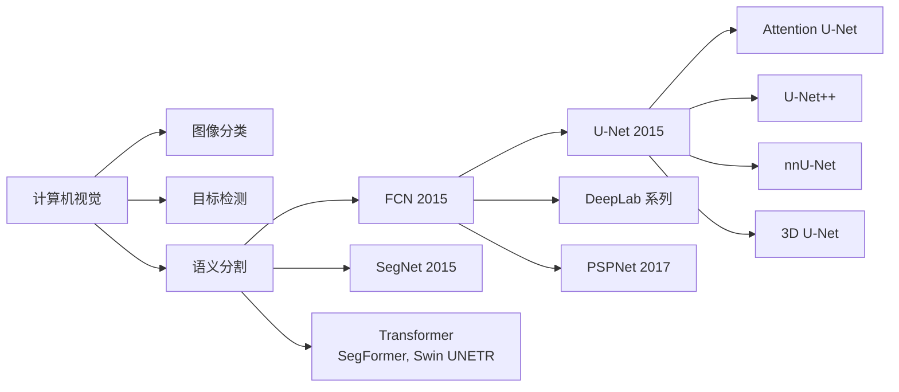
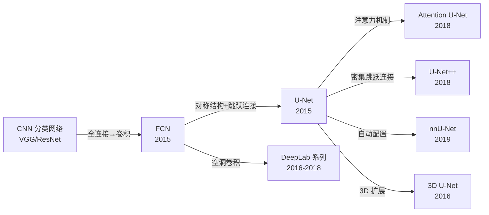
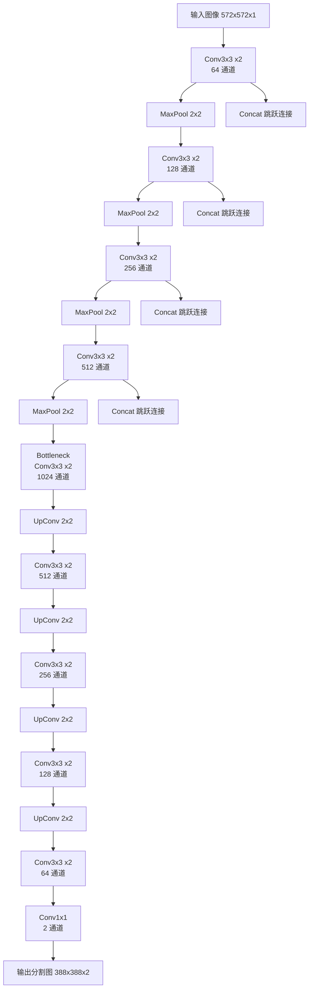
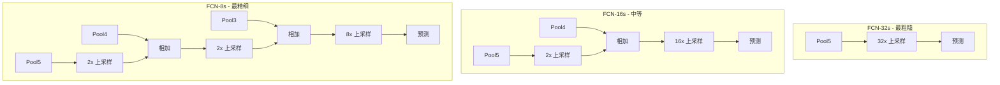

# FCN / U-Net

## 知识地图



## 前置知识

- CNN 基本原理：卷积层、池化层、全连接层的运作方式
- 图像分类网络：VGG, ResNet 的结构
- 转置卷积 (Transposed Convolution / Deconvolution) 的原理
- 上采样方法：最近邻插值、双线性插值、转置卷积
- 交叉熵损失和逐像素分类的概念

## 模型演化路线



| 模型 | 年份 | 关键创新 |
|------|------|----------|
| FCN | 2015 | 全卷积化，转置卷积上采样，跳跃连接融合特征 |
| U-Net | 2015 | 对称 U 形编解码器，长跳跃连接保留空间细节 |
| SegNet | 2015 | 记录池化索引用于上采样 |
| 3D U-Net | 2016 | 三维卷积，处理 CT/MRI 体积数据 |
| Attention U-Net | 2018 | 门控注意力过滤无关区域 |
| U-Net++ | 2018 | 密集跳跃连接，深度监督 |
| nnU-Net | 2019 | 自动配置（预处理、网络、后处理），无需手动调参 |

## 为什么会出现 (Why)

在 FCN 出现之前，使用 CNN 做图像分割的标准做法是**以像素为中心取一个 patch，送入分类网络判断该像素的类别**。这种方法有三个致命缺陷：

1. **计算极度冗余**：相邻像素的 patch 高度重叠，每个像素都要独立跑一遍 CNN
2. **感受野受限**：patch 的大小限制了网络能看到的上下文范围
3. **效率极低**：一张 512x512 的图像，需要跑 262,144 次 CNN 前向传播

FCN 的洞见是：**分类网络的全连接层本质上是"在整个特征图上做点积"——把它换成 1x1 卷积，再加转置卷积恢复分辨率，就能让网络输入任意大小的图、一次前向输出整张图的逐像素预测。**

U-Net 进一步追问：上采样过程丢失的空间细节如何找回？——答案是**跳跃连接**，将编码器的浅层细节直接传递给解码器。

## 解决什么问题 (Problem)

**如何高效地预测输入图像中每个像素的类别（语义分割），同时保持输出与输入相同的空间分辨率？**

具体挑战：
- 分类网络的下采样会丢失空间分辨率
- 上采样过程很难恢复精细的边缘和细节
- 医学影像等场景样本量极小，网络容易过拟合

## 核心思想 (Core Idea)

**FCN 将分类网络的全连接层替换为 1x1 卷积，并添加转置卷积进行上采样，使网络输出与输入同分辨率的像素级预测；U-Net 通过对称的编解码器结构和长跳跃连接，将浅层空间细节直接传递给解码器，实现高精度的像素级分割。**

---

## FCN (Fully Convolutional Network)

### 跳跃连接 (Skip Connections)

融合浅层细节和深层语义：

- FCN-32s：直接 32x 上采样（粗糙）
- FCN-16s：pool4 + 2x 上采样 + conv7 的 2x 上采样（较好）
- FCN-8s：pool3 + pool4 + conv7（最精细）

**通俗解释：** FCN-32s 是一次跳 32 倍——相当于把一张缩略图硬拉大到原图大小，模糊。FCN-16s 先用 pool4 的信息修正一次，再放大 16 倍——细节多了一些。FCN-8s 用 pool3 再修正一次——空间细节最丰富。跳跃连接本质上是"大图帮小图"：深层的语义信息告诉你"这是猫"，浅层的空间细节告诉你"猫的边界在哪里"。

### 输出

$$H \times W \times C \text{（每个像素的类别概率）}$$

---

## U-Net

### 架构：对称的 U 形结构

```
编码器（下采样）          解码器（上采样）
    ↓                       ↑
  Convx2                 Convx2
    ↓  MaxPool              ↑  ConvTranspose
  Convx2    ----concat---->  Convx2  <--
    ↓  MaxPool              ↑  ConvTranspose
  Convx2    ----concat---->  Convx2  <--
    ↓  MaxPool              ↑  ConvTranspose
  Convx2    ----concat---->  Convx2  <--
    ↓ (Bottleneck)
  Convx2
```

**通俗解释：** U-Net 像一个大大的 U 字母。左半边（下采样）不断缩小特征图、增加通道数——从"看细节"到"看大局"。右半边（上采样）不断放大特征图、减少通道数——从"知道是什么"到"画出在哪里"。中间的横线（跳跃连接）把左半边的"原始细节"直接传给右半边——这样解码器既有深层的语义信息（知道这是"细胞核"），又有浅层的空间信息（知道边界在哪）。

### U-Net 的优势

1. **跳跃连接保留空间细节**：上采样时拼接编码器对应层的特征图
2. **数据高效**：适合医学影像等小样本场景
3. **边缘清晰**：浅层的高频信息通过跳跃连接直接传递

---

## 数学模型/公式

### Dice Loss

常用 Dice Loss 或加权交叉熵：

$$\text{Dice}(y, \hat{y}) = \frac{2 |y \cap \hat{y}|}{|y| + |\hat{y}|}$$

$$L_{dice} = 1 - \text{Dice}$$

**通俗解释：** Dice 系数衡量两个集合的重叠程度——预测的掩膜和真实的掩膜有多少重合。"交集的两倍除以两个集合的大小之和"：如果完美重合，Dice=1；如果完全不重叠，Dice=0。Dice Loss = 1 - Dice，最小化为 0（完美预测）。Dice Loss 比交叉熵更适合类别不平衡的场景（如医学图像中病灶只占很小面积）。

### 加权交叉熵

$$L = -\sum_{x} w(x) \log(p_{\ell(x)}(x))$$

其中 $w(x)$ 是预先计算的权重图，用于强调边界像素或类别不平衡。

**通俗解释：** 给每个像素的损失加一个权重——边界像素（两个细胞之间的缝隙）权重高，让网络重点学习如何分开紧挨着的物体；背景像素权重低，减少网络关注。这对于密集排列的物体（如组织切片中的细胞）特别重要。

### FCN 上采样的转置卷积

转置卷积（Transposed Convolution）是可学习的上采样：

$$\text{Output} = \text{Conv2DTranspose}(\text{Input}, \text{kernel})$$

**通俗解释：** 转置卷积不是"反卷积"（不是数学上的逆操作），而是"带参数的上采样"。普通卷积是"多对一"（3x3 区域映射到 1 个值），转置卷积是"一对多"（1 个值通过核映射到 16 个位置）。这个核是可学习的，所以网络能学会"什么样的上采样模式对分割最有利"。

---

## 模型结构图

### U-Net 完整架构



### FCN 跳跃连接对比



## 可视化展示

### U-Net 变体

| 变体 | 改进 |
|------|------|
| Attention U-Net | 门控注意力过滤无关区域，让 decoder 只关注有用的 encoder 特征 |
| U-Net++ | 密集跳跃连接 + 深度监督，中间层也有监督信号 |
| nnU-Net | 自动配置（预处理、网络结构、后处理），开箱即用 |
| 3D U-Net | 用于 CT/MRI 等三维体积数据，3D 卷积处理 |

### FCN vs U-Net 对比

| 维度 | FCN | U-Net |
|------|-----|-------|
| 结构 | 编码器 + 简单跳跃连接 | 对称编解码器 + 长跳跃连接 |
| 上采样方式 | 转置卷积或插值 | ConvTranspose2d |
| 跳跃连接 | 相加 (element-wise sum) | 拼接 (channel-wise concat) |
| 特征复用 | 有限的浅层特征融合 | 丰富的多层特征融合 |
| 数据需求 | 较大 | 极小（几十张即可） |
| 边缘精度 | 一般 | 优秀 |
| 典型应用 | 通用场景分割 | 医学影像、卫星图像 |

---

## 最小可运行代码

```python
import torch.nn as nn

class UNetBlock(nn.Module):
    def __init__(self, in_ch, out_ch):
        super().__init__()
        self.conv = nn.Sequential(
            nn.Conv2d(in_ch, out_ch, 3, padding=1),
            nn.BatchNorm2d(out_ch),
            nn.ReLU(inplace=True),
            nn.Conv2d(out_ch, out_ch, 3, padding=1),
            nn.BatchNorm2d(out_ch),
            nn.ReLU(inplace=True),
        )

# 上采样：转置卷积或 nn.Upsample + Conv
# 跳跃连接：torch.cat([decoder_feat, encoder_feat], dim=1)
```

## 工业界应用

| 应用场景 | 推荐方案 | 原因 |
|----------|----------|------|
| 医学影像分割 | U-Net / nnU-Net | 小样本高效，边缘精度高，自动配置 |
| 自动驾驶语义分割 | FCN 变体 | 需要处理大场景，FCN 架构适合 |
| CT/MRI 器官分割 | 3D U-Net | 处理三维体积数据 |
| 卫星图像分割 | U-Net | 样本量小，边缘要求高 |
| 细胞/病理分割 | U-Net++ | 密集跳跃连接捕获微小结构 |
| 遥感地物分类 | DeepLab / PSPNet | 大感受野捕获全局上下文 |

## 对比表格

| 维度 | FCN | U-Net | SegNet | DeepLab v3+ |
|------|-----|-------|--------|-------------|
| 编解码结构 | 简单 | 对称 U 形 | 对称 + 记录池化索引 | Encoder-Decoder |
| 跳跃连接 | 相加 | 拼接 | 池化索引 | 简单拼接 |
| 多尺度策略 | 跳跃连接 | 跳跃连接 | 池化索引 | ASPP |
| 参数量 | 中 | 中 | 中 | 大 |
| 对小样本适应性 | 一般 | 极好 | 一般 | 一般 |
| 边缘精度 | 中 | 高 | 中 | 高 |

## 学完后建议继续学习

1. **DeepLab 系列**：了解空洞卷积和 ASPP 如何扩大感受野
2. **Attention U-Net**：理解注意力机制在分割中的作用
3. **nnU-Net 深入**：学习自动机器学习在分割中的应用
4. **3D 医学影像分割**：CT/MRI 数据处理与 3D U-Net
5. **Transformer 分割 (Swin UNETR, UNETR)**：了解 Transformer 架构在分割中的应用

## 高频面试题

### Q1: FCN 的跳跃连接如何工作？为什么 FCN-8s 比 FCN-32s 效果好？

**答：**
- **工作原理**：FCN 的跳跃连接通过在逐级上采样过程中融合浅层特征来恢复空间细节。FCN-32s 直接从 pool5（32 倍下采样）上采样到原图大小；FCN-16s 先将 pool5 上采样 2 倍，与 pool4 相加，再上采样 16 倍；FCN-8s 进一步融合 pool3。
- **FCN-8s 更好的原因**：
  1. pool3 保留了更多空间细节（8倍下采样 vs 32倍），边界信息更丰富
  2. 综合了深层语义（pool5 告诉"这是猫"）和浅层细节（pool3 告诉"猫的边缘在哪"）
  3. 分级"纠正"上采样的模糊——每次融合都是一次细节补偿

### Q2: U-Net 为什么特别适合医学影像分割？它相比 FCN 的设计优势是什么？

**答：**
- **适合医学影像的原因**：
  1. 医学影像样本量小（几十到几百张），U-Net 的对称结构和大量跳跃连接使信息传递更高效，小样本也能训练好
  2. 医学分割需要极高的边缘精度，U-Net 的长跳跃连接保真度更高
  3. 数据增强（弹性变形、旋转等）在 U-Net 框架中效果显著
- **相比 FCN 的设计优势**：
  1. **拼接 vs 相加**：FCN 用相加融合，信息量有限；U-Net 用通道拼接，保留了编码器的完整特征图，解码器能"看到"更多细节
  2. **对称结构**：U-Net 每层都对应跳跃连接，FCN 只有少数几层
  3. **可学习中继**：每个解码层都有足够的通道数来处理拼接后的特征

### Q3: 转置卷积 (Transposed Convolution) 的原理是什么？为什么它比直接插值好？

**答：**
- **原理**：转置卷积本质上是将输入值"分散"到输出区域。一个 1x1 的输入，经过 2x2 转置卷积（stride=2）会在输出产生一个 2x2 的区域，每个位置的值由卷积核的权重决定。
- **计算方式**：可以通过矩阵乘法理解——普通卷积是 $y = Cx$（稀疏矩阵），转置卷积是 $x = C^T y$（同样稀疏但转置的矩阵）。
- **优势**：
  - 参数可学习：网络能学会"什么样的上采样模式最好"
  - 可以学到比插值更复杂的模式：不仅平滑过渡，还能产生锐利的边缘
  - 可以使用任意核大小和步长
- **可能的缺点**：容易产生棋盘效应（checkerboard artifacts），需要仔细设计核大小和步长。实践中越来越多使用 `Upsample + Conv` 替代。

### Q4: Dice Loss 和交叉熵损失在分割任务中各自的优缺点？

**答：**
- **交叉熵**：
  - 优点：梯度稳定，对每个像素一视同仁
  - 缺点：对类别不平衡敏感——如果 95% 的像素是背景，模型学会"全预测背景"就能得到很低的损失
- **Dice Loss**：
  - 优点：直接优化分割的评价指标 (Dice = F1 score)，对类别不平衡不敏感——即使在 95% 背景下它只关心前景的预测质量
  - 缺点：训练早期梯度不稳定（当预测和 GT 完全不相交时梯度过小），对批量大小敏感
- **实践常用**：组合使用 `Dice Loss + BCE Loss`，取两者优点。或使用 Focal Tversky Loss 等改进版。

### Q5: U-Net 中的跳跃连接为什么要用 Concat 而不是 Add？

**答：**
- **Concat（拼接）**：将编码器和解码器的特征图在通道维度拼接，通道数翻倍。后再接卷积，让网络学习"如何融合两组特征"。
  - 优点：保留了编码器特征的完整信息，解码器的卷积层可以自主选择用哪些信息，更灵活
  - 缺点：参数量更大（后续卷积需要处理 2 倍输入通道）
- **Add（相加）**：逐元素相加，通道数不变。
  - 优点：参数量小，相当于残差学习
  - 缺点：假定了编码器和解码器特征具有相同的"重要性"，无可学习的融合策略
- **U-Net 选择 Concat 的原因**：编码器的浅层特征（边缘、纹理）和解码器的特征（语义信息）性质完全不同，不应该简单相加——拼接 + 再卷积让网络自己学最优融合方式。这对于保留空间细节至关重要。
