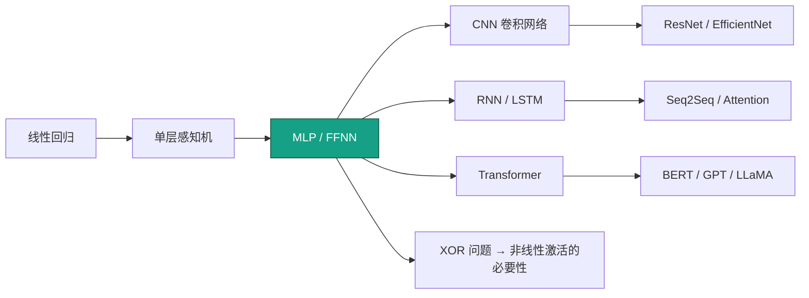
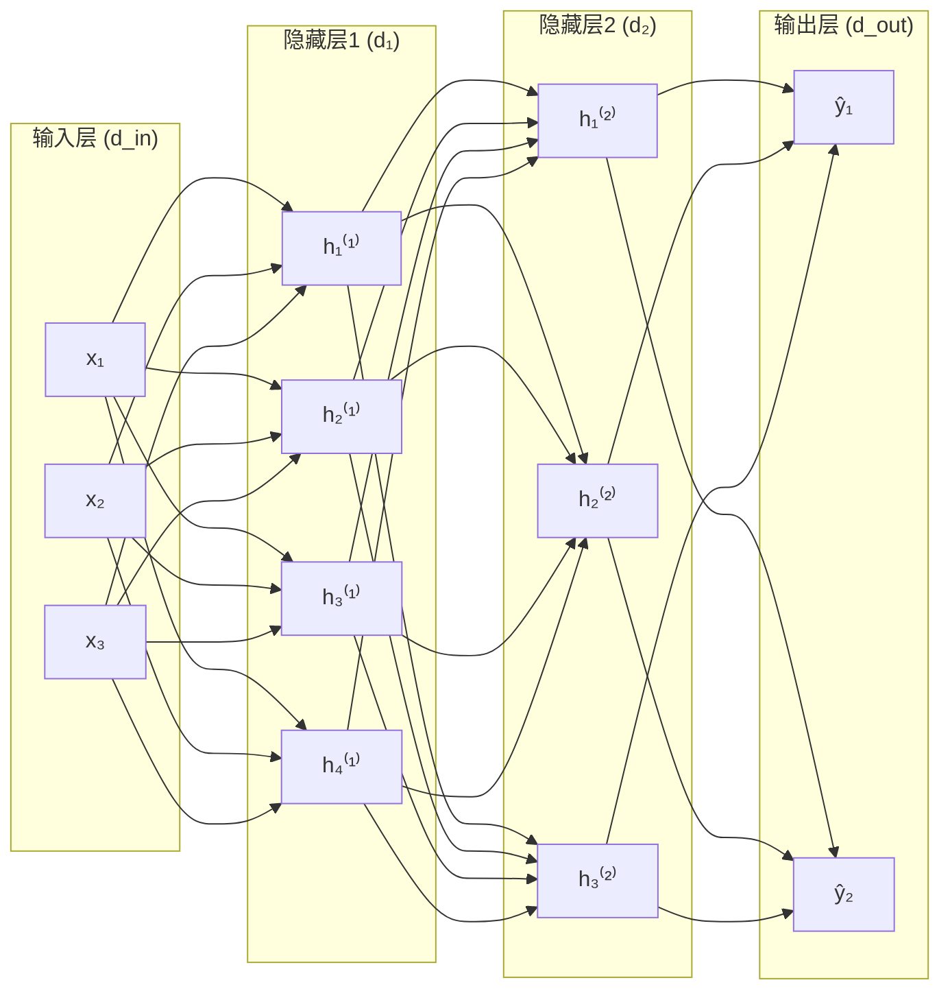
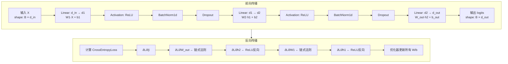

# FFNN / MLP (多层感知机)

## 知识地图



## 前置知识

- 线性代数：矩阵乘法、向量空间
- 微积分：链式法则（反向传播的核心）
- 线性回归与逻辑回归
- 激活函数（ReLU、Sigmoid、Tanh）的基本概念
- 梯度下降的基本原理

## 为什么会出现 (Why)

单层感知机（Perceptron）只能解决**线性可分**的问题。1969 年 Minsky 和 Papert 在《Perceptrons》一书中证明了单层感知机连 XOR（异或）都无法学习——这是一个致命缺陷，直接导致了第一次 AI 寒冬。多层感知机通过**堆叠多个线性层并在中间插入非线性激活函数**，打破了线性限制，使网络能够学习任意复杂的决策边界。Universal Approximation Theorem 更是从理论上保证了：只要隐藏层够宽，MLP 可以逼近任意连续函数。

## 解决什么问题 (Problem)

将输入空间通过多层非线性变换映射到输出空间，解决单层线性模型无法处理的**非线性分类与回归**问题。典型的入门案例就是 XOR 分类——一条直线无法分开，但加一个隐藏层、配一个非线性激活函数就能完美分开。

## 核心思想 (Core Idea)

多层感知机是深度学习的"Hello World"——线性层堆叠 + 非线性激活。单个线性层只能切一刀（线性分类器），但堆叠多层 + 非线性可以逼近任意连续函数（Universal Approximation Theorem）。XOR 问题是理解"为什么要非线性"的经典例子：单层感知机无法分开 XOR，加一个隐藏层即可。

---

## 数学模型/公式

### 前向传播

$$
\mathbf{h}^{(l)} = f^{(l)}(\mathbf{W}^{(l)} \mathbf{h}^{(l-1)} + \mathbf{b}^{(l)})
$$

其中 $\mathbf{W}^{(l)} \in \mathbb{R}^{d_{out} \times d_{in}}$，$\mathbf{b}^{(l)} \in \mathbb{R}^{d_{out}}$，$f^{(l)}$ 为激活函数（ReLU/Tanh 等）。

**通俗解释：** 每一层做两件事——先用一个"旋转变换"（乘以权重矩阵 W）把上一层的信号重新组合，再加一个"平移"（偏置 b），最后过一个"过滤网"（激活函数 f）只让有价值的信号通过。多层叠加起来，就像一次次重新组合和筛选信息，最终从原始数据中提炼出分类或预测所需的高层特征。

### 反向传播（链式法则）

$$
\frac{\partial L}{\partial \mathbf{W}^{(l)}} = \frac{\partial L}{\partial \mathbf{h}^{(l)}} \cdot \frac{\partial \mathbf{h}^{(l)}}{\partial \mathbf{W}^{(l)}}
$$

**通俗解释：** 反向传播就是"问责制"——先看最终输出和正确答案差多少（损失 L），然后从最后一层开始，逐层往前追问"你贡献了多少误差？"链式法则就是"你的错 × 你上游的错"，像多米诺骨牌一样把责任梯度从输出层一直传递到输入层。

关键是 $\frac{\partial L}{\partial \mathbf{h}^{(l)}}$ 从输出层递归计算：

$$
\frac{\partial L}{\partial \mathbf{h}^{(l-1)}} = (\mathbf{W}^{(l)})^T \frac{\partial L}{\partial \mathbf{h}^{(l)}} \odot f'(\mathbf{W}^{(l)}\mathbf{h}^{(l-1)} + \mathbf{b}^{(l)})
$$

**通俗解释：** 这一层对输入的梯度 = 先把输出梯度"倒着投影"回去（乘以 W 的转置），再乘以激活函数的导数——若某神经元在 ReLU 下已经"死掉"（输出为负），梯度就是 0，它不承担任何责任，也不更新参数。

### 通用逼近定理（Universal Approximation Theorem）

具有单个隐藏层 + Sigmoid 激活 + 足够多神经元的 MLP 可以以任意精度逼近 $\mathbb{R}^n$ 紧子集上的任意连续函数。注意：定理没说多少神经元才"足够"——实践中可能需要指数级数量。

**通俗解释：** 这个定理相当于说"给你足够多的乐高积木（隐藏层神经元），你能搭出任何形状（任意连续函数）"。但它是个存在性定理——它保证存在一种搭法，却不告诉你需要多少积木、怎么搭最快。正因如此，实践中我们往往堆很多层（深度）而不是只堆一层无限宽。

### Xavier / He 初始化

- **Xavier**：$\text{Var}(W) = \frac{2}{d_{in} + d_{out}}$，配合 Sigmoid/Tanh
- **He**：$\text{Var}(W) = \frac{2}{d_{in}}$，配合 ReLU 族。ReLU 将一半输入置零 → 需要更大的权重方差来维持信号。

**通俗解释：** 初始化就像调水温——太烫（权重太大）会让信号在前向传播时爆炸，太凉（权重太小）会让信号逐层衰减到零。Xavier 和 He 初始化就是经过数学推导的"最佳初始水温"，保证信号在层与层之间既不爆炸也不消失。

---

## 可视化展示

### MLP 典型架构



### 不同激活函数的决策边界 (XOR 问题)

```echarts
return {
  tooltip: { trigger: "axis", confine: true },
  title: { top: 5,  text: 'XOR 分类: 单隐藏层(4神经元) 不同激活函数', left: 'center', textStyle: { fontSize: 12 } },
  legend: { data: ['❌ 无激活(线性)', '✅ ReLU', '✅ Tanh'], bottom: 0 },
  xAxis: { type: 'value', min: -2, max: 2 },
  yAxis: { type: 'value', min: -2, max: 2 },
  series: [
    { name: '❌ 无激活(线性)', type: 'scatter', symbolSize: 14,
      data: [[0,0],[0,1],[1,0],[1,1]],
      itemStyle: { color: '#c0392b' },
      markArea: { silent: true, data: [[{xAxis:-2,yAxis:-2},{xAxis:2,yAxis:2}]] }
    },
    { name: '✅ ReLU', type: 'scatter', symbolSize: 14,
      data: [[0,0,'○'],[0,1,'×'],[1,0,'×'],[1,1,'○']],
      itemStyle: { color: '#16a085' }
    },
    { name: '✅ Tanh', type: 'scatter', symbolSize: 14,
      data: [[0,0,'○'],[0,1,'×'],[1,0,'×'],[1,1,'○']],
      itemStyle: { color: '#2980b9' }
    }
  ],
  grid: { left: 50, right: 20, top: 55, bottom: 60 }
}
```

无激活的多层退化为单层线性变换（多乘几个矩阵＝一个矩阵），这正是 MLP 必须加非线性的数学原因。

---

## 模型结构图



---

## 最小可运行代码

### PyTorch — MLP 分类器

```python
import torch
import torch.nn as nn

class MLP(nn.Module):
    def __init__(self, input_dim=784, hidden_dims=[512, 256], output_dim=10, dropout=0.2):
        super().__init__()
        layers = []
        prev_dim = input_dim
        for h in hidden_dims:
            layers.extend([
                nn.Linear(prev_dim, h),
                nn.ReLU(inplace=True),
                nn.BatchNorm1d(h),
                nn.Dropout(dropout)
            ])
            prev_dim = h
        layers.append(nn.Linear(prev_dim, output_dim))
        self.net = nn.Sequential(*layers)

    def forward(self, x):
        # x: [B, input_dim]
        return self.net(x)

# 可运行示例
if __name__ == "__main__":
    model = MLP(input_dim=784, hidden_dims=[512, 256], output_dim=10)
    x = torch.randn(32, 784)          # 模拟 MNIST: batch=32, 28×28=784
    y = model(x)                      # [32, 10]
    print(f"Input shape: {x.shape}, Output shape: {y.shape}")
```

### NumPy — 手写前向 + 反向

```python
import numpy as np

def relu(x): return np.maximum(0, x)
def relu_grad(x): return (x > 0).astype(float)
def softmax(x):
    e = np.exp(x - x.max(axis=1, keepdims=True))
    return e / e.sum(axis=1, keepdims=True)

# 2 层 MLP 前向
def forward(X, W1, b1, W2, b2):
    h = relu(X @ W1 + b1)
    y = softmax(h @ W2 + b2)
    return h, y

# 2 层 MLP 反向
def backward(X, y, y_true, h, W2):
    m = X.shape[0]
    dy = (y - y_true) / m            # softmax + CE 梯度
    dW2 = h.T @ dy
    db2 = dy.sum(axis=0)
    dh = dy @ W2.T * relu_grad(h)
    dW1 = X.T @ dh
    db1 = dh.sum(axis=0)
    return dW1, db1, dW2, db2
```

---

## 工业界应用

| 应用领域 | 具体场景 | 为什么使用 MLP |
|----------|----------|----------------|
| 推荐系统 | 点击率预估 (CTR) | 对稀疏高维特征的非线性组合能力强 |
| 金融风控 | 信用评分、欺诈检测 | 可解释性好，可配合特征工程 |
| 自然语言处理 | Transformer 中的 FFN 子层 | 对 token 表示做非线性变换（占 Transformer 参数 2/3） |
| 计算机视觉 | CNN 最后的分类头 | 将卷积提取的特征映射到类别概率 |
| 强化学习 | 策略网络 / 价值网络 | 灵活拟合策略函数和价值函数 |
| 时间序列 | 销售预测、能耗预测 | 对多维时序特征的非线性建模 |

---

## 对比表格

| 对比维度 | 单层感知机 | 2层 MLP | 深层 MLP (5+ 层) |
|----------|-----------|---------|-------------------|
| 决策边界 | 线性（直线/平面） | 任意凸多边形 | 任意复杂形状 |
| XOR 问题 | 无法解决 | 可以解决 | 可以解决 |
| 训练难度 | 极易（凸优化） | 中等（非凸） | 困难（梯度消失/爆炸） |
| 参数量 | 少 | 中等 | 多（需要正则化） |
| 表达力 | 弱（线性） | 强（通用逼近） | 极强（层次化特征） |
| 过拟合风险 | 低 | 中 | 高（需 Dropout / BN） |

---

## 学完后建议继续学习

- [全连接层 (Dense Layer)](./dense-layer.md) —— MLP 的基本组成单元
- [激活函数详解](./activation-functions.md) —— ReLU、GELU、Swish 的深入对比
- [反向传播与自动微分](./backpropagation.md) —— 理解梯度如何流动
- [CNN 卷积网络](./conv-layer.md) —— 从全连接到局部连接，处理图像
- [归一化方法](./normalization.md) —— BatchNorm / LayerNorm 加速训练
- [Dropout 正则化](./dropout.md) —— 防止过拟合的核心技巧

---

## 高频面试题

**Q1: 为什么单层感知机无法解决 XOR 问题？**

标准答案：XOR 的四点 {(0,0)→0, (0,1)→1, (1,0)→1, (1,1)→0} 在输入空间中不是线性可分的——找不到一条直线把输出为 0 和输出为 1 的点分开。单层感知机的决策边界是 $\mathbf{w} \cdot \mathbf{x} + b = 0$，只能是直线。加一个隐藏层后，网络可以做非线性变换将 XOR 的四点映射到新的空间中，使其线性可分。

**Q2: MLP 中为什么必须加非线性激活函数？**

标准答案：如果没有非线性激活函数，多个线性层的叠加仍然是线性变换（矩阵乘法满足结合律：$W_2(W_1 x) = (W_2 W_1) x$），多层退化为单层，无法学习非线性决策边界。非线性激活函数打破了这种线性组合关系，使得深层网络真正具有层次化的表达能力。

**Q3: Xavier 初始化和 He 初始化的区别？各自适用场景？**

标准答案：Xavier 初始化使方差 = $2 / (d_{in} + d_{out})$，假设激活函数在零点附近近似线性，适用于 Sigmoid / Tanh。He 初始化使方差 = $2 / d_{in}$，考虑了 ReLU 将一半输入置零导致方差减半这一事实（分母只用了 $d_{in}$ 而非 $d_{in} + d_{out}$），专门适配 ReLU 及变体（LeakyReLU、PReLU）。

**Q4: 反向传播中梯度消失和梯度爆炸是怎么产生的？**

标准答案：反向传播通过链式法则将梯度从输出层逐层传回输入层。每经过一层，梯度要乘以权重矩阵和激活函数的导数。如果权重初始值太小或激活函数导数 < 1（如 Sigmoid 最大导数仅 0.25），梯度连乘后会指数级衰减 → 梯度消失；反之若权重太大且无约束，梯度连乘后指数级增长 → 梯度爆炸。解决方案：用 ReLU（导数恒为 0 或 1，不压缩）、He/Xavier 初始化、BatchNorm、Gradient Clipping。

**Q5: MLP 和现代 Transformer 中的 FFN 有什么关系？**

标准答案：Transformer 中的 FFN（Feed-Forward Network）本质上就是一个 2 层 MLP：$\text{FFN}(x) = \text{GELU}(xW_1 + b_1)W_2 + b_2$。通常中间维度 $d_{ff} \approx 4 \times d_{model}$，这是 Transformer 中参数量最大的部分（约占 2/3）。区别在于 FFN 是对每个 token 位置独立应用的（position-wise），且使用 GELU 而非 ReLU 作为激活函数。
