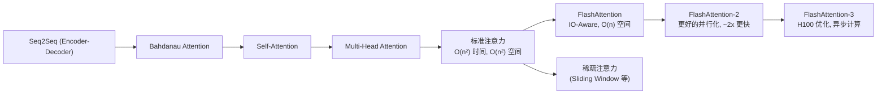
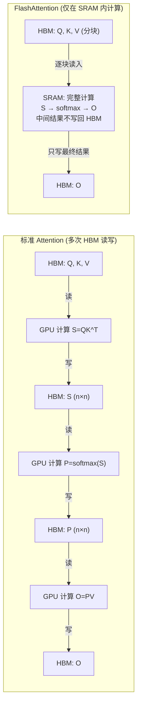

# FlashAttention

## 知识地图



## 前置知识

- **Self-Attention 计算流程**：理解 $S = QK^T$、$P = \text{softmax}(S)$、$O = PV$ 三个步骤
- **GPU 内存层级**：理解 HBM（高带宽显存，大但慢）和 SRAM（片上缓存，小但快）的区别
- **Softmax 的数值稳定性**：理解 $\text{softmax}(x_i) = \frac{e^{x_i - \max(x)}}{\sum e^{x_j - \max(x)}}$ 中的最大值减法

## 为什么会出现 (Why)

标准注意力实现有一个隐蔽但致命的瓶颈：**不是计算量太大，而是数据搬运太多**。

具体来说，标准实现中：
1. 计算 $S = QK^T$，得到一个 $n \times n$ 的矩阵，**必须写回 HBM**
2. 从 HBM 读取 $S$，计算 $P = \text{softmax}(S)$，**再写回 HBM**
3. 从 HBM 读取 $P$ 和 $V$，计算 $O = PV$，**再写回 HBM**

$S$ 和 $P$ 两个 $n \times n$ 矩阵的多次 HBM 读写是整个流程的瓶颈。GPU 的计算能力远大于 HBM 带宽——计算这些矩阵乘法很快，但把中间结果搬来搬去却慢得多。这就是典型的 **IO-bound**（内存带宽瓶颈）而非 **compute-bound**（计算瓶颈）。

当 $n=64K$ 时，$n \times n$ 矩阵约 16GB（FP32），来回搬运的时间远大于实际计算时间。

## 解决什么问题 (Problem)

FlashAttention 解决的核心问题：**如何在不损失计算精度的前提下，避免将 $n \times n$ 的注意力矩阵写入 HBM，从而消除标准注意力的 IO 瓶颈。**

## 核心思想 (Core Idea)

**FlashAttention 是一种 IO-Aware 的精确注意力算法——通过分块计算（Tiling）和 Online Softmax，在 GPU SRAM 内部完成完整的注意力计算，只将最终结果写回 HBM，从而消除中间 $n \times n$ 矩阵的 HBM 读写。**

---

## 数学公式

### 标准注意力的 IO 问题

标准注意力实现：

$$\mathbf{S} = \mathbf{Q}\mathbf{K}^T \in \mathbb{R}^{n \times n}$$

$$\mathbf{P} = \text{softmax}(\mathbf{S})$$

$$\mathbf{O} = \mathbf{P}\mathbf{V}$$

$n \times n$ 的注意力矩阵需要从 HBM 读写，当 $n$ 很大时（如 64K），这成为内存带宽瓶颈，而非计算瓶颈。

**通俗解释：** 标准做法就像你写论文时，每写一句话就把整篇论文打印出来检查一遍。大部分时间浪费在打印机上（HBM 读写），而不是写作本身（GPU 计算）。FlashAttention 则是只在脑子里（SRAM）修改段落的顺序和内容，最后一次性打印最终稿。

### FlashAttention 的 IO-Aware 原理

GPU 的内存层级决定了性能瓶颈不是 FLOPS，而是 IO：

| 存储层级 | 大小 | 带宽 | 速度比喻 |
|----------|------|------|---------|
| HBM (如 H100 的 80GB) | 大 (80GB) | ~3.35 TB/s | "图书馆书库"——容量大但取书慢 |
| SRAM (片上) | 小 (~20MB/SM) | ~19 TB/s | "桌面"——空间小但伸手即得 |
| 计算单元 (Tensor Core) | — | ~1000 TFLOPS | "大脑"——每秒万亿次运算 |

标准 Attention 每次中间结果都要在 HBM 和 SRAM 之间搬运。FlashAttention 通过分块，让每个块的计算完全在 SRAM 内完成，中间结果不写回 HBM。

**通俗解释：** 标准做法是你从书库（HBM）搬一堆书（Q, K, V）到桌面（SRAM），计算出注意力矩阵后又搬回书库，下次需要时再搬出来——搬来搬去占用了大量时间。FlashAttention 是：把 Q, K, V 切成小块，每次只搬一小块到桌面，在桌面上完成所有计算，只把最终结果搬回书库。

---

## 核心技巧

### 1. 分块计算 (Tiling)

将 Q, K, V 切分成小块，在 SRAM 中完成局部计算，避免将完整的 $n \times n$ 矩阵写入 HBM。

**通俗解释：** 假设你需要对 1000 个文档打分排序。标准做法是把所有分数算出来列成 1000×1000 的表格（$n^2$ 存储），再按行做 softmax。Tiling 的做法是：每次只拿一小块文档，边算边更新最终排名，不需要保存完整的中间表格。

### 2. Online Softmax

通过维护 running max 和 running sum，逐步更新 Softmax：

```python
# 伪代码：Online Softmax
m_i = max(m_{i-1}, row_max_i)
sum_i = sum_{i-1} * exp(m_{i-1} - m_i) + row_sum_i * exp(row_max_i - m_i)
```

**通俗解释：** 标准 Softmax 需要先知道所有分数才能计算（要先找到最大值，再对每个值求 exp，再归一化）。Online Softmax 的精妙之处在于：它可以用"流水线"方式处理——每来一小块数据，就用一个 running max 和 running sum 更新全局结果。之前已处理的数据，因为最大值被更新而需要重新缩放，这个重新缩放恰好可以通过 $e^{m_{old} - m_{new}}$ 来实现。

### 3. 重计算 (Recomputation)

反向传播时不保存中间注意力矩阵，而是重新计算。用计算换内存。

**通俗解释：** 训练时标准做法是前向计算时把 $S$ 和 $P$ 保存起来，反向传播时直接用。FlashAttention 不保存这两个矩阵——反向传播需要它们时，就重新从 Q, K, V 计算一遍。虽然多花了计算时间，但省下了巨大的 HBM 空间，总体反而更快（因为少做了很多 HBM 读写）。

---

## FlashAttention-2 改进

- 减少非矩阵乘法运算
- 更好地并行化（沿序列长度维度）
- 优化 warp 级别的调度
- 达到理论峰值的约 70%

## FlashAttention-3

针对 H100 GPU 的异步特性（WGMMA 指令、TMA 加速器）进一步优化。

---

## 可视化展示

### IO-Aware 对比：标准 vs FlashAttention



### 内存占用对比

```echarts
return {
  tooltip: { trigger: "axis", confine: true },
  title: { top: 5,  text: '内存占用对比 (n=4096, d=64, FP16)', left: 'center' },
  xAxis: { type: 'category', data: ['标准 Attention', 'FlashAttention'] },
  yAxis: { type: 'value', min: 0, max: 70, name: '内存占用 (MB)' },
  series: [{
    type: 'bar',
    data: [64, 2],
    itemStyle: { color: '#2980b9' },
    label: { show: true, position: 'top', formatter: '{c} MB' }
  }],
  grid: { left: 60, right: 20, top: 55, bottom: 55 }
}
```

FlashAttention 的内存占用从 $O(n^2)$ 降到 $O(n)$，这是 IO-Aware 设计的直接收益。

### 注意力矩阵概念

无论是标准 Attention 还是 FlashAttention，最终的**数学结果完全相同**（这是"精确"算法的含义）。区别只在于**如何实现**——标准 Attention 显式地在 HBM 中构建完整的 $n \times n$ 注意力矩阵，FlashAttention 只是不使用 HBM 存储这个中间矩阵，但计算出的结果 $O$ 是完全一致的。

---

## 最小可运行代码

### PyTorch 2.0+ 内置支持

```python
# PyTorch 2.0+ 内置支持
import torch.nn.functional as F

# 自动使用 FlashAttention (如果可用)
out = F.scaled_dot_product_attention(Q, K, V, is_causal=True)

# 或手动指定
from flash_attn import flash_attn_func
out = flash_attn_func(Q, K, V, causal=True)
```

---

## 工业界应用

| 应用场景 | 系统/框架 | 使用方式 |
|----------|----------|---------|
| LLM 训练 | GPT-4, LLaMA 3, DeepSeek | 内置 FlashAttention-2/3 |
| LLM 推理 | vLLM, TensorRT-LLM | FlashAttention + PagedAttention |
| 长上下文模型 | Gemini 1.5 (1M tokens) | FlashAttention 使 1M 上下文可在 HBM 内容纳 |
| 扩散模型 | Stable Diffusion 3 | FlashAttention 加速 Cross-Attention |
| 训练框架 | PyTorch 2.0+, JAX | `scaled_dot_product_attention` 默认使用 |

## 对比表格

### Flash Attention vs Standard Attention

| 特性 | 标准 Attention | FlashAttention | FlashAttention-2 |
|------|---------------|----------------|------------------|
| 时间复杂度 | $O(n^2 d)$ | $O(n^2 d)$ | $O(n^2 d)$ |
| 空间复杂度 | $O(n^2)$ | $O(n)$ | $O(n)$ |
| HBM 读写次数 | $O(n^2)$ | $O(n^2 d^2 / M)$ | 更少 |
| 计算精度 | 精确 | **精确**（非近似） | 精确 |
| 是否保存中间矩阵 | 是 ($S$, $P$) | 否（重计算） | 否 |
| 加速比 | 1× | 2-4× | 4-8× |
| 对 $n$ 的可扩展性 | 差 (OOM at ~4K) | 好 (支持到 64K+) | 极好 |

### FlashAttention vs 稀疏注意力

| 特性 | FlashAttention | Sparse Attention (如 Sliding Window) |
|------|---------------|--------------------------------------|
| 计算类型 | **精确**（结果与标准一致） | **近似**（丢失部分信息） |
| 优化维度 | 硬件 IO 优化 | 算法稀疏化 |
| 可否叠加 | 是——FlashAttention 可以加速任何注意力模式 | 是——稀疏模式可以用 FlashAttention 的 tiling 加速 |
| 长序列支持 | 受 $O(n^2 d)$ 计算量限制 | 可降到 $O(n w d)$ |

---

## 学完后建议继续学习

1. **FlashAttention-2 / FlashAttention-3** — 了解在 A100/H100 上的进一步优化技巧
2. **PagedAttention (vLLM)** — 理解 KV Cache 的分页管理，与 FlashAttention 互补
3. **FlashDecoding** — 理解针对解码阶段的长序列推理优化
4. **Ring Attention** — 分布式场景下的长序列注意力（多 GPU 分片）
5. **GQA / MQA** — 从算法层面减少 KV Cache，与 FlashAttention 的 IO 优化互补

## 高频面试题

### Q1: FlashAttention 的核心思想是什么？为什么能比标准 Attention 快？

**标准答案：**
FlashAttention 的核心思想是 **IO-Awareness**——意识到标准注意力的瓶颈不是 GPU 计算（FLOPS），而是 HBM 和 SRAM 之间的数据搬运（IO）。

它通过三个关键技术实现加速：
1. **分块计算 (Tiling)**：将 Q, K, V 切成小块，每块在 SRAM 内完成完整的 softmax 计算，避免将 $n \times n$ 中间矩阵写入 HBM
2. **Online Softmax**：通过维护 running max 和 running sum，支持分块逐步计算 softmax
3. **重计算 (Recomputation)**：反向传播时不保存 $S$ 和 $P$，而是从 Q, K, V 重新计算，用计算换内存

加速比 2-4×，内存节省 10-20×（空间从 $O(n^2)$ 降到 $O(n)$），且**结果完全精确**（非近似算法）。

### Q2: 什么是 IO-Aware？标准注意力的 IO 瓶颈具体指什么？

**标准答案：**
IO-Aware 指在设计算法时充分考虑硬件内存层级的带宽特性。GPU 的内存架构中：
- **HBM**（高带宽显存）：容量大（~80GB），但带宽相对低（~3.35 TB/s on H100）
- **SRAM**（片上缓存）：容量小（~20MB per SM），但带宽极高（~19 TB/s）

标准 Attention 的 IO 瓶颈在于：
1. 需要将 $n \times n$ 的 $S$ 矩阵写入 HBM（$O(n^2)$ 写）
2. 再从 HBM 读出 $S$ 计算 softmax（$O(n^2)$ 读）
3. 再将 $n \times n$ 的 $P$ 矩阵写入 HBM（$O(n^2)$ 写）
4. 再从 HBM 读出 $P$ 和 $V$ 计算 $O$（$O(n^2)$ 读）

当 $n$ 很大时，HBM 带宽成为瓶颈——GPU 计算单元大部分时间在等待数据。

### Q3: FlashAttention 是近似算法吗？和稀疏注意力有什么区别？

**标准答案：**
FlashAttention **不是近似算法**——它计算出的结果与标准 Attention **完全一致**（逐位相等，误差在浮点精度内）。它是一种**算法实现层面的优化**，而非模型层面的近似。

与稀疏注意力的关键区别：
- **FlashAttention**：优化的是**计算过程的 IO 效率**，数学结果与标准 Attention 完全相同。时间复杂度仍是 $O(n^2 d)$（因为每个 Q 块仍需与所有 K 块计算），但空间复杂度降到 $O(n)$。
- **稀疏注意力**（如 Sliding Window）：优化的是**注意力模式本身**——限制每个位置只关注部分位置。数学结果与标准 Attention **不同**（丢失了部分信息），但时间复杂度和空间复杂度都降低（如 $O(nw)$）。

两者可以叠加使用：用稀疏模式定义注意力范围，用 FlashAttention 的 tiling 技术高效计算。

### Q4: FlashAttention 的 Online Softmax 是如何工作的？

**标准答案：**
标准 Softmax 需要两遍扫描：第一遍找最大值 $m$，第二遍计算 $\sum e^{x_i - m}$ 并归一化。Online Softmax 用流式方式一行完成：

维护两个 running 变量：
- `m`：当前见过的最大值
- `sum`：当前累计的 $\sum e^{x_i - m}$

当新来一块数据时有新的最大值 $m_{new} > m_{old}$ 时，之前累计的 sum 需要重新缩放：`sum = sum * exp(m_old - m_new)`，然后加上新块的贡献。这保证了任何时候的 sum 都是相对于当前最大值的正确分母。

公式：$m_i = \max(m_{i-1}, \text{row\_max}_i)$，$\text{sum}_i = \text{sum}_{i-1} \cdot e^{m_{i-1} - m_i} + \text{row\_sum}_i \cdot e^{\text{row\_max}_i - m_i}$

这个技巧使得分块计算 softmax 成为可能——不需要一次性看到所有分数就能正确更新。
