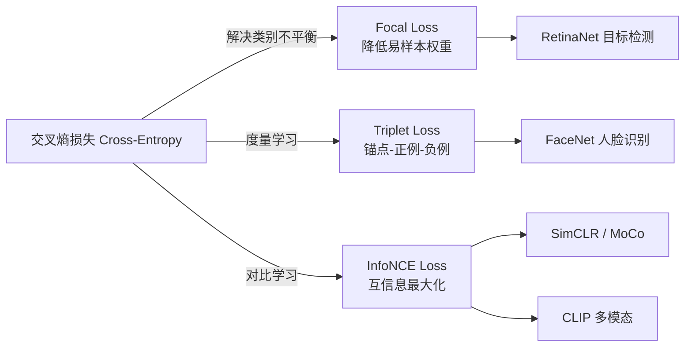
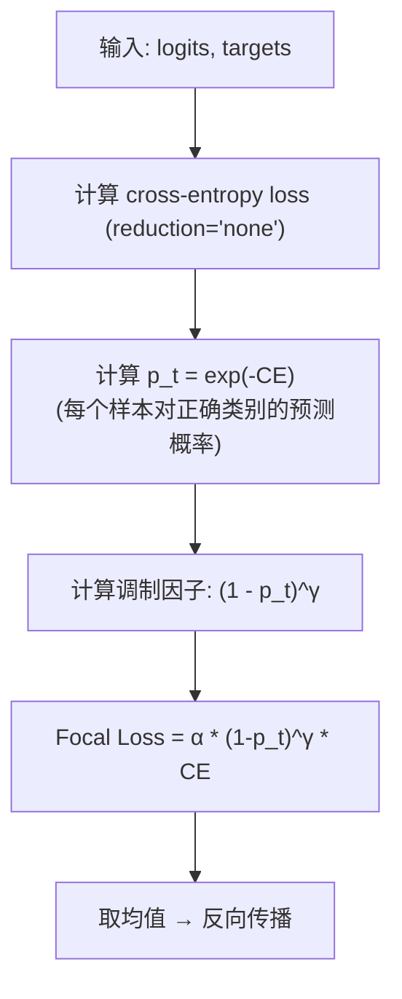
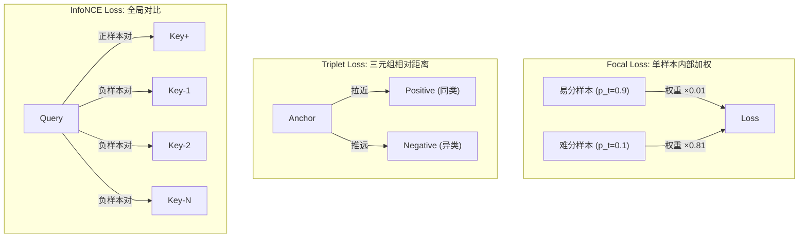

# Focal Loss / Triplet Loss / Contrastive Loss

## 知识地图



## 前置知识

- 交叉熵损失 (Cross-Entropy Loss) 的定义与推导
- 目标检测中的正负样本概念
- Softmax 和多分类问题
- 度量学习 (Metric Learning) 的基本概念

## 为什么会出现 (Why)

标准交叉熵对所有样本"一视同仁"——一个已经预测得很准的样本（$p_t=0.99$）和一个模型还在纠结的样本（$p_t=0.51$），每人贡献的 loss 差距不大。在目标检测中，一张图 99% 的区域是背景（易分负样本），1% 是物体（难分样本）。标准交叉熵会让海量背景样本的梯度淹没了稀有前景样本的梯度，导致模型学不到有用的东西。

## 解决什么问题 (Problem)

**类别极度不平衡问题**。Focal Loss 的核心机制：自动降低"已经分得很好"的样本的 loss 权重，让模型把注意力集中在"还没学会"的困难样本上。Triplet Loss 和 InfoNCE 则解决了另一个问题——如何学习样本之间的相对关系（相似度排序），而不仅仅是绝对的分类正确性。

## 核心思想 (Core Idea)

**Focal Loss 通过 $(1-p_t)^\gamma$ 调制因子动态降权易分类样本，让模型专注于它还不擅长的困难样本；Triplet Loss 和 InfoNCE 通过正负样本对的相对距离来学习有区分力的特征表示。**

---

## 数学定义与原理解析

### Focal Loss

$$
\text{FL}(p_t) = -\alpha_t (1 - p_t)^\gamma \log(p_t)
$$

其中：

$$
p_t = \begin{cases} \hat{y} & \text{if } y = 1 \\ 1 - \hat{y} & \text{otherwise} \end{cases}
$$

$p_t$ 是"模型对正确类别的预测概率"——越接近 1 越好。

**通俗解释：** 在标准交叉熵 $-\log(p_t)$ 前面乘上一个调制因子 $(1-p_t)^\gamma$。如果模型已经预测得很准（$p_t \approx 0.9$），$(1-0.9)^2 = 0.01$，loss 被压缩 100 倍——"这题你已经会了，不用再背了"。如果模型还在纠结（$p_t \approx 0.1$），$(1-0.1)^2 = 0.81$，loss 几乎不变——"这个你还没学会，给我多花时间"。$\alpha_t$ 是额外的类别权重（可选），平衡正负样本数量。

- **$(1 - p_t)^\gamma$**：**调制因子**（核心创新），降低易分类样本的权重
- **$\gamma \geq 0$**：聚焦参数，$\gamma = 0$ 退化为标准交叉熵，$\gamma = 2$ 效果最好
- **$\alpha_t$**：类别权重，平衡正负样本（可选）

**数值示例**（$\gamma = 2$）：

| $p_t$ | 调制因子 $(1-p_t)^2$ | Loss 缩放倍数 |
|-------|---------------------|--------------|
| 0.9（易） | $(0.1)^2 = 0.01$ | **缩小 100x** |
| 0.5（中） | $(0.5)^2 = 0.25$ | 缩小 4x |
| 0.1（难） | $(0.9)^2 = 0.81$ | 几乎不变 |

### Triplet Loss

用于度量学习（人脸识别、图像检索）：

$$
L = \max(0, \|f(a) - f(p)\|^2 - \|f(a) - f(n)\|^2 + \alpha)
$$

- $a$（Anchor）：锚点样本
- $p$（Positive）：同类样本
- $n$（Negative）：异类样本
- $\alpha$（Margin）：最小间隔

**通俗解释：** 我们希望锚点到正样本的距离 < 锚点到负样本的距离，且至少差 $\alpha$ 的间隔。如果已经满足这个条件（正样本确实比负样本近且差距超过 $\alpha$），Loss = 0，不做任何事。如果不满足（负样本太近了），Loss = 差距的大小，梯度会推开负样本、拉近正样本。$\alpha$ 是"安全间隙"——就像停车时要离邻车保持一定距离才安心。

### InfoNCE Loss（对比学习标配）

SimCLR、MoCo 等对比学习方法使用：

$$
L = -\log \frac{\exp(q \cdot k_+ / \tau)}{\exp(q \cdot k_+ / \tau) + \sum_{k_-} \exp(q \cdot k_- / \tau)}
$$

**通俗解释：** 这本质是一个 $K+1$ 类的 Softmax 分类问题——给定查询 $q$，在 $K+1$ 个候选中找到唯一正确的那个 $k_+$。分子是正样本对的相似度（希望大），分母是所有候选（正样本 + K 个负样本）的相似度之和。温度参数 $\tau$ 控制相似度的"锐度"——$\tau$ 越小，Softmax 的分布越尖锐（对相似度差异更敏感），负样本被"推开"的力度越大。

直觉：$K+1$ 个候选中，拉近正样本对 $(q, k_+)$，推远所有负样本 $(q, k_-)$。$\tau$ 是温度参数。

---

## 算法流程图



---

## 可视化展示

### Focal Loss 的调制因子效应

```echarts
return {
  xAxis: { type: 'value', min: 0, max: 1, name: 'p_t (正确类别的预测概率)' },
  yAxis: { type: 'value', min: 0, max: 5, name: 'Loss' },
  legend: { top: 28,  data: ['CE (gamma=0)', 'Focal gamma=1', 'Focal gamma=2', 'Focal gamma=5'] },
  series: [
    {
      name: 'CE (gamma=0)', type: 'line', smooth: true,
      lineStyle: { color: '#95a5a6', width: 2 },
      data: (function() { const d = []; for (let p = 0.001; p <= 1; p += 0.002) d.push([p, -Math.log(p)]); return d; })()
    },
    {
      name: 'Focal gamma=1', type: 'line', smooth: true,
      lineStyle: { color: '#2980b9', width: 2 },
      data: (function() { const d = []; for (let p = 0.001; p <= 1; p += 0.002) d.push([p, -(1-p)*Math.log(p)]); return d; })()
    },
    {
      name: 'Focal gamma=2', type: 'line', smooth: true,
      lineStyle: { color: '#2c3e50', width: 2.5 },
      data: (function() { const d = []; for (let p = 0.001; p <= 1; p += 0.002) d.push([p, -(1-p)*(1-p)*Math.log(p)]); return d; })()
    },
    {
      name: 'Focal gamma=5', type: 'line', smooth: true,
      lineStyle: { color: '#c0392b', width: 2 },
      data: (function() { const d = []; for (let p = 0.001; p <= 1; p += 0.002) d.push([p, -Math.pow(1-p,5)*Math.log(p)]); return d; })()
    }
  ],
  tooltip: { trigger: 'axis' },
  grid: { left: 60, right: 20, top: 40, bottom: 60 }
}
```

$\gamma$ 越大，易分类样本（$p_t$ 接近 1）的 loss 被压缩得越狠。当 $\gamma=0$（标准 CE），$p_t=0.9$ 的 loss 仍有 0.1；而 $\gamma=2$ 时仅 0.001。

### 不同 $\gamma$ 下 Loss 的"压缩比"

```echarts
return {
  xAxis: { type: 'category', data: ['p_t=0.5', 'p_t=0.7', 'p_t=0.9', 'p_t=0.99'] },
  yAxis: { type: 'value', min: 0, max: 1, name: '相对 CE 的 Loss 比例' },
  legend: { top: 28,  data: ['CE (gamma=0)', 'gamma=1', 'gamma=2'] },
  series: [
    { name: 'CE (gamma=0)', type: 'bar', data: [1, 1, 1, 1], itemStyle: { color: '#95a5a6' } },
    { name: 'gamma=1', type: 'bar', data: [0.5, 0.3, 0.1, 0.01], itemStyle: { color: '#2980b9' } },
    { name: 'gamma=2', type: 'bar', data: [0.25, 0.09, 0.01, 0.0001], itemStyle: { color: '#2c3e50' } }
  ],
  tooltip: { trigger: 'axis' },
  grid: { left: 60, right: 20, top: 40, bottom: 60 }
}
```

### 三种损失函数的样本空间关系



---

## 最小可运行代码

### PyTorch -- Focal Loss

```python
import torch
import torch.nn.functional as F

def focal_loss(logits, targets, gamma=2.0, alpha=0.25):
    ce_loss = F.cross_entropy(logits, targets, reduction='none')
    p_t = torch.exp(-ce_loss)               # p_t = exp(-CE)
    focal_weight = (1 - p_t) ** gamma       # 调制因子
    return (alpha * focal_weight * ce_loss).mean()
```

### PyTorch -- Triplet Loss

```python
import torch
import torch.nn as nn

class TripletLoss(nn.Module):
    def __init__(self, margin=0.2):
        super().__init__()
        self.margin = margin

    def forward(self, anchor, positive, negative):
        pos_dist = (anchor - positive).pow(2).sum(dim=1)
        neg_dist = (anchor - negative).pow(2).sum(dim=1)
        loss = torch.clamp(pos_dist - neg_dist + self.margin, min=0)
        return loss.mean()
```

### PyTorch -- InfoNCE (简化版)

```python
def info_nce_loss(query, key_pos, key_neg, tau=0.07):
    """
    query: [B, D]
    key_pos: [B, D]   正样本
    key_neg: [B, K, D] K 个负样本
    """
    pos_sim = (query * key_pos).sum(dim=1) / tau          # [B]
    neg_sim = (query.unsqueeze(1) * key_neg).sum(dim=2) / tau  # [B, K]
    logits = torch.cat([pos_sim.unsqueeze(1), neg_sim], dim=1)  # [B, 1+K]
    labels = torch.zeros(logits.shape[0], dtype=torch.long, device=logits.device)
    return F.cross_entropy(logits, labels)
```

---

## 工业界应用

| 损失函数 | 应用场景 | 代表模型/产品 |
|----------|----------|-------------|
| Focal Loss | 目标检测（极端正负样本不平衡） | RetinaNet, FCOS |
| Triplet Loss | 人脸识别、行人重识别、图像检索 | FaceNet, DeepSort |
| InfoNCE | 自监督表征学习 | SimCLR, MoCo, CLIP |
| Circle Loss | 人脸识别（Triplet 的改进） | 人脸支付系统 |
| ArcFace | 人脸识别（角度 Margin） | Face ID, 安防系统 |

---

## 对比表格

| | Cross-Entropy | Focal Loss | Triplet Loss | InfoNCE |
|------|--------------|-----------|-------------|---------|
| 优化目标 | 类别正确概率 | 加权类别概率 | 同类 < 异类距离 | 正样本 > 负样本相似度 |
| 样本关系 | 单样本独立 | 单样本(自动加权) | 三元组 (A,P,N) | 全局正负对 |
| 解决不平衡 | 否 | 是 (动态降权) | 需要硬负样本挖掘 | 大批量或 Memory Bank |
| 计算复杂度 | $O(C)$ | $O(C)$ | $O(N^3)$ (暴力三元组) | $O(BK)$ |
| 特征归一化 | 不需要 | 不需要 | 需要 L2 归一化 | 需要 L2 归一化 |
| 典型应用 | 通用分类 | 目标检测 | 人脸识别 | 自监督预训练 |
| 温度参数 | 无 | 无 | 无 (有 margin) | $\tau$ |

---

## 学完后建议继续学习

1. **RetinaNet** -- Focal Loss 的原始论文，理解单阶段检测器如何匹敌两阶段
2. **SimCLR / MoCo** -- 对比学习的两种范式对比（端到端 vs 动量编码器）
3. **ArcFace / CosFace** -- Triplet Loss 在人脸识别领域的现代进阶
4. **Hard Negative Mining** -- 如何高效选择"最有价值的负样本"，是所有度量学习损失的核心工程问题

---

## 高频面试题

### Q1: Focal Loss 的 $(1-p_t)^\gamma$ 为什么能解决类别不平衡？

**答：** 标准交叉熵对每个样本的 Loss 权重默认都是 1，在极端不平衡场景（如目标检测中 99% 为背景）中，大量易分负样本产生的梯度总量会淹没问题样本。Focal Loss 在标准 CE 前乘以调制因子 $(1-p_t)^\gamma$：易分样本（$p_t$ 高，如 0.9）的调制因子接近 0（如 $\gamma=2$ 时为 0.01），Loss 被压缩 100 倍；难分样本（$p_t$ 低，如 0.1）的调制因子接近 1（0.81），Loss 几乎不变。最终效果：模型只关心它还没学会的样本，而不是重复学习已经掌握的背景。

### Q2: $\gamma$ 应该取多少？太大或太小有什么影响？

**答：** 原始论文建议 $\gamma=2$，$1 \leq \gamma \leq 5$ 通常都可行。$\gamma=0$ 退化为标准 CE（无任何调制）；$\gamma$ 太小（如 0.5）：调制效果弱，不平衡问题改善不明显；$\gamma$ 太大（如 5）：易分样本被压得太狠（几乎完全忽略），可能导致模型过早"放弃"中等难度样本，且梯度信号变得过于集中在极少数极难样本上，训练不稳定。实践中 $\gamma=2$ 是最经过验证的平衡点。

### Q3: Triplet Loss 中的 Margin $\alpha$ 如何选择？太小或太大有什么后果？

**答：** Margin 定义了"正样本对距离"和"负样本对距离"之间的最小安全间隔。Margin 太小（如 0.01）：约束太弱，所有样本对的损失都接近 0，学不出有效特征区分力；Margin 太大（如 1.0）：要求过高，大量样本对无法满足约束，loss 持续很大难以收敛，模型训练不稳定。实践中典型值为 0.1-0.5。关键还在于三元组采样策略——随机采样产生的三元组大多容易（已满足约束），需要用 Semi-Hard 或 Hard Negative Mining 来找到有信息量的三元组。

### Q4: InfoNCE 为什么需要大量负样本？如何高效获取？

**答：** InfoNCE 本质是一个 K+1 类 Softmax 分类器，负样本数量 K 越大，分类的难度越高，模型被迫学习更具区分力的特征。理论上，InfoNCE 损失是互信息的下界，K 越大 bound 越紧，表征质量越高。

高效获取负样本的方法：(1) 使用大 Batch Size（SimCLR 用 4096+），batch 内其他样本作为负样本；(2) 使用 Memory Bank 存储历史编码（MoCo），用队列维护大量负样本；(3) 使用动量编码器（MoCo）保证负样本特征的一致性。CLIP 通过海量图文配对数据天然获得了大批负样本（batch 内对比）。

### Q5: Focal Loss 和 OHEM (Online Hard Example Mining) 有什么不同？

**答：** 两者都试图解决类别不平衡 / 困难样本问题，但机制不同。OHEM 是"硬选择"——按 Loss 排序，只保留 Top-K 个最高 Loss 的样本参与梯度更新，其余直接丢弃。Focal Loss 是"软加权"——所有样本都参与，但根据 $p_t$ 自动调节权重，易分样本权重大幅降低而非完全丢弃。

Focal Loss 的优势：(1) 不需要手动设定 K 值；(2) 所有样本都贡献梯度，训练更稳定；(3) 实现简单（只需在 CE 上乘一个因子）；(4) 不需要排序和采样操作，计算效率高。OHEM 的优势：极端情况下可以彻底忽略大量噪声标签。实践中 Focal Loss 更常用，因为软加权通常优于硬截断。
