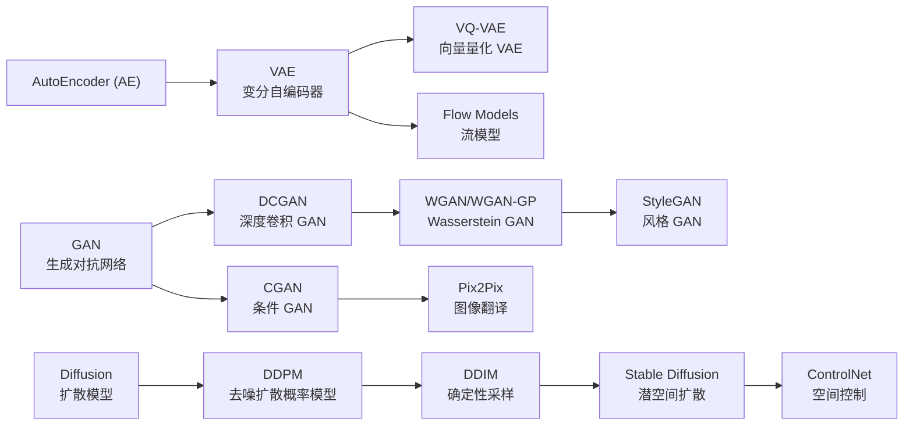
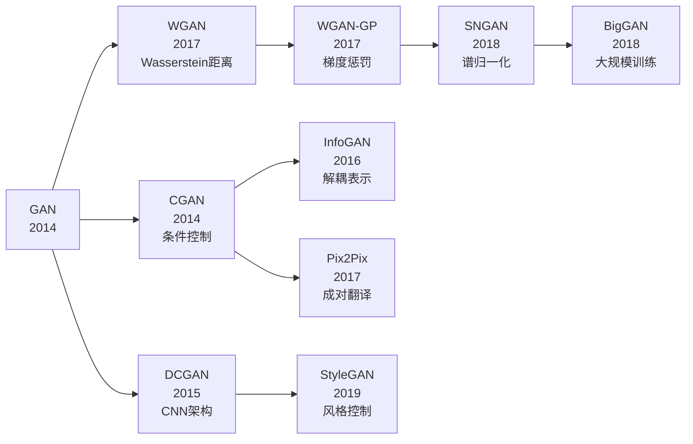
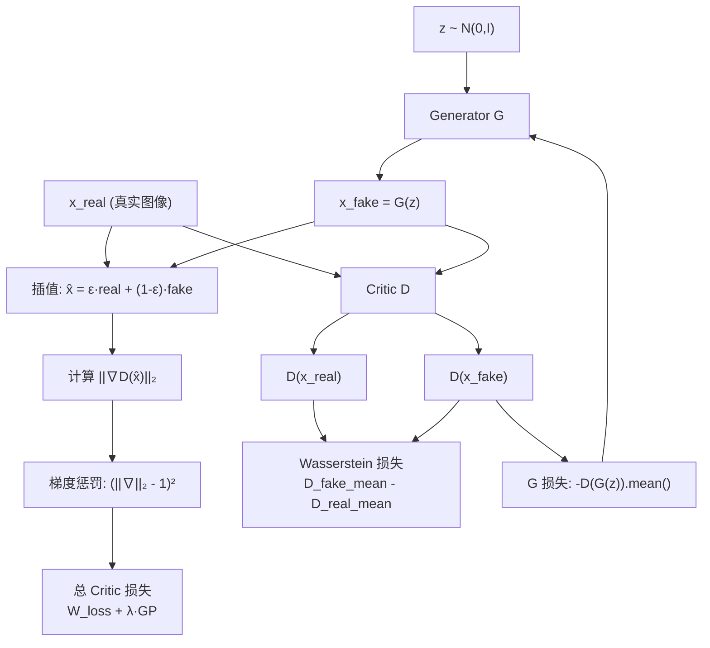
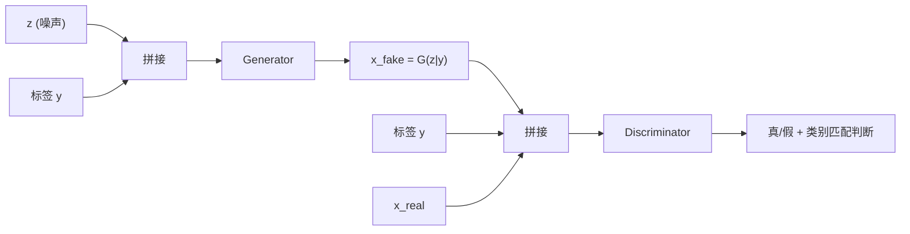
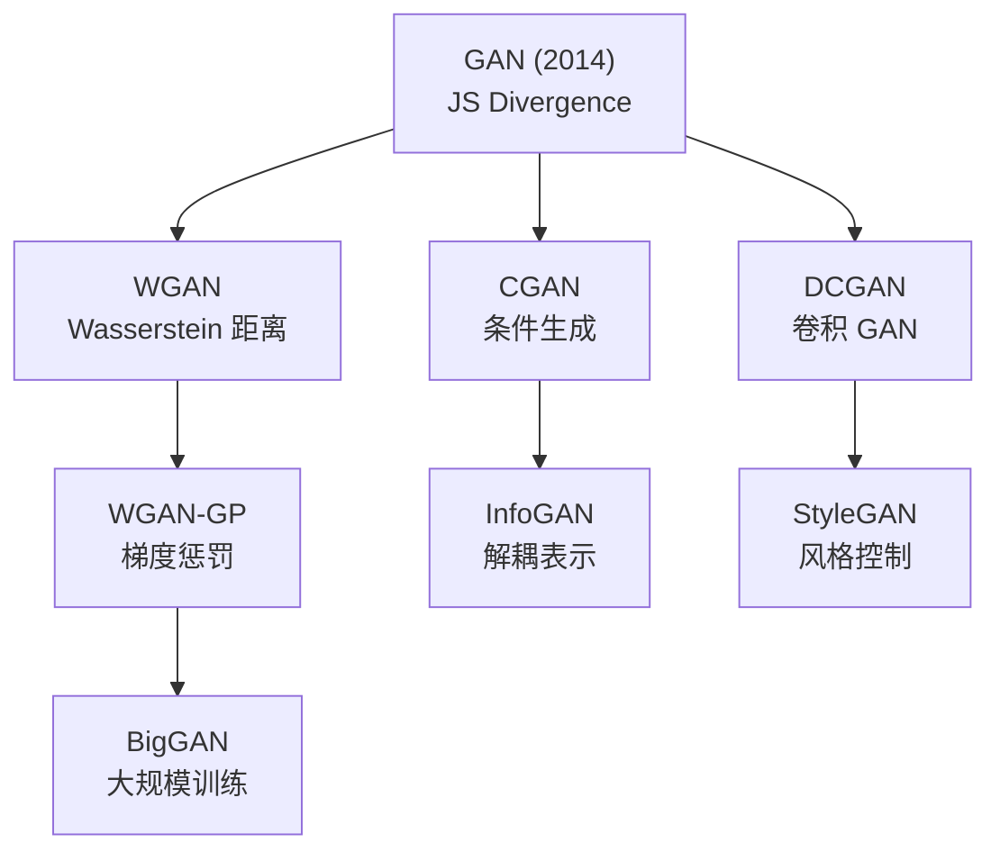

# GAN Advanced (WGAN-GP / CGAN / InfoGAN / BigGAN)

## 知识地图



## 前置知识

- **原始 GAN 原理**：生成器 $G$ 与判别器 $D$ 的 minmax 博弈；JS 散度作为分布距离度量。
- **Wasserstein 距离**：推土机距离（Earth-Mover Distance），衡量将一个分布变为另一个分布的"最小搬运成本"。
- **Lipschitz 连续**：函数输出的变化不超过输入变化的 $L$ 倍。WGAN 要求 Critic 满足 1-Lipschitz 约束。
- **互信息 (Mutual Information)**：衡量两个随机变量之间的依赖程度。InfoGAN 用它来解耦生成控制因子。

## 模型演化路线



| Model | Year | Key Innovation | Solved Problem |
|-------|------|----------------|----------------|
| GAN | 2014 | 对抗训练框架 | 隐式生成模型，无需显式似然 |
| CGAN | 2014 | 条件向量输入 | 控制生成内容 |
| DCGAN | 2015 | CNN 架构替代全连接 | 提升图像质量与稳定性 |
| InfoGAN | 2016 | 互信息最大化 | 无监督解耦控制因子 |
| WGAN | 2017 | Wasserstein 距离 | JS 散度梯度消失问题 |
| WGAN-GP | 2017 | 梯度惩罚替代权重裁剪 | WGAN 训练不稳定 |
| SNGAN | 2018 | 谱归一化 | 全局 1-Lipschitz 约束 |
| BigGAN | 2018 | 大 Batch + 正交正则化 | GAN 大规模训练可行性 |
| StyleGAN | 2019 | 风格调制 + 渐进增长 | 精细控制生成图像的风格 |

## 为什么会出现 (Why)

原始 GAN 训练极不稳定——模式坍塌（生成器只产出少数几种样本）、梯度消失（JS 散度真假分布不重叠时梯度为 0）、难以收敛。这些问题根源于两个缺陷：

1. **JS 散度不适合衡量低维流形支撑的分布**：当真假分布不重叠时，JS 散度恒为常数 $\log 2$，梯度为 0。
2. **缺乏控制能力**：无法指定生成内容（如"生成猫"和"生成狗"），也无法解耦不同属性。

因此出现了两条改进路线：
- **更好的分布距离**：WGAN (Wasserstein 距离) → WGAN-GP (梯度惩罚) → SNGAN (谱归一化)
- **条件与控制**：CGAN (外加类别) → InfoGAN (自动解耦) → Pix2Pix (成对翻译)

## 解决什么问题 (Problem)

| 变体 | 解决的核心问题 |
|------|-------------|
| WGAN | JS 散度梯度消失——用 Wasserstein 距离提供平滑梯度 |
| WGAN-GP | 权重裁剪导致训练不稳定——用梯度惩罚温柔地施加 Lipschitz 约束 |
| CGAN | GAN 生成内容不可控——加条件标签指定类别 |
| InfoGAN | 需要手动标注控制因子——用互信息自动发现解耦维度 |
| BigGAN | GAN 无法大规模训练——工程技巧实现高分辨率高质量生成 |

## 核心思想 (Core Idea)

**用更好的概率分布距离度量（Wasserstein 距离）替代 JS 散度，通过梯度惩罚稳定训练，同时引入条件控制和互信息最大化，让 GAN 从"随机生成"走向"可控、稳定、大规模"。**

---

## 数学模型/公式

### WGAN — Wasserstein 距离

JS 散度的问题：当真假分布不重叠时，梯度为 0。WGAN 用 Earth-Mover 距离替代：

$$
W(P_r, P_g) = \sup_{\|f\|_L \leq 1} \mathbb{E}_{\mathbf{x} \sim P_r}[f(\mathbf{x})] - \mathbb{E}_{\tilde{\mathbf{x}} \sim P_g}[f(\tilde{\mathbf{x}})]
$$

**通俗解释：** $f$ 是一个"评分函数"（Critic，不是判别器），它给真实图片打高分、给生成图片打低分。1-Lipschitz 约束让评分不能太极端——两张看起来差不多的图得分差距不能太大。WGAN 最大化这个"真-假得分差"来逼近 Wasserstein 距离。

$f$ 是 1-Lipschitz 函数（Critic，不再是"判别器"）。Critic 的输出是真实值而非概率。WGAN 损失：

$$
\min_G \max_{\|D\|_L \leq 1} \mathbb{E}_{x \sim P_r}[D(x)] - \mathbb{E}_{z \sim P_z}[D(G(z))]
$$

**通俗解释：** Critic $D$ 拼命拉大真图和假图的得分差，Generator $G$ 拼命让假图得分接近真图。和原始 GAN 的区别：$D$ 输出是实数而非概率，损失不取 log。这给了 Generator 持续可用的梯度（而不是"真假分布不重叠时梯度为 0"的绝望）。

### WGAN-GP — 梯度惩罚

WGAN 用权重裁剪实现 Lipschitz 约束，但会导致训练不稳定。WGAN-GP 用**梯度惩罚**替代：

$$
\mathcal{L}_{GP} = \lambda \cdot \mathbb{E}_{\hat{\mathbf{x}} \sim P_{\hat{x}}} \left[(\|\nabla_{\hat{\mathbf{x}}} D(\hat{\mathbf{x}})\|_2 - 1)^2\right]
$$

**通俗解释：** 不在权重上硬砍，而是在真假样本的连线上采样 $\hat{x}$，要求 Critic 在这些点上的梯度范数恰好等于 1。等于 1 意味着"评分变化不快不慢"——这是 1-Lipschitz 的软约束。比直接裁剪权重优雅得多。

其中 $\hat{\mathbf{x}} = \epsilon \mathbf{x} + (1-\epsilon) G(\mathbf{z})$ 是在真假样本连线上的采样，$\lambda = 10$。

直觉：强制 Critic 在真-假连线上梯度范数接近 1，平滑地引导 Generator。

### InfoGAN — 解耦表示学习

在 GAN 的目标中加入互信息项，让一部分隐含编码 $c$ 控制特定的生成属性：

$$
\min_G \max_D V(D, G) - \lambda \cdot I(c; G(z, c))
$$

**通俗解释：** 标准 GAN 中噪声 $z$ 的每个维度不知道控制什么。InfoGAN 把 $z$ 拆成两部分：纯随机噪声 + 结构化编码 $c$。互信息 $I(c; G(z,c))$ 衡量"从生成的图里能否反推出 $c$"。最大化它 = 让 $c$ 确实控制了图中的某些属性（如数字的角度、粗细），而不是被生成器忽略。

$I(c; G(z,c))$ 是互信息——衡量编码 $c$ 和生成图像之间的关联强度。用变分下界近似 $I$：

$$
I(c; G(z, c)) \geq \mathbb{E}_{c \sim P(c), x \sim G(z,c)} [\log Q(c|x)] + H(c)
$$

**通俗解释：** 直接算互信息需要后验 $P(c|x)$，无法获得。InfoGAN 训练一个辅助网络 $Q(c|x)$（和 $D$ 共享底层）来从图像推断 $c$。如果 $Q$ 能准确猜出 $c$，说明 $c$ 确实被编码到了图里——互信息大。

$Q(c|x)$ 是一个辅助网络（与 D 共享大部分层），从生成图像中推断编码 $c$。

### Conditional GAN (CGAN)

将条件信息（如类别标签）同时输入 Generator 和 Discriminator：

$$
\min_G \max_D \mathbb{E}_{x \sim P_r}[\log D(x|y)] + \mathbb{E}_{z \sim P_z}[\log(1 - D(G(z|y)|y))]
$$

**通俗解释：** 就是把条件 $y$（比如"猫"这个标签）同时告诉 $G$ 和 $D$。$G$ 说"给我猫标签，我画只猫"；$D$ 说"我知道了这是猫，那这张图和猫应该像吗？" 两者的博弈被条件"框定"，生成结果可控。

### BigGAN — 大规模 GAN 训练

关键工程技巧：
- **大 Batch**（2048）提升稳定性
- **正交正则化**：$R_\beta(W) = \beta \|W^T W - I\|_F^2$ 防止权重矩阵各向异性
- **截断技巧**（Truncation Trick）：采样 $z$ 时用阈值截断（$\|z\| \leq r$ 则重采样）
- **共享嵌入**：分类条件嵌入与 G 的 BN 层参数共享

---

## 模型结构图

### WGAN-GP 训练流程



### CGAN 架构



---

## 可视化展示

### GAN 演进树



### GAN 训练稳定性

```echarts
return {
  tooltip: { trigger: "axis", confine: true },
  title: { top: 5,  text: '不同 GAN 的 Inception Score (CIFAR-10)', left: 'center', textStyle: { fontSize: 12 } },
  xAxis: { type: 'category', data: ['DCGAN', 'WGAN', 'WGAN-GP', 'BigGAN', 'StyleGAN2'] },
  yAxis: { type: 'value', min: 5, max: 11, name: 'Inception Score' },
  series: [{
    type: 'bar',
    data: [6.4, 6.7, 7.9, 9.2, 9.9],
    itemStyle: { color: '#2c3e50' },
    label: { show: true, position: 'top' }
  }],
  grid: { left: 60, right: 20, top: 55, bottom: 55 }
}
```

### Wasserstein 距离 vs JS 散度

```echarts
return {
  tooltip: { trigger: "axis", confine: true },
  title: { top: 5,  text: 'Wasserstein 距离 vs JS 散度 (训练过程)', left: 'center', textStyle: { fontSize: 12 } },
  xAxis: { type: 'category', data: ['Epoch 0', 'Epoch 10', 'Epoch 20', 'Epoch 50', 'Epoch 100', 'Epoch 200'] },
  yAxis: [
    { type: 'value', name: 'Wasserstein 距离', min: 0 },
    { type: 'value', name: 'JS 散度', min: 0, max: 1 }
  ],
  legend: { top: 28,  data: ['Wasserstein 距离', 'JS 散度'] },
  series: [
    { name: 'Wasserstein 距离', type: 'line', yAxisIndex: 0, data: [8.2, 5.1, 3.2, 1.5, 0.8, 0.3], smooth: true, itemStyle: { color: '#2980b9' } },
    { name: 'JS 散度', type: 'line', yAxisIndex: 1, data: [0.69, 0.69, 0.68, 0.65, 0.55, 0.40], smooth: true, itemStyle: { color: '#e74c3c' } }
  ],
  grid: { left: 60, right: 60, top: 55, bottom: 55 }
}
```

Wasserstein 距离持续下降提供有意义的梯度信号；JS 散度早期几乎不变（梯度消失）。

---

## 最小可运行代码

### PyTorch — WGAN-GP 梯度惩罚

```python
import torch
import torch.nn as nn

def gradient_penalty(critic, real, fake, device):
    """WGAN-GP 梯度惩罚"""
    B = real.size(0)
    epsilon = torch.rand(B, 1, 1, 1, device=device)
    # 在真-假之间插值
    interpolates = epsilon * real + (1 - epsilon) * fake
    interpolates.requires_grad_(True)

    critic_interpolates = critic(interpolates)

    # 计算对插值图像的梯度
    gradients = torch.autograd.grad(
        outputs=critic_interpolates,
        inputs=interpolates,
        grad_outputs=torch.ones_like(critic_interpolates),
        create_graph=True, retain_graph=True)[0]

    gradients = gradients.view(B, -1)
    gradient_norm = gradients.norm(2, dim=1)
    gp = ((gradient_norm - 1) ** 2).mean()
    return gp


def wgan_gp_loss(G, D, real, z, lambda_gp=10):
    fake = G(z)
    d_real = D(real)
    d_fake = D(fake.detach())

    # Critic 损失: 最大化真-假差异
    d_loss = d_fake.mean() - d_real.mean()
    gp = gradient_penalty(D, real, fake.detach(), z.device)
    d_loss_total = d_loss + lambda_gp * gp

    # Generator 损失
    g_loss = -D(fake).mean()

    return d_loss_total, g_loss
```

### PyTorch — Conditional GAN

```python
class Generator(nn.Module):
    def __init__(self, latent_dim=100, num_classes=10, img_channels=3):
        super().__init__()
        self.label_emb = nn.Embedding(num_classes, latent_dim)
        self.main = nn.Sequential(
            nn.ConvTranspose2d(latent_dim * 2, 512, 4, 1, 0), nn.BatchNorm2d(512), nn.ReLU(True),
            nn.ConvTranspose2d(512, 256, 4, 2, 1), nn.BatchNorm2d(256), nn.ReLU(True),
            nn.ConvTranspose2d(256, 128, 4, 2, 1), nn.BatchNorm2d(128), nn.ReLU(True),
            nn.ConvTranspose2d(128, img_channels, 4, 2, 1), nn.Tanh())

    def forward(self, z, labels):
        # z: [B, latent_dim], labels: [B]
        label_emb = self.label_emb(labels)
        x = torch.cat([z, label_emb], dim=1)  # [B, 2*latent_dim]
        return self.main(x.unsqueeze(-1).unsqueeze(-1))
```

---

## 工业界应用

| 应用领域 | 使用模型 | 为什么 | 知名产品/项目 |
|---------|---------|-------|-------------|
| 图像生成 | BigGAN / StyleGAN | 高质量多样本生成 | StyleGAN (NVIDIA), BigGAN (DeepMind) |
| 图像翻译 | CGAN / Pix2Pix | 条件控制成对映射 | Pix2Pix, CycleGAN |
| 超分辨率 | WGAN-GP | 稳定训练 + 感知损失 | ESRGAN |
| 数据增强 | CGAN | 按类别生成训练数据 | 医学图像、缺陷检测 |
| 人脸编辑 | StyleGAN | 风格解耦 + 精细控制 | StyleGAN, StyleCLIP |
| 视频生成 | BigGAN 类 | 大规模稳定训练 | 学术研究项目 |

---

## 对比表格

| 特性 | GAN (原始) | WGAN | WGAN-GP | CGAN | BigGAN |
|------|-----------|------|---------|------|--------|
| 分布距离 | JS 散度 | Wasserstein | Wasserstein | JS 散度 | Wasserstein 类 |
| 训练稳定性 | 低 | 中 | 高 | 低 | 高 (工程技巧) |
| 梯度消失 | 有 | 无 | 无 | 有 | 无 |
| Lipschitz 约束 | 无 | 权重裁剪 | 梯度惩罚 | 无 | 正交正则化 |
| 条件控制 | 无 | 无 | 无 | 有 | 有 (类别条件) |
| 模式坍塌 | 常见 | 较少 | 很少 | 常见 | 很少 |
| 生成分辨率 | 低 | 低 | 中 | 低 | 高 (512x512+) |
| 收敛指示 | 无 | Loss 下降 | Loss 下降 | 无 | Loss 下降 |

---

## 学完后建议继续学习

1. **StyleGAN / StyleGAN2 / StyleGAN3** — WGAN-GP 之后，风格调制 + 渐进增长让 GAN 达到图像生成的艺术级水准。
2. **Pix2Pix / CycleGAN** — CGAN 在图像翻译中的经典应用，理解"成对"和"非成对"翻译的区别。
3. **扩散模型 (DDPM / DDIM)** — 当前生成模型 SOTA，理解为什么扩散超越了 GAN。
4. **Stable Diffusion** — 潜空间扩散 + 文本条件，WWAN-GP 训练哲学（更好的损失函数）在扩散模型中也有体现。

---

## 高频面试题

### Q1: WGAN 为什么用 Wasserstein 距离替代 JS 散度？

**标准答案：**
原始 GAN 使用 JS 散度衡量真假分布距离。当两个分布支撑集不重叠时（这是高维空间中低维流形的常态），JS 散度为常数 $\log 2$，梯度为 0，导致 Generator 无法更新。Wasserstein 距离（Earth-Mover 距离）即使在分布不重叠时也能提供平滑有意义的梯度信号，因为它衡量的是"把一个分布搬成另一个的物理代价"。即便真假分布相距很远，W 距离也能告诉 Generator "往哪个方向走能更近"。

### Q2: WGAN 的权重裁剪 (weight clipping) 有什么问题？WGAN-GP 如何改进？

**标准答案：**
权重裁剪将 Critic 的参数硬性限制在 $[-c, c]$ 范围内以满足 1-Lipschitz 约束。问题：(1) 裁剪阈值 $c$ 难以选择——太小则 Critic 容量不足，太大则约束太松；(2) 权重被推向边界，导致梯度要么极大要么极小，训练震荡。WGAN-GP 用梯度惩罚替代裁剪：在真假样本连线上的点，强制 Critic 的梯度范数接近 1。这是 Lipschitz 约束的软性施加方式——通过惩罚梯度偏离 1 的程度来引导模型，而非暴力裁剪参数。

### Q3: InfoGAN 如何无监督地学习解耦表示？

**标准答案：**
InfoGAN 将输入噪声拆分为 $z$（不可压缩噪声）和 $c$（结构化隐编码）。它在 GAN 损失上额外加一个互信息最大化项 $I(c; G(z,c))$ ——让生成的图像携带编码 $c$ 的信息。由于直接计算互信息需要后验 $P(c|x)$（不可得），InfoGAN 训练辅助网络 $Q(c|x)$ 从生成图像推断 $c$，用变分下界 $\mathbb{E}[\log Q(c|x)] + H(c)$ 近似 $I$。训练后，$c$ 的每个维度自动对应一个独立的语义维度（如 MNIST 中数字的角度、粗细），无需任何标注。

### Q4: CGAN 和 InfoGAN 有什么区别？各适用于什么场景？

**标准答案：**
- **CGAN**：显式条件生成。需要外部标注的条件 $y$（如类别标签、文本描述），Generator 和 Discriminator 均以 $y$ 为输入。适用于"生成指定类别的猫"这种明确任务。
- **InfoGAN**：自动发现隐编码。不需要标注——模型自动将部分噪声维度分配给有意义的属性。适用于"不知道有哪些属性但希望模型自己发现"的无监督探索场景。
- 简单说：CGAN = 你告诉模型要什么，InfoGAN = 模型告诉你它发现了什么。

### Q5: BigGAN 的核心工程技巧有哪些？为什么这些技巧有效？

**标准答案：**
1. **大 Batch (2048)**：更多样本让 BatchNorm 的统计更稳定，Covering 更多分布区域，减少模式坍塌。
2. **截断技巧 (Truncation Trick)**：采样时限制 $\|z\| \leq r$，超过阈值重采样。$z$ 集中在原点附近时生成质量更高（因为训练数据中 $z$ 大多在此区域），但多样性下降。$r$ 越小质量越高但多样性越低——这是质量-多样性权衡。
3. **正交正则化**：$\|W^T W - I\|_F^2$ 强制权重矩阵正交，避免各向异性——使信息在不同方向上均匀流动，提升训练稳定性和参数效率。
4. **共享嵌入**：类别嵌入层与 BN 的 $\gamma$ 和 $\beta$ 参数共享——减少参数量，且让类别信息深度影响每一层的归一化行为。
