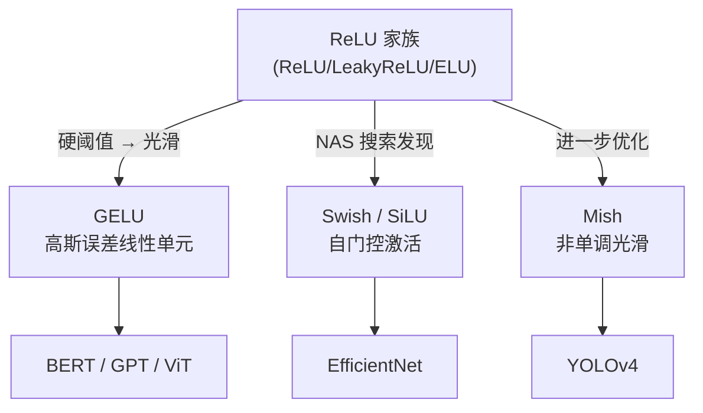

# GELU / Swish / Mish

## 知识地图



## 前置知识

- ReLU 及其变体（LeakyReLU、ELU）的原理与局限
- Sigmoid 和 Tanh 激活函数
- 高斯分布与累积分布函数 (CDF)
- Transformer 架构的基本概念

## 为什么会出现 (Why)

ReLU 家族解决了 Sigmoid/Tanh 的梯度消失问题，但它们都有"硬拐角"——ReLU 在 $x=0$ 处不可导，LeakyReLU/PReLU 在原点有一个尖锐的折角，ELU 虽然光滑但引入了指数运算。更重要的是：ReLU 的"一刀切"设计过于粗暴——负区间信息被全部丢弃，正区间线性输出缺乏灵活性。Transformer 时代需要一种**光滑、非单调、具有自正则化特性**的激活函数。

## 解决什么问题 (Problem)

在深层 Transformer 和大规模视觉模型中：(1) 提供光滑的梯度流动（曲率连续），有利于深层网络的稳定训练；(2) 引入非单调性，允许小的负输出，类似于 Dropout 的随机正则化效果；(3) 在输入较不确定时自动"压低"输出，实现自适应门控。

## 核心思想 (Core Idea)

**GELU/Swish/Mish 抛弃了 ReLU 的"硬阈值"设计，改用光滑非单调曲线——输入越不确定输出越趋近于零，自带类似 Dropout 的随机正则化效果。**

---

## 数学定义与原理解析

### GELU (Gaussian Error Linear Unit)

BERT、GPT、ViT 等主流 Transformer 的默认激活函数。

**精确形式**（基于标准正态分布的 CDF）：

$$
\text{GELU}(x) = x \cdot \Phi(x) = x \cdot \frac{1}{2} \left[1 + \text{erf}\left(\frac{x}{\sqrt{2}}\right)\right]
$$

**通俗解释：** $\Phi(x)$ 是标准正态分布的累积分布函数，表示"$x$ 比一个随机标准正态变量大的概率"。GELU = 输入 $\times$"被保留的概率"。$x$ 很大时 $\Phi(x) \approx 1$，近似线性；$x$ 很小时 $\Phi(x) \approx 0$，输出被压到接近 0；$x$ 在 0 附近时 $\Phi(x) \approx 0.5$，输出被"打折"一半。这相当于对输入做了一种概率性的门控。

**工程近似**（Tanh 近似，速度快，误差极小）：

$$
\text{GELU}(x) \approx 0.5x \left(1 + \tanh\left[\sqrt{\frac{2}{\pi}}(x + 0.044715 x^3)\right]\right)
$$

**通俗解释：** 用 $\tanh$ 替代 $\text{erf}$，避免误差函数的积分计算。精度损失极小（最大误差 < 0.1%），计算速度大幅提升。PyTorch 中 `nn.GELU(approximate='tanh')` 就是此版本。

### Swish / SiLU

Google 通过自动架构搜索（NAS）发现，被 EfficientNet 采纳。

$$
\text{Swish}(x) = x \cdot \sigma(x) = \frac{x}{1 + e^{-x}}
$$

**通俗解释：** Swish = 输入 $\times$ Sigmoid(输入)。和 GELU 的思路一样（输入自门控），但用 Sigmoid 替代了高斯 CDF。$x \to +\infty$ 时 $\sigma(x) \to 1$，退化为线性 $y = x$；$x \to -\infty$ 时 $\sigma(x) \to 0$，输出被压扁；$x \approx 0$ 时产生非单调的"小凹陷"——这是 ReLU 家族没有的特性。

带可学习参数 $\beta$ 的版本：

$$
\text{Swish}_\beta(x) = x \cdot \sigma(\beta x)
$$

- $\beta \to \infty$：$\sigma(\beta x)$ 趋近于阶跃函数，退化为 ReLU
- $\beta \to 0$：$\sigma(\beta x) \to 0.5$，退化为线性函数 $y = 0.5x$
- $\beta = 1$：标准 Swish = SiLU（PyTorch 中两者等价）

### Mish

YOLOv4 中引入，据称在部分任务上优于 Swish 和 ReLU。

$$
\text{Mish}(x) = x \cdot \tanh(\text{softplus}(x)) = x \cdot \tanh(\ln(1 + e^x))
$$

**通俗解释：** 首先 $\text{softplus}(x) = \ln(1+e^x)$ 是 ReLU 的光滑近似（"软 ReLU"），然后取 $\tanh$ 压缩到 $(0, 1)$ 作为门控信号，最后乘以输入。Mish 可视为"用 Softplus 的 Tanh 做门控的 Swish"。继承了 Swish 的优点并在负区间保留了更大的非零输出。

- 下方**无界**：允许大的负输出（正则化效果，避免神经元"自满"）
- 上方**有界**：避免梯度爆炸
- 光滑且非单调，在整个定义域上连续可导

---

## 可视化展示

### GELU / Swish / Mish / ReLU 对比

```echarts
return {
  xAxis: { type: 'value', min: -4, max: 4, name: 'x' },
  yAxis: { type: 'value', min: -0.8, max: 4, name: 'f(x)' },
  legend: { top: 28,  data: ['ReLU', 'GELU', 'Swish', 'Mish'] },
  series: [
    {
      name: 'ReLU', type: 'line',
      lineStyle: { color: '#95a5a6', width: 1.5, type: 'dashed' },
      data: (function() { const d = []; for (let i = -4; i <= 4; i += 0.03) d.push([i, Math.max(0, i)]); return d; })()
    },
    {
      name: 'GELU', type: 'line', smooth: true,
      lineStyle: { color: '#2c3e50', width: 2.5 },
      data: (function() {
        const d = [];
        for (let i = -4; i <= 4; i += 0.03) {
          const x = i;
          const gelu = 0.5 * x * (1 + Math.tanh(Math.sqrt(2 / Math.PI) * (x + 0.044715 * x * x * x)));
          d.push([i, gelu]);
        }
        return d;
      })()
    },
    {
      name: 'Swish', type: 'line', smooth: true,
      lineStyle: { color: '#2980b9', width: 2 },
      data: (function() {
        const d = [];
        for (let i = -4; i <= 4; i += 0.03) d.push([i, i / (1 + Math.exp(-i))]);
        return d;
      })()
    },
    {
      name: 'Mish', type: 'line', smooth: true,
      lineStyle: { color: '#d35400', width: 2 },
      data: (function() {
        const d = [];
        for (let i = -4; i <= 4; i += 0.03) {
          const sp = Math.log(1 + Math.exp(i));
          d.push([i, i * Math.tanh(sp)]);
        }
        return d;
      })()
    }
  ],
  tooltip: { trigger: 'axis' },
  grid: { left: 60, right: 20, top: 40, bottom: 60 }
}
```

### 负区间放大对比（$x \in [-4, 0]$）

注意 GELU/Mish 在负区间的差异——这影响梯度流动和正则化行为：

```echarts
return {
  xAxis: { type: 'value', min: -4, max: 0, name: 'x' },
  yAxis: { type: 'value', min: -0.6, max: 0.4, name: 'f(x)' },
  legend: { top: 28,  data: ['GELU', 'Swish', 'Mish'] },
  series: [
    {
      name: 'GELU', type: 'line', smooth: true,
      lineStyle: { color: '#2c3e50', width: 2 },
      data: (function() {
        const d = [];
        for (let i = -4; i <= 0; i += 0.02) {
          const x = i;
          const gelu = 0.5 * x * (1 + Math.tanh(Math.sqrt(2 / Math.PI) * (x + 0.044715 * x * x * x)));
          d.push([i, gelu]);
        }
        return d;
      })()
    },
    {
      name: 'Swish', type: 'line', smooth: true,
      lineStyle: { color: '#2980b9', width: 2 },
      data: (function() { const d = []; for (let i = -4; i <= 0; i += 0.02) d.push([i, i / (1 + Math.exp(-i))]); return d; })()
    },
    {
      name: 'Mish', type: 'line', smooth: true,
      lineStyle: { color: '#d35400', width: 2 },
      data: (function() {
        const d = [];
        for (let i = -4; i <= 0; i += 0.02) {
          d.push([i, i * Math.tanh(Math.log(1 + Math.exp(i)))]);
        }
        return d;
      })()
    }
  ],
  tooltip: { trigger: 'axis' },
  grid: { left: 60, right: 20, top: 40, bottom: 60 }
}
```

---

## 最小可运行代码

### PyTorch

```python
import torch
import torch.nn as nn
import torch.nn.functional as F

# GELU -- Transformer 标配
nn.GELU()               # 精确版（erf）
nn.GELU(approximate='tanh')  # 快速近似版

# SiLU (Swish) -- PyTorch 内置
nn.SiLU()               # x * sigmoid(x)
F.silu(x)

# Mish -- 需手动实现或使用 timm
def mish(x):
    return x * torch.tanh(F.softplus(x))
```

### NumPy 手写

```python
import numpy as np

def gelu(x):
    return 0.5 * x * (1 + np.tanh(
        np.sqrt(2 / np.pi) * (x + 0.044715 * x**3)
    ))

def swish(x, beta=1.0):
    return x / (1 + np.exp(-beta * x))

def mish(x):
    return x * np.tanh(np.log(1 + np.exp(x)))
```

---

## 工业界应用

| 函数 | 代表模型 | 应用场景 |
|------|----------|----------|
| GELU | BERT / GPT-2/3/4 / ViT / CLIP | 所有主流 Transformer（NLP + CV） |
| Swish/SiLU | EfficientNet / MobileNetV3 | 轻量级 CNN、移动端视觉模型 |
| Mish | YOLOv4 / CSPDarkNet | 目标检测（实验上优于 Swish 的部分场景） |

---

## 对比表格

| | ReLU | GELU | Swish/SiLU | Mish |
|------|------|------|-----------|------|
| 公式 | $\max(0, x)$ | $x \cdot \Phi(x)$ | $x \cdot \sigma(x)$ | $x \cdot \tanh(\ln(1+e^x))$ |
| 光滑性 | $x=0$ 处不可导 | 处处光滑 | 处处光滑 | 处处光滑 |
| 非单调性 | 单调 | 非单调 | 非单调 | 非单调 |
| 负区间 | 0 | 软压缩 (~0) | 软压缩 (~0) | 保留更大负值 |
| 自正则化 | 稀疏激活 | 概率门控 | Sigmoid 门控 | Softplus + Tanh 门控 |
| 计算复杂度 | $O(1)$ | $O(1)$ (tanh approx) | $O(1)$ (sigmoid) | $O(1)$ (softplus+tanh) |
| 代表架构 | ResNet | Transformer | EfficientNet | YOLOv4 |
| 核心创新 | 消除梯度消失 | 概率视角的门控 | NAS 自动发现 | 改进的非单调性 |

---

## 学完后建议继续学习

1. **Transformer 架构 (BERT / GPT)** -- GELU 发挥最大效用的地方
2. **Layer Normalization vs Batch Normalization** -- 与 GELU/Swish 搭配的归一化方案
3. **激活函数搜索 (NAS for Activation)** -- Swish 的发现方式（自动架构搜索）
4. **Dropout 与 GELU 的关系** -- GELU 如何隐式实现类似 Dropout 的正则化

---

## 高频面试题

### Q1: GELU 和 ReLU 的本质区别是什么？为什么 Transformer 全用 GELU？

**答：** 本质区别在于门控方式：ReLU 是确定性的硬阈值（大于 0 全通过，小于 0 全阻断）；GELU 是概率性的软门控（$x \cdot \Phi(x)$，输入乘以"被激活的概率"）。Transformer 选择 GELU 的原因：(1) 光滑曲率连续的梯度有利于深层 Transformer 的稳定训练；(2) 非单调性在负区间保留微小梯度，避免特征完全丢失；(3) 自正则化特性对 Transformer 的大规模参数量非常友好（类似隐式 Dropout）；(4) 实验验证——原始 BERT 论文对比了 ReLU、GELU、ELU，GELU 在所有 NLP 任务上最优。

### Q2: Swish 的 $\beta$ 参数有什么作用？什么情况下调整它？

**答：** $\beta$ 控制 Sigmoid 门控的"硬度"。$\beta \to \infty$ 时 Swish 退化为 ReLU（硬阈值）；$\beta \to 0$ 时退化为线性 $y=0.5x$。$\beta=1$ 是标准 Swish/SiLU。实践中：大 $\beta$ 让门控更"果断"（接近 ReLU 行为），小 $\beta$ 让门控更"柔和"（更大的非单调区域）。在 NAS 搜索的原始实验中 Google 发现 $\beta=1$ 已经足够好，所以后来的工作（EfficientNet）直接使用固定 $\beta=1$ 的版本（SiLU），很少手动调整 $\beta$。

### Q3: Mish 比 Swish 好在哪？什么时候用 Mish 而不是 Swish？

**答：** Mish 的核心优化在负区间：当 $x < 0$ 时，Swish 的 Sigmoid 门控快速趋近于 0（$\sigma(-3)=0.047$），而 Mish 的 $\tanh(\ln(1+e^x))$ 在负区间保留更大的门控值（约为 0.2~0.3），意味着更多负值信息被保留。这使得 Mish 在训练初期有更丰富的梯度信号，并提供了更强的正则化。

使用建议：目标检测（尤其是 YOLO 系列）中 Mish 可能优于 Swish；但在常规分类和大规模 Transformer 中 GELU 仍是经过最充分验证的选择。Mish 的计算开销（两次 exp + tanh + log）是三者中最大的，对推理延迟敏感的场景不适用。

### Q4: GELU 的精确版和 Tanh 近似版有什么区别？什么时候用哪个？

**答：** 精确版用 $\text{erf}$ 函数（误差函数），数学上精确但需要查表或数值积分，计算较慢。Tanh 近似版用多项式拟合逼近，误差小于 0.1%（原文验证），计算速度提升约 2-3 倍。实践中：训练时用精确版可以获得理论上最准确的梯度；推理部署时用 Tanh 近似版（PyTorch `approximate='tanh'`）可以加速。BERT 原始实现用的是精确版，GPT-2 用的是近似版，两者效果无明显差异。

### Q5: ReLU 到 GELU/Swish 的"非单调性"为什么是优点？

**答：** 非单调性意味着函数在负区间先降后升（存在一个小的负"谷"）。这让激活值可以取**小的负值**，在两个方面有益：(1) 输出均值更接近 0，减少层间分布的偏移；(2) 小的负输出对网络起到了类似 Dropout 的正则化作用——某些神经元被轻微"抑制"但不完全"关死"，迫使网络学习更鲁棒的特征。ReLU 一刀切断负值，丢失了这种细粒度的调节能力。
