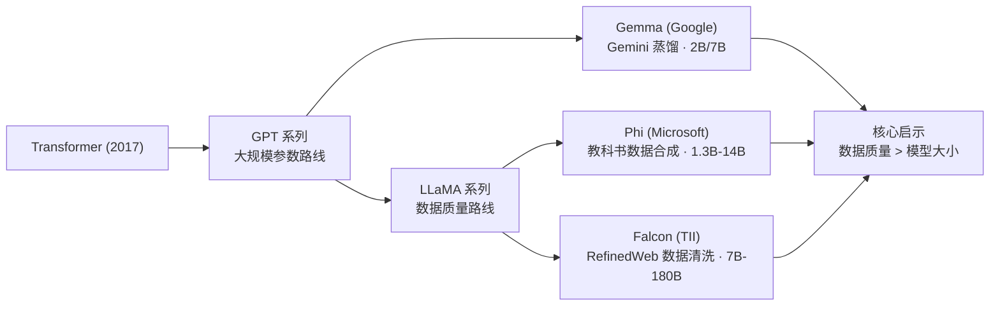
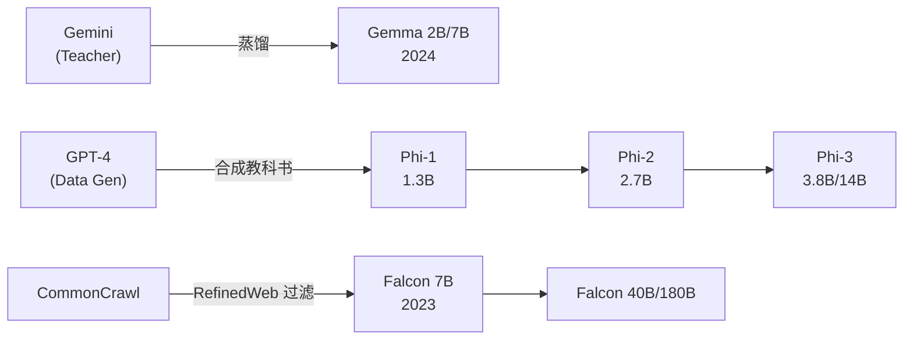
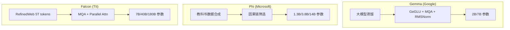
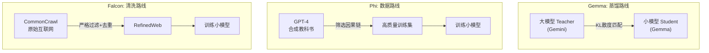

# Gemma / Phi / Falcon (小型大语言模型)

## 知识地图



## 前置知识

- **知识蒸馏原理**：Teacher-Student 模型、KL 散度损失
- **LLaMA 架构**：RMSNorm、SwiGLU、RoPE、GQA
- **注意力机制**：MHA、MQA、GQA 的区别
- **数据集构建**：Web 级文本清洗、去重、质量过滤
- **合成数据**：使用大模型生成训练数据的方法与风险

## 模型演化路线



| Model | Year | Params | Key Innovation |
|-------|------|--------|----------------|
| Gemma | 2024 | 2B / 7B | Gemini 知识蒸馏; GeGLU + MQA + RMSNorm |
| Phi-1 | 2023 | 1.3B | GPT-4 合成教科书数据; 代码专用 |
| Phi-3 | 2024 | 3.8B / 14B | 数据中心方法; 1.4T tokens 高质量数据 |
| Falcon | 2023 | 7B / 40B / 180B | RefinedWeb 5T tokens; MQA + Parallel Attention |

## 为什么会出现 (Why)

不是所有场景都需要 GPT-4 的万亿参数。移动端部署、边缘计算、实时对话、成本敏感型应用都需要能在消费级硬件上运行的小模型。然而传统的做法是直接训练小模型（使用和大模型相同的数据），效果往往很差。

三条独立路径同时发现了同一个秘密：**高质量数据可以让小模型"聪明起来"**。Gemma 通过知识蒸馏从大模型"偷师"，Phi 通过 GPT-4 合成教科书级数据，Falcon 通过对互联网数据极其严格的清洗过滤。三款模型共同证明：小模型不是大模型砍掉 95% 的参数，而是用更好的数据让每一参数"更值钱"。

## 解决什么问题 (Problem)

- **小模型效果差**：传统小模型用和大模型相同的数据训练，表现远不如大模型
- **部署成本高**：175B+ 的模型需要多张 A100/H100 才能推理，不适合边缘/移动端
- **数据浪费**：互联网包含大量低质量文本（广告、垃圾、重复内容），直接用它们训练效率极低
- **特定任务需求**：代码生成、数学推理等任务不一定需要通用知识，可以用针对性数据训练专用小模型
- **知识蒸馏缺失**：大模型的能力如何有效传递给小模型，此前没有成熟方案

## 核心思想 (Core Idea)

通过知识蒸馏、高质量合成数据和严格数据清洗三条路径，用远少于传统大模型的数据和参数，实现接近大模型的领域性能，证明**数据质量比模型大小更重要**。

---

## 数学定义与原理解析

### Gemma — 从 Gemini 蒸馏

Gemma 继承 Gemini 的架构选择，但通过知识蒸馏大幅压缩：

- **GeGLU 激活**：GELU 的门控变体（与 LLaMA 的 SwiGLU 类似）
- **Multi-Query Attention**：所有头共享一组 K, V，大幅减小 KV Cache
- **RMSNorm**：移除了 LayerNorm 的均值中心化操作
- **RoPE**：旋转位置编码

蒸馏损失：
$$
\mathcal{L} = \alpha \cdot \mathcal{L}_{CE}(y, y_{true}) + (1-\alpha) \cdot \mathcal{L}_{KL}(p_{student} \| p_{teacher})
$$

**通俗解释：** 学生模型的训练目标由两部分组成——第一部分是标准的交叉熵损失（确保模型生成正确 token），第二部分是 KL 散度损失（确保学生模型的输出概率分布接近老师模型）。$\alpha$ 控制两者的权重。老师模型（Gemini）不仅告诉学生"正确答案是什么"，还告诉学生"这个问题和哪些 token 相关"，让学生学到更丰富的知识。

### Phi — 数据中心方法

Phi 的核心发现：**教科书的因果链**比互联网文本更适合模型学习推理。数据策略：

1. 用 GPT-4 生成"教科书"——带推理步骤的高质量文本
2. 筛选：保留有明确因果逻辑的内容
3. 合成 + 精选 ≈ 1.4T tokens 训练 Phi-3

Phi-3.8B 在 HumanEval 上匹敌 LLaMA 3 70B。

**通俗解释：** 互联网上的文字大多是"陈述事实"（这个函数做什么），但教科书会"展示推理"（为什么要这样写这个函数，一步步推导）。Phi 让 GPT-4 生成带有完整推理步骤的"教科书"——这种数据让模型不仅学会"是什么"，更重要的是学会"怎么想"。这也解释了为什么 3.8B 的 Phi 在代码推理上能匹敌 70B 的 LLaMA 3。

### Falcon — 大规模数据 + MQA

Falcon 技术栈：
- **RefinedWeb**：从 CommonCrawl 中经过严格过滤（语言识别、困惑度筛选、去重）产生的 5T token 数据集
- **FlashAttention + MQA**：减少训练显存占用
- **Parallel Attention**：在 attention 和 FFN 间用并行路径
- **BPE tokenizer**（而非 SentencePiece）

**通俗解释：** Falcon 的策略是"数据清洗得足够干净，普通架构也能飞"。RefinedWeb 的处理流程极其严格——先识别语言（只要英语），再计算每段文本的困惑度（太乱或太重复的都丢弃），最后去重。从原始的 CommonCrawl（数十 TB）中仅选出质量最高的 5T tokens。配合 MQA 降低显存开销，让 7B 模型也能用合理的成本训练。

---

## 可视化展示

### 小型模型设计哲学



### 三条路径架构对比



### 小型模型性能

```echarts
return {
  tooltip: { trigger: "axis", confine: true },
  title: { top: 5,  text: '小型 LLM HumanEval 对比', left: 'center', textStyle: { fontSize: 12 } },
  xAxis: { type: 'category', data: ['LLaMA3-8B', 'Gemma-7B', 'Phi-3.8B', 'Falcon-7B', 'Mistral-7B'] },
  yAxis: { type: 'value', min: 0, max: 70, name: 'HumanEval Pass@1 (%)' },
  series: [{
    type: 'bar',
    data: [62.2, 54.3, 68.1, 34.7, 52.6],
    itemStyle: { color: '#2c3e50' },
    label: { show: true, position: 'top', formatter: '{c}%' }
  }],
  grid: { left: 60, right: 20, top: 55, bottom: 60 }
}
```

---

## 架构对比

| 特性 | Gemma | Phi-3 | Falcon |
|------|-------|-------|--------|
| 开发方 | Google | Microsoft | TII (阿联酋) |
| 设计路线 | 知识蒸馏 | 数据合成 | 数据清洗 |
| 最大参数 | 7B | 14B | 180B |
| 注意力 | MQA | GQA | MQA |
| 激活函数 | GeGLU | GELU | GELU |
| 归一化 | RMSNorm | RMSNorm | LayerNorm |
| 位置编码 | RoPE | RoPE | RoPE |
| 词表大小 | 256K | 32K | 65K |
| 训练数据 | Gemini 蒸馏 + 精选数据 | GPT-4 合成教科书 1.4T tokens | RefinedWeb 5T tokens |
| 上下文长度 | 8K | 128K (Phi-3-mini) | 2K |
| 开源协议 | Gemma 协议 | MIT | Apache 2.0 |

## 数学模型/公式

### 知识蒸馏 KL 散度损失

$$D_{KL}(p_s \| p_t) = \sum_{i} p_s(i) \log \frac{p_s(i)}{p_t(i)}$$

**通俗解释：** KL 散度衡量学生分布 $p_s$ 和老师分布 $p_t$ 的"距离"。蒸馏训练的目标是最小化这个距离——让学生不仅猜对 token，而且对每个 token 的概率估计都和老师接近。这比单纯的交叉熵包含更多信息——老师对错误选项的判断（比如"cat"和"kitten"虽然没被选，但概率相近）也传递给了学生。

### 蒸馏总损失

$$\mathcal{L} = \alpha \cdot \mathcal{L}_{CE}(y, y_{true}) + (1-\alpha) \cdot \mathcal{L}_{KL}(p_{student} \| p_{teacher})$$

**通俗解释：** $\alpha$ 是"信自己还是信老师"的权重。$\alpha=0.5$ 意味着一半看正确答案（CE 损失），一半模仿老师的判断（KL 损失）。通常从大一些的 $\alpha$ 开始（先学会正确回答），然后逐渐减小 $\alpha$（多听老师的经验）。

### 数据质量筛选（困惑度过滤）

$$\text{Keep}(d) = \begin{cases} \text{True}, & \text{if } \text{PPL}(d) \in [L, U] \\ \text{False}, & \text{otherwise} \end{cases}$$

**通俗解释：** 对于每段文本 d，用一个已经训练好的语言模型计算困惑度（PPL）。如果困惑度太低（太简单/重复），说明这段文本没什么信息量；如果困惑度太高（太混乱/无意义），说明这段文本质量差。只保留困惑度在合理区间 [L, U] 内的文本——Falcon 通过这个策略从几 TB 的原始 CommonCrawl 中筛出了 5T 高质量 tokens。

---

## 核心代码实现

### HuggingFace 加载示例

```python
from transformers import AutoTokenizer, AutoModelForCausalLM

# Gemma
gemma = AutoModelForCausalLM.from_pretrained(
    "google/gemma-2b", torch_dtype="auto", device_map="auto")
# Phi-3
phi = AutoModelForCausalLM.from_pretrained(
    "microsoft/Phi-3-mini-4k-instruct",
    trust_remote_code=True, torch_dtype="auto", device_map="auto")
# Falcon
falcon = AutoModelForCausalLM.from_pretrained(
    "tiiuae/falcon-7b-instruct",
    trust_remote_code=True, torch_dtype="auto", device_map="auto")

def generate(model, tokenizer, prompt, max_tokens=256):
    inputs = tokenizer(prompt, return_tensors="pt").to(model.device)
    outputs = model.generate(**inputs, max_new_tokens=max_tokens,
                              temperature=0.7, do_sample=True)
    return tokenizer.decode(outputs[0], skip_special_tokens=True)
```

### Gemma transformers 使用示例（新 API）

```python
from transformers import AutoTokenizer, AutoModelForCausalLM

model_name = "google/gemma-2-9b-it"
tokenizer = AutoTokenizer.from_pretrained(model_name)
model = AutoModelForCausalLM.from_pretrained(
    model_name, torch_dtype="auto", device_map="auto",
)

chat = [
    {"role": "user", "content": "Explain knowledge distillation in ML briefly."},
]
inputs = tokenizer.apply_chat_template(
    chat, return_tensors="pt", add_generation_prompt=True
).to(model.device)
outputs = model.generate(inputs, max_new_tokens=256)
print(tokenizer.decode(outputs[0], skip_special_tokens=True))
```

### Multi-Query Attention 示意

```python
import torch
import torch.nn as nn

class MultiQueryAttention(nn.Module):
    """MQA: 多个 Q head 共享一组 K, V"""
    def __init__(self, dim=512, n_query_heads=8, n_kv_heads=1):
        super().__init__()
        self.n_heads = n_query_heads
        self.n_kv_heads = n_kv_heads
        self.head_dim = dim // n_query_heads

        self.W_q = nn.Linear(dim, dim)
        self.W_k = nn.Linear(dim, n_kv_heads * self.head_dim)  # 小 K
        self.W_v = nn.Linear(dim, n_kv_heads * self.head_dim)  # 小 V
        self.W_o = nn.Linear(dim, dim)

    def forward(self, x):
        B, N, D = x.shape
        Q = self.W_q(x).view(B, N, self.n_heads, self.head_dim).transpose(1, 2)
        K = self.W_k(x).view(B, N, self.n_kv_heads, self.head_dim).transpose(1, 2)
        V = self.W_v(x).view(B, N, self.n_kv_heads, self.head_dim).transpose(1, 2)
        # K, V 广播到所有 Q heads
        K = K.expand(-1, self.n_heads, -1, -1)
        V = V.expand(-1, self.n_heads, -1, -1)
        attn = torch.softmax(Q @ K.transpose(-2, -1) / (self.head_dim ** 0.5), dim=-1)
        out = (attn @ V).transpose(1, 2).contiguous().view(B, N, D)
        return self.W_o(out)
```

### 知识蒸馏训练简化示例

```python
def distillation_loss(student_logits, teacher_logits, labels, alpha=0.5, T=3.0):
    """
    student_logits: [B, V] 学生模型原始输出
    teacher_logits: [B, V] 老师模型原始输出
    labels: [B] 真实标签
    """
    import torch.nn.functional as F

    # Hard loss: 标准交叉熵
    loss_ce = F.cross_entropy(student_logits, labels)

    # Soft loss: KL 散度 (使用温度 T 软化分布)
    soft_student = F.log_softmax(student_logits / T, dim=-1)
    soft_teacher = F.softmax(teacher_logits / T, dim=-1)
    loss_kl = F.kl_div(soft_student, soft_teacher, reduction='batchmean') * (T ** 2)

    # 总损失
    return alpha * loss_ce + (1 - alpha) * loss_kl
```

## 工业界应用

| 产品/服务 | 底层模型 | 用途 |
|-----------|----------|------|
| Google Vertex AI | Gemma 2B/7B | 云端小模型部署与微调 |
| Google AI Studio | Gemma | 开发者免费试用 |
| Android AICore | Gemma 2B (量化) | 移动端本地推理 |
| Microsoft Copilot | Phi-3 (部分场景) | 代码补全与辅助 |
| Azure AI Studio | Phi-3 全系列 | 企业级小模型服务 |
| Ollama | Gemma/Phi | 本地桌面推理 |
| HuggingFace Spaces | Falcon | 社区部署与演示 |

## 对比表格：小型模型 vs 大型模型

| 维度 | Gemma-7B | Phi-3-14B | Falcon-7B | LLaMA3-8B | GPT-4 |
|------|----------|-----------|-----------|-----------|-------|
| 参数 | 7B | 14B | 7B | 8B | ~1.7T |
| HumanEval (%) | 54.3 | 68.1 | 34.7 | 62.2 | 87+ |
| 推理显存 (INT4) | ~4GB | ~8GB | ~4GB | ~5GB | ~800GB |
| 本地部署 | 可 | 可 | 可 | 可 | 否 |
| 数据策略 | 蒸馏 | 合成 | 清洗 | 大规模 | 全栈 |
| 上下文 | 8K | 128K | 2K | 8K | 128K |

## 学完后建议继续学习

1. **知识蒸馏深入** — 不同的蒸馏策略：Logit-based、Feature-based、Relation-based
2. **Phi-3 数据合成** — 使用大模型生成训练数据的完整流程与质量控制
3. **模型量化** — INT4/INT8 量化让 7B 模型能在手机上运行
4. **llama.cpp** — CPU 推理优化，让任何设备都能跑小模型
5. **ONNX / TensorRT** — 小模型的工业级部署优化

## 高频面试题

### Q1: 为什么 Phi-3.8B 能在 HumanEval 上匹敌 LLaMA 3 70B？这说明了什么？

**标准答案：** Phi-3 的成功源自其"数据中心"方法——用 GPT-4 合成带有完整推理步骤的"教科书级"训练数据（约 1.4T tokens），而非简单地使用互联网爬取数据。这说明了三点：（1）**数据质量远比数据量重要**——经过精心设计和筛选的 1.4T tokens 胜过未经处理的数万 T 互联网文本；（2）**推理能力是"学出来"的**——带有因果链的推理数据能让模型学会"思考"而非"记忆"；（3）**小模型可以专精**——通用大模型需要在所有领域都好，但小模型可以在特定领域（如代码、数学）通过针对性数据达到甚至超越大模型。这打破了"越大越好"的单一叙事。

### Q2: 知识蒸馏（Knowledge Distillation）的核心原理是什么？Gemma 如何使用它？

**标准答案：** 知识蒸馏的核心是让一个小模型（学生）不仅学习正确答案，还要模仿大模型（老师）的输出分布。训练损失 = $\alpha \cdot \mathcal{L}_{CE}$ + $(1-\alpha) \cdot \mathcal{L}_{KL}$。其中的 KL 散度部分让学生学习老师对"所有可能答案"的概率估计，这包含了丰富的暗知识——比如"cat"和"kitten"虽然只有一个是正确答案，但老师知道它们高度相关。Gemma 从 Gemini（大规模多模态模型）蒸馏得到架构选择和权重初始化，再在精选数据上微调。蒸馏的关键技巧是温度参数 T——软化概率分布让暗知识更"可见"。

### Q3: MQA (Multi-Query Attention) 的优缺点是什么？什么时候应该用 MQA 而不是 GQA？

**标准答案：** MQA 的优点是 KV Cache 极小（所有 Q head 共享一组 KV），推理时显存占用最低、速度最快，特别适合显存受限的场景（移动端、边缘设备）。缺点是表现力不如 GQA——所有 Q head 被强制使用相同的 K 和 V，限制了不同 head 关注不同信息的能力。**选择依据：** 如果显存/计算极度受限（Gemma 2B 在手机上运行），用 MQA；如果显存稍宽裕且追求性能（LLaMA 3 8B），用 GQA；如果要多模态理解（Gemma 跨模态场景），MQA 可能不足。

### Q4: RefinedWeb 的数据清洗流程是怎样的？为什么数据清洗对 Falcon 这么重要？

**标准答案：** RefinedWeb 的清洗流程包括：**去重**（MinHash 检测近似重复）、**语言过滤**（fastText 语言识别）、**质量过滤**（计算每段文本的困惑度，保留中等 PPL 区间的文本——太简单的没有信息量，太混乱的无法学习）、**启发式过滤**（移除太短/太长/特殊字符过多的文本）。Falcon 团队认为：与其设计复杂的模型架构，不如把数据清洗做到极致。RefinedWeb 从原始的 CommonCrawl（数十 TB 原始数据）中仅保留了 5T 高质量 tokens，证明了"洗数据"本身就是一种关键竞争力。

### Q5: 什么场景下应该选择小模型（<10B）而不是大模型（100B+）？

**标准答案：** 选择小模型的典型场景：（1）**边缘/移动端部署**——手机、IoT 设备需要本地推理，显存/内存有限；（2）**实时性要求高**——小模型推理延迟低（毫秒级），适合对话、代码补全等场景；（3）**成本敏感**——小模型在 CPU 上也能跑，不需要昂贵的 GPU 集群；（4）**领域专精**——在特定领域（如代码、医疗）通过高质量数据训练的小模型可以匹敌通用大模型；（5）**隐私要求**——本地推理数据不出设备。不适用小模型的场景：需要广泛世界知识（百科问答）、复杂多步推理（数学证明）、多模态理解等需要大模型"涌现能力"的任务。
